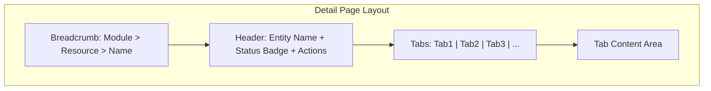
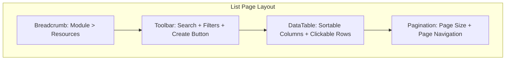

# Nexora - UX/UI Design Standards

> Complements [FRONTEND_STANDARDS.md](FRONTEND_STANDARDS.md) (tech stack, state management, code patterns).
> This document covers **layout, interaction, and visual design** decisions.

## 1. Design Principles

| Principle | Description |
|-----------|-------------|
| **Consistency** | All modules follow the same layout templates, component patterns, and interaction behaviors. |
| **Progressive Disclosure** | Show summary first, reveal detail on demand (tabs, expandable sections, modals). |
| **Accessibility First** | ARIA attributes, keyboard navigation, screen reader support on every interactive element. |
| **Mobile-Responsive** | Desktop-first design with responsive grid — usable on tablets and mobile. |
| **RTL Support** | Use Tailwind `rtl:` utilities; layout must mirror correctly for Arabic and other RTL locales. |

## 2. Page Layout Standards

### 2.1 Detail Pages — Tab-Based Layout (Mandatory)

All entity detail pages MUST use the tab-based layout. Card-based side-by-side layouts are **not permitted** for detail pages.

**Standard Template:**



**Rules:**

- Use tabs when a detail page has 2 or more content sections — never cards side by side.
- Maximum **5 tabs** per page. If you need more, consolidate related sections into the Overview tab (e.g., Tags and Custom Fields are sections within Overview, not separate tabs).
- First tab is always **"Overview"** or **"Details"** (the primary information).
- Tab labels MUST use translation keys (`t('lockey_module_tab_overview')`).
- Each tab loads content lazily — do not fetch data for inactive tabs.
- Tab state uses `useState` (not URL params — keep URL clean).
- Tab content MUST show `TabContentSkeleton` while data is loading (see §3.5).
- Tab switch MUST reset scroll position: `window.scrollTo({ top: 0, behavior: 'smooth' })`.

**Implementation pattern** (custom underline tabs — consistent with ContactDetailPage/DocumentDetailPage):

```tsx
import { cn } from '@/shared/lib/utils';

type TabKey = 'overview' | 'history';

export default function EntityDetailPage() {
  const { t } = useTranslation('module');
  const [activeTab, setActiveTab] = useState<TabKey>('overview');

  const tabs: { key: TabKey; label: string }[] = [
    { key: 'overview', label: t('lockey_module_tab_overview') },
    { key: 'history', label: t('lockey_module_tab_history') },
  ];

  return (
    <div className="space-y-6">
      {/* Header — entity name, badges, and actions grouped logically */}
      <div className="flex items-center justify-between">
        <div>
          <h1 className="text-2xl font-semibold">{entity.name}</h1>
          <div className="flex items-center gap-2 mt-1">
            <StatusBadge status={entity.status} />
            <span className="text-sm text-muted-foreground">{metadata}</span>
          </div>
        </div>
        <div className="flex gap-2">
          {/* Action buttons */}
        </div>
      </div>

      {/* Tab navigation — underline style */}
      <div className="flex gap-1 border-b">
        {tabs.map((tab) => (
          <button
            key={tab.key}
            type="button"
            onClick={() => { setActiveTab(tab.key); window.scrollTo({ top: 0, behavior: 'smooth' }); }}
            className={cn(
              'px-4 py-2 text-sm font-medium border-b-2 transition-colors',
              activeTab === tab.key
                ? 'border-primary text-primary'
                : 'border-transparent text-muted-foreground hover:text-foreground'
            )}
          >
            {tab.label}
          </button>
        ))}
      </div>

      {/* Tab content — conditional rendering */}
      {activeTab === 'overview' && <OverviewContent entity={entity} />}
      {activeTab === 'history' && <HistoryContent entityId={entity.id} />}
    </div>
  );
}
```

**Do NOT use** shadcn/Radix UI `Tabs` component — use the custom underline pattern above for visual consistency across all modules.

### 2.2 List Pages

**Standard Template:**



**Rules:**

- Search, filter, sort, and pagination state MUST be stored in URL query params — not component state.
- Row click navigates to the detail page.
- **Actions column** is always the last (rightmost) column.
- **Create button** is top-right, `variant="default"` (primary).
- Use `SearchInput` component (debounced at **300ms**, includes clear button).
- Filter dropdowns MUST use shadcn `Select` — never native `<select>`.
- Page size options: `[10, 20, 50]`.
- Default sort must be deterministic (e.g., `createdAt desc`).
- **Every list page MUST have a search field** — even if it's client-side filtering.
- Empty state MUST use the `EmptyState` component with contextual icon, title, description, and CTA (see §3.4).
- When filters are active and no results found, show a different empty state message ("No results match your filters").

### 2.3 Create/Edit Pages

| Entity Complexity | Pattern | Example |
|-------------------|---------|---------|
| Simple (< 6 fields) | Modal dialog (shadcn `Dialog`) | Create Role, Add Tag |
| Complex (6+ fields, relations) | Dedicated page with form | Create Contact, Create Document |

**Form Rules:**

- All forms use **React Hook Form + Zod** (see FRONTEND_STANDARDS.md §6.4).
- Labels are **above inputs** — never use placeholder text as the only label.
- Required fields MUST show a red `*` asterisk next to the label.
- Optional hint text below the label in `text-xs text-muted-foreground`.
- Error messages display **below the field** in `text-destructive` color.
- Use `FormField` wrapper component (`shared/components/data/FormField.tsx`) for consistent label + required + hint + error layout.
- Cancel and Submit buttons at the **bottom-right** of the form.
- Submit button shows a spinner and is disabled during `isPending`.
- Dirty form navigation MUST be guarded with `useUnsavedChangesGuard` hook — shows a `ConfirmDialog` before navigating away.
- Textarea fields with character limits MUST use `TextareaWithCounter` component.

## 3. Component Standards

### 3.1 Status Display

- Always use a dedicated `{Entity}StatusBadge` component per entity type.
- Consistent color mapping across the entire application:

| Status | Color | Tailwind Class |
|--------|-------|----------------|
| Active / Published / Approved | Green | `bg-green-100 text-green-800 dark:bg-green-900 dark:text-green-300` |
| Inactive / Archived / Revoked | Gray | `bg-gray-100 text-gray-800 dark:bg-gray-800 dark:text-gray-300` |
| Error / Rejected / Failed | Red | `bg-red-100 text-red-800 dark:bg-red-900 dark:text-red-300` |
| Pending / Draft / Processing | Yellow | `bg-yellow-100 text-yellow-800 dark:bg-yellow-900 dark:text-yellow-300` |

- Badges MUST include both color and an icon/text — color alone must not convey meaning (accessibility).

### 3.2 Actions

| Context | Pattern |
|---------|---------|
| Page-level primary actions | Top-right of page header (Button or DropdownMenu) |
| Destructive actions (delete, revoke) | Require `ConfirmDialog` with explicit confirmation. Use `useUndoableDelete` for soft-delete entities to show an "Undo" toast with 5-second restore window. |
| Inline table actions | Icon buttons in the Actions column (last column) |
| Edit mode toggle | Edit icon button switches content to Save/Cancel mode. Use a bordered Card section for edit fields (not inline header replacement). |
| Logout | Requires `ConfirmDialog` (destructive variant) |

### 3.3 Navigation

- **Breadcrumb** is required on every page.
- Pattern: `Module > Resource List > Entity Name`
- Back navigation is done via breadcrumb links — do not add a separate "Back" button.
- Breadcrumb component: shadcn/ui `Breadcrumb`.

### 3.4 Empty States

Use the **`EmptyState` component** (`shared/components/feedback/EmptyState.tsx`) — never build empty states inline.

**Props:** `icon?: LucideIcon`, `title: string`, `description?: string`, `action?: { label, onClick } | ReactNode`

**Usage in DataTable:** Pass via `emptyState` prop — DataTable also accepts `emptyMessage` as a simpler fallback.

**Two empty state variants per list page:**
1. **No data at all:** Show entity-specific icon + "No items yet" + CTA button to create.
2. **Filters active, no match:** Show search icon + "No results match your filters" message (use `lockey_common_no_results_filtered`).

```tsx
import { EmptyState } from '@/shared/components/feedback/EmptyState';
import { Contact } from 'lucide-react';

// In list page:
const emptyStateNode = useMemo(() => {
  if (hasActiveFilters) {
    return (
      <EmptyState
        icon={Contact}
        title={t('lockey_common_no_results_filtered', { ns: 'common' })}
      />
    );
  }
  return (
    <EmptyState
      icon={Contact}
      title={t('lockey_contacts_empty_title')}
      description={t('lockey_contacts_empty_description')}
      action={{ label: t('lockey_contacts_empty_create'), onClick: () => navigate('/contacts/create') }}
    />
  );
}, [hasActiveFilters, t, navigate]);

// Pass to DataTable:
<DataTable emptyState={emptyStateNode} ... />
```

### 3.5 Loading States

| Scenario | Component | Details |
|----------|-----------|---------|
| Initial page load | `LoadingSkeleton` | Used in `Suspense` fallback and detail page initial load |
| Tab content loading | **`TabContentSkeleton`** | Variants: `list` (5 rows), `form` (4 label+input pairs), `cards` (2x2 grid). Every tab with async data MUST use this. |
| Table data loading | `DataTable isLoading` | Built-in 5-row skeleton in DataTable |
| Mutation in progress | Spinner inside button | Button text changes + `disabled` |
| Navigation / route change | `Suspense` fallback | `LoadingSkeleton` in `AppLayout` |
| Modal dropdown search | `SearchableDropdown isLoading` | Built-in spinner + "Searching..." text |

```tsx
import { TabContentSkeleton } from '@/shared/components/feedback/TabContentSkeleton';

// In a tab sub-component:
function NotesTab({ contactId }: { contactId: string }) {
  const { data: notes, isPending } = useNotes(contactId);

  if (isPending) return <TabContentSkeleton variant="list" />;

  return ( /* actual content */ );
}
```

- Never show a blank page or tab — always show a skeleton or spinner.
- Disable interactive elements while mutations are pending.

## 4. Spacing & Typography

| Element | Value |
|---------|-------|
| Page padding | `p-6` |
| Section spacing | `space-y-6` |
| Card padding | `p-4` (compact) or `p-6` (standard) |
| Page title | `text-2xl font-semibold` |
| Section heading | `text-lg font-semibold` |
| Body text | `text-sm` |
| Muted/secondary text | `text-sm text-muted-foreground` |
| Gap between inline items | `gap-2` (tight) or `gap-4` (standard) |

## 5. Color & Theme

- Use **shadcn/ui CSS variables** exclusively — never hardcode hex/rgb values.
- Status colors follow the mapping in section 3.1.
- Dark mode is supported via the `class` strategy (`<html class="dark">`).
- All custom UI must look correct in both light and dark themes.
- Refer to `globals.css` for the full token list (see FRONTEND_STANDARDS.md §7.2).

## 6. Accessibility

| Requirement | Implementation |
|-------------|----------------|
| ARIA labels | All interactive elements (`button`, `input`, `link`) must have `aria-label` or visible label text |
| Keyboard navigation | `Tab` to move focus, `Enter`/`Space` to activate, `Escape` to close modals/dropdowns |
| Focus indicators | Visible focus ring (`focus-visible:ring-2 focus-visible:ring-ring focus-visible:ring-offset-background`) on all focusable elements |
| Color + icon | Status and errors must use icon/text alongside color — never color alone |
| Screen readers | Use `sr-only` class for visually hidden but screen-reader-accessible text |
| Semantic HTML | Use `<nav>`, `<main>`, `<section>`, `<article>` — not generic `<div>` for structural elements |
| Skip link | `AppLayout` MUST include a skip-to-content link (`<a href="#main-content">`) as the first focusable element |
| Table ARIA | `DataTable` accepts `aria-label` prop; sortable columns render `aria-sort` attribute |
| Pagination ARIA | Previous/Next buttons MUST have `aria-label` (e.g., `lockey_common_previous_page`) |
| Combobox pattern | `SearchableDropdown` implements `role="combobox"` + `role="listbox"` + `role="option"` with `aria-expanded` and `aria-activedescendant` |

## 7. Internationalization (i18n)

- **Zero hardcoded strings** — every user-visible string uses `t('lockey_...')`.
- Key format: `lockey_{module}_{context}_{descriptor}` (see LOCALIZATION_STANDARDS.md).
- RTL layout: use Tailwind `rtl:` utilities for directional spacing and alignment.
- Tab labels, breadcrumbs, button text, empty states, error messages — all translated.
- New UI components must have translation keys added to both `en` and `tr` files before merge.

## 8. Migration Guide: Card-Based to Tab-Based Detail Pages

Existing detail pages that use a card-based layout (e.g., `UserDetailPage`, `RoleDetailPage` in the Identity module) must be migrated to the tab-based template.

**Migration steps:**

1. Identify all content sections currently displayed as side-by-side cards.
2. Group related sections into tabs (max 6).
3. Replace the card grid with the **custom underline tab pattern** (see Section 2.1). Do NOT use shadcn/Radix `Tabs` — use `<button>` elements with `border-b-2` styling for visual consistency.
4. Use `useState` for tab state (keep URL clean).
5. Ensure the first tab ("Overview" or "Details") contains the most important information.
6. Header layout: entity name + badges grouped on the left, action buttons on the right. Keep related information visually close — don't spread heading far-left and metadata far-right.
7. Update translation files with new tab label keys.

**Completed:** Identity module pages (UserDetailPage, RoleDetailPage, OrganizationDetailPage, TenantDetailPage), Notifications TemplateDetailPage, Reporting ReportDetailPage — all migrated.

## 9. Shared Component Inventory

All reusable UI components live in `shared/components/`. Use these instead of building inline.

### 9.1 Data Components (`shared/components/data/`)

| Component | Purpose | Key Props |
|-----------|---------|-----------|
| `DataTable<T>` | Generic table with pagination, sorting, bulk select, loading, empty state | `columns`, `data`, `emptyState`, `sortBy`, `sortDirection`, `onSortChange`, `selectable`, `selectedKeys`, `onSelectionChange`, `aria-label` |
| `SearchInput` | Debounced search with clear button | `value`, `onChange`, `debounceMs` (default 300), `placeholder` |
| `SearchableDropdown<T>` | Searchable dropdown for modal forms with loading/empty/keyboard nav | `items`, `isLoading`, `searchValue`, `onSearchChange`, `renderItem`, `keyExtractor`, `label` |
| `FormField` | Form field wrapper with label, required `*`, hint, error | `label`, `htmlFor`, `required`, `hint`, `error`, `children` |
| `TextareaWithCounter` | Textarea with live character counter | `maxLength` + all textarea props |

### 9.2 Feedback Components (`shared/components/feedback/`)

| Component | Purpose | Key Props |
|-----------|---------|-----------|
| `EmptyState` | Centered empty state with icon, title, description, CTA | `icon`, `title`, `description`, `action` |
| `TabContentSkeleton` | Skeleton loader for tab content areas | `variant: 'list' \| 'form' \| 'cards'` |
| `LoadingSkeleton` | Generic line-based skeleton loader | `lines`, `className` |
| `ConfirmDialog` | Confirmation dialog for destructive/significant actions | `title`, `description`, `variant`, `onConfirm`, `isPending` |
| `ErrorBoundary` | Class component error boundary with telemetry | `children`, `fallback` |

### 9.3 Shared Hooks (`shared/hooks/`)

| Hook | Purpose | Returns |
|------|---------|---------|
| `useUnsavedChangesGuard(isDirty)` | Blocks navigation when form is dirty (React Router `useBlocker` + `beforeunload`) | `{ isBlocked, proceed, reset }` |
| `useUndoableDelete({ deleteMutation, restoreMutation, getEntityName })` | Wraps soft-delete with 5s undo toast | `{ handleDelete, isPending }` |
| `usePagination(defaultPageSize)` | URL-based pagination state | `{ page, pageSize, setPage, setPageSize }` |
| `useApiError()` | Uniform API error handling (toast + form field errors) | `{ handleApiError }` |
| `usePermissions()` | Permission checking | `{ hasPermission, hasAnyPermission }` |

### 9.4 Layout (`shared/components/layout/`)

| Component | Notes |
|-----------|-------|
| `AppLayout` | Includes skip-to-content link, `<main id="main-content">`, ErrorBoundary + Suspense |
| `Topbar` | User menu shows email below name, logout requires ConfirmDialog |
| `Sidebar` | Collapse state persisted to localStorage via Zustand |
| `Breadcrumbs` | RTL-safe (ChevronRight rotates 180°) |
