# Nexora — Servis Iletisim Mimarisi

Bu belge, Nexora platformundaki tum bilesenler arasindaki iletisim akislarini detayli sekilde aciklar.

---

## 1. Genel Mimari Bakis

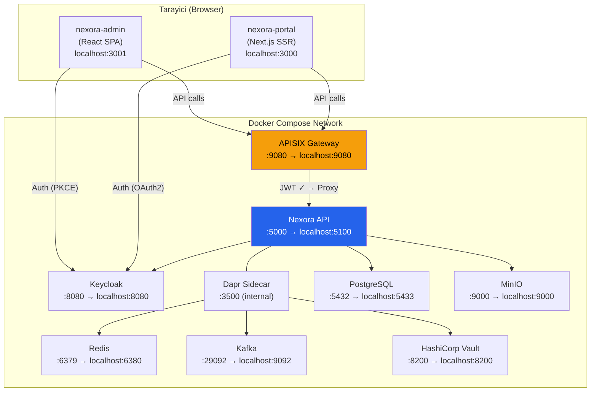

---

## 2. Request Akis Ozeti

Tum API istekleri APISIX uzerinden gecer. Keycloak auth istekleri dogrudan tarayicidan Keycloak'a gider.

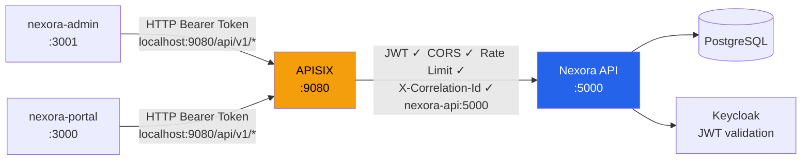

**APISIX'in sagladiklari:**

| Ozellik | Aciklama |
|---------|----------|
| JWT Validation | `openid-connect` plugin — Keycloak JWKS ile token dogrulama |
| CORS | `localhost:3000` ve `localhost:3001` originslerine izin verir |
| Rate Limiting | Genel API: 100 req/s, Health: 10 req/s, Localization: 50 req/s |
| Correlation ID | Her istege `X-Correlation-Id` header'i ekler, response'a da yansitir |
| Routing | Path-based routing, spesifik route'lar catch-all'dan once eslenir |

**Defense in depth:** JWT hem APISIX'te (signature + expiry) hem backend'de (claims + tenant context) dogrulanir. Gecersiz token'lar gateway'de reddedilir, backend'e ulasmaz.

---

## 3. Authentication Akislari

### 3.1 nexora-admin (Keycloak JS + PKCE)

Admin dashboard **public SPA** oldugu icin token'i memory'de tutar. `keycloak-js` kutuphanesi Authorization Code + PKCE flow kullanir.

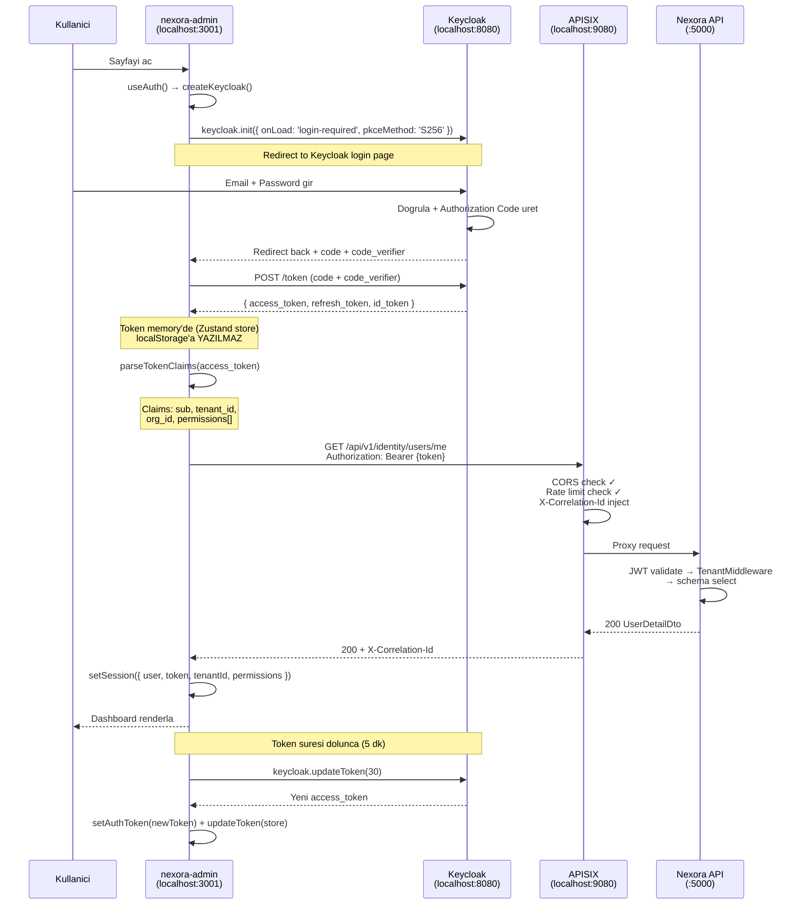

**Onemli detaylar:**
- Keycloak client: `nexora-admin` (publicClient: true, PKCE zorunlu)
- Token suresi: 300 saniye (5 dakika)
- Refresh mekanizmasi: `onTokenExpired` callback
- Fallback: `/me` endpoint basarisiz olursa JWT claims'ten user olusturulur

### 3.2 nexora-portal (NextAuth.js v5 + Keycloak)

Portal **server-side rendered** oldugu icin token httpOnly cookie'de tutulur. NextAuth.js Keycloak provider kullanir.

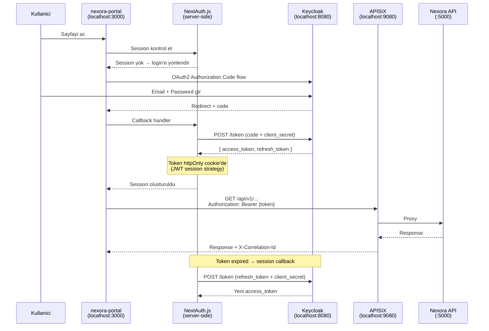

**Onemli detaylar:**
- Keycloak client: `nexora-portal` (confidential, client_secret gerekli)
- Client secret: `nexora-portal-dev-secret`
- Token storage: httpOnly cookie (tarayici JS'i erisemez)
- Server-side token refresh: NextAuth session callback'inde

### 3.3 Admin vs Portal Auth Karsilastirmasi

| Ozellik | nexora-admin | nexora-portal |
|---------|-------------|---------------|
| Framework | React SPA (Vite) | Next.js SSR |
| Auth kutuphanesi | keycloak-js | NextAuth.js v5 |
| OAuth2 flow | Authorization Code + PKCE | Authorization Code + client_secret |
| Token storage | Memory (Zustand) | httpOnly cookie |
| Client type | Public | Confidential |
| Token refresh | Client-side (keycloak.updateToken) | Server-side (session callback) |
| XSS riski | Token memory'de, XSS ile calinamaz | Token cookie'de, JS erisemez |

---

## 4. APISIX Gateway Detayi

### 4.1 Calisma Modu

APISIX **standalone mode** ile calisir — etcd'ye bagimliligi yoktur. Route tanimlari `apisix.yaml` dosyasindan yuklenir ve dosya degisikliklerinde hot-reload yapilir.

```text
infrastructure/apisix/
├── config.yaml      # APISIX core config (standalone mode, plugin list)
└── apisix.yaml      # Route tanimlari (hot-reloaded)
```

### 4.2 Tanimli Route'lar

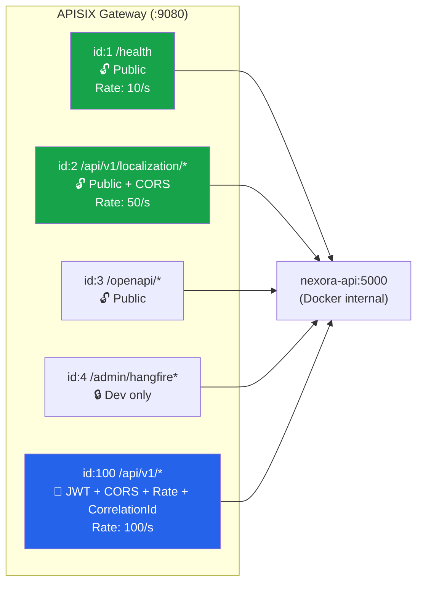

### 4.3 Request Islem Sirasi

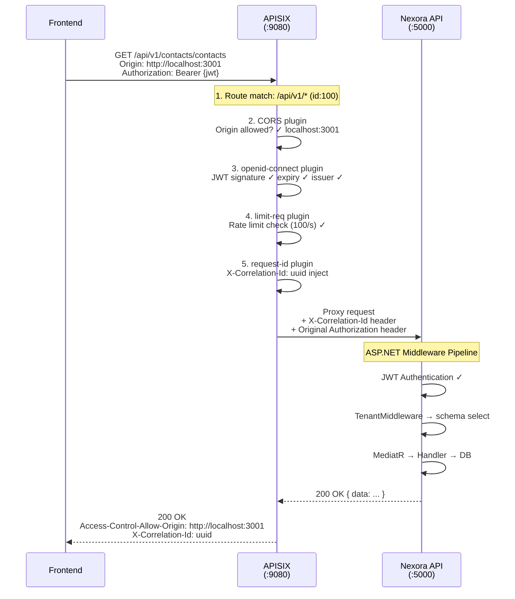

### 4.4 CORS Preflight Akisi

Tarayici cross-origin isteklerden once OPTIONS preflight gonderir. APISIX bunu backend'e proxy etmeden dogrudan cevaplar.

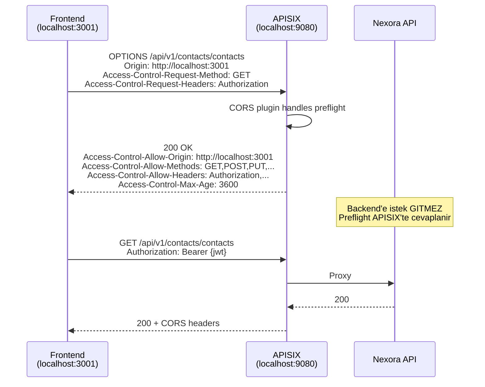

---

## 5. Backend Middleware Pipeline

### 5.1 Basarili Request

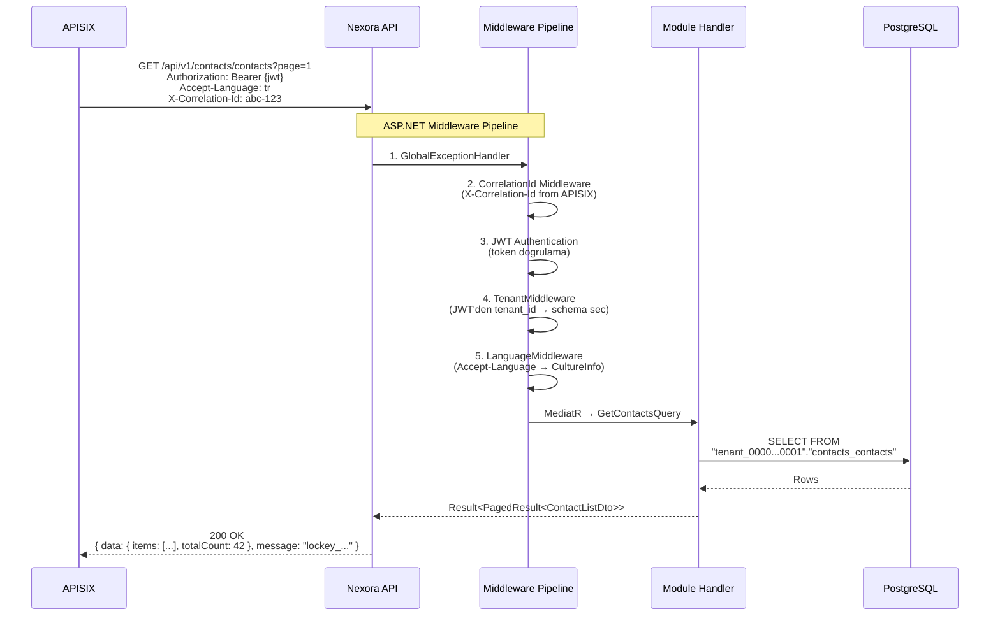

### 5.2 TenantMiddleware Detayi

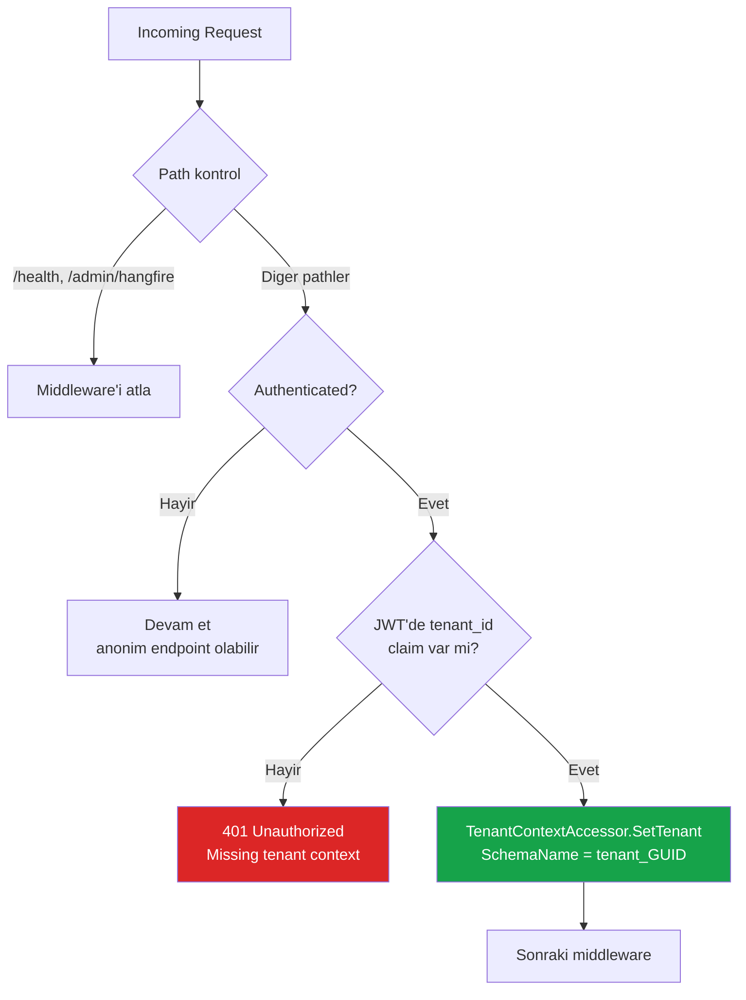

### 5.3 Schema-per-Tenant Veri Izolasyonu

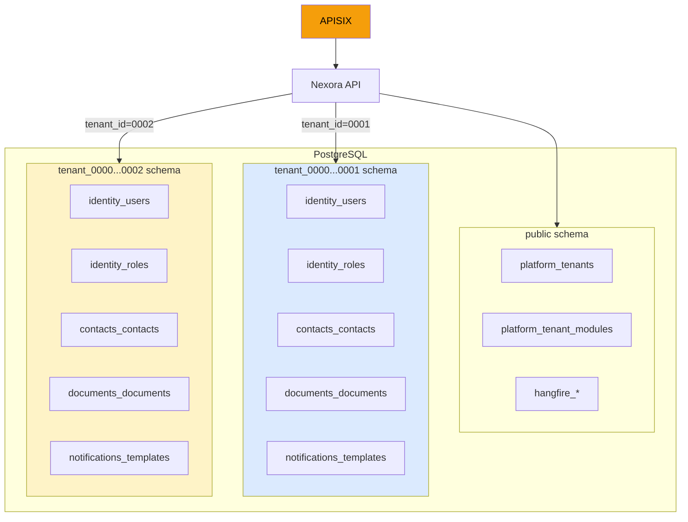

---

## 6. Dapr Sidecar Iletisimi

Nexora API, harici servislere Dapr sidecar uzerinden erisir. Sidecar, API container'in network namespace'ini paylasir.

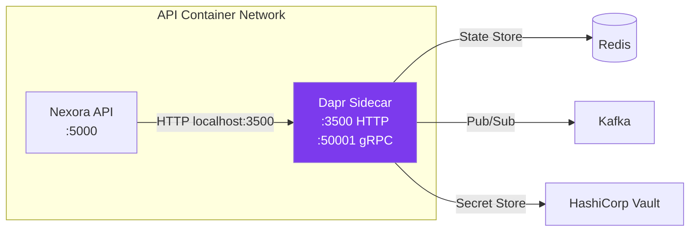

| Bilesen | Dapr Component | Kullanim |
|---------|---------------|----------|
| State Store | Redis | Cache (L2), distributed state |
| Pub/Sub | Kafka | Cross-module integration events |
| Secret Store | HashiCorp Vault | API key'ler, Keycloak admin credentials |

**Onemli:** Dapr sidecar, API container ile ayni network namespace'i paylasir (`network_mode: "service:nexora-api"`). API restart olunca sidecar da recreate edilmelidir.

---

## 7. Observability Akisi

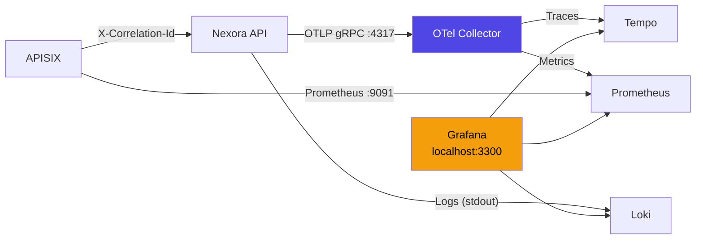

---

## 8. Tam Port Haritasi

| Servis | Internal Port | External Port | Erisim | Aciklama |
|--------|:---:|:---:|--------|----------|
| nexora-admin | — | 3001 | Tarayici | Vite dev server |
| nexora-portal | — | 3000 | Tarayici | Next.js dev server |
| **APISIX** | **9080** | **9080** | **Tarayici → API** | **Tum API trafigi buradan gecer** |
| Nexora API | 5000 | 5100 | Docker internal | Dogrudan erisim sadece debug icin |
| Keycloak | 8080 | 8080 | Tarayici + Docker | Auth (login, token) |
| PostgreSQL | 5432 | 5433 | Docker + dev tools | Database |
| Redis | 6379 | 6380 | Docker + dev tools | Cache |
| Kafka | 29092 | 9092 | Docker + dev tools | Event bus |
| MinIO | 9000/9001 | 9000/9001 | Docker + console | Object storage |
| Vault | 8200 | 8200 | Docker + UI | Secrets |
| Grafana | 3300 | 3300 | Tarayici | Observability dashboard |
| APISIX Metrics | 9091 | 9091 | Prometheus | Gateway metrikleri |
| Dapr Sidecar | 3500 | — | Sadece API container | Service mesh |
| Dapr Placement | 50006 | 50006 | Docker internal | Actor placement |
| OTel Collector | 4317 | 4327 | Docker internal | Telemetry |

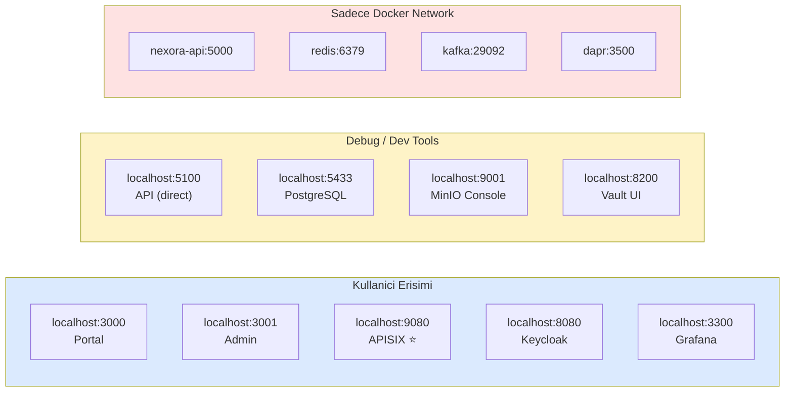

---

## 9. Konfigrasyon Dosyalari

### Frontend Environment Variables

**nexora-admin** (`.env.local`):

```bash
VITE_API_BASE_URL=http://localhost:9080/api/v1    # APISIX uzerinden
VITE_KEYCLOAK_URL=http://localhost:8080            # Dogrudan Keycloak
VITE_KEYCLOAK_REALM=nexora-dev
VITE_KEYCLOAK_CLIENT_ID=nexora-admin
```

**nexora-portal** (`.env.local`):

```bash
NEXT_PUBLIC_API_URL=http://localhost:9080/api/v1   # APISIX uzerinden
AUTH_KEYCLOAK_ISSUER=http://localhost:8080/realms/nexora-dev  # Dogrudan Keycloak
AUTH_KEYCLOAK_ID=nexora-portal
AUTH_KEYCLOAK_SECRET=nexora-portal-dev-secret
```

### APISIX Konfigurasyonu

**Calisma modu:** Standalone (etcd bagimliligi yok)

```text
infrastructure/apisix/
├── config.yaml     # deployment.role: data_plane, config_provider: yaml
└── apisix.yaml     # Route tanimlari, hot-reload destekli
```

### Keycloak Clients

| Client ID | Tip | Kullanim |
|-----------|-----|----------|
| `nexora-admin` | Public (PKCE) | Admin SPA auth |
| `nexora-portal` | Confidential | Portal SSR auth |
| `nexora-api` | Confidential + Service Account | Backend-to-Keycloak admin calls |
| `nexora-gateway` | Confidential | APISIX openid-connect plugin (OIDC discovery) |

### Keycloak Hostname Konfigurasyonu

Keycloak, Docker icinden ve disarindan farkli hostname'lerle erisilir. Issuer mismatch'i onlemek icin:

```bash
KC_HOSTNAME=http://localhost:8080            # Frontend issuer (JWT iss claim)
KC_HOSTNAME_BACKCHANNEL_DYNAMIC=true         # Backchannel URL'ler request hostname'den
```

Bu sayede:
- **Browser** → discovery'de issuer: `http://localhost:8080/...` ✓
- **APISIX** → discovery'de issuer: `http://localhost:8080/...` (ayni, JWT ile eslesiyor) ✓
- **APISIX** → jwks_uri: `http://keycloak:8080/...` (Docker'dan erisilebilir) ✓

---

## 10. Production'a Gecis Icin Gerekenler

Development ortaminda JWT validation, CORS, rate limiting, correlation ID injection tamamiyla aktif. Production'da ek olarak:

| Gorev | Aciklama |
|-------|----------|
| TLS termination | APISIX'te SSL sertifikasi, backend HTTP kalabilir |
| Keycloak hostname | `KC_HOSTNAME=https://auth.nexora.io` (gercek domain) |
| etcd mode (opsiyonel) | Standalone yerine etcd-backed, Admin API ile dynamic config |
| Stricter CORS | Sadece production domain'lerine izin (localhost kaldirilir) |
| Rate limit tuning | IP-based → consumer-based rate limiting |

---

## 11. Sik Sorulan Sorular

**S: Neden auth istekleri APISIX'ten gecmiyor?**
Keycloak auth flow'u (login, token exchange) tarayici ile Keycloak arasinda dogrudan gerceklesir. Bu OAuth2 standardinin geregine uygundur — auth provider'a dogrudan erisim gereklidir. APISIX sadece **API isteklerini** proxy eder.

**S: JWT iki kez mi dogrulaniyor?**
Evet, defense in depth prensibi. APISIX signature + expiry dogruluyor, backend ise claims (tenant_id, permissions) cikariyor. Gecersiz token'lar gateway'de reddedilir — backend'e ulasmaz.

**S: Neden Dapr sidecar ayri container?**
Dapr sidecar pattern'i geregi, her uygulama kendi sidecar'ina sahiptir. `network_mode: "service:nexora-api"` ile API container'in network namespace'ini paylasir — boylece API `localhost:3500`'e istek atarak Dapr'a erisir.

**S: Frontend neden `localhost:5100`'e degil de `localhost:9080`'e gidiyor?**
Tum API trafigi APISIX uzerinden gecmeli cunku APISIX CORS, rate limiting, ve correlation ID injection saglar. `localhost:5100` sadece debug/troubleshooting icin aciktir.
