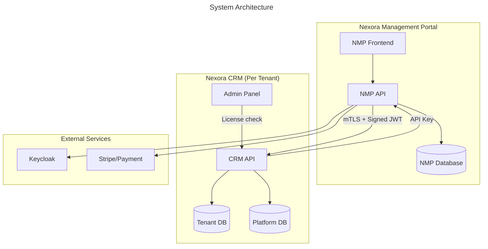
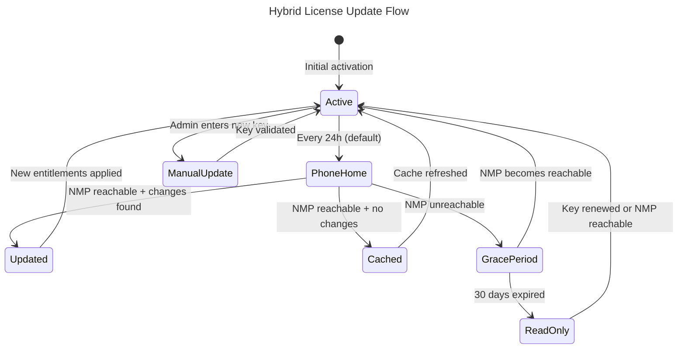
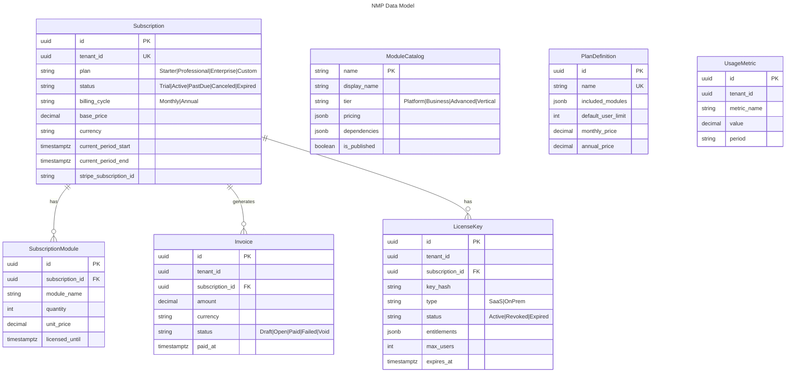

# Nexora Management Portal (NMP) — Architecture

> **Status:** Planned (Parallel track, starts Phase 1.5 week 4)
> **Type:** Separate application (own repository)
> **Purpose:** Platform-level tenant lifecycle, licensing, billing, and marketplace management

## 1. Overview

NMP is the central control plane for Nexora platform operations. It manages tenant provisioning, subscription/licensing, billing, and the module marketplace. It replaces tenant management features currently in the admin panel.



## 2. Deployment Models

### SaaS (Nexora Hosted)

```text
Customer purchases → NMP creates tenant → Keycloak realm provisioned →
DB schema created → Modules installed → Customer accesses admin panel
```

- Tenant lifecycle managed entirely by NMP
- Real-time license verification via API
- Billing via Stripe integration
- Automatic module entitlement sync

### On-Prem (Customer Hosted)

```text
Customer purchases → NMP generates license key → Customer installs via Helm →
CRM validates license key (RSA signature) → Tenant created locally
```

- Hybrid license model: phone-home (default) + manual key (fallback)
- Customer manages own infrastructure
- NMP provides license keys and entitlement updates

## 3. Hybrid License Model (On-Prem)

### 3.1 License Key Structure

```json
{
  "header": { "alg": "RS256", "typ": "NXL" },
  "payload": {
    "iss": "nexora-management",
    "sub": "tenant-guid",
    "iat": 1711111111,
    "exp": 1742647111,
    "plan": "Professional",
    "type": "OnPrem",
    "modules": ["identity", "contacts", "notifications", "crm"],
    "max_users": 50,
    "max_organizations": 5,
    "features": { "custom_branding": true, "api_access": true }
  },
  "signature": "base64url(...)"
}
```

### 3.2 License Lifecycle



### 3.3 Scenarios

<!-- Note: The scenarios table below uses Turkish text intentionally (internal team documentation). -->

| Scenario | Behavior |
|----------|----------|
| **Müşteri online + NMP'den modül satın aldı** | Phone-home job (24h) otomatik algılar, entitlement günceller |
| **Admin panelden "Modül Ekle" tıkladı** | Anlık NMP API çağrısı → onay gelirse yükle, gelmezse "Satın Al" göster |
| **NMP erişilemez** | Lokal cache'teki son entitlement'lar geçerli (grace period başlar) |
| **License expire + NMP erişilemez** | 30 gün grace period → sonra read-only mod |
| **Air-gapped ortam** | Manuel key modu, her değişiklikte yeni key |
| **Müşteri plan upgrade yaptı** | Phone-home'da yeni entitlement'lar gelir VEYA yeni key indirir |
| **Müşteri modül ekledi (online)** | Anlık API → NMP onaylar → modül yüklenir |
| **Müşteri modül ekledi (offline)** | Yeni license key gerekir → admin panelde "Lisansı Güncelle" |

### 3.4 Admin Panel — Lisans Sekmesi

```text
┌─────────────────────────────────────────────────┐
│ Lisans Bilgileri                                 │
├─────────────────────────────────────────────────┤
│ Plan: Professional                    [Upgrade] │
│ Durum: ● Aktif                                  │
│ Son Doğrulama: 2 saat önce           [Doğrula] │
│ Geçerlilik: 30 Mart 2027'ye kadar              │
│ Mod: Phone-Home (otomatik)                      │
│                                                  │
│ Lisanslı Modüller:                              │
│ ✅ Identity        ✅ Contacts                  │
│ ✅ Documents        ✅ Notifications             │
│ ✅ CRM              ⬜ Finance [Satın Al]       │
│ ⬜ Fundraising [Satın Al]                       │
│                                                  │
│ Kullanıcı Limiti: 23 / 50                       │
│ Organizasyon Limiti: 2 / 5                      │
│                                                  │
│ [Lisansı Güncelle]  [Ödeme Geçmişi]            │
└─────────────────────────────────────────────────┘
```

## 4. Security

### 4.1 NMP → CRM Communication

| Layer | Mechanism |
|-------|-----------|
| Transport | mTLS (mutual TLS, certificate pinning) |
| Authentication | Short-lived JWT (5 min, signed by nexora-management realm) |
| Integrity | HMAC-SHA256 request signing (shared secret in Vault) |
| Network | Internal API (`/api/internal/*`) — never internet-exposed |

### 4.2 CRM → NMP Communication

| Layer | Mechanism |
|-------|-----------|
| Authentication | API key per tenant (stored in Vault: `nexora/management/api-key`) |
| Rate limiting | 100 req/min per API key |
| Scope | Only license verification + usage reporting |

### 4.3 License Key Validation (On-Prem)

- RSA-256 signature verification using bundled public key
- No NMP call needed for basic validation
- Key payload contains all entitlements
- Revocation check via phone-home (if enabled)

### 4.4 Data Isolation

- NMP **never** accesses tenant data
- NMP only knows: tenant ID, slug, subscription, licensed modules, aggregated usage
- Tenant data stays in CRM's PostgreSQL
- CRM's internal endpoints only operate on platform tables

## 5. Data Model

### 5.1 NMP Database



### 5.2 CRM Platform DB Changes

New columns on `platform_tenant_modules`:
- `LicensedUntil` (timestamptz?) — cached license expiry
- `LicenseSource` (string?) — `"NMP"` | `"LicenseKey"` | null (legacy)

New table `platform_license_cache`:
- `TenantId` (uuid PK)
- `EntitlementsJson` (jsonb)
- `LastVerifiedAt` (timestamptz)
- `LicenseKeyHash` (string?)
- `ExpiresAt` (timestamptz)

## 6. API Endpoints

### NMP API

| Method | Path | Description |
|--------|------|-------------|
| POST | /api/v1/tenants | Create tenant + subscription |
| GET | /api/v1/tenants | List tenants |
| GET | /api/v1/tenants/{id} | Tenant detail + subscription |
| PUT | /api/v1/tenants/{id}/status | Change tenant status |
| POST | /api/v1/tenants/{id}/subscription | Create/update subscription |
| PUT | /api/v1/tenants/{id}/subscription/plan | Upgrade/downgrade |
| GET | /api/v1/tenants/{id}/licensed-modules | Licensed modules |
| POST | /api/v1/tenants/{id}/licensed-modules | Add module to license |
| POST | /api/v1/tenants/{id}/license-keys | Generate license key |
| POST | /api/v1/license-keys/validate | Validate key (CRM calls) |
| GET | /api/v1/tenants/{id}/invoices | Invoice history |
| GET | /api/v1/modules | Module catalog |
| POST | /api/v1/internal/license/verify | License verification (CRM→NMP) |
| GET | /api/v1/analytics/dashboard | Platform KPIs |

### CRM Internal API (NMP calls)

| Method | Path | Description |
|--------|------|-------------|
| PUT | /api/internal/tenants/{id}/entitlements | Push updated entitlements (includes `compliance.caps` sub-object — see ADR-0025) |
| PUT | /api/internal/tenants/{id}/status | Change tenant status |
| GET | /api/internal/tenants/{id}/usage | Get usage metrics |

### NMP Compliance Caps Contract

Extension of the existing entitlements channel — **no new transport**. Platform-level
policy caps (GDPR hard-delete, retention windows, data residency, audit verbosity, …)
ride inside `EntitlementsJson.compliance.caps`. Each key is resolved by the CRM
runtime's `IConfigurationResolver` per the 3-tier precedence defined in ADR-0025.

```json
{
  "compliance": {
    "caps": {
      "gdpr.hard_delete.enabled": { "allowed": true,  "forced": false },
      "audit.retention.days":     { "allowed": true,  "forced": true, "value": 365 },
      "data.residency.region":    { "allowed": false, "forced": true, "value": "eu-west" }
    }
  }
}
```

- `allowed: false` — org admins CANNOT enable this key (override is rejected at resolver).
- `forced: true` — cap value wins regardless of tenant default / org override.
- `value` — cap's own effective value when `forced=true` or when no lower tier sets one.

In dev and on-prem pre-NMP, `NullComplianceCapProvider` returns a permissive cap
(`allowed=true, forced=false`) for every key. `NmpComplianceCapProvider` (NMP.2)
reads the sub-object from the license cache.

## 7. Admin Panel Changes

### Remove
- Tenant list/create/detail pages
- Module install/uninstall from tenant detail
- Tenant status management

### Modify
- Module install: license check before install
- Module list: show "licensed" vs "available for purchase"
- Settings: add license/subscription info tab

### Add
- License tab (plan, status, modules, limits, renewal)
- Purchase/upgrade flow (redirect to NMP or embedded checkout)
- Payment history viewer

## 8. Implementation Phases

> **Timeline**: NMP runs as a parallel track alongside Phase 2 module development.
> It starts at Phase 1.5 week 4, after the Permission Tier System (Phase 1.5.2) is complete.
> `ILicenseVerifier`, `NullLicenseVerifier`, and `platform_license_cache` are created in Phase 1.5.2 —
> not in NMP.1 — so Phase 2 modules use `ILicenseVerifier` from day 1.

### NMP.1: Foundation (NMP Weeks 1-4)

**Prerequisite**: Phase 1.5.2 (Permission Tier System) complete — `PermissionScope` enum, `ILicenseVerifier` interface, `NullLicenseVerifier`, `platform_license_cache` table already exist in CRM.
- [ ] Create Nexora.Management solution
- [ ] Keycloak nexora-management realm
- [ ] Subscription, LicenseKey, ModuleCatalog entities
- [ ] Tenant lifecycle API
- [ ] License verification endpoint
- [ ] `NmpLicenseVerifier` implementation (replaces `NullLicenseVerifier` in SaaS deployments)

### NMP.2: Billing (NMP Weeks 5-8)
- [ ] Stripe integration
- [ ] Invoice entity + webhook handlers
- [ ] Plan upgrade/downgrade
- [ ] NMP frontend (tenant list, subscriptions, billing)
- [ ] **Compliance caps editor** (ADR-0025): per-tenant toggles for `gdpr.hard_delete.enabled`,
      `audit.retention.days`, `data.residency.region`, … with `allowed`/`forced` flags;
      changes publish via the existing `PUT /api/internal/tenants/{id}/entitlements`
      channel under `compliance.caps`. Platform-scope permission:
      `platform.compliance.policy_manage`.
- [ ] `NmpComplianceCapProvider` replaces `NullComplianceCapProvider` in SaaS deployments —
      reads caps from license cache, no new wire contract. (CRM-side interface is stable
      since T-019; NMP.2 only adds the non-null implementation + DI swap in SaaS hosts.)
- [ ] **Compliance-resolver metrics** deferred from T-019 land here so the metric schema
      can be finalized alongside the NMP cap channel:
  `nexora_compliance_config_resolution_count{layer}` and
  `nexora_compliance_policy_changes_total{key,scope,action}`. See
  `roadmap/phases/phase-NMP-track.md §NMP.2` for full bullet.

### NMP.3: Admin Panel Adaptation (After Phase 2 modules exist)

**Prerequisite**: Phase 2 modules exist so the license tab has module content to display.
- [ ] Remove tenant CRUD from admin
- [ ] License-aware module installation
- [ ] License tab in admin settings
- [ ] Purchase redirect flow
- [ ] Usage metric collection job

### NMP.4: On-Prem & Marketplace (NMP Weeks 13-16)
- [ ] RSA license key generation
- [ ] `LicenseKeyVerifier` implementation (validates RSA-signed key for on-prem)
- [ ] CRM license activation wizard
- [ ] Phone-home heartbeat job
- [ ] Air-gapped mode
- [ ] Module marketplace catalog UI

## 9. Integration Points with CRM

This section documents the contracts between NMP and the Nexora CRM codebase. These integration points are established in Phase 1.5.2 so that Phase 2 modules can program against them immediately.

### 9.1 ILicenseVerifier Interface (SharedKernel)

```csharp
/// <summary>
/// Verifies whether a tenant is licensed to install/use a module.
/// Defined in SharedKernel, implemented per deployment model.
/// </summary>
public interface ILicenseVerifier
{
    /// <summary>
    /// Checks if the given tenant has an active license for the specified module.
    /// </summary>
    Task<LicenseVerificationResult> VerifyAsync(
        Guid tenantId, string moduleName, CancellationToken ct);
}

public sealed record LicenseVerificationResult(
    bool IsLicensed,
    string? DenialReason,
    DateTimeOffset? LicensedUntil);
```

### 9.2 Verifier Implementations

| Implementation | When Used | Behavior |
|----------------|-----------|----------|
| `NullLicenseVerifier` | Development, pre-NMP | Always returns `IsLicensed = true` |
| `NmpLicenseVerifier` | Production SaaS (NMP.1) | Calls NMP API `POST /api/v1/internal/license/verify`, caches result in `platform_license_cache` |
| `LicenseKeyVerifier` | On-prem (NMP.4) | Validates RSA-signed license key payload, checks expiry and module entitlements |

### 9.3 platform_license_cache Table

Created in Phase 1.5.2 in the CRM PlatformDbContext (public schema):

| Column | Type | Description |
|--------|------|-------------|
| `TenantId` | uuid PK | Tenant identifier |
| `EntitlementsJson` | jsonb | Cached module entitlements from NMP |
| `LastVerifiedAt` | timestamptz | Last successful verification timestamp |
| `LicenseKeyHash` | string? | Hash of on-prem license key (null for SaaS) |
| `ExpiresAt` | timestamptz | When the cached entitlements expire |

### 9.4 InstallModuleCommand Integration

`InstallModuleCommand` (Identity module) calls `ILicenseVerifier.VerifyAsync()` before proceeding with module installation. If `IsLicensed` is `false`, the command returns `Result.Failure` with the denial reason.

### 9.5 PermissionScope Enum

```csharp
/// <summary>
/// Distinguishes platform-level permissions from tenant-level permissions.
/// </summary>
public enum PermissionScope
{
    /// <summary>Platform-wide: platform.tenants.*, platform.modules.* — NMP operators only</summary>
    Platform,

    /// <summary>Tenant-scoped: identity.users.*, contacts.* etc. — tenant admins and users</summary>
    Tenant
}
```

Platform-scope permissions are hidden from the tenant admin UI.
In SaaS mode, platform permissions are managed via NMP. In on-prem mode, they are managed by the local Platform Admin.

See also: [IDENTITY.md — Permission Scopes](../auth/IDENTITY.md#permission-scopes-phase-152)
