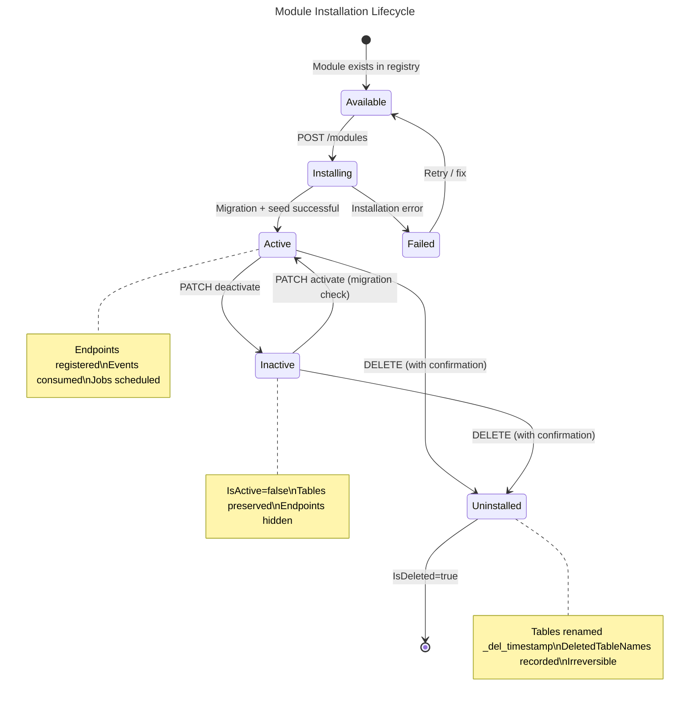
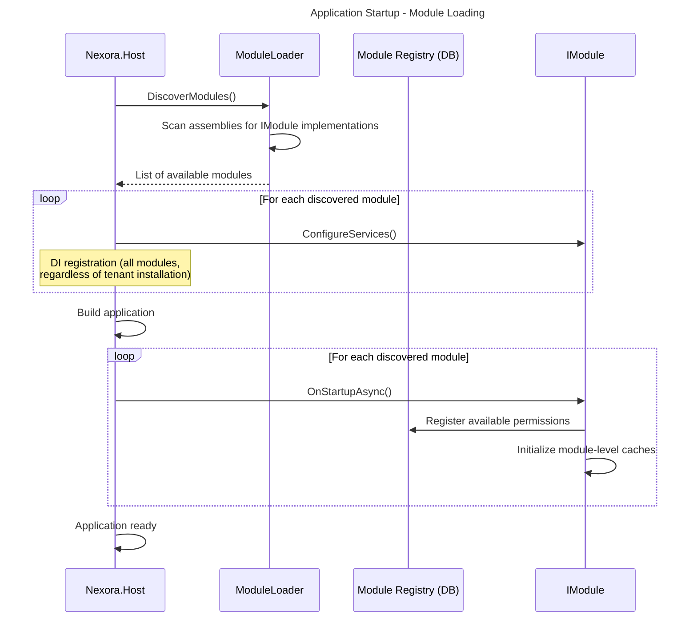
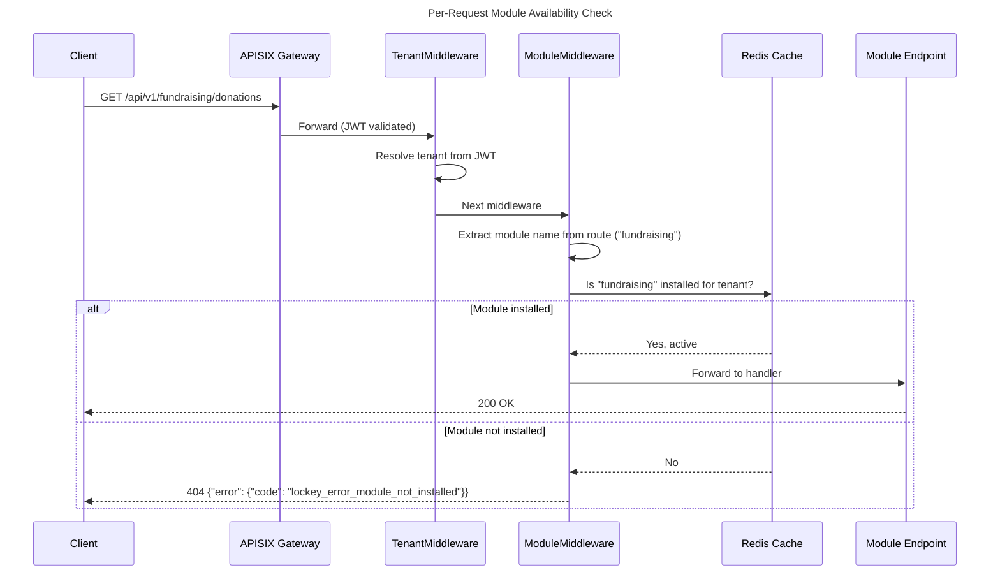
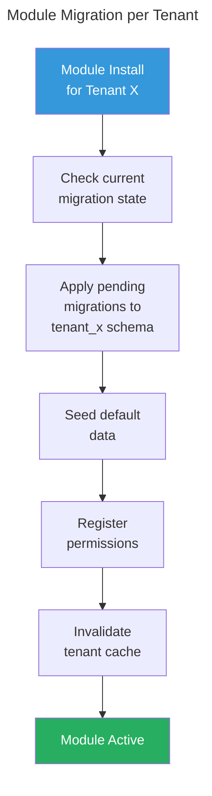
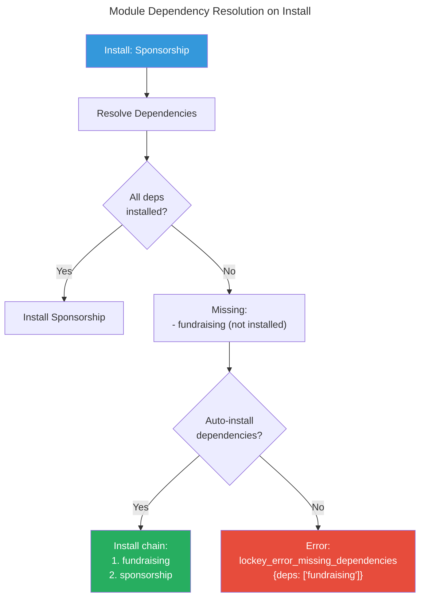

# Nexora - Module System Architecture

## 1. Overview

Nexora's module system is a **true plugin architecture** — modules are self-contained units that can be installed, configured, and removed per tenant without affecting other modules or tenants. The platform runs with only the core modules; everything else is optional.

This is NOT just logical separation — it's **runtime modularity**:
- A tenant without the Donations module will have **no donation tables, no donation endpoints, no donation UI**.
- Installing a module creates its database tables, registers its API routes, seeds its default data, and enables its UI components.
- Uninstalling a module archives its data, removes its routes, and hides its UI.

## 2. Module Contract

Every module implements the `IModule` interface:

```csharp
public interface IModule
{
    /// Unique module identifier (e.g., "fundraising", "crm", "education")
    string Name { get; }

    /// Human-readable display name
    string DisplayName { get; }

    /// Module version (SemVer)
    string Version { get; }

    /// Modules that must be installed before this one
    IReadOnlyList<string> Dependencies { get; }

    /// Register services (DI container)
    void ConfigureServices(IServiceCollection services, IConfiguration configuration);

    /// Register API endpoints / controllers
    void MapEndpoints(IEndpointRouteBuilder endpoints);

    /// Register event handlers (Kafka consumers)
    void ConfigureEventHandlers(IEventBusBuilder builder);

    /// Register background jobs (Hangfire)
    /// AddOrUpdate accepts Expression<Func<TJob, Task>> to specify the job method
    void ConfigureJobs(IJobScheduler scheduler);

    /// Run when module is installed for a tenant (create tables, seed data)
    Task OnInstallAsync(TenantContext tenant, CancellationToken ct);

    /// Run when module is uninstalled (archive data, cleanup)
    Task OnUninstallAsync(TenantContext tenant, CancellationToken ct);

    /// Run on application startup (register permissions, etc.)
    Task OnStartupAsync(CancellationToken ct);

    /// Health check for this module
    Task<HealthCheckResult> CheckHealthAsync(CancellationToken ct);
}
```

### Example: Fundraising Module Registration

```csharp
public sealed class FundraisingModule : IModule
{
    public string Name => "fundraising";
    public string DisplayName => "Fundraising";
    public string Version => "1.0.0";
    public IReadOnlyList<string> Dependencies => ["identity", "contacts", "notifications"];

    public void ConfigureServices(IServiceCollection services, IConfiguration configuration)
    {
        services.AddScoped<IDonationRepository, DonationRepository>();
        services.AddScoped<IPaymentGateway, StripePaymentGateway>();
        services.AddScoped<FundraisingDbContext>();
        // MediatR handlers auto-discovered from this assembly
        services.AddMediatR(cfg => cfg.RegisterServicesFromAssembly(typeof(FundraisingModule).Assembly));
    }

    public void MapEndpoints(IEndpointRouteBuilder endpoints)
    {
        var group = endpoints.MapGroup("/api/v1/fundraising")
            .RequireAuthorization()
            .WithTags("Fundraising");

        group.MapDonationEndpoints();
        group.MapCampaignEndpoints();
        group.MapRecurringEndpoints();
        group.MapCollectionPointEndpoints();
        group.MapBankImportEndpoints();
    }

    public void ConfigureEventHandlers(IEventBusBuilder builder)
    {
        builder.Subscribe<ContactMergedEvent, DonationContactMergeHandler>();
        builder.Subscribe<OrganizationCreatedEvent, SeedDonationCategoriesHandler>();
    }

    public void ConfigureJobs(IJobScheduler scheduler)
    {
        scheduler.AddOrUpdate<RecurringChargeJob>(
            "fundraising:recurring-charge",
            "0 3 * * *",
            job => job.RunAsync(new RecurringChargeParams(), CancellationToken.None), // Expression tree — Hangfire substitutes its own token at runtime
            "critical");
    }

    public async Task OnInstallAsync(TenantContext tenant, CancellationToken ct)
    {
        // 1. Run EF migrations for donation tables in tenant schema
        await using var db = CreateDbContext(tenant);
        await db.Database.MigrateAsync(ct);

        // 2. Seed default data
        await SeedDefaultCategories(db, tenant.OrganizationId, ct);

        // 3. Register module permissions
        await RegisterPermissions(tenant, ct);
    }

    public async Task OnUninstallAsync(TenantContext tenant, CancellationToken ct)
    {
        // 1. Archive data (don't drop tables — mark as archived)
        await ArchiveModuleData(tenant, ct);

        // 2. Remove permissions
        await RemovePermissions(tenant, ct);

        // 3. Cancel active recurring plans
        await CancelActiveRecurringPlans(tenant, ct);
    }
}
```

## 3. Module Lifecycle

Modules have three distinct management operations:

| Operation | Endpoint | Effect | Reversible? |
|-----------|----------|--------|-------------|
| **Install** | `POST /modules` | Creates TenantModule record, runs migrations | Yes (via Uninstall) |
| **Activate** | `PATCH /modules/{name}/activate` | Sets `IsActive=true`, runs migration check | Yes |
| **Deactivate** | `PATCH /modules/{name}/deactivate` | Sets `IsActive=false`, tables untouched | Yes |
| **Uninstall** | `DELETE /modules/{name}` | Renames tables with `_del_{timestamp}`, soft-deletes record | **No** |



### Uninstall Process
1. Module's `OnUninstallAsync()` callback invoked
2. Orphaned RolePermission associations removed
3. Module tables renamed: `{module}_contacts` → `{module}_contacts_del_20260325_143022`
4. Renamed table names recorded in `TenantModule.DeletedTableNames`
5. TenantModule record soft-deleted (`IsDeleted=true`)
6. New install creates fresh tables (old data preserved in renamed tables)

## 4. Module Discovery & Loading

### Startup Flow



### Per-Request Module Resolution



## 5. Module Database Strategy

Each module owns its tables within the tenant schema. Tables are prefixed with the module name to avoid collisions:

```sql
-- Schema: tenant_isabet
-- Identity module tables
CREATE TABLE identity_users (...);
CREATE TABLE identity_roles (...);
CREATE TABLE identity_permissions (...);

-- Contacts module tables
CREATE TABLE contacts_contacts (...);
CREATE TABLE contacts_tags (...);
CREATE TABLE contacts_addresses (...);

-- Fundraising module tables (only exist if module installed)
CREATE TABLE fundraising_donations (...);
CREATE TABLE fundraising_categories (...);
CREATE TABLE fundraising_recurring_plans (...);
CREATE TABLE fundraising_collection_points (...);

-- CRM module tables (only exist if module installed)
CREATE TABLE crm_leads (...);
CREATE TABLE crm_pipelines (...);
```

### Migration Strategy



Each module has its own `DbContext` and migration history:

```csharp
public class DonationsDbContext : DbContext
{
    private readonly ITenantContext _tenant;

    protected override void OnConfiguring(DbContextOptionsBuilder options)
    {
        // Dynamic schema based on current tenant
        options.UseNpgsql(connectionString);
    }

    protected override void OnModelCreating(ModelBuilder builder)
    {
        // Set schema to current tenant
        builder.HasDefaultSchema(_tenant.SchemaName);

        // Prefix all tables
        foreach (var entity in builder.Model.GetEntityTypes())
        {
            entity.SetTableName($"fundraising_{entity.GetTableName()}");
        }

        // Apply module-specific configurations
        builder.ApplyConfigurationsFromAssembly(typeof(FundraisingDbContext).Assembly);
    }
}
```

## 6. Cross-Module Communication

Modules **NEVER** reference each other directly. All communication is via:

### 6.1 Integration Events (Async, via Kafka)

```csharp
// Contacts module publishes:
public sealed record ContactMergedIntegrationEvent(
    Guid OldContactId,
    Guid NewContactId,
    Guid TenantId) : IIntegrationEvent;

// Donations module subscribes (only if installed):
public sealed class DonationContactMergeHandler
    : IIntegrationEventHandler<ContactMergedIntegrationEvent>
{
    public async Task Handle(ContactMergedIntegrationEvent @event, CancellationToken ct)
    {
        // Update donor_contact_id from old to new
        await _repository.UpdateContactReferences(
            @event.OldContactId, @event.NewContactId, ct);
    }
}
```

### 6.2 Module Query Interface (Sync, in-process)

For cases where a module needs data from another module synchronously, we use **shared interfaces** defined in SharedKernel:

```csharp
// Defined in SharedKernel (not in any module)
public interface IContactQueryService
{
    Task<ContactSummary?> GetContactSummaryAsync(Guid contactId, CancellationToken ct);
}

// Implemented by Contacts module
public sealed class ContactQueryService : IContactQueryService { ... }

// Used by Donations module (resolved via DI)
public sealed class CreateDonationHandler(IContactQueryService contactQuery)
{
    public async Task Handle(CreateDonationCommand cmd, CancellationToken ct)
    {
        var donor = await contactQuery.GetContactSummaryAsync(cmd.DonorId, ct);
        if (donor is null)
            return Result.Failure("lockey_error_donor_not_found");
        // ...
    }
}
```

### 6.3 Module Feature Contribution

Modules can contribute data to shared views (e.g., Contact 360-view):

```csharp
// Defined in SharedKernel
public interface IContactActivityContributor
{
    string ModuleName { get; }
    Task<IReadOnlyList<ActivityItem>> GetActivitiesAsync(
        Guid contactId, DateRange range, CancellationToken ct);
    Task<object?> GetSummaryAsync(Guid contactId, CancellationToken ct);
}

// Fundraising module registers its contributor
public sealed class DonationActivityContributor : IContactActivityContributor
{
    public string ModuleName => "fundraising";

    public async Task<object?> GetSummaryAsync(Guid contactId, CancellationToken ct)
    {
        return new DonorSummary
        {
            TotalDonated = await _repo.GetTotalDonatedAsync(contactId, ct),
            LastDonation = await _repo.GetLastDonationAsync(contactId, ct),
            IsRecurringDonor = await _repo.HasActiveRecurringPlanAsync(contactId, ct)
        };
    }
}

// Contact module collects all contributors at runtime
public sealed class Contact360ViewHandler(
    IEnumerable<IContactActivityContributor> contributors)
{
    // Only installed modules will have registered contributors
    // If Fundraising is not installed, no DonationActivityContributor in DI
}
```

## 7. Module UI Integration

### Admin Panel (React)

Modules register their UI routes and navigation items dynamically:

```typescript
// Each module exposes a manifest
export const fundraisingModule: ModuleManifest = {
  name: 'fundraising',
  displayName: 'Fundraising',
  icon: 'Heart',
  routes: [
    { path: '/fundraising', component: lazy(() => import('./pages/DonationList')) },
    { path: '/fundraising/:id', component: lazy(() => import('./pages/DonationDetail')) },
    { path: '/fundraising/campaigns', component: lazy(() => import('./pages/Campaigns')) },
    { path: '/fundraising/collection-points', component: lazy(() => import('./pages/CollectionPoints')) },
    // ...
  ],
  navigation: [
    { label: 'lockey_nav_donations', path: '/fundraising', icon: 'Heart' },
    { label: 'lockey_nav_campaigns', path: '/fundraising/campaigns', icon: 'Target' },
    { label: 'lockey_nav_recurring', path: '/fundraising/recurring', icon: 'Repeat' },
    { label: 'lockey_nav_collection_points', path: '/fundraising/collection-points', icon: 'Box' },
  ],
  permissions: ['fundraising.donations.read'], // required to see in nav
};
```

### Module Loading in React

```typescript
// App-level module loader
const ModuleRouter: React.FC = () => {
  const { installedModules } = useTenantModules(); // from API

  const activeModules = allModuleManifests.filter(m =>
    installedModules.includes(m.name)
  );

  return (
    <Routes>
      {activeModules.flatMap(mod =>
        mod.routes.map(route => (
          <Route
            key={route.path}
            path={route.path}
            element={
              <RequirePermission permissions={mod.permissions}>
                <Suspense fallback={<ModuleSkeleton />}>
                  <route.component />
                </Suspense>
              </RequirePermission>
            }
          />
        ))
      )}
      <Route path="*" element={<NotFound />} />
    </Routes>
  );
};
```

### Portal (Next.js)

Portal pages are conditionally rendered based on installed modules:

```typescript
// Donor portal - only shows sections for installed modules
const DonorDashboard: React.FC = () => {
  const { hasModule } = useModules();

  return (
    <DashboardLayout>
      {hasModule('fundraising') && <DonationHistory />}
      {hasModule('sponsorship') && <MySponsorships />}
      {hasModule('education') && <MyChildren />}
    </DashboardLayout>
  );
};
```

## 8. Module Install/Uninstall API

### Admin Endpoints

| Method | Path | Description |
|--------|------|-------------|
| GET | `/api/v1/identity/modules/available` | List all available modules |
| GET | `/api/v1/identity/modules/installed` | List installed modules for current tenant |
| POST | `/api/v1/identity/modules/install` | Install module for tenant |
| POST | `/api/v1/identity/modules/uninstall` | Uninstall module for tenant |
| GET | `/api/v1/identity/modules/{name}/health` | Module health check |

### Install Request

```json
POST /api/v1/identity/modules/install
{
  "moduleName": "fundraising",
  "organizationIds": ["org-1", "org-2"]  // which orgs get default roles
}
```

### Install Response

```json
{
  "data": {
    "moduleName": "fundraising",
    "status": "installed",
    "version": "1.0.0",
    "installedAt": "2026-03-19T10:00:00Z",
    "tablesCreated": 8,
    "permissionsRegistered": 24,
    "defaultRolesCreated": ["Donation Manager", "Donation Viewer"]
  }
}
```

## 9. Module Dependency Resolution



### Rules
- **Cannot install** a module if its dependencies are not installed
- **Cannot uninstall** a module if other installed modules depend on it
- **Can force-uninstall** with confirmation (cascades to dependents)
- Core modules (Identity, Contacts) **cannot be uninstalled**

## 10. Module Registry

The following table lists all Nexora modules, their phases, and dependency profiles:

| # | Module | Name (ID) | Phase | Tier | Required Dependencies | Optional Dependencies | Core? |
|---|--------|-----------|-------|------|----------------------|----------------------|-------|
| 1 | Identity & Access | `identity` | Core | Platform | — | — | Yes |
| 2 | Contact Management | `contacts` | Core | Platform | identity | — | Yes |
| 3 | Notification Engine | `notifications` | Core | Platform | identity, contacts | — | Yes |
| 4 | Document Management | `documents` | Core | Platform | identity | — | No |
| 5 | Reporting Engine | `reporting` | Core | Platform | identity | contacts, notifications, documents | No |
| 6 | Portal Framework | `portal` | Core | Platform | identity | — | No |
| 7 | CRM | `crm` | Phase 2 | Business | contacts, notifications | — | No |
| 8 | Finance | `finance` | Phase 2 | Business | contacts, notifications | documents, reporting | No |
| 9 | Subscription & Billing | `subscription` | Phase 2 | Business | contacts, notifications | reporting, documents | No |
| 10 | Project Management | `projects` | Phase 2 | Business | contacts, notifications | documents, finance | No |
| 11 | Website & CMS | `cms` | Phase 3 | Business | notifications | contacts, crm, fundraising, portal | No |
| 12 | Event Management | `events` | Phase 3 | Business | contacts, notifications | documents, crm, fundraising | No |
| 13 | Surveys & Feedback | `surveys` | Phase 3 | Business | contacts, notifications | — | No |
| 14 | HR & Payroll | `hr` | Phase 3 | Business | contacts, notifications, documents | — | No |
| 15 | Inventory & Assets | `inventory` | Phase 3 | Business | contacts, notifications | documents | No |
| 16 | Accounting & Finance | `accounting` | Phase 4 | Advanced | contacts, finance | hr, documents, notifications | No |
| 17 | Point of Sale | `pos` | Phase 4 | Advanced | contacts, notifications | inventory, accounting | No |
| 18 | Fleet Management | `fleet` | Phase 4 | Advanced | contacts, notifications, documents | — | No |
| 19 | Fundraising | `fundraising` | Phase 4 | Vertical: NGO | contacts, notifications, documents | crm, finance | No |
| 20 | Sponsorship & Programs | `sponsorship` | Phase 4 | Vertical: NGO | contacts, fundraising, notifications | documents | No |
| 21 | Education Management | `education` | Phase 4 | Vertical: Education | crm, contacts, documents, notifications | subscription | No |

> **Module Tiers:**
> - **Platform** — Always available, forms the foundation for every installation
> - **Business** — Generic modules every SMB needs (CRM, Finance, Projects, HR, etc.)
> - **Advanced** — Full-featured modules for complex operational needs
> - **Vertical** — Industry-specific solutions (NGO, Education, future: Healthcare, Legal, etc.)
>
> **Change Log (2026-03-28):**
> - **Removed:** `kumbara` (Collection Box) — absorbed into `fundraising` as "Collection Points" feature
> - **Removed:** `kumanya` (Aid Package) — absorbed into `sponsorship` as "Aid Distribution" feature
> - **Renamed:** `donations` → `fundraising` (more generic, includes campaigns, collection points, crowdfunding)
> - **Expanded:** `sponsorship` → "Sponsorship & Programs" (includes program management, aid distribution)
> - **Added:** `finance` (income/expense tracking, bank accounts — foundation for `accounting`)
> - **Restructured phases:** Core Business modules (Phase 2) first, then Growth (Phase 3), then Advanced + Verticals (Phase 4)
> - **Added Tier system:** Platform / Business / Advanced / Vertical classification

> **Note**: All modules implicitly depend on `identity` for authentication, tenant resolution, and RBAC. This is not listed as a separate dependency since Identity is the foundational module that must always be present.

#### Module Specifications
| Module | Spec | Status |
|--------|------|--------|
| Identity & Access | [SPEC.md](../modules/identity/SPEC.md) | Complete |
| Contact Management | [SPEC.md](../modules/contacts/SPEC.md) | Complete |
| Notification Engine | [SPEC.md](../modules/notifications/SPEC.md) | Complete |
| Document Management | [SPEC.md](../modules/documents/SPEC.md) | Complete |
| Reporting Engine | [SPEC.md](../modules/reporting/SPEC.md) | Complete |
| CRM | [SPEC.md](../modules/crm/SPEC.md) | Draft |
| Fundraising | [SPEC.md](../modules/donations/SPEC.md) | Draft (path retained as `donations/`) |
| Sponsorship & Programs | [SPEC.md](../modules/sponsorship/SPEC.md) | Draft |
| Event Management | [SPEC.md](../modules/events/SPEC.md) | Draft |
| Education Management | [SPEC.md](../modules/education/SPEC.md) | Draft |
| Subscription & Billing | [SPEC.md](../modules/subscription/SPEC.md) | Draft |
| Website & CMS | [SPEC.md](../modules/cms/SPEC.md) | Draft |
| Surveys & Feedback | [SPEC.md](../modules/surveys/SPEC.md) | Draft |
| Finance | — | Not yet created |
| Accounting & Finance | [SPEC.md](../modules/accounting/SPEC.md) | Draft |
| HR & Payroll | [SPEC.md](../modules/hr/SPEC.md) | Draft |
| Point of Sale | [SPEC.md](../modules/pos/SPEC.md) | Draft |
| Fleet Management | [SPEC.md](../modules/fleet/SPEC.md) | Draft |
| Inventory & Assets | [SPEC.md](../modules/inventory/SPEC.md) | Draft |
| Project Management | [SPEC.md](../modules/projects/SPEC.md) | Draft |

### Module Classification

- **Core modules** (Identity, Contacts) cannot be uninstalled and are always available.
- **Required dependencies** must be installed before the dependent module. The system will block installation if dependencies are missing.
- **Optional dependencies** enable additional features when present. The module uses `IModuleAvailability` to check at runtime:

```csharp
// Check if an optional dependency is available
public sealed class CreateEventHandler(
    IModuleAvailability modules,
    IEventRepository repository)
{
    public async Task Handle(CreateEventCommand cmd, CancellationToken ct)
    {
        var @event = Event.Create(cmd.Name, cmd.StartDate, cmd.EndDate);

        // Optional: link to CRM pipeline if CRM module is installed
        if (modules.IsInstalled("crm") && cmd.CrmCampaignId.HasValue)
        {
            @event.LinkToCampaign(cmd.CrmCampaignId.Value);
        }

        repository.Add(@event);
    }
}
```

For the full dependency graph with visual diagrams, see [Module Dependencies](../diagrams/module-dependencies.md).

## 11. Module Marketplace (Future — Phase 4+)

The plugin architecture is designed to support third-party modules in the future:

```
nexora-marketplace/
├── Official Modules (by Nexora team)
├── Partner Modules (certified third-party)
└── Community Modules (unverified)
```

Each module packaged as a NuGet package + npm package (UI), installable via admin panel.
