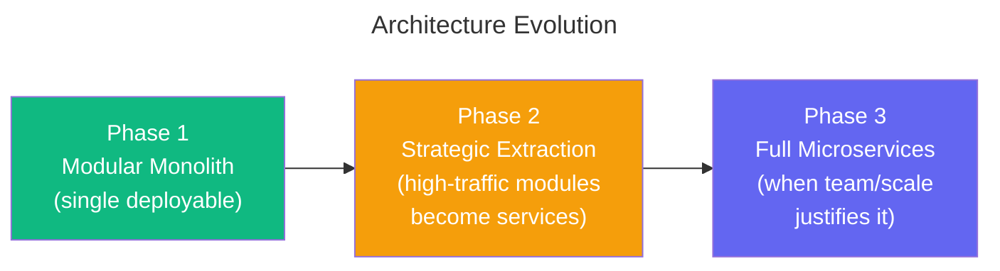
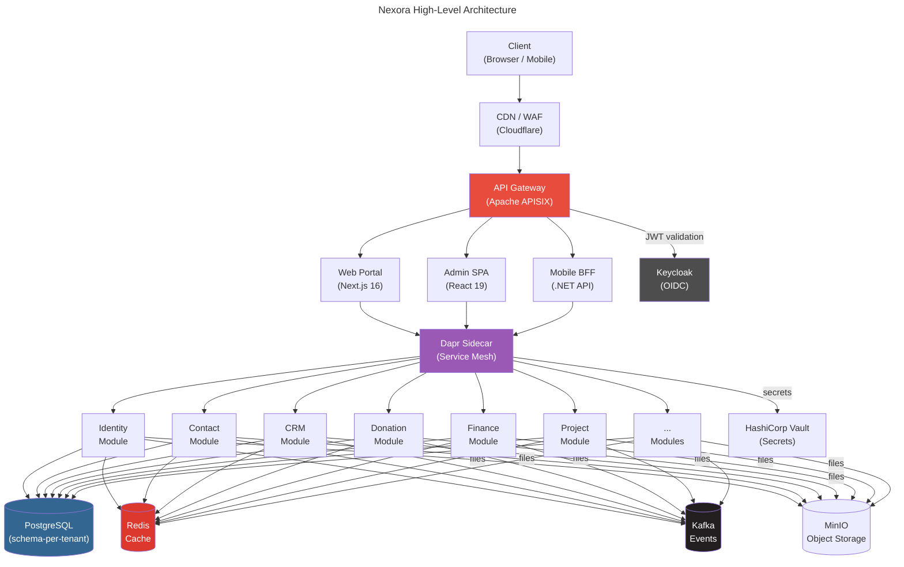
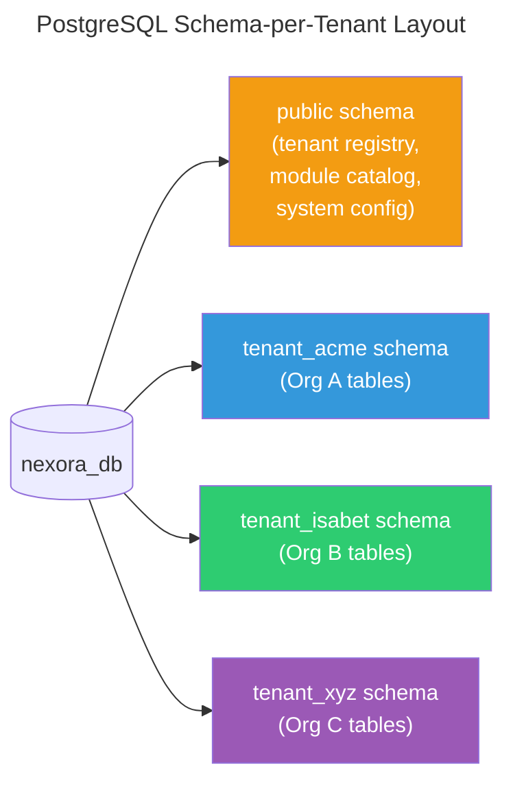
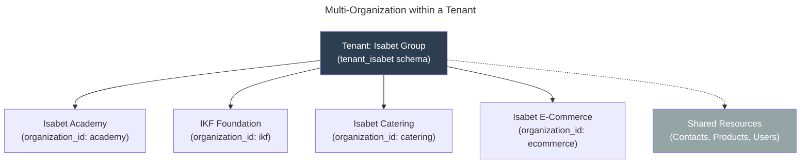
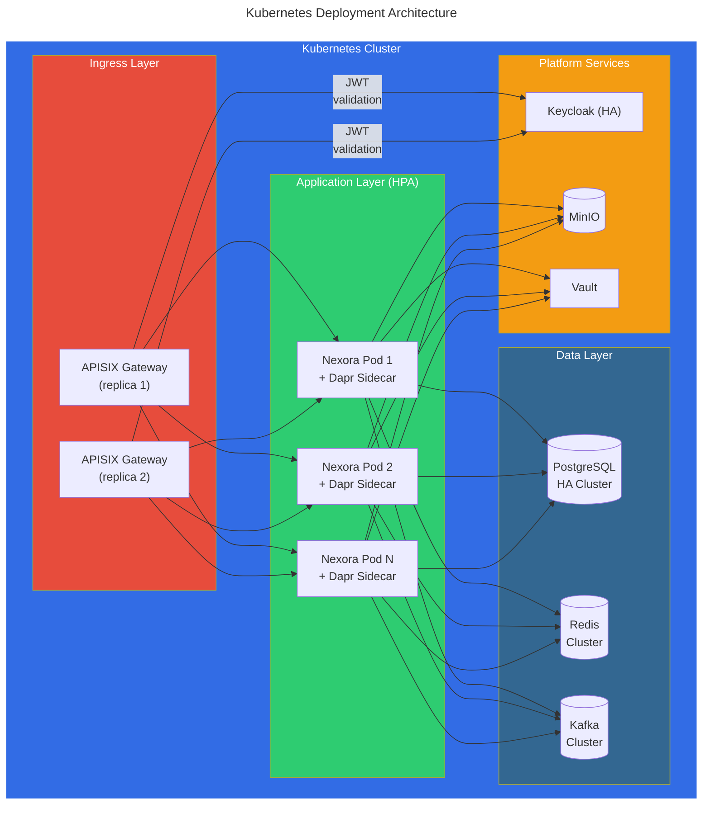

# Nexora - Architecture Overview

## 1. Architecture Style

**Modular Monolith → Microservices** (Evolutionary Architecture)

We start with a **Modular Monolith** approach and evolve to microservices as needed. Each module is a self-contained bounded context with clear interfaces, deployable independently when scale demands it.

### Why Not Microservices From Day One?
- Team size doesn't justify the operational overhead yet
- Module boundaries need to be discovered, not assumed
- Modular monolith gives us the same logical separation with simpler deployment
- Dapr sidecar pattern allows us to extract services later without code changes

### Evolutionary Path


## 2. High-Level Architecture



## 3. Technology Stack

### Backend
| Technology | Role | Why |
|-----------|------|-----|
| **.NET 10** | Application framework | High performance, mature ecosystem, strong typing, native AOT |
| **ASP.NET Core** | Web API framework | First-class OpenAPI, minimal APIs, gRPC support |
| **Entity Framework Core** | ORM | Code-first migrations, LINQ, multi-tenant query filters |
| **MediatR** | In-process messaging | CQRS pattern, clean module boundaries, pipeline behaviors |
| **FluentValidation** | Request validation | Declarative, testable validation rules |
| **Mapster** | Object mapping | Fastest .NET mapper, compile-time code generation |
| **Hangfire** | Background jobs | Scheduled tasks, recurring jobs, dashboard |

### Infrastructure & Middleware
| Technology | Role | Why |
|-----------|------|-----|
| **PostgreSQL 17** | Primary database | Multi-schema support (ideal for multi-tenancy), JSONB, full-text search |
| **Apache APISIX** | API Gateway | Rate limiting, auth, load balancing, plugin ecosystem, better than Kong for our scale |
| **Dapr** | Distributed runtime | Service invocation, pub/sub, state management, secrets — abstracts infrastructure |
| **Apache Kafka** | Event streaming | Cross-module events, audit log, data sync, replay capability |
| **Redis** | Caching & sessions | Distributed cache, rate limiting, real-time features |
| **HashiCorp Vault** | Secret management | API keys, DB credentials, encryption keys rotation |
| **Keycloak** | Identity provider | OAuth2/OIDC, social login, MFA, tenant-aware realms |
| **MinIO** | Object storage | S3-compatible, documents, images, attachments |

### Frontend
| Technology | Role | Why |
|-----------|------|-----|
| **React 19 + TypeScript** | Admin Dashboard SPA | Rich ecosystem, component libraries, strong community |
| **Next.js 16** | Public Portals & CMS | SSR/SSG for SEO, ISR for dynamic content, Turbopack stable, edge runtime |
| **Tailwind CSS 4** | Styling | Utility-first, themeable (white-label support), design system friendly |
| **shadcn/ui** | Component library | Accessible, customizable, not a dependency but owned code |
| **TanStack Query** | Server state | Caching, optimistic updates, real-time sync |
| **Zustand** | Client state | Lightweight, no boilerplate, TypeScript native |

### DevOps & Observability
| Technology | Role | Why |
|-----------|------|-----|
| **Docker** | Containerization | Consistent dev/prod environments |
| **Kubernetes (K8s)** | Orchestration | Auto-scaling, rolling deployments, self-healing |
| **Helm** | K8s package management | Templated deployments per environment |
| **GitHub Actions** | CI/CD | Native GitHub integration, matrix builds |
| **OpenTelemetry** | Distributed tracing | Vendor-agnostic observability |
| **Grafana + Loki + Tempo** | Monitoring stack | Logs, metrics, traces in one place |
| **SonarQube** | Code quality | Static analysis, security scanning |

### Communication & Integration
| Technology | Role | Why |
|-----------|------|-----|
| **Twilio / Netgsm** | SMS gateway | International + Turkey SMS support |
| **WhatsApp Business API** | WhatsApp messaging | Direct from CRM/Donation modules |
| **SendGrid / Mailgun** | Email delivery | Transactional + bulk email |
| **Stripe** | Payment processing | Global payments, recurring, multi-currency |
| **iyzico / Param** | Local payment (TR) | Turkish market payment support |

## 4. Multi-Tenancy Strategy

### Schema-per-Tenant (PostgreSQL)


**Why schema-per-tenant?**
- Strong data isolation (regulatory compliance)
- Independent backup/restore per tenant
- Tenant-specific migrations possible
- No row-level filtering overhead (vs. shared schema + tenant_id)
- PostgreSQL handles thousands of schemas efficiently

### Multi-Organization within Tenant
Within a tenant, multiple organizations (companies) share the same schema:


## 5. Module Architecture

Each module follows **Clean Architecture** internally:

```
Nexora.Modules.CRM/
├── Domain/              # Entities, Value Objects, Domain Events
│   ├── Entities/
│   ├── ValueObjects/
│   ├── Events/
│   └── Interfaces/
├── Application/         # Use Cases, Commands, Queries (CQRS)
│   ├── Commands/
│   ├── Queries/
│   ├── DTOs/
│   └── Validators/
├── Infrastructure/      # EF DbContext, External Services, Repositories
│   ├── Persistence/
│   ├── ExternalServices/
│   └── Configuration/
├── Api/                 # Controllers / Endpoints
│   ├── Endpoints/
│   └── Middleware/
└── Module.cs            # Module registration & dependency injection
```

### Module Communication
- **In-process**: MediatR notifications (domain events)
- **Cross-service**: Dapr pub/sub over Kafka (integration events)
- **Sync calls**: Dapr service invocation (when eventual consistency won't work)

## 6. Cross-Cutting Concerns

| Concern | Implementation |
|---------|---------------|
| Authentication | Keycloak OIDC → JWT validation in APISIX + .NET |
| Authorization | Permission-based RBAC with organization scope |
| Audit Logging | Kafka event stream → audit log consumer |
| Multi-tenancy | Tenant resolution middleware → schema switching |
| Caching | Redis with tenant-prefixed keys |
| Rate Limiting | APISIX plugin (per-tenant, per-API) |
| File Storage | MinIO with tenant-isolated buckets |
| Search | PostgreSQL full-text search (→ Elasticsearch when needed) |
| Localization | .NET resource files + DB-driven translations |
| Feature Flags | Custom implementation with Redis-backed store |

## 7. Deployment Architecture



## 8. Key Architecture Decisions Summary

| Decision | Choice | ADR |
|----------|--------|-----|
| Architecture style | Modular Monolith (evolvable) | [ADR-001](../decisions/ADR-001-modular-monolith.md) |
| Multi-tenancy | Schema-per-tenant | [ADR-002](../decisions/ADR-002-multi-tenancy.md) |
| Database | PostgreSQL | [ADR-003](../decisions/ADR-003-database.md) |
| Auth provider | Keycloak | [ADR-004](../decisions/ADR-004-auth-provider.md) |
| API Gateway | Apache APISIX | [ADR-005](../decisions/ADR-005-api-gateway.md) |
| Event bus | Kafka via Dapr | [ADR-006](../decisions/ADR-006-event-bus.md) |
| Frontend | React (Admin) + Next.js (Portal) | [ADR-007](../decisions/ADR-007-frontend.md) |
| Object storage | MinIO | [ADR-008](../decisions/ADR-008-object-storage.md) |
