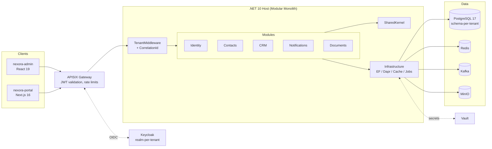

# Architecture Overview

> Date: 2026-04-22. The pre-restructure long-form overview has been archived at
> [`../_archive/architecture-legacy/OVERVIEW.md`](../_archive/architecture-legacy/OVERVIEW.md).

## 1. What Nexora is

Nexora is a **modular, multi-tenant enterprise platform** built as a **Modular Monolith** with
**Clean Architecture** applied per module. A single .NET 10 host process loads module assemblies
at boot; each module owns its domain, its EF Core `DbContext`, and its HTTP surface. Tenants are
isolated by **PostgreSQL schema-per-tenant**; organizations within a tenant are isolated by row
filters. Two UI clients — **nexora-admin** (React 19) and **nexora-portal** (Next.js 16) — compose
their screens at runtime from per-module manifests (see ADR-017 and
[`portal-extensions.md`](./portal-extensions.md)).

## 2. Solution structure

```
src/
├── Nexora.Host/                    # ASP.NET Core host; loads modules
├── Nexora.SharedKernel/            # Shared types, base classes, strongly-typed IDs
├── Nexora.Infrastructure/          # Cross-cutting: EF, Dapr, Hangfire, cache, secrets
├── Modules/
│   ├── Nexora.Modules.Identity/    # Auth, tenants, organizations, users, RBAC
│   ├── Nexora.Modules.Contacts/    # Unified contact registry
│   ├── Nexora.Modules.CRM/         # Leads, pipelines, campaigns
│   ├── Nexora.Modules.Notifications/
│   ├── Nexora.Modules.Documents/
│   └── ... one project per module
└── Clients/
    ├── nexora-admin/               # React 19 admin dashboard
    └── nexora-portal/              # Next.js 16 tenant-facing portal
```

Every module follows the same internal layout:

```
Nexora.Modules.{Name}/
├── Domain/              # Entities, VOs, Domain events, Interfaces
├── Application/         # CQRS handlers (MediatR), DTOs, Validators
├── Infrastructure/      # DbContext, repositories, external adapters
└── Api/                 # Endpoint groups, middleware
```

## 3. Tech stack (quick reference)

| Concern | Choice |
|---------|--------|
| Runtime / language | .NET 10, C# |
| Web framework | ASP.NET Core minimal APIs + MediatR |
| Database | PostgreSQL 17, EF Core (Code-First, additive migrations) |
| Cache | Redis via Dapr state store (through `ICacheService`) |
| Messaging | Kafka via Dapr pub/sub (integration events); MediatR notifications in-process |
| Auth | Keycloak (realm-per-tenant, OIDC), APISIX gateway validates JWT |
| Secrets | Dapr secret store → HashiCorp Vault (prod) |
| Files | MinIO (S3-compatible), presigned URLs |
| Jobs | Hangfire on PostgreSQL, `NexoraJob<TParams>` base class |
| Frontend (admin) | React 19 + TypeScript + TanStack Query + Zustand + Tailwind 4 + shadcn/ui |
| Frontend (portal) | Next.js 16 + next-intl |
| Observability | OpenTelemetry → Grafana / Loki / Tempo, Serilog structured logs |
| Delivery | Docker, Kubernetes, Helm, GitHub Actions |

## 4. System topology


```mermaid
flowchart LR
  subgraph Clients
    A[nexora-admin<br/>React 19]
    P[nexora-portal<br/>Next.js 16]
  end

  GW[APISIX Gateway<br/>JWT validation, rate limits]

  subgraph Host[".NET 10 Host (Modular Monolith)"]
    direction TB
    MID[TenantMiddleware<br/>+ CorrelationId]
    subgraph Modules
      IDN[Identity]
      CON[Contacts]
      CRM[CRM]
      NOT[Notifications]
      DOC[Documents]
    end
    SK[SharedKernel]
    INF[Infrastructure<br/>EF / Dapr / Cache / Jobs]
  end

  subgraph Data
    PG[(PostgreSQL 17<br/>schema-per-tenant)]
    RD[(Redis)]
    KF[(Kafka)]
    MN[(MinIO)]
  end

  KC[Keycloak<br/>realm-per-tenant]
  VT[Vault]

  A --> GW
  P --> GW
  GW --> MID
  MID --> Modules
  Modules --> SK
  Modules --> INF
  INF --> PG
  INF --> RD
  INF --> KF
  INF --> MN
  GW <-.OIDC.-> KC
  INF <-.secrets.-> VT
```

## 5. Key architecture rules

The following invariants are enforced by architecture tests, code review, and CI:

### Module boundaries
- Modules **must not** reference other modules' internal types directly.
- Cross-module communication is either:
  - **MediatR notifications** (in-process, same transaction boundary), or
  - **Dapr integration events** over Kafka (asynchronous, cross-boundary).
- Shared contracts live in `Nexora.SharedKernel`.
- Each module owns its `DbContext`; no shared tables across modules.
- Module tables are prefixed `{module}_{table}` within the tenant schema.

### Multi-tenancy
- Tenant resolution: JWT `tenant_id` claim → `TenantMiddleware` → `ITenantContextAccessor`.
- Isolation: **schema-per-tenant** in PostgreSQL; one schema per tenant, managed by
  `TenantSchemaManager`. Details in [`multi-tenancy.md`](./multi-tenancy.md).
- Within a tenant, organizations are isolated by an `organization_id` column plus EF global
  query filters.
- Cache keys are automatically tenant-prefixed by `DaprCacheService`; module code never prepends
  `tenantId`.

### Authentication & authorization
- **Keycloak** is the sole identity provider; one realm per tenant.
- **JWT** is validated at APISIX, then re-validated by the host.
- RBAC uses permission keys of the form `{module}.{resource}.{action}` and is evaluated
  server-side; frontend checks are UX only.

### Data & persistence
- Strongly-typed IDs (never raw `Guid`/`int` in domain code).
- `AuditableEntity<T>` provides soft-delete (`IsDeleted`) enforced by global query filters.
  Hard delete is allowed only for GDPR, join-table reconciliation, and uninstall cleanup.
- Migrations are **additive-only** in production.

### Error model & observability
- Two-tier error handling: `Result.Failure()` for expected failures, exceptions for the
  unexpected; `GlobalExceptionHandler` produces the standard `ApiEnvelope`.
- All user-facing strings are `lockey_` keys; backend never returns translated text.
- Structured logging with Serilog; `CorrelationId` threaded through every request.
- OpenTelemetry traces + module-scoped metrics.

## 6. Where to go next

- Deeper architectural narrative: [`OVERVIEW.md`](./OVERVIEW.md).
- Module plugin model: [`MODULE_SYSTEM.md`](./MODULE_SYSTEM.md).
- Tenant isolation deep dive: [`multi-tenancy.md`](./multi-tenancy.md).
- Frontend extension assembly: [`portal-extensions.md`](./portal-extensions.md).
- Request path / observability: [`COMMUNICATION_FLOW.md`](./COMMUNICATION_FLOW.md).
- Management portal: [`MANAGEMENT_PORTAL.md`](./MANAGEMENT_PORTAL.md).

## References

- ADR-001 — Modular Monolith
- ADR-002 — Schema-per-Tenant
- ADR-003 — Deployment Strategy
- ADR-016 — Module Tier Classification
- Standard: [`../standards/architectural-principles.md`](../standards/architectural-principles.md)
  (or the legacy `INFRASTRUCTURE_STANDARDS.md` / `CODING_STANDARDS.md` until the split lands).
