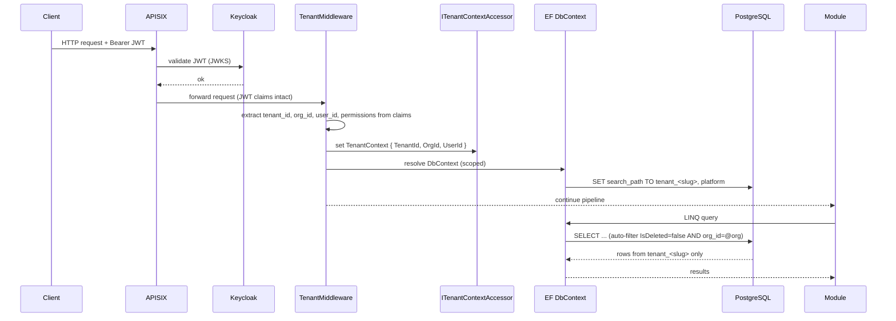

# Multi-Tenancy — Schema-per-Tenant Deep Dive

> Companion to [`overview.md`](./overview.md) and [`MODULE_SYSTEM.md`](./MODULE_SYSTEM.md).
> Source of record: **ADR-002** (schema-per-tenant). Related: ADR-004 (permission seeding),
> ADR-012 (tenant management).
> Date: 2026-04-22.

## 1. Isolation model

Nexora runs one logical database per environment; tenants are isolated **by PostgreSQL schema**.
Every tenant has a dedicated schema (`tenant_<slug>`) containing the tables of every module
installed for that tenant. Platform-wide metadata (tenants, licenses, module registry) lives in
a separate `platform` schema.

| Layer | Isolation mechanism |
|-------|---------------------|
| Tenant | Schema-per-tenant (strong; physically separate search path) |
| Organization | `organization_id` column + EF Core global query filter |
| User | Row-level predicates on ownership columns where applicable |
| Identity | Keycloak **realm-per-tenant** |
| Cache | `DaprCacheService` transparently prefixes keys with `tenantId` |
| Files | MinIO bucket paths prefixed `tenants/{tenantId}/...` |
| Jobs | `TenantJobFilter` captures and re-applies tenant context |

This matches the decision recorded in **ADR-002**: schema-per-tenant was selected over
row-per-tenant for its stronger isolation, easier per-tenant backups, and clean uninstall
semantics (dropping a schema removes all tenant data atomically).

## 2. Tenant resolution pipeline

Every request passes through `TenantMiddleware` before reaching a module endpoint.

Key points:

- **Claims used**: `tenant_id`, `org_id` (current organization), `sub` (user), plus flattened
  permission claims (`{module}.{resource}.{action}`).
- **`ITenantContextAccessor`** is the single source of truth for "who am I and where am I";
  infrastructure code reads it, modules never.
- **`search_path`** is set per-scope on the EF connection when the `DbContext` is resolved,
  ensuring every query in the request targets the correct schema without model changes.
- **Global query filters** on `AuditableEntity<T>` enforce `IsDeleted = false` and (where
  applicable) organization filtering at the LINQ layer.

## 3. Schema lifecycle — `TenantSchemaManager`

`TenantSchemaManager` (in `Nexora.Infrastructure`) is the only component allowed to issue DDL
against tenant schemas. It is driven by lifecycle events from the Identity module.

| Event | Action |
|-------|--------|
| Tenant created | `CREATE SCHEMA tenant_<slug>`; apply every enabled module's migrations to that schema; seed permissions (ADR-004). |
| Module installed for tenant | Apply just that module's migrations inside the tenant schema; register module in `platform.tenant_modules`; re-seed permissions for the new surface area. |
| Module uninstalled for tenant | Drop module tables (prefixed `{module}_`) from the tenant schema; remove permissions; evict tenant-scoped caches for the module's keys. |
| Tenant deprovisioned | `DROP SCHEMA tenant_<slug> CASCADE`; remove realm in Keycloak; purge MinIO prefix; revoke Hangfire recurring jobs. |

Uninstall tolerates orphans: hard delete is explicitly permitted for this path (see the soft
delete rules in `CLAUDE.md`). Schemas are never shared across tenants, so dropping a schema
never affects another tenant's data.

## 4. Module tables and permission surface

- Every module migration declares its tables with the `{module}_` prefix (`crm_leads`,
  `contacts_persons`, etc.) and runs against the tenant schema provided by `TenantSchemaManager`.
- **ADR-004** centralizes permission seeding: during install, the tenant's declared permissions
  are projected from the module manifest into Keycloak realm roles and into the tenant's
  `identity_permissions` table.
- Removing a module removes both its tables **and** its permission rows/roles.

## 5. Organization-level filtering

Inside a tenant, organizations are a soft boundary (not a physical one). Nexora relies on:

- An `organization_id` column on every org-scoped entity.
- An **EF Core global query filter** that injects `EF.Property<Guid>(e, "organization_id") ==
  currentOrgId` from `ITenantContextAccessor`.
- Service-layer checks for cross-org operations (e.g., bulk reports that span all orgs for a
  platform-admin).

Bypassing the filter requires an explicit `IgnoreQueryFilters()` and is reserved for audit
surfaces — never for user-facing reads.

## 6. Keycloak realm-per-tenant mapping

- Each tenant has its own Keycloak realm; realm name matches the tenant slug.
- Realms are provisioned by the Identity module on tenant creation using the Keycloak admin API.
- Users, groups, and roles are tenant-local; there is no cross-realm user sharing.
- Platform administrators (NMP users) live in a dedicated `platform` realm and receive elevated
  permissions gated by `platform.*` permission keys.
- Role ↔ permission mapping is maintained by the centralized permission seeder (ADR-004).

## 7. Tenant propagation into background jobs

Hangfire jobs run outside the HTTP pipeline, so the JWT-driven resolution above does not apply.
Nexora's base class `NexoraJob<TParams>` plus **`TenantJobFilter`** keep tenant context intact:

1. When a job is enqueued, `TenantJobFilter` captures `TenantId` and `OrgId` from the current
   `ITenantContextAccessor` and stores them as Hangfire job parameters.
2. When the worker picks up the job, the filter reads those parameters, constructs a
   `TenantContext`, and pushes it into `ITenantContextAccessor` for the duration of the job.
3. `NexoraJob<TParams>.RunAsync` wraps the handler in a tenant-scoped DI scope with the correct
   EF `search_path`, logging scope (`TenantId`, `JobId`, `CorrelationId`), and tracing span.
4. Recurring jobs registered in `IModule.ConfigureJobs()` must declare their tenant context
   explicitly (they typically fan out per tenant).

## 8. Operational notes

- **Backups**: per-tenant backups are `pg_dump -n tenant_<slug>`; restore is `pg_restore` into
  a new schema name.
- **Migrations**: adding a table to a module means the next install of that module (or the next
  deploy's startup migration step) applies it to **every** tenant schema that has the module
  installed. Migrations are additive-only to keep rollback cheap.
- **Diagnostics**: `TenantMiddleware` tags every log scope with `TenantId`; queries can be
  sliced in Loki with `{TenantId="..."}`.
- **Testing**: integration tests spin up an ephemeral PostgreSQL, create `tenant_test_*`
  schemas, and exercise install/uninstall/migration paths.

## References

- **ADR-002** — Schema-per-Tenant (source of record)
- **ADR-004** — Centralized Permission Seeding
- **ADR-012** — Tenant Management
- Standard: `../standards/architectural-principles.md` (multi-tenancy section)
  and `../operations/TENANT_OPERATIONS.md` for the runbook.
- [`MODULE_SYSTEM.md`](./MODULE_SYSTEM.md) — module install/uninstall hooks consumed here.
