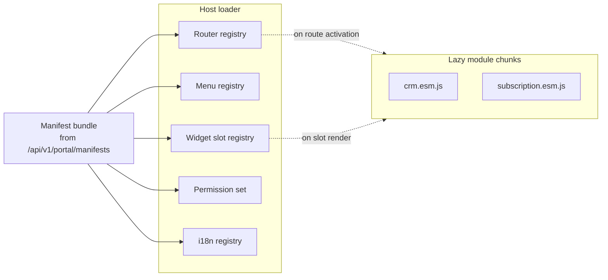

# Portal Extension Architecture

> Long-form derivative of **ADR-017** (source of truth). Companion to
> [`MODULE_SYSTEM.md`](./MODULE_SYSTEM.md) and [`multi-tenancy.md`](./multi-tenancy.md).
> Date: 2026-04-22.

## 1. Purpose

Nexora's two frontends — **nexora-admin** (React 19) and **nexora-portal** (Next.js 16) — are
*hosts*. They do not know ahead of time which modules a given tenant has installed, which
license the tenant carries, or which permissions the current user holds. Instead, at boot they
ask the backend for a **tenant-specific, user-filtered set of module manifests** and assemble
the UI — routes, navigation, widgets, permissions, translations — from that set.

This doc is the operator's and module author's guide to that mechanism. ADR-017 is the decision;
this document is how it behaves in practice.

## 2. The `module.manifest.yaml` schema (v1)

Every Tier-2+ module publishes a `module.manifest.yaml` at the root of its frontend package.
Tier-1 modules (Portal Framework, Admin Dashboard) may opt in; their host shells are implicit.

Below is every field, its purpose, whether it is required, and an example value.

### 2.1 Top-level: `manifestVersion`
- **Required.** Integer. Current value: `1`.
- Purpose: schema version. Additive changes keep the version; breaking changes require a new
  version **and** a superseding ADR. The host refuses manifests whose version it does not
  understand and surfaces a diagnostic.
- Example: `manifestVersion: 1`

### 2.2 `module` block

| Field | Required | Purpose | Example |
|-------|----------|---------|---------|
| `id` | yes | kebab-case module ID; must match the backend module ID exactly. Used as the routing namespace, cache key segment, and default i18n namespace. | `crm` |
| `name` | yes | i18n key for the display name; the portal resolves it against the module's own locale bundle. Never a literal string. | `lockey_crm_module_name` |
| `tier` | yes | Integer 1–4, matching ADR-016. Used for grouping in the admin and for license pre-checks. | `2` |
| `version` | yes | SemVer. The host caches assembled manifests by `{id}@{version}`; a bump invalidates caches. | `1.0.0` |
| `dependencies` | optional | List of module IDs that must also be installed. The assembly endpoint refuses to return a manifest whose dependencies are not satisfied. | `[contacts, notifications]` |
| `license.requires` | optional | One of `none \| enterprise \| ngo \| education \| extension`. License gate. | `enterprise` |
| `license.featureFlag` | optional | Fine-grained flag evaluated at assembly time against tenant feature flags. | `crm.enabled` |

### 2.3 `routes[]`

Describes each UI route the module contributes.

| Field | Required | Purpose |
|-------|----------|---------|
| `path` | yes | URL path. May include params (`:id`). Must start with `/{module-id}/`. |
| `component` | yes | Relative path inside the module bundle; the host resolves it via its `entryPoints.esm` chunk graph and `React.lazy()` loads it on first navigation. |
| `permission` | optional | Permission key; absence means "any authenticated user". If present, route is hidden and gated. |
| `layout` | optional | `portal \| admin \| public`. Defaults to the host's natural layout. |

Example:
```yaml
routes:
  - path: /crm/leads
    component: ./pages/LeadListPage
    permission: crm.leads.read
    layout: portal
```

### 2.4 `menu[]`

Sidebar contributions.

| Field | Required | Purpose |
|-------|----------|---------|
| `section` | yes | Logical menu group (`sales`, `ops`, `admin`, ...). The host renders sections in a fixed order; items within a section sort by `order`. |
| `label` | yes | i18n key. |
| `icon` | optional | Icon name from the shared icon set. |
| `route` | yes | Path to navigate to; must correspond to a declared route. |
| `order` | optional | Integer sort key within the section. Default `1000`. |
| `permission` | optional | Hides the item when the user lacks the permission. |

### 2.5 `widgets[]`

Dashboard / slot contributions.

| Field | Required | Purpose |
|-------|----------|---------|
| `id` | yes | Stable ID (`{module}.{widget-name}`). |
| `slot` | yes | Host-provided slot ID (e.g., `dashboard.main`, `contacts.sidebar`). |
| `component` | yes | Lazy-loaded React component path. |
| `permission` | optional | Gate. |
| `order` | optional | Sort key within the slot. |

### 2.6 `permissions`

| Field | Required | Purpose |
|-------|----------|---------|
| `namespace` | yes | Module-owned prefix (`crm`). |
| `declared[]` | yes | Exhaustive list of permission keys the module ships. The assembly endpoint cross-checks against the backend's registry (ADR-004) and refuses to return the manifest on mismatch. |

### 2.7 `i18n`

| Field | Required | Purpose |
|-------|----------|---------|
| `namespace` | yes | i18n namespace (usually the module ID). |
| `locales[]` | yes | Shipped locales. Minimum `[en, tr]`. |
| `path` | yes | Relative path inside the bundle containing `{locale}.json`. |

### 2.8 `entryPoints`

| Field | Required | Purpose |
|-------|----------|---------|
| `esm` | yes | Path to the module's ESM bundle as served by the host (`/_modules/{id}/...`). |
| `integrity` | required for Tier 4 | SRI hash used to verify marketplace modules before executing them. |

## 3. Backend assembly — `GET /api/v1/portal/manifests`

The endpoint is owned by the Portal Framework module. On each portal or admin boot the host
calls it; output is cached per `(tenantId, userId, licenseHash, moduleVersionHash)`.

```mermaid
sequenceDiagram
  participant HOST as Portal / Admin Host
  participant API as /api/v1/portal/manifests
  participant TEN as Identity (tenant + license)
  participant REG as Module Registry
  participant PERM as Permissions
  participant CACHE as Redis (L2)

  HOST->>API: GET (JWT)
  API->>CACHE: lookup by (tenantId, userId, licenseHash, versionHash)
  alt cache hit
    CACHE-->>API: serialized manifest bundle
  else cache miss
    API->>TEN: resolve tenant, license, feature flags
    API->>REG: list installed modules for tenant
    loop for each installed module
      REG-->>API: published manifest.yaml
      API->>API: evaluate license.requires / featureFlag
      API->>PERM: filter routes/menu/widgets by user permissions
    end
    API->>API: merge + sort menu; collect permissions; collect i18n namespaces
    API->>CACHE: store (TTL = shortest of module versions' TTLs)
  end
  API-->>HOST: ApiEnvelope<AssembledManifestBundle>
  HOST->>HOST: hydrate runtime registry, begin lazy loading
```

Result shape (abbreviated):

```jsonc
{
  "manifestVersion": 1,
  "tenantId": "...",
  "modules": [
    { "id": "crm", "version": "1.0.0",
      "routes": [...], "menu": [...], "widgets": [...],
      "permissions": ["crm.leads.read", ...],
      "i18n": { "namespace": "crm", "locales": ["en","tr"] },
      "entryPoints": { "esm": "/_modules/crm/crm.esm.js", "integrity": null }
    }
  ]
}
```

Filtering rules:
- **License**: if `license.requires` is not in the tenant's plan, the *entire* module manifest
  is dropped.
- **Feature flag**: same, but evaluated against the tenant feature flag store.
- **Permission**: applied per-route / per-menu-item / per-widget. The module itself is not
  dropped if the user lacks every permission — its i18n namespace may still be needed for
  notifications, etc.

## 4. Host loader mechanics

Both hosts share the same loader design; they differ only in router / i18n libraries.

### 4.1 Chunk lazy-loading
- The host wraps each `component` path in `React.lazy(() => import(entryPoints.esm).then(m =>
  m[componentName]))`.
- Chunks are fetched on first activation. Tier-4 modules verify the SRI `integrity` before
  executing.
- A chunk load failure renders the host's `ModuleLoadErrorBoundary` with a retry and a link to
  the diagnostic log.

### 4.2 Permission filter
- The assembled bundle already has server-side filtering applied; client-side filtering via
  `usePermissions()` is a second defense for UX-only visibility (hiding a menu item while the
  user's role is transiently updated).

### 4.3 i18n registration
- On hydration, each module's i18n namespace is registered with **`next-intl`** (portal) or
  **`react-i18next`** (admin) and locale JSON is fetched from the module bundle.
- Missing keys fall back to the module's `en` bundle and log a warning.

### 4.4 Menu merge
- The host's `Sidebar` takes the union of all modules' `menu[]`, groups by `section`, sorts by
  `order`, and dedupes by `route`. Platform menu items (NMP, profile) are appended last.

### 4.5 Widget slot registry
- The host exposes a `SectionRenderer` keyed by `slot`. On hydration, each module's `widgets[]`
  items are inserted into their slot, sorted by `order`. Unknown slots are logged and ignored
  (they may indicate a host/module version skew).

### 4.6 Runtime registry composition



## 5. Failure modes and diagnostics

| Failure | Host behavior | Diagnostic |
|---------|---------------|------------|
| Assembly endpoint 5xx | Boot with cached bundle if present, else show a recoverable "cannot load workspace" screen with retry. | `CorrelationId` logged; Loki query on `{route="GET /api/v1/portal/manifests"}`. |
| Unknown `manifestVersion` | Drop that module; continue booting. | Warning toast for platform admins only; structured log. |
| Permission mismatch vs backend | Drop the module; log server-side. | Surfaces in the NMP "module health" view. |
| Chunk fetch fails (network / SRI) | `ModuleLoadErrorBoundary` with retry. | Browser console + telemetry span `portal.chunk.load`. |
| Unknown widget slot | Widget skipped; warning logged. | Module authors see the warning in dev. |
| Broken i18n JSON | Fall back to `en`; warn. | Missing-key telemetry counter. |

## 6. Testing guidance

Module authors are expected to cover:

1. **Schema test** — validate `module.manifest.yaml` against
   `docs/standards/schemas/module.manifest.v1.json`.
2. **Round-trip test** — assemble through the backend endpoint in an integration test and
   assert that permissions, menu items, and widgets survive filtering for at least two user
   roles.
3. **Chunk test** — smoke test that each declared `component` path resolves to a real export.
4. **Permission coverage** — every `permission` referenced in `routes/menu/widgets` must appear
   in `permissions.declared[]`.

Host tests additionally cover:
- License-gated drop
- Permission-filtered route removal
- Chunk failure isolation (one bad module does not brick the host)
- Menu ordering determinism

## 7. Relationship to other docs

- **Source of truth**: [`../decisions/0017-portal-extension-architecture.md`](../decisions/0017-portal-extension-architecture.md).
- **Backend module contract**: [`MODULE_SYSTEM.md`](./MODULE_SYSTEM.md) — unchanged by this
  mechanism.
- **Tenant context** (the basis for per-tenant filtering): [`multi-tenancy.md`](./multi-tenancy.md).
- **Permission seeding**: ADR-004.
- **Tier classification** (the `tier` field's semantics): ADR-016.
- **Standards**: `../standards/FRONTEND_STANDARDS.md` (module manifest conventions in use today)
  and `../standards/documentation-style.md` for diagram rules.

## 8. Manifest schema artefact — single source of truth

ADR-0017 names two manifest-schema paths in two different sections — the
runtime validator path (`src/Nexora.Infrastructure/PortalExtensions/Schemas/module.manifest.v1.json`,
§Manifest JSON Schema) and a docs publish path (`docs/standards/schemas/module.manifest.v1.json`,
§Implementation notes). Both paths exist for legitimate reasons but the
ADR did not say which is canonical, leaving an implementer free to pick
either and risk drift.

The convention this document fixes — and that the [T-030](../analysis/tasks/phase-2/T-030.md)
pilot enforces in CI — is:

- **Canonical source**: `src/Nexora.Infrastructure/PortalExtensions/Schemas/module.manifest.v1.json`.
  This is the file the runtime `ManifestLoader` validates against and the
  file the `validate-manifests` CI job consumes. Edits land here and
  nowhere else.
- **Public publish path**: `docs/standards/schemas/module.manifest.v1.json`
  is **generated** from the canonical source at build time (a one-line
  `cp` step in the docs-build pipeline) and serves as the URL that
  third-party manifest authors point at via
  `https://schemas.nexora.io/module.manifest.v1.json`. The generated
  file is regenerated on every release; manual edits are forbidden and
  caught by a pre-commit check that compares the two files.
- **Schema version bumps**: a new `manifestVersion` requires a
  superseding ADR per ADR-0017 §Versioning. The new schema file lands
  next to v1 (`module.manifest.v2.json`); v1 is retained for backward
  compatibility until every installed module migrates.

Until the docs-build automation lands (filed inside T-030's acceptance
criteria), either-path edits MUST be mirrored manually with a
"matches canonical" reviewer comment on the PR.
