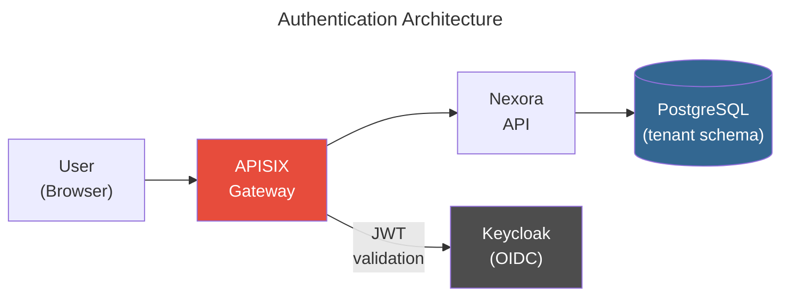
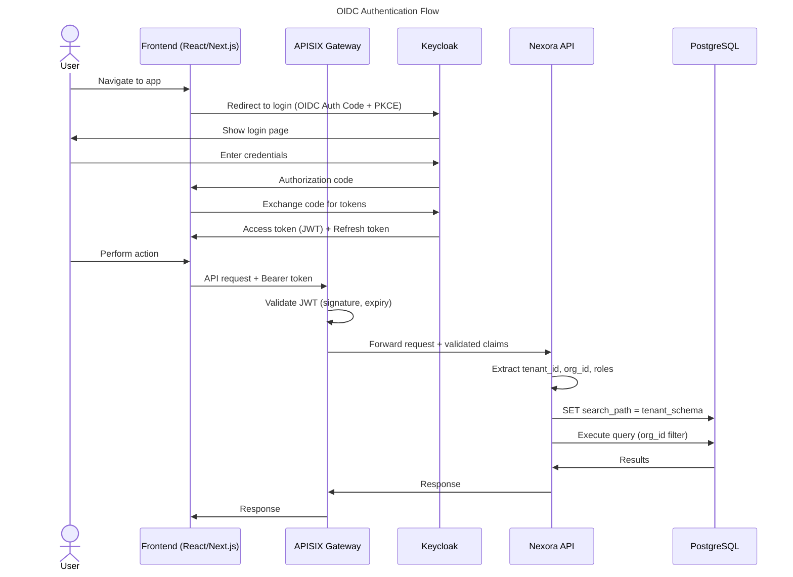
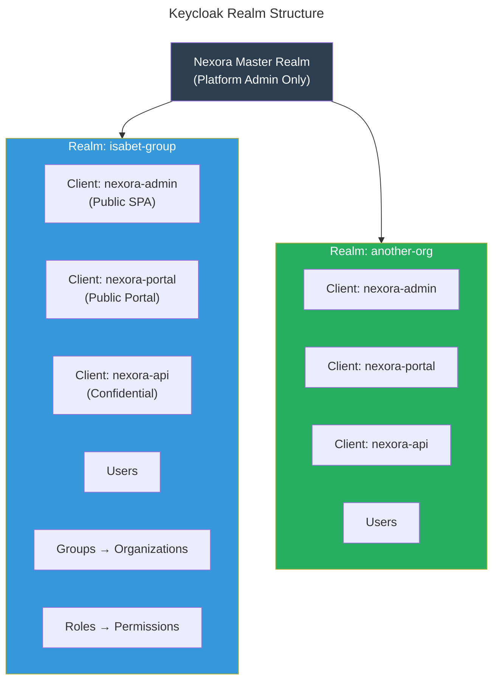
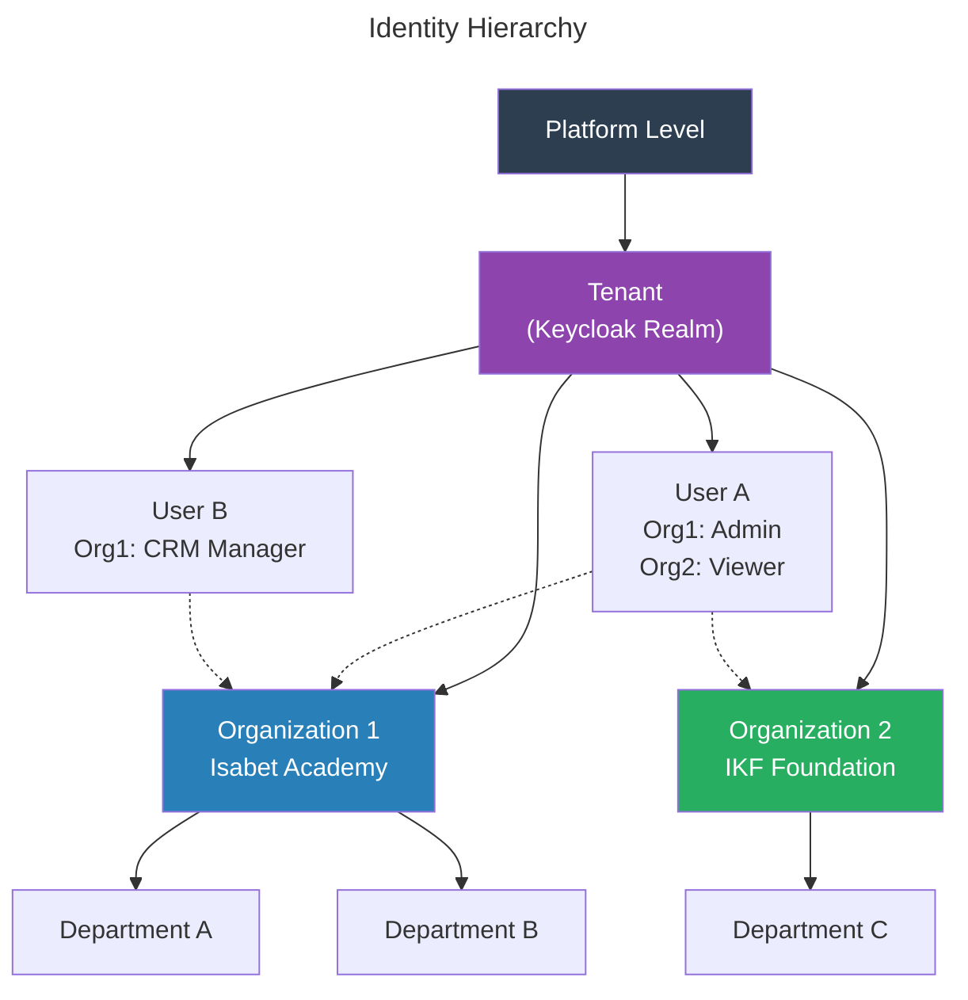

# Nexora - Identity, Authentication & Authorization

## 1. Architecture Overview



### Authentication Flow



## 2. Keycloak Configuration

### Realm Structure


### Why Realm-per-Tenant?
- Complete user isolation between tenants
- Tenant-specific login pages (branding, logo)
- Independent identity provider federation per tenant
- Tenant-specific password policies
- Clean data export/import per tenant

### Client Configuration
| Client | Type | Grant | Use |
|--------|------|-------|-----|
| nexora-admin | Public | Authorization Code + PKCE | Admin SPA login |
| nexora-portal | Public | Authorization Code + PKCE | Portal/donor login |
| nexora-api | Confidential | Client Credentials | Service-to-service |
| nexora-mobile | Public | Authorization Code + PKCE | Mobile app (future) |

### JWT Token Claims
```json
{
  "sub": "user-uuid",
  "iss": "https://auth.nexora.io/realms/isabet-group",
  "aud": "nexora-api",
  "tenant_id": "isabet-group",
  "org_id": "org-uuid",
  "organizations": ["isabet-academy", "ikf"],
  "roles": ["admin", "crm.manager"],
  "permissions": ["crm.leads.read", "crm.leads.write", "donations.view"],
  "exp": 1711111111,
  "iat": 1711107511
}
```

### Permission Resolution (Frontend)
The frontend resolves permissions from two sources with backend priority:

1. **`GET /api/v1/identity/users/me`** — returns `permissions` array loaded from DB (OrganizationUser → UserRole → RolePermission → Permission)
2. **JWT `permissions` claim** — fallback if `/me` fails

```
Frontend useAuth → api.get('/identity/users/me') → response.permissions
                 ↓ fallback
                 JWT claims.permissions (Keycloak user attribute)
```

This ensures newly added permissions (e.g., audit module) are immediately available after role assignment, without requiring Keycloak token refresh or re-login.

## 3. Multi-Tenancy Identity Model



### Tenant Resolution
Request → APISIX extracts JWT → `tenant_id` claim → Nexora sets PG schema

Priority chain for tenant resolution:
1. JWT `tenant_id` claim (authenticated requests)
2. `X-Tenant-Id` header (service-to-service, validated against service account)
3. Domain mapping: `isabetacademy.nexora.io` → tenant lookup table

## 4. Authorization Model

### Permission-Based RBAC

```
Permission: {module}.{resource}.{action}

Examples:
- crm.leads.read
- crm.leads.write
- crm.leads.delete
- crm.leads.assign
- donations.donations.read
- donations.donations.create
- donations.campaigns.manage
- contacts.contacts.read
- contacts.contacts.merge
- admin.users.manage
- admin.roles.manage
```

### Role Definition
Roles are **tenant-defined** (not hardcoded). Default roles are seeded but can be customized:

```json
{
  "role": "CRM Manager",
  "organization": "Isabet Academy",
  "permissions": [
    "crm.leads.*",
    "crm.pipeline.*",
    "contacts.contacts.read",
    "contacts.contacts.write",
    "reports.crm.*"
  ]
}
```

### Built-in System Roles (Non-deletable)
| Role | Scope | Description |
|------|-------|-------------|
| Platform Admin | Platform | Manages tenants, modules, system config |
| Tenant Admin | Tenant | Manages all organizations within tenant |
| Org Admin | Organization | Full access within one organization |

### Organization-Scoped Access
Users can have different roles in different organizations:
```
User: Ahmet Bey
├── Isabet Academy → Role: "Accountant" (finance.*, reports.finance.*)
└── IKF Foundation → Role: "Donation Manager" (donations.*, reports.donations.*)
```

**Active Organization**: The frontend sets an `X-Organization-Id` header. The API filters all data by this organization. Users can switch organizations in the UI.

## 5. Data Access Control

### Entity-Level Access
```csharp
// Automatic query filter applied by EF Core
modelBuilder.Entity<Lead>()
    .HasQueryFilter(l => l.OrganizationId == _currentOrganization.Id);

// Additional row-level security for sensitive data
modelBuilder.Entity<Donation>()
    .HasQueryFilter(d =>
        d.OrganizationId == _currentOrganization.Id &&
        (_currentUser.HasPermission("donations.donations.read.all") ||
         d.AssignedToUserId == _currentUser.Id));
```

### Shared Resources
Some resources are shared across organizations within a tenant:
- **Contacts**: Visible across orgs (360-degree view), but activities are org-scoped
- **Products**: Configurable (shared or org-specific)
- **Users**: Can belong to multiple orgs

### Cross-Organization Reporting
Users with `reports.consolidated.read` permission can run reports across all organizations they have access to.

## 6. Portal Authentication

### External Users (Donors, Parents, Volunteers)
- Separate Keycloak client (`nexora-portal`)
- Self-registration allowed (with email verification)
- Social login options (Google, Apple — configurable per tenant)
- Limited permissions (only portal-scoped)

### Portal Permissions
```
portal.profile.read
portal.profile.edit
portal.donations.read        (own donations)
portal.donations.create
portal.sponsorships.read      (own sponsorships)
portal.documents.read         (own documents)
portal.appointments.book
```

### Guest Access
Some actions don't require authentication:
- Viewing public donation pages
- Making one-time donations (guest checkout)
- Filling contact/volunteer forms

## 7. Security Measures

### Token Management
- Access token TTL: 5 minutes
- Refresh token TTL: 30 days (with rotation)
- Refresh token rotation: new refresh token on each use, old one invalidated
- Token revocation on: password change, role change, account deactivation

### API Security (APISIX)
- JWT validation (signature, expiry, audience)
- Rate limiting per tenant (prevent noisy neighbor)
- Rate limiting per user (prevent abuse)
- IP allowlisting (optional, for admin APIs)
- Request size limits
- CORS configuration per tenant domain

### Audit Logging
Audit logging is handled by the standalone **Audit module** (`Nexora.Modules.Audit`). It captures all command executions across all modules via the `AuditLogBehavior` MediatR pipeline behavior.

**How it works:**
- `AuditLogBehavior` intercepts all `ICommand` / `ICommand<T>` requests
- Checks `IAuditConfigService` to determine if the operation is enabled for the tenant
- After handler execution, builds an `AuditEntry` with rich context and persists via `IAuditStore`
- Audit failures never block business operations

**Configurable per tenant:**
- Admins with `audit.settings.manage` permission can enable/disable auditing per module and per operation
- Operations are auto-discovered from all registered modules' command types
- Auth events (Login, Logout, PasswordChange, TokenRefresh) are also configurable

**Audit entry fields:**
| Field | Description |
|-------|-------------|
| Module | Source module (e.g., identity, contacts) |
| Operation | Command name (e.g., CreateUser, DeleteContact) |
| OperationType | Create, Update, Delete, or Action |
| UserId / UserEmail | Who performed the action |
| IpAddress | Client IP (via X-Forwarded-For or RemoteIpAddress) |
| UserAgent | Browser/client info |
| CorrelationId | Request trace correlation |
| IsSuccess | Whether the operation succeeded |
| ErrorKey | Localization key if failed |
| EntityType / EntityId | Affected entity |
| BeforeState / AfterState | Entity snapshots (Phase 2) |
| Changes | Field-level diff (Phase 2) |

**Permission model:**
| Permission | Description |
|------------|-------------|
| `audit.logs.read` | View audit log entries |
| `audit.logs.export` | Export audit logs |
| `audit.settings.read` | View audit configuration |
| `audit.settings.manage` | Enable/disable auditing per module/operation |

**Frontend:** Standalone sidebar section "Audit Logs" with log list, detail view, and settings page.

**Storage:** PostgreSQL JSONB in tenant schema (`audit_entries`, `audit_settings`). Future: table partitioning for retention management.

See full spec: [`docs/modules/audit/SPEC.md`](../modules/audit/SPEC.md)

### Secrets Management (Vault)
- DB connection strings
- Keycloak admin credentials
- Payment gateway API keys (Stripe, iyzico)
- SMS/Email provider API keys
- Encryption keys for sensitive data (PII)

### Data Encryption
- At rest: PostgreSQL TDE or column-level encryption for PII
- In transit: TLS 1.3 everywhere
- Sensitive fields (bank details, card tokens): AES-256-GCM via Vault Transit engine

## 8. KVKK / GDPR Compliance

| Requirement | Implementation |
|------------|---------------|
| Consent tracking | Contact model stores consent records with timestamps |
| Right to access | Data export endpoint (user's own data as JSON/CSV) |
| Right to delete | Anonymization process (soft delete + PII removal after retention period) |
| Data portability | Standard export format |
| Breach notification | Audit log + alerting pipeline |
| Data minimization | Only collect what's needed, documented per module |
| Cookie consent | Frontend consent banner, cookie preferences stored per user |
