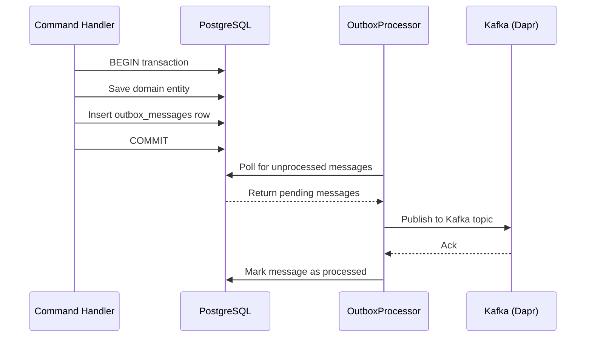

# ADR-005: Transactional Outbox Pattern

## Status
Accepted

**Amended by ADR-0011** — the original non-generic `OutboxService` design had an atomicity bug (called `SaveChangesAsync` internally). ADR-0011 supersedes the implementation with a generic `OutboxService<TContext>` where the caller owns the SaveChanges to preserve atomicity. Read ADR-0011 for the current canonical pattern.

## Date
2026-03-31

## Context

Domain events published directly to Kafka could be lost if Kafka is unavailable or the application crashes between the database commit and the Kafka publish call. This creates a reliability gap: the domain state changes but downstream consumers never receive the event.

Two approaches were considered:

1. **Approach A — Atomic outbox (CDC-based)**: Use a Change Data Capture tool (e.g., Debezium) to tail the outbox table's WAL and publish to Kafka. Fully atomic but adds operational complexity.
2. **Approach B — Polling outbox**: Handlers write events to a local PostgreSQL outbox table instead of publishing to Kafka directly. A background service polls and publishes.

## Decision

We will use **Approach B — Polling outbox**.

When a domain event is raised, the handler writes a serialized event row to the `outbox_messages` table within the same database transaction as the domain state change. An `OutboxProcessor` (`BackgroundService`) polls the outbox table on a configurable interval and publishes pending messages to Kafka via Dapr pub/sub. Successfully published messages are marked as processed.

This is not fully atomic (a crash between Kafka publish and marking the row as processed could cause a duplicate), but consumers are expected to be idempotent. The key benefit is eliminating the external service dependency during the write path.

### How It Works

## Consequences

### Positive
- **Reliable delivery**: Events are never lost on Kafka outages — they remain in the outbox table until successfully published
- **No external dependency on write path**: The command handler only writes to PostgreSQL, which is always available if the domain write succeeds
- **Uses existing infrastructure**: No additional tools like Debezium required
- **Simple to reason about**: The outbox table is queryable and auditable

### Negative
- **Added latency**: Up to ~5 seconds max event latency due to polling interval
- **Extra DB write**: +1 INSERT per domain event (outbox row)
- **At-least-once delivery**: Consumers must be idempotent to handle potential duplicates

### Risks
- **Outbox table growth**: If Kafka is down for extended periods, the outbox table grows. Mitigation: alerting on unprocessed message count, TTL-based cleanup of processed rows.

## Alternatives Considered

| Alternative | Pros | Cons | Why Rejected |
|------------|------|------|-------------|
| Direct Kafka publish after DB commit | Simplest code path | Event loss on Kafka outage or app crash | Unacceptable reliability gap |
| CDC-based outbox (Debezium) | Fully atomic, lower latency | Operational complexity, WAL access required, additional infrastructure | Over-engineering for current scale |

## Update (2026-03-31): Atomicity Fix

For details on the subsequent fix that resolves atomicity issues and introduces generic `OutboxService<TContext>`, refer to [ADR-011: Outbox Service Atomicity Fix](./0011-outbox-service-atomicity.md).

## Related
- [ADR-010: Notification Delivery via Kafka](./0010-notification-delivery-kafka.md)
- Outbox implementation: `src/Nexora.Infrastructure/Persistence/Outbox/OutboxProcessor.cs`

---

## Amendment 1 — Per-Message Isolated Transaction in OutboxProcessor

## Amends

[ADR-005: Transactional Outbox Pattern](./0005-transactional-outbox.md)

## Status

Accepted

## Date

2026-03-31

## Context

The original `OutboxProcessor` implementation (ADR-005) used a **single shared transaction** across all messages in a polling batch. Under this design:

1. The `SELECT … FOR UPDATE SKIP LOCKED` and all subsequent `UPDATE` statements (mark-processed or record-failure) shared one `NpgsqlTransaction`.
2. A single message failure that caused an exception before `tx.CommitAsync()` would roll back **all row-lock updates in the batch**, leaving every message in an indeterminate state until the next polling cycle.
3. `CancellationToken` was passed to `tx.CommitAsync()`, meaning a shutdown signal during commit could leave a message published-but-not-marked-processed (ghost event) on the next restart.

## Decision

`OutboxProcessor` is refactored to use **per-message isolated transactions**:

1. **Batch fetch**: A short-lived transaction executes `SELECT … FOR UPDATE SKIP LOCKED` to claim a batch of message IDs. It commits immediately with `CancellationToken.None` (so the lock release is never interrupted).
2. **Per-message processing**: Each message opens its own `NpgsqlConnection` and `NpgsqlTransaction`. The transaction commits with `CancellationToken.None` after the bus publish and the `UPDATE ProcessedAt` succeed, ensuring partial-batch failures are isolated.
3. **Failure isolation**: If one message's bus publish throws, only that message's transaction is affected. Remaining messages in the batch are processed in subsequent iterations of the `foreach` loop.

### Implementation Reference

See [`src/Nexora.Infrastructure/Persistence/Outbox/OutboxProcessor.cs`](../../src/Nexora.Infrastructure/Persistence/Outbox/OutboxProcessor.cs) — methods `FetchPendingMessagesAsync` and `ProcessMessageAsync`.

## Consequences

- **Positive**: A single failing message no longer blocks an entire batch. System throughput degrades gracefully under partial broker failure.
- **Positive**: Commit is never interrupted by `CancellationToken`, eliminating the published-but-not-marked ghost-event risk.
- **Negative**: Each message now opens its own `NpgsqlConnection`, increasing connection overhead for large batches. Mitigated by the Npgsql connection pool.
- **Neutral**: The `FOR UPDATE SKIP LOCKED` pattern is preserved; concurrent processor instances (e.g., multiple replicas) still coordinate correctly.
