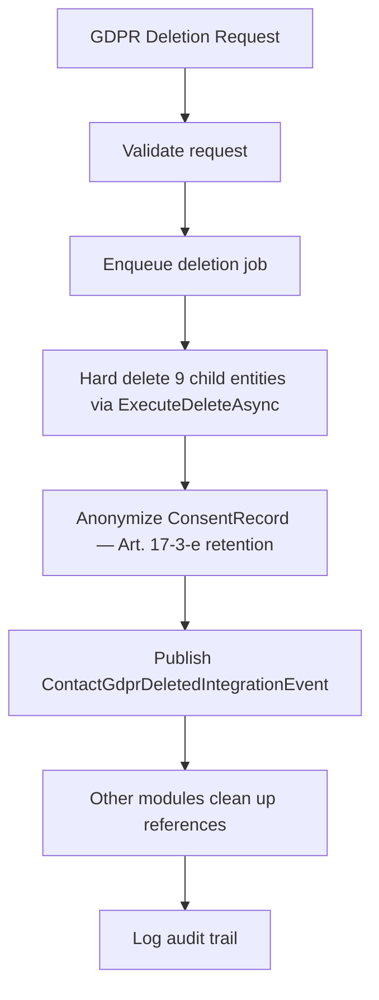

# ADR-008: GDPR Deletion Strategy

## Status
**Status:** Accepted

## Date
2026-03-31

## Context

GDPR Article 17 ("Right to Erasure") requires physical removal of personal data upon a valid deletion request. The initial implementation only performed anonymization combined with soft-delete (`IsDeleted = true`), which does not satisfy the requirement for physical data removal. The data remained in the database, merely hidden by EF Core global query filters.

## Decision

> **Amendment note:** The Phase 1.5.6 hard-delete evolution is captured as an amendment to this ADR (see T-004 and the Phase 1.5 task series) and not as a separate superseding ADR — no material decision change, only a phase progression.

We will implement GDPR deletion in **two phases**:

### Phase 1 (Interim — Current)
- Soft-delete with anonymization: set `IsDeleted = true` and overwrite PII fields with anonymized values (e.g., `"DELETED"`, `"deleted@anonymized.local"`)
- Data remains in the database but is filtered from all queries by the global query filter
- Sufficient for initial launch with low data-subject request volume

### Phase 1.5.6 (Planned — Hard Delete)
- Hard delete via `ExecuteDeleteAsync` for all 9 child entities of a contact record
- `ConsentRecord` is **not** hard-deleted but anonymized — legal retention required per GDPR Article 17(3)(e) (compliance with legal obligations)
- Cross-module integration events notify other modules to clean up their references (e.g., CRM lead associations, Documents signatures)
- Deletion executed as a background job for auditability and retry capability

**Phase-1.5.6 target milestone:** 2026-Q3 (by 2026-09-30). This work is the umbrella implementation task T-004 (see `docs/analysis/tasks/phase-1.5/T-004.md`) and is a **compliance blocker for EU tenant onboarding** — no EU-based tenants may be provisioned on the Phase-1 interim soft-delete strategy after 2026-09-30. Enforcement is via NMP tenant provisioning gate (ADR-0023): the provisioning flow checks the Phase-1.5.6 feature flag and rejects EU region selection when disabled.

### Deletion Flow (Phase 1.5.6)

## Consequences

### Positive
- **Phase 1 provides immediate compliance posture**: Anonymized data is not personally identifiable
- **Phase 1.5.6 achieves full compliance**: Physical removal satisfies Article 17
- **ConsentRecord retention**: Maintains legal defensibility for past consent decisions
- **Cross-module coordination**: The `ContactGdprDeletedIntegrationEvent` ensures no orphaned PII across module boundaries

### Negative
- **Data still in DB until Phase 1.5.6**: Anonymized but physically present — may not satisfy strict interpretations of Article 17
- **Complexity of hard delete**: 9 child entities require ordered deletion to respect foreign key constraints
- **Cross-module coupling**: Deletion events require all modules to implement cleanup handlers

### Risks
- **Missed child entity**: A new child entity added after Phase 1 might not be included in the hard delete list. Mitigation: architecture tests that verify all FK relationships are covered by the deletion job.
- **Delayed Phase 1.5.6**: If hard delete implementation is deprioritized, the interim solution remains indefinitely. Mitigation: track as a compliance-critical milestone.

**Risk register entry:** Until Phase-1.5.6 ships, GDPR Article 17(1) "right to erasure" is partially fulfilled (data masked but retrievable by database-level access). Documented on the platform risk register; mitigation is temporary soft-delete + access logging. This risk is accepted for non-EU tenants only.

## Alternatives Considered

| Alternative | Pros | Cons | Why Rejected |
|------------|------|------|-------------|
| Immediate hard delete (no phased approach) | Full compliance from day one | High implementation risk, complex cross-module coordination needed before launch | Too risky for initial release timeline |
| Anonymization only (permanent) | Simple, no data loss | Does not satisfy strict GDPR Article 17 interpretation | Insufficient for full compliance |
| Separate GDPR database (move before delete) | Audit trail preserved | Operational complexity, still stores PII in another location | Moves the problem rather than solving it |

## Related
- GDPR Article 17: Right to Erasure
- GDPR Article 17(3)(e): Retention for legal obligations
- Global query filter: `AuditableEntity.IsDeleted` soft-delete mechanism
