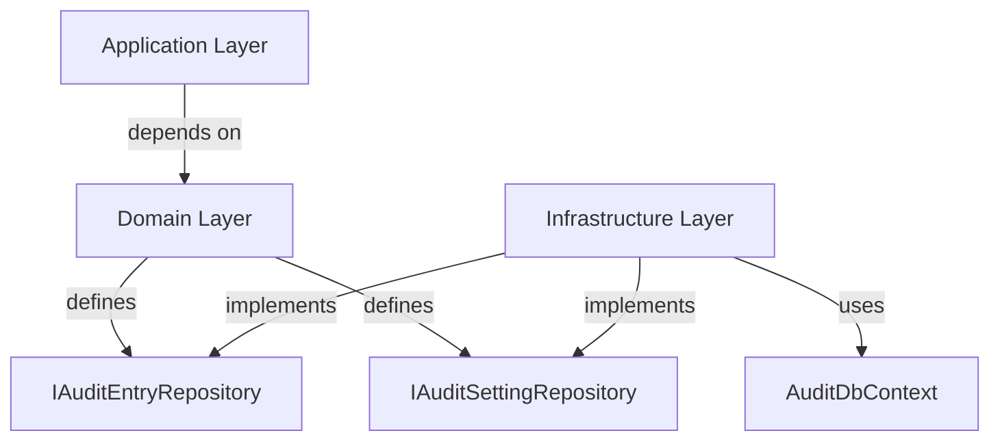

# ADR-009: Audit Module Repository Pattern

## Status
Accepted

## Date
2026-03-31

## Context

The Audit module's Application layer directly injected `AuditDbContext` (an Infrastructure concern) into its command and query handlers. This violated Clean Architecture's dependency rule: the Application layer must not depend on Infrastructure. It also made handlers difficult to unit test without spinning up an in-memory database or mocking the DbContext directly.

## Decision

We will introduce **repository interfaces in the Domain layer** and their **implementations in the Infrastructure layer** for the Audit module.

Two repository interfaces were created:

- `IAuditEntryRepository` — query and persist audit log entries
- `IAuditSettingRepository` — query and persist audit configuration settings

All Application layer handlers now inject these repository interfaces instead of `AuditDbContext`. The Infrastructure layer provides EF Core implementations that delegate to `AuditDbContext`.

### Dependency Structure

## Consequences

### Positive
- **Clean Architecture compliance**: Application layer has zero dependency on Infrastructure
- **Testability**: Handlers can be unit tested with mock repositories — no DbContext required
- **Consistency**: Audit module now follows the same repository pattern as all other modules
- **Explicit contracts**: Repository interfaces document exactly which data operations the Application layer needs

### Negative
- **Additional abstraction layer**: Two new interfaces and two new implementation classes
- **Migration effort**: All existing handlers had to be refactored to use repository interfaces

### Risks
- **Repository bloat**: Over time, repository interfaces may accumulate too many methods. Mitigation: keep interfaces focused; use CQRS to separate read and write concerns if needed.

## Alternatives Considered

| Alternative | Pros | Cons | Why Rejected |
|------------|------|------|-------------|
| Keep direct DbContext injection | No refactoring needed | Violates Clean Architecture, hard to test, inconsistent with other modules | Architectural debt that compounds over time |
| Generic repository (`IRepository<T>`) | Less code, one interface | Leaky abstraction, exposes IQueryable, doesn't express domain intent | Too generic; hides domain-specific query semantics |
| MediatR-based data access (query handlers as repositories) | No repository layer needed | Conflates CQRS handlers with data access, circular dependencies | Over-engineering for straightforward CRUD operations |

## Related
- [ADR-001: Modular Monolith](./0001-modular-monolith.md)
- Audit module: `src/Modules/Nexora.Modules.Audit/`
