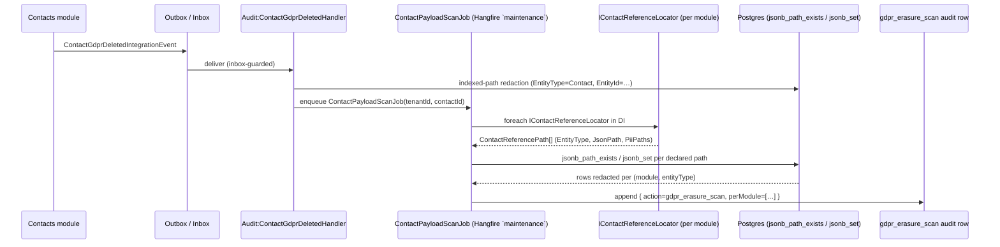

# 0026 — Cross-module PII payload scan for GDPR erasure

## Status

Accepted  <!-- Proposed | Accepted | Superseded by NNNN -->

## Date

2026-04-23

## Context

`ContactGdprDeletedIntegrationEvent` (raised by the Contacts hard-delete path per
ADR-0008 and T-004 WP4) currently redacts matching audit rows via the indexed
lookup `(EntityType = "Contact" AND EntityId = <contactId>)`. That indexed path is
fast, deterministic, and covers the common case — but it misses every audit row
whose `BeforeState` / `AfterState` / `Changes` JSON columns *reference* the erased
contact without being keyed to it. Examples surfaced during T-004 review:

- CRM `Lead.assignedTo` carries `{ "contactId": "...", "name": "John Doe", "email": "john@example.com" }`.
- Documents `Document.sharedWith` carries a list of contact objects with names.
- Subscription `Subscription.billingContact` carries `{ "contactId": "...", "email": "..." }`.
- Fundraising `Donation.donor` and Finance `JournalEntry.counterparty` likewise.

The end-to-end flow this ADR proposes:



The diagram captures the load-bearing properties: indexed redaction stays
synchronous (latency budget = T-004's existing budget); the scan runs
asynchronously on `maintenance` queue; per-module locators own their
declarations so the audit module never names another module's payload shape;
and the summary audit row is the single auditor-visible artefact for the scan.

The T-004 handler explicitly records the limitation in its source comment — it is
a **GDPR Article 17 compliance gap**. For EU tenants (which ADR-0023 gates behind
the Phase-1.5.6 hard-delete milestone) the gap is load-bearing: the NMP
provisioning flow cannot honestly claim "right to erasure is fully implemented"
while contact names and emails remain readable in sibling modules' audit
histories.

The cross-cutting nature of the fix — 5+ modules are candidate consumers, each
with its own audit payload shape — is why T-004 deferred it into T-010 and why
T-010 requires an architecture decision before implementation.

## Decision drivers

- GDPR Article 17 "Right to Erasure" — MUST cover PII interpolated into audit
  payloads, not just audit rows keyed on the contact.
- Tenant-scoped; the scan runs per-tenant and MUST NOT cross tenant boundaries.
- Idempotent; a rerun after partial completion MUST NOT double-redact or skip
  rows. Required for Hangfire retries and inbox-guarded replay.
- Predictable cost; a tenant with 10M audit rows MUST complete a scan within the
  maintenance window (target: 15 min).
- Module decoupling; no module may be forced to reference another module's
  entities. Declarations stay inside each owning module.
- False-positive safety; a scan that redacts an unrelated row is a data-integrity
  incident. The design MUST make false positives impossible by construction, not
  by heuristics.
- Auditor-friendly; after the scan there MUST be a single summary audit entry
  per contact erasure naming per-module counts so a compliance auditor can
  answer "did we scan?" without spelunking.

## Considered options

### 1. Per-module `IContactReferenceLocator` with declared JSON paths *(chosen)*

Each module that writes audit payloads referencing contacts registers an
`IContactReferenceLocator` in its `OnStartupAsync`:

```csharp
public interface IContactReferenceLocator
{
    string ModuleName { get; }
    IReadOnlyList<ContactReferencePath> Paths { get; }
}

public sealed record ContactReferencePath(
    string EntityType,           // "Lead", "Document", ...
    string JsonPath,             // "$.assignedTo.contactId"
    IReadOnlyList<string> PiiPaths);  // adjacent PII to scrub (e.g. "$.assignedTo.name")
```

A new `ContactPayloadScanJob` (Hangfire, queue=`maintenance`) consumes
`ContactGdprDeletedIntegrationEvent` via the audit module's inbox. For each
registered locator it runs a targeted `ExecuteUpdateAsync` matching only audit
rows whose `(Module, EntityType)` equal the locator's declarations AND whose
JSON path holds the erased `contactId`. The `PiiPaths` are replaced by the
standard redaction marker; the keyed `contactId` field is preserved so the
audit row still shows "there was a reference" without leaking who.

- Pros
  - False positives impossible by construction — every redaction is gated on an
    explicit path declaration owned by the module that writes the payload.
  - Scan cost scales with number-of-declared-paths × tenant-row-count, which is
    bounded and benchmarkable per module.
  - Modules own their own schema — Audit module stays infrastructure-only.
  - Natural evolution as new modules come online (CRM, Finance, etc.): each
    module's PR adds its locator in the same commit as its audit payload.
- Cons
  - Requires every module that audits contact references to register a locator.
    A module that forgets leaks PII silently — **mitigated** by an
    architecture-test guard (`ContactReferenceLocatorCoverageTests`) that fails
    when a module's audit handlers reference contact-like fields without a
    matching locator declaration.
  - Requires JSON-path evaluation server-side — on Postgres we use the native
    `jsonb_path_exists` / `jsonb_set` functions; on non-relational test doubles
    we fall back to deserialization.

### 2. Full-table JSON regex scan for the contact's name / email

Take the erased contact's name + email from the `ContactGdprDeletedIntegrationEvent`
payload, then regex-scan every audit row's JSON columns and redact any hit.

- Pros
  - No module needs to declare anything; maintenance-free from the module-owner
    perspective.
- Cons
  - False positives are routine — a contact named "Jon" collides with
    unrelated text; redacting a "paid Jon's invoice" note in the Finance audit
    is a data-integrity incident. **Rejected.**
  - Forces the `ContactGdprDeletedIntegrationEvent` payload to carry the erased
    name/email after erasure — a regression against the T-004 no-PII-in-events
    principle.
  - Runtime cost is unbounded (full-table scan with regex over JSON) — fails
    the 15-min target for large tenants.

### 3. At-write-time structured tagging

Change the audit pipeline so that every audit write whose payload contains a
contact reference is stored with a separate `contact_ref` join table
`(audit_entry_id, contact_id)`. Erasure then becomes a DELETE against a
well-indexed table.

- Pros
  - Fast, correct, and cheap at erasure time.
  - No post-hoc scanning needed.
- Cons
  - Forces a retroactive migration: every existing audit entry in production
    must be backfilled through a scan pass anyway — we pay the scan cost once,
    then add ongoing write-time cost forever.
  - Requires every module to call a new `IAuditRepository` overload at write
    time. Wider blast radius than option 1 and harder to enforce.
  - Doubles the audit write path's write amplification for a feature that only
    fires on erasure (a rare event).

### 4. No scan — document the limitation and rely on module-owned purge

Accept that cross-module audit PII will be purged via module-local retention
policies (e.g. 2-year audit retention under audit-coverage.md §6).

- Pros
  - No new code.
- Cons
  - Fails GDPR Article 17 for retention windows longer than the request-to-purge
    deadline. **Rejected** — the entire reason T-004 was filed was that this
    posture is not compliant.

## Decision outcome

**Adopt Option 1 — per-module `IContactReferenceLocator` with declared JSON
paths.** It is the only option that makes false-positive redaction impossible
by construction while preserving module decoupling and giving us a bounded,
benchmarkable scan cost.

Implementation lives under T-010. The scan job is inbox-guarded on
`ContactGdprDeletedIntegrationEvent` (same as T-004 WP4), runs per-tenant using
the audit module's `AuditDbContext`, and emits a single summary audit entry
(`action = "gdpr_erasure_scan"`) carrying a per-module `{module: redactedCount}`
map. A new architecture test guards locator coverage so future modules
adding contact-keyed audit payloads cannot ship without declaring their paths.

## Consequences

### Positive

- GDPR Article 17 compliance extends to cross-module audit payloads, unblocking
  the EU-tenant NMP provisioning gate from ADR-0023.
- Each module owns its own PII declarations — the audit module stays generic
  infrastructure.
- Scan cost is bounded per-locator; observable via a per-scan histogram metric
  (target: p99 < 15 min for 10M rows, benchmarked in T-010).

### Negative

- Every module that writes contact-keyed audit payloads now carries a locator
  declaration. A module owner who forgets leaks PII — **mitigated** by the
  architecture-test coverage guard; the test fails CI if a module's audit
  handlers mention contact-like payload fields without a matching locator.
- Postgres `jsonb_path_exists` / `jsonb_set` calls are native-only; the
  InMemory provider used in unit tests falls back to in-process JSON
  manipulation — small duplication of logic maintained in one helper class.
- Adds a new Hangfire queue=maintenance job per erasure event. Volume is
  low (erasures are rare) but the scan run itself can be long for large
  tenants — operators must see it on the Hangfire dashboard as a first-class
  operation.

### Neutral

- New abstraction `IContactReferenceLocator` in `Nexora.SharedKernel` —
  discoverable via DI (`IEnumerable<IContactReferenceLocator>` injection).
  Future analogous scanners (user erasure, organization erasure, etc.) may
  reuse the pattern with separate locator interfaces keyed to their own ID
  type.

## Implementation notes

Concrete pointers for implementers (T-010 execution task):

- **New types** (in `Nexora.SharedKernel.Abstractions.Gdpr`):
  - `IContactReferenceLocator`, `ContactReferencePath`.
- **New job** (in `Nexora.Modules.Audit.Infrastructure.Jobs`):
  - `ContactPayloadScanJob : NexoraJob<ContactPayloadScanParams>`, queue
    `maintenance`, display name `audit:contact-payload-scan`. Inbox-guarded
    on `ContactGdprDeletedIntegrationEvent.EventId`.
- **Updated integration-event handler**: the existing
  `Audit.Infrastructure.IntegrationEvents.ContactGdprDeletedIntegrationEventHandler`
  enqueues the scan job after the indexed-path redaction completes; the scan
  handles the payload-scan pass asynchronously so the indexed redaction's
  latency stays predictable.
- **Module locators to deliver with T-010**:
  - `ContactsContactReferenceLocator` (trivial — covers cross-references in
    Contact-Contact relationships audit rows).
  - `IdentityContactReferenceLocator` (User.ContactId).
  - Placeholder no-op locators for Documents / Notifications /
    Audit / Reporting — they don't carry contact payloads today but the
    architecture test will catch a future addition.
  - CRM / Finance / Subscription / Fundraising locators delivered with their
    respective Phase-2+ modules per the roadmap.
- **Summary audit entry shape**:

  ```jsonc
  {
    "module":    "audit",
    "resource":  "audit_entry",
    "action":    "gdpr_erasure_scan",
    "metadata":  { "contactId": "...", "perModule": { "contacts": 42, "identity": 3, "crm": 0 } }
  }
  ```

- **Observability**:
  - Histogram metric `gdpr_scan_duration_seconds{module}` labeled by module;
    target p99 < 900s.
  - Counter `gdpr_scan_redacted_rows_total{module}`.
  - Log `Information` at scan start and end with tenant id + contact id +
    per-module counts. Never log the redacted payload itself.
- **Testing**:
  - Unit tests per locator assert path declarations match the module's audit
    payload shape — covers `IContactReferenceLocator` implementations
    consumed by `ContactPayloadScanJob`.
  - Architecture test `ContactReferenceLocatorCoverageTests` (see Negative
    consequence above) — guards that every module touching contact-keyed
    audit payloads ships a matching `IContactReferenceLocator`.
  - **JSON-path helper parity test (REQUIRED)**: the scan job uses two
    backends for the `jsonb_path_exists` / `jsonb_set` operations — the
    Postgres-native path (production) and an in-process JSON manipulation
    fallback (InMemory test doubles, see §1 Cons "Postgres
    `jsonb_path_exists` / `jsonb_set` calls are native-only"). Both MUST
    produce identical (rows-redacted, payload-after) tuples for the same
    input. T-010 ships
    `ContactPayloadJsonHelperParityTests` (Theory-driven over a fixture
    set: deeply-nested objects, arrays of contacts, missing keys, mixed
    PII + non-PII at the same path, `null` PiiPaths) that asserts the two
    backends agree on every fixture. Without this parity gate, a
    Testcontainers integration test green-light says nothing about how
    InMemory-backed unit tests will behave in CI — and vice versa.
  - Integration test (Testcontainers Postgres) seeds 100k audit rows
    across 3 modules, drives `ContactPayloadScanJob` end-to-end, asserts
    only the contact-keyed rows are redacted (false-positive gate) and
    the summary entry is emitted exactly once even on inbox replay.
  - Performance benchmark test (opt-in `Category=Performance`) seeds 10M
    rows and asserts p99 scan time ≤ 900s.

## References

- ADR-0008 — GDPR Deletion Strategy (parent).
- ADR-0023 — NMP billing model / EU-tenant provisioning gate.
- T-004 — Contacts GDPR hard-delete (producer of the integration event).
- T-010 — Cross-module audit payload PII scan (execution task for this ADR).
- `docs/standards/audit-coverage.md` §3 (Audit row retention).
- `docs/modules/tier-1-core/audit/SPEC.md` (PII retention).
- External: GDPR Article 17 "Right to Erasure".
