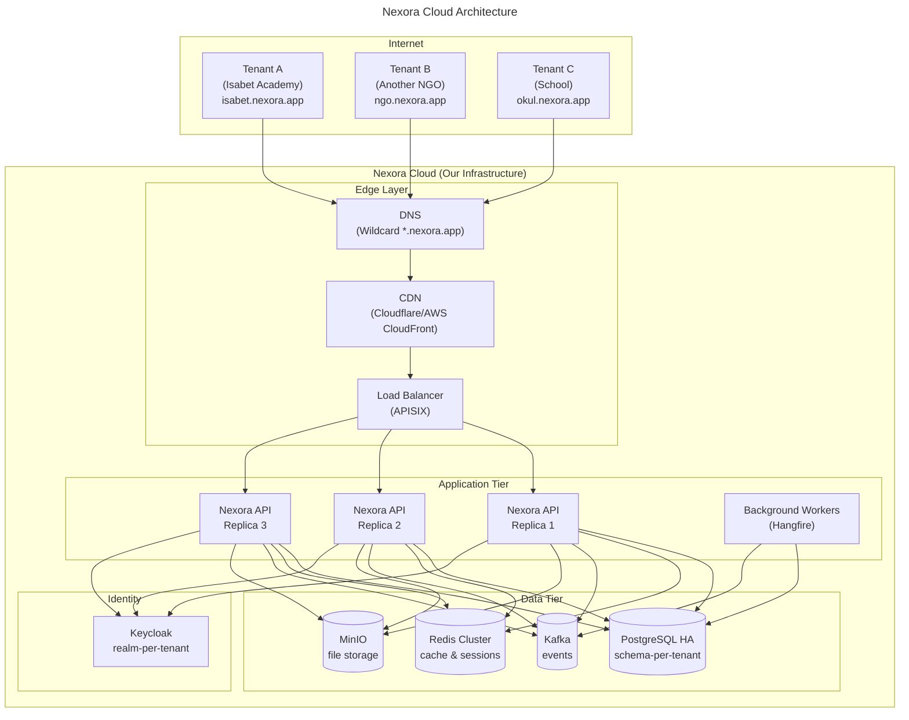
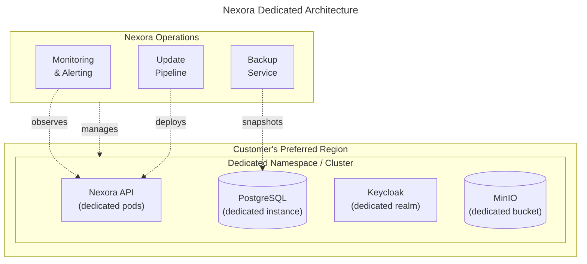
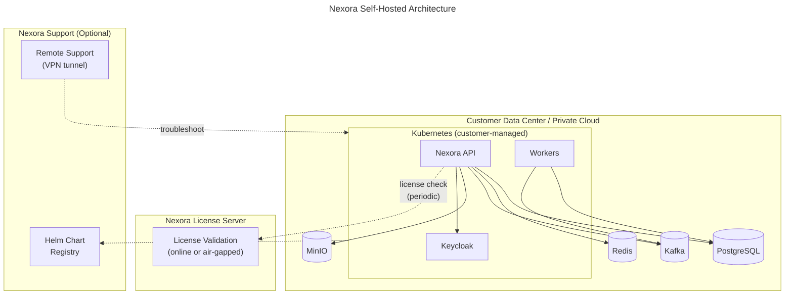
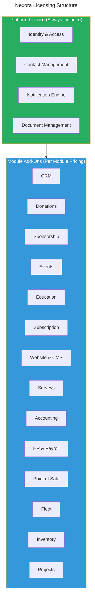
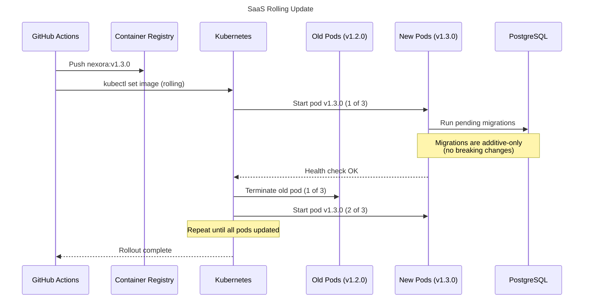

# ADR-003: Deployment Strategy

## Status
**Accepted** — 2026-03-19

## Context

Nexora is an enterprise modular platform designed to serve multiple organizations. We need a clear deployment strategy that answers:

1. **Where does Nexora run?** — Our infrastructure, customer infrastructure, or both?
2. **How are new tenants provisioned?** — Manual, semi-automated, or fully automated?
3. **How is the software delivered?** — Docker images, Helm charts, binaries?
4. **How do we handle updates?** — Rolling updates, blue-green, per-tenant versioning?
5. **What's the licensing model?** — Per-tenant, per-user, per-module?

The platform must support organizations ranging from small NGOs (10 users) to large educational institutions (500+ users), with varying requirements for data sovereignty, compliance, and operational control.

## Decision

We will support **three deployment models**, all powered by the same codebase and Helm chart:

### Model 1: Nexora Cloud (Multi-Tenant SaaS)
**Target**: Organizations that want zero infrastructure management.



**Characteristics**:
- Single Kubernetes cluster, shared infrastructure
- Schema-per-tenant isolation in PostgreSQL
- Realm-per-tenant isolation in Keycloak
- Bucket-per-tenant in MinIO
- Custom subdomain per tenant (`{slug}.nexora.app`) or custom domain (CNAME)
- We manage everything: updates, backups, scaling, monitoring
- **Pricing**: Per-tenant base fee + per-active-user fee + module add-ons

### Model 2: Nexora Dedicated (Single-Tenant Managed)
**Target**: Large organizations that need dedicated resources or data residency compliance.



**Characteristics**:
- Dedicated Kubernetes namespace (or cluster for largest customers)
- Same Helm chart, same container images
- Data stays in customer's chosen region (EU, US, TR, etc.)
- We still manage operations, but customer has audit access
- Can use customer's own cloud account (AWS, Azure, GCP)
- **Pricing**: Dedicated infrastructure fee + platform license

### Model 3: Nexora Self-Hosted (On-Premise)
**Target**: Organizations with strict data sovereignty requirements (government, military, healthcare).



**Characteristics**:
- Customer installs via Helm chart on their own Kubernetes cluster
- All data stays on customer premises — no data leaves their network
- License key controls which modules are activated
- Air-gapped mode supported (offline license validation)
- Customer manages operations (with our documentation + optional support contract)
- Updates delivered as new Helm chart versions — customer controls upgrade timing
- **Pricing**: Annual license fee + optional support contract

---

## Deployment Model Comparison

| Feature | Cloud (SaaS) | Dedicated | Self-Hosted |
|---------|-------------|-----------|-------------|
| Infrastructure | Nexora-managed | Nexora-managed, customer region | Customer-managed |
| Data Location | Nexora cloud (multi-region) | Customer's chosen region | Customer premises |
| Multi-Tenancy | Shared (schema isolation) | Single-tenant | Single or multi-tenant |
| Updates | Automatic (rolling) | Managed (scheduled window) | Customer-controlled |
| Backups | Included | Included | Customer responsibility |
| SLA | 99.9% | 99.95% | Depends on customer |
| Monitoring | Included (Grafana) | Included + customer access | Customer responsibility |
| Custom Domain | Supported (CNAME) | Supported | N/A (own domain) |
| Min. Setup Time | Minutes | 1-2 days | 1 week (with support) |
| Ideal For | SMB, startups, NGOs | Enterprise, regulated | Government, air-gapped |
| Pricing Model | Per-user + per-module | Infrastructure + license | Annual license |

---

## Licensing Model

### Module-Based Licensing



### License Key Structure

```json
{
  "licenseId": "LIC-2026-00042",
  "tenantId": "tenant_isabet",
  "type": "cloud|dedicated|self-hosted",
  "plan": "enterprise",
  "validUntil": "2027-03-19T00:00:00Z",
  "maxUsers": 200,
  "maxOrganizations": 5,
  "modules": [
    "crm", "donations", "sponsorship", "events",
    "education", "subscription", "documents"
  ],
  "features": {
    "customDomain": true,
    "whiteLabel": true,
    "apiAccess": true,
    "ssoIntegration": true
  },
  "signature": "base64-encoded-rsa-signature"
}
```

### Pricing Tiers

| Tier | Core Modules | Add-On Modules | Users | Orgs | Support |
|------|-------------|----------------|-------|------|---------|
| **Starter** | All 4 core | Up to 2 | 25 | 1 | Email |
| **Professional** | All 4 core | Up to 6 | 100 | 3 | Email + Chat |
| **Enterprise** | All 4 core | Unlimited | Unlimited | Unlimited | Priority + SLA |

---

## Update Strategy

### Cloud (SaaS) — Zero-Downtime Rolling Updates



**Rules**:
- Database migrations are **additive-only** (add column, add table — never drop/rename in production)
- Breaking schema changes use **expand-contract pattern** (add new → migrate data → remove old in next release)
- Canary deployments for major releases (route 10% traffic to new version first)

### Self-Hosted — Customer-Controlled Updates

```bash
# Customer updates at their own pace
helm repo update nexora
helm upgrade nexora nexora/nexora-platform \
  --version 1.3.0 \
  --values my-values.yaml \
  --namespace nexora
```

- Customers get notification of new versions via admin panel
- Release notes highlight breaking changes and migration steps
- Minimum supported version policy: N-2 (current and two previous major versions)

---

## Consequences

### Positive
- **Single codebase** serves all deployment models — no fork maintenance
- **Helm chart** as universal delivery mechanism — works on any Kubernetes
- **Schema-per-tenant** scales to thousands of tenants on shared infrastructure
- **Module licensing** creates flexible pricing for different organization sizes
- **Easy onboarding** — Cloud tenants operational in minutes

### Negative
- Must maintain backward-compatible migrations (additive-only constraint)
- Self-hosted requires documentation + support effort for customer-managed K8s
- License validation for air-gapped environments adds complexity
- Must test on multiple Kubernetes distributions (EKS, AKS, GKE, bare-metal)

### Risks
- **Data compliance**: Different countries have different data residency laws — Dedicated/Self-Hosted models mitigate this
- **Version fragmentation**: Self-hosted customers may lag behind — N-2 support policy limits this
- **Operational overhead**: Supporting three deployment models requires mature DevOps practices

## Related
- [ADR-001: Modular Monolith](./ADR-001-modular-monolith.md)
- [ADR-002: Schema-per-Tenant Multi-Tenancy](./ADR-002-multi-tenancy.md)
- [Tenant Provisioning & Operations](../operations/TENANT_OPERATIONS.md)
- [Helm Installation Guide](../operations/HELM_INSTALLATION.md)
