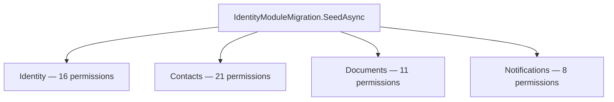

# ADR-004: Centralized Permission Seeding

## Status
Accepted

## Date
2026-03-23

## Context

Nexora uses a permission-based RBAC model where permissions follow the `{module}.{resource}.{action}` format (e.g., `contacts.note.read`, `documents.signature.manage`). These permissions are stored in the Identity module's database and referenced by roles across the platform.

The question is: **where should permission seed data be defined?**

Two approaches were considered:

1. **Centralized**: All permission seeds live in `IdentityModuleMigration.SeedAsync()`, the Identity module's migration entry point.
2. **Distributed**: Each module seeds its own permissions via its `IModule` implementation during startup.

The Identity module is the **RBAC authority** — it owns the `permissions`, `roles`, and `role_permissions` tables. Other modules are consumers of the permission system; they declare which permissions they require, but they don't own the storage.

## Decision

We will use **centralized permission seeding** in `IdentityModuleMigration.SeedAsync()`.

All modules' permissions are defined as `Permission.Create(module, resource, action, descriptionKey)` calls within the Identity module's migration. The frontend mirrors this in each module's `manifest.ts` `permissions` array (for UI-level gating), but the source of truth is the backend seed.

### How It Works



Each module's frontend `manifest.ts` declares the same permission strings for UI guards:

```typescript
// modules/notifications/manifest.ts
permissions: [
  'notifications.notification.read',
  'notifications.notification.send',
  // ...
],
```

### When Adding a New Module's Permissions

1. Add `Permission.Create(...)` calls to `IdentityModuleMigration.SeedAsync()`
2. Add locale keys (`lockey_{module}_permission_{resource}_{action}`) to the module's own locale files (not Identity's)
3. Add permission strings to the module's frontend `manifest.ts`
4. Add permission guards in the module's pages via `usePermissions()`

## Consequences

### Positive
- **Single source of truth**: All permissions visible in one file — easy to audit, review, and diff
- **No ordering issues**: Permissions exist before any module activates, avoiding race conditions where a module tries to reference a permission that hasn't been seeded yet
- **Transactional consistency**: All permissions seeded in a single migration transaction
- **Simpler module interface**: `IModule` doesn't need a `SeedPermissions()` method; modules focus on their domain logic
- **Easy to validate**: A single glance at the seed file shows the complete RBAC surface area

### Negative
- **Coupling on seed data**: Identity module "knows about" other modules' permission strings (but not their types, interfaces, or logic)
- **Manual sync required**: When adding a new module, the developer must remember to add permissions to `IdentityModuleMigration` in addition to the module's manifest and locale files
- **Not self-contained**: A module's permission definition is split across its own manifest/locales and Identity's migration

### Risks
- **Forgotten permissions**: A developer might add a permission guard in the UI but forget to seed it in the backend. Mitigation: code review checklist, integration tests that verify all manifest permissions exist in the DB.
- **Stale permissions**: Removed modules may leave orphan permissions in the seed. Mitigation: periodic audit of seed data against active module manifests.

## Alternatives Considered

| Alternative | Pros | Cons | Why Rejected |
|------------|------|------|-------------|
| Distributed seeding (each module seeds its own) | Self-contained modules; no coupling to Identity | Ordering problems (module activates before Identity runs); multiple migration points; harder to audit full permission set | Introduces complexity for module activation order; Identity is the permission authority and should own the data |
| Convention-based auto-discovery (scan assemblies for permission attributes) | Zero manual registration | Magic behavior; hard to debug; permission set not explicitly visible; requires reflection at startup | Violates explicit-over-implicit principle; makes auditing harder |
| Shared permission registry in SharedKernel | Modules register permissions via a shared interface | Still requires ordering coordination; adds abstraction layer without solving the core problem | Over-engineering for what is essentially static seed data |

## Related
- [ADR-001: Modular Monolith](./ADR-001-modular-monolith.md)
- [Module System](../architecture/MODULE_SYSTEM.md)
- Permission seed implementation: `src/Modules/Nexora.Modules.Identity/Infrastructure/IdentityModuleMigration.cs`
