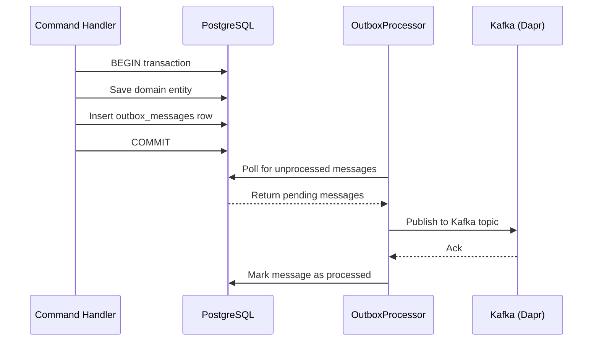

# ADR-005: Transactional Outbox Pattern

## Status
Accepted

## Date
2026-03-31

## Context

Domain events published directly to Kafka could be lost if Kafka is unavailable or the application crashes between the database commit and the Kafka publish call. This creates a reliability gap: the domain state changes but downstream consumers never receive the event.

Two approaches were considered:

1. **Approach A — Atomic outbox (CDC-based)**: Use a Change Data Capture tool (e.g., Debezium) to tail the outbox table's WAL and publish to Kafka. Fully atomic but adds operational complexity.
2. **Approach B — Polling outbox**: Handlers write events to a local PostgreSQL outbox table instead of publishing to Kafka directly. A background service polls and publishes.

## Decision

We will use **Approach B — Polling outbox**.

When a domain event is raised, the handler writes a serialized event row to the `outbox_messages` table within the same database transaction as the domain state change. An `OutboxProcessor` (`BackgroundService`) polls the outbox table on a configurable interval and publishes pending messages to Kafka via Dapr pub/sub. Successfully published messages are marked as processed.

This is not fully atomic (a crash between Kafka publish and marking the row as processed could cause a duplicate), but consumers are expected to be idempotent. The key benefit is eliminating the external service dependency during the write path.

### How It Works

## Consequences

### Positive
- **Reliable delivery**: Events are never lost on Kafka outages — they remain in the outbox table until successfully published
- **No external dependency on write path**: The command handler only writes to PostgreSQL, which is always available if the domain write succeeds
- **Uses existing infrastructure**: No additional tools like Debezium required
- **Simple to reason about**: The outbox table is queryable and auditable

### Negative
- **Added latency**: Up to ~5 seconds max event latency due to polling interval
- **Extra DB write**: +1 INSERT per domain event (outbox row)
- **At-least-once delivery**: Consumers must be idempotent to handle potential duplicates

### Risks
- **Outbox table growth**: If Kafka is down for extended periods, the outbox table grows. Mitigation: alerting on unprocessed message count, TTL-based cleanup of processed rows.

## Alternatives Considered

| Alternative | Pros | Cons | Why Rejected |
|------------|------|------|-------------|
| Direct Kafka publish after DB commit | Simplest code path | Event loss on Kafka outage or app crash | Unacceptable reliability gap |
| CDC-based outbox (Debezium) | Fully atomic, lower latency | Operational complexity, WAL access required, additional infrastructure | Over-engineering for current scale |

## Update (2026-03-31): Atomicity Fix — OutboxService\<TContext\>

The initial implementation used a non-generic `OutboxService` that called `SaveChangesAsync` internally within `EnqueueAsync`. This created a **separate transaction** for the outbox record, breaking the atomicity guarantee described above — if the caller's transaction rolled back after `EnqueueAsync` succeeded, the outbox message would still be persisted and eventually published as a phantom event.

**Fix**: `OutboxService<TContext>` is now generic, parameterized by the caller's module-specific `DbContext`. `EnqueueAsync` adds the `OutboxMessage` to the `DbContext` change tracker but does **not** call `SaveChangesAsync`. The outbox record is committed only when the caller's command handler calls `SaveChangesAsync`, ensuring true single-transaction atomicity.

Additional improvements in this update:
- `OutboxProcessor` iterates tenant schemas (multi-tenant aware)
- Reflection caching for event type resolution (performance)
- Immediate retry when a full batch is processed (reduced latency)
- `InboxGuard<TContext>` follows the same generic per-module `DbContext` pattern

## Related
- [ADR-010: Notification Delivery via Kafka](./ADR-010-notification-delivery-kafka.md)
- Outbox implementation: `src/Nexora.Infrastructure/Messaging/OutboxProcessor.cs`
