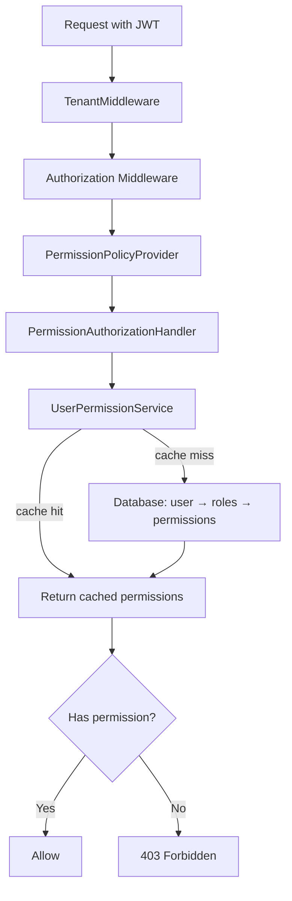

# ADR-006: Permission-Based Authorization Infrastructure

## Status
Accepted

## Date
2026-03-31

## Context

All API endpoints used bare `.RequireAuthorization()`, which only verified that the caller was authenticated (valid JWT) but performed no authorization checks. Any authenticated user could access any endpoint regardless of their role or permissions. This is insufficient for a multi-tenant platform with granular RBAC requirements.

## Decision

We will implement a **dynamic permission-based authorization system** using ASP.NET Core's policy infrastructure.

The system consists of three components:

1. **`PermissionPolicyProvider`**: Implements `IAuthorizationPolicyProvider`. When an endpoint declares `[Authorize(Policy = "contacts.note.read")]`, the provider dynamically creates a policy with a `PermissionRequirement` — no need to register every permission string at startup.
2. **`PermissionAuthorizationHandler`**: Implements `AuthorizationHandler<PermissionRequirement>`. Resolves the user's permissions via `UserPermissionService` and checks if the required permission is present.
3. **`UserPermissionService`**: Loads the user's effective permissions (aggregated from all assigned roles) and caches them for 5 minutes per user via `ICacheService`.

Permission strings follow the `{module}.{resource}.{action}` format (e.g., `contacts.contact.create`, `documents.signature.manage`).

### How It Works

## Consequences

### Positive
- **Granular access control**: Each endpoint can require a specific permission, enabling fine-grained RBAC
- **Dynamic policy creation**: No need to register every permission at startup — policies are created on demand
- **Cached permissions**: 5-minute cache avoids repeated DB queries per request
- **Standard ASP.NET Core integration**: Uses the built-in authorization framework, no custom middleware

### Negative
- **Middleware ordering dependency**: Tenant middleware must run before authorization middleware, since permission resolution is tenant-scoped
- **Cache staleness**: Up to 5 minutes before permission changes take effect for an active session
- **Permission string coupling**: Endpoint policy strings must exactly match seeded permission strings (see ADR-004)

### Risks
- **Missing permission guard**: A developer may forget to add a permission policy to a new endpoint. Mitigation: architecture tests that verify all module endpoints have explicit permission policies.
- **Cache invalidation on role change**: If an admin changes a user's role, the user retains old permissions for up to 5 minutes. Mitigation: explicit cache eviction on role assignment changes.

## Alternatives Considered

| Alternative | Pros | Cons | Why Rejected |
|------------|------|------|-------------|
| Role-based `[Authorize(Roles = "Admin")]` | Simple, built-in | Coarse-grained, no per-resource control, role explosion | Insufficient granularity for multi-module platform |
| Claims-based authorization | Flexible, standard | Permissions would bloat the JWT; requires token refresh on role change | Token size concerns, stale claims between refreshes |
| Custom middleware (not policy-based) | Full control | Doesn't integrate with ASP.NET Core auth framework, harder to test | Reinvents existing infrastructure |

## Related
- [ADR-004: Centralized Permission Seeding](./ADR-004-centralized-permission-seeding.md)
- Permission format: `{module}.{resource}.{action}`
