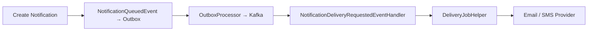

# ADR-010: Notification Delivery via Kafka

## Status
Accepted

## Date
2026-03-31

## Context

Each email or SMS delivery was dispatched as a separate Hangfire job, with each job stored as a row in PostgreSQL. At scale (e.g., 10K recipients for a campaign notification), this creates a significant database bottleneck: 10K job rows inserted, polled, and updated in the Hangfire tables. The per-message DB overhead does not scale for bulk notification scenarios.

## Decision

We will route notification delivery requests through **Kafka via the outbox pattern** (see ADR-005).

The flow is:

1. A notification is created and a `NotificationQueuedEvent` is raised
2. The event is written to the outbox table (same transaction as notification creation)
3. `OutboxProcessor` publishes the event to Kafka
4. `NotificationDeliveryRequestedEventHandler` consumes from Kafka and performs the actual delivery, reusing the existing `DeliveryJobHelper` logic (email via SMTP, SMS via provider)

The old Hangfire-based delivery jobs are **retained** but disabled in production. They remain available for staging environment validation and as a fallback if Kafka infrastructure issues arise.

### Delivery Flow

## Consequences

### Positive
- **No per-message DB overhead**: Kafka handles message queuing instead of Hangfire's PostgreSQL tables
- **Higher throughput**: Kafka's partitioned log scales horizontally for bulk delivery
- **Reuses existing infrastructure**: Leverages the outbox pattern (ADR-005) and `DeliveryJobHelper` logic
- **Graceful fallback**: Old Hangfire jobs retained for staging validation

### Negative
- **Kafka dependency for delivery**: If Kafka consumers are down, deliveries are delayed (but not lost — outbox guarantees persistence)
- **Two code paths**: Hangfire and Kafka delivery paths both exist, increasing maintenance surface
- **Consumer ordering**: Kafka partition assignment must be considered if delivery order matters

### Risks
- **Duplicate delivery**: At-least-once semantics could send duplicate emails/SMS. Mitigation: idempotency key on delivery records, deduplication check before sending.
- **Hangfire path divergence**: If the Hangfire fallback path is not maintained, it may break silently. Mitigation: periodic staging runs using Hangfire path.

## Alternatives Considered

| Alternative | Pros | Cons | Why Rejected |
|------------|------|------|-------------|
| Optimize Hangfire (batch inserts, separate DB) | Minimal code change | Still limited by PostgreSQL polling throughput, doesn't address fundamental scaling issue | Postpones the problem rather than solving it |
| Direct Kafka publish (no outbox) | Lower latency | Event loss risk (see ADR-005) | Unacceptable reliability gap for notifications |
| External queue service (SQS, RabbitMQ) | Purpose-built for job queuing | Additional infrastructure, not aligned with existing Dapr/Kafka stack | Adds operational complexity without clear benefit |

## Related
- [ADR-005: Transactional Outbox Pattern](./ADR-005-transactional-outbox-pattern.md)
- Notification module: `src/Modules/Nexora.Modules.Notifications/`
