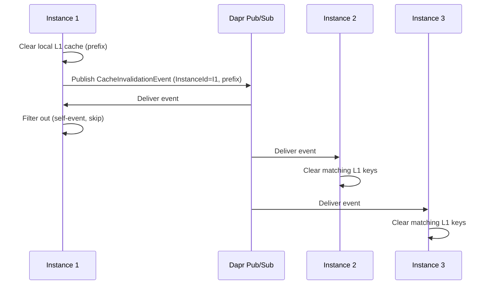

# ADR-011: Cache Cross-Instance Invalidation

## Status
Accepted

## Date
2026-03-31

## Context

`DaprCacheService` implements a two-tier cache: L1 (in-memory, 2-minute TTL) and L2 (Redis via Dapr State Store, 15-minute TTL). The `RemoveByPrefixAsync` method only cleared the local instance's L1 in-memory cache. In a multi-instance deployment, other instances' L1 caches retained stale data until the 2-minute TTL expired naturally. This caused users to see inconsistent data depending on which instance served their request.

## Decision

We will publish a **`CacheInvalidationEvent`** via **Dapr pub/sub** (topic: `nexora.cache.invalidation`) whenever a cache prefix is invalidated.

Each application instance subscribes to this topic. When a `CacheInvalidationEvent` is received, the instance clears all matching L1 keys from its in-memory cache. To avoid redundant processing, each instance includes its own `InstanceId` in the event and filters out self-published events.

### Invalidation Flow

## Consequences

### Positive
- **Cross-instance cache consistency**: All instances clear stale L1 entries within ~50ms of invalidation
- **Uses existing infrastructure**: Leverages Dapr pub/sub (Kafka) already in place
- **Self-event filtering**: Prevents redundant cache clears on the originating instance
- **No additional infrastructure**: No dedicated cache bus or Redis pub/sub channel needed

### Negative
- **Eventual consistency**: ~50ms window where other instances may serve stale L1 data
- **Pub/sub overhead**: One additional message per cache invalidation operation
- **Broadcast to all instances**: Every instance receives every invalidation event, even if it has no matching L1 keys

### Risks
- **High invalidation volume**: A bulk operation invalidating many cache prefixes could flood the pub/sub topic. Mitigation: batch invalidation events, debounce rapid successive invalidations.
- **Instance ID collision**: If `InstanceId` is not unique (e.g., reused container ID), self-filtering may fail. Mitigation: use `Guid.NewGuid()` generated at startup.

## Alternatives Considered

| Alternative | Pros | Cons | Why Rejected |
|------------|------|------|-------------|
| Shorter L1 TTL (e.g., 10s) | Simpler, no pub/sub needed | Higher L2/DB hit rate, worse performance | Trades performance for consistency — unacceptable for high-traffic queries |
| Redis pub/sub (SUBSCRIBE/PUBLISH) | Low latency, purpose-built | Requires direct Redis connection, bypasses Dapr abstraction | Violates infrastructure abstraction principle (all state via Dapr) |
| Remove L1 cache entirely | No staleness | Significant latency increase, every read hits Redis | Defeats the purpose of the two-tier cache design |
| Shared distributed cache only | Consistent by default | Higher latency per read (~2-5ms vs <1ms for in-memory) | L1 exists specifically for sub-millisecond reads on hot data |

## Related
- Cache infrastructure: `src/Nexora.Infrastructure/Caching/DaprCacheService.cs`
- [Infrastructure Standards — Cache](../standards/INFRASTRUCTURE_STANDARDS.md)
