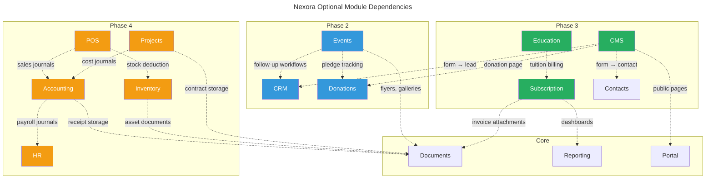
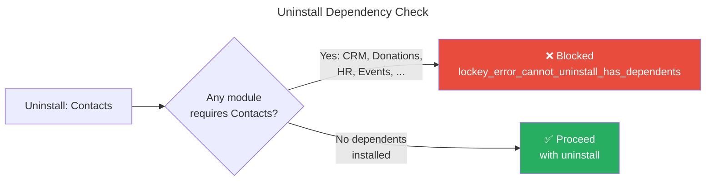

# Module Dependencies

## Required Dependencies

Solid arrows (`-->`) indicate **required** module dependencies. A module cannot be installed without its required dependencies.

```mermaid
---
title: Nexora Module Dependency Graph (Required)
---
flowchart TB
    subgraph Core["Core Platform (Phase 0-1)"]
        Identity["Identity & Access\nManagement"]
        Contacts["Contact\nManagement"]
        Notifications["Notification\nEngine"]
        Documents["Document\nManagement"]
        Reporting["Reporting\nEngine"]
        Portal["Portal\nFramework"]
    end

    subgraph Phase2["NGO & Foundation (Phase 2)"]
        CRM["CRM"]
        Donations["Donations &\nFundraising"]
        Sponsorship["Sponsorship\nManagement"]
        Events["Event\nManagement"]
        Kumbara["Collection Box\n(Kumbara)"]
        Kumanya["Aid Package\n(Kumanya)"]
    end

    subgraph Phase3["Education & CMS (Phase 3)"]
        Education["Education\nManagement"]
        Subscription["Subscription\n& Billing"]
        CMS["Website &\nCMS"]
        Surveys["Survey &\nFeedback"]
    end

    subgraph Phase4["Operations (Phase 4)"]
        Accounting["Accounting\n& Finance"]
        HR["HR &\nPayroll"]
        POS["Point of\nSale"]
        Fleet["Fleet\nManagement"]
        Inventory["Inventory &\nAssets"]
        Projects["Project\nManagement"]
    end

    %% Core internal dependencies
    Contacts --> Identity
    Notifications --> Identity
    Notifications --> Contacts
    Documents --> Identity
    Reporting --> Identity
    Portal --> Identity

    %% Phase 2 required dependencies
    CRM --> Contacts
    CRM --> Notifications
    Donations --> Contacts
    Donations --> Notifications
    Donations --> Documents
    Sponsorship --> Contacts
    Sponsorship --> Donations
    Sponsorship --> Notifications
    Events --> Contacts
    Events --> Notifications
    Kumbara --> Contacts
    Kumbara --> Notifications
    Kumanya --> Contacts
    Kumanya --> Notifications

    %% Phase 3 required dependencies
    Education --> CRM
    Education --> Contacts
    Education --> Documents
    Education --> Notifications
    Subscription --> Contacts
    Subscription --> Notifications
    CMS --> Notifications
    Surveys --> Contacts
    Surveys --> Notifications

    %% Phase 4 required dependencies
    Accounting --> Contacts
    HR --> Contacts
    HR --> Notifications
    HR --> Documents
    POS --> Contacts
    POS --> Notifications
    Fleet --> Contacts
    Fleet --> Notifications
    Fleet --> Documents
    Inventory --> Contacts
    Inventory --> Notifications
    Projects --> Contacts
    Projects --> Notifications

    %% Styling
    style Identity fill:#e74c3c,color:#fff
    style Contacts fill:#e74c3c,color:#fff
    style Notifications fill:#e74c3c,color:#fff
    style Documents fill:#e74c3c,color:#fff
    style Reporting fill:#e74c3c,color:#fff
    style Portal fill:#e74c3c,color:#fff

    style CRM fill:#3498db,color:#fff
    style Donations fill:#3498db,color:#fff
    style Sponsorship fill:#3498db,color:#fff
    style Events fill:#3498db,color:#fff
    style Kumbara fill:#3498db,color:#fff
    style Kumanya fill:#3498db,color:#fff

    style Education fill:#27ae60,color:#fff
    style Subscription fill:#27ae60,color:#fff
    style CMS fill:#27ae60,color:#fff
    style Surveys fill:#27ae60,color:#fff

    style Accounting fill:#f39c12,color:#fff
    style HR fill:#f39c12,color:#fff
    style POS fill:#f39c12,color:#fff
    style Fleet fill:#f39c12,color:#fff
    style Inventory fill:#f39c12,color:#fff
    style Projects fill:#f39c12,color:#fff
```



> **Note**: All business modules implicitly depend on **Identity** for authentication, tenant resolution, and RBAC. These arrows are omitted from the diagram to reduce clutter. Only non-Identity required dependencies are shown as solid arrows.

## Optional Dependencies

Dashed arrows indicate **optional** dependencies. The module works without them but gains additional features when they are installed.



## Dependency Rules

1. **Core modules have no business module dependencies** — they only depend on each other
2. **All business modules depend on Identity** (implicit, not shown in diagram)
3. **Required dependencies** must be installed before the dependent module can be installed
4. **Optional dependencies** enable additional features when present (graceful degradation when absent)
5. **Cross-module communication** is always via Kafka integration events or SharedKernel interfaces, never direct references
6. **Modules within the same phase** may share domain events but never database tables

## Complete Dependency Matrix

| Module | Phase | Required Dependencies | Optional Dependencies |
|--------|-------|---------------------|----------------------|
| Identity & Access | Core | — | Keycloak, Redis |
| Contact Management | Core | identity | — |
| Notification Engine | Core | identity, contacts | — |
| Document Management | Core | identity | — |
| Reporting Engine | Core | identity | — |
| Portal Framework | Core | identity | — |
| CRM | Phase 2 | contacts, notifications | — |
| Donations & Fundraising | Phase 2 | contacts, notifications, documents | — |
| Sponsorship | Phase 2 | contacts, donations, notifications | — |
| Event Management | Phase 2 | contacts, notifications | documents, crm, donations |
| Collection Box (Kumbara) | Phase 2 | contacts, notifications | — |
| Aid Package (Kumanya) | Phase 2 | contacts, notifications | — |
| Education Management | Phase 3 | crm, contacts, documents, notifications | subscription |
| Subscription & Billing | Phase 3 | contacts, notifications | reporting, documents |
| Website & CMS | Phase 3 | notifications | contacts, crm, donations, portal |
| Surveys & Feedback | Phase 3 | contacts, notifications | — |
| Accounting & Finance | Phase 4 | contacts | hr, documents, notifications |
| HR & Payroll | Phase 4 | contacts, notifications, documents | — |
| Point of Sale | Phase 4 | contacts, notifications | inventory, accounting |
| Fleet Management | Phase 4 | contacts, notifications, documents | — |
| Inventory & Assets | Phase 4 | contacts, notifications | documents |
| Project Management | Phase 4 | contacts, notifications | documents, accounting |

## Install Order (Minimum Viable)

For an NGO:
```
Identity → Contacts → Notifications → Documents → CRM → Donations → Sponsorship → Events
```

For a School:
```
Identity → Contacts → Notifications → Documents → CRM → Education → Subscription
```

For a Multi-Entity (NGO + School):
```
Identity → Contacts → Notifications → Documents → CRM → Donations → Sponsorship → Events → Education → Subscription
```

For Operations Add-on:
```
... → Accounting → HR → Fleet
... → Accounting → POS → Inventory
... → Accounting → Projects
```

## Uninstall Protection

A module **cannot be uninstalled** if another installed module has it as a **required dependency**.



### Core Module Protection
The following modules **cannot be uninstalled** regardless of dependencies:
- **Identity & Access** — foundational for all operations
- **Contact Management** — unified contact registry used by almost every module
