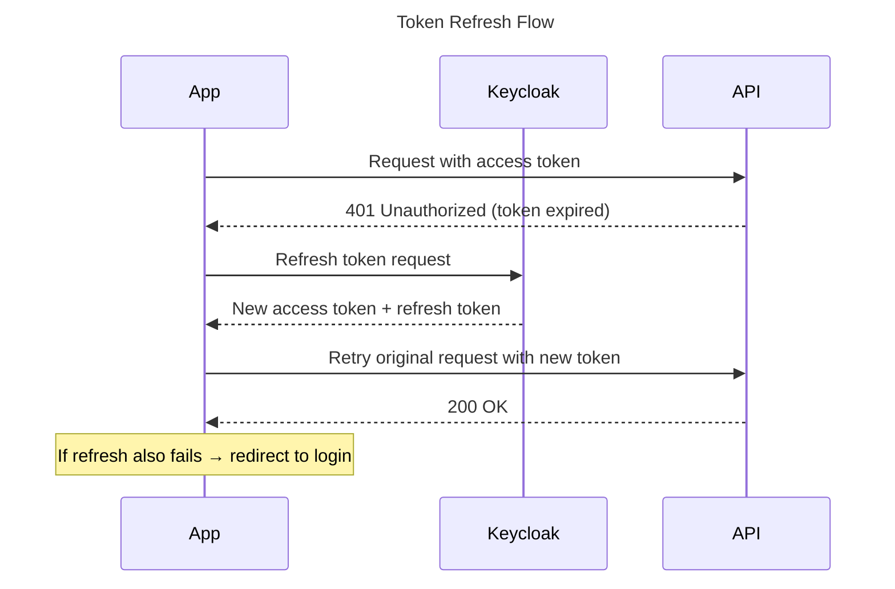
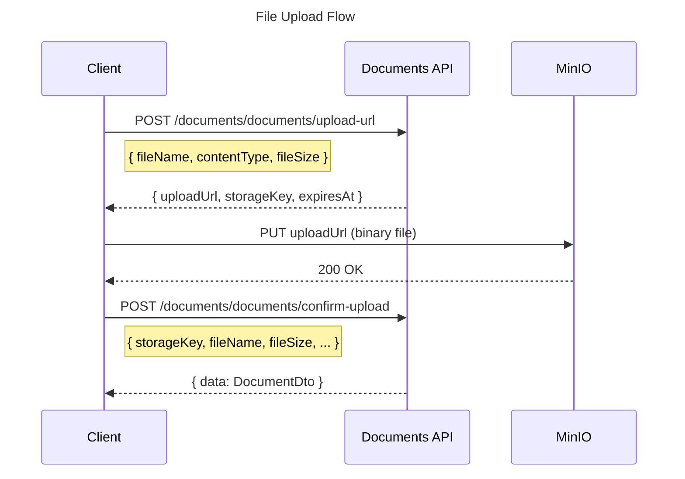
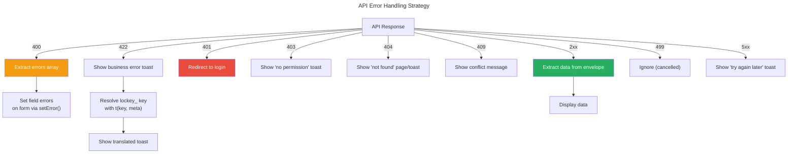

# Nexora - Frontend API Integration Guide

This guide describes how frontend applications consume the Nexora backend API. All examples are in TypeScript and use TanStack Query for data fetching.

## 1. API Base URL & Versioning

**URL Pattern**: `/api/v1/{module}/{resource}`

```
GET    /api/v1/contacts/contacts          # List contacts
POST   /api/v1/contacts/contacts          # Create contact
GET    /api/v1/contacts/contacts/{id}     # Get contact by ID
PUT    /api/v1/contacts/contacts/{id}     # Update contact
DELETE /api/v1/contacts/contacts/{id}     # Delete contact
POST   /api/v1/contacts/contacts/{id}/archive  # Custom action
```

**Environment Configuration**:

```typescript
// Admin (Vite)
const API_BASE = import.meta.env.VITE_API_BASE_URL; // "http://localhost:5000/api/v1"

// Portal (Next.js)
const API_BASE = process.env.NEXT_PUBLIC_API_URL;    // "http://localhost:5000/api/v1"
```

## 2. Response Format — ApiEnvelope\<T\>

All API responses are wrapped in a standardized envelope. The TypeScript types mirror the backend exactly.

### 2.1 TypeScript Types

```typescript
// shared/types/api.ts

/** Standard API response wrapper */
interface ApiEnvelope<T> {
  data?: T;
  message?: string;                // lockey_ key (never translated text)
  meta?: Record<string, string>;   // Message parameters
  errors?: ApiValidationError[];   // Validation errors (only on 400)
}

/** A single validation error */
interface ApiValidationError {
  key: string;                     // lockey_ error key
  params?: Record<string, string>; // Error parameters
}

/** Paginated list response */
interface PagedResult<T> {
  items: T[];
  totalCount: number;
  page: number;
  pageSize: number;
  totalPages: number;
  hasNextPage: boolean;
  hasPreviousPage: boolean;
}
```

### 2.2 Success Response

```json
// POST /api/v1/contacts/contacts → 201
{
  "data": {
    "id": "3fa85f64-5717-4562-b3fc-2c963f66afa6",
    "firstName": "Ali",
    "lastName": "Yılmaz",
    "email": "ali@example.com",
    "createdAt": "2026-03-21T10:30:00Z"
  },
  "message": "lockey_contacts_contact_created"
}
```

### 2.3 Paginated Response

```json
// GET /api/v1/contacts/contacts?page=1&pageSize=20 → 200
{
  "data": {
    "items": [
      { "id": "...", "firstName": "Ali", "lastName": "Yılmaz" },
      { "id": "...", "firstName": "Ayşe", "lastName": "Demir" }
    ],
    "totalCount": 142,
    "page": 1,
    "pageSize": 20,
    "totalPages": 8,
    "hasNextPage": true,
    "hasPreviousPage": false
  },
  "message": "lockey_contacts_contacts_listed"
}
```

### 2.4 Error Response

```json
// Error → 4xx/5xx
{
  "message": "lockey_contacts_error_contact_not_found",
  "meta": { "contactId": "3fa85f64-..." }
}
```

### 2.5 Validation Error Response

```json
// Validation → 400
{
  "message": "lockey_validation_failed",
  "errors": [
    {
      "key": "lockey_contacts_validation_email_required",
      "params": { "field": "Email" }
    },
    {
      "key": "lockey_contacts_validation_first_name_max_length",
      "params": { "field": "FirstName" }
    }
  ]
}
```

## 3. HTTP Status Codes

| Status | Meaning | Frontend Action |
|--------|---------|----------------|
| **200** | Success (GET/PUT) | Display data |
| **201** | Created (POST) | Navigate to detail or show toast |
| **204** | Deleted (DELETE) | Invalidate query, navigate back |
| **400** | Validation error | Show field-level errors on form |
| **401** | Not authenticated | Redirect to login |
| **403** | Not authorized | Show "no permission" message |
| **404** | Not found | Show "not found" page or toast |
| **409** | Conflict (duplicate) | Show conflict message |
| **422** | Business rule violation | Show error toast with message |
| **499** | Request cancelled | Ignore (user navigated away) |
| **500** | Server error | Show generic error message |
| **502** | External service down | Show "try again later" message |

## 4. Authentication

### 4.1 JWT from Keycloak

Nexora uses **Keycloak** with realm-per-tenant for authentication. The JWT contains:

```typescript
interface JwtClaims {
  sub: string;              // User ID (UUID)
  tenant_id: string;        // Tenant identifier
  organization_id?: string; // Current organization (if selected)
  permissions: string[];    // e.g., ["contacts.contacts.read", "contacts.contacts.write"]
  preferred_username: string;
  email: string;
  exp: number;              // Expiry timestamp
}
```

### 4.2 Token Usage

Every authenticated request must include the token:

```typescript
headers: {
  'Authorization': `Bearer ${token}`,
  'Content-Type': 'application/json',
}
```

### 4.3 Token Refresh



## 5. API Client Setup

### 5.1 Axios Instance

```typescript
// shared/lib/api.ts
import axios, { type AxiosError } from 'axios';
import type { ApiEnvelope } from '@/shared/types/api';
import { useAuthStore } from '@/shared/lib/stores/authStore';

const apiClient = axios.create({
  baseURL: import.meta.env.VITE_API_BASE_URL,
  headers: { 'Content-Type': 'application/json' },
});

// Request interceptor — inject auth token
apiClient.interceptors.request.use((config) => {
  const token = useAuthStore.getState().token;
  if (token) {
    config.headers.Authorization = `Bearer ${token}`;
  }
  return config;
});

// Response interceptor — unwrap ApiEnvelope
apiClient.interceptors.response.use(
  (response) => response,
  (error: AxiosError<ApiEnvelope<unknown>>) => {
    if (error.response?.status === 401) {
      useAuthStore.getState().logout();
      window.location.href = '/login';
    }
    return Promise.reject(error);
  },
);

/** Typed API helper functions */
export const api = {
  async get<T>(url: string, params?: Record<string, unknown>): Promise<T> {
    const response = await apiClient.get<ApiEnvelope<T>>(url, { params });
    return response.data.data!;
  },

  async post<T>(url: string, data?: unknown): Promise<T> {
    const response = await apiClient.post<ApiEnvelope<T>>(url, data);
    return response.data.data!;
  },

  async put<T>(url: string, data?: unknown): Promise<T> {
    const response = await apiClient.put<ApiEnvelope<T>>(url, data);
    return response.data.data!;
  },

  async delete(url: string): Promise<void> {
    await apiClient.delete(url);
  },
};
```

### 5.2 Error Extraction

```typescript
// shared/hooks/useApiError.ts
import { type AxiosError } from 'axios';
import { useTranslation } from 'react-i18next';
import type { ApiEnvelope, ApiValidationError } from '@/shared/types/api';
import { toast } from 'sonner';

interface ApiErrorInfo {
  message: string;         // Resolved (translated) message
  key: string;             // Original lockey_ key
  meta?: Record<string, string>;
  validationErrors?: ApiValidationError[];
  status?: number;
}

export function useApiError() {
  const { t } = useTranslation(['error', 'validation']);

  function extractError(error: unknown): ApiErrorInfo {
    const axiosError = error as AxiosError<ApiEnvelope<unknown>>;
    const envelope = axiosError.response?.data;
    const status = axiosError.response?.status;

    if (!envelope?.message) {
      return {
        message: t('lockey_error_unexpected'),
        key: 'lockey_error_unexpected',
        status,
      };
    }

    // Determine namespace from key prefix
    const key = envelope.message;
    const ns = key.startsWith('lockey_validation_') ? 'validation' : 'error';

    return {
      message: t(key, { ns, ...envelope.meta }),
      key,
      meta: envelope.meta ?? undefined,
      validationErrors: envelope.errors,
      status,
    };
  }

  /** Show error toast with resolved message */
  function handleApiError(
    error: unknown,
    setFieldError?: (field: string, error: { message: string }) => void,
  ) {
    const info = extractError(error);

    // If validation errors, set field-level errors on the form
    if (info.validationErrors?.length && setFieldError) {
      for (const ve of info.validationErrors) {
        const field = ve.params?.field;
        if (field) {
          setFieldError(field, { message: t(ve.key, ve.params ?? {}) });
        }
      }
      return;
    }

    // Otherwise show toast
    toast.error(info.message);
  }

  return { extractError, handleApiError };
}
```

## 6. TanStack Query Patterns

### 6.1 Query Client Configuration

```typescript
// shared/lib/query.ts
import { QueryClient } from '@tanstack/react-query';

export const queryClient = new QueryClient({
  defaultOptions: {
    queries: {
      staleTime: 30 * 1000,       // 30 seconds
      retry: 1,                    // Retry once on failure
      refetchOnWindowFocus: false,
    },
    mutations: {
      retry: 0,                    // Don't retry mutations
    },
  },
});
```

### 6.2 Query Key Convention

```typescript
// Query keys follow: [module, resource, action?, params?]

// Lists
['contacts', 'list']                           // All contacts
['contacts', 'list', { page: 1, search: 'Ali' }]  // Filtered
['notifications', 'templates', 'list']         // All templates

// Details
['contacts', 'detail', 'uuid-123']            // Single contact
['documents', 'detail', 'uuid-456']           // Single document

// Related resources
['contacts', 'detail', 'uuid-123', 'addresses']  // Contact addresses
['documents', 'detail', 'uuid-456', 'versions']  // Document versions
```

### 6.3 Query Key Factory Pattern

```typescript
// modules/contacts/hooks/queryKeys.ts

export const contactKeys = {
  all: ['contacts'] as const,
  lists: () => [...contactKeys.all, 'list'] as const,
  list: (params?: ContactListParams) => [...contactKeys.lists(), params] as const,
  details: () => [...contactKeys.all, 'detail'] as const,
  detail: (id: string) => [...contactKeys.details(), id] as const,
  addresses: (id: string) => [...contactKeys.detail(id), 'addresses'] as const,
};
```

### 6.4 CRUD Hook Examples

```typescript
// modules/contacts/hooks/useContacts.ts

/** List contacts with pagination and filters */
export function useContacts(params?: ContactListParams) {
  return useQuery({
    queryKey: contactKeys.list(params),
    queryFn: () => api.get<PagedResult<ContactDto>>('/contacts/contacts', params),
  });
}

/** Get a single contact by ID */
export function useContact(id: string) {
  return useQuery({
    queryKey: contactKeys.detail(id),
    queryFn: () => api.get<ContactDto>(`/contacts/contacts/${id}`),
    enabled: !!id,
  });
}

/** Create a new contact */
export function useCreateContact() {
  const queryClient = useQueryClient();
  return useMutation({
    mutationFn: (data: CreateContactRequest) =>
      api.post<ContactDto>('/contacts/contacts', data),
    onSuccess: () => {
      queryClient.invalidateQueries({ queryKey: contactKeys.lists() });
    },
  });
}

/** Update an existing contact */
export function useUpdateContact(id: string) {
  const queryClient = useQueryClient();
  return useMutation({
    mutationFn: (data: UpdateContactRequest) =>
      api.put<ContactDto>(`/contacts/contacts/${id}`, data),
    onSuccess: () => {
      queryClient.invalidateQueries({ queryKey: contactKeys.detail(id) });
      queryClient.invalidateQueries({ queryKey: contactKeys.lists() });
    },
  });
}

/** Delete a contact */
export function useDeleteContact() {
  const queryClient = useQueryClient();
  return useMutation({
    mutationFn: (id: string) => api.delete(`/contacts/contacts/${id}`),
    onSuccess: () => {
      queryClient.invalidateQueries({ queryKey: contactKeys.lists() });
    },
  });
}
```

## 7. Pagination

### 7.1 Request

```
GET /api/v1/contacts/contacts?page=2&pageSize=20&search=Ali
```

### 7.2 Hook with Pagination

```typescript
// shared/hooks/usePagination.ts
import { useSearchParams } from 'react-router-dom';

export function usePagination(defaultPageSize = 20) {
  const [searchParams, setSearchParams] = useSearchParams();

  const page = Number(searchParams.get('page')) || 1;
  const pageSize = Number(searchParams.get('pageSize')) || defaultPageSize;

  const setPage = (newPage: number) => {
    setSearchParams((prev) => {
      prev.set('page', String(newPage));
      return prev;
    });
  };

  return { page, pageSize, setPage };
}

// Usage in page component
function ContactListPage() {
  const { page, pageSize, setPage } = usePagination();
  const { data, isLoading } = useContacts({ page, pageSize });

  return (
    <>
      <DataTable data={data?.items ?? []} />
      <Pagination
        page={page}
        totalPages={data?.totalPages ?? 0}
        onPageChange={setPage}
      />
    </>
  );
}
```

## 8. Module Availability & Permissions

### 8.1 Checking Installed Modules

```typescript
// shared/hooks/useModules.ts

export function useInstalledModules() {
  return useQuery({
    queryKey: ['identity', 'modules'],
    queryFn: () => api.get<ModuleInfo[]>('/identity/modules'),
    staleTime: 5 * 60 * 1000, // 5 minutes — rarely changes
  });
}

export function useHasModule(moduleName: string): boolean {
  const { data } = useInstalledModules();
  return data?.some((m) => m.name === moduleName) ?? false;
}
```

### 8.2 Permission Checking

```typescript
// Permission format: {module}.{resource}.{action}
// Examples: contacts.contacts.read, contacts.contacts.write, documents.documents.manage

// In components:
const { hasPermission } = useAuthStore();

{hasPermission('contacts.contacts.write') && (
  <Button onClick={handleCreate}>{t('lockey_common_create')}</Button>
)}
```

## 9. File Upload (Presigned URL Flow)

Document uploads use a presigned URL pattern:



```typescript
// modules/documents/hooks/useUploadDocument.ts

export function useUploadDocument() {
  const queryClient = useQueryClient();

  return useMutation({
    mutationFn: async (file: File) => {
      // Step 1: Get presigned URL
      const { uploadUrl, storageKey } = await api.post<UploadUrlDto>(
        '/documents/documents/upload-url',
        { fileName: file.name, contentType: file.type, fileSize: file.size },
      );

      // Step 2: Upload file directly to MinIO
      await fetch(uploadUrl, {
        method: 'PUT',
        body: file,
        headers: { 'Content-Type': file.type },
      });

      // Step 3: Confirm upload
      return api.post<DocumentDto>('/documents/documents/confirm-upload', {
        storageKey,
        fileName: file.name,
        contentType: file.type,
        fileSize: file.size,
      });
    },
    onSuccess: () => {
      queryClient.invalidateQueries({ queryKey: ['documents', 'list'] });
    },
  });
}
```

## 10. Error Handling Flowchart



## 11. Localization of API Messages

Backend **NEVER** returns translated strings. All `message` fields contain `lockey_` keys.

### Resolution Pattern

```typescript
// Successful operation — optional toast
const { data, message } = response; // message = "lockey_contacts_contact_created"
if (message) {
  toast.success(t(message));
}

// Error — resolve key with params
const { message, meta } = errorEnvelope;
// message = "lockey_contacts_error_duplicate_email"
// meta = { "email": "ali@example.com" }
toast.error(t(message, meta));
// Resolved: "Bu e-posta adresi zaten kullanılıyor: ali@example.com"
```

### Translation File Example

```json
// locales/en/contacts.json
{
  "lockey_contacts_contact_created": "Contact created successfully",
  "lockey_contacts_contact_updated": "Contact updated",
  "lockey_contacts_error_duplicate_email": "Email {{email}} is already in use",
  "lockey_contacts_error_contact_not_found": "Contact not found",
  "lockey_contacts_validation_email_required": "Email is required",
  "lockey_contacts_page_title": "Contacts",
  "lockey_contacts_field_first_name": "First Name",
  "lockey_contacts_field_last_name": "Last Name"
}
```

```json
// locales/tr/contacts.json
{
  "lockey_contacts_contact_created": "Kişi başarıyla oluşturuldu",
  "lockey_contacts_contact_updated": "Kişi güncellendi",
  "lockey_contacts_error_duplicate_email": "{{email}} e-posta adresi zaten kullanılıyor",
  "lockey_contacts_error_contact_not_found": "Kişi bulunamadı",
  "lockey_contacts_validation_email_required": "E-posta zorunludur",
  "lockey_contacts_page_title": "Kişiler",
  "lockey_contacts_field_first_name": "Ad",
  "lockey_contacts_field_last_name": "Soyad"
}
```
