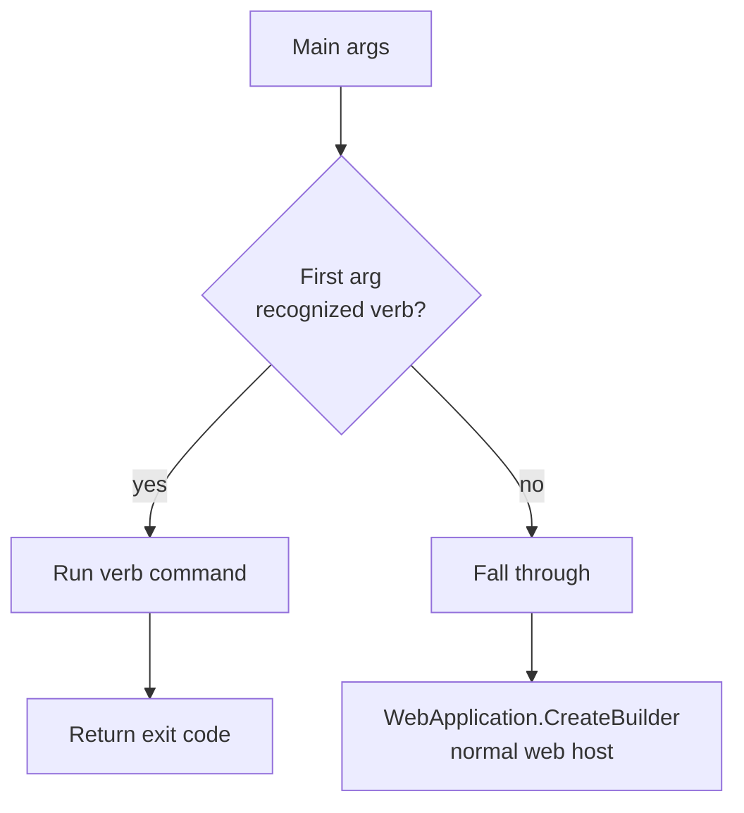

# Nexora Host CLI

Task-oriented reference for the verb-style CLI shipped with `Nexora.Host`. Use
this guide when you need to run a one-shot operator task (seed demo data,
inspect the host, etc.) against a Nexora deployment without spinning up the
web server.

> **Audience.** Operators running against a dev or on-prem host; developers
> extending the CLI with a new verb. For API callers, see
> [`API_INTEGRATION_GUIDE.md`](./API_INTEGRATION_GUIDE.md). For tenant-level
> operational runbooks, see [`../operations/TENANT_OPERATIONS.md`](../operations/TENANT_OPERATIONS.md).

---

## 1. How invocation works

The CLI lives inside the same `Nexora.Host` binary that serves the web API.
A top-of-`Main` dispatcher intercepts the first positional arg BEFORE
`WebApplication.CreateBuilder(…)` is called. When the first arg matches a
known verb, the dispatcher runs the verb synchronously and returns an exit
code; the web host never starts. When the first arg does not match (e.g.
`--urls`, `--environment`), the dispatcher falls through and the normal web
host boots.



Source of truth: [`src/Nexora.Host/Cli/CliDispatcher.cs`](../../src/Nexora.Host/Cli/CliDispatcher.cs).
Every verb's command handler gets `args.AsSpan(1)` — the full arg list
minus the verb token.

**Why a dispatcher, not a separate executable?** The CLI needs the same DI
container, module registry, and configuration as the web host — running
`demo:load` against a live tenant schema is exactly equivalent to the API
server accessing that schema. A separate binary would need to rebuild the
whole composition root. The dispatcher reuses it.

### Invocation forms

| Environment | Form |
|---|---|
| Local dev, source tree | `dotnet run --project src/Nexora.Host -- <verb> [args]` |
| Compiled binary | `./Nexora.Host <verb> [args]` |
| Docker Compose | `docker compose run --rm nexora-api <verb> [args]` |
| Kubernetes | `kubectl exec -it <host-pod> -- dotnet Nexora.Host.dll <verb> [args]` |

The `--` before `<verb>` in the `dotnet run` form is required: without it,
`dotnet run` tries to interpret the verb as one of its own flags.

---

## 2. Exit codes

Defined in [`CliDispatcher.cs`](../../src/Nexora.Host/Cli/CliDispatcher.cs).
Scripts and CI orchestration can rely on these:

| Code | Constant | Meaning |
|-----:|----------|---------|
| `0` | — | Success, or "nothing to do" (e.g. every module already seeded). |
| `1` | `CliDispatcher.UsageError` | Malformed args, missing required flag, unknown flag, or a pre-flight check failed (e.g. tenant schema does not exist). |
| `2` | `CliDispatcher.PartialFailure` | The command ran but at least one sub-step failed (e.g. one module's `SeedDemoDataAsync` threw). Other sub-steps may have succeeded — inspect stdout for the per-step summary. |
| `130` | `CliDispatcher.Cancelled` | Operator cancelled (SIGINT / Ctrl+C). Matches POSIX `128 + SIGINT`. Use this in CI timeouts to distinguish a cancelled run from a real usage/failure exit. |

CLI commands NEVER catch unknown exceptions and return `0` — fatal CLR
conditions (`OutOfMemoryException`, `StackOverflowException`) propagate so
the process crashes loudly instead of silently reporting success.

---

## 3. Command reference

### 3.1 `help`, `--help`, `-h`

Prints the usage summary.

```bash
dotnet run --project src/Nexora.Host -- --help
```

No side effects. Always exits `0`.

### 3.2 `demo:load`

Seeds a tenant schema with demo data by invoking `IDemoDataSeeder` under the
CLI's DI scope. Foundation for the admin-UI "Create Demo Environment"
button (T-008 — carry-over) and the scenario catalogue (T-007 — carry-over).

```bash
nexora demo:load --tenant=<guid> --scenario=<name> [--dry-run] [--verbose]
```

| Flag | Required | Accepts | Description |
|------|----------|---------|-------------|
| `--tenant` | yes | GUID | Target tenant id. Must already have a provisioned schema (`tenant_<guid>`); `demo:load` does NOT auto-provision — provisioning is a separate admin API. |
| `--scenario` | yes | string | Scenario identifier (e.g. `general`, `ngo`). Passed through to each module's `SeedDemoDataAsync`; modules may support a subset and skip otherwise. |
| `--dry-run` | no | flag | Print the plan (module count, scenario) without invoking any seeder or writing markers. Returns `0`. |
| `--verbose`, `-v` | no | flag | On failure, include the underlying exception message and type in stderr (default prints only the type name — avoids leaking server details like SQL fragments or connection strings). |

Both `--key=value` and `--key value` forms work for the value-bearing flags.
The parser refuses tokens that look like flags (`--other`, `-x`) as flag
values — a common mis-parse trap — while still accepting negative numbers
(`-1`) and bare `-`.

**Idempotency.** Each `(tenant, module, scenario)` tuple writes a marker in
`demo_seed_markers`. Re-running the same command is safe: modules already
in state `Seeded` short-circuit with the `AlreadySeeded` outcome; a stuck
`InProgress` marker (from a previous crash) triggers a retry under the
contract that modules MUST implement their own idempotency.

**No-op modules.** Modules that ship the default `IModule.SeedDemoDataAsync`
(the C# default interface method — no demo content) report the `NoOp`
outcome without writing a marker. Re-invoking a no-op every run is cheaper
than a marker read, and the operator gets accurate "this module ships no
demo content" feedback.

#### Example — dry run

```bash
$ dotnet run --project src/Nexora.Host -- demo:load \
    --tenant=3f2b…c7a1 --scenario=general --dry-run
[dry-run] demo:load tenant=3f2b…c7a1 scenario=general
[dry-run] would iterate IModule.SeedDemoDataAsync over 6 modules and write idempotency markers on success.
[dry-run] no changes made.
$ echo $?
0
```

#### Example — real run, mixed outcomes

```bash
$ nexora demo:load --tenant=3f2b…c7a1 --scenario=ngo
demo:load completed for tenant 3f2b…c7a1 scenario ngo:
  - identity: seeded
  - contacts: seeded
  - documents: already-seeded
  - notifications: no-op (no demo content)
  - audit: no-op (no demo content)
  - reporting: FAILED — The operation has timed out.
$ echo $?
2                   # PartialFailure — reporting module threw; others are intact
```

#### Example — missing tenant schema

```bash
$ nexora demo:load --tenant=00000000-0000-0000-0000-000000000000 --scenario=general
Tenant schema 'tenant_00000000-0000-0000-0000-000000000000' does not exist.
Provision the tenant first via the Identity admin API; demo:load does not auto-provision.
$ echo $?
1                   # UsageError — pre-flight probe failed before any module ran
```

#### Scenarios

- `general` — default business setup (generic contacts, sample documents, one user).
- `ngo` — NGO vertical (donors, donation campaigns, volunteer workflows).

> T-007 ships the scenario content itself; until then, module implementations
> that declare a non-no-op `SeedDemoDataAsync` define what a scenario means
> for them. The scenario string is passed through untouched — experimental
> values ARE accepted and will no-op on modules that do not recognise them.

### 3.3 `demo:clean`

Inverse of `demo:load` (T-009). Removes demo-seeded rows by invoking
`IModule.CleanDemoDataAsync` on every installed module in **reverse**
dependency order and then deleting the matching `demo_seed_markers` rows so a
subsequent `demo:load` re-seeds cleanly. The `--drop-tenant` mode takes a
different path: it drops the entire tenant schema via
`DROP SCHEMA ... CASCADE` and publishes `TenantDeprovisionedIntegrationEvent`
so downstream systems (MinIO buckets, Keycloak realm, cache) can clean their
own footprint.

```bash
# Module-by-module cleanup of demo-seeded rows:
nexora demo:clean --tenant=<guid> --scenario=<name> [--dry-run] [--verbose]

# Destructive full-tenant drop (requires explicit --yes confirmation):
nexora demo:clean --tenant=<guid> --drop-tenant --yes [--verbose]
```

| Flag | Required | Accepts | Description |
|------|----------|---------|-------------|
| `--tenant` | yes | GUID | Target tenant id. |
| `--scenario` | yes * | string | Scenario identifier. * Not required (and ignored) when `--drop-tenant` is set. |
| `--drop-tenant` | no | flag | Drops the whole tenant schema. Destructive — combine with `--yes`. |
| `--yes` | required with `--drop-tenant` | flag | Non-interactive confirmation for `--drop-tenant`. No TTY prompt is offered; CLI stays scriptable. Missing `--yes` yields exit code 1. |
| `--dry-run` | no | flag | Print the plan without calling the cleaner. |
| `--verbose`, `-v` | no | flag | Include the underlying exception type + message on failure. |

**Idempotency.** Safe to re-run against an already-clean tenant: modules that
are already clean invoke their no-op cleanup and report `cleaned`; modules
that never had a marker report `nothing to clean`. The only non-idempotent
step is `--drop-tenant`, which is a one-shot DROP CASCADE.

**Mixed real + demo data.** Each module is responsible for distinguishing
its demo rows from real rows in its own `CleanDemoDataAsync` — the
orchestrator does not know which rows are demo vs. real. Recommended
patterns: a `Source = "demo"` column, a `DemoBatchId` FK, or a deterministic
ID prefix. See the XML docs on `IModule.CleanDemoDataAsync` for the
contract.

#### Example — normal cleanup

```bash
$ nexora demo:clean --tenant=3f2b…c7a1 --scenario=general
demo:clean completed for tenant 3f2b…c7a1 scenario general:
  - crm: cleaned
  - contacts: cleaned
  - identity: nothing to clean
  - audit: no-op (no demo content)
$ echo $?
0
```

#### Example — full tenant drop

```bash
$ nexora demo:clean --tenant=3f2b…c7a1 --drop-tenant --yes
[drop-tenant] dropping schema tenant_3f2b…c7a1 CASCADE — all data lost.
demo:clean --drop-tenant completed for tenant 3f2b…c7a1; TenantDeprovisionedIntegrationEvent published.
$ echo $?
0
```

#### Example — destructive op without confirmation

```bash
$ nexora demo:clean --tenant=3f2b…c7a1 --drop-tenant
--drop-tenant is destructive. Re-run with --yes to confirm the whole tenant schema will be dropped.
$ echo $?
1
```

#### Known limitation — `TenantDeprovisionedIntegrationEvent` delivery

The event is published via `IEventBus` directly, NOT via the transactional
outbox — because the current outbox table lives inside the tenant schema
that `--drop-tenant` is about to drop. Direct publish is at-most-once: a
Dapr/Kafka failure at the moment of drop loses the signal. Exit code `2`
(PartialFailure) is returned with a human-readable error so operators know
to trigger external cleanup manually. A platform-level (tenant-independent)
outbox is filed as a Phase-2 follow-up.

---

## 4. Locale support

CLI output is localized via [`CliLocalization.cs`](../../src/Nexora.Host/Cli/CliLocalization.cs),
a pre-DI resolver loaded from disk at first call:

```
src/Nexora.Host/Cli/Locales/host.en.json
src/Nexora.Host/Cli/Locales/host.tr.json
```

The resolver is pre-DI because CLI runs BEFORE `WebApplication.CreateBuilder`
and `ILocalizationService` is not available yet. Locale resolves from
`CultureInfo.CurrentUICulture`, falling back to `en`, and finally to the
lockey itself (a missing key surfaces loud as the raw key instead of
silently showing blank).

**Why disk, not embedded resource?** `Microsoft.NET.Sdk.Web` silently drops
`EmbeddedResource` entries for `*.json` paths under subfolders; the disk
approach sidesteps that quirk and has the operational benefit of letting
an operator hot-edit a locale on a deployed host without re-publishing.

**Parity test.** `CliLocalizationParityTests.cs` asserts that every
code-referenced lockey exists in both bundles AND that on-disk JSON matches
the loaded bundles byte-for-byte after normalization. A missing translation
in `tr` is a test failure, not a silent fallback.

---

## 5. Extending the CLI — adding a new verb

1. **Pick a verb name.** Use the `{module}:{action}` shape (colon-separated,
   lowercase). The dispatcher matches case-insensitively, so an operator
   typing `Demo:Load` from a shell with autocomplete won't hit "unknown
   command, falling through to web host".

2. **Write the command class.** Model it after
   [`DemoLoadCommand.cs`](../../src/Nexora.Host/Cli/DemoLoadCommand.cs):
   - Public `Run(ReadOnlySpan<string> args)` entry point called by the dispatcher.
   - Internal `RunAsync(options, hostFactory, ...)` that accepts an
     `IConsole` and `CancellationToken` for testability.
   - Internal `ParseArgs(ReadOnlySpan<string>)` returning a record with
     parsed flags + an `UnknownArgs` list.
   - `IsValid(out string error)` on the options record using lockey-keyed
     error messages (e.g. `lockey_cli_<verb>_missing_tenant`).
   - Catch only the exception families the command actually produces
     (`ArgumentException`, `InvalidOperationException`, `DbException`,
     `HttpRequestException`, `SocketException`, `OperationCanceledException`).
     Let unexpected exceptions propagate — CLI is the outermost process
     boundary, not module code; fatal CLR conditions must crash the process
     loudly.

3. **Register in the dispatcher.** Add a case in
   [`CliDispatcher.TryDispatch`](../../src/Nexora.Host/Cli/CliDispatcher.cs):

   ```csharp
   case "mymodule:myaction":
       exitCode = MyActionCommand.Run(args.AsSpan(1));
       return true;
   ```

4. **Add lockeys to both locale files.** Every user-facing string the CLI
   emits must be a `lockey_cli_<verb>_<descriptor>` key present in both
   `host.en.json` and `host.tr.json`. Update
   `CliLocalizationParityTests.CodeReferencedLockeys` in the same PR — the
   parity test fails if you forget.

5. **Update `PrintUsage()`.** Add a block for the new verb so
   `nexora --help` advertises it.

6. **Write unit tests.** Mirror `DemoLoadCommandTests.cs`:
   - Parser: both flag forms + unknown flags + invalid values.
   - Dispatcher: verb matched → command runs; unknown verb → falls through.
   - Runner: success path, partial-failure path, usage-error path.
   - Pin `CultureInfo.CurrentUICulture = new CultureInfo("en")` at test
     class ctor so output-token asserts don't flake on tr-TR hosts.

7. **Document it here.** Add a §3.N block to this guide.

---

## 6. Testing notes

- **Unit tests** — `tests/Nexora.Host.Tests/Cli/` — exercise the parser,
  dispatcher, and runner with in-memory hosts. No Postgres, no Dapr.
- **Locale parity** — `tests/Nexora.Host.Tests/Cli/CliLocalizationParityTests.cs`
  guards the en+tr parity and on-disk JSON match.
- **Integration** — T-006 deliberately deferred a full E2E shell-out test
  (would require `docker compose up` + a real tenant). The dispatcher
  + runner are integration-tested via unit tests with a stubbed
  `tenantSchemaProbe` delegate; the probe's production implementation
  (`DefaultTenantSchemaProbeAsync`) uses EF Core's
  `OpenConnectionAsync`/`CloseConnectionAsync` so it honours the host's
  connection-string resolution and pooling.

---

## 7. Troubleshooting

| Symptom | Likely cause | Fix |
|---------|--------------|-----|
| `Tenant schema 'tenant_<guid>' does not exist.` | Tenant was never provisioned on this host, or the GUID is wrong. | Use the Identity admin API to provision the tenant, OR double-check the `--tenant` GUID against the `platform_tenants` table. |
| `Unrecognised or invalid argument(s): <token>` | Typo'd flag or stray positional arg. | Re-check the flag name; both `--k=v` and `--k v` forms are accepted. |
| `demo:load failed (NpgsqlException).` with no further detail | Default stderr omits server-supplied message text on purpose (may contain connection strings / SQL fragments). | Re-run with `--verbose` to surface the underlying message. |
| Command appears to do nothing, returns `0` | Every module reports `NoOp` (default interface impl) or `AlreadySeeded` (marker exists). | Inspect stdout for the per-module outcome list. To force a re-seed, delete the matching rows from `demo_seed_markers` in the tenant schema. |
| Exit code `130`, no output | Operator pressed Ctrl+C. | Not an error — that's the POSIX cancelled signal. |

---

## 8. Related

- [T-005 task file](../analysis/tasks/phase-1.5/T-005.md) — `IModule.SeedDemoDataAsync` + orchestrator (the backend that `demo:load` drives).
- [T-006 task file](../analysis/tasks/phase-1.5/T-006.md) — the CLI command itself.
- [T-007 task file](../analysis/tasks/phase-1.5/T-007.md) — demo scenarios (carry-over).
- [T-008 task file](../analysis/tasks/phase-1.5/T-008.md) — admin-UI "Create Demo Environment" button (carry-over).
- [T-009 task file](../analysis/tasks/phase-1.5/T-009.md) — demo-data cleanup command (carry-over; will add a `demo:clean` verb).
- [`standards/localization.md`](../standards/localization.md) — lockey conventions the CLI follows.
- [`standards/schema-migration.md`](../standards/schema-migration.md) — the `demo_seed_markers` table is declared in `DevelopmentSeed.ApplySchemaUpdatesAsync` per this standard.
