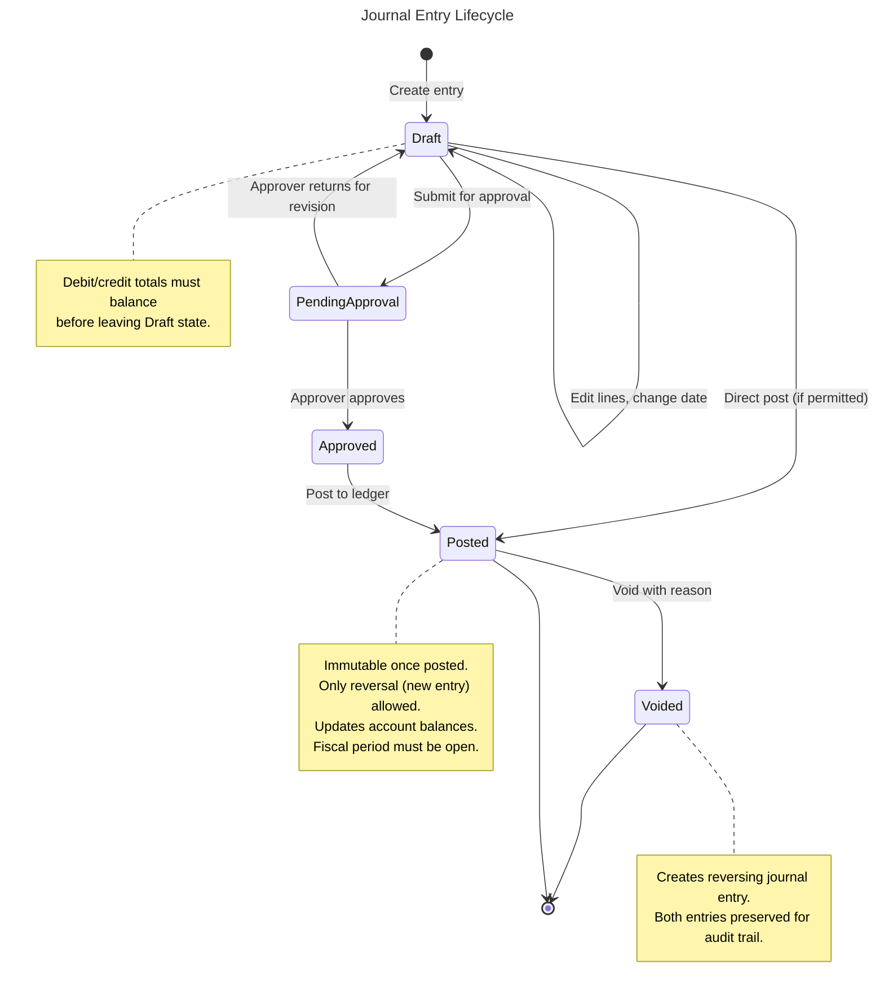
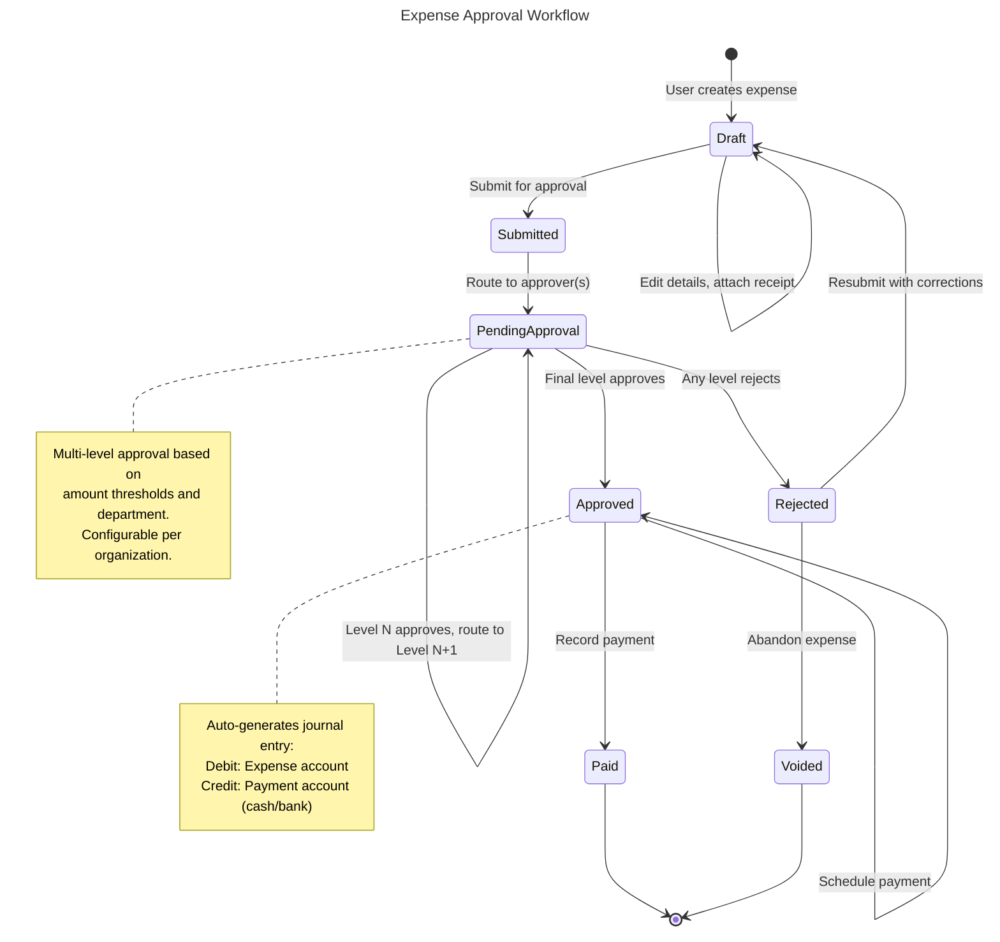
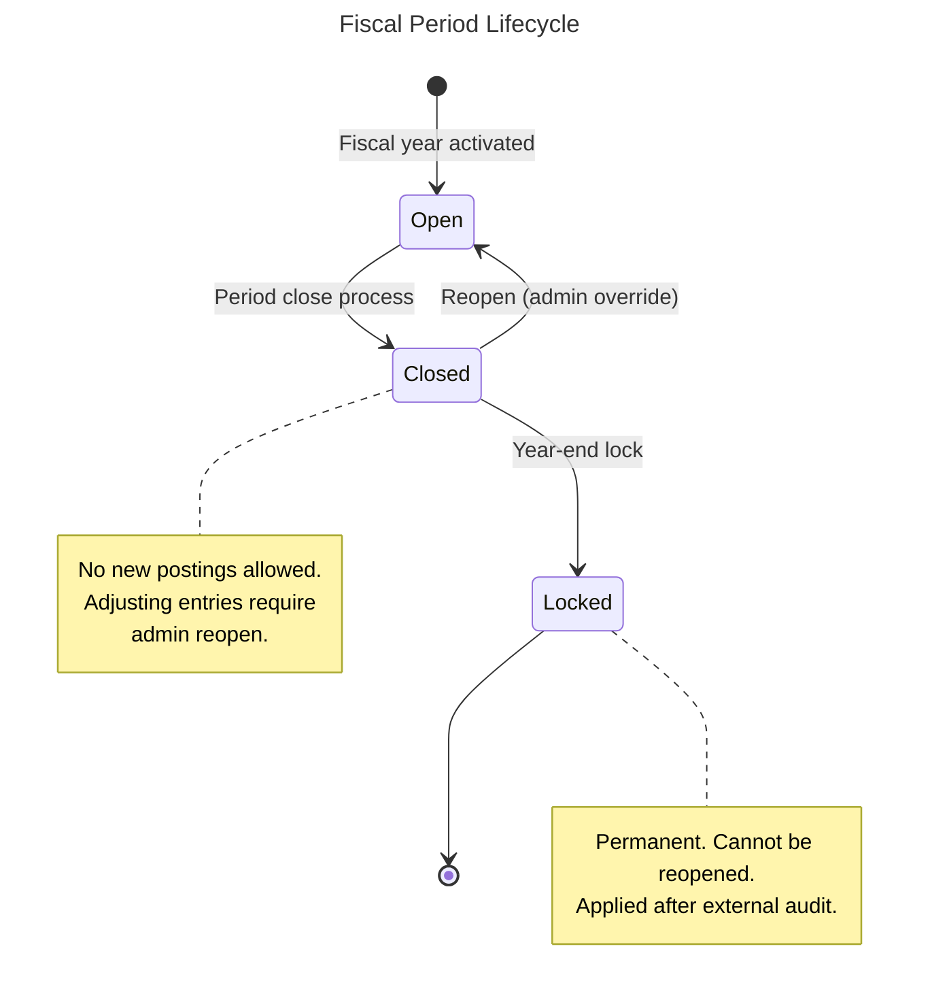
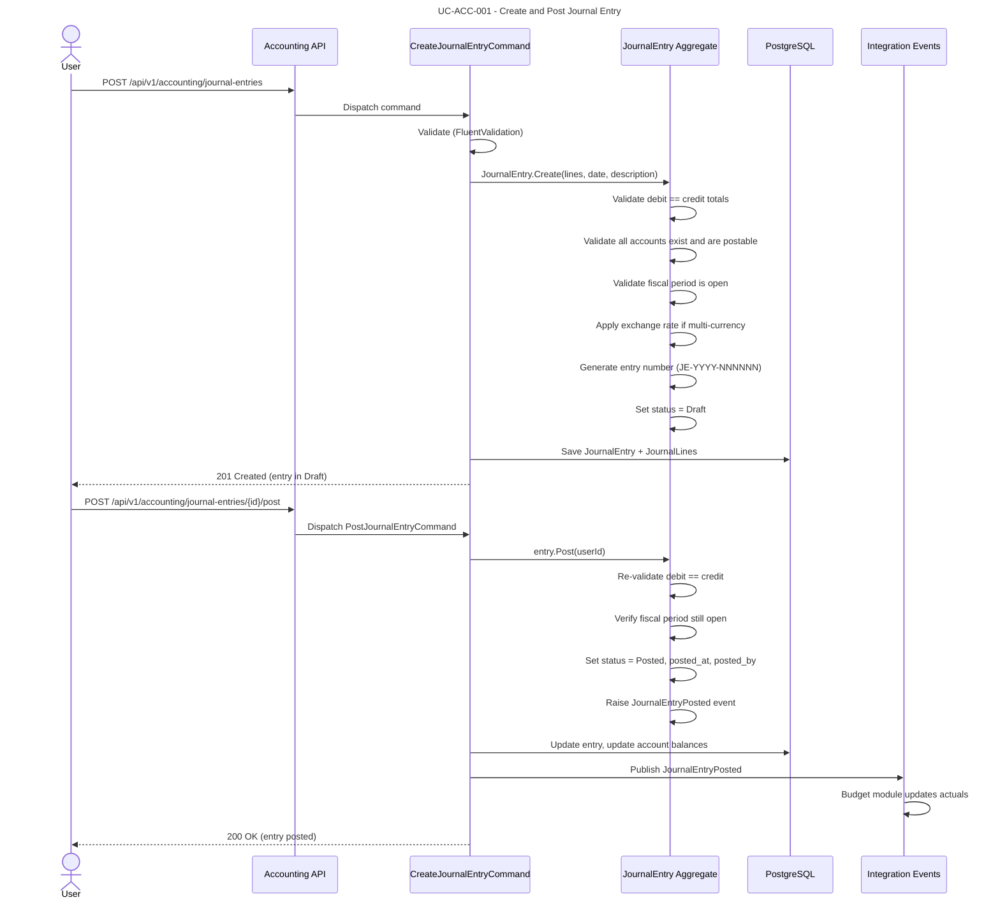
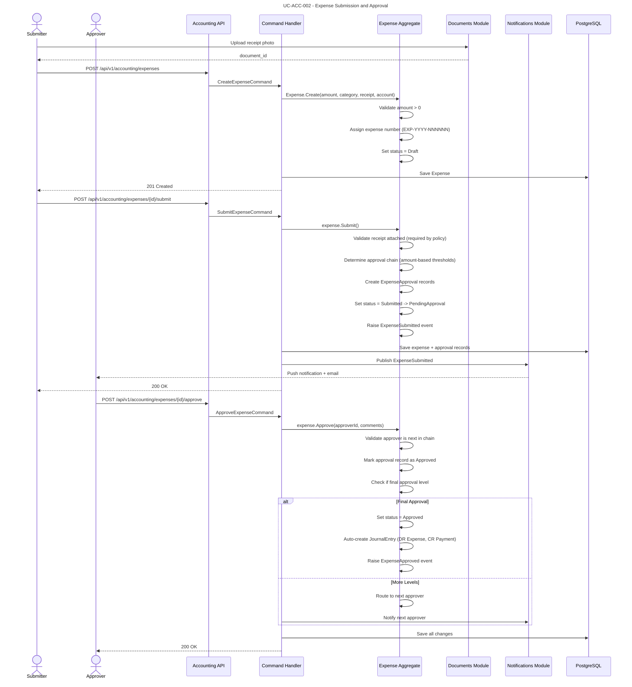
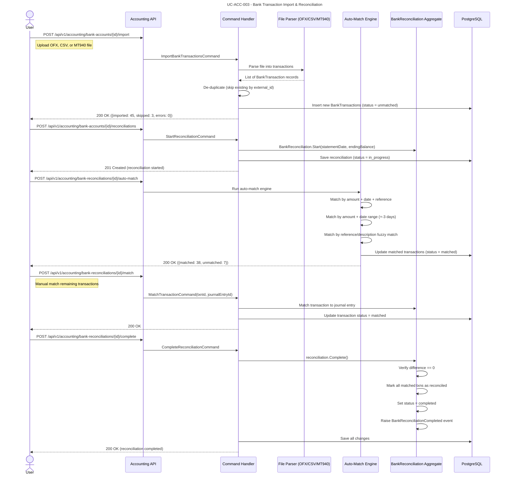
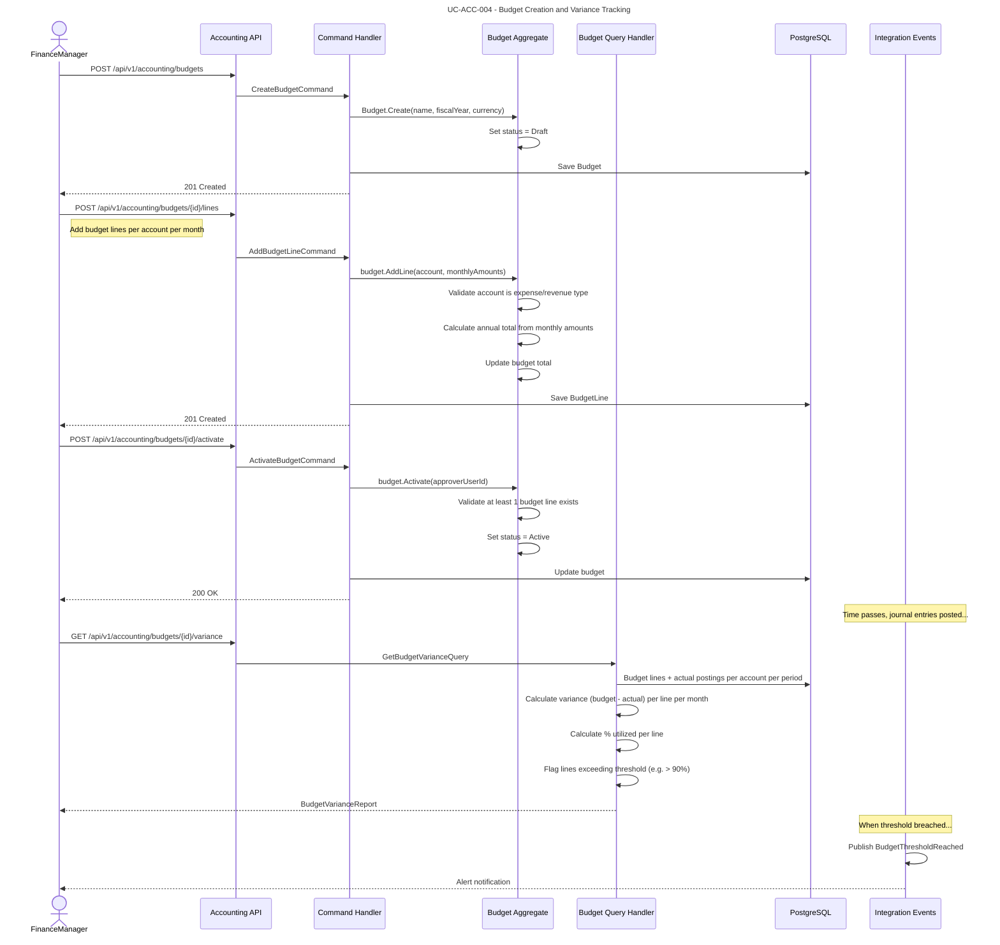
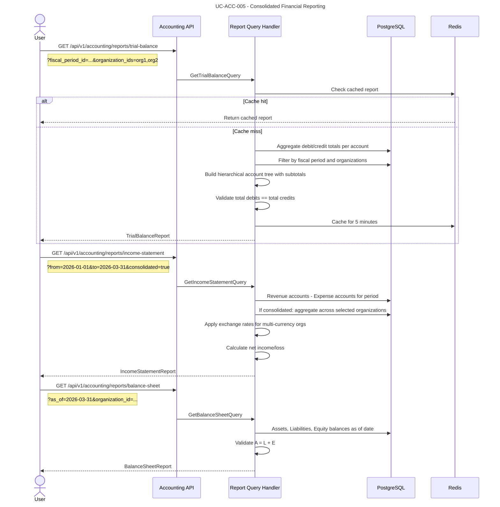
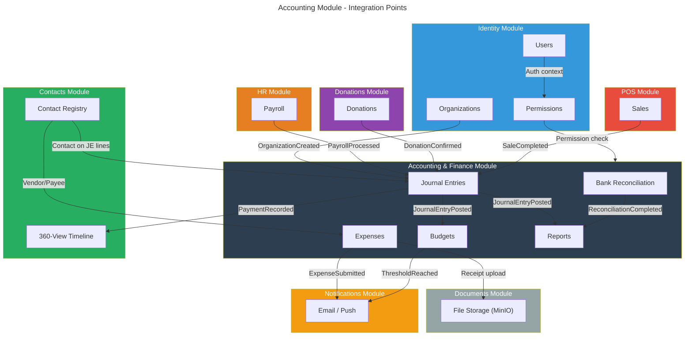

# Module: Accounting & Finance

## Overview

The Accounting module provides **enterprise-grade financial management** for Nexora. It implements full double-entry bookkeeping with organization-isolated ledgers, multi-currency support, and consolidated reporting across organizations. The module serves diverse organization types -- NGOs tracking donor fund allocation, schools managing tuition and payroll, and businesses handling invoicing and expense management.

Core capabilities:
- **Chart of Accounts** with hierarchical account structures per organization
- **Double-entry journal entries** with enforced debit/credit balance
- **Daily expense tracking** with photo receipt upload and multi-level approval workflows
- **Bank account management** with transaction import (OFX, CSV, MT940) and reconciliation
- **Budget tracking** with fiscal-year-aligned budget lines and variance analysis
- **Payroll payment tracking** integrated with HR module events
- **Multi-currency accounting** with automatic exchange rate application
- **Fiscal year and period management** with period-close controls
- **Consolidated financial reports** across multiple organizations within a tenant

### Dependencies

| Module | Relationship | Purpose |
|--------|-------------|---------|
| `identity` | **Required** | Tenant/org context, user resolution, RBAC permissions |
| `contacts` | **Required** | Vendor/payee contact resolution, contact 360-view financial summary |
| `hr` | Optional | Payroll payment events, employee expense policies |
| `documents` | Optional | Receipt/attachment storage via MinIO |
| `notifications` | Optional | Approval workflow notifications, budget threshold alerts |

---

## Domain Model

### Entities

```mermaid
---
title: Accounting Module - Entity Relationship Diagram
---
erDiagram
    FiscalYear ||--o{ FiscalPeriod : "divided into"
    FiscalYear {
        uuid id PK
        uuid organization_id FK
        string name "e.g. FY 2026"
        date start_date
        date end_date
        string status "active | closed | locked"
        timestamp created_at
        timestamp updated_at
    }

    FiscalPeriod {
        uuid id PK
        uuid fiscal_year_id FK
        string name "e.g. March 2026"
        int period_number
        date start_date
        date end_date
        string status "open | closed | locked"
        timestamp closed_at
        uuid closed_by_user_id FK
    }

    Currency ||--o{ ExchangeRate : "has rates"
    Currency {
        uuid id PK
        uuid tenant_id FK
        string code UK "ISO 4217: USD, EUR, TRY"
        string name
        string symbol
        int decimal_places
        boolean is_active
    }

    ExchangeRate {
        uuid id PK
        uuid source_currency_id FK
        uuid target_currency_id FK
        decimal rate
        date effective_date
        string source "manual | api | import"
        timestamp created_at
    }

    ChartOfAccount ||--o{ Account : "contains"
    ChartOfAccount {
        uuid id PK
        uuid organization_id FK
        string name
        string description
        boolean is_default
        boolean is_locked
        timestamp created_at
    }

    Account ||--o{ Account : "parent-child"
    Account ||--o{ JournalLine : "posted to"
    Account ||--o{ BudgetLine : "budgeted in"
    Account {
        uuid id PK
        uuid chart_of_account_id FK
        uuid parent_account_id FK "nullable, for hierarchy"
        string code UK "e.g. 1000, 1010, 6100"
        string name
        string account_type "asset | liability | equity | revenue | expense"
        string sub_type "current_asset | fixed_asset | accounts_payable | ..."
        string normal_balance "debit | credit"
        int level
        boolean is_header "true = grouping only, no posting"
        boolean is_active
        boolean is_system "true = cannot be deleted"
        uuid default_currency_id FK
        jsonb metadata
        timestamp created_at
        timestamp updated_at
    }

    TaxRate {
        uuid id PK
        uuid organization_id FK
        string name "e.g. VAT 18%, KDV 20%"
        string code UK
        decimal rate "0.18, 0.20"
        string tax_type "vat | sales_tax | withholding"
        uuid tax_payable_account_id FK
        uuid tax_receivable_account_id FK
        boolean is_active
        timestamp created_at
    }

    JournalEntry ||--|{ JournalLine : "must have 2+"
    JournalEntry {
        uuid id PK
        uuid organization_id FK
        uuid fiscal_period_id FK
        string entry_number UK "auto-generated, e.g. JE-2026-000142"
        date entry_date
        string description
        string reference "external ref, invoice #, etc."
        string source_module "accounting | hr | donations | pos"
        string source_document_id "FK to source entity"
        string status "draft | pending_approval | approved | posted | voided"
        uuid currency_id FK
        decimal exchange_rate "rate to org base currency"
        uuid created_by_user_id FK
        uuid approved_by_user_id FK
        timestamp approved_at
        uuid posted_by_user_id FK
        timestamp posted_at
        uuid voided_by_user_id FK
        timestamp voided_at
        string void_reason
        boolean is_reversing
        uuid reversed_entry_id FK "if this reverses another entry"
        timestamp created_at
        timestamp updated_at
    }

    JournalLine {
        uuid id PK
        uuid journal_entry_id FK
        uuid account_id FK
        int line_number
        string description
        decimal debit_amount "0 if credit line"
        decimal credit_amount "0 if debit line"
        decimal debit_amount_base "in org base currency"
        decimal credit_amount_base "in org base currency"
        uuid contact_id FK "optional: vendor, customer, donor"
        uuid department_id FK "optional: cost center"
        uuid tax_rate_id FK "optional"
        decimal tax_amount
        jsonb dimensions "custom tracking dimensions"
    }

    BankAccount ||--o{ BankTransaction : "has transactions"
    BankAccount ||--o{ BankReconciliation : "reconciled via"
    BankAccount {
        uuid id PK
        uuid organization_id FK
        uuid ledger_account_id FK "linked GL account"
        string name
        string bank_name
        string account_number
        string iban
        string swift_bic
        uuid currency_id FK
        decimal current_balance
        decimal ledger_balance
        date last_reconciled_date
        string status "active | inactive | closed"
        timestamp created_at
        timestamp updated_at
    }

    BankTransaction {
        uuid id PK
        uuid bank_account_id FK
        string transaction_id_external UK "from bank feed"
        date transaction_date
        date value_date
        string description
        string reference
        decimal amount "positive = deposit, negative = withdrawal"
        decimal running_balance
        string type "deposit | withdrawal | transfer | fee | interest"
        string category "auto-categorized or manual"
        string status "unmatched | matched | reconciled | excluded"
        uuid matched_journal_entry_id FK "nullable"
        string import_batch_id
        string import_source "ofx | csv | mt940 | manual"
        timestamp imported_at
        timestamp created_at
    }

    BankReconciliation ||--o{ BankTransaction : "includes"
    BankReconciliation {
        uuid id PK
        uuid bank_account_id FK
        uuid fiscal_period_id FK
        date statement_date
        decimal statement_ending_balance
        decimal reconciled_balance
        decimal difference
        string status "in_progress | completed | abandoned"
        uuid completed_by_user_id FK
        timestamp started_at
        timestamp completed_at
    }

    Expense ||--o{ ExpenseApproval : "requires approvals"
    Expense {
        uuid id PK
        uuid organization_id FK
        uuid fiscal_period_id FK
        string expense_number UK "auto: EXP-2026-000087"
        uuid submitted_by_user_id FK
        uuid contact_id FK "vendor/payee"
        uuid department_id FK
        date expense_date
        string description
        string category "travel | supplies | meals | utilities | payroll | other"
        uuid currency_id FK
        decimal amount
        decimal amount_base "in org base currency"
        decimal exchange_rate
        uuid tax_rate_id FK
        decimal tax_amount
        decimal total_amount "amount + tax"
        string receipt_document_id "MinIO object key"
        string receipt_url
        uuid account_id FK "expense account to debit"
        uuid payment_account_id FK "cash/bank account to credit"
        string status "draft | submitted | pending_approval | approved | rejected | paid | voided"
        string rejection_reason
        uuid journal_entry_id FK "created on posting"
        jsonb metadata
        timestamp submitted_at
        timestamp paid_at
        timestamp created_at
        timestamp updated_at
    }

    ExpenseApproval {
        uuid id PK
        uuid expense_id FK
        uuid approver_user_id FK
        int approval_order "1, 2, 3 for multi-level"
        string status "pending | approved | rejected | skipped"
        string comments
        timestamp decided_at
    }

    Budget ||--|{ BudgetLine : "has lines"
    Budget {
        uuid id PK
        uuid organization_id FK
        uuid fiscal_year_id FK
        string name
        string description
        string status "draft | active | closed | archived"
        uuid currency_id FK
        decimal total_amount
        uuid created_by_user_id FK
        uuid approved_by_user_id FK
        timestamp approved_at
        timestamp created_at
        timestamp updated_at
    }

    BudgetLine {
        uuid id PK
        uuid budget_id FK
        uuid account_id FK
        uuid department_id FK "optional"
        decimal annual_amount
        decimal jan_amount
        decimal feb_amount
        decimal mar_amount
        decimal apr_amount
        decimal may_amount
        decimal jun_amount
        decimal jul_amount
        decimal aug_amount
        decimal sep_amount
        decimal oct_amount
        decimal nov_amount
        decimal dec_amount
        string notes
    }
```



### Value Objects

| Value Object | Description |
|-------------|-------------|
| `AccountId` | Strongly-typed account identifier |
| `ChartOfAccountId` | Strongly-typed chart of accounts identifier |
| `JournalEntryId` | Strongly-typed journal entry identifier |
| `JournalLineId` | Strongly-typed journal line identifier |
| `BankAccountId` | Strongly-typed bank account identifier |
| `BankTransactionId` | Strongly-typed bank transaction identifier |
| `BankReconciliationId` | Strongly-typed bank reconciliation identifier |
| `ExpenseId` | Strongly-typed expense identifier |
| `BudgetId` | Strongly-typed budget identifier |
| `FiscalYearId` | Strongly-typed fiscal year identifier |
| `FiscalPeriodId` | Strongly-typed fiscal period identifier |
| `CurrencyId` | Strongly-typed currency identifier |
| `TaxRateId` | Strongly-typed tax rate identifier |
| `Money` | Amount + currency code pair; supports arithmetic with currency validation |
| `AccountCode` | Validated account code string (numeric, hierarchical: `1000`, `1010`) |
| `EntryNumber` | Auto-generated sequential entry number per organization per year |
| `ExpenseNumber` | Auto-generated sequential expense number per organization per year |
| `ExchangeRateValue` | Positive decimal with source and effective date |

### Domain Events

| Event | Trigger | Consumers |
|-------|---------|-----------|
| `JournalEntryPosted` | Entry status -> Posted | Budget (update actuals), Reporting (refresh), Audit |
| `JournalEntryVoided` | Entry status -> Voided | Budget (reverse actuals), Reporting (refresh), Audit |
| `ExpenseSubmitted` | Expense submitted for approval | Notifications (notify approvers) |
| `ExpenseApproved` | Final approval granted | Accounting (auto-create journal entry), Notifications (notify submitter) |
| `ExpenseRejected` | Any approver rejects | Notifications (notify submitter with reason) |
| `ExpensePaid` | Payment recorded | BankAccount (update balance), Audit |
| `BankReconciliationCompleted` | Reconciliation finalized | Reporting (refresh), Audit |
| `BudgetThresholdReached` | Actuals exceed % of budget line | Notifications (alert budget owners) |
| `FiscalPeriodClosed` | Period status -> Closed | Reporting (generate period-end reports), Audit |
| `FiscalYearClosed` | Year status -> Closed | Reporting (generate year-end reports), Audit |
| `ExchangeRateUpdated` | New rate recorded | Unrealized gain/loss recalculation |

---

## Entity Lifecycles

### Journal Entry Lifecycle



### Expense Approval Workflow



### Fiscal Period Lifecycle



---

## Use Cases

### UC-ACC-001: Create and Post Journal Entry

- **Actor**: User with `accounting.journal_entries.create` permission
- **Preconditions**: Active fiscal period exists, chart of accounts configured
- **Flow**:



- **Business Rules**:
  - Total debits MUST equal total credits (enforced in domain)
  - Minimum 2 journal lines required
  - Cannot post to header/grouping accounts (`is_header = true`)
  - Cannot post to inactive accounts
  - Cannot post to a closed or locked fiscal period
  - Entry number auto-generated, sequential per organization per fiscal year
  - Multi-currency entries: line amounts recorded in transaction currency AND base currency
  - Once posted, entry is immutable -- corrections require a reversing entry
- **Exceptions**:
  - Unbalanced entry: return `lockey_accounting_journal_entry_unbalanced`
  - Closed period: return `lockey_accounting_fiscal_period_closed`
  - Inactive account: return `lockey_accounting_account_inactive`

---

### UC-ACC-002: Submit and Approve Expense

- **Actor**: Any authenticated user (submit), User with `accounting.expenses.approve` (approve)
- **Preconditions**: Expense policy configured for organization, approval chain defined
- **Flow**:



- **Business Rules**:
  - Receipt photo required for expenses above configurable threshold (default: any amount)
  - Approval chain determined by: amount thresholds, department, expense category
  - Example thresholds: < $100 = manager only, $100-$1000 = manager + finance, > $1000 = manager + finance + director
  - Submitter cannot approve their own expense
  - Any rejection in the chain rejects the entire expense
  - Approved expenses auto-generate a journal entry (Debit: expense account, Credit: payment account)
  - Expenses track both transaction currency and base currency amounts
- **Exceptions**:
  - Missing receipt: `lockey_accounting_expense_receipt_required`
  - Self-approval: `lockey_accounting_expense_self_approval_forbidden`
  - Already decided: `lockey_accounting_expense_already_decided`

---

### UC-ACC-003: Import and Reconcile Bank Transactions

- **Actor**: User with `accounting.bank_accounts.reconcile` permission
- **Preconditions**: Bank account linked to a GL account, transactions imported
- **Flow**:



- **Business Rules**:
  - Supported import formats: OFX (Open Financial Exchange), CSV (configurable mapping), MT940 (SWIFT)
  - De-duplication by `transaction_id_external` to prevent double-imports
  - Auto-match engine uses multi-pass strategy: exact match, fuzzy match, rule-based match
  - Reconciliation difference (statement balance - reconciled balance) must be zero to complete
  - Unmatched transactions can be: manually matched, excluded, or used to create new journal entries
  - Completed reconciliations are immutable
  - Bank account `current_balance` updated from imported transactions
  - Bank account `ledger_balance` computed from linked GL account
- **Exceptions**:
  - Unsupported format: `lockey_accounting_bank_import_unsupported_format`
  - Non-zero difference: `lockey_accounting_reconciliation_difference_not_zero`
  - Already completed: `lockey_accounting_reconciliation_already_completed`

---

### UC-ACC-004: Manage Budget and Track Variance

- **Actor**: User with `accounting.budgets.manage` permission
- **Preconditions**: Fiscal year exists, chart of accounts configured
- **Flow**:



- **Business Rules**:
  - Only one active budget per fiscal year per organization (multiple drafts allowed)
  - Budget lines reference expense or revenue accounts only
  - Monthly amounts must be non-negative
  - Variance = Budget Amount - Actual Amount (positive = under budget, negative = over budget)
  - Configurable alert thresholds: 75%, 90%, 100% of budget line utilized
  - Budget vs. Actual report available at any time for active budgets
  - Budget amounts are in the organization's base currency
  - Closing a budget archives it and freezes all variance data
- **Exceptions**:
  - Duplicate active budget: `lockey_accounting_budget_duplicate_active`
  - No budget lines: `lockey_accounting_budget_no_lines`
  - Invalid account type: `lockey_accounting_budget_invalid_account_type`

---

### UC-ACC-005: Generate Consolidated Financial Reports

- **Actor**: User with `accounting.reports.read` permission
- **Preconditions**: Posted journal entries exist
- **Flow**:



- **Business Rules**:
  - Trial Balance: sum of all debit balances must equal sum of all credit balances
  - Income Statement: Revenue - Expenses = Net Income for a date range
  - Balance Sheet: Assets = Liabilities + Equity as of a specific date
  - Consolidated reports aggregate across multiple organizations with currency conversion
  - Exchange rates applied using the rate effective on the reporting date
  - Reports only include posted journal entries (not draft or voided)
  - Reports cacheable with short TTL (invalidated on new postings)
  - Export formats: PDF, Excel, CSV

---

## API Endpoints

### Chart of Accounts
| Method | Path | Description | Auth |
|--------|------|-------------|------|
| POST | `/api/v1/accounting/charts-of-accounts` | Create chart of accounts | `accounting.charts.create` |
| GET | `/api/v1/accounting/charts-of-accounts` | List charts | `accounting.charts.read` |
| GET | `/api/v1/accounting/charts-of-accounts/{id}` | Get chart with accounts | `accounting.charts.read` |
| PUT | `/api/v1/accounting/charts-of-accounts/{id}` | Update chart metadata | `accounting.charts.update` |

### Accounts
| Method | Path | Description | Auth |
|--------|------|-------------|------|
| POST | `/api/v1/accounting/accounts` | Create account | `accounting.accounts.create` |
| GET | `/api/v1/accounting/accounts` | List accounts (flat or tree) | `accounting.accounts.read` |
| GET | `/api/v1/accounting/accounts/{id}` | Get account details | `accounting.accounts.read` |
| PUT | `/api/v1/accounting/accounts/{id}` | Update account | `accounting.accounts.update` |
| DELETE | `/api/v1/accounting/accounts/{id}` | Deactivate account | `accounting.accounts.delete` |
| GET | `/api/v1/accounting/accounts/{id}/transactions` | List posted transactions | `accounting.accounts.read` |
| GET | `/api/v1/accounting/accounts/{id}/balance` | Get current balance | `accounting.accounts.read` |

### Journal Entries
| Method | Path | Description | Auth |
|--------|------|-------------|------|
| POST | `/api/v1/accounting/journal-entries` | Create journal entry | `accounting.journal_entries.create` |
| GET | `/api/v1/accounting/journal-entries` | List/search entries | `accounting.journal_entries.read` |
| GET | `/api/v1/accounting/journal-entries/{id}` | Get entry with lines | `accounting.journal_entries.read` |
| PUT | `/api/v1/accounting/journal-entries/{id}` | Update draft entry | `accounting.journal_entries.update` |
| DELETE | `/api/v1/accounting/journal-entries/{id}` | Delete draft entry | `accounting.journal_entries.delete` |
| POST | `/api/v1/accounting/journal-entries/{id}/submit` | Submit for approval | `accounting.journal_entries.create` |
| POST | `/api/v1/accounting/journal-entries/{id}/approve` | Approve entry | `accounting.journal_entries.approve` |
| POST | `/api/v1/accounting/journal-entries/{id}/post` | Post to ledger | `accounting.journal_entries.post` |
| POST | `/api/v1/accounting/journal-entries/{id}/void` | Void posted entry | `accounting.journal_entries.void` |

### Bank Accounts
| Method | Path | Description | Auth |
|--------|------|-------------|------|
| POST | `/api/v1/accounting/bank-accounts` | Create bank account | `accounting.bank_accounts.create` |
| GET | `/api/v1/accounting/bank-accounts` | List bank accounts | `accounting.bank_accounts.read` |
| GET | `/api/v1/accounting/bank-accounts/{id}` | Get bank account | `accounting.bank_accounts.read` |
| PUT | `/api/v1/accounting/bank-accounts/{id}` | Update bank account | `accounting.bank_accounts.update` |
| POST | `/api/v1/accounting/bank-accounts/{id}/import` | Import transactions (file upload) | `accounting.bank_accounts.import` |
| GET | `/api/v1/accounting/bank-accounts/{id}/transactions` | List bank transactions | `accounting.bank_accounts.read` |

### Bank Reconciliation
| Method | Path | Description | Auth |
|--------|------|-------------|------|
| POST | `/api/v1/accounting/bank-accounts/{id}/reconciliations` | Start reconciliation | `accounting.bank_accounts.reconcile` |
| GET | `/api/v1/accounting/bank-reconciliations/{id}` | Get reconciliation status | `accounting.bank_accounts.reconcile` |
| POST | `/api/v1/accounting/bank-reconciliations/{id}/auto-match` | Run auto-match engine | `accounting.bank_accounts.reconcile` |
| POST | `/api/v1/accounting/bank-reconciliations/{id}/match` | Manual match transaction | `accounting.bank_accounts.reconcile` |
| POST | `/api/v1/accounting/bank-reconciliations/{id}/unmatch` | Unmatch transaction | `accounting.bank_accounts.reconcile` |
| POST | `/api/v1/accounting/bank-reconciliations/{id}/exclude` | Exclude transaction | `accounting.bank_accounts.reconcile` |
| POST | `/api/v1/accounting/bank-reconciliations/{id}/create-entry` | Create JE from unmatched txn | `accounting.bank_accounts.reconcile` |
| POST | `/api/v1/accounting/bank-reconciliations/{id}/complete` | Complete reconciliation | `accounting.bank_accounts.reconcile` |
| POST | `/api/v1/accounting/bank-reconciliations/{id}/abandon` | Abandon reconciliation | `accounting.bank_accounts.reconcile` |

### Expenses
| Method | Path | Description | Auth |
|--------|------|-------------|------|
| POST | `/api/v1/accounting/expenses` | Create expense | `accounting.expenses.create` |
| GET | `/api/v1/accounting/expenses` | List/filter expenses | `accounting.expenses.read` |
| GET | `/api/v1/accounting/expenses/{id}` | Get expense details | `accounting.expenses.read` |
| PUT | `/api/v1/accounting/expenses/{id}` | Update draft expense | `accounting.expenses.update` |
| DELETE | `/api/v1/accounting/expenses/{id}` | Delete draft expense | `accounting.expenses.delete` |
| POST | `/api/v1/accounting/expenses/{id}/submit` | Submit for approval | `accounting.expenses.create` |
| POST | `/api/v1/accounting/expenses/{id}/approve` | Approve expense | `accounting.expenses.approve` |
| POST | `/api/v1/accounting/expenses/{id}/reject` | Reject expense | `accounting.expenses.approve` |
| POST | `/api/v1/accounting/expenses/{id}/pay` | Record payment | `accounting.expenses.pay` |
| POST | `/api/v1/accounting/expenses/{id}/void` | Void expense | `accounting.expenses.void` |
| GET | `/api/v1/accounting/expenses/my` | List current user's expenses | Authenticated |

### Budgets
| Method | Path | Description | Auth |
|--------|------|-------------|------|
| POST | `/api/v1/accounting/budgets` | Create budget | `accounting.budgets.create` |
| GET | `/api/v1/accounting/budgets` | List budgets | `accounting.budgets.read` |
| GET | `/api/v1/accounting/budgets/{id}` | Get budget with lines | `accounting.budgets.read` |
| PUT | `/api/v1/accounting/budgets/{id}` | Update draft budget | `accounting.budgets.update` |
| DELETE | `/api/v1/accounting/budgets/{id}` | Delete draft budget | `accounting.budgets.delete` |
| POST | `/api/v1/accounting/budgets/{id}/lines` | Add budget line | `accounting.budgets.update` |
| PUT | `/api/v1/accounting/budgets/{id}/lines/{lineId}` | Update budget line | `accounting.budgets.update` |
| DELETE | `/api/v1/accounting/budgets/{id}/lines/{lineId}` | Remove budget line | `accounting.budgets.update` |
| POST | `/api/v1/accounting/budgets/{id}/activate` | Activate budget | `accounting.budgets.approve` |
| POST | `/api/v1/accounting/budgets/{id}/close` | Close budget | `accounting.budgets.approve` |
| GET | `/api/v1/accounting/budgets/{id}/variance` | Get variance report | `accounting.budgets.read` |

### Fiscal Year & Period
| Method | Path | Description | Auth |
|--------|------|-------------|------|
| POST | `/api/v1/accounting/fiscal-years` | Create fiscal year | `accounting.fiscal_years.create` |
| GET | `/api/v1/accounting/fiscal-years` | List fiscal years | `accounting.fiscal_years.read` |
| GET | `/api/v1/accounting/fiscal-years/{id}` | Get with periods | `accounting.fiscal_years.read` |
| PUT | `/api/v1/accounting/fiscal-years/{id}` | Update fiscal year | `accounting.fiscal_years.update` |
| POST | `/api/v1/accounting/fiscal-years/{id}/close` | Close fiscal year | `accounting.fiscal_years.close` |
| POST | `/api/v1/accounting/fiscal-periods/{id}/close` | Close period | `accounting.fiscal_periods.close` |
| POST | `/api/v1/accounting/fiscal-periods/{id}/reopen` | Reopen period | `accounting.fiscal_periods.close` |
| POST | `/api/v1/accounting/fiscal-periods/{id}/lock` | Lock period permanently | `accounting.fiscal_periods.lock` |

### Currencies & Exchange Rates
| Method | Path | Description | Auth |
|--------|------|-------------|------|
| POST | `/api/v1/accounting/currencies` | Add currency | `accounting.currencies.manage` |
| GET | `/api/v1/accounting/currencies` | List currencies | `accounting.currencies.read` |
| PUT | `/api/v1/accounting/currencies/{id}` | Update currency | `accounting.currencies.manage` |
| POST | `/api/v1/accounting/exchange-rates` | Record exchange rate | `accounting.exchange_rates.manage` |
| GET | `/api/v1/accounting/exchange-rates` | List rates (filter by date/currency) | `accounting.exchange_rates.read` |
| POST | `/api/v1/accounting/exchange-rates/import` | Bulk import rates | `accounting.exchange_rates.manage` |

### Tax Rates
| Method | Path | Description | Auth |
|--------|------|-------------|------|
| POST | `/api/v1/accounting/tax-rates` | Create tax rate | `accounting.tax_rates.manage` |
| GET | `/api/v1/accounting/tax-rates` | List tax rates | `accounting.tax_rates.read` |
| PUT | `/api/v1/accounting/tax-rates/{id}` | Update tax rate | `accounting.tax_rates.manage` |
| DELETE | `/api/v1/accounting/tax-rates/{id}` | Deactivate tax rate | `accounting.tax_rates.manage` |

### Financial Reports
| Method | Path | Description | Auth |
|--------|------|-------------|------|
| GET | `/api/v1/accounting/reports/trial-balance` | Trial balance report | `accounting.reports.read` |
| GET | `/api/v1/accounting/reports/income-statement` | Income statement (P&L) | `accounting.reports.read` |
| GET | `/api/v1/accounting/reports/balance-sheet` | Balance sheet | `accounting.reports.read` |
| GET | `/api/v1/accounting/reports/cash-flow` | Cash flow statement | `accounting.reports.read` |
| GET | `/api/v1/accounting/reports/general-ledger` | General ledger report | `accounting.reports.read` |
| GET | `/api/v1/accounting/reports/account-statement` | Account statement | `accounting.reports.read` |
| GET | `/api/v1/accounting/reports/expense-summary` | Expense summary by category/dept | `accounting.reports.read` |
| GET | `/api/v1/accounting/reports/budget-vs-actual` | Budget vs actual comparison | `accounting.reports.read` |
| GET | `/api/v1/accounting/reports/aged-payables` | Aged payables report | `accounting.reports.read` |
| GET | `/api/v1/accounting/reports/aged-receivables` | Aged receivables report | `accounting.reports.read` |
| POST | `/api/v1/accounting/reports/export` | Export report (PDF/Excel/CSV) | `accounting.reports.export` |
| GET | `/api/v1/accounting/reports/consolidated` | Consolidated multi-org report | `accounting.reports.consolidated` |

---

## Integration Events

### Events Published

| Event | Topic | Payload | Description |
|-------|-------|---------|-------------|
| `accounting.journal_entry.posted` | `nexora.accounting.journal-entries` | `{ entryId, organizationId, entryNumber, date, totalAmount, currencyCode, lines[] }` | Journal entry posted to ledger |
| `accounting.journal_entry.voided` | `nexora.accounting.journal-entries` | `{ entryId, organizationId, entryNumber, voidReason, reversingEntryId }` | Posted entry voided |
| `accounting.expense.submitted` | `nexora.accounting.expenses` | `{ expenseId, organizationId, submitterId, amount, category, approvers[] }` | Expense submitted for approval |
| `accounting.expense.approved` | `nexora.accounting.expenses` | `{ expenseId, organizationId, amount, journalEntryId }` | Expense fully approved |
| `accounting.expense.rejected` | `nexora.accounting.expenses` | `{ expenseId, organizationId, rejectedBy, reason }` | Expense rejected |
| `accounting.expense.paid` | `nexora.accounting.expenses` | `{ expenseId, organizationId, amount, paymentDate, bankAccountId }` | Expense payment recorded |
| `accounting.bank_reconciliation.completed` | `nexora.accounting.bank` | `{ reconciliationId, bankAccountId, statementDate, reconciledBalance }` | Bank reconciliation completed |
| `accounting.budget.threshold_reached` | `nexora.accounting.budgets` | `{ budgetId, budgetLineId, accountId, threshold, utilized, budgetAmount, actualAmount }` | Budget threshold exceeded |
| `accounting.fiscal_period.closed` | `nexora.accounting.fiscal` | `{ fiscalPeriodId, fiscalYearId, organizationId, periodName }` | Fiscal period closed |
| `accounting.fiscal_year.closed` | `nexora.accounting.fiscal` | `{ fiscalYearId, organizationId, yearName }` | Fiscal year closed |
| `accounting.payment.recorded` | `nexora.accounting.payments` | `{ paymentId, contactId, amount, currencyCode, reference }` | Generic payment recorded (for contact 360-view) |

### Events Consumed

| Event | Source Module | Action |
|-------|-------------|--------|
| `identity.organization.created` | Identity | Create default chart of accounts, default fiscal year, seed base currencies (USD, EUR, TRY) |
| `identity.module.installed` | Identity | Run accounting module initialization: seed system accounts, create sample chart |
| `hr.payroll.processed` | HR | Auto-create journal entry for payroll (DR Salary Expense, CR Bank/Cash) |
| `hr.payroll.payment_completed` | HR | Record payroll payment, update bank balance, create expense record |
| `donations.donation.confirmed` | Donations | Auto-create journal entry (DR Bank/Cash, CR Donation Revenue) |
| `pos.sale.completed` | POS | Auto-create journal entry (DR Cash/Bank, CR Sales Revenue; DR COGS, CR Inventory) |
| `contacts.contact.merged` | Contacts | Update all `contact_id` references in expenses and journal lines |
| `subscription.invoice.paid` | Subscription | Auto-create journal entry for subscription revenue |

---

## Database Schema

All tables are prefixed with `accounting_` and reside in the tenant schema.

| Table | Description |
|-------|-------------|
| `accounting_fiscal_years` | Fiscal year definitions |
| `accounting_fiscal_periods` | Monthly/quarterly periods within fiscal years |
| `accounting_currencies` | Supported currencies |
| `accounting_exchange_rates` | Historical exchange rates |
| `accounting_charts_of_accounts` | Chart of accounts containers |
| `accounting_accounts` | Individual GL accounts (hierarchical) |
| `accounting_tax_rates` | Tax rate definitions |
| `accounting_journal_entries` | Journal entry headers |
| `accounting_journal_lines` | Individual debit/credit lines |
| `accounting_bank_accounts` | Bank account registrations |
| `accounting_bank_transactions` | Imported bank transactions |
| `accounting_bank_reconciliations` | Reconciliation sessions |
| `accounting_expenses` | Expense records |
| `accounting_expense_approvals` | Approval chain records |
| `accounting_budgets` | Budget headers |
| `accounting_budget_lines` | Monthly budget allocations per account |

### Key Indexes

| Table | Index | Purpose |
|-------|-------|---------|
| `accounting_accounts` | `ix_accounts_chart_code` on `(chart_of_account_id, code)` | Unique account code per chart |
| `accounting_accounts` | `ix_accounts_parent` on `(parent_account_id)` | Hierarchy traversal |
| `accounting_journal_entries` | `ix_journal_entries_org_date` on `(organization_id, entry_date)` | Date-range queries |
| `accounting_journal_entries` | `ix_journal_entries_period` on `(fiscal_period_id, status)` | Period reporting |
| `accounting_journal_entries` | `ix_journal_entries_source` on `(source_module, source_document_id)` | Cross-module lookups |
| `accounting_journal_lines` | `ix_journal_lines_account` on `(account_id)` | Account ledger queries |
| `accounting_journal_lines` | `ix_journal_lines_contact` on `(contact_id)` | Contact 360-view |
| `accounting_bank_transactions` | `ix_bank_txns_external_id` on `(transaction_id_external)` | De-duplication |
| `accounting_bank_transactions` | `ix_bank_txns_status` on `(bank_account_id, status)` | Reconciliation queries |
| `accounting_expenses` | `ix_expenses_org_status` on `(organization_id, status)` | Dashboard queries |
| `accounting_expenses` | `ix_expenses_submitter` on `(submitted_by_user_id, status)` | My expenses view |
| `accounting_budget_lines` | `ix_budget_lines_account` on `(account_id)` | Budget vs. actual joins |

---

## Cross-Module Integration Diagram



---

## Localization Keys

All user-facing messages follow the `lockey_` convention. Key prefixes for this module:

| Prefix | Scope |
|--------|-------|
| `lockey_accounting_journal_*` | Journal entry messages |
| `lockey_accounting_expense_*` | Expense messages |
| `lockey_accounting_bank_*` | Bank account/reconciliation messages |
| `lockey_accounting_budget_*` | Budget messages |
| `lockey_accounting_fiscal_*` | Fiscal year/period messages |
| `lockey_accounting_account_*` | Account/chart messages |
| `lockey_accounting_report_*` | Report messages |
| `lockey_accounting_currency_*` | Currency/exchange rate messages |
| `lockey_accounting_tax_*` | Tax rate messages |
| `lockey_accounting_validation_*` | Validation error messages |

### Sample Keys

```
lockey_accounting_journal_entry_unbalanced
lockey_accounting_journal_entry_posted_success
lockey_accounting_journal_entry_voided_success
lockey_accounting_journal_entry_period_closed
lockey_accounting_expense_submitted_success
lockey_accounting_expense_approved_success
lockey_accounting_expense_rejected
lockey_accounting_expense_receipt_required
lockey_accounting_expense_self_approval_forbidden
lockey_accounting_expense_already_decided
lockey_accounting_bank_import_success
lockey_accounting_bank_import_unsupported_format
lockey_accounting_reconciliation_completed_success
lockey_accounting_reconciliation_difference_not_zero
lockey_accounting_reconciliation_already_completed
lockey_accounting_budget_activated_success
lockey_accounting_budget_duplicate_active
lockey_accounting_budget_no_lines
lockey_accounting_budget_invalid_account_type
lockey_accounting_budget_threshold_warning
lockey_accounting_fiscal_period_closed
lockey_accounting_fiscal_period_reopened
lockey_accounting_fiscal_period_locked
lockey_accounting_fiscal_year_closed
lockey_accounting_account_inactive
lockey_accounting_account_has_transactions
lockey_accounting_currency_already_exists
lockey_accounting_validation_required
lockey_accounting_validation_amount_positive
lockey_accounting_validation_date_in_fiscal_period
```

---

## Permissions

All permissions follow the `accounting.{resource}.{action}` pattern:

| Permission | Description |
|-----------|-------------|
| `accounting.charts.create` | Create chart of accounts |
| `accounting.charts.read` | View charts of accounts |
| `accounting.charts.update` | Modify chart of accounts |
| `accounting.accounts.create` | Create GL accounts |
| `accounting.accounts.read` | View accounts and balances |
| `accounting.accounts.update` | Modify accounts |
| `accounting.accounts.delete` | Deactivate accounts |
| `accounting.journal_entries.create` | Create journal entries |
| `accounting.journal_entries.read` | View journal entries |
| `accounting.journal_entries.update` | Edit draft journal entries |
| `accounting.journal_entries.delete` | Delete draft journal entries |
| `accounting.journal_entries.approve` | Approve journal entries |
| `accounting.journal_entries.post` | Post entries to ledger |
| `accounting.journal_entries.void` | Void posted entries |
| `accounting.bank_accounts.create` | Create bank accounts |
| `accounting.bank_accounts.read` | View bank accounts |
| `accounting.bank_accounts.update` | Modify bank accounts |
| `accounting.bank_accounts.import` | Import bank transactions |
| `accounting.bank_accounts.reconcile` | Perform reconciliation |
| `accounting.expenses.create` | Create/submit expenses |
| `accounting.expenses.read` | View all expenses |
| `accounting.expenses.update` | Edit draft expenses |
| `accounting.expenses.delete` | Delete draft expenses |
| `accounting.expenses.approve` | Approve/reject expenses |
| `accounting.expenses.pay` | Record expense payments |
| `accounting.expenses.void` | Void expenses |
| `accounting.budgets.create` | Create budgets |
| `accounting.budgets.read` | View budgets and variance |
| `accounting.budgets.update` | Edit draft budgets |
| `accounting.budgets.delete` | Delete draft budgets |
| `accounting.budgets.approve` | Activate/close budgets |
| `accounting.fiscal_years.create` | Create fiscal years |
| `accounting.fiscal_years.read` | View fiscal years |
| `accounting.fiscal_years.update` | Modify fiscal years |
| `accounting.fiscal_years.close` | Close fiscal years |
| `accounting.fiscal_periods.close` | Close/reopen periods |
| `accounting.fiscal_periods.lock` | Permanently lock periods |
| `accounting.currencies.read` | View currencies |
| `accounting.currencies.manage` | Add/update currencies |
| `accounting.exchange_rates.read` | View exchange rates |
| `accounting.exchange_rates.manage` | Record exchange rates |
| `accounting.tax_rates.read` | View tax rates |
| `accounting.tax_rates.manage` | Create/update tax rates |
| `accounting.reports.read` | View financial reports |
| `accounting.reports.export` | Export reports |
| `accounting.reports.consolidated` | Access consolidated reports |

---

## Non-Functional Requirements

| Requirement | Target | Notes |
|------------|--------|-------|
| Journal entry posting latency | < 200ms | Including balance validation and account updates |
| Report generation (single org) | < 2s | Trial balance, income statement, balance sheet |
| Report generation (consolidated, 10 orgs) | < 10s | Multi-org with currency conversion |
| Bank import throughput | 5,000 transactions/minute | Bulk import with de-duplication |
| Auto-match engine latency | < 5s per 1,000 transactions | Multi-pass matching algorithm |
| Expense approval notification | < 30s from submission | Via notifications module |
| Max accounts per chart | 10,000 | Hierarchical with up to 10 levels |
| Max journal lines per entry | 500 | For complex payroll or allocation entries |
| Max budget lines per budget | 2,000 | One per account per department |
| Audit trail retention | 7 years minimum | Financial regulatory compliance |
| Report cache TTL | 5 minutes | Invalidated on new postings |
| Concurrent reconciliation sessions | 1 per bank account | Prevent conflicts |
| Exchange rate history | Indefinite | Never purged |
| Data isolation | Strict | Organization-level isolation within tenant schema |
| Double-entry integrity | 100% | Every posted entry must balance; DB constraint + domain validation |
| Backup recovery RPO | < 1 hour | Financial data criticality |
| Backup recovery RTO | < 4 hours | Financial data criticality |
| API rate limiting | 100 req/s per tenant | Prevent report generation abuse |
| Export file size limit | 50 MB | PDF/Excel/CSV exports |
| Receipt upload size limit | 10 MB per file | JPEG, PNG, PDF accepted |
| Multi-currency precision | 6 decimal places | Exchange rate precision |
| Monetary precision | 2-4 decimal places | Based on currency definition |
