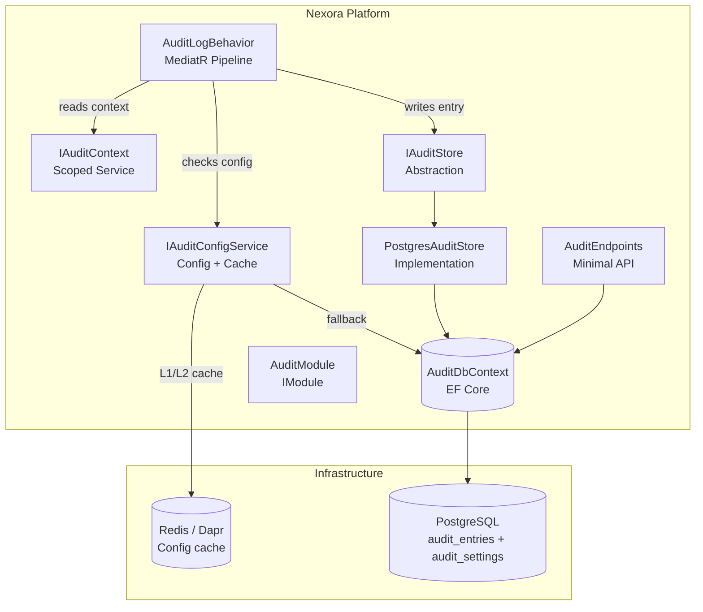
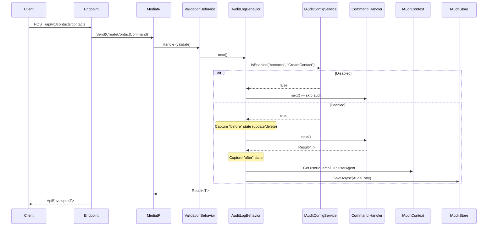
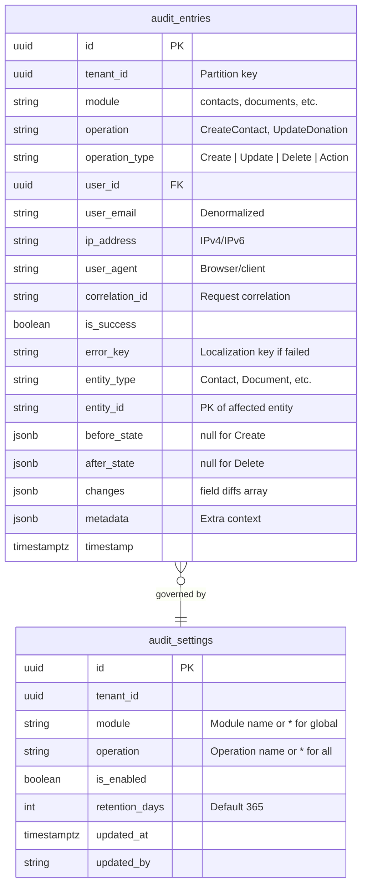

# Audit Log Module — Technical Specification

> **Status**: Planned (Phase 1.5)
> **Module Name**: `audit`
> **Tier**: Core/Platform (always installed)
> **Dependencies**: `identity`

## 1. Overview

Comprehensive, configurable audit logging system for all Nexora modules. Captures who did what, when, from where, and whether it succeeded — with full before/after entity change tracking.

### Goals

- Standalone top-level module (not nested under Identity)
- Configurable per module and per operation (toggle on/off)
- Role-based settings access (`audit.settings.manage`)
- Rich audit entries: user, IP, user agent, correlation ID, entity changes, success/failure
- PostgreSQL JSONB storage with table partitioning for retention management

## 2. Architecture

### 2.1 C4 Component Diagram



### 2.2 Audit Capture Flow



### 2.3 Pipeline Position

```
ValidationBehavior → LoggingBehavior → AuditLogBehavior → Handler
```

Audit runs after validation (no point auditing invalid requests) and after logging (observability first).

## 3. Data Model

### 3.1 Entity Relationship Diagram



### 3.2 Changes JSONB Structure

```json
[
  { "field": "Email", "old": "john@old.com", "new": "john@new.com" },
  { "field": "Status", "old": "Active", "new": "Suspended" }
]
```

### 3.3 Settings Resolution Order

1. **Operation level**: `module=contacts, operation=CreateContact` — most specific
2. **Module level**: `module=contacts, operation=*` — all operations in module
3. **Global default**: `module=*, operation=*` — platform-wide

If no setting exists → auditing is **enabled by default** (secure by default).

## 4. Storage Decision

**PostgreSQL JSONB with table partitioning** (monthly by `timestamp`).

| Criteria | Decision |
|----------|----------|
| Infrastructure overhead | Zero — already running PostgreSQL 17 |
| Multi-tenancy | Schema-per-tenant (existing pattern) |
| Schema flexibility | JSONB columns for before/after/changes/metadata |
| Query patterns | SQL + GIN indexes on JSONB |
| Retention | Declarative range partitioning — drop old partitions O(1) |
| Escape hatch | `IAuditStore` abstraction allows swapping to Elasticsearch later |

## 5. Module Structure

```
src/Modules/Nexora.Modules.Audit/
├── Domain/
│   ├── Entities/
│   │   ├── AuditEntry.cs
│   │   └── AuditSetting.cs
│   └── ValueObjects/
│       ├── AuditIds.cs
│       └── OperationType.cs
├── Application/
│   ├── Commands/
│   │   └── UpdateAuditSettingCommand.cs
│   ├── Queries/
│   │   ├── GetAuditLogsQuery.cs
│   │   ├── GetAuditLogDetailQuery.cs
│   │   ├── GetAuditSettingsQuery.cs
│   │   └── ExportAuditLogsQuery.cs
│   ├── DTOs/
│   │   ├── AuditLogDto.cs
│   │   ├── AuditLogDetailDto.cs
│   │   └── AuditSettingDto.cs
│   └── Services/
│       └── AuditConfigService.cs
├── Infrastructure/
│   ├── AuditDbContext.cs
│   ├── Configurations/
│   │   ├── AuditEntryConfiguration.cs
│   │   └── AuditSettingConfiguration.cs
│   └── Stores/
│       └── PostgresAuditStore.cs
├── Api/
│   ├── AuditLogEndpoints.cs
│   └── AuditSettingsEndpoints.cs
└── AuditModule.cs
```

## 6. SharedKernel Contracts

### IAuditStore

```csharp
public interface IAuditStore
{
    Task SaveAsync(AuditEntry entry, CancellationToken ct = default);
    Task SaveBatchAsync(IReadOnlyList<AuditEntry> entries, CancellationToken ct = default);
}
```

### IAuditContext

Scoped service populated from `IHttpContextAccessor`:
- `UserId` — from `ITenantContextAccessor`
- `UserEmail` — from JWT `email` claim
- `IpAddress` — from `X-Forwarded-For` or `RemoteIpAddress`
- `UserAgent` — from request header
- `CorrelationId` — from correlation header

### IAuditConfigService

```csharp
public interface IAuditConfigService
{
    Task<bool> IsEnabledAsync(string module, string operation, CancellationToken ct = default);
    Task<IReadOnlyList<AuditSettingDto>> GetSettingsAsync(CancellationToken ct = default);
    Task UpdateSettingAsync(string module, string operation, bool isEnabled, int? retentionDays, CancellationToken ct = default);
}
```

### IAuditable (Optional marker)

Commands implementing this can override auto-detected module/operation names:

```csharp
public interface IAuditable
{
    string AuditModule { get; }
    string AuditOperation { get; }
    string? AuditEntityType { get; }
}
```

## 7. API Endpoints

| Method | Path | Permission | Description |
|--------|------|------------|-------------|
| `GET` | `/api/v1/audit/logs` | `audit.logs.read` | List logs (filters: module, user, date range, operation, success/failure) |
| `GET` | `/api/v1/audit/logs/{id}` | `audit.logs.read` | Single entry with full before/after diff |
| `GET` | `/api/v1/audit/logs/export` | `audit.logs.export` | CSV export |
| `GET` | `/api/v1/audit/settings` | `audit.settings.read` | List audit settings |
| `PUT` | `/api/v1/audit/settings` | `audit.settings.manage` | Update setting |
| `POST` | `/api/v1/audit/settings/bulk` | `audit.settings.manage` | Bulk update settings |
| `GET` | `/api/v1/audit/stats` | `audit.logs.read` | Summary statistics |

## 8. Permission Model

| Permission | Description |
|------------|-------------|
| `audit.logs.read` | View audit log entries |
| `audit.logs.export` | Export logs to CSV |
| `audit.settings.read` | View audit settings |
| `audit.settings.manage` | Enable/disable auditing, set retention (admin only) |

## 9. Frontend Module

```
nexora-admin/src/modules/audit/
├── manifest.ts
├── pages/
│   ├── AuditLogListPage.tsx
│   ├── AuditLogDetailPage.tsx
│   └── AuditSettingsPage.tsx
├── hooks/
│   ├── useAuditLogs.ts
│   ├── useAuditLogDetail.ts
│   ├── useAuditSettings.ts
│   └── useUpdateAuditSetting.ts
├── components/
│   ├── AuditLogTable.tsx
│   ├── AuditLogFilters.tsx
│   ├── EntityDiffViewer.tsx
│   └── AuditSettingsGrid.tsx
└── types/audit.ts
```

Top-level sidebar section with `FileSearch` icon. Not nested under Identity.

## 10. Key Design Decisions

| Decision | Rationale |
|----------|-----------|
| Standalone module | Clean module boundary, independent versioning |
| Async write (background channel) | Never block or fail the business operation |
| Enabled by default | Secure by default — admins can disable specific operations |
| No circular dependency | `AuditLogBehavior` in Infrastructure uses SharedKernel interfaces |
| Sensitive field masking | `[AuditMask]` attribute excludes passwords/tokens from snapshots |
| PostgreSQL over NoSQL | Zero infra overhead, existing team expertise, JSONB is flexible enough |

## 11. Before/After Capture Strategy

| Operation | Before State | After State | Changes |
|-----------|-------------|-------------|---------|
| Create | `null` | Entity from result | All fields as "added" |
| Update | Loaded pre-handler via ChangeTracker `OriginalValues` | `CurrentValues` post-handler | Field-level diff |
| Delete | Loaded pre-handler | `null` | All fields as "removed" |

Depth limit: 2 levels. Navigation properties excluded. Max payload: 64 KB.

## 12. Retention and Partitioning

- **Table partitioning**: Monthly range partitions on `timestamp`
- **Partition creation**: `audit:create-partition` Hangfire job (monthly)
- **Cleanup**: `audit:cleanup-expired` Hangfire job (weekly) — drops old partitions
- **Default retention**: 365 days (configurable per module)

## 13. Migration from Identity Audit Logs

1. Phase 1: One-time migration job copies `identity_audit_logs` → `audit_entries` with `module=identity`
2. Phase 2: Remove audit-logs route from Identity sidebar
3. Phase 3: Drop `identity_audit_logs` table

## 14. Implementation Phases

### Phase 1: Core (Sprint 1-2)

- SharedKernel contracts (`IAuditStore`, `IAuditContext`, `IAuditConfigService`)
- `AuditLogBehavior` MediatR pipeline
- `HttpAuditContext` scoped service
- Audit module: entities, DbContext, migrations, PostgresAuditStore
- API endpoints: logs CRUD, settings CRUD
- Permission registration

### Phase 2: UI (Sprint 3)

- Frontend module: manifest, pages, hooks, components
- `EntityDiffViewer` before/after component
- `AuditSettingsPage` toggle grid
- Translation keys (en + tr)
- Identity audit cleanup

### Phase 3: Advanced (Sprint 4+)

- Table partitioning + cleanup jobs
- CSV/Excel export
- Kafka integration event for external consumers
- Optional Elasticsearch sink
- Anomaly detection (unusual patterns)
