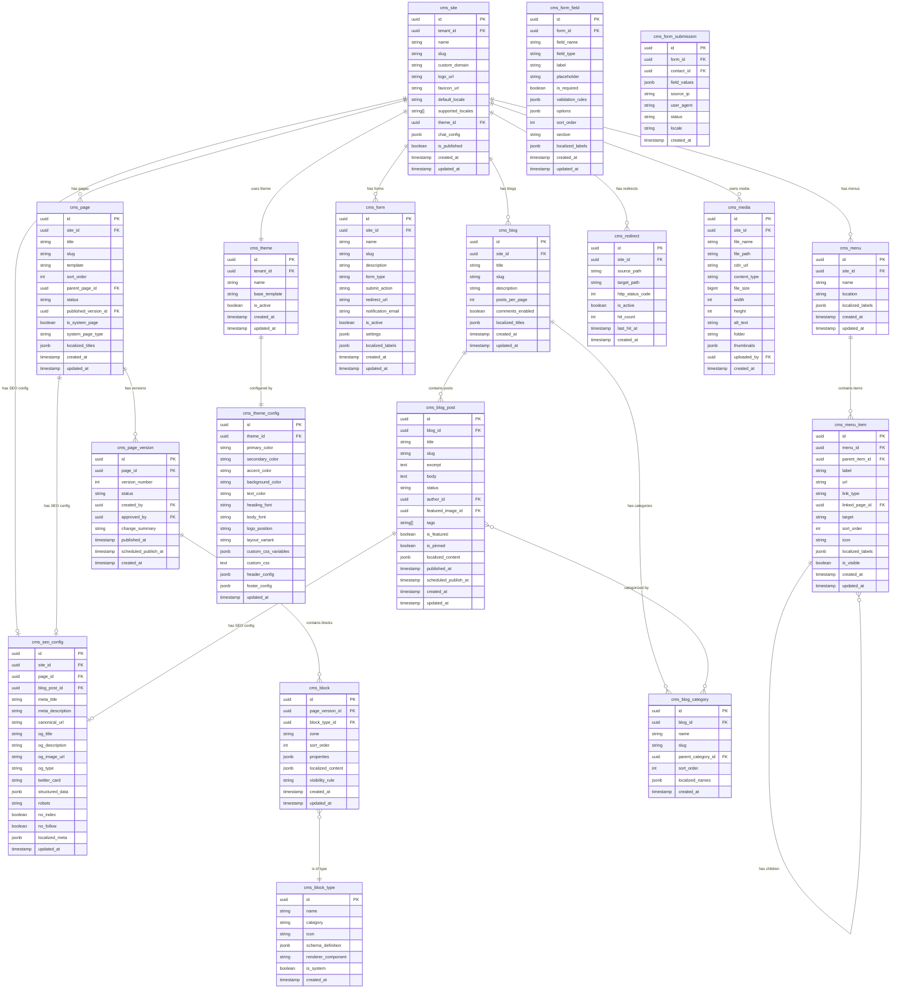
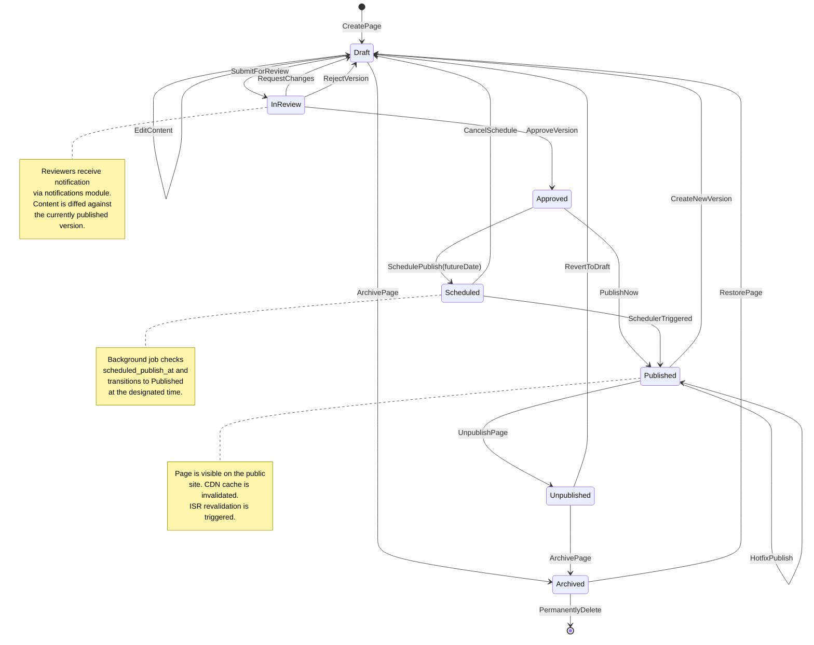
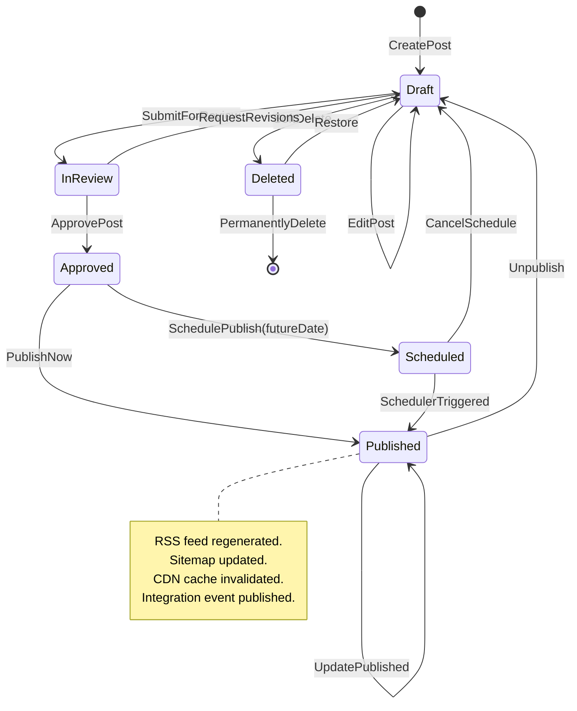
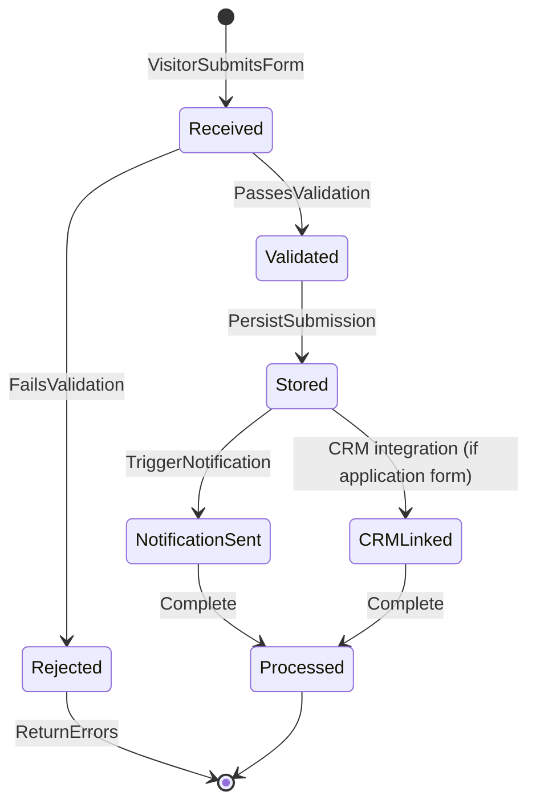
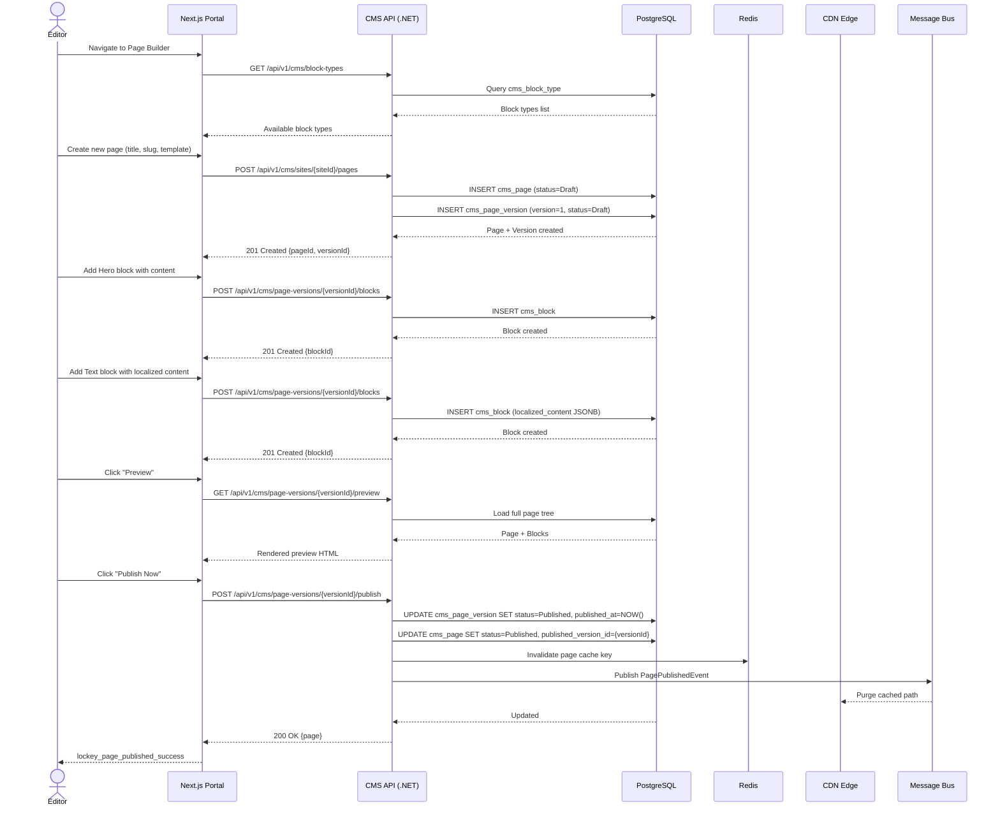
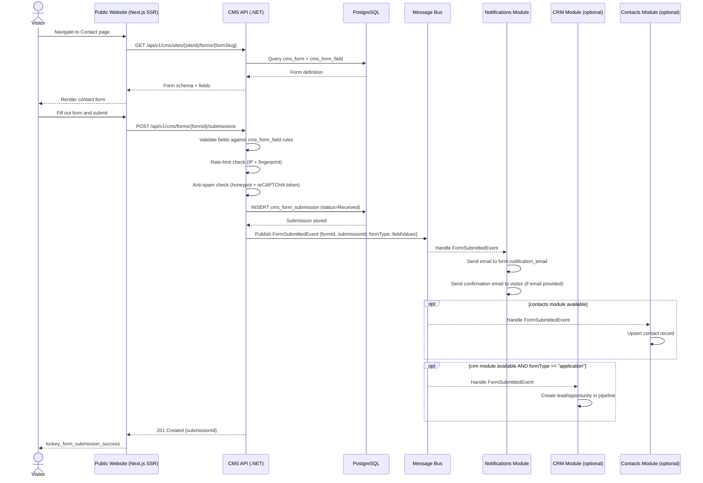
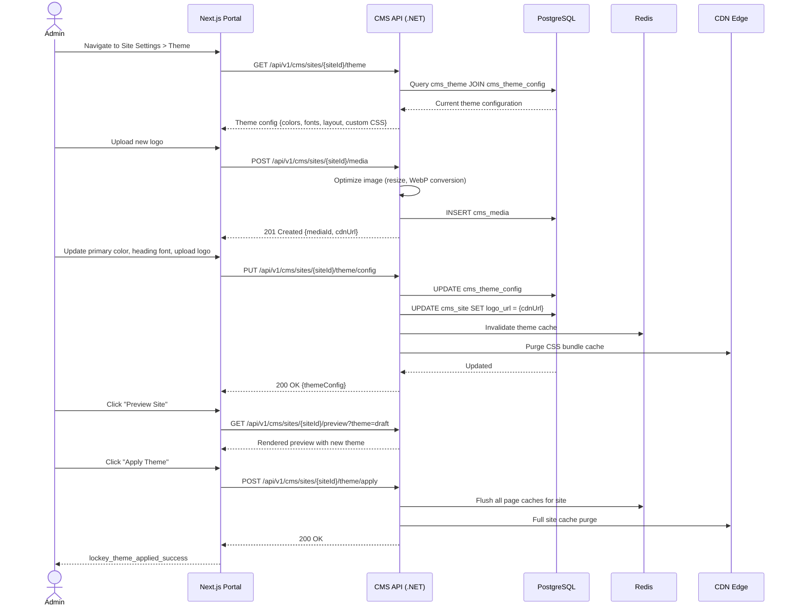
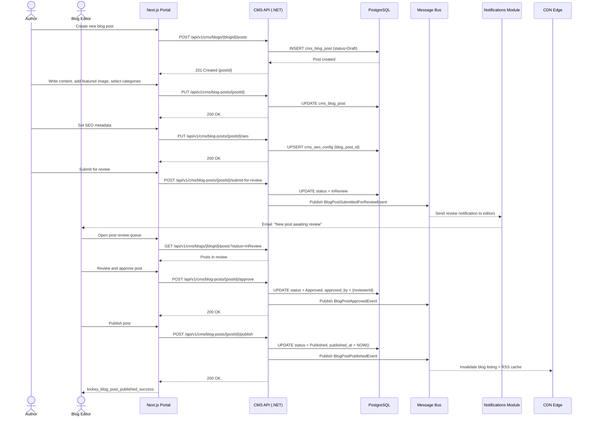
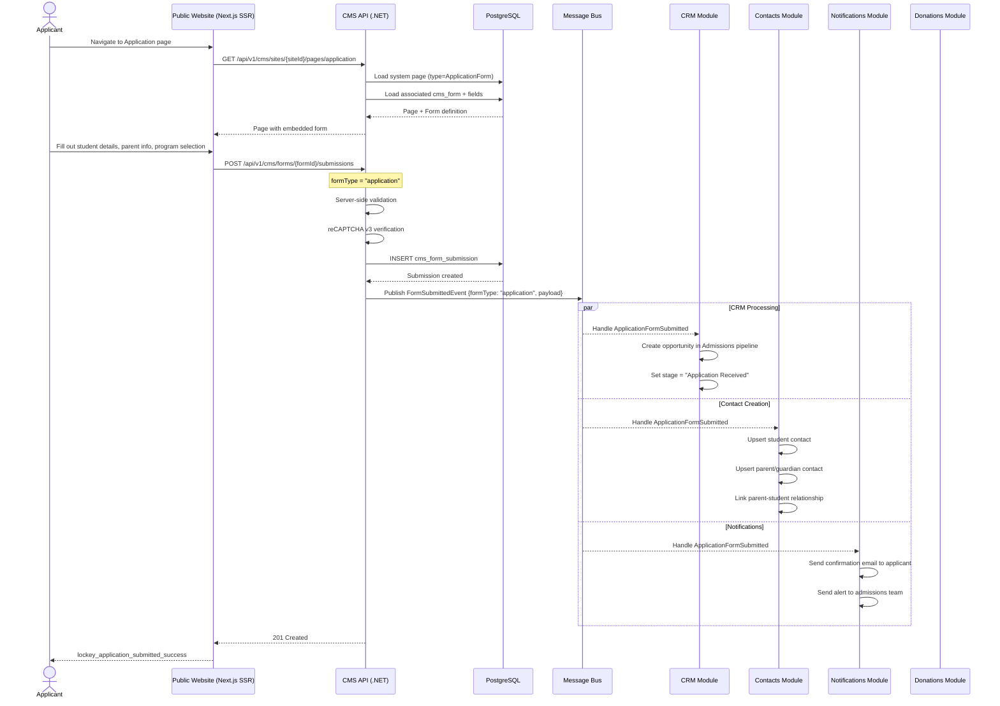

# Website & CMS Module Specification

**Module ID:** `cms`
**Version:** 1.0.0
**Status:** Draft
**Last Updated:** 2026-03-19
**Platform:** Nexora Enterprise Platform
**Runtime:** .NET 10 / PostgreSQL / Next.js 16
**Architecture:** Clean Architecture, CQRS, Multi-Tenant

---

## Table of Contents

1. [Module Overview](#1-module-overview)
2. [Dependencies](#2-dependencies)
3. [Domain Model & ER Diagram](#3-domain-model--er-diagram)
4. [State Diagrams](#4-state-diagrams)
5. [Use Cases & Sequence Diagrams](#5-use-cases--sequence-diagrams)
6. [API Endpoints](#6-api-endpoints)
7. [Integration Events](#7-integration-events)
8. [Frontend Architecture](#8-frontend-architecture)
9. [Non-Functional Requirements](#9-non-functional-requirements)
10. [Security](#10-security)
11. [Localization Keys](#11-localization-keys)
12. [Appendix](#12-appendix)

---

## 1. Module Overview

### 1.1 Purpose

The Website & CMS module delivers a fully managed, multi-tenant website and content management system within the Nexora platform. Each organization (tenant) operates one or more independent websites with their own branding, theme, navigation, pages, blog, forms, and SEO configuration. The module supports white-label deployment so that each organization's site is visually distinct and custom-branded.

### 1.2 Capabilities

| Capability | Description |
|---|---|
| **Multi-Site Management** | Each organization provisions and manages its own website(s) with custom domain, logo, favicon, and theme. |
| **Page Builder** | Block-based page composition with versioning, preview, scheduling, and approval workflows. |
| **Blog / News** | Full blog engine with categories, tags, authoring workflow, and RSS feeds. |
| **Form Builder** | Drag-and-drop form designer for contact, enrollment, volunteer, and custom forms with submission storage and notification triggers. |
| **SEO Management** | Per-page meta tags, Open Graph, structured data (JSON-LD), sitemap generation, canonical URLs, and redirect management. |
| **Theme Engine** | White-label theming per organization: color palette, typography, layout variants, custom CSS. Themes are tenant-scoped and hot-swappable. |
| **Media Library** | Centralized asset management with image optimization, CDN delivery, alt-text, and folder organization. |
| **Multi-Language Content** | Content authoring in multiple languages with locale fallback chains. Each page/block/post stores translations keyed by culture code. |
| **Menu Management** | Hierarchical navigation menus (header, footer, sidebar) with drag-and-drop ordering. |
| **Live Chat / WhatsApp** | Embeddable live chat widget and WhatsApp Business integration via site-level configuration. |

### 1.3 Tenant-Scoped Pages (Isabet Reference)

The following page templates ship as defaults for educational organizations:

- Home
- About
- Academic Program
- Religious Education
- Residence Life
- Contact
- Summer Camp
- Application Form (CRM-integrated)
- Donation Page (Donations module-integrated)

### 1.4 Bounded Context

The CMS module owns all content authoring, rendering metadata, and site configuration. It does **not** own user identity, payment processing, or contact records. It communicates with other modules exclusively through integration events and well-defined API contracts.

---

## 2. Dependencies

### 2.1 Required Dependencies

| Module | Reason |
|---|---|
| `identity` | Authenticates CMS authors/editors, resolves tenant context, provides RBAC permissions for content operations. |
| `notifications` | Dispatches email/SMS/push notifications on form submissions, content approval requests, and publication events. |

### 2.2 Optional Dependencies

| Module | Reason |
|---|---|
| `contacts` | Links form submissions to contact records; pre-fills forms for known contacts. |
| `crm` | Feeds application form submissions into the CRM pipeline as leads/opportunities. |
| `donations` | Powers the donation page with payment processing, recurring gifts, and receipt generation. |

### 2.3 Infrastructure Dependencies

| Component | Usage |
|---|---|
| PostgreSQL 17+ | Primary data store. All tables prefixed `cms_`. |
| Redis 7+ | Output cache, distributed locks for concurrent editing, session-scoped draft state. |
| S3-Compatible Object Store | Media file storage (MinIO in dev, AWS S3 / Azure Blob in production). |
| CDN (CloudFront / Cloudflare) | Edge delivery of media assets, static renders, and ISR pages. |
| Message Bus (RabbitMQ / MassTransit) | Integration event pub/sub. |

---

## 3. Domain Model & ER Diagram

### 3.1 Strongly-Typed IDs

Every entity uses a strongly-typed ID wrapper to prevent primitive obsession:

```csharp
public readonly record struct SiteId(Guid Value);
public readonly record struct PageId(Guid Value);
public readonly record struct PageVersionId(Guid Value);
public readonly record struct BlockId(Guid Value);
public readonly record struct BlockTypeId(Guid Value);
public readonly record struct MenuId(Guid Value);
public readonly record struct MenuItemId(Guid Value);
public readonly record struct BlogId(Guid Value);
public readonly record struct BlogPostId(Guid Value);
public readonly record struct BlogCategoryId(Guid Value);
public readonly record struct FormId(Guid Value);
public readonly record struct FormFieldId(Guid Value);
public readonly record struct FormSubmissionId(Guid Value);
public readonly record struct ThemeId(Guid Value);
public readonly record struct ThemeConfigId(Guid Value);
public readonly record struct MediaId(Guid Value);
public readonly record struct SEOConfigId(Guid Value);
public readonly record struct RedirectId(Guid Value);
```

### 3.2 ER Diagram



### 3.3 Multi-Tenant Isolation

All queries are filtered by `tenant_id` resolved from the authenticated user's JWT or from the site's custom domain for public requests. Row-Level Security (RLS) policies are applied at the PostgreSQL level as a secondary safeguard.

### 3.4 Localization Strategy

Content entities store translations in `jsonb` columns (e.g., `localized_content`, `localized_titles`) keyed by BCP 47 culture code:

```json
{
  "en-US": { "title": "Welcome", "body": "..." },
  "tr-TR": { "title": "Hos Geldiniz", "body": "..." },
  "ar-SA": { "title": "...", "body": "..." }
}
```

The site's `default_locale` is used as fallback when a requested locale is unavailable.

---

## 4. State Diagrams

### 4.1 Page Lifecycle



### 4.2 BlogPost Workflow



### 4.3 Form Submission Processing



---

## 5. Use Cases & Sequence Diagrams

### 5.1 Use Case 1: Author Creates and Publishes a Page

**Actor:** Content Editor
**Preconditions:** User has `cms.page.create` and `cms.page.publish` permissions.
**Postconditions:** Page is publicly visible; CDN is invalidated; sitemap regenerated.



### 5.2 Use Case 2: Visitor Submits a Contact Form

**Actor:** Anonymous Visitor
**Preconditions:** Form is active and site is published.
**Postconditions:** Submission stored; notification dispatched; optionally linked to CRM.



### 5.3 Use Case 3: Admin Configures Site Theme (White-Label)

**Actor:** Organization Admin
**Preconditions:** User has `cms.theme.manage` permission.
**Postconditions:** Theme configuration saved; public site reflects new branding immediately.



### 5.4 Use Case 4: Blog Author Publishes a Post with Approval Workflow

**Actor:** Blog Author, Blog Editor (reviewer)
**Preconditions:** Author has `cms.blog.write`; Editor has `cms.blog.approve`.
**Postconditions:** Post is live; RSS feed updated; sitemap updated.



### 5.5 Use Case 5: Application Form Submission (CRM Integration)

**Actor:** Prospective Student (Anonymous Visitor)
**Preconditions:** Application form exists as a system form linked to CRM module.
**Postconditions:** Submission stored; CRM lead created; parent/student contact records upserted.



---

## 6. API Endpoints

All endpoints are prefixed with `/api/v1/cms`. Administrative endpoints require a valid JWT with appropriate permissions. Public endpoints use site resolution via custom domain or slug.

### 6.1 Sites

| Method | Endpoint | Description | Auth |
|---|---|---|---|
| `POST` | `/sites` | Create a new site for the current tenant | Admin |
| `GET` | `/sites` | List sites for the current tenant | Admin |
| `GET` | `/sites/{siteId}` | Get site details | Admin |
| `PUT` | `/sites/{siteId}` | Update site settings (name, domain, locale, chat config) | Admin |
| `DELETE` | `/sites/{siteId}` | Soft-delete a site | Admin |
| `POST` | `/sites/{siteId}/publish` | Publish (activate) the site | Admin |
| `POST` | `/sites/{siteId}/unpublish` | Take the site offline | Admin |
| `GET` | `/sites/{siteId}/preview` | Generate full-site preview | Admin |

### 6.2 Pages

| Method | Endpoint | Description | Auth |
|---|---|---|---|
| `POST` | `/sites/{siteId}/pages` | Create a new page | Editor |
| `GET` | `/sites/{siteId}/pages` | List pages (filterable by status, template, parent) | Editor |
| `GET` | `/sites/{siteId}/pages/{pageId}` | Get page with current version metadata | Editor |
| `PUT` | `/sites/{siteId}/pages/{pageId}` | Update page metadata (title, slug, sort order) | Editor |
| `DELETE` | `/sites/{siteId}/pages/{pageId}` | Archive / soft-delete a page | Editor |
| `POST` | `/sites/{siteId}/pages/{pageId}/restore` | Restore an archived page | Editor |

### 6.3 Page Versions

| Method | Endpoint | Description | Auth |
|---|---|---|---|
| `POST` | `/pages/{pageId}/versions` | Create a new version (branched from published or latest draft) | Editor |
| `GET` | `/pages/{pageId}/versions` | List all versions with diff summary | Editor |
| `GET` | `/page-versions/{versionId}` | Get version with all blocks | Editor |
| `GET` | `/page-versions/{versionId}/preview` | Server-rendered preview of this version | Editor |
| `POST` | `/page-versions/{versionId}/submit-for-review` | Transition to InReview | Editor |
| `POST` | `/page-versions/{versionId}/approve` | Approve version | Reviewer |
| `POST` | `/page-versions/{versionId}/reject` | Reject with comments | Reviewer |
| `POST` | `/page-versions/{versionId}/publish` | Publish immediately | Publisher |
| `POST` | `/page-versions/{versionId}/schedule` | Schedule for future publish | Publisher |
| `POST` | `/page-versions/{versionId}/cancel-schedule` | Cancel scheduled publish | Publisher |

### 6.4 Blocks

| Method | Endpoint | Description | Auth |
|---|---|---|---|
| `POST` | `/page-versions/{versionId}/blocks` | Add a block to a page version | Editor |
| `GET` | `/page-versions/{versionId}/blocks` | List blocks in a version (ordered by zone + sort) | Editor |
| `PUT` | `/blocks/{blockId}` | Update block properties and content | Editor |
| `DELETE` | `/blocks/{blockId}` | Remove a block | Editor |
| `PUT` | `/page-versions/{versionId}/blocks/reorder` | Batch reorder blocks | Editor |
| `GET` | `/block-types` | List available block types | Editor |
| `POST` | `/block-types` | Register a custom block type | Admin |

### 6.5 Menus

| Method | Endpoint | Description | Auth |
|---|---|---|---|
| `POST` | `/sites/{siteId}/menus` | Create a menu (header, footer, sidebar) | Editor |
| `GET` | `/sites/{siteId}/menus` | List menus for a site | Editor |
| `GET` | `/menus/{menuId}` | Get menu with all items (nested tree) | Editor |
| `PUT` | `/menus/{menuId}` | Update menu metadata | Editor |
| `DELETE` | `/menus/{menuId}` | Delete a menu | Admin |
| `POST` | `/menus/{menuId}/items` | Add a menu item | Editor |
| `PUT` | `/menu-items/{itemId}` | Update a menu item | Editor |
| `DELETE` | `/menu-items/{itemId}` | Remove a menu item | Editor |
| `PUT` | `/menus/{menuId}/items/reorder` | Batch reorder menu items (supports nesting) | Editor |

### 6.6 Blog

| Method | Endpoint | Description | Auth |
|---|---|---|---|
| `POST` | `/sites/{siteId}/blogs` | Create a blog instance | Admin |
| `GET` | `/sites/{siteId}/blogs` | List blogs for a site | Editor |
| `GET` | `/blogs/{blogId}` | Get blog configuration | Editor |
| `PUT` | `/blogs/{blogId}` | Update blog settings | Admin |
| `POST` | `/blogs/{blogId}/categories` | Create a category | Editor |
| `GET` | `/blogs/{blogId}/categories` | List categories | Public |
| `PUT` | `/blog-categories/{categoryId}` | Update a category | Editor |
| `DELETE` | `/blog-categories/{categoryId}` | Delete a category | Editor |
| `POST` | `/blogs/{blogId}/posts` | Create a new blog post | Author |
| `GET` | `/blogs/{blogId}/posts` | List posts (filterable by status, category, tag, author) | Author |
| `GET` | `/blog-posts/{postId}` | Get a blog post | Author |
| `PUT` | `/blog-posts/{postId}` | Update a blog post | Author |
| `DELETE` | `/blog-posts/{postId}` | Soft-delete a post | Author |
| `POST` | `/blog-posts/{postId}/submit-for-review` | Submit for editorial review | Author |
| `POST` | `/blog-posts/{postId}/approve` | Approve post | Reviewer |
| `POST` | `/blog-posts/{postId}/reject` | Reject with comments | Reviewer |
| `POST` | `/blog-posts/{postId}/publish` | Publish post | Publisher |
| `POST` | `/blog-posts/{postId}/schedule` | Schedule future publish | Publisher |
| `POST` | `/blog-posts/{postId}/unpublish` | Unpublish post | Publisher |
| `PUT` | `/blog-posts/{postId}/seo` | Set SEO metadata for post | Author |

### 6.7 Forms

| Method | Endpoint | Description | Auth |
|---|---|---|---|
| `POST` | `/sites/{siteId}/forms` | Create a form | Editor |
| `GET` | `/sites/{siteId}/forms` | List forms for a site | Editor |
| `GET` | `/forms/{formId}` | Get form with fields | Editor |
| `PUT` | `/forms/{formId}` | Update form settings | Editor |
| `DELETE` | `/forms/{formId}` | Deactivate / delete a form | Admin |
| `POST` | `/forms/{formId}/fields` | Add a field | Editor |
| `PUT` | `/form-fields/{fieldId}` | Update a field | Editor |
| `DELETE` | `/form-fields/{fieldId}` | Remove a field | Editor |
| `PUT` | `/forms/{formId}/fields/reorder` | Batch reorder fields | Editor |
| `POST` | `/forms/{formId}/submissions` | Submit a form (public endpoint) | Public |
| `GET` | `/forms/{formId}/submissions` | List submissions (paginated) | Admin |
| `GET` | `/form-submissions/{submissionId}` | Get submission detail | Admin |
| `DELETE` | `/form-submissions/{submissionId}` | Delete a submission | Admin |
| `GET` | `/forms/{formId}/submissions/export` | Export submissions as CSV/Excel | Admin |

### 6.8 Themes

| Method | Endpoint | Description | Auth |
|---|---|---|---|
| `POST` | `/sites/{siteId}/theme` | Create or assign a theme to a site | Admin |
| `GET` | `/sites/{siteId}/theme` | Get current theme and config | Admin |
| `PUT` | `/sites/{siteId}/theme/config` | Update theme configuration | Admin |
| `POST` | `/sites/{siteId}/theme/apply` | Apply theme changes and invalidate caches | Admin |
| `POST` | `/sites/{siteId}/theme/reset` | Reset theme to platform defaults | Admin |
| `GET` | `/themes/templates` | List available base theme templates | Admin |

### 6.9 Media

| Method | Endpoint | Description | Auth |
|---|---|---|---|
| `POST` | `/sites/{siteId}/media` | Upload a media file (multipart) | Editor |
| `POST` | `/sites/{siteId}/media/bulk` | Bulk upload multiple files | Editor |
| `GET` | `/sites/{siteId}/media` | List media (filterable by folder, type) | Editor |
| `GET` | `/media/{mediaId}` | Get media metadata | Editor |
| `PUT` | `/media/{mediaId}` | Update alt text, folder, metadata | Editor |
| `DELETE` | `/media/{mediaId}` | Delete media file | Editor |
| `POST` | `/media/{mediaId}/optimize` | Re-optimize (generate thumbnails, convert to WebP) | Editor |

### 6.10 SEO & Redirects

| Method | Endpoint | Description | Auth |
|---|---|---|---|
| `GET` | `/sites/{siteId}/seo` | Get site-level SEO defaults | Admin |
| `PUT` | `/sites/{siteId}/seo` | Update site-level SEO defaults | Admin |
| `GET` | `/sites/{siteId}/sitemap.xml` | Generate XML sitemap | Public |
| `GET` | `/sites/{siteId}/robots.txt` | Generate robots.txt | Public |
| `GET` | `/sites/{siteId}/rss.xml` | Generate RSS feed | Public |
| `POST` | `/sites/{siteId}/redirects` | Create a redirect rule | Admin |
| `GET` | `/sites/{siteId}/redirects` | List redirects | Admin |
| `PUT` | `/redirects/{redirectId}` | Update a redirect | Admin |
| `DELETE` | `/redirects/{redirectId}` | Delete a redirect | Admin |
| `POST` | `/sites/{siteId}/redirects/import` | Bulk import redirects from CSV | Admin |

### 6.11 Public Content Delivery API

These endpoints serve the public website. They are unauthenticated and optimized for performance (edge-cacheable, ISR-compatible).

| Method | Endpoint | Description | Cache |
|---|---|---|---|
| `GET` | `/public/sites/{siteSlug}` | Site metadata, theme, menus | 5 min |
| `GET` | `/public/sites/{siteSlug}/pages/{pageSlug}` | Rendered page with blocks | ISR 60s |
| `GET` | `/public/sites/{siteSlug}/blog/posts` | Published blog posts (paginated) | 2 min |
| `GET` | `/public/sites/{siteSlug}/blog/posts/{postSlug}` | Single blog post | ISR 60s |
| `GET` | `/public/sites/{siteSlug}/blog/categories` | Blog categories | 10 min |
| `GET` | `/public/sites/{siteSlug}/blog/rss` | RSS feed (Atom) | 15 min |
| `GET` | `/public/sites/{siteSlug}/menus/{location}` | Menu tree for a location | 5 min |
| `GET` | `/public/sites/{siteSlug}/forms/{formSlug}` | Form definition for rendering | 10 min |
| `GET` | `/public/sites/{siteSlug}/theme` | Compiled theme variables and CSS | 5 min |

---

## 7. Integration Events

### 7.1 Published Events (Outbound)

Events published by the CMS module onto the message bus for consumption by other modules.

| Event | Payload | Consumers |
|---|---|---|
| `Cms.PagePublishedEvent` | `{ siteId, pageId, versionId, slug, locale, publishedAt, publishedBy }` | CDN invalidator, Search indexer |
| `Cms.PageUnpublishedEvent` | `{ siteId, pageId, slug }` | CDN invalidator, Search indexer |
| `Cms.BlogPostPublishedEvent` | `{ siteId, blogId, postId, slug, title, excerpt, authorId, categories[], tags[], publishedAt }` | Notifications, Search indexer, Social media scheduler |
| `Cms.BlogPostUnpublishedEvent` | `{ siteId, blogId, postId, slug }` | Search indexer |
| `Cms.FormSubmittedEvent` | `{ siteId, formId, submissionId, formType, formSlug, fieldValues{}, contactEmail, locale, submittedAt }` | Notifications, Contacts, CRM |
| `Cms.FormSubmissionDeletedEvent` | `{ submissionId, formId }` | Contacts (cleanup) |
| `Cms.SitePublishedEvent` | `{ siteId, domain, slug, tenantId }` | DNS provisioner, SSL cert manager |
| `Cms.SiteUnpublishedEvent` | `{ siteId }` | DNS provisioner |
| `Cms.ThemeUpdatedEvent` | `{ siteId, themeId, themeConfigId }` | CDN invalidator (CSS purge) |
| `Cms.MediaUploadedEvent` | `{ siteId, mediaId, cdnUrl, contentType, fileSize }` | Audit log |
| `Cms.PageVersionSubmittedForReviewEvent` | `{ siteId, pageId, versionId, submittedBy }` | Notifications |
| `Cms.BlogPostSubmittedForReviewEvent` | `{ siteId, blogId, postId, submittedBy }` | Notifications |

### 7.2 Consumed Events (Inbound)

Events consumed from other modules.

| Event | Source Module | Handler Action |
|---|---|---|
| `Identity.UserDeactivatedEvent` | identity | Reassign content authored by deactivated user to a system account; revoke editing locks. |
| `Identity.TenantProvisionedEvent` | identity | Auto-create a default site with starter pages, default theme, and sample blog for the new tenant. |
| `Identity.TenantDeletedEvent` | identity | Hard-delete all CMS data for the tenant (cascading). |
| `Contacts.ContactMergedEvent` | contacts | Update `cms_form_submission.contact_id` references to the surviving contact. |
| `Contacts.ContactDeletedEvent` | contacts | Nullify `cms_form_submission.contact_id` for the deleted contact. |
| `Donations.DonationCompletedEvent` | donations | Optionally display recent donations on the donation page (if configured). |

---

## 8. Frontend Architecture

### 8.1 Rendering Strategy

| Page Type | Rendering | Revalidation |
|---|---|---|
| Public pages (Home, About, etc.) | ISR (Incremental Static Regeneration) | On-demand via webhook + 60s fallback |
| Blog post | ISR | On-demand via webhook + 60s fallback |
| Blog listing | SSR with stale-while-revalidate | 2 min cache |
| Form pages | SSR (dynamic, no cache) | None |
| Admin / Portal (Page Builder) | CSR (Client-Side Rendering) | N/A |
| Preview mode | SSR (bypasses cache) | None |

### 8.2 Page Builder UI (Portal)

The page builder is a React-based visual editor within the Next.js 16 admin portal:

- **Block Palette:** Sidebar listing available block types grouped by category (Layout, Content, Media, Interactive, Integration).
- **Canvas:** WYSIWYG drag-and-drop editing surface with zone support (header, main, sidebar, footer).
- **Property Panel:** Right-side panel for editing the selected block's properties, visibility rules, and localized content.
- **Version Bar:** Top bar showing version history, diff view, and workflow actions (save, preview, submit, publish).
- **Responsive Preview:** Toggle between desktop, tablet, and mobile viewports.

### 8.3 Key Frontend Components

```
modules/cms/
  components/
    PageBuilder/
      Canvas.tsx
      BlockPalette.tsx
      PropertyPanel.tsx
      VersionBar.tsx
      ResponsivePreview.tsx
    BlogEditor/
      PostEditor.tsx
      CategoryManager.tsx
      PostList.tsx
    FormBuilder/
      FormDesigner.tsx
      FieldConfigurator.tsx
      SubmissionViewer.tsx
    ThemeEditor/
      ColorPicker.tsx
      FontSelector.tsx
      LayoutSelector.tsx
      CSSEditor.tsx
      ThemePreview.tsx
    MenuEditor/
      MenuTree.tsx
      MenuItemEditor.tsx
    MediaLibrary/
      MediaGrid.tsx
      MediaUploader.tsx
      ImageCropper.tsx
    SEO/
      SEOPanel.tsx
      RedirectManager.tsx
    SiteSettings/
      DomainConfig.tsx
      LocaleManager.tsx
      ChatIntegration.tsx
  hooks/
    usePage.ts
    usePageVersion.ts
    useBlocks.ts
    useBlog.ts
    useForm.ts
    useTheme.ts
    useMedia.ts
    useSEO.ts
  api/
    cmsApi.ts          # Typed API client (generated from OpenAPI)
  stores/
    pageBuilderStore.ts  # Zustand store for page builder state
    mediaStore.ts
```

### 8.4 Public Site Rendering

Public-facing pages are rendered via Next.js 16 App Router:

```
app/
  [siteSlug]/
    layout.tsx           # Loads site theme, menus, chat widget
    page.tsx             # Home page (ISR)
    [pageSlug]/
      page.tsx           # Dynamic page (ISR)
    blog/
      page.tsx           # Blog listing (SSR)
      [postSlug]/
        page.tsx         # Blog post (ISR)
    forms/
      [formSlug]/
        page.tsx         # Form page (SSR, no cache)
    sitemap.xml/
      route.ts           # Dynamic sitemap generation
    robots.txt/
      route.ts           # Dynamic robots.txt
    rss.xml/
      route.ts           # RSS feed
```

---

## 9. Non-Functional Requirements

### 9.1 Performance

| Metric | Target | Measurement |
|---|---|---|
| Public page TTFB (Time to First Byte) | < 200ms (cached), < 800ms (ISR miss) | Synthetic monitoring (Datadog) |
| Page Builder load time | < 2s for page with 50 blocks | Real user monitoring |
| API response time (admin CRUD) | p95 < 300ms | APM traces |
| Media upload (10MB image) | < 3s including optimization | Integration tests |
| Form submission response | < 500ms | APM traces |
| Sitemap generation (1000 pages) | < 5s | Benchmark tests |
| Lighthouse Performance Score (public) | > 90 | CI/CD Lighthouse audit |

### 9.2 Caching Strategy

| Layer | Technology | TTL | Invalidation |
|---|---|---|---|
| CDN Edge | CloudFront / Cloudflare | Varies by resource (see 6.11) | Programmatic purge via API on publish/unpublish events |
| Application Cache | Redis | 5 min (configurable per resource) | Key-based invalidation on write operations |
| Database Query Cache | EF Core Second-Level Cache (Redis) | 2 min | Auto-invalidated on entity change |
| ISR Page Cache | Next.js ISR | 60s stale, on-demand revalidation | Revalidation webhook triggered by `PagePublishedEvent` |
| Media Assets | CDN with immutable URLs | 1 year (content-hashed filenames) | New URL on re-upload |
| Theme CSS | CDN with versioned URL | 1 year | New URL on theme config change |

### 9.3 SEO Requirements

| Requirement | Implementation |
|---|---|
| Server-side rendering | All public pages rendered via Next.js SSR/ISR with full HTML content |
| Meta tags | Configurable per page/post via `cms_seo_config`; site-level defaults as fallback |
| Open Graph | `og:title`, `og:description`, `og:image`, `og:type`, `og:url` on every page |
| Twitter Cards | `twitter:card`, `twitter:title`, `twitter:description`, `twitter:image` |
| Structured Data | JSON-LD for Organization, WebPage, BlogPosting, BreadcrumbList, FAQPage |
| Sitemap | Auto-generated `sitemap.xml` including all published pages and posts with `lastmod` |
| Robots.txt | Configurable per site; default allows all except admin paths |
| Canonical URLs | Auto-generated; overridable per page |
| Redirects | 301/302 redirects managed via `cms_redirect`; server-side middleware |
| Mobile Responsiveness | All themes must pass Google Mobile-Friendly test |
| Core Web Vitals | LCP < 2.5s, FID < 100ms, CLS < 0.1 |
| Hreflang | Auto-generated `hreflang` tags for multi-language pages |
| Clean URLs | Slug-based URLs, no query parameters for content pages |

### 9.4 Scalability

| Dimension | Target | Approach |
|---|---|---|
| Concurrent sites per instance | 500+ | Tenant-scoped queries with indexed `tenant_id`; connection pooling (PgBouncer) |
| Pages per site | 10,000+ | Paginated queries; denormalized page tree cache in Redis |
| Media files per site | 100,000+ | Object storage with folder-based partitioning; lazy-loading in media library UI |
| Form submissions per form | 1,000,000+ | Partitioned table by `created_at` month; archival to cold storage after 2 years |
| Concurrent editors | 50+ per site | Optimistic concurrency with `xmin`-based ETags; Redis-based editing locks with 5-min TTL |

### 9.5 Availability

| Aspect | Target |
|---|---|
| Public site uptime | 99.95% (4.38 hours downtime/year) |
| Admin portal uptime | 99.9% (8.76 hours downtime/year) |
| Data durability | 99.999999999% (11 nines, via S3 for media; PostgreSQL with WAL archiving and PITR) |
| RPO (Recovery Point Objective) | < 1 minute |
| RTO (Recovery Time Objective) | < 15 minutes |

### 9.6 Observability

| Signal | Tool | Details |
|---|---|---|
| Logs | Structured logging (Serilog) -> OpenTelemetry -> Loki/Elasticsearch | All API requests, domain events, errors |
| Metrics | OpenTelemetry -> Prometheus -> Grafana | Request rate, latency, error rate, cache hit ratio, media storage usage |
| Traces | OpenTelemetry -> Jaeger/Tempo | Distributed traces across API -> DB -> Cache -> Bus |
| Health checks | `/health/ready`, `/health/live` | DB connectivity, Redis connectivity, object storage reachability |

---

## 10. Security

### 10.1 Authorization Model

Permissions follow `{module}.{resource}.{action}` convention and are enforced via the Identity module's RBAC system.

| Permission | Description |
|---|---|
| `cms.site.manage` | Create, update, delete, publish/unpublish sites |
| `cms.page.create` | Create pages and page versions |
| `cms.page.edit` | Edit page content and blocks |
| `cms.page.review` | Approve or reject page versions |
| `cms.page.publish` | Publish or schedule page versions |
| `cms.page.delete` | Archive or permanently delete pages |
| `cms.blog.write` | Create and edit blog posts |
| `cms.blog.review` | Approve or reject blog posts |
| `cms.blog.publish` | Publish or schedule blog posts |
| `cms.blog.delete` | Delete blog posts |
| `cms.form.manage` | Create, edit, delete forms and fields |
| `cms.form.submissions.view` | View form submissions |
| `cms.form.submissions.export` | Export form submissions |
| `cms.form.submissions.delete` | Delete form submissions |
| `cms.theme.manage` | Update theme configuration |
| `cms.media.upload` | Upload media files |
| `cms.media.delete` | Delete media files |
| `cms.seo.manage` | Edit SEO configuration and redirects |
| `cms.menu.manage` | Create and edit menus |

### 10.2 Suggested Default Roles

| Role | Permissions |
|---|---|
| CMS Administrator | All `cms.*` permissions |
| Content Editor | `cms.page.create`, `cms.page.edit`, `cms.blog.write`, `cms.media.upload`, `cms.menu.manage` |
| Content Reviewer | `cms.page.review`, `cms.blog.review` |
| Content Publisher | `cms.page.publish`, `cms.blog.publish` |
| Form Manager | `cms.form.manage`, `cms.form.submissions.view`, `cms.form.submissions.export` |

### 10.3 Security Controls

| Control | Implementation |
|---|---|
| Input sanitization | HTML content sanitized via HtmlSanitizer library; allowlist-based tag/attribute policy |
| XSS prevention | Content-Security-Policy headers; output encoding in Next.js templates |
| CSRF protection | Anti-forgery tokens for form submissions; SameSite cookie policy |
| File upload validation | MIME-type verification (magic bytes, not just extension); max file size 50MB; disallowed extensions (.exe, .bat, .sh, .php, etc.) |
| Rate limiting | Public form submissions: 5/min per IP; Media uploads: 20/min per user; API: 100/min per user |
| Spam protection | Honeypot fields + Google reCAPTCHA v3 on all public forms |
| SQL injection | Parameterized queries via EF Core; no raw SQL without explicit parameterization |
| Tenant isolation | Row-Level Security (RLS) in PostgreSQL; middleware-enforced tenant context; no cross-tenant data access |
| Media access control | Signed URLs for private media; public media served via CDN with no directory listing |
| Audit trail | All create/update/delete operations logged with `user_id`, `timestamp`, `old_value`, `new_value` |

---

## 11. Localization Keys

All user-facing messages in the CMS module use the `lockey_` prefix. Below is the canonical list.

### 11.1 Page Operations

| Key | Default (en-US) |
|---|---|
| `lockey_page_created_success` | Page created successfully. |
| `lockey_page_updated_success` | Page updated successfully. |
| `lockey_page_published_success` | Page published successfully. |
| `lockey_page_unpublished_success` | Page unpublished successfully. |
| `lockey_page_archived_success` | Page archived successfully. |
| `lockey_page_restored_success` | Page restored successfully. |
| `lockey_page_deleted_success` | Page permanently deleted. |
| `lockey_page_scheduled_success` | Page scheduled for publication on {0}. |
| `lockey_page_schedule_cancelled` | Scheduled publication cancelled. |
| `lockey_page_submitted_for_review` | Page submitted for review. |
| `lockey_page_approved` | Page version approved. |
| `lockey_page_rejected` | Page version rejected. Please review feedback. |
| `lockey_page_slug_conflict` | A page with this URL slug already exists. |
| `lockey_page_not_found` | Page not found. |

### 11.2 Blog Operations

| Key | Default (en-US) |
|---|---|
| `lockey_blog_post_created_success` | Blog post created successfully. |
| `lockey_blog_post_updated_success` | Blog post updated successfully. |
| `lockey_blog_post_published_success` | Blog post published successfully. |
| `lockey_blog_post_unpublished_success` | Blog post unpublished. |
| `lockey_blog_post_deleted_success` | Blog post deleted. |
| `lockey_blog_post_submitted_for_review` | Blog post submitted for editorial review. |
| `lockey_blog_post_approved` | Blog post approved. |
| `lockey_blog_post_rejected` | Blog post returned for revisions. |
| `lockey_blog_category_created_success` | Category created successfully. |
| `lockey_blog_category_deleted_success` | Category deleted. |

### 11.3 Form Operations

| Key | Default (en-US) |
|---|---|
| `lockey_form_created_success` | Form created successfully. |
| `lockey_form_updated_success` | Form updated successfully. |
| `lockey_form_deleted_success` | Form deleted. |
| `lockey_form_submission_success` | Thank you! Your submission has been received. |
| `lockey_form_submission_error` | There was a problem submitting your form. Please try again. |
| `lockey_form_validation_required` | This field is required. |
| `lockey_form_validation_email` | Please enter a valid email address. |
| `lockey_form_validation_phone` | Please enter a valid phone number. |
| `lockey_form_rate_limited` | Too many submissions. Please wait a moment and try again. |
| `lockey_form_submissions_exported` | Submissions exported successfully. |
| `lockey_application_submitted_success` | Your application has been submitted successfully. You will receive a confirmation email shortly. |

### 11.4 Theme & Site Operations

| Key | Default (en-US) |
|---|---|
| `lockey_theme_applied_success` | Theme applied successfully. Changes are now live. |
| `lockey_theme_reset_success` | Theme reset to default. |
| `lockey_site_published_success` | Site is now live. |
| `lockey_site_unpublished_success` | Site taken offline. |
| `lockey_site_domain_conflict` | This domain is already in use by another site. |

### 11.5 Media Operations

| Key | Default (en-US) |
|---|---|
| `lockey_media_uploaded_success` | File uploaded successfully. |
| `lockey_media_deleted_success` | File deleted. |
| `lockey_media_upload_failed` | File upload failed. Please try again. |
| `lockey_media_file_too_large` | File exceeds the maximum allowed size of {0}MB. |
| `lockey_media_type_not_allowed` | This file type is not allowed. |

### 11.6 SEO & Redirect Operations

| Key | Default (en-US) |
|---|---|
| `lockey_seo_updated_success` | SEO settings updated. |
| `lockey_redirect_created_success` | Redirect created. |
| `lockey_redirect_deleted_success` | Redirect deleted. |
| `lockey_redirect_source_conflict` | A redirect with this source path already exists. |

---

## 12. Appendix

### 12.1 Block Types (Built-In)

| Block Type | Category | Description |
|---|---|---|
| `hero` | Layout | Full-width hero banner with heading, subheading, CTA button, background image/video |
| `rich-text` | Content | WYSIWYG rich text content with localization |
| `image` | Media | Single image with alt text, caption, and link |
| `image-gallery` | Media | Grid/carousel of images with lightbox |
| `video` | Media | Embedded video (YouTube, Vimeo, self-hosted) |
| `card-grid` | Layout | Grid of cards with icon, title, description, link |
| `accordion` | Content | Collapsible FAQ-style content sections |
| `tabs` | Content | Tabbed content panels |
| `cta-banner` | Layout | Call-to-action strip with heading, text, and button |
| `testimonials` | Content | Testimonial carousel/grid |
| `team-grid` | Content | Staff/team member grid with photo, name, title, bio |
| `stats-counter` | Content | Animated statistics counters |
| `map` | Interactive | Embedded Google Maps with custom markers |
| `form-embed` | Interactive | Embedded form (references `cms_form` by ID) |
| `blog-feed` | Integration | Recent blog posts feed (configurable count, category filter) |
| `donation-widget` | Integration | Embedded donation form (requires donations module) |
| `html-embed` | Advanced | Raw HTML/JS embed (sandboxed iframe for security) |
| `spacer` | Layout | Vertical spacing block with configurable height |
| `divider` | Layout | Horizontal rule with style options |
| `columns` | Layout | Multi-column layout container (2, 3, or 4 columns) |

### 12.2 Form Field Types

| Field Type | Renders As | Validation Options |
|---|---|---|
| `text` | Single-line text input | min/max length, regex pattern |
| `textarea` | Multi-line text area | min/max length |
| `email` | Email input | RFC 5322 validation |
| `phone` | Phone input with country code | E.164 validation |
| `number` | Numeric input | min/max value, integer/decimal |
| `date` | Date picker | min/max date |
| `select` | Dropdown | options list, allow multiple |
| `radio` | Radio button group | options list |
| `checkbox` | Checkbox group | options list, min/max selections |
| `toggle` | Single toggle | - |
| `file-upload` | File upload | allowed types, max size |
| `hidden` | Hidden field | - |
| `heading` | Section heading (non-input) | - |
| `paragraph` | Descriptive text (non-input) | - |

### 12.3 Database Migration Naming Convention

Migrations follow the pattern: `{Timestamp}_{Description}.cs`

```
20260319000001_CreateCmsSitesTable.cs
20260319000002_CreateCmsPagesTable.cs
20260319000003_CreateCmsPageVersionsTable.cs
20260319000004_CreateCmsBlocksTable.cs
20260319000005_CreateCmsBlockTypesTable.cs
20260319000006_CreateCmsMenusTable.cs
20260319000007_CreateCmsMenuItemsTable.cs
20260319000008_CreateCmsBlogsTable.cs
20260319000009_CreateCmsBlogPostsTable.cs
20260319000010_CreateCmsBlogCategoriesTable.cs
20260319000011_CreateCmsFormsTable.cs
20260319000012_CreateCmsFormFieldsTable.cs
20260319000013_CreateCmsFormSubmissionsTable.cs
20260319000014_CreateCmsThemesTable.cs
20260319000015_CreateCmsThemeConfigsTable.cs
20260319000016_CreateCmsMediaTable.cs
20260319000017_CreateCmsSeoConfigsTable.cs
20260319000018_CreateCmsRedirectsTable.cs
20260319000019_SeedDefaultBlockTypes.cs
20260319000020_AddRowLevelSecurityPolicies.cs
```

### 12.4 Key Database Indexes

```sql
-- Tenant isolation (all tables)
CREATE INDEX idx_cms_site_tenant_id ON cms_site(tenant_id);

-- Page lookups
CREATE UNIQUE INDEX idx_cms_page_site_slug ON cms_page(site_id, slug);
CREATE INDEX idx_cms_page_status ON cms_page(site_id, status);
CREATE INDEX idx_cms_page_parent ON cms_page(parent_page_id);

-- Page version lookups
CREATE INDEX idx_cms_page_version_page_status ON cms_page_version(page_id, status);
CREATE INDEX idx_cms_page_version_scheduled ON cms_page_version(scheduled_publish_at)
    WHERE scheduled_publish_at IS NOT NULL AND status = 'Scheduled';

-- Block ordering
CREATE INDEX idx_cms_block_version_zone_order ON cms_block(page_version_id, zone, sort_order);

-- Blog post lookups
CREATE UNIQUE INDEX idx_cms_blog_post_blog_slug ON cms_blog_post(blog_id, slug);
CREATE INDEX idx_cms_blog_post_status_published ON cms_blog_post(blog_id, status, published_at DESC);
CREATE INDEX idx_cms_blog_post_scheduled ON cms_blog_post(scheduled_publish_at)
    WHERE scheduled_publish_at IS NOT NULL AND status = 'Scheduled';
CREATE INDEX idx_cms_blog_post_tags ON cms_blog_post USING GIN(tags);

-- Form submission lookups
CREATE INDEX idx_cms_form_submission_form ON cms_form_submission(form_id, created_at DESC);
CREATE INDEX idx_cms_form_submission_contact ON cms_form_submission(contact_id)
    WHERE contact_id IS NOT NULL;

-- SEO config lookups
CREATE UNIQUE INDEX idx_cms_seo_config_page ON cms_seo_config(page_id) WHERE page_id IS NOT NULL;
CREATE UNIQUE INDEX idx_cms_seo_config_post ON cms_seo_config(blog_post_id) WHERE blog_post_id IS NOT NULL;

-- Redirect lookups
CREATE UNIQUE INDEX idx_cms_redirect_site_source ON cms_redirect(site_id, source_path)
    WHERE is_active = true;

-- Menu item ordering
CREATE INDEX idx_cms_menu_item_menu_order ON cms_menu_item(menu_id, parent_item_id, sort_order);

-- Media folder browsing
CREATE INDEX idx_cms_media_site_folder ON cms_media(site_id, folder, created_at DESC);

-- Custom domain resolution
CREATE UNIQUE INDEX idx_cms_site_custom_domain ON cms_site(custom_domain)
    WHERE custom_domain IS NOT NULL AND is_published = true;
```

### 12.5 CQRS Command/Query Examples

**Commands (Write Side):**

```csharp
// Commands
public record CreateSiteCommand(string Name, string Slug, string DefaultLocale) : ICommand<SiteId>;
public record UpdateSiteCommand(SiteId SiteId, string Name, string? CustomDomain, string[] SupportedLocales) : ICommand;
public record CreatePageCommand(SiteId SiteId, string Title, string Slug, string Template, PageId? ParentPageId) : ICommand<PageId>;
public record AddBlockToVersionCommand(PageVersionId VersionId, BlockTypeId BlockTypeId, string Zone, int SortOrder, JsonDocument Properties) : ICommand<BlockId>;
public record PublishPageVersionCommand(PageVersionId VersionId) : ICommand;
public record SchedulePageVersionCommand(PageVersionId VersionId, DateTimeOffset ScheduledAt) : ICommand;
public record SubmitFormCommand(FormId FormId, Dictionary<string, object> FieldValues, string SourceIp, string UserAgent, string Locale) : ICommand<FormSubmissionId>;
public record UpdateThemeConfigCommand(SiteId SiteId, ThemeConfigDto Config) : ICommand;
public record UploadMediaCommand(SiteId SiteId, Stream FileStream, string FileName, string ContentType, string? Folder, string? AltText) : ICommand<MediaId>;
public record CreateBlogPostCommand(BlogId BlogId, string Title, string Slug, string Body, string? Excerpt, BlogCategoryId[] CategoryIds, string[] Tags) : ICommand<BlogPostId>;
public record PublishBlogPostCommand(BlogPostId PostId) : ICommand;
public record CreateRedirectCommand(SiteId SiteId, string SourcePath, string TargetPath, int HttpStatusCode) : ICommand<RedirectId>;
```

**Queries (Read Side):**

```csharp
// Queries
public record GetSiteBySlugQuery(string Slug) : IQuery<SiteDto>;
public record GetPageTreeQuery(SiteId SiteId) : IQuery<IReadOnlyList<PageTreeNodeDto>>;
public record GetPageVersionWithBlocksQuery(PageVersionId VersionId) : IQuery<PageVersionDetailDto>;
public record GetPublishedPageQuery(SiteId SiteId, string PageSlug, string Locale) : IQuery<PublishedPageDto>;
public record GetBlogPostsQuery(BlogId BlogId, BlogPostStatus? Status, BlogCategoryId? CategoryId, string? Tag, int Page, int PageSize) : IQuery<PaginatedList<BlogPostSummaryDto>>;
public record GetPublishedBlogPostQuery(string SiteSlug, string PostSlug, string Locale) : IQuery<PublishedBlogPostDto>;
public record GetFormDefinitionQuery(SiteId SiteId, string FormSlug) : IQuery<FormDefinitionDto>;
public record GetFormSubmissionsQuery(FormId FormId, int Page, int PageSize) : IQuery<PaginatedList<FormSubmissionDto>>;
public record GetMenuTreeQuery(SiteId SiteId, string Location, string Locale) : IQuery<MenuTreeDto>;
public record GetThemeConfigQuery(SiteId SiteId) : IQuery<ThemeConfigDto>;
public record GetSiteMediaQuery(SiteId SiteId, string? Folder, string? ContentType, int Page, int PageSize) : IQuery<PaginatedList<MediaDto>>;
public record GetSeoConfigQuery(PageId? PageId, BlogPostId? PostId) : IQuery<SeoConfigDto>;
public record SearchRedirectsQuery(SiteId SiteId, string? SourcePathFilter, int Page, int PageSize) : IQuery<PaginatedList<RedirectDto>>;
```

### 12.6 Chat Integration Configuration Schema

The `cms_site.chat_config` JSONB column stores live chat / WhatsApp integration settings:

```json
{
  "provider": "whatsapp",
  "enabled": true,
  "whatsapp": {
    "phone_number": "+1234567890",
    "default_message": "Hello! How can we help you?",
    "business_hours": {
      "timezone": "America/New_York",
      "schedule": {
        "mon": { "start": "09:00", "end": "17:00" },
        "tue": { "start": "09:00", "end": "17:00" },
        "wed": { "start": "09:00", "end": "17:00" },
        "thu": { "start": "09:00", "end": "17:00" },
        "fri": { "start": "09:00", "end": "13:00" }
      },
      "offline_message": "We are currently offline. Please leave a message and we will get back to you."
    }
  },
  "live_chat": {
    "provider": "tawk.to",
    "widget_id": "abc123",
    "color": "#1a73e8"
  },
  "position": "bottom-right",
  "show_on_mobile": true
}
```

---

**End of Specification**

*This document is maintained by the Nexora Platform Architecture team. Changes require review from at least two senior engineers and approval from the module owner.*
