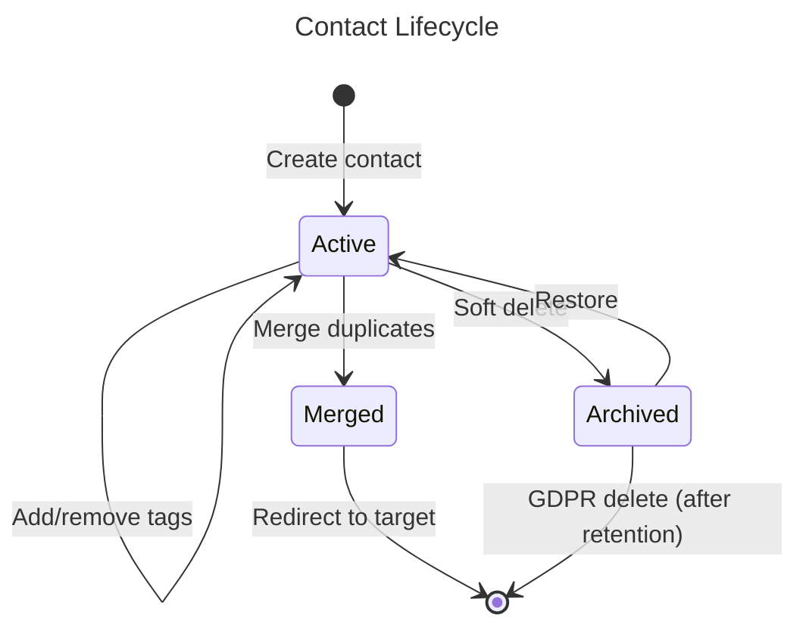
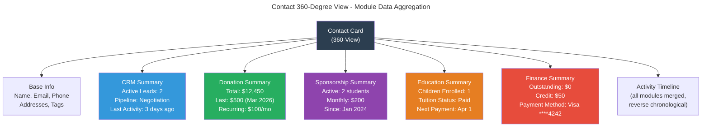

# Module: Contact Management

## Overview
The Contact module provides a **unified contact registry** shared across all Nexora modules. A single person can be a donor, parent, volunteer, vendor, and employee simultaneously — represented as one contact record with multiple type tags. This is the foundation for the 360-degree view: when you open a contact card, you see all interactions across CRM, Donations, Sponsorship, Education, and every other module.

## Domain Model

### Entities

```mermaid
---
title: Contact Module - Entity Relationship Diagram
---
erDiagram
    Contact ||--o{ ContactAddress : "has many"
    Contact ||--o{ ContactTag : "tagged with"
    Contact ||--o{ ContactRelationship : "related to"
    Contact ||--o{ CommunicationPreference : "prefers"
    Contact ||--o{ ContactNote : "has notes"
    Contact ||--o{ ContactCustomField : "has custom fields"
    Contact ||--o{ ConsentRecord : "has consents"
    Contact ||--o{ ContactActivity : "has activities"

    Contact {
        uuid id PK
        uuid organization_id FK
        string type "individual | organization"
        string title "Mr, Mrs, Dr..."
        string first_name
        string last_name
        string display_name "computed"
        string company_name "if type=organization"
        string email
        string phone
        string mobile
        string website
        string tax_id
        string language
        string currency
        string source "web_form, import, manual, api"
        string status "active, archived, merged"
        uuid merged_into_id FK "if merged"
        jsonb metadata
        timestamp created_at
        timestamp updated_at
    }

    ContactAddress {
        uuid id PK
        uuid contact_id FK
        string type "home, work, billing, shipping"
        string street1
        string street2
        string city
        string state
        string postal_code
        string country_code
        boolean is_primary
        float latitude
        float longitude
    }

    Tag ||--o{ ContactTag : "applied to"
    Tag {
        uuid id PK
        uuid tenant_id FK
        string name UK
        string color
        string category "donor, parent, volunteer, vendor, student, staff, ..."
    }

    ContactTag {
        uuid id PK
        uuid contact_id FK
        uuid tag_id FK
        uuid organization_id FK "which org tagged this"
    }

    ContactRelationship {
        uuid id PK
        uuid contact_id FK
        uuid related_contact_id FK
        string relationship_type "parent_of, spouse_of, employee_of, ..."
    }

    CommunicationPreference {
        uuid id PK
        uuid contact_id FK
        string channel "email, sms, whatsapp, phone, mail"
        boolean opted_in
        timestamp opted_in_at
        timestamp opted_out_at
        string opt_in_source "web_form, verbal, written"
    }

    ContactNote {
        uuid id PK
        uuid contact_id FK
        uuid author_user_id FK
        uuid organization_id FK
        string content
        boolean is_pinned
        timestamp created_at
    }

    CustomFieldDefinition ||--o{ ContactCustomField : "defines"
    CustomFieldDefinition {
        uuid id PK
        uuid tenant_id FK
        string field_name
        string field_type "text, number, date, select, multiselect, boolean"
        jsonb options "for select types"
        boolean is_required
        int display_order
    }

    ContactCustomField {
        uuid id PK
        uuid contact_id FK
        uuid field_definition_id FK
        string value
    }

    ConsentRecord {
        uuid id PK
        uuid contact_id FK
        string consent_type "email_marketing, sms_marketing, data_processing"
        boolean granted
        string source "web_form, verbal, written"
        string ip_address
        timestamp granted_at
        timestamp revoked_at
    }

    ContactActivity {
        uuid id PK
        uuid contact_id FK
        uuid organization_id FK
        string module_source "crm, donations, education, ..."
        string activity_type "email_sent, call, meeting, donation, enrollment, ..."
        string summary
        jsonb details
        timestamp occurred_at
    }
```

### Value Objects

| Value Object | Description |
|-------------|-------------|
| `ContactId` | Strongly-typed contact identifier |
| `Email` | Validated email with normalization (lowercase, trim) |
| `PhoneNumber` | E.164 formatted phone number |
| `Address` | Composite: street, city, state, postal, country |
| `GeoCoordinate` | Latitude/longitude pair |
| `ContactName` | First + Last + Display name logic |
| `TagId` | Strongly-typed tag identifier |

### Domain Events

| Event | Trigger | Consumers |
|-------|---------|-----------|
| `ContactCreated` | New contact added | CRM (auto-create lead if source=web), Notifications (welcome) |
| `ContactUpdated` | Contact info changed | Search index refresh, Audit log |
| `ContactMerged` | Duplicate resolved | All modules (update foreign keys), Audit log |
| `ContactArchived` | Soft delete | CRM (close related leads), Audit log |
| `ContactTagAdded` | Tag applied | CRM (segment update), Reporting |
| `ContactTagRemoved` | Tag removed | CRM (segment update), Reporting |
| `ConsentChanged` | Opt-in/out | Notifications (update suppression list) |
| `ContactActivityLogged` | Activity from any module | 360-view refresh |

### Entity Lifecycle

## Use Cases

### UC-CON-001: Create Contact
- **Actor**: User with `contacts.contacts.create` permission, or system (web form, import)
- **Preconditions**: User is in an active organization context
- **Flow**:
  1. Validate required fields (at minimum: first_name + last_name or company_name)
  2. Normalize email (lowercase, trim) and phone (E.164)
  3. Run duplicate detection (email match, phone match, name+address fuzzy match)
  4. If potential duplicates found: return suggestions, let user confirm or merge
  5. If confirmed new: create contact record with `organization_id`
  6. Apply default tags based on source (e.g., web form → "Lead")
  7. Publish `ContactCreated` event
- **Business Rules**:
  - Email uniqueness is **soft** (warn, not block) — same person can have different emails
  - Contacts are visible across organizations within tenant (360-view)
  - Organization-scoped tags determine which org "owns" the relationship
  - Phone numbers stored in E.164 format

### UC-CON-002: 360-Degree View
- **Actor**: User with `contacts.contacts.read` permission
- **Flow**:
  1. Load contact base data
  2. Aggregate activities from all modules (via `ContactActivity` table)
  3. Load related contacts (family, employer, etc.)
  4. Load tags across all organizations user has access to
  5. Load module-specific summaries:
     - CRM: active leads, pipeline stage
     - Donations: total donated, last donation, recurring status
     - Sponsorship: active sponsorships
     - Education: enrolled students (if parent)
     - Finance: outstanding invoices
  6. Return unified view
- **Business Rules**:
  - User only sees activities from organizations they have access to
  - Module summaries only show for installed modules
  - Activities sorted reverse-chronologically

### UC-CON-003: Merge Duplicates
- **Actor**: User with `contacts.contacts.merge` permission
- **Preconditions**: At least 2 contacts identified as duplicates
- **Flow**:
  1. User selects primary (surviving) contact and secondary (to be merged)
  2. System shows field-by-field comparison
  3. User selects which values to keep for conflicting fields
  4. System updates primary contact with selected values
  5. System moves all relationships from secondary to primary:
     - Addresses, tags, notes, activities
     - CRM leads, donations, sponsorships, etc. (via integration events)
  6. Secondary contact status → Merged, `merged_into_id` = primary
  7. Publish `ContactMerged` event (other modules update their FK references)
- **Business Rules**:
  - Merge is irreversible (but audited)
  - All historical data preserved on primary contact
  - Secondary contact kept for redirect purposes (not deleted)

### UC-CON-004: Import Contacts (CSV/Excel)
- **Actor**: User with `contacts.contacts.import` permission
- **Flow**:
  1. User uploads CSV/Excel file
  2. System parses and validates column mapping
  3. System runs duplicate detection per row
  4. System presents preview: new contacts, updates, duplicates
  5. User confirms import strategy (skip duplicates, merge, create all)
  6. System processes import in background (Hangfire job)
  7. System sends notification when complete with summary
- **Business Rules**:
  - Maximum 10,000 contacts per import
  - Required fields validated per row
  - Import is atomic per batch (all or nothing per 100-row chunk)

### UC-CON-005: KVKK/GDPR Data Export & Deletion
- **Actor**: Contact (via portal) or Admin
- **Flow**:
  1. Request data export: system compiles all contact data across modules into JSON/CSV
  2. Request deletion: system anonymizes PII fields, removes consents, archives
  3. Audit log records the compliance action
- **Business Rules**:
  - Data export delivered within 30 days (regulatory requirement)
  - Deletion = anonymization (hash name, remove email/phone, keep aggregate data)
  - Financial records retained per tax law (anonymized but amounts preserved)

## API Endpoints

### Contact CRUD
| Method | Path | Description | Auth |
|--------|------|-------------|------|
| POST | `/api/v1/contacts/contacts` | Create contact | `contacts.contacts.create` |
| GET | `/api/v1/contacts/contacts` | List/search contacts | `contacts.contacts.read` |
| GET | `/api/v1/contacts/contacts/{id}` | Get contact (360-view) | `contacts.contacts.read` |
| PUT | `/api/v1/contacts/contacts/{id}` | Update contact | `contacts.contacts.update` |
| DELETE | `/api/v1/contacts/contacts/{id}` | Archive contact (returns 200 OK with ApiEnvelope) | `contacts.contacts.delete` |
| POST | `/api/v1/contacts/contacts/{id}/restore` | Restore archived | `contacts.contacts.delete` |

### Duplicate & Merge
| Method | Path | Description | Auth |
|--------|------|-------------|------|
| GET | `/api/v1/contacts/contacts/{id}/duplicates` | Find duplicates | `contacts.contacts.read` |
| POST | `/api/v1/contacts/contacts/merge` | Merge contacts | `contacts.contacts.merge` |

### Tags
| Method | Path | Description | Auth |
|--------|------|-------------|------|
| GET | `/api/v1/contacts/tags` | List tags | `contacts.tags.read` |
| POST | `/api/v1/contacts/tags` | Create tag | `contacts.tags.manage` |
| PUT | `/api/v1/contacts/tags/{id}` | Update tag | `contacts.tags.manage` |
| DELETE | `/api/v1/contacts/tags/{id}` | Delete tag (returns 200 OK with ApiEnvelope) | `contacts.tags.manage` |
| POST | `/api/v1/contacts/contacts/{id}/tags` | Add tags to contact | `contacts.contacts.update` |
| DELETE | `/api/v1/contacts/contacts/{id}/tags/{tagId}` | Remove tag (returns 200 OK with ApiEnvelope) | `contacts.contacts.update` |

### Import/Export
| Method | Path | Description | Auth |
|--------|------|-------------|------|
| POST | `/api/v1/contacts/import` | Upload import file | `contacts.contacts.import` |
| GET | `/api/v1/contacts/import/{jobId}` | Check import status | `contacts.contacts.import` |
| POST | `/api/v1/contacts/export` | Request export | `contacts.contacts.export` |

### Relationships
| Method | Path | Description | Auth |
|--------|------|-------------|------|
| GET | `/api/v1/contacts/contacts/{id}/relationships` | List relationships | `contacts.contacts.read` |
| POST | `/api/v1/contacts/contacts/{id}/relationships` | Add relationship | `contacts.contacts.update` |
| DELETE | `/api/v1/contacts/relationships/{id}` | Remove relationship (returns 200 OK with ApiEnvelope) | `contacts.contacts.update` |

### Consent & Compliance
| Method | Path | Description | Auth |
|--------|------|-------------|------|
| GET | `/api/v1/contacts/contacts/{id}/consents` | List consents | `contacts.contacts.read` |
| POST | `/api/v1/contacts/contacts/{id}/consents` | Record consent | `contacts.contacts.update` |
| POST | `/api/v1/contacts/contacts/{id}/gdpr-export` | GDPR data export | `contacts.compliance.manage` |
| POST | `/api/v1/contacts/contacts/{id}/gdpr-delete` | GDPR anonymize | `contacts.compliance.manage` |

## Integration Points

### Events Produced
| Event | Topic | Description |
|-------|-------|-------------|
| `contacts.contact.created` | `nexora.contacts` | New contact created |
| `contacts.contact.updated` | `nexora.contacts` | Contact info changed |
| `contacts.contact.merged` | `nexora.contacts` | Contacts merged (includes old→new ID mapping) |
| `contacts.contact.archived` | `nexora.contacts` | Contact archived |
| `contacts.consent.changed` | `nexora.contacts.consents` | Opt-in/out change |

### Events Consumed
| Event | Source | Action |
|-------|--------|--------|
| `identity.user.created` | Identity | Auto-create or link contact for internal users |
| `identity.organization.created` | Identity | Initialize default tag categories |
| `crm.lead.activity` | CRM | Log activity on contact timeline |
| `donations.donation.confirmed` | Donations | Log activity, update donor summary |
| `education.enrollment.confirmed` | Education | Log activity, update parent/student link |
| `sponsorship.sponsorship.created` | Sponsorship | Log activity on contact timeline |

### 360-View Module Integration

## Data Model Notes

### Duplicate Detection Algorithm
1. **Exact match**: email or phone
2. **Fuzzy match**: Levenshtein distance on (first_name + last_name) < 2
3. **Address match**: Same postal code + similar street name
4. Scored 0-100, threshold for auto-suggestion: 70+

### Cross-Organization Visibility
- Contact base data is tenant-wide (visible across all orgs)
- Tags are org-scoped (IKF's "Major Donor" vs Academy's "VIP Parent")
- Notes are org-scoped (only visible to the org that created them)
- Activities are org-scoped but aggregated in 360-view for users with multi-org access

## Non-Functional Requirements

| Requirement | Target |
|------------|--------|
| Contact search latency | < 200ms (full-text search) |
| 360-view load time | < 500ms |
| Import throughput | 1,000 contacts/minute |
| Duplicate detection | < 100ms per contact |
| Max contacts per tenant | 1,000,000 |
| GDPR export generation | < 5 minutes |
