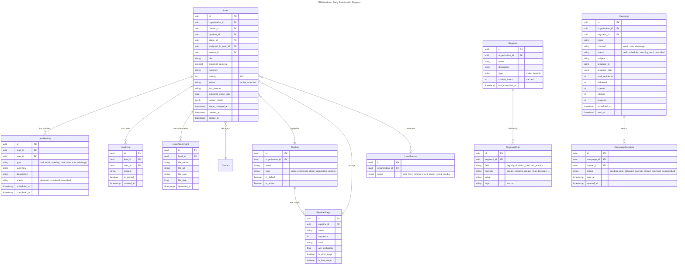
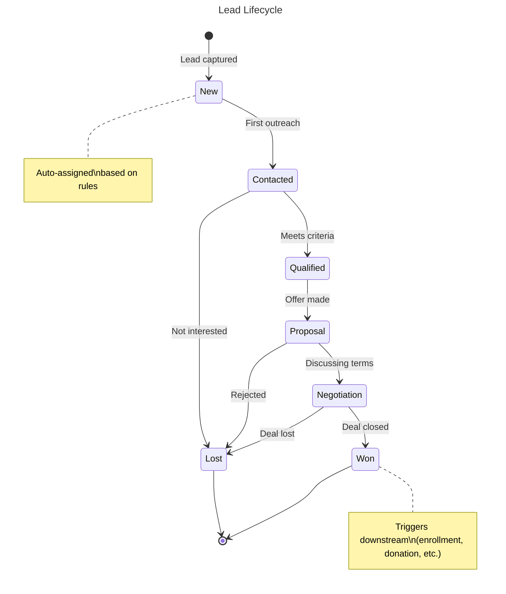
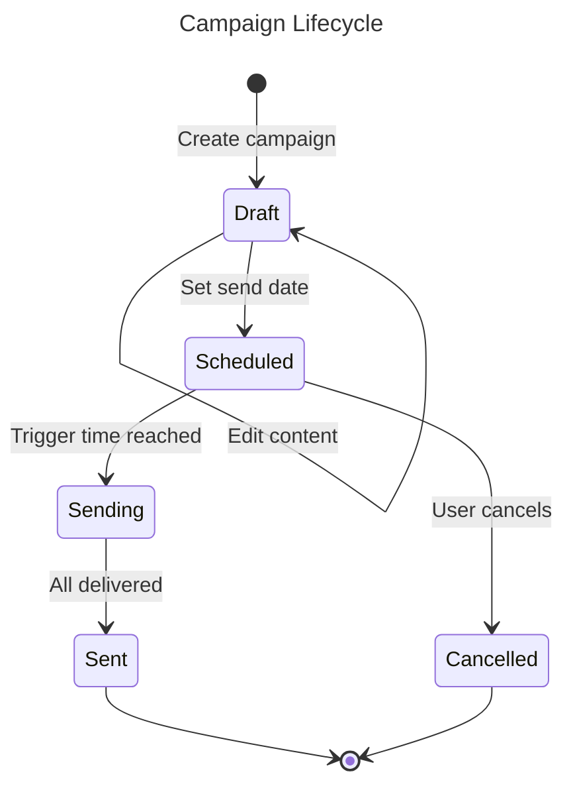
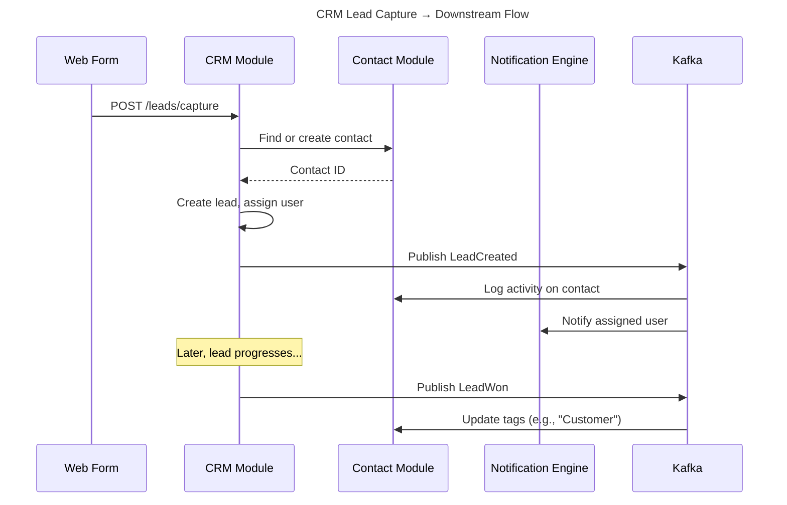

# Module: CRM (Customer Relationship Management)

## Overview
The CRM module manages the full lifecycle of leads, opportunities, and customer relationships. It covers lead capture from multiple sources (web forms, imports, manual entry), customizable sales/enrollment pipelines, activity tracking, segmentation, and marketing campaigns. For NGOs it tracks donor acquisition; for schools it tracks student enrollment; for businesses it tracks sales — all through the same configurable pipeline model.

## Domain Model

### Entities

### Value Objects

| Value Object | Description |
|-------------|-------------|
| `LeadId` | Strongly-typed lead identifier |
| `PipelineId` | Strongly-typed pipeline identifier |
| `StageId` | Strongly-typed stage identifier |
| `Money` | Amount + Currency (expected revenue) |
| `Priority` | Enum: None(0), Low(1), Medium(2), High(3) |
| `LeadStatus` | Enum: Active, Won, Lost |
| `ActivityType` | Enum: Call, Email, Meeting, Task, Note, SMS, WhatsApp |

### Domain Events

| Event | Trigger | Consumers |
|-------|---------|-----------|
| `LeadCreated` | New lead captured | Contacts (log activity), Notifications (notify assignee) |
| `LeadStageChanged` | Lead moves in pipeline | Contacts (log activity), Notifications (if auto-actions configured) |
| `LeadWon` | Lead marked as won | Contacts (update tags), Donations (if donor pipeline), Education (if enrollment) |
| `LeadLost` | Lead marked as lost | Contacts (log activity), Reporting |
| `LeadAssigned` | Lead assigned to user | Notifications (notify new assignee) |
| `ActivityCompleted` | Activity marked done | Contacts (log activity on timeline) |
| `CampaignSent` | Marketing campaign sent | Notifications (dispatch emails/SMS), Reporting |

### Entity Lifecycles

## Use Cases

### UC-CRM-001: Capture Lead from Web Form
- **Actor**: System (web form submission)
- **Flow**:
  1. Web form submits to `/api/v1/crm/leads/capture`
  2. System finds or creates contact (→ Contacts module)
  3. System creates lead in default pipeline at first stage
  4. System applies auto-assignment rules (round-robin, territory, etc.)
  5. System publishes `LeadCreated` event
  6. Assigned user receives notification
- **Business Rules**:
  - Duplicate lead detection: same contact + same pipeline within 30 days = update existing
  - Auto-assignment respects user workload (configurable max leads per user)
  - Source tracked for attribution reporting

### UC-CRM-002: Move Lead Through Pipeline
- **Actor**: User with `crm.leads.write` permission
- **Flow**:
  1. User drags lead to new stage (Kanban) or selects stage
  2. System validates stage transition is allowed
  3. System updates lead stage and `stage_changed_at`
  4. If moved to won stage: prompt for revenue, set status = Won
  5. If moved to lost stage: prompt for lost reason, set status = Lost
  6. Publish `LeadStageChanged` (or `LeadWon`/`LeadLost`) event
- **Business Rules**:
  - Won/Lost leads cannot be moved (must reopen first)
  - Stage change logged in activity history
  - `win_probability` updates on lead card

### UC-CRM-003: Log Activity
- **Actor**: User with `crm.activities.write` permission
- **Flow**:
  1. User logs activity (call, meeting, email, task) on lead
  2. System creates activity record
  3. If type=email: system can send email via Notifications module
  4. If type=call: log with call center integration (click-to-call)
  5. If type=whatsapp: send via WhatsApp Business API
  6. Activity synced to contact timeline (via event)
- **Business Rules**:
  - Activities can be scheduled (future) or logged (past)
  - Overdue activities trigger reminder notifications

### UC-CRM-004: Create & Execute Marketing Campaign
- **Actor**: User with `crm.campaigns.manage` permission
- **Flow**:
  1. User creates campaign: name, channel (email/SMS/WhatsApp), segment
  2. User designs content (template with variables)
  3. System computes segment → recipient list
  4. User reviews and schedules
  5. At scheduled time: system dispatches via Notification Engine
  6. System tracks delivery, opens, clicks in real-time
- **Business Rules**:
  - KVKK/GDPR: only send to contacts with valid consent for channel
  - Unsubscribe link mandatory in all emails
  - Rate limiting: max 1000 emails/hour (configurable)
  - A/B testing support (split segment, compare performance)

### UC-CRM-005: Build Dynamic Segment
- **Actor**: User with `crm.segments.manage` permission
- **Flow**:
  1. User defines rules: tag = "Major Donor" AND city = "Istanbul" AND last_donation > 90 days ago
  2. System evaluates rules against contact database
  3. System shows matching contacts count and preview
  4. Segment auto-refreshes on contact changes (dynamic) or is fixed (static)
- **Business Rules**:
  - Dynamic segments recomputed on access or on schedule
  - Cross-module fields available (donation_total, enrollment_status, etc.)
  - Segments can be used in campaigns, reports, and bulk actions

## API Endpoints

### Leads
| Method | Path | Description | Auth |
|--------|------|-------------|------|
| POST | `/api/v1/crm/leads` | Create lead | `crm.leads.create` |
| POST | `/api/v1/crm/leads/capture` | Capture from web form | Public (rate limited) |
| GET | `/api/v1/crm/leads` | List/search leads | `crm.leads.read` |
| GET | `/api/v1/crm/leads/{id}` | Get lead detail | `crm.leads.read` |
| PUT | `/api/v1/crm/leads/{id}` | Update lead | `crm.leads.write` |
| POST | `/api/v1/crm/leads/{id}/move` | Change pipeline stage | `crm.leads.write` |
| POST | `/api/v1/crm/leads/{id}/assign` | Assign to user | `crm.leads.assign` |
| POST | `/api/v1/crm/leads/{id}/won` | Mark as won | `crm.leads.write` |
| POST | `/api/v1/crm/leads/{id}/lost` | Mark as lost | `crm.leads.write` |
| POST | `/api/v1/crm/leads/{id}/reopen` | Reopen closed lead | `crm.leads.write` |
| DELETE | `/api/v1/crm/leads/{id}` | Archive lead | `crm.leads.delete` |

### Activities
| Method | Path | Description | Auth |
|--------|------|-------------|------|
| POST | `/api/v1/crm/leads/{id}/activities` | Log activity | `crm.activities.write` |
| GET | `/api/v1/crm/leads/{id}/activities` | List activities | `crm.activities.read` |
| PUT | `/api/v1/crm/activities/{id}` | Update activity | `crm.activities.write` |
| POST | `/api/v1/crm/activities/{id}/complete` | Mark complete | `crm.activities.write` |

### Pipelines
| Method | Path | Description | Auth |
|--------|------|-------------|------|
| GET | `/api/v1/crm/pipelines` | List pipelines | `crm.pipelines.read` |
| POST | `/api/v1/crm/pipelines` | Create pipeline | `crm.pipelines.manage` |
| PUT | `/api/v1/crm/pipelines/{id}` | Update pipeline | `crm.pipelines.manage` |
| GET | `/api/v1/crm/pipelines/{id}/kanban` | Get Kanban view | `crm.leads.read` |

### Segments
| Method | Path | Description | Auth |
|--------|------|-------------|------|
| POST | `/api/v1/crm/segments` | Create segment | `crm.segments.manage` |
| GET | `/api/v1/crm/segments` | List segments | `crm.segments.read` |
| GET | `/api/v1/crm/segments/{id}` | Get segment with contacts | `crm.segments.read` |
| PUT | `/api/v1/crm/segments/{id}` | Update segment rules | `crm.segments.manage` |

### Campaigns
| Method | Path | Description | Auth |
|--------|------|-------------|------|
| POST | `/api/v1/crm/campaigns` | Create campaign | `crm.campaigns.manage` |
| GET | `/api/v1/crm/campaigns` | List campaigns | `crm.campaigns.read` |
| GET | `/api/v1/crm/campaigns/{id}` | Get campaign detail | `crm.campaigns.read` |
| PUT | `/api/v1/crm/campaigns/{id}` | Update campaign | `crm.campaigns.manage` |
| POST | `/api/v1/crm/campaigns/{id}/schedule` | Schedule send | `crm.campaigns.manage` |
| POST | `/api/v1/crm/campaigns/{id}/cancel` | Cancel campaign | `crm.campaigns.manage` |
| GET | `/api/v1/crm/campaigns/{id}/analytics` | Campaign analytics | `crm.campaigns.read` |

## Integration Points

### Events Produced
| Event | Topic |
|-------|-------|
| `crm.lead.created` | `nexora.crm.leads` |
| `crm.lead.stage_changed` | `nexora.crm.leads` |
| `crm.lead.won` | `nexora.crm.leads` |
| `crm.lead.lost` | `nexora.crm.leads` |
| `crm.lead.assigned` | `nexora.crm.leads` |
| `crm.activity.completed` | `nexora.crm.activities` |
| `crm.campaign.sent` | `nexora.crm.campaigns` |

### Events Consumed
| Event | Source | Action |
|-------|--------|--------|
| `contacts.contact.created` | Contacts | Auto-create lead if source matches pipeline rules |
| `contacts.contact.merged` | Contacts | Update contact_id references on leads |
| `donations.donation.confirmed` | Donations | Update lead expected_revenue (donor pipeline) |
| `education.enrollment.confirmed` | Education | Mark enrollment lead as Won |

### Module Interaction Flow

## Non-Functional Requirements

| Requirement | Target |
|------------|--------|
| Kanban board load | < 300ms |
| Lead search | < 200ms |
| Campaign dispatch | 1,000 messages/minute |
| Max leads per org | 500,000 |
| Max pipelines per org | 20 |
| Activity log retention | Unlimited |
| Segment computation | < 5 seconds for 100k contacts |
