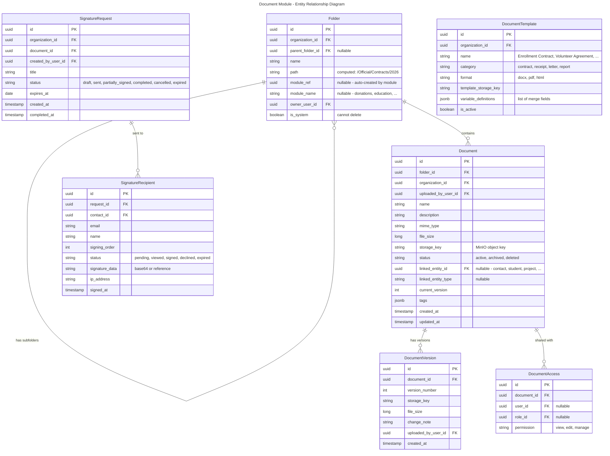
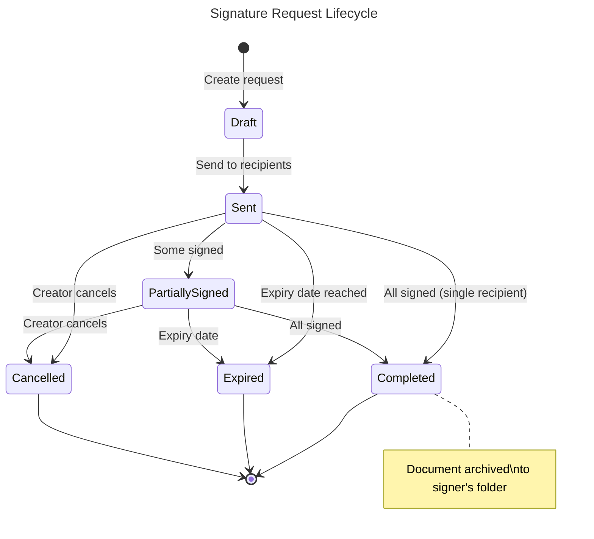

# Module: Document Management

## Overview
The Document module provides centralized file storage, organization, digital signatures, and document templates across all Nexora modules. It handles contract signing (enrollment agreements, vendor contracts), receipt archival, official document scanning, and a knowledge base for institutional memory. Files are stored in MinIO (S3-compatible) with tenant-isolated buckets.

## Domain Model

### Entities

### Entity Lifecycles

## Use Cases

### UC-DOC-001: Upload & Organize Document
- **Actor**: User with `documents.documents.upload` permission
- **Flow**:
  1. User uploads file (drag & drop or file picker)
  2. System stores in MinIO: `{tenant}/{org}/{folder_path}/{uuid}_{filename}`
  3. System creates Document record with metadata
  4. Optionally link to entity (contact, student, project)
  5. Document appears in folder and on linked entity's document tab
- **Business Rules**:
  - Max file size: 50MB (configurable)
  - Allowed types: configurable per organization
  - Virus scanning on upload (ClamAV integration)
  - Version control: re-upload creates new version, old versions retained

### UC-DOC-002: Digital Signature (e-Sign)
- **Actor**: User with `documents.signatures.create` permission
- **Flow**:
  1. User uploads or selects document for signing
  2. User defines recipients (contacts) and signing order
  3. System sends email to first recipient with secure signing link
  4. Recipient views document, draws/types signature, submits
  5. Next recipient in order receives email (if sequential signing)
  6. When all signed: status → Completed
  7. Signed document with audit trail archived to folder
  8. All parties receive final signed copy via email
- **Business Rules**:
  - Signatures legally binding (timestamp, IP, identity verification)
  - Expiry: configurable (default 7 days)
  - Signing order: sequential or parallel
  - Reminder emails: auto-send every 2 days if unsigned

### UC-DOC-003: Generate Document from Template
- **Actor**: User or system (automated)
- **Flow**:
  1. Select template (e.g., "Enrollment Contract")
  2. Provide variables (student name, tuition amount, date)
  3. System renders document (HTML → PDF or DOCX merge)
  4. Document saved to target folder
  5. Optionally sent for signature
- **Business Rules**:
  - Templates support merge fields: `{{student.name}}`, `{{tuition.amount}}`
  - PDF rendering via wkhtmltopdf or Puppeteer
  - Auto-generation triggered by events (e.g., enrollment accepted → generate contract)

## API Endpoints

| Method | Path | Description | Auth |
|--------|------|-------------|------|
| POST | `/api/v1/documents/documents` | Upload document | `documents.documents.upload` |
| GET | `/api/v1/documents/documents` | List/search documents | `documents.documents.read` |
| GET | `/api/v1/documents/documents/{id}` | Get metadata | `documents.documents.read` |
| GET | `/api/v1/documents/documents/{id}/download` | Download file | `documents.documents.read` |
| DELETE | `/api/v1/documents/documents/{id}` | Archive | `documents.documents.delete` |
| GET | `/api/v1/documents/folders` | List folders | `documents.folders.read` |
| POST | `/api/v1/documents/folders` | Create folder | `documents.folders.manage` |
| POST | `/api/v1/documents/signatures` | Create sign request | `documents.signatures.create` |
| GET | `/api/v1/documents/signatures/{id}` | Get sign status | `documents.signatures.read` |
| POST | `/api/v1/documents/signatures/{id}/sign` | Sign document | Recipient token |
| POST | `/api/v1/documents/templates/{id}/render` | Render template | `documents.templates.use` |
| GET | `/api/v1/documents/templates` | List templates | `documents.templates.read` |
| POST | `/api/v1/documents/templates` | Create template | `documents.templates.manage` |

## Integration Points

### Events Produced
| Event | Topic |
|-------|-------|
| `documents.document.uploaded` | `nexora.documents` |
| `documents.document.signed` | `nexora.documents.signatures` |
| `documents.signature.completed` | `nexora.documents.signatures` |

### Events Consumed
| Event | Source | Action |
|-------|--------|--------|
| `education.enrollment.accepted` | Education | Auto-generate enrollment contract, send for signature |
| `donations.donation.confirmed` | Donations | Archive receipt PDF to donor's folder |
| `hr.contract.created` | HR | Generate employment contract template |

## Non-Functional Requirements

| Requirement | Target |
|------------|--------|
| Upload throughput | 100MB/s |
| Max file size | 50MB (configurable) |
| Storage per tenant | Unlimited (billed) |
| Signature page load | < 2 seconds |
| PDF generation | < 10 seconds |
| Max document versions | 100 per document |
