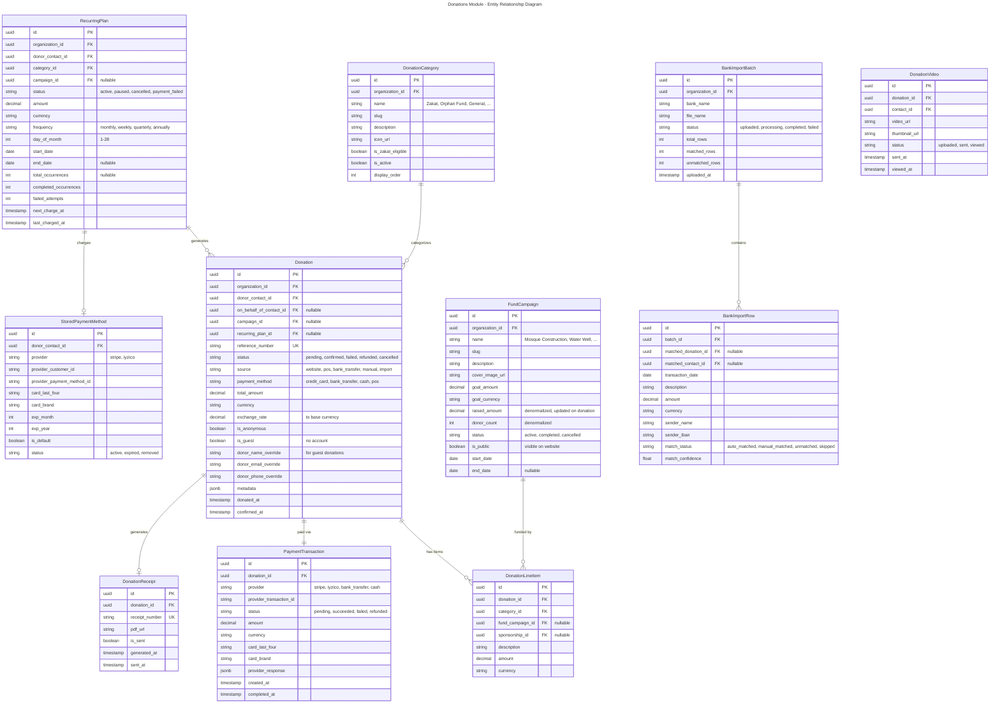
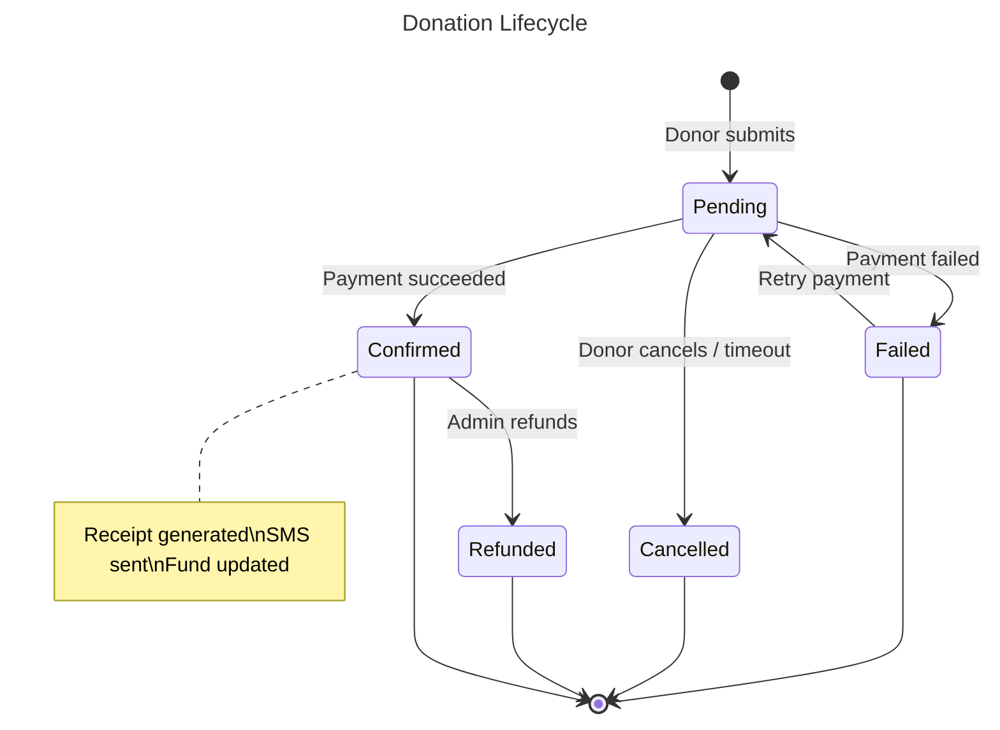
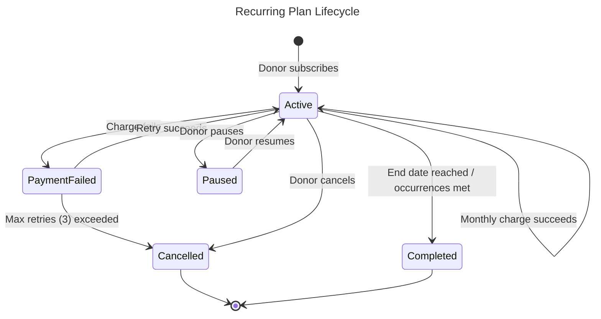
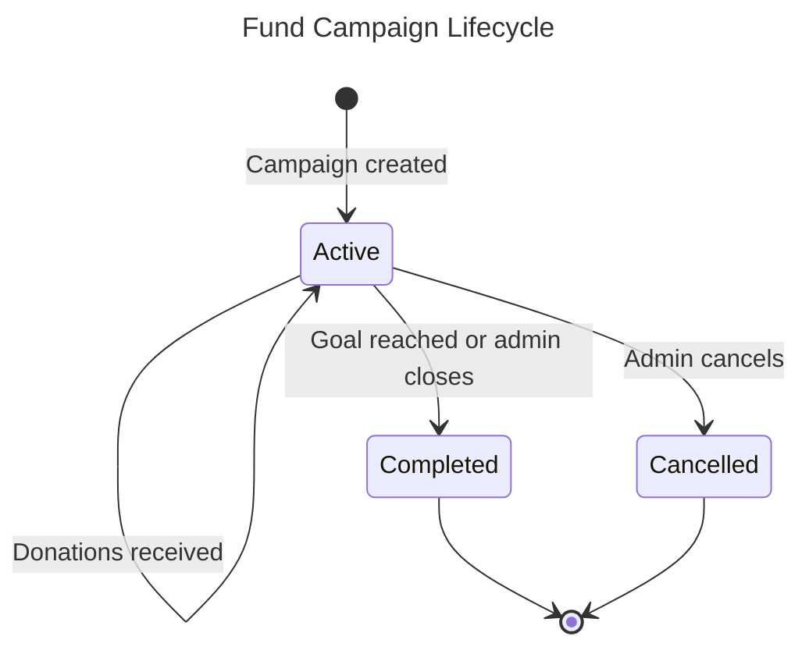
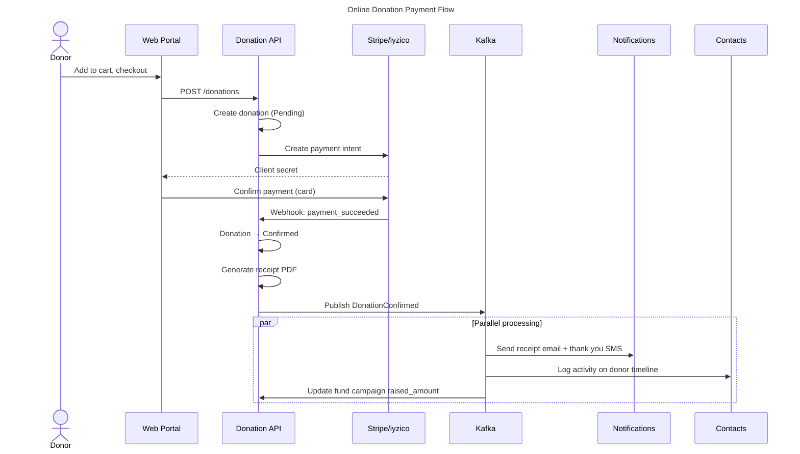

# Module: Donations & Fundraising

## Overview
The Donations module is the core revenue engine for non-profit organizations. It handles online and offline donation collection, recurring giving (standing orders), campaign/fund tracking, multi-currency support, automatic receipt generation, donor matching from bank transfers, and a self-service donor portal. Designed to handle high-traffic periods (Ramadan, Qurban season) with Stripe and local payment provider (iyzico) integration.

## Domain Model

### Entities

### Value Objects

| Value Object | Description |
|-------------|-------------|
| `DonationId` | Strongly-typed donation identifier |
| `Money` | Amount + Currency |
| `ReferenceNumber` | Auto-generated unique donation reference (e.g., `DON-2026-00001`) |
| `ReceiptNumber` | Sequential per organization per year |
| `Frequency` | Enum: Weekly, Monthly, Quarterly, Annually |
| `DonationStatus` | Enum: Pending, Confirmed, Failed, Refunded, Cancelled |

### Domain Events

| Event | Trigger | Consumers |
|-------|---------|-----------|
| `DonationCreated` | Donation initiated | — |
| `DonationConfirmed` | Payment successful | Contacts (log activity, update donor tag), Notifications (send receipt + thank you SMS), FundCampaign (update raised amount), Sponsorship (if linked) |
| `DonationFailed` | Payment failed | Notifications (alert donor), RecurringPlan (increment failed attempts) |
| `DonationRefunded` | Admin refunds | Finance (journal entry), Contacts (log activity) |
| `RecurringPlanCreated` | Donor sets up recurring | Contacts (tag: Recurring Donor) |
| `RecurringPlanCancelled` | Donor or system cancels | Contacts (remove recurring tag), Notifications (confirm cancellation) |
| `RecurringChargeProcessed` | Monthly charge runs | Creates new Donation, triggers DonationConfirmed flow |
| `BankImportCompleted` | Bank file processed | Notifications (alert finance team of unmatched rows) |
| `FundCampaignGoalReached` | Raised >= Goal | Notifications (alert admin, donors) |

### Entity Lifecycles

## Use Cases

### UC-DON-001: Make Online Donation (Guest or Authenticated)
- **Actor**: Donor (public website visitor or authenticated portal user)
- **Flow**:
  1. Donor browses donation categories on website
  2. Donor adds items to donation cart (e.g., Zakat $500, Orphan Fund $100)
  3. Donor optionally selects a fund campaign
  4. Donor optionally marks "on behalf of" another person
  5. Donor selects currency (TL, USD, EUR)
  6. Donor proceeds to checkout:
     - Guest: enters name, email, phone
     - Authenticated: pre-filled from profile
  7. Donor selects payment method and completes payment (Stripe/iyzico)
  8. System creates Donation with line items
  9. Payment webhook confirms → status = Confirmed
  10. System generates receipt, sends thank-you email + SMS
  11. System updates fund campaign raised amount
  12. Activity logged on contact timeline
- **Business Rules**:
  - Minimum donation: $1 / 10 TL (configurable)
  - Multi-currency: amount stored in original currency + exchange rate to base
  - Guest donations create/link contact with minimal info
  - Cart supports multiple categories in one transaction

### UC-DON-002: Set Up Recurring Donation
- **Actor**: Authenticated donor
- **Flow**:
  1. Donor selects category and amount
  2. Donor selects frequency (monthly, weekly, etc.) and day of month
  3. Donor saves payment method (card tokenized via Stripe/iyzico)
  4. System creates RecurringPlan and StoredPaymentMethod
  5. First charge processed immediately
  6. Subsequent charges processed by Hangfire scheduled job
- **Business Rules**:
  - Card stored as token (PCI compliant — no raw card data)
  - Failed charges retried 3 times (day 1, day 3, day 7)
  - After 3 failures: plan cancelled, donor notified
  - Donor can pause/cancel from portal anytime

### UC-DON-003: Bank Transfer Import & Matching
- **Actor**: Finance staff with `donations.bank.import` permission
- **Flow**:
  1. Staff uploads bank statement (CSV/Excel/MT940)
  2. System parses rows: date, description, amount, sender name, IBAN
  3. Auto-matching algorithm runs:
     - Match by IBAN → known donor
     - Match by name similarity (Levenshtein) → candidate donors
     - Match by amount → existing pending donation
  4. Staff reviews matches, confirms or manually matches unmatched rows
  5. Confirmed matches create Donation records (source: bank_transfer)
  6. System sends SMS to matched donors: "Your donation of X received, thank you"
- **Business Rules**:
  - Auto-match confidence threshold: 85% (configurable)
  - Same IBAN always maps to same contact (learned)
  - Duplicate detection: same IBAN + same amount + same date = skip

### UC-DON-004: Send Donation Video to Donor
- **Actor**: Staff with `donations.videos.manage` permission
- **Flow**:
  1. Staff uploads video (e.g., Qurban sacrifice video)
  2. Staff links video to donation(s) — bulk linking supported
  3. System sends SMS with video link to donor
  4. Donor clicks link → views video on portal
  5. System tracks: sent, viewed
- **Business Rules**:
  - Videos stored in MinIO, served via CDN
  - View tracking via unique token per donor
  - Bulk Qurban video linking: match by donation category + date range

### UC-DON-005: Zakat Calculator
- **Actor**: Public website visitor
- **Flow**:
  1. Visitor fills in asset form (cash, gold, stocks, property, debts)
  2. System calculates Nisab threshold and 2.5% zakat amount
  3. Visitor can directly donate calculated amount
- **Business Rules**:
  - Gold/silver prices fetched from API (cached daily)
  - Nisab threshold calculated dynamically
  - Result shown in visitor's selected currency

## API Endpoints

### Donations
| Method | Path | Description | Auth |
|--------|------|-------------|------|
| POST | `/api/v1/donations/donations` | Create donation | Public (rate limited) |
| GET | `/api/v1/donations/donations` | List donations | `donations.donations.read` |
| GET | `/api/v1/donations/donations/{id}` | Get donation detail | `donations.donations.read` |
| POST | `/api/v1/donations/donations/{id}/refund` | Refund donation | `donations.donations.refund` |
| POST | `/api/v1/donations/donations/manual` | Record manual donation | `donations.donations.create` |
| GET | `/api/v1/donations/donations/{id}/receipt` | Download receipt PDF | `donations.donations.read` |

### Recurring Plans
| Method | Path | Description | Auth |
|--------|------|-------------|------|
| POST | `/api/v1/donations/recurring` | Create recurring plan | Authenticated (portal) |
| GET | `/api/v1/donations/recurring` | List plans | `donations.recurring.read` |
| GET | `/api/v1/donations/recurring/{id}` | Get plan detail | `donations.recurring.read` |
| POST | `/api/v1/donations/recurring/{id}/pause` | Pause plan | Owner or `donations.recurring.manage` |
| POST | `/api/v1/donations/recurring/{id}/resume` | Resume plan | Owner or `donations.recurring.manage` |
| POST | `/api/v1/donations/recurring/{id}/cancel` | Cancel plan | Owner or `donations.recurring.manage` |

### Fund Campaigns
| Method | Path | Description | Auth |
|--------|------|-------------|------|
| POST | `/api/v1/donations/campaigns` | Create campaign | `donations.campaigns.manage` |
| GET | `/api/v1/donations/campaigns` | List campaigns | `donations.campaigns.read` |
| GET | `/api/v1/donations/campaigns/{id}` | Get campaign detail | Public (if is_public) |
| PUT | `/api/v1/donations/campaigns/{id}` | Update campaign | `donations.campaigns.manage` |
| GET | `/api/v1/donations/campaigns/{id}/progress` | Get funding progress | Public (if is_public) |

### Categories
| Method | Path | Description | Auth |
|--------|------|-------------|------|
| GET | `/api/v1/donations/categories` | List categories | Public |
| POST | `/api/v1/donations/categories` | Create category | `donations.categories.manage` |
| PUT | `/api/v1/donations/categories/{id}` | Update category | `donations.categories.manage` |

### Bank Import
| Method | Path | Description | Auth |
|--------|------|-------------|------|
| POST | `/api/v1/donations/bank-imports` | Upload bank statement | `donations.bank.import` |
| GET | `/api/v1/donations/bank-imports/{batchId}` | Get import results | `donations.bank.import` |
| POST | `/api/v1/donations/bank-imports/{batchId}/confirm` | Confirm matches | `donations.bank.import` |

### Donor Portal
| Method | Path | Description | Auth |
|--------|------|-------------|------|
| GET | `/api/v1/donations/portal/my-donations` | My donation history | Portal auth |
| GET | `/api/v1/donations/portal/my-recurring` | My recurring plans | Portal auth |
| GET | `/api/v1/donations/portal/my-receipts` | My receipts | Portal auth |
| GET | `/api/v1/donations/portal/my-videos` | My donation videos | Portal auth |
| GET | `/api/v1/donations/portal/my-sponsorships` | My sponsorships | Portal auth |

### Reports
| Method | Path | Description | Auth |
|--------|------|-------------|------|
| GET | `/api/v1/donations/reports/monthly` | Monthly donation report | `donations.reports.read` |
| GET | `/api/v1/donations/reports/daily` | Daily totals | `donations.reports.read` |
| GET | `/api/v1/donations/reports/yoy` | Year-over-year comparison | `donations.reports.read` |
| GET | `/api/v1/donations/reports/top-campaigns` | Top campaigns | `donations.reports.read` |
| GET | `/api/v1/donations/reports/donor-count` | Donor count (detailed) | `donations.reports.read` |
| GET | `/api/v1/donations/reports/staff-receipts` | Staff receipt report | `donations.reports.read` |

### Webhooks
| Method | Path | Description | Auth |
|--------|------|-------------|------|
| POST | `/api/v1/donations/webhooks/stripe` | Stripe payment webhook | Stripe signature |
| POST | `/api/v1/donations/webhooks/iyzico` | iyzico payment webhook | iyzico signature |

### Tools
| Method | Path | Description | Auth |
|--------|------|-------------|------|
| POST | `/api/v1/donations/tools/zakat-calculator` | Calculate zakat | Public |

## Integration Points

### Events Produced
| Event | Topic |
|-------|-------|
| `donations.donation.created` | `nexora.donations` |
| `donations.donation.confirmed` | `nexora.donations` |
| `donations.donation.failed` | `nexora.donations` |
| `donations.donation.refunded` | `nexora.donations` |
| `donations.recurring.created` | `nexora.donations.recurring` |
| `donations.recurring.cancelled` | `nexora.donations.recurring` |
| `donations.campaign.goal_reached` | `nexora.donations.campaigns` |
| `donations.bank_import.completed` | `nexora.donations.bank` |

### Events Consumed
| Event | Source | Action |
|-------|--------|--------|
| `contacts.contact.merged` | Contacts | Update donor_contact_id references |
| `identity.organization.created` | Identity | Seed default donation categories |

### Payment Flow

## Non-Functional Requirements

| Requirement | Target |
|------------|--------|
| Donation submission latency | < 1 second (excl. payment provider) |
| Payment webhook processing | < 3 seconds |
| Receipt PDF generation | < 5 seconds |
| Bank import processing | 1,000 rows/minute |
| Peak load (Ramadan) | 100 donations/minute |
| Recurring job reliability | 99.9% (retry on failure) |
| Max donations per tenant | 10,000,000 |
| Donor portal page load | < 500ms |
