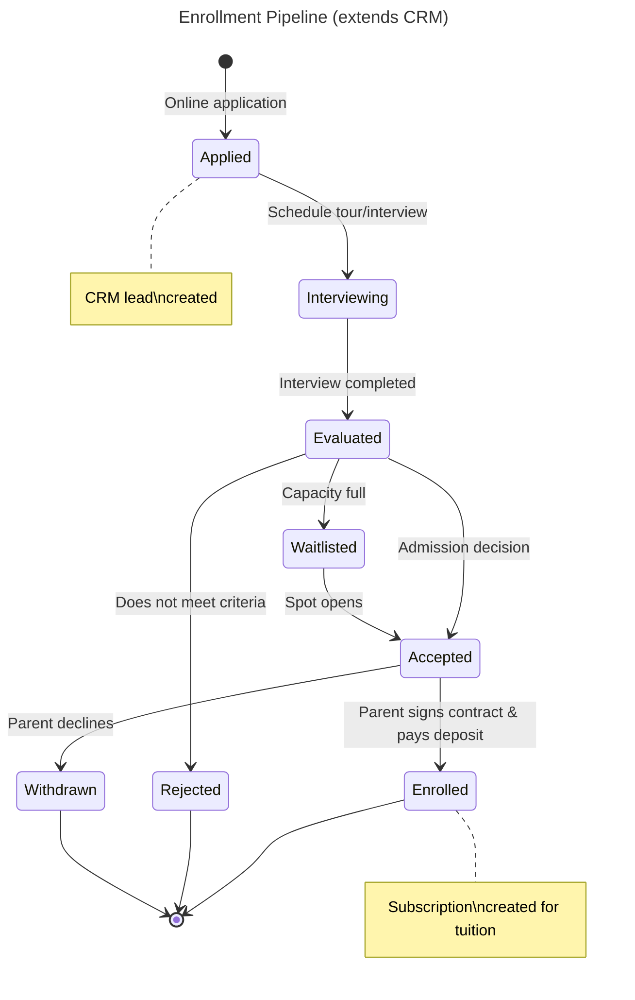
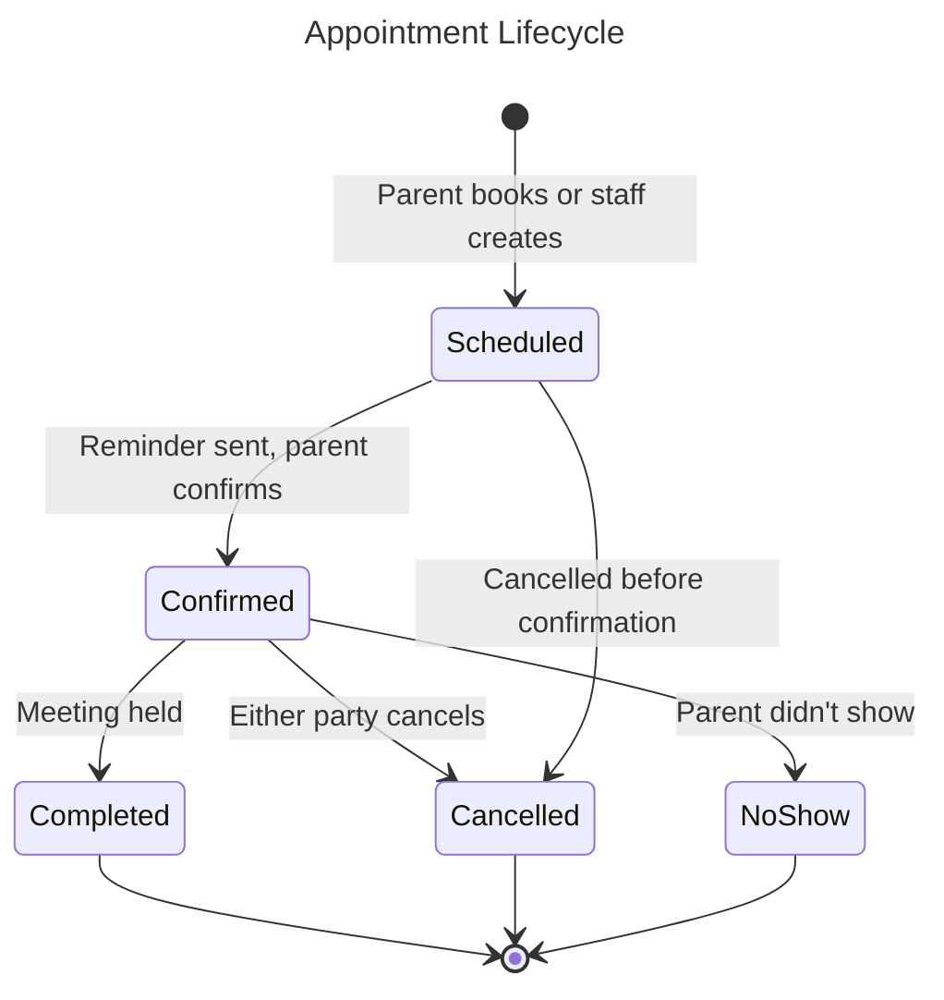
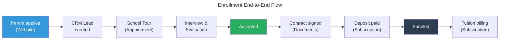

# Module: Education Management

## Overview
The Education module extends the CRM pipeline into a full **student enrollment and academic operations** system. It covers the entire journey: from inquiry (CRM lead) → school tour → interview → evaluation → acceptance → enrollment → ongoing academic operations. It manages student records, parent relationships, tuition billing (via Subscription module), academic calendar, appointments, and accreditation tracking.

## Domain Model

### Entities

```mermaid
---
title: Education Module - Entity Relationship Diagram
---
erDiagram
    AcademicYear ||--o{ AcademicTerm : "divided into"
    AcademicYear {
        uuid id PK
        uuid organization_id FK
        string name "2025-2026"
        date start_date
        date end_date
        boolean is_current
    }

    AcademicTerm {
        uuid id PK
        uuid academic_year_id FK
        string name "Fall, Spring, Summer"
        date start_date
        date end_date
    }

    GradeLevel ||--o{ Classroom : "has classrooms"
    GradeLevel {
        uuid id PK
        uuid organization_id FK
        string name "Grade 1, Grade 2, ..., Grade 12"
        int sequence
        int capacity
    }

    Classroom {
        uuid id PK
        uuid grade_level_id FK
        string name "1-A, 1-B"
        int capacity
        uuid homeroom_teacher_id FK "nullable"
    }

    Student ||--o{ Enrollment : "enrollments"
    Student ||--o{ StudentGuardian : "guardians"
    Student {
        uuid id PK
        uuid contact_id FK "links to Contacts module"
        uuid organization_id FK
        string student_number UK
        date date_of_birth
        string gender
        string nationality
        string blood_type
        string medical_notes
        string dietary_restrictions
        uuid current_classroom_id FK "nullable"
        string status "applicant, enrolled, withdrawn, graduated, alumni"
        string photo_url
        jsonb emergency_contacts
    }

    StudentGuardian {
        uuid id PK
        uuid student_id FK
        uuid guardian_contact_id FK "Contacts module"
        string relationship "mother, father, guardian, grandparent"
        boolean is_primary
        boolean has_pickup_permission
        boolean receives_notifications
    }

    Enrollment {
        uuid id PK
        uuid student_id FK
        uuid academic_year_id FK
        uuid grade_level_id FK
        uuid classroom_id FK "nullable, assigned later"
        uuid lead_id FK "CRM lead that converted"
        string status "applied, interviewing, evaluated, accepted, waitlisted, enrolled, rejected, withdrawn"
        date applied_at
        date accepted_at
        date enrolled_at
        decimal tuition_amount
        string currency
        uuid subscription_id FK "Subscription module"
        jsonb application_data "form responses"
        string rejection_reason
    }

    Appointment {
        uuid id PK
        uuid organization_id FK
        string type "school_tour, parent_teacher, interview, counseling"
        uuid requester_contact_id FK "parent/guardian"
        uuid staff_user_id FK
        uuid student_id FK "nullable"
        string status "scheduled, confirmed, completed, cancelled, no_show"
        datetime start_time
        datetime end_time
        string location "room name or virtual link"
        string notes
        string calendar_event_id "external calendar sync ID"
    }

    StaffAvailability {
        uuid id PK
        uuid user_id FK
        int day_of_week "0-6"
        time start_time
        time end_time
        boolean is_available
    }

    CalendarEvent {
        uuid id PK
        uuid organization_id FK
        string title
        string type "exam, holiday, event, fire_drill, inspection, ceremony"
        date start_date
        date end_date
        boolean is_all_day
        boolean is_recurring
        string recurrence_rule "RRULE"
        string description
        string color
    }

    AccreditationTask {
        uuid id PK
        uuid organization_id FK
        string title "Fire Drill Q1, Inspection Prep, ..."
        string description
        string frequency "quarterly, annually, monthly"
        date next_due_date
        date last_completed_date
        uuid assigned_to_user_id FK
        string status "pending, completed, overdue"
    }

    SummerCamp {
        uuid id PK
        uuid organization_id FK
        string name
        date start_date
        date end_date
        int capacity
        decimal fee
        string currency
        string status "registration_open, full, in_progress, completed"
    }

    SummerCamp ||--o{ SummerCampRegistration : "has registrations"
    SummerCampRegistration {
        uuid id PK
        uuid camp_id FK
        uuid student_id FK
        uuid guardian_contact_id FK
        string status "registered, confirmed, cancelled"
        timestamp registered_at
    }

    Student }o--|| Contact : "linked to"
    StudentGuardian }o--|| Contact : "guardian is"
```

### Entity Lifecycles

## Use Cases

### UC-EDU-001: Online Student Application
- **Actor**: Parent (via public website)
- **Flow**:
  1. Parent fills online application form (student info, guardian info, grade level)
  2. System creates Contact records (parent + student) via Contacts module
  3. System creates CRM Lead (enrollment pipeline)
  4. System creates Student (status: Applicant) and Enrollment (status: Applied)
  5. Parent receives confirmation email with application reference
  6. Admission team notified of new application
- **Business Rules**:
  - Application form configurable per organization (custom fields via JSONB)
  - Duplicate detection on student name + DOB + guardian phone

### UC-EDU-002: Book School Tour
- **Actor**: Parent (via website or portal)
- **Flow**:
  1. Parent views available tour slots (based on StaffAvailability)
  2. Parent selects slot, provides contact info
  3. System creates Appointment (type: school_tour)
  4. System sends confirmation email with calendar invite (.ics)
  5. System syncs to staff's Outlook/Google Calendar (via CalDAV/API)
  6. Day-before reminder sent to parent and staff
- **Business Rules**:
  - Tour slots: configurable duration (30/60 min), max bookings per slot
  - Calendar sync: bidirectional (cancellation in Outlook → cancels in Nexora)

### UC-EDU-003: Enrollment Conversion
- **Actor**: Admission staff with `education.enrollments.manage` permission
- **Flow**:
  1. After interview and evaluation, staff updates enrollment status → Accepted
  2. System sends acceptance notification to parent
  3. Parent receives enrollment contract (via Documents/Sign module)
  4. Parent signs digitally and pays deposit
  5. Enrollment status → Enrolled
  6. System creates Subscription in Subscription module (tuition billing)
  7. CRM Lead → Won
  8. Student assigned to classroom
- **Business Rules**:
  - Acceptance expires after 14 days (configurable)
  - Deposit amount configurable per grade level
  - Subscription auto-created based on tuition amount and payment plan

### UC-EDU-004: Academic Calendar Management
- **Actor**: Admin with `education.calendar.manage` permission
- **Flow**:
  1. Admin creates academic year and terms
  2. Admin adds events: exams, holidays, ceremonies, fire drills
  3. Recurring events auto-generated (e.g., quarterly fire drills)
  4. Calendar visible to staff (admin portal) and parents (portal)
  5. Accreditation tasks tracked with due dates and reminders

### UC-EDU-005: Parent-Teacher Appointment
- **Actor**: Parent (via portal)
- **Flow**:
  1. Parent selects teacher and available slot
  2. System creates appointment
  3. Both parties receive confirmation + calendar invite
  4. After meeting: teacher can add notes

## API Endpoints

### Students
| Method | Path | Description | Auth |
|--------|------|-------------|------|
| POST | `/api/v1/education/students` | Register student | `education.students.create` |
| GET | `/api/v1/education/students` | List students | `education.students.read` |
| GET | `/api/v1/education/students/{id}` | Get student detail | `education.students.read` |
| PUT | `/api/v1/education/students/{id}` | Update student | `education.students.update` |

### Enrollments
| Method | Path | Description | Auth |
|--------|------|-------------|------|
| POST | `/api/v1/education/enrollments/apply` | Online application | Public (rate limited) |
| GET | `/api/v1/education/enrollments` | List enrollments | `education.enrollments.read` |
| GET | `/api/v1/education/enrollments/{id}` | Get enrollment | `education.enrollments.read` |
| POST | `/api/v1/education/enrollments/{id}/accept` | Accept student | `education.enrollments.manage` |
| POST | `/api/v1/education/enrollments/{id}/reject` | Reject student | `education.enrollments.manage` |
| POST | `/api/v1/education/enrollments/{id}/enroll` | Finalize enrollment | `education.enrollments.manage` |
| POST | `/api/v1/education/enrollments/{id}/withdraw` | Withdraw | `education.enrollments.manage` |

### Appointments
| Method | Path | Description | Auth |
|--------|------|-------------|------|
| POST | `/api/v1/education/appointments` | Book appointment | Public or Portal auth |
| GET | `/api/v1/education/appointments` | List appointments | `education.appointments.read` |
| GET | `/api/v1/education/appointments/available-slots` | Get available slots | Public |
| POST | `/api/v1/education/appointments/{id}/cancel` | Cancel | Owner or `education.appointments.manage` |
| POST | `/api/v1/education/appointments/{id}/complete` | Mark complete | `education.appointments.manage` |

### Calendar
| Method | Path | Description | Auth |
|--------|------|-------------|------|
| GET | `/api/v1/education/calendar/events` | List events | `education.calendar.read` |
| POST | `/api/v1/education/calendar/events` | Create event | `education.calendar.manage` |
| GET | `/api/v1/education/academic-years` | List academic years | `education.calendar.read` |
| POST | `/api/v1/education/academic-years` | Create academic year | `education.calendar.manage` |

### Portal (Parent)
| Method | Path | Description | Auth |
|--------|------|-------------|------|
| GET | `/api/v1/education/portal/my-children` | My children | Portal auth |
| GET | `/api/v1/education/portal/my-children/{id}` | Child detail | Portal auth |
| GET | `/api/v1/education/portal/calendar` | School calendar | Portal auth |
| GET | `/api/v1/education/portal/my-appointments` | My appointments | Portal auth |

## Integration Points

### Events Produced
| Event | Topic |
|-------|-------|
| `education.application.submitted` | `nexora.education` |
| `education.enrollment.accepted` | `nexora.education` |
| `education.enrollment.enrolled` | `nexora.education` |
| `education.enrollment.withdrawn` | `nexora.education` |
| `education.appointment.booked` | `nexora.education.appointments` |

### Events Consumed
| Event | Source | Action |
|-------|--------|--------|
| `crm.lead.won` | CRM | Mark enrollment as enrolled (if enrollment pipeline) |
| `contacts.contact.merged` | Contacts | Update student/guardian contact references |
| `subscription.payment.received` | Subscription | Update tuition payment status |
| `documents.document.signed` | Documents | Mark enrollment contract as signed |

## Non-Functional Requirements

| Requirement | Target |
|------------|--------|
| Max students per org | 10,000 |
| Application form load | < 1 second |
| Available slots query | < 200ms |
| Calendar event sync | < 30 seconds (to external calendar) |
| Enrollment report generation | < 3 seconds |
