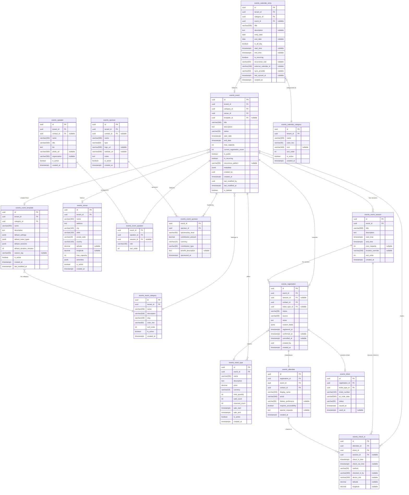
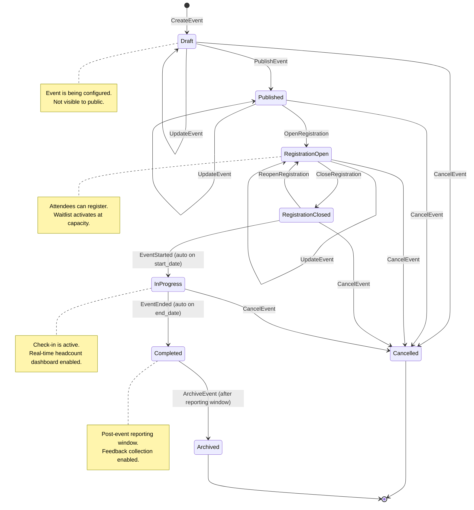
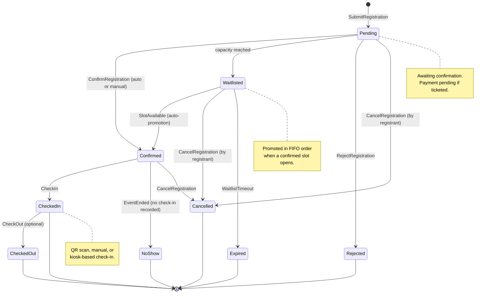
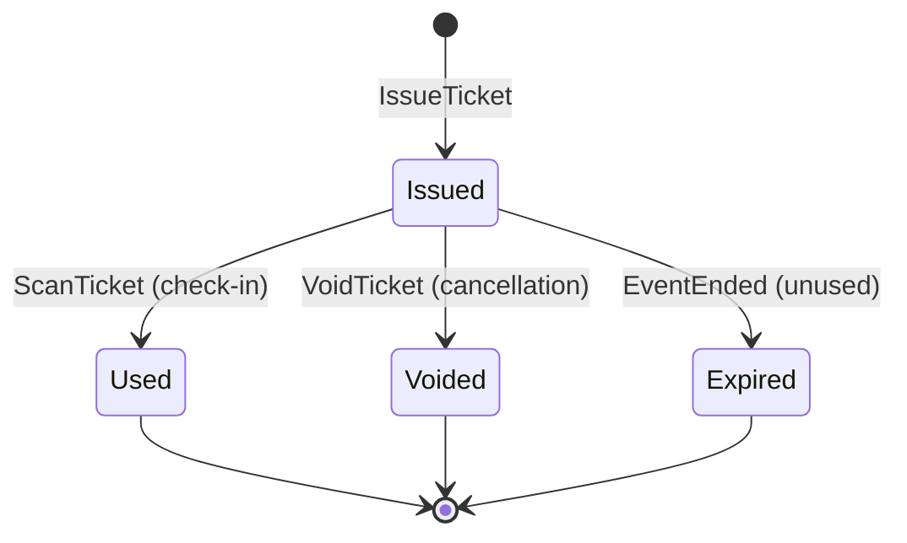
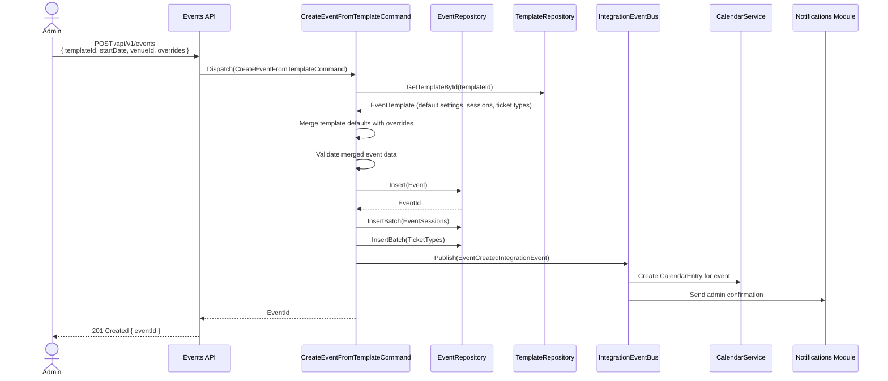
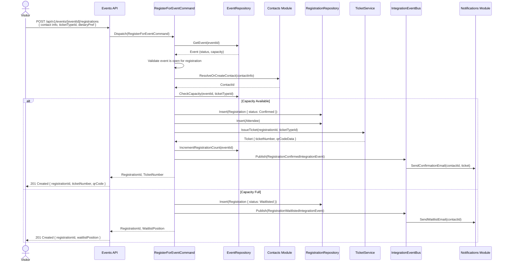
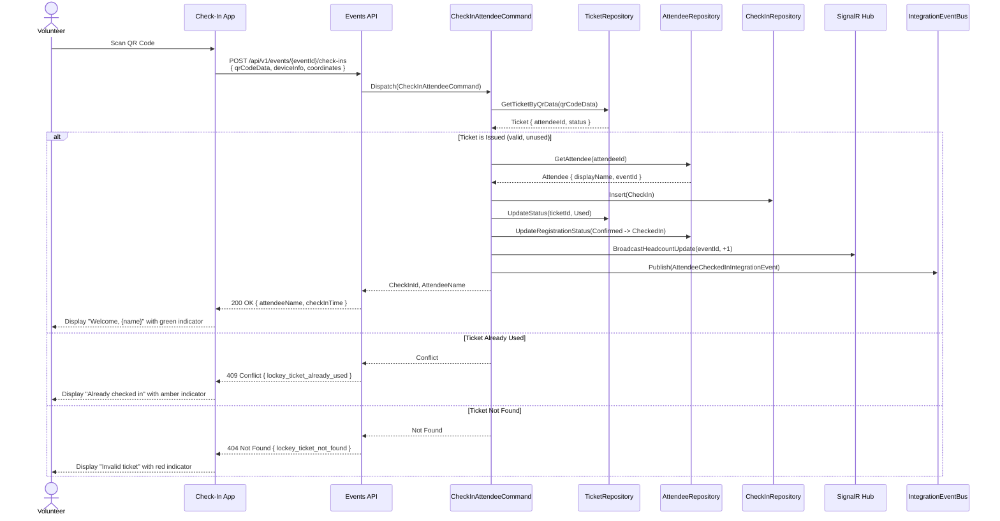
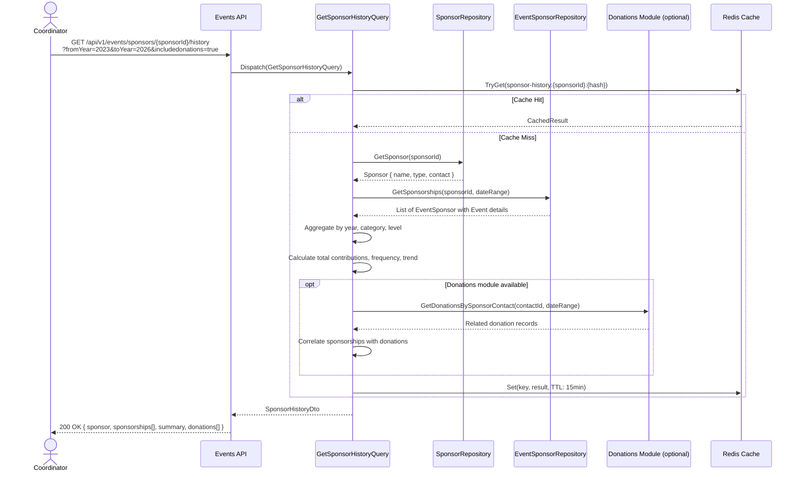
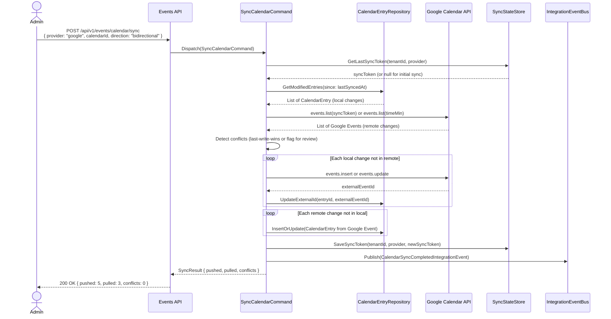

# Event Management Module Specification

**Module ID:** `events`
**Version:** 1.0.0
**Status:** Draft
**Last Updated:** 2026-03-19
**Owner:** Platform Engineering Team

---

## Table of Contents

1. [Module Overview](#1-module-overview)
2. [Architecture & Dependencies](#2-architecture--dependencies)
3. [Domain Model & ER Diagram](#3-domain-model--er-diagram)
4. [State Diagrams](#4-state-diagrams)
5. [Use Cases & Sequence Diagrams](#5-use-cases--sequence-diagrams)
6. [API Endpoints](#6-api-endpoints)
7. [Integration Events](#7-integration-events)
8. [Localization Keys](#8-localization-keys)
9. [Non-Functional Requirements](#9-non-functional-requirements)
10. [Appendix](#10-appendix)

---

## 1. Module Overview

### 1.1 Purpose

The Event Management module provides comprehensive lifecycle management for organizational events within the Nexora platform. It handles event creation, registration, attendance tracking, seasonal campaign management (Ramadan Iftar, Qurban distributions, fundraiser dinners, bazaars), annual calendar administration, and event-based data analytics.

### 1.2 Scope

| Capability | Description |
|---|---|
| Event Creation & Management | Full CRUD for events including Iftar, Sahur, Qurban, Fundraiser Dinners, and Bazaars |
| Registration & Ticketing | Online registration with configurable ticket types, capacity limits, and waitlists |
| Attendance Tracking | QR-based check-in/check-out with real-time headcount dashboards |
| Sponsor Tracking | Historical sponsor-event association with contribution amounts and recurrence analysis |
| Seasonal Templates | Reusable event templates for recurring seasonal and religious events |
| Calendar Management | Annual organizational calendar with religious dates, holidays, fundraising events, and special occasions |
| Calendar Sync | Bidirectional sync with Outlook (via Microsoft Graph) and Google Calendar |
| Event Reporting | Attendance analytics, sponsor history, revenue tracking, and year-over-year comparisons |

### 1.3 Key Domain Concepts

- **Event**: A scheduled occurrence with a defined purpose, time range, venue, and capacity.
- **EventCategory**: Classification taxonomy for events (religious, fundraising, social, educational).
- **EventSession**: A discrete time block within a multi-session event (e.g., Day 1 Iftar, Day 2 Iftar).
- **Registration**: A person's intent to attend, linked to a contact and optionally to a ticket.
- **Attendee**: A materialized participant derived from a confirmed registration.
- **CheckIn**: A timestamped attendance record capturing arrival and optional departure.
- **Sponsor**: An entity (person or organization) providing financial or in-kind support to an event.
- **EventTemplate**: A reusable blueprint for recurring event types (Ramadan Iftar template, Annual Gala template).
- **CalendarEntry**: An item on the organizational calendar (event-linked or standalone).

---

## 2. Architecture & Dependencies

### 2.1 Clean Architecture Layers

```
Nexora.Modules.Events/
├── Domain/
│   ├── Entities/
│   ├── ValueObjects/
│   ├── Enums/
│   ├── Events/          # Domain events
│   ├── Errors/
│   └── Repositories/    # Repository interfaces
├── Application/
│   ├── Commands/
│   ├── Queries/
│   ├── DTOs/
│   ├── Validators/
│   ├── Mappings/
│   └── IntegrationEvents/
├── Infrastructure/
│   ├── Persistence/
│   │   ├── Configurations/   # EF Core entity configs
│   │   ├── Repositories/
│   │   └── Migrations/
│   ├── ExternalServices/
│   │   ├── GoogleCalendarService.cs
│   │   └── OutlookCalendarService.cs
│   └── BackgroundJobs/
├── Presentation/
│   ├── Controllers/
│   ├── Filters/
│   └── Middleware/
└── Module.cs                 # Module registration entry point
```

### 2.2 Dependencies

#### Required Module Dependencies

| Module | Relationship | Usage |
|---|---|---|
| `identity` | Required | Tenant resolution, user authentication, role/permission checks |
| `contacts` | Required | Attendee/sponsor resolution against the unified contact registry |
| `notifications` | Required | Event reminders, registration confirmations, check-in alerts |

#### Optional Module Dependencies

| Module | Relationship | Usage |
|---|---|---|
| `documents` | Optional | Event flyer uploads, sponsor agreements, attendee photo galleries |
| `crm` | Optional | Post-event follow-up workflows, donor cultivation pipelines |
| `donations` | Optional | Linking event sponsorships to donation records, pledge tracking |

### 2.3 Strongly-Typed IDs

All entities use strongly-typed identifiers to prevent primitive obsession and accidental cross-entity ID mixing.

```csharp
public readonly record struct EventId(Guid Value);
public readonly record struct EventCategoryId(Guid Value);
public readonly record struct EventSessionId(Guid Value);
public readonly record struct RegistrationId(Guid Value);
public readonly record struct AttendeeId(Guid Value);
public readonly record struct TicketId(Guid Value);
public readonly record struct TicketTypeId(Guid Value);
public readonly record struct VenueId(Guid Value);
public readonly record struct SpeakerId(Guid Value);
public readonly record struct SponsorId(Guid Value);
public readonly record struct CalendarEntryId(Guid Value);
public readonly record struct CalendarCategoryId(Guid Value);
public readonly record struct EventTemplateId(Guid Value);
public readonly record struct CheckInId(Guid Value);
```

### 2.4 CQRS Pattern

All operations follow the Command Query Responsibility Segregation pattern:

- **Commands** mutate state and return at most the created/updated entity ID.
- **Queries** are read-only projections optimized for specific UI/API needs.
- Commands and queries are dispatched via MediatR.
- Write models map to the normalized domain entities; read models may use denormalized views or materialized projections.

---

## 3. Domain Model & ER Diagram

### 3.1 Database Table Prefix

All tables in this module use the `events_` prefix to ensure namespace isolation within the shared PostgreSQL schema.

### 3.2 ER Diagram



### 3.3 Multi-Tenancy

Every root entity includes a `tenant_id` column. Row-level security (RLS) policies are applied at the database level, and the `TenantContext` is injected into all repository queries via a global query filter in EF Core.

---

## 4. State Diagrams

### 4.1 Event Lifecycle



### 4.2 Registration Workflow



### 4.3 Ticket Status



---

## 5. Use Cases & Sequence Diagrams

### 5.1 UC-01: Create Event from Seasonal Template

**Actor:** Organization Admin
**Precondition:** A seasonal template (e.g., "Ramadan Iftar") exists.
**Postcondition:** A new event is created in Draft status with pre-populated settings.



### 5.2 UC-02: Public Event Registration with Ticketing

**Actor:** Public Visitor (via embedded registration form)
**Precondition:** Event is in RegistrationOpen status with available ticket types.
**Postcondition:** Registration is created, ticket issued, confirmation sent.



### 5.3 UC-03: QR-Based Check-In at Event

**Actor:** Volunteer (using check-in kiosk or mobile app)
**Precondition:** Attendee has a confirmed registration with an issued ticket.
**Postcondition:** CheckIn record created, real-time headcount updated.



### 5.4 UC-04: Sponsor History Lookup

**Actor:** Fundraising Coordinator
**Precondition:** Sponsor records exist across multiple past events.
**Postcondition:** Coordinator receives a comprehensive sponsorship history report.



### 5.5 UC-05: Sync Calendar to Google Calendar

**Actor:** Organization Admin
**Precondition:** Admin has connected their Google Calendar via OAuth.
**Postcondition:** Calendar entries are pushed to Google Calendar; changes are synced bidirectionally.



---

## 6. API Endpoints

### 6.1 Events

| Method | Endpoint | Description | Auth |
|---|---|---|---|
| `POST` | `/api/v1/events` | Create a new event (optionally from template) | `events.create` |
| `GET` | `/api/v1/events` | List events (with filtering, pagination, sorting) | `events.read` |
| `GET` | `/api/v1/events/{eventId}` | Get event details | `events.read` |
| `PUT` | `/api/v1/events/{eventId}` | Update event | `events.update` |
| `DELETE` | `/api/v1/events/{eventId}` | Soft-delete event | `events.delete` |
| `POST` | `/api/v1/events/{eventId}/publish` | Transition event to Published | `events.publish` |
| `POST` | `/api/v1/events/{eventId}/open-registration` | Open registration | `events.manage` |
| `POST` | `/api/v1/events/{eventId}/close-registration` | Close registration | `events.manage` |
| `POST` | `/api/v1/events/{eventId}/cancel` | Cancel event | `events.manage` |
| `POST` | `/api/v1/events/{eventId}/archive` | Archive completed event | `events.manage` |
| `POST` | `/api/v1/events/{eventId}/duplicate` | Clone event with new dates | `events.create` |

### 6.2 Event Sessions

| Method | Endpoint | Description | Auth |
|---|---|---|---|
| `POST` | `/api/v1/events/{eventId}/sessions` | Add session to event | `events.update` |
| `GET` | `/api/v1/events/{eventId}/sessions` | List sessions for event | `events.read` |
| `GET` | `/api/v1/events/{eventId}/sessions/{sessionId}` | Get session details | `events.read` |
| `PUT` | `/api/v1/events/{eventId}/sessions/{sessionId}` | Update session | `events.update` |
| `DELETE` | `/api/v1/events/{eventId}/sessions/{sessionId}` | Remove session | `events.update` |

### 6.3 Registrations

| Method | Endpoint | Description | Auth |
|---|---|---|---|
| `POST` | `/api/v1/events/{eventId}/registrations` | Register for event | `events.register` |
| `GET` | `/api/v1/events/{eventId}/registrations` | List registrations | `events.read` |
| `GET` | `/api/v1/events/{eventId}/registrations/{registrationId}` | Get registration details | `events.read` |
| `PUT` | `/api/v1/events/{eventId}/registrations/{registrationId}` | Update registration | `events.update` |
| `POST` | `/api/v1/events/{eventId}/registrations/{registrationId}/confirm` | Confirm registration | `events.manage` |
| `POST` | `/api/v1/events/{eventId}/registrations/{registrationId}/cancel` | Cancel registration | `events.register` |
| `POST` | `/api/v1/events/{eventId}/registrations/{registrationId}/reject` | Reject registration | `events.manage` |
| `GET` | `/api/v1/events/{eventId}/registrations/export` | Export registrations (CSV/Excel) | `events.export` |
| `POST` | `/api/v1/events/{eventId}/registrations/bulk` | Bulk register contacts | `events.manage` |

### 6.4 Check-Ins

| Method | Endpoint | Description | Auth |
|---|---|---|---|
| `POST` | `/api/v1/events/{eventId}/check-ins` | Check in attendee (QR, manual, or kiosk) | `events.checkin` |
| `GET` | `/api/v1/events/{eventId}/check-ins` | List check-ins | `events.read` |
| `POST` | `/api/v1/events/{eventId}/check-ins/{checkInId}/check-out` | Record check-out | `events.checkin` |
| `GET` | `/api/v1/events/{eventId}/check-ins/headcount` | Real-time headcount | `events.read` |
| `POST` | `/api/v1/events/{eventId}/check-ins/manual` | Manual check-in by name lookup | `events.checkin` |

### 6.5 Tickets & Ticket Types

| Method | Endpoint | Description | Auth |
|---|---|---|---|
| `POST` | `/api/v1/events/{eventId}/ticket-types` | Create ticket type | `events.update` |
| `GET` | `/api/v1/events/{eventId}/ticket-types` | List ticket types | `events.read` |
| `PUT` | `/api/v1/events/{eventId}/ticket-types/{ticketTypeId}` | Update ticket type | `events.update` |
| `DELETE` | `/api/v1/events/{eventId}/ticket-types/{ticketTypeId}` | Deactivate ticket type | `events.update` |
| `GET` | `/api/v1/events/tickets/{ticketNumber}` | Look up ticket by number | `events.read` |
| `POST` | `/api/v1/events/tickets/{ticketId}/void` | Void a ticket | `events.manage` |

### 6.6 Venues

| Method | Endpoint | Description | Auth |
|---|---|---|---|
| `POST` | `/api/v1/events/venues` | Create venue | `events.venues.create` |
| `GET` | `/api/v1/events/venues` | List venues | `events.read` |
| `GET` | `/api/v1/events/venues/{venueId}` | Get venue details | `events.read` |
| `PUT` | `/api/v1/events/venues/{venueId}` | Update venue | `events.venues.update` |
| `DELETE` | `/api/v1/events/venues/{venueId}` | Deactivate venue | `events.venues.delete` |
| `GET` | `/api/v1/events/venues/{venueId}/availability` | Check venue availability for date range | `events.read` |

### 6.7 Speakers

| Method | Endpoint | Description | Auth |
|---|---|---|---|
| `POST` | `/api/v1/events/speakers` | Create speaker profile | `events.speakers.create` |
| `GET` | `/api/v1/events/speakers` | List speakers | `events.read` |
| `GET` | `/api/v1/events/speakers/{speakerId}` | Get speaker details | `events.read` |
| `PUT` | `/api/v1/events/speakers/{speakerId}` | Update speaker | `events.speakers.update` |
| `POST` | `/api/v1/events/{eventId}/speakers` | Assign speaker to event/session | `events.update` |
| `DELETE` | `/api/v1/events/{eventId}/speakers/{speakerId}` | Remove speaker from event | `events.update` |

### 6.8 Sponsors

| Method | Endpoint | Description | Auth |
|---|---|---|---|
| `POST` | `/api/v1/events/sponsors` | Create sponsor | `events.sponsors.create` |
| `GET` | `/api/v1/events/sponsors` | List sponsors | `events.read` |
| `GET` | `/api/v1/events/sponsors/{sponsorId}` | Get sponsor details | `events.read` |
| `PUT` | `/api/v1/events/sponsors/{sponsorId}` | Update sponsor | `events.sponsors.update` |
| `POST` | `/api/v1/events/{eventId}/sponsors` | Link sponsor to event | `events.update` |
| `PUT` | `/api/v1/events/{eventId}/sponsors/{sponsorId}` | Update sponsorship details | `events.update` |
| `DELETE` | `/api/v1/events/{eventId}/sponsors/{sponsorId}` | Remove sponsor from event | `events.update` |
| `GET` | `/api/v1/events/sponsors/{sponsorId}/history` | Historical sponsorship report | `events.reports` |

### 6.9 Calendar

| Method | Endpoint | Description | Auth |
|---|---|---|---|
| `POST` | `/api/v1/events/calendar/entries` | Create calendar entry | `events.calendar.create` |
| `GET` | `/api/v1/events/calendar/entries` | List calendar entries (with date range filter) | `events.read` |
| `GET` | `/api/v1/events/calendar/entries/{entryId}` | Get calendar entry | `events.read` |
| `PUT` | `/api/v1/events/calendar/entries/{entryId}` | Update calendar entry | `events.calendar.update` |
| `DELETE` | `/api/v1/events/calendar/entries/{entryId}` | Delete calendar entry | `events.calendar.delete` |
| `POST` | `/api/v1/events/calendar/sync` | Trigger calendar sync (Google/Outlook) | `events.calendar.sync` |
| `GET` | `/api/v1/events/calendar/sync/status` | Get sync status | `events.calendar.sync` |
| `GET` | `/api/v1/events/calendar/categories` | List calendar categories | `events.read` |
| `POST` | `/api/v1/events/calendar/categories` | Create calendar category | `events.calendar.create` |
| `GET` | `/api/v1/events/calendar/annual/{year}` | Get full annual calendar | `events.read` |

### 6.10 Templates

| Method | Endpoint | Description | Auth |
|---|---|---|---|
| `POST` | `/api/v1/events/templates` | Create event template | `events.templates.create` |
| `GET` | `/api/v1/events/templates` | List templates | `events.read` |
| `GET` | `/api/v1/events/templates/{templateId}` | Get template details | `events.read` |
| `PUT` | `/api/v1/events/templates/{templateId}` | Update template | `events.templates.update` |
| `DELETE` | `/api/v1/events/templates/{templateId}` | Deactivate template | `events.templates.delete` |
| `GET` | `/api/v1/events/templates/seasonal` | List templates filtered by season tag | `events.read` |

### 6.11 Event Categories

| Method | Endpoint | Description | Auth |
|---|---|---|---|
| `POST` | `/api/v1/events/categories` | Create event category | `events.categories.create` |
| `GET` | `/api/v1/events/categories` | List event categories | `events.read` |
| `PUT` | `/api/v1/events/categories/{categoryId}` | Update event category | `events.categories.update` |
| `DELETE` | `/api/v1/events/categories/{categoryId}` | Deactivate event category | `events.categories.delete` |

### 6.12 Reports

| Method | Endpoint | Description | Auth |
|---|---|---|---|
| `GET` | `/api/v1/events/{eventId}/reports/attendance` | Attendance report for event | `events.reports` |
| `GET` | `/api/v1/events/{eventId}/reports/revenue` | Revenue/ticket sales report | `events.reports` |
| `GET` | `/api/v1/events/reports/year-over-year` | Year-over-year event comparison | `events.reports` |
| `GET` | `/api/v1/events/reports/sponsor-summary` | Sponsor contribution summary | `events.reports` |
| `GET` | `/api/v1/events/reports/seasonal/{seasonTag}` | Seasonal event analytics | `events.reports` |

### 6.13 Query Parameters (Standard)

All list endpoints support the following query parameters:

| Parameter | Type | Description |
|---|---|---|
| `page` | `int` | Page number (1-based, default: 1) |
| `pageSize` | `int` | Items per page (default: 20, max: 100) |
| `sortBy` | `string` | Field name to sort by |
| `sortDir` | `string` | `asc` or `desc` (default: `asc`) |
| `search` | `string` | Full-text search across relevant fields |
| `status` | `string` | Filter by status (comma-separated for multiple) |
| `fromDate` | `date` | Filter by start date (inclusive) |
| `toDate` | `date` | Filter by end date (inclusive) |
| `categoryId` | `uuid` | Filter by category |

---

## 7. Integration Events

### 7.1 Published Events (Outbound)

These events are published to the message bus for consumption by other modules.

| Event | Payload | Consumers |
|---|---|---|
| `EventCreatedIntegrationEvent` | `{ EventId, TenantId, Title, CategoryId, StartDate, EndDate, VenueId }` | `calendar`, `notifications` |
| `EventPublishedIntegrationEvent` | `{ EventId, TenantId, Title, IsPublic }` | `notifications`, `crm` |
| `EventCancelledIntegrationEvent` | `{ EventId, TenantId, Title, CancellationReason, AffectedRegistrationCount }` | `notifications`, `crm`, `donations` |
| `RegistrationConfirmedIntegrationEvent` | `{ RegistrationId, EventId, ContactId, TenantId, TicketNumber }` | `notifications`, `contacts`, `crm` |
| `RegistrationCancelledIntegrationEvent` | `{ RegistrationId, EventId, ContactId, TenantId, Reason }` | `notifications`, `contacts` |
| `RegistrationWaitlistedIntegrationEvent` | `{ RegistrationId, EventId, ContactId, TenantId, WaitlistPosition }` | `notifications` |
| `AttendeeCheckedInIntegrationEvent` | `{ CheckInId, AttendeeId, EventId, ContactId, TenantId, CheckInTime }` | `contacts`, `crm` |
| `EventCompletedIntegrationEvent` | `{ EventId, TenantId, TotalAttendees, TotalRegistrations, TotalRevenue }` | `crm`, `donations`, `notifications` |
| `SponsorshipRecordedIntegrationEvent` | `{ EventId, SponsorId, ContactId, TenantId, Amount, Currency, Level }` | `donations`, `crm`, `contacts` |
| `CalendarSyncCompletedIntegrationEvent` | `{ TenantId, Provider, PushedCount, PulledCount, ConflictCount }` | `notifications` |
| `EventArchivedIntegrationEvent` | `{ EventId, TenantId }` | `documents` |

### 7.2 Consumed Events (Inbound)

These events are consumed from other modules.

| Event | Source Module | Handler | Action |
|---|---|---|---|
| `ContactUpdatedIntegrationEvent` | `contacts` | `ContactUpdatedHandler` | Update attendee display names and emails linked to the contact |
| `ContactMergedIntegrationEvent` | `contacts` | `ContactMergedHandler` | Reassign all registrations, attendees, and sponsor links from old contact to merged contact |
| `ContactDeletedIntegrationEvent` | `contacts` | `ContactDeletedHandler` | Anonymize attendee records for data compliance |
| `DonationReceivedIntegrationEvent` | `donations` | `DonationReceivedHandler` | Correlate donation with event sponsorship if metadata includes eventId |
| `UserDeactivatedIntegrationEvent` | `identity` | `UserDeactivatedHandler` | Revoke any event management permissions; cancel pending registrations |
| `TenantSettingsUpdatedIntegrationEvent` | `identity` | `TenantSettingsHandler` | Update default timezone, currency, and locale settings for calendar and pricing |
| `DocumentUploadedIntegrationEvent` | `documents` | `DocumentLinkedHandler` | Auto-link uploaded documents to events if tagged with eventId |

### 7.3 Integration Event Contracts

All integration events follow the standard Nexora envelope:

```csharp
public sealed record IntegrationEventEnvelope<T>(
    Guid EventId,           // Unique event identifier (for idempotency)
    string EventType,       // Fully qualified event type name
    Guid TenantId,          // Tenant context
    DateTimeOffset OccurredAt,
    Guid CorrelationId,     // For distributed tracing
    T Payload
);
```

---

## 8. Localization Keys

All user-facing messages, validation errors, and notification content use the `lockey_` prefix format for localization lookup.

### 8.1 Validation Messages

| Key | Default (en-US) |
|---|---|
| `lockey_event_title_required` | Event title is required. |
| `lockey_event_start_date_required` | Start date is required. |
| `lockey_event_end_before_start` | End date must be after start date. |
| `lockey_event_capacity_exceeded` | Registration capacity has been reached. |
| `lockey_event_not_open_for_registration` | This event is not currently open for registration. |
| `lockey_registration_already_exists` | You are already registered for this event. |
| `lockey_registration_cancelled_success` | Your registration has been cancelled. |
| `lockey_ticket_already_used` | This ticket has already been used for check-in. |
| `lockey_ticket_not_found` | Ticket not found. Please verify the QR code. |
| `lockey_ticket_voided` | This ticket has been voided and cannot be used. |
| `lockey_venue_conflict` | The selected venue is not available for the specified date range. |
| `lockey_sponsor_already_linked` | This sponsor is already linked to the event. |
| `lockey_template_not_found` | The specified event template was not found. |
| `lockey_calendar_sync_failed` | Calendar synchronization failed. Please try again. |
| `lockey_calendar_sync_in_progress` | A calendar sync is already in progress. |
| `lockey_session_time_overlap` | Session times must not overlap within the same event. |
| `lockey_event_cannot_cancel_in_progress` | An in-progress event requires administrator approval to cancel. |

### 8.2 Notification Templates

| Key | Context |
|---|---|
| `lockey_notif_registration_confirmed_subject` | Registration confirmation email subject |
| `lockey_notif_registration_confirmed_body` | Registration confirmation email body |
| `lockey_notif_registration_waitlisted_subject` | Waitlist notification email subject |
| `lockey_notif_registration_waitlisted_body` | Waitlist notification email body |
| `lockey_notif_event_reminder_subject` | Event reminder email subject (24h before) |
| `lockey_notif_event_reminder_body` | Event reminder email body |
| `lockey_notif_event_cancelled_subject` | Event cancellation notification subject |
| `lockey_notif_event_cancelled_body` | Event cancellation notification body |
| `lockey_notif_waitlist_promoted_subject` | Waitlist promotion notification subject |
| `lockey_notif_waitlist_promoted_body` | Waitlist promotion notification body |
| `lockey_notif_sponsor_thankyou_subject` | Sponsor thank-you email subject |
| `lockey_notif_sponsor_thankyou_body` | Sponsor thank-you email body |

---

## 9. Non-Functional Requirements

### 9.1 Performance

| Metric | Target | Measurement |
|---|---|---|
| Event list query (P95) | < 200ms | Application Performance Monitoring (APM) |
| Registration creation (P95) | < 500ms | APM |
| QR check-in scan to response (P95) | < 300ms | APM (critical for volunteer UX) |
| Calendar sync (full initial) | < 30s for up to 500 entries | Background job monitoring |
| Calendar sync (incremental) | < 5s | Background job monitoring |
| Report generation (P95) | < 3s for up to 10,000 registrations | APM |
| Real-time headcount update propagation | < 1s | SignalR latency monitoring |
| Concurrent registrations (sustained) | 200 registrations/second per event | Load testing |

### 9.2 Scalability

- **Horizontal scaling**: Stateless API layer; all state in PostgreSQL and Redis.
- **Database partitioning**: `events_registration` and `events_check_in` tables are partitioned by `tenant_id` for large multi-tenant deployments.
- **Read replicas**: Report queries route to PostgreSQL read replicas to isolate analytical load from transactional workloads.
- **Event bus**: Integration events use outbox pattern with at-least-once delivery; all consumers are idempotent.
- **Caching**: Redis cache with tenant-scoped keys for event listings, venue availability, and sponsor history. TTL: 5-15 minutes depending on volatility.

### 9.3 Availability & Resilience

| Requirement | Target |
|---|---|
| Module uptime SLA | 99.9% (excludes planned maintenance) |
| Data durability | 99.999% (PostgreSQL with streaming replication) |
| Recovery Time Objective (RTO) | < 15 minutes |
| Recovery Point Objective (RPO) | < 1 minute (WAL-based replication) |
| Calendar sync retry policy | Exponential backoff: 1s, 5s, 30s, 5min (max 5 retries) |
| Circuit breaker (external APIs) | Open after 5 consecutive failures; half-open after 60s |

### 9.4 Security

- **Authorization**: All endpoints require valid JWT with tenant context. Permission-based access control using the `identity` module's RBAC system.
- **Data isolation**: PostgreSQL Row-Level Security (RLS) enforces tenant boundary at the database level. No cross-tenant data leakage possible even in case of application-layer bugs.
- **Input validation**: All command DTOs validated via FluentValidation before handler execution. Maximum string lengths enforced. HTML sanitization on free-text fields.
- **Rate limiting**: Public registration endpoints rate-limited to 30 requests/minute per IP. API key endpoints: 600 requests/minute.
- **Audit logging**: All write operations (create, update, delete, state transitions) are recorded in the platform audit log with actor, timestamp, tenant, and before/after snapshots.
- **PII handling**: Attendee personal data (name, email, dietary preferences) is encrypted at rest. Anonymization is supported for GDPR/data retention compliance via the `ContactDeletedIntegrationEvent` handler.
- **QR codes**: Ticket QR data is a signed, non-guessable token (HMAC-SHA256) to prevent ticket forgery.

### 9.5 Observability

- **Structured logging**: All operations emit structured logs (Serilog) with `TenantId`, `EventId`, `CorrelationId`, and `UserId` in the log scope.
- **Metrics**: Prometheus counters and histograms for registrations, check-ins, calendar syncs, and API latency.
- **Distributed tracing**: OpenTelemetry spans for all command/query handlers, external API calls (Google/Outlook), and integration event processing.
- **Health checks**: `/health/ready` and `/health/live` endpoints for Kubernetes probes, including downstream dependency checks (PostgreSQL, Redis, message bus).
- **Alerting triggers**: Registration spike detection (> 3x baseline in 5 minutes), calendar sync failure rate > 10%, check-in error rate > 5%.

### 9.6 Data Retention & Archival

| Data Type | Active Retention | Archive Retention | Policy |
|---|---|---|---|
| Event records | 3 years | 10 years (cold storage) | Soft-delete, then archive |
| Registration & attendee data | 2 years post-event | 7 years (anonymized) | GDPR-compliant anonymization |
| Check-in records | 1 year post-event | 5 years (aggregated) | Detail purged, aggregates retained |
| Calendar entries | Indefinite (active) | N/A | User-managed deletion |
| Sponsor history | Indefinite | Indefinite | Business-critical historical data |
| Audit logs | 1 year | 7 years | Compliance requirement |

### 9.7 Testing Requirements

| Test Type | Coverage Target | Tooling |
|---|---|---|
| Unit tests (domain logic) | > 90% line coverage | xUnit, NSubstitute |
| Integration tests (persistence) | All repository methods | Testcontainers (PostgreSQL) |
| Integration tests (API) | All endpoints | WebApplicationFactory, Testcontainers |
| Contract tests (integration events) | All published/consumed events | Pact or custom schema validation |
| Load tests | Registration and check-in flows | k6 or NBomber |
| E2E tests | Critical paths (UC-01 through UC-04) | Playwright (if UI) or API-level |

---

## 10. Appendix

### 10.1 Permission Matrix

| Permission | Admin | Event Manager | Volunteer | Public |
|---|---|---|---|---|
| `events.create` | Yes | Yes | No | No |
| `events.read` | Yes | Yes | Yes (assigned events) | Yes (public events) |
| `events.update` | Yes | Yes (own events) | No | No |
| `events.delete` | Yes | No | No | No |
| `events.publish` | Yes | Yes | No | No |
| `events.manage` | Yes | Yes | No | No |
| `events.register` | Yes | Yes | Yes | Yes |
| `events.checkin` | Yes | Yes | Yes | No |
| `events.reports` | Yes | Yes | No | No |
| `events.export` | Yes | Yes | No | No |
| `events.calendar.sync` | Yes | No | No | No |
| `events.templates.create` | Yes | Yes | No | No |
| `events.sponsors.create` | Yes | Yes | No | No |
| `events.venues.create` | Yes | Yes | No | No |
| `events.speakers.create` | Yes | Yes | No | No |

### 10.2 Enum Definitions

```csharp
public enum EventStatus
{
    Draft,
    Published,
    RegistrationOpen,
    RegistrationClosed,
    InProgress,
    Completed,
    Cancelled,
    Archived
}

public enum RegistrationStatus
{
    Pending,
    Confirmed,
    Waitlisted,
    Rejected,
    Cancelled,
    CheckedIn,
    CheckedOut,
    NoShow,
    Expired
}

public enum TicketStatus
{
    Issued,
    Used,
    Voided,
    Expired
}

public enum SponsorshipLevel
{
    Platinum,
    Gold,
    Silver,
    Bronze,
    InKind,
    Custom
}

public enum ContributionType
{
    Financial,
    InKind,
    Venue,
    Catering,
    Media,
    Mixed
}

public enum CheckInMethod
{
    QrScan,
    ManualLookup,
    Kiosk,
    SelfService,
    BulkImport
}

public enum CalendarSyncProvider
{
    Google,
    Outlook,
    ICalFeed
}

public enum RegistrationSource
{
    WebForm,
    AdminEntry,
    BulkImport,
    Api,
    Kiosk,
    MobileApp
}

public enum SeasonTag
{
    Ramadan,
    EidAlFitr,
    EidAlAdha,
    Annual,
    Summer,
    Winter,
    Fundraising,
    Custom
}
```

### 10.3 Background Jobs

| Job | Schedule | Description |
|---|---|---|
| `EventStatusTransitionJob` | Every 5 minutes | Auto-transitions events to InProgress/Completed based on date |
| `WaitlistPromotionJob` | On registration cancellation (event-driven) + every 15 minutes (sweep) | Promotes waitlisted registrations when capacity opens |
| `CalendarIncrementalSyncJob` | Every 30 minutes | Incremental sync with connected external calendars |
| `EventReminderJob` | Every hour | Sends reminders 24h and 1h before event start |
| `NoShowDetectionJob` | 2 hours after event end | Marks confirmed-but-unchecked-in registrations as NoShow |
| `RegistrationExpirationJob` | Every 30 minutes | Expires pending registrations older than configurable timeout |
| `StaleEventArchivalJob` | Daily at 02:00 UTC | Archives completed events older than configurable retention period |

### 10.4 Configuration

```json
{
  "Modules": {
    "Events": {
      "Registration": {
        "PendingTimeoutMinutes": 60,
        "WaitlistEnabled": true,
        "MaxWaitlistSize": 500,
        "AutoConfirmEnabled": true,
        "AllowDuplicateRegistrations": false
      },
      "CheckIn": {
        "AllowEarlyCheckInMinutes": 60,
        "AllowLateCheckInMinutes": 30,
        "QrCodeSigningKey": "{{from-vault}}",
        "GeoFencingEnabled": false,
        "GeoFenceRadiusMeters": 500
      },
      "Calendar": {
        "SyncIntervalMinutes": 30,
        "MaxEntriesPerSync": 500,
        "ConflictResolution": "LastWriteWins"
      },
      "Archival": {
        "AutoArchiveAfterDays": 90,
        "DataRetentionYears": 3
      },
      "Cache": {
        "EventListTtlMinutes": 5,
        "VenueAvailabilityTtlMinutes": 10,
        "SponsorHistoryTtlMinutes": 15
      }
    }
  }
}
```

---

**End of Specification**
