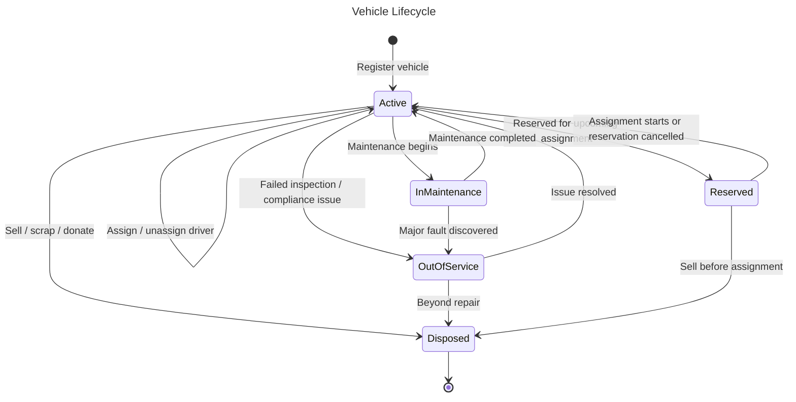
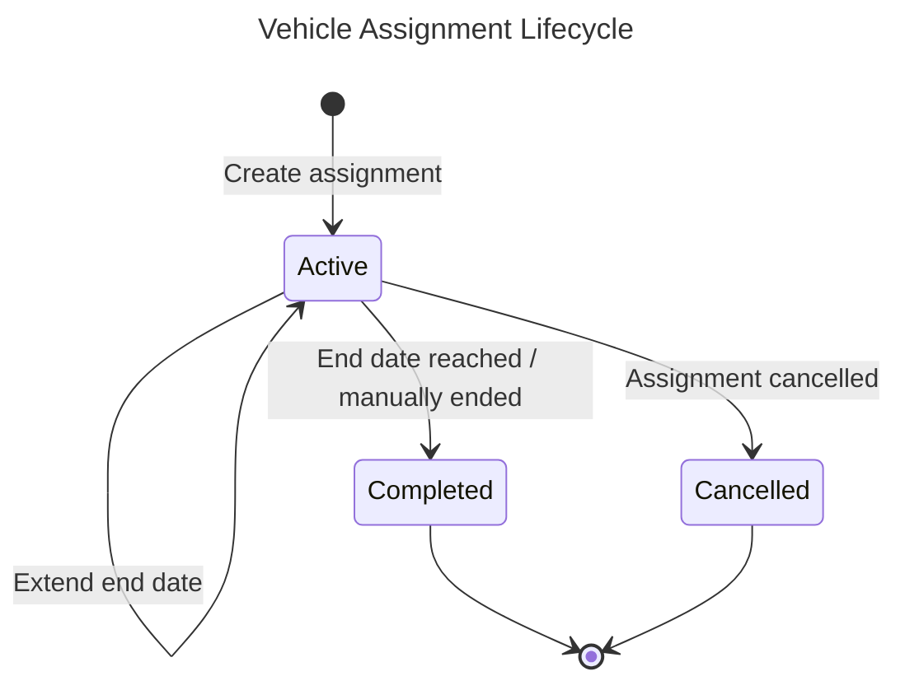
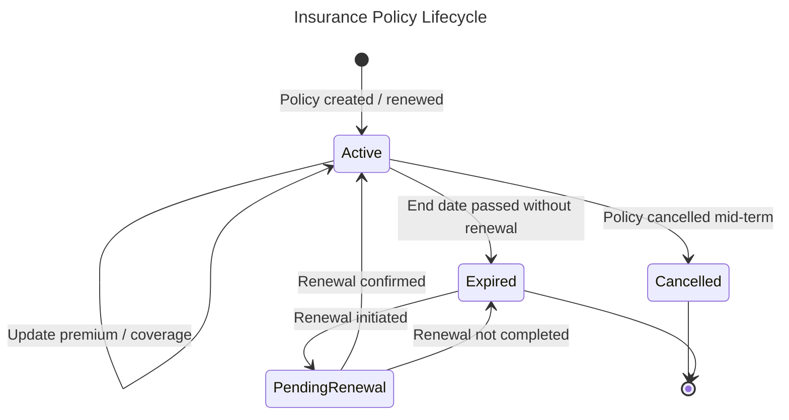
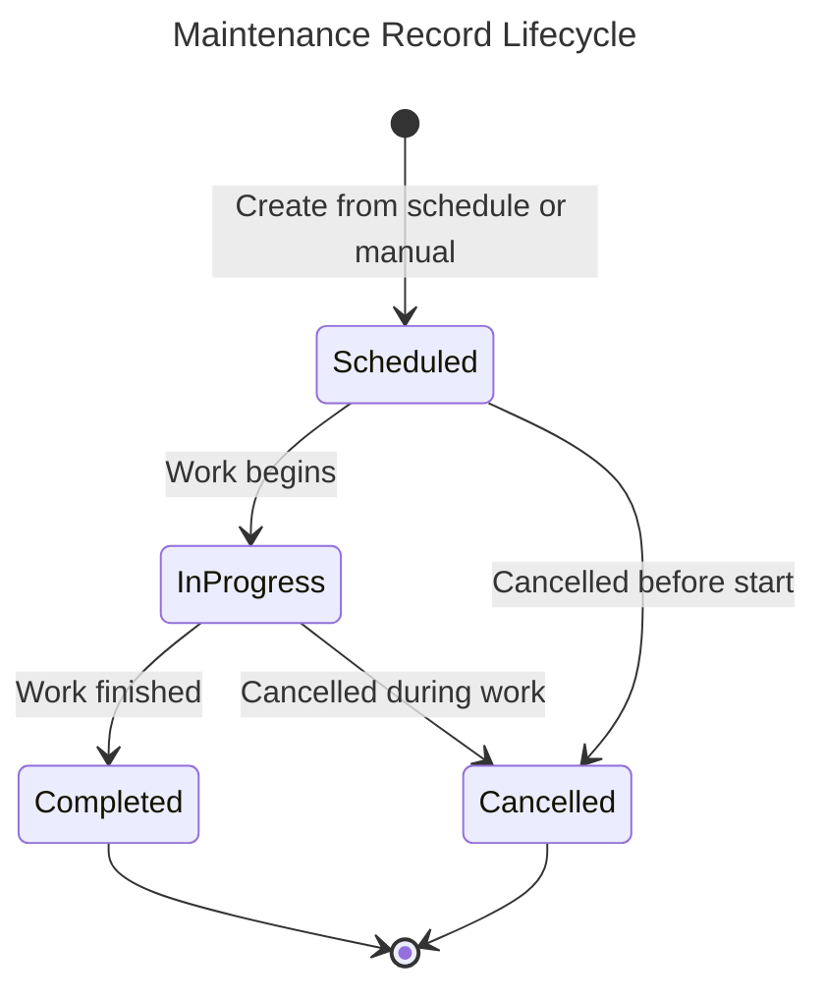
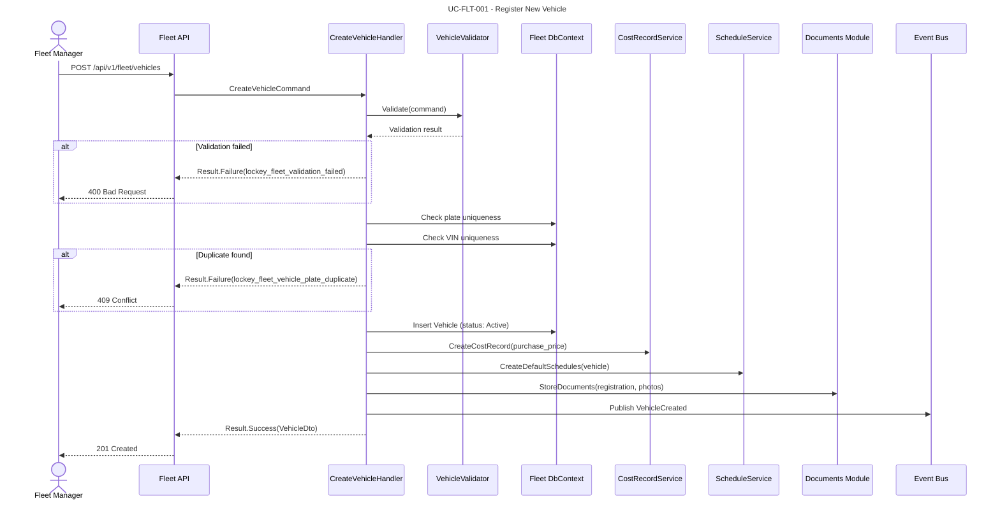
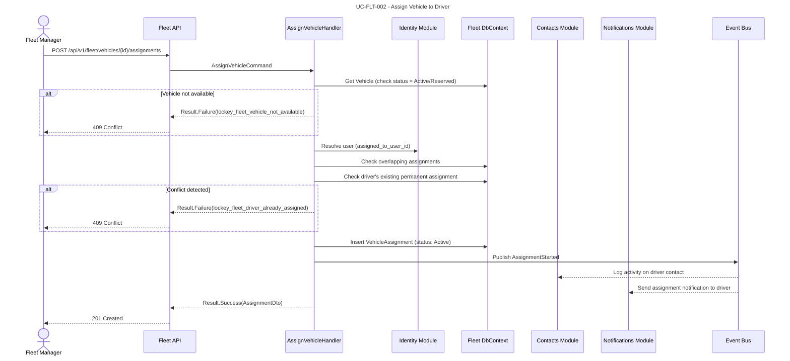
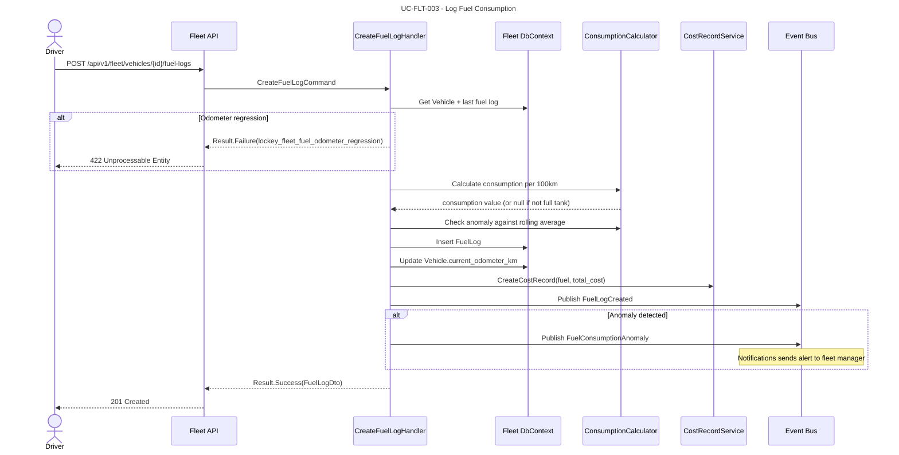
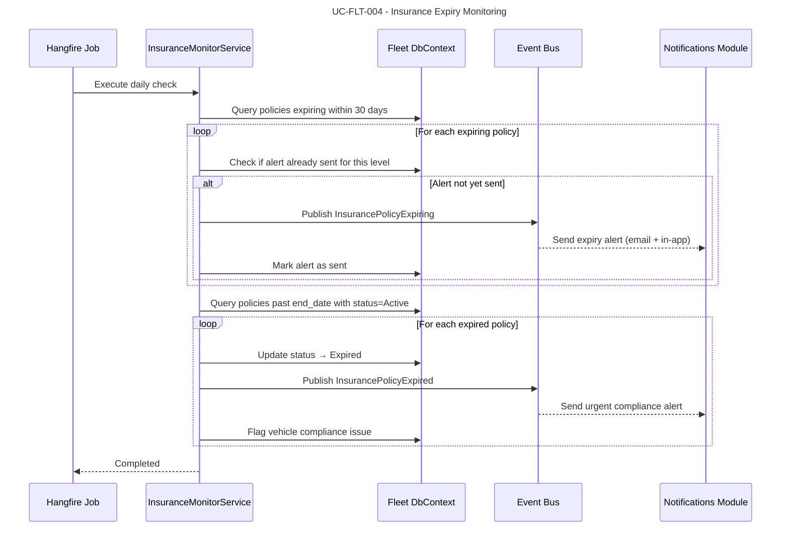
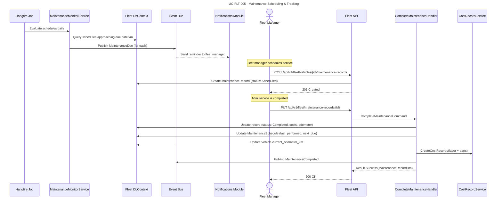

# Module: Fleet Management

## Overview
The Fleet module provides **comprehensive vehicle lifecycle management** for organizations that operate fleets of any size. It tracks vehicles from acquisition through disposal, managing insurance policies, maintenance schedules, fuel consumption, inspections, driver assignments, and total cost of ownership. The module integrates with Identity (driver/user resolution), Contacts (vendor and service provider records), Notifications (expiry alerts, maintenance reminders), and Documents (policy documents, inspection reports, registration files).

### Module Metadata

| Property | Value |
|----------|-------|
| Module Name | `fleet` |
| Version | `1.0.0` |
| Table Prefix | `fleet_` |
| Permission Prefix | `fleet.` |
| Dependencies | `identity`, `contacts`, `notifications`, `documents` |
| Status | Design |

### Dependency Details

| Module | Purpose |
|--------|---------|
| `identity` | User/employee resolution for vehicle assignments; tenant and org context |
| `contacts` | Vendor records (dealerships, workshops, insurance companies, fuel suppliers) |
| `notifications` | Insurance expiry alerts, maintenance due reminders, inspection reminders |
| `documents` | Storage of vehicle registration, insurance policies, inspection reports, invoices |

## Domain Model

### Entities

```mermaid
---
title: Fleet Module - Entity Relationship Diagram
---
erDiagram
    Vehicle ||--o{ VehicleAssignment : "assigned to"
    Vehicle ||--o{ InsurancePolicy : "insured by"
    Vehicle ||--o{ MaintenanceRecord : "maintained with"
    Vehicle ||--o{ MaintenanceSchedule : "scheduled for"
    Vehicle ||--o{ FuelLog : "fueled with"
    Vehicle ||--o{ Inspection : "inspected via"
    Vehicle ||--o{ VehicleDocument : "has documents"
    Vehicle ||--o{ CostRecord : "costs tracked"

    Vehicle {
        uuid id PK
        uuid organization_id FK
        string plate_number UK
        string make
        string model
        int model_year
        string vin UK "Vehicle Identification Number / Chassis"
        string body_type "sedan, suv, van, truck, bus, pickup, motorcycle"
        string fuel_type "gasoline, diesel, lpg, electric, hybrid"
        string transmission "manual, automatic"
        string color
        int engine_displacement_cc
        int horsepower
        int seating_capacity
        decimal purchase_price
        date purchase_date
        decimal current_odometer_km
        string odometer_unit "km, mi"
        string status "active, in_maintenance, out_of_service, reserved, disposed"
        date disposal_date
        string disposal_reason
        decimal disposal_price
        string registration_number
        date registration_expiry_date
        string fleet_code "internal fleet identifier"
        string department "assigned department"
        jsonb metadata
        timestamp created_at
        timestamp updated_at
        uuid created_by
        uuid updated_by
    }

    VehicleAssignment {
        uuid id PK
        uuid vehicle_id FK
        uuid organization_id FK
        uuid assigned_to_user_id FK "identity.user"
        uuid assigned_by_user_id FK "identity.user"
        uuid contact_id FK "contacts.contact - driver as contact"
        string assignment_type "permanent, temporary, pool, project"
        date start_date
        date end_date
        decimal start_odometer_km
        decimal end_odometer_km
        string status "active, completed, cancelled"
        string notes
        timestamp created_at
        timestamp updated_at
    }

    InsurancePolicy {
        uuid id PK
        uuid vehicle_id FK
        uuid organization_id FK
        uuid provider_contact_id FK "contacts.contact - insurance company"
        string policy_number UK
        string policy_type "comprehensive, liability, collision, third_party, kasko, trafik"
        date start_date
        date end_date
        decimal premium_amount
        string premium_currency
        string premium_frequency "annual, semi_annual, quarterly, monthly"
        decimal deductible_amount
        decimal coverage_limit
        string status "active, expired, cancelled, pending_renewal"
        uuid document_id FK "documents - policy PDF"
        string notes
        boolean renewal_alert_sent
        timestamp created_at
        timestamp updated_at
    }

    MaintenanceRecord {
        uuid id PK
        uuid vehicle_id FK
        uuid organization_id FK
        uuid schedule_id FK "optional - linked schedule"
        uuid service_provider_contact_id FK "contacts.contact - workshop"
        string maintenance_type "preventive, corrective, emergency, recall"
        string category "oil_change, tire, brake, battery, filter, engine, transmission, body, electrical, inspection, other"
        string description
        date service_date
        decimal odometer_at_service_km
        decimal labor_cost
        decimal parts_cost
        decimal total_cost
        string currency
        string invoice_number
        uuid invoice_document_id FK "documents"
        string status "scheduled, in_progress, completed, cancelled"
        date next_service_due_date
        decimal next_service_due_km
        string notes
        timestamp created_at
        timestamp updated_at
    }

    MaintenanceSchedule {
        uuid id PK
        uuid vehicle_id FK
        uuid organization_id FK
        string schedule_type "time_based, mileage_based, both"
        string category "oil_change, tire_rotation, brake_inspection, filter_replacement, general_service, other"
        int interval_days "null if mileage_based only"
        decimal interval_km "null if time_based only"
        date last_performed_date
        decimal last_performed_km
        date next_due_date
        decimal next_due_km
        boolean is_active
        int alert_days_before "days before due to send alert"
        decimal alert_km_before "km before due to send alert"
        string notes
        timestamp created_at
        timestamp updated_at
    }

    FuelLog {
        uuid id PK
        uuid vehicle_id FK
        uuid organization_id FK
        uuid driver_user_id FK "identity.user"
        date fill_date
        decimal odometer_km
        decimal liters
        string fuel_type "gasoline, diesel, lpg, electric_kwh"
        decimal unit_price
        decimal total_cost
        string currency
        string station_name
        string station_location
        boolean is_full_tank
        decimal computed_consumption_per_100km "auto-calculated"
        string payment_method "corporate_card, cash, fuel_card, invoice"
        string receipt_number
        uuid receipt_document_id FK "documents"
        string notes
        timestamp created_at
    }

    Inspection {
        uuid id PK
        uuid vehicle_id FK
        uuid organization_id FK
        uuid inspector_user_id FK "identity.user"
        string inspection_type "pre_trip, post_trip, periodic, annual, safety, emissions"
        date inspection_date
        decimal odometer_km
        string result "pass, fail, conditional_pass"
        date expiry_date "for periodic/annual inspections"
        jsonb checklist_results "structured inspection items with pass/fail"
        string overall_notes
        uuid report_document_id FK "documents"
        string status "scheduled, in_progress, completed, cancelled"
        timestamp created_at
        timestamp updated_at
    }

    VehicleDocument {
        uuid id PK
        uuid vehicle_id FK
        uuid organization_id FK
        uuid document_id FK "documents module"
        string document_type "registration, insurance_policy, inspection_report, invoice, photo, manual, contract, other"
        string title
        date expiry_date "if applicable"
        string notes
        timestamp created_at
    }

    CostRecord {
        uuid id PK
        uuid vehicle_id FK
        uuid organization_id FK
        string cost_type "fuel, maintenance, insurance, tax, toll, parking, fine, registration, tire, wash, other"
        string source_type "fuel_log, maintenance_record, insurance_policy, manual"
        uuid source_id "FK to originating record"
        date cost_date
        decimal amount
        string currency
        string description
        uuid vendor_contact_id FK "contacts.contact"
        string invoice_number
        uuid document_id FK "documents"
        timestamp created_at
    }
```

### Value Objects

| Value Object | Description |
|-------------|-------------|
| `VehicleId` | Strongly-typed vehicle identifier |
| `VehicleAssignmentId` | Strongly-typed assignment identifier |
| `InsurancePolicyId` | Strongly-typed insurance policy identifier |
| `MaintenanceRecordId` | Strongly-typed maintenance record identifier |
| `MaintenanceScheduleId` | Strongly-typed maintenance schedule identifier |
| `FuelLogId` | Strongly-typed fuel log identifier |
| `InspectionId` | Strongly-typed inspection identifier |
| `VehicleDocumentId` | Strongly-typed vehicle document link identifier |
| `CostRecordId` | Strongly-typed cost record identifier |
| `PlateNumber` | Validated and normalized vehicle plate number |
| `VIN` | Validated 17-character Vehicle Identification Number (ISO 3779) |
| `Odometer` | Value + unit (km or mi), enforces non-negative and monotonic increases |
| `Money` | Amount + currency code (ISO 4217) |
| `DateRange` | Start date + end date with validation (start <= end) |
| `FuelConsumption` | Liters per 100 km, auto-calculated from fuel logs |

### Domain Events

| Event | Trigger | Consumers |
|-------|---------|-----------|
| `VehicleCreated` | New vehicle registered | CostRecord (initial purchase cost), Notifications (confirmation) |
| `VehicleStatusChanged` | Vehicle status transition | Assignments (auto-end if disposed), Notifications (alert fleet manager) |
| `VehicleDisposed` | Vehicle sold/scrapped | Assignments (end all active), CostRecord (disposal record) |
| `AssignmentStarted` | Vehicle assigned to driver | Notifications (inform driver), Contacts (log activity) |
| `AssignmentEnded` | Assignment completed/cancelled | Notifications (inform driver), Vehicle (update availability) |
| `InsurancePolicyExpiring` | Policy within alert window | Notifications (send expiry alert to fleet manager) |
| `InsurancePolicyExpired` | Policy past end date | Vehicle (flag compliance issue), Notifications (urgent alert) |
| `MaintenanceDue` | Schedule threshold reached | Notifications (maintenance reminder), Vehicle (flag pending) |
| `MaintenanceCompleted` | Service record completed | Schedule (update next due), CostRecord (log cost), Vehicle (update odometer) |
| `FuelLogCreated` | New fuel entry logged | CostRecord (log fuel cost), Vehicle (update odometer, consumption stats) |
| `InspectionFailed` | Inspection result = fail | Vehicle (status → out_of_service), Notifications (alert fleet manager) |
| `InspectionExpiring` | Periodic inspection near expiry | Notifications (send reminder) |
| `CostRecordCreated` | Any cost logged | Reporting (aggregate TCO) |

### Entity Lifecycles

## Use Cases

### UC-FLT-001: Register New Vehicle
- **Actor**: Fleet Manager with `fleet.vehicles.create` permission
- **Preconditions**: Actor is in an active organization context
- **Flow**:
  1. Fleet manager provides vehicle details (plate, make, model, VIN, purchase info)
  2. System validates plate number format and uniqueness within organization
  3. System validates VIN format (ISO 3779) and uniqueness
  4. System creates vehicle record with status `Active`
  5. System creates initial `CostRecord` for purchase price (if provided)
  6. System creates default `MaintenanceSchedule` entries based on vehicle type
  7. System publishes `VehicleCreated` event
  8. System stores uploaded documents (registration, photos) via Documents module
- **Postconditions**: Vehicle is active and ready for assignment
- **Business Rules**:
  - Plate number must be unique within the organization
  - VIN must be exactly 17 characters (alphanumeric, excluding I, O, Q)
  - Purchase date cannot be in the future
  - Initial odometer must be non-negative
- **Exceptions**:
  - Duplicate plate → return `lockey_fleet_vehicle_plate_duplicate`
  - Invalid VIN → return `lockey_fleet_vehicle_vin_invalid`

### UC-FLT-002: Assign Vehicle to Driver
- **Actor**: Fleet Manager with `fleet.assignments.create` permission
- **Preconditions**: Vehicle is in `Active` or `Reserved` status; driver is an active user
- **Flow**:
  1. Fleet manager selects vehicle and driver (user from Identity)
  2. System checks vehicle availability (no overlapping active assignment unless pool type)
  3. System checks driver does not already have a permanent assignment (unless type is temporary)
  4. System records current odometer as `start_odometer_km`
  5. System creates `VehicleAssignment` with status `Active`
  6. System logs activity on driver's contact record (Contacts module)
  7. System publishes `AssignmentStarted` event
  8. Notifications module sends assignment confirmation to driver
- **Postconditions**: Vehicle is assigned; driver is notified
- **Business Rules**:
  - A vehicle can have at most one `permanent` assignment at a time
  - `temporary` and `pool` assignments may overlap
  - Start date defaults to today if not specified
  - End date is optional for permanent assignments, required for temporary
  - Driver must be an active user in the same organization
- **Exceptions**:
  - Vehicle unavailable → return `lockey_fleet_vehicle_not_available`
  - Driver has existing permanent assignment → return `lockey_fleet_driver_already_assigned`

### UC-FLT-003: Log Fuel Consumption
- **Actor**: Driver with `fleet.fuel-logs.create` permission, or Fleet Manager
- **Preconditions**: Vehicle exists; driver has an active assignment (if self-service)
- **Flow**:
  1. Driver provides fill date, odometer reading, liters, fuel type, cost, station info
  2. System validates odometer is greater than or equal to last recorded reading
  3. System calculates consumption per 100 km (if previous full-tank entry exists)
  4. System creates `FuelLog` record
  5. System creates corresponding `CostRecord` (type: fuel)
  6. System updates vehicle `current_odometer_km`
  7. System publishes `FuelLogCreated` event
  8. If consumption deviates > 20% from vehicle average, system flags anomaly
- **Postconditions**: Fuel consumption recorded; vehicle odometer updated; cost tracked
- **Business Rules**:
  - Odometer must be monotonically increasing (>= last recorded value)
  - Consumption calculated only between consecutive full-tank fills
  - Formula: `(liters / (current_odometer - previous_odometer)) * 100`
  - Anomaly threshold: > 20% deviation from rolling 10-fill average
  - Fill date cannot be in the future
- **Exceptions**:
  - Odometer regression → return `lockey_fleet_fuel_odometer_regression`
  - Vehicle not found → return `lockey_fleet_vehicle_not_found`

### UC-FLT-004: Insurance Expiry Monitoring & Renewal
- **Actor**: System (scheduled job) and Fleet Manager
- **Preconditions**: Vehicles have active insurance policies
- **Flow**:
  1. Background job runs daily (Hangfire)
  2. System queries all active insurance policies with `end_date` within alert window
  3. For each policy approaching expiry (30, 14, 7, 1 days before):
     a. System publishes `InsurancePolicyExpiring` event
     b. Notifications module sends alert to fleet manager
  4. For expired policies (end_date < today):
     a. System updates policy status to `Expired`
     b. System publishes `InsurancePolicyExpired` event
     c. System flags vehicle as having a compliance issue
  5. Fleet manager can renew by creating a new policy linked to the vehicle
- **Postconditions**: Stakeholders alerted; expired policies marked; compliance tracked
- **Business Rules**:
  - Alert windows: 30, 14, 7, 1 days before expiry (configurable per org)
  - Each alert level sent only once (tracked by `renewal_alert_sent` + alert level)
  - Expired policy triggers vehicle compliance flag (not status change)
  - A vehicle must have at least one active liability/trafik policy to be assigned
- **Exceptions**:
  - Notification delivery failure → retry with exponential backoff (max 3 retries)

### UC-FLT-005: Maintenance Scheduling & Tracking
- **Actor**: Fleet Manager with `fleet.maintenance.manage` permission
- **Preconditions**: Vehicle has active maintenance schedules
- **Flow**:
  1. Background job evaluates maintenance schedules daily
  2. For time-based schedules: compare `next_due_date` against today
  3. For mileage-based schedules: compare `next_due_km` against vehicle `current_odometer_km`
  4. When threshold reached (within alert window):
     a. System publishes `MaintenanceDue` event
     b. Notifications sends reminder to fleet manager
  5. Fleet manager creates a `MaintenanceRecord` (status: Scheduled)
  6. When service is performed, record is updated to `Completed` with costs
  7. System updates linked `MaintenanceSchedule` (last performed, next due)
  8. System creates `CostRecord` entries for labor and parts
- **Postconditions**: Maintenance tracked; schedule updated; costs recorded
- **Business Rules**:
  - Time-based alert: `alert_days_before` days before `next_due_date`
  - Mileage-based alert: within `alert_km_before` km of `next_due_km`
  - Completing maintenance auto-calculates next due date/km based on interval
  - Overdue maintenance (past due date or km) sends escalated alerts daily
  - Maintenance cost automatically split into labor and parts in CostRecord

## API Endpoints

### Vehicle Management
| Method | Path | Description | Auth |
|--------|------|-------------|------|
| POST | `/api/v1/fleet/vehicles` | Register new vehicle | `fleet.vehicles.create` |
| GET | `/api/v1/fleet/vehicles` | List/search vehicles (filterable, paginated) | `fleet.vehicles.read` |
| GET | `/api/v1/fleet/vehicles/{id}` | Get vehicle details with summary | `fleet.vehicles.read` |
| PUT | `/api/v1/fleet/vehicles/{id}` | Update vehicle details | `fleet.vehicles.update` |
| DELETE | `/api/v1/fleet/vehicles/{id}` | Soft-delete vehicle (archive) | `fleet.vehicles.delete` |
| POST | `/api/v1/fleet/vehicles/{id}/dispose` | Dispose vehicle (sell/scrap) | `fleet.vehicles.manage` |
| POST | `/api/v1/fleet/vehicles/{id}/change-status` | Change vehicle status | `fleet.vehicles.manage` |
| GET | `/api/v1/fleet/vehicles/{id}/timeline` | Get vehicle activity timeline | `fleet.vehicles.read` |
| GET | `/api/v1/fleet/vehicles/{id}/cost-summary` | Get TCO summary for vehicle | `fleet.vehicles.read` |

### Vehicle Assignments
| Method | Path | Description | Auth |
|--------|------|-------------|------|
| POST | `/api/v1/fleet/vehicles/{id}/assignments` | Assign vehicle to driver | `fleet.assignments.create` |
| GET | `/api/v1/fleet/vehicles/{id}/assignments` | List assignments for vehicle | `fleet.assignments.read` |
| GET | `/api/v1/fleet/assignments` | List all assignments (filterable) | `fleet.assignments.read` |
| GET | `/api/v1/fleet/assignments/{id}` | Get assignment details | `fleet.assignments.read` |
| PUT | `/api/v1/fleet/assignments/{id}` | Update assignment (extend, notes) | `fleet.assignments.update` |
| POST | `/api/v1/fleet/assignments/{id}/end` | End assignment | `fleet.assignments.manage` |
| POST | `/api/v1/fleet/assignments/{id}/cancel` | Cancel assignment | `fleet.assignments.manage` |
| GET | `/api/v1/fleet/assignments/by-driver/{userId}` | Get assignments by driver | `fleet.assignments.read` |

### Insurance Policies
| Method | Path | Description | Auth |
|--------|------|-------------|------|
| POST | `/api/v1/fleet/vehicles/{id}/insurance-policies` | Add insurance policy | `fleet.insurance.create` |
| GET | `/api/v1/fleet/vehicles/{id}/insurance-policies` | List policies for vehicle | `fleet.insurance.read` |
| GET | `/api/v1/fleet/insurance-policies` | List all policies (filterable) | `fleet.insurance.read` |
| GET | `/api/v1/fleet/insurance-policies/{id}` | Get policy details | `fleet.insurance.read` |
| PUT | `/api/v1/fleet/insurance-policies/{id}` | Update policy | `fleet.insurance.update` |
| POST | `/api/v1/fleet/insurance-policies/{id}/cancel` | Cancel policy | `fleet.insurance.manage` |
| GET | `/api/v1/fleet/insurance-policies/expiring` | List policies expiring within N days | `fleet.insurance.read` |
| POST | `/api/v1/fleet/insurance-policies/{id}/renew` | Renew policy (creates new linked policy) | `fleet.insurance.manage` |

### Maintenance Records
| Method | Path | Description | Auth |
|--------|------|-------------|------|
| POST | `/api/v1/fleet/vehicles/{id}/maintenance-records` | Create maintenance record | `fleet.maintenance.create` |
| GET | `/api/v1/fleet/vehicles/{id}/maintenance-records` | List maintenance history for vehicle | `fleet.maintenance.read` |
| GET | `/api/v1/fleet/maintenance-records` | List all maintenance records | `fleet.maintenance.read` |
| GET | `/api/v1/fleet/maintenance-records/{id}` | Get maintenance record details | `fleet.maintenance.read` |
| PUT | `/api/v1/fleet/maintenance-records/{id}` | Update maintenance record | `fleet.maintenance.update` |
| POST | `/api/v1/fleet/maintenance-records/{id}/complete` | Mark maintenance as completed | `fleet.maintenance.manage` |
| POST | `/api/v1/fleet/maintenance-records/{id}/cancel` | Cancel maintenance record | `fleet.maintenance.manage` |

### Maintenance Schedules
| Method | Path | Description | Auth |
|--------|------|-------------|------|
| POST | `/api/v1/fleet/vehicles/{id}/maintenance-schedules` | Create maintenance schedule | `fleet.maintenance.manage` |
| GET | `/api/v1/fleet/vehicles/{id}/maintenance-schedules` | List schedules for vehicle | `fleet.maintenance.read` |
| GET | `/api/v1/fleet/maintenance-schedules` | List all schedules | `fleet.maintenance.read` |
| GET | `/api/v1/fleet/maintenance-schedules/{id}` | Get schedule details | `fleet.maintenance.read` |
| PUT | `/api/v1/fleet/maintenance-schedules/{id}` | Update schedule | `fleet.maintenance.manage` |
| DELETE | `/api/v1/fleet/maintenance-schedules/{id}` | Deactivate schedule | `fleet.maintenance.manage` |
| GET | `/api/v1/fleet/maintenance-schedules/overdue` | List overdue schedules | `fleet.maintenance.read` |

### Fuel Logs
| Method | Path | Description | Auth |
|--------|------|-------------|------|
| POST | `/api/v1/fleet/vehicles/{id}/fuel-logs` | Log fuel fill-up | `fleet.fuel-logs.create` |
| GET | `/api/v1/fleet/vehicles/{id}/fuel-logs` | List fuel history for vehicle | `fleet.fuel-logs.read` |
| GET | `/api/v1/fleet/fuel-logs` | List all fuel logs (filterable) | `fleet.fuel-logs.read` |
| GET | `/api/v1/fleet/fuel-logs/{id}` | Get fuel log details | `fleet.fuel-logs.read` |
| PUT | `/api/v1/fleet/fuel-logs/{id}` | Update fuel log | `fleet.fuel-logs.update` |
| DELETE | `/api/v1/fleet/fuel-logs/{id}` | Delete fuel log | `fleet.fuel-logs.delete` |
| GET | `/api/v1/fleet/vehicles/{id}/fuel-consumption` | Get consumption statistics | `fleet.fuel-logs.read` |

### Inspections
| Method | Path | Description | Auth |
|--------|------|-------------|------|
| POST | `/api/v1/fleet/vehicles/{id}/inspections` | Record inspection | `fleet.inspections.create` |
| GET | `/api/v1/fleet/vehicles/{id}/inspections` | List inspections for vehicle | `fleet.inspections.read` |
| GET | `/api/v1/fleet/inspections` | List all inspections | `fleet.inspections.read` |
| GET | `/api/v1/fleet/inspections/{id}` | Get inspection details | `fleet.inspections.read` |
| PUT | `/api/v1/fleet/inspections/{id}` | Update inspection | `fleet.inspections.update` |
| GET | `/api/v1/fleet/inspections/expiring` | List inspections expiring within N days | `fleet.inspections.read` |

### Vehicle Documents
| Method | Path | Description | Auth |
|--------|------|-------------|------|
| POST | `/api/v1/fleet/vehicles/{id}/documents` | Link document to vehicle | `fleet.documents.create` |
| GET | `/api/v1/fleet/vehicles/{id}/documents` | List documents for vehicle | `fleet.documents.read` |
| DELETE | `/api/v1/fleet/vehicle-documents/{id}` | Unlink document from vehicle | `fleet.documents.delete` |

### Cost Records & Reporting
| Method | Path | Description | Auth |
|--------|------|-------------|------|
| POST | `/api/v1/fleet/cost-records` | Create manual cost record | `fleet.costs.create` |
| GET | `/api/v1/fleet/cost-records` | List all cost records (filterable) | `fleet.costs.read` |
| GET | `/api/v1/fleet/vehicles/{id}/cost-records` | List cost records for vehicle | `fleet.costs.read` |
| GET | `/api/v1/fleet/cost-records/{id}` | Get cost record details | `fleet.costs.read` |
| PUT | `/api/v1/fleet/cost-records/{id}` | Update cost record | `fleet.costs.update` |
| DELETE | `/api/v1/fleet/cost-records/{id}` | Delete cost record | `fleet.costs.delete` |
| GET | `/api/v1/fleet/reports/tco` | Total cost of ownership report | `fleet.reports.read` |
| GET | `/api/v1/fleet/reports/fuel-consumption` | Fleet-wide fuel consumption report | `fleet.reports.read` |
| GET | `/api/v1/fleet/reports/maintenance-summary` | Maintenance summary report | `fleet.reports.read` |
| GET | `/api/v1/fleet/reports/insurance-status` | Insurance compliance report | `fleet.reports.read` |
| GET | `/api/v1/fleet/reports/utilization` | Vehicle utilization report | `fleet.reports.read` |
| POST | `/api/v1/fleet/reports/export` | Export report to CSV/Excel | `fleet.reports.export` |

### Dashboard
| Method | Path | Description | Auth |
|--------|------|-------------|------|
| GET | `/api/v1/fleet/dashboard/summary` | Fleet overview (counts, alerts, costs) | `fleet.dashboard.read` |
| GET | `/api/v1/fleet/dashboard/alerts` | Active alerts (expiring insurance, overdue maintenance) | `fleet.dashboard.read` |
| GET | `/api/v1/fleet/dashboard/cost-breakdown` | Cost breakdown by category and period | `fleet.dashboard.read` |

## Integration Events

### Events Published

| Event | Topic | Payload | Description |
|-------|-------|---------|-------------|
| `fleet.vehicle.created` | `nexora.fleet.vehicles` | `{ vehicleId, organizationId, plateNumber, make, model }` | New vehicle registered |
| `fleet.vehicle.status_changed` | `nexora.fleet.vehicles` | `{ vehicleId, previousStatus, newStatus, reason }` | Vehicle status transition |
| `fleet.vehicle.disposed` | `nexora.fleet.vehicles` | `{ vehicleId, disposalDate, disposalReason, disposalPrice }` | Vehicle removed from fleet |
| `fleet.assignment.started` | `nexora.fleet.assignments` | `{ assignmentId, vehicleId, userId, contactId, startDate }` | Vehicle assigned to driver |
| `fleet.assignment.ended` | `nexora.fleet.assignments` | `{ assignmentId, vehicleId, userId, endDate, endOdometer }` | Assignment completed |
| `fleet.insurance.expiring` | `nexora.fleet.insurance` | `{ policyId, vehicleId, endDate, daysRemaining }` | Insurance approaching expiry |
| `fleet.insurance.expired` | `nexora.fleet.insurance` | `{ policyId, vehicleId, endDate }` | Insurance has expired |
| `fleet.maintenance.due` | `nexora.fleet.maintenance` | `{ scheduleId, vehicleId, category, dueDate, dueKm }` | Maintenance is due |
| `fleet.maintenance.completed` | `nexora.fleet.maintenance` | `{ recordId, vehicleId, category, totalCost }` | Maintenance completed |
| `fleet.maintenance.overdue` | `nexora.fleet.maintenance` | `{ scheduleId, vehicleId, category, overdueDays, overdueKm }` | Maintenance is past due |
| `fleet.fuel.logged` | `nexora.fleet.fuel` | `{ fuelLogId, vehicleId, liters, totalCost, consumptionPer100km }` | Fuel fill-up recorded |
| `fleet.fuel.anomaly_detected` | `nexora.fleet.fuel` | `{ fuelLogId, vehicleId, actualConsumption, expectedConsumption, deviationPercent }` | Unusual fuel consumption detected |
| `fleet.inspection.failed` | `nexora.fleet.inspections` | `{ inspectionId, vehicleId, inspectionType, failureNotes }` | Vehicle failed inspection |
| `fleet.inspection.expiring` | `nexora.fleet.inspections` | `{ inspectionId, vehicleId, expiryDate, daysRemaining }` | Inspection certificate expiring |
| `fleet.cost.recorded` | `nexora.fleet.costs` | `{ costRecordId, vehicleId, costType, amount, currency }` | Cost recorded against vehicle |

### Events Consumed

| Event | Source Module | Action |
|-------|-------------- |--------|
| `identity.user.created` | Identity | Cache user info for driver resolution |
| `identity.user.deactivated` | Identity | End all active assignments for deactivated user; publish `AssignmentEnded` |
| `contacts.contact.merged` | Contacts | Update `vendor_contact_id` / `provider_contact_id` references from old to new contact ID |
| `contacts.contact.archived` | Contacts | Flag vendor references for review |
| `documents.document.deleted` | Documents | Nullify `document_id` references in InsurancePolicy, MaintenanceRecord, FuelLog, Inspection, VehicleDocument |
| `notifications.delivery.failed` | Notifications | Log failed alert delivery; escalate to fallback channel |

## Database Schema

### Table Naming Convention
All tables use the `fleet_` prefix within the tenant schema:

| Entity | Table Name |
|--------|-----------|
| Vehicle | `fleet_vehicles` |
| VehicleAssignment | `fleet_vehicle_assignments` |
| InsurancePolicy | `fleet_insurance_policies` |
| MaintenanceRecord | `fleet_maintenance_records` |
| MaintenanceSchedule | `fleet_maintenance_schedules` |
| FuelLog | `fleet_fuel_logs` |
| Inspection | `fleet_inspections` |
| VehicleDocument | `fleet_vehicle_documents` |
| CostRecord | `fleet_cost_records` |

### Indexes

| Table | Index | Type | Purpose |
|-------|-------|------|---------|
| `fleet_vehicles` | `ix_fleet_vehicles_org_plate` | Unique | Plate uniqueness per org |
| `fleet_vehicles` | `ix_fleet_vehicles_vin` | Unique | VIN uniqueness |
| `fleet_vehicles` | `ix_fleet_vehicles_org_status` | B-tree | Filter by org and status |
| `fleet_vehicle_assignments` | `ix_fleet_assignments_vehicle_status` | B-tree | Active assignments per vehicle |
| `fleet_vehicle_assignments` | `ix_fleet_assignments_user` | B-tree | Assignments by driver |
| `fleet_insurance_policies` | `ix_fleet_insurance_vehicle_status` | B-tree | Active policies per vehicle |
| `fleet_insurance_policies` | `ix_fleet_insurance_end_date` | B-tree | Expiry monitoring queries |
| `fleet_maintenance_schedules` | `ix_fleet_schedules_next_due` | B-tree | Due date monitoring |
| `fleet_fuel_logs` | `ix_fleet_fuel_vehicle_date` | B-tree | Consumption history queries |
| `fleet_cost_records` | `ix_fleet_costs_vehicle_type_date` | B-tree | Cost aggregation queries |
| `fleet_inspections` | `ix_fleet_inspections_expiry` | B-tree | Expiry monitoring |

## Permissions

| Permission Key | Description |
|---------------|-------------|
| `fleet.vehicles.create` | Register new vehicles |
| `fleet.vehicles.read` | View vehicle details and lists |
| `fleet.vehicles.update` | Edit vehicle information |
| `fleet.vehicles.delete` | Archive/soft-delete vehicles |
| `fleet.vehicles.manage` | Dispose vehicles, change status |
| `fleet.assignments.create` | Assign vehicles to drivers |
| `fleet.assignments.read` | View assignments |
| `fleet.assignments.update` | Modify assignments |
| `fleet.assignments.manage` | End/cancel assignments |
| `fleet.insurance.create` | Add insurance policies |
| `fleet.insurance.read` | View insurance policies |
| `fleet.insurance.update` | Edit insurance policies |
| `fleet.insurance.manage` | Cancel/renew policies |
| `fleet.maintenance.create` | Create maintenance records |
| `fleet.maintenance.read` | View maintenance records and schedules |
| `fleet.maintenance.update` | Edit maintenance records |
| `fleet.maintenance.manage` | Manage schedules, complete/cancel maintenance |
| `fleet.fuel-logs.create` | Log fuel fill-ups |
| `fleet.fuel-logs.read` | View fuel logs |
| `fleet.fuel-logs.update` | Edit fuel logs |
| `fleet.fuel-logs.delete` | Delete fuel logs |
| `fleet.inspections.create` | Record inspections |
| `fleet.inspections.read` | View inspections |
| `fleet.inspections.update` | Edit inspections |
| `fleet.documents.create` | Link documents to vehicles |
| `fleet.documents.read` | View vehicle documents |
| `fleet.documents.delete` | Unlink documents |
| `fleet.costs.create` | Create manual cost records |
| `fleet.costs.read` | View cost records |
| `fleet.costs.update` | Edit cost records |
| `fleet.costs.delete` | Delete cost records |
| `fleet.reports.read` | View fleet reports |
| `fleet.reports.export` | Export reports |
| `fleet.dashboard.read` | View fleet dashboard |

## Localization Keys

All user-facing messages use the `lockey_` format. Key examples:

| Key | Context |
|-----|---------|
| `lockey_fleet_vehicle_created` | Vehicle registration success |
| `lockey_fleet_vehicle_updated` | Vehicle update success |
| `lockey_fleet_vehicle_disposed` | Vehicle disposal success |
| `lockey_fleet_vehicle_not_found` | Vehicle lookup failure |
| `lockey_fleet_vehicle_plate_duplicate` | Duplicate plate number |
| `lockey_fleet_vehicle_vin_invalid` | Invalid VIN format |
| `lockey_fleet_vehicle_not_available` | Vehicle cannot be assigned (wrong status) |
| `lockey_fleet_driver_already_assigned` | Driver has existing permanent assignment |
| `lockey_fleet_assignment_created` | Assignment success |
| `lockey_fleet_assignment_ended` | Assignment ended success |
| `lockey_fleet_assignment_overlap` | Overlapping permanent assignment |
| `lockey_fleet_insurance_created` | Policy created success |
| `lockey_fleet_insurance_expiring` | Policy expiry warning |
| `lockey_fleet_insurance_expired` | Policy expired alert |
| `lockey_fleet_insurance_renewed` | Policy renewal success |
| `lockey_fleet_maintenance_created` | Maintenance record created |
| `lockey_fleet_maintenance_completed` | Maintenance completed |
| `lockey_fleet_maintenance_due` | Maintenance due reminder |
| `lockey_fleet_maintenance_overdue` | Maintenance overdue alert |
| `lockey_fleet_fuel_logged` | Fuel log created |
| `lockey_fleet_fuel_odometer_regression` | Odometer reading less than previous |
| `lockey_fleet_fuel_anomaly_detected` | Unusual fuel consumption |
| `lockey_fleet_inspection_recorded` | Inspection recorded |
| `lockey_fleet_inspection_failed` | Inspection failure alert |
| `lockey_fleet_inspection_expiring` | Inspection expiry reminder |
| `lockey_fleet_cost_recorded` | Cost record created |
| `lockey_fleet_validation_required` | Required field missing |
| `lockey_fleet_validation_failed` | General validation failure |
| `lockey_fleet_report_exported` | Report export success |

## Background Jobs

| Job | Schedule | Description |
|-----|----------|-------------|
| `InsuranceExpiryMonitorJob` | Daily at 06:00 UTC | Check insurance policies approaching expiry or expired |
| `MaintenanceScheduleMonitorJob` | Daily at 06:00 UTC | Evaluate maintenance schedules for due/overdue items |
| `InspectionExpiryMonitorJob` | Daily at 06:00 UTC | Check inspection certificates approaching expiry |
| `RegistrationExpiryMonitorJob` | Daily at 06:00 UTC | Check vehicle registrations approaching expiry |
| `FuelConsumptionAggregationJob` | Weekly (Sunday 02:00 UTC) | Recalculate rolling consumption averages per vehicle |
| `CostAggregationJob` | Monthly (1st, 03:00 UTC) | Aggregate monthly cost summaries per vehicle and fleet-wide |

## Non-Functional Requirements

| Requirement | Target |
|------------|--------|
| Vehicle list query latency | < 200ms (paginated, indexed) |
| Vehicle detail load time | < 300ms (including summary aggregations) |
| Dashboard load time | < 500ms |
| Cost report generation | < 2 seconds (for up to 1,000 vehicles, 12 months) |
| Report export (CSV/Excel) | < 30 seconds for full fleet export |
| Max vehicles per organization | 10,000 |
| Max fuel logs per vehicle | 100,000 (10+ years of daily logging) |
| Max maintenance records per vehicle | 10,000 |
| Background job execution | < 5 minutes for fleet of 10,000 vehicles |
| Insurance alert delivery | < 5 minutes from job execution |
| Fuel log write throughput | 100 concurrent writes per second |
| Data retention | Indefinite for active vehicles; 7 years after disposal (regulatory) |
| Audit trail | All create, update, delete operations logged via shared audit infrastructure |
| Availability | 99.9% uptime for API endpoints |
| Backup RPO | 1 hour (aligned with platform PostgreSQL backup policy) |
| Concurrent users | Support 500 concurrent fleet module users per tenant |
