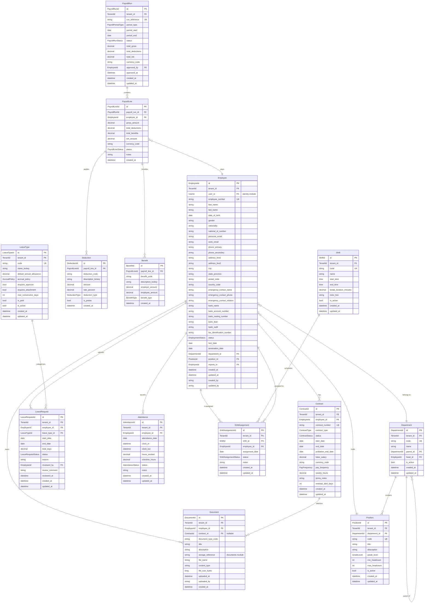
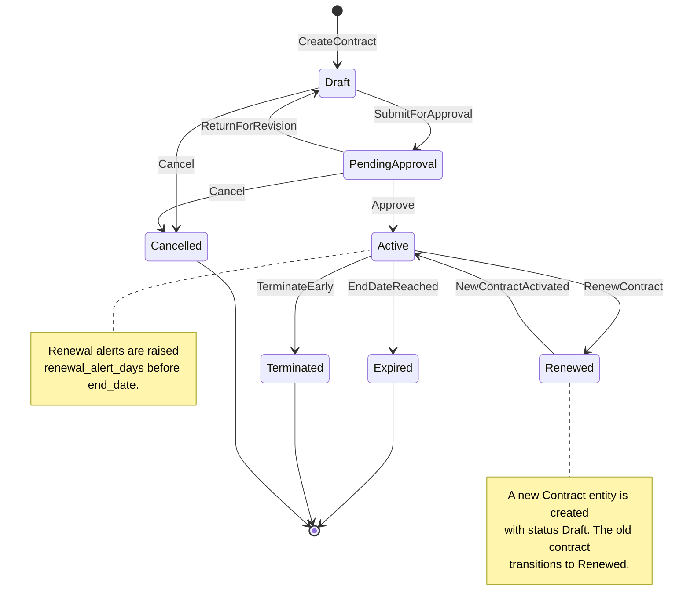
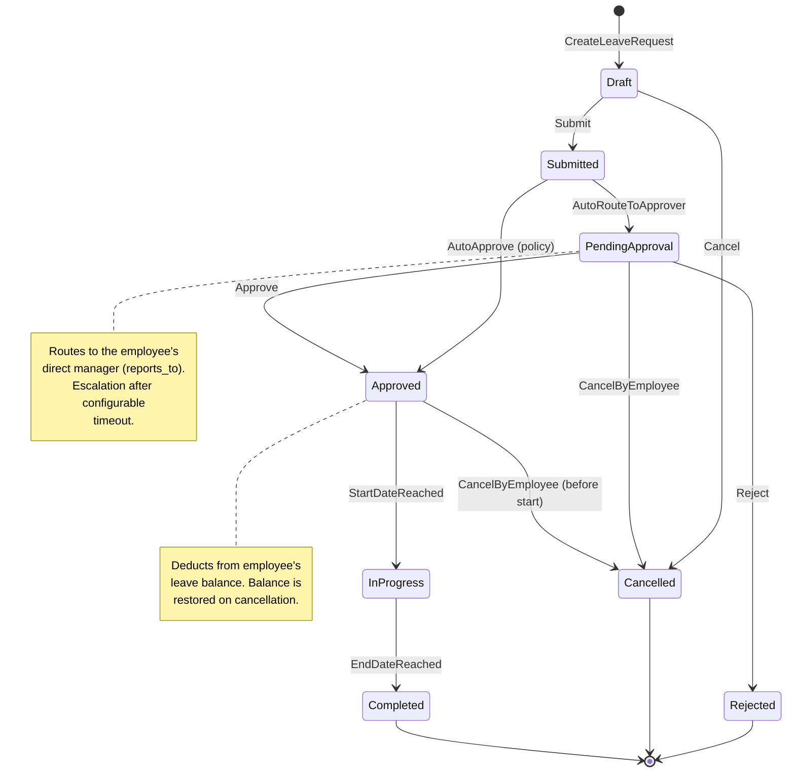
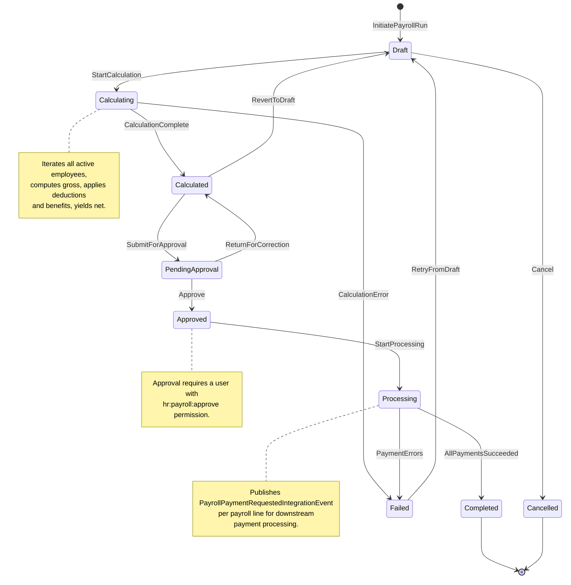
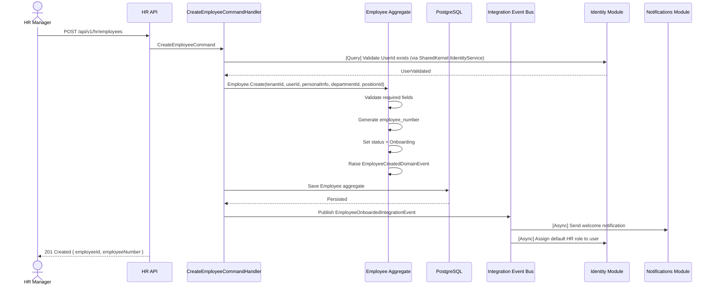
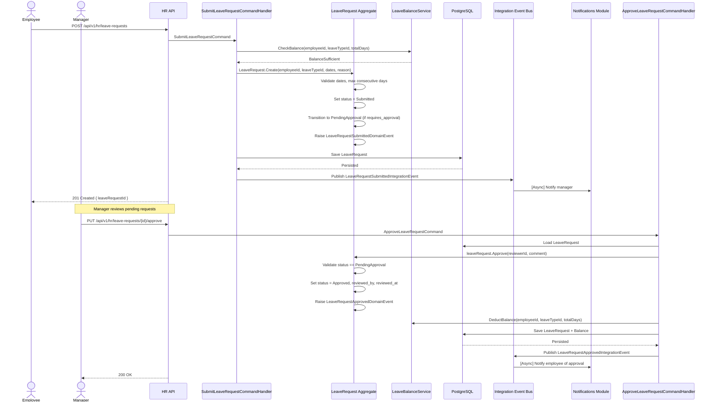
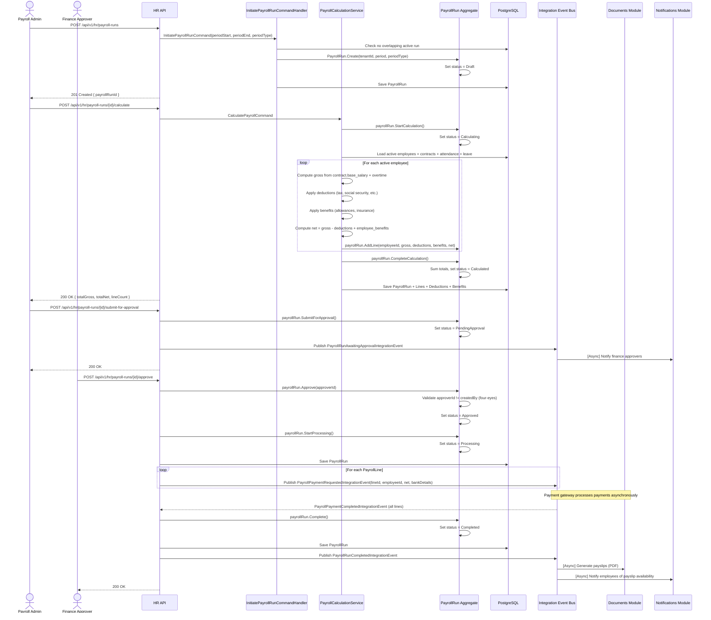
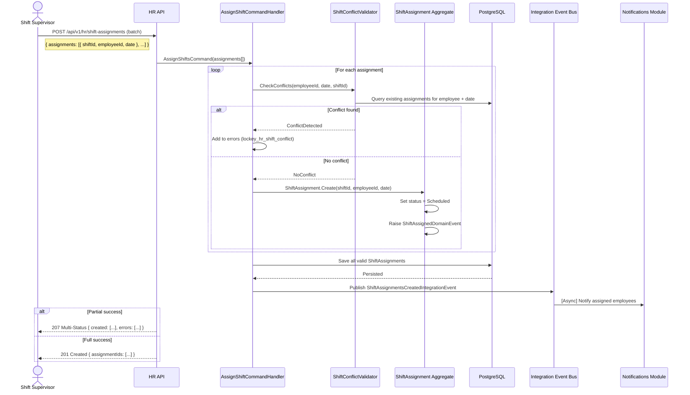
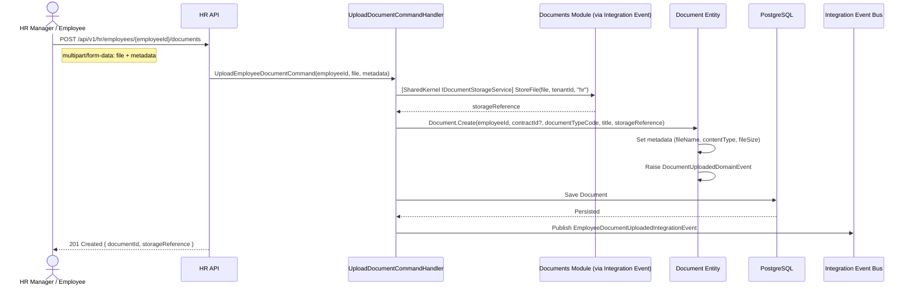

# HR & Payroll Module Specification

**Module ID:** `hr`
**Version:** 1.0.0
**Status:** Draft
**Last Updated:** 2026-03-19
**Owner:** Nexora Platform Team
**Table Prefix:** `hr_`

---

## 1. Module Overview

The HR & Payroll module provides comprehensive human-resource management for the Nexora platform. It manages the full employee lifecycle from onboarding through offboarding, handles contract administration with automated renewal alerts, processes payroll with configurable deduction and benefit schemes, administers leave policies and approvals, and coordinates task assignment and shift scheduling across departments.

The module is designed for multi-tenant, multi-organization deployments. Each tenant can operate independent organizational structures, pay schedules, leave policies, and shift patterns. All domain entities use strongly-typed IDs, follow a rich domain model with encapsulated behavior, and communicate across module boundaries exclusively through integration events or SharedKernel interfaces.

### 1.1 Capabilities

| Capability | Description |
|---|---|
| Employee Records | Personal info, emergency contacts, bank details, digital personnel files |
| Contract Management | Fixed-term and indefinite contracts, renewal alerts, amendment history |
| Department & Position | Hierarchical org structure, position definitions, headcount tracking |
| Payroll Processing | Configurable pay periods, gross-to-net calculation, deductions, benefits |
| Leave Management | Configurable leave types, accrual rules, request/approval workflows |
| Attendance & Shifts | Shift definitions, staff scheduling, attendance tracking |
| Document Management | Digital personnel files linked to employees and contracts |

### 1.2 Module Dependencies

```json
{
  "moduleId": "hr",
  "dependencies": [
    {
      "moduleId": "identity",
      "reason": "User account linking, role/permission resolution, authentication context"
    },
    {
      "moduleId": "contacts",
      "reason": "Shared contact model for emergency contacts, external references"
    },
    {
      "moduleId": "notifications",
      "reason": "Email/push/SMS delivery for leave approvals, contract renewals, payroll alerts"
    },
    {
      "moduleId": "documents",
      "reason": "File storage and retrieval for personnel documents, contract attachments"
    }
  ]
}
```

### 1.3 Architecture Principles

- **Clean Architecture** per module: Domain -> Application -> Infrastructure -> API layers.
- **CQRS**: Commands mutate state through the domain model; Queries read from optimized projections.
- **Rich Domain Model**: Entities encapsulate invariants and expose behavior methods rather than bare setters.
- **Strongly-Typed IDs**: Every entity uses a value-object ID (e.g., `EmployeeId`, `ContractId`) to prevent primitive obsession.
- **Localization Keys**: All user-facing messages reference `lockey_` keys resolved at the API layer.
- **Integration Events**: Cross-module communication uses async events published to the message bus; no direct module-to-module calls.
- **Table Prefix**: All database tables are prefixed with `hr_` to avoid collisions in the shared PostgreSQL schema.

---

## 2. Domain Model

### 2.1 Entity-Relationship Diagram



### 2.2 Enumerations

```csharp
public enum EmploymentStatus { Onboarding, Active, OnLeave, Suspended, Terminated, Retired }
public enum ContractType { Permanent, FixedTerm, Internship, Freelance, Temporary }
public enum ContractStatus { Draft, PendingApproval, Active, Renewed, Expired, Terminated, Cancelled }
public enum PayFrequency { Weekly, Biweekly, Monthly, Semimonthly }
public enum PayrollPeriodType { Weekly, Biweekly, Monthly, Semimonthly, Adhoc }
public enum PayrollRunStatus { Draft, Calculating, Calculated, PendingApproval, Approved, Processing, Completed, Failed, Cancelled }
public enum PayrollLineStatus { Pending, Calculated, Approved, Paid, Failed }
public enum DeductionType { Tax, SocialSecurity, HealthInsurance, Pension, LoanRepayment, Garnishment, Other }
public enum BenefitType { HealthInsurance, DentalInsurance, VisionInsurance, LifeInsurance, Retirement, TransportAllowance, MealAllowance, HousingAllowance, Other }
public enum LeaveRequestStatus { Draft, Submitted, PendingApproval, Approved, Rejected, Cancelled, InProgress, Completed }
public enum AttendanceStatus { Present, Absent, Late, HalfDay, Holiday, OnLeave }
public enum ShiftAssignmentStatus { Scheduled, Confirmed, InProgress, Completed, NoShow, Cancelled }
public enum AccrualPolicy { None, Monthly, Quarterly, Annual, FrontLoaded }
```

### 2.3 Strongly-Typed IDs

Every aggregate root and entity uses a strongly-typed ID implemented as a readonly record struct wrapping a `Guid`:

```csharp
public readonly record struct EmployeeId(Guid Value) : IStronglyTypedId;
public readonly record struct ContractId(Guid Value) : IStronglyTypedId;
public readonly record struct DepartmentId(Guid Value) : IStronglyTypedId;
public readonly record struct PositionId(Guid Value) : IStronglyTypedId;
public readonly record struct PayrollRunId(Guid Value) : IStronglyTypedId;
public readonly record struct PayrollLineId(Guid Value) : IStronglyTypedId;
public readonly record struct DeductionId(Guid Value) : IStronglyTypedId;
public readonly record struct BenefitId(Guid Value) : IStronglyTypedId;
public readonly record struct LeaveTypeId(Guid Value) : IStronglyTypedId;
public readonly record struct LeaveRequestId(Guid Value) : IStronglyTypedId;
public readonly record struct AttendanceId(Guid Value) : IStronglyTypedId;
public readonly record struct ShiftId(Guid Value) : IStronglyTypedId;
public readonly record struct ShiftAssignmentId(Guid Value) : IStronglyTypedId;
public readonly record struct DocumentId(Guid Value) : IStronglyTypedId;
```

---

## 3. State Diagrams

### 3.1 Contract Lifecycle



**Business Rules:**
- A contract can only be approved if the employee has `Active` or `Onboarding` employment status.
- Only one contract per employee can be in `Active` status at any time. The domain model enforces this invariant in `Employee.ActivateContract()`.
- Terminating an active contract triggers the `ContractTerminatedIntegrationEvent`, which the notifications module consumes to alert HR managers.
- Renewal creates a new `Contract` aggregate linked to the same employee; the predecessor contract transitions to `Renewed`.

### 3.2 Leave Request Workflow



**Business Rules:**
- Leave types flagged `requires_approval = false` bypass the `PendingApproval` state and transition directly to `Approved`.
- Leave types flagged `requires_attachment = true` reject submission if no document is attached.
- `max_consecutive_days` is validated at submission time; violations raise `lockey_hr_leave_max_consecutive_exceeded`.
- Cancellation after the start date is not permitted; the employee must request an early-return amendment instead.
- Balance check occurs at submission: insufficient balance raises `lockey_hr_leave_insufficient_balance`.

### 3.3 Payroll Run Lifecycle



**Business Rules:**
- A payroll run cannot overlap another `Active` or `Processing` run for the same period and tenant.
- Calculation pulls data from active contracts (base salary, pay frequency), attendance records, approved leave, and configured deductions/benefits.
- The `Approve` transition requires a different user than the one who created the run (four-eyes principle).
- On `Completed`, the `PayrollRunCompletedIntegrationEvent` is published, which triggers payslip generation in the documents module.

---

## 4. Use Cases

### 4.1 UC-01: Onboard New Employee

**Actors:** HR Manager
**Preconditions:** User account exists in the identity module.
**Postconditions:** Employee record created, initial contract drafted, welcome notification sent.



### 4.2 UC-02: Submit and Approve Leave Request

**Actors:** Employee, Manager
**Preconditions:** Employee is active; leave type exists; sufficient balance.
**Postconditions:** Leave balance decremented; calendar updated; manager notified then employee notified of decision.



### 4.3 UC-03: Run Monthly Payroll

**Actors:** Payroll Administrator, Finance Approver
**Preconditions:** All attendance records finalized for the period; no overlapping active run.
**Postconditions:** Payroll lines calculated, approved, payment events published.



### 4.4 UC-04: Assign Staff to Shifts

**Actors:** Shift Supervisor
**Preconditions:** Shifts defined; employees are active; no conflicting assignments.
**Postconditions:** Employees assigned to shifts; notifications sent.



### 4.5 UC-05: Upload Personnel Document

**Actors:** HR Manager, Employee (self-service)
**Preconditions:** Employee exists; document storage available.
**Postconditions:** Document metadata stored in HR module; file stored via documents module.



---

## 5. API Endpoints

All endpoints are scoped under `/api/v1/hr` and require a valid tenant context (resolved from the JWT `tenant_id` claim). Standard pagination uses `?page=1&pageSize=20`. Sorting uses `?sortBy=field&sortDir=asc|desc`. Filtering uses query parameters specific to each resource.

### 5.1 Employees

| Method | Path | Description | Permission |
|--------|------|-------------|------------|
| `POST` | `/employees` | Create a new employee record | `hr:employees:create` |
| `GET` | `/employees` | List employees (paginated, filterable by department, status) | `hr:employees:read` |
| `GET` | `/employees/{employeeId}` | Get employee details | `hr:employees:read` |
| `PUT` | `/employees/{employeeId}` | Update employee personal information | `hr:employees:update` |
| `PATCH` | `/employees/{employeeId}/status` | Change employment status | `hr:employees:update-status` |
| `DELETE` | `/employees/{employeeId}` | Soft-delete (archive) employee | `hr:employees:delete` |
| `GET` | `/employees/{employeeId}/contracts` | List contracts for employee | `hr:contracts:read` |
| `GET` | `/employees/{employeeId}/leave-balance` | Get leave balance summary | `hr:leave:read` |
| `GET` | `/employees/{employeeId}/leave-requests` | List leave requests for employee | `hr:leave:read` |
| `GET` | `/employees/{employeeId}/attendance` | List attendance records | `hr:attendance:read` |
| `GET` | `/employees/{employeeId}/shift-assignments` | List shift assignments | `hr:shifts:read` |
| `GET` | `/employees/{employeeId}/documents` | List personnel documents | `hr:documents:read` |
| `POST` | `/employees/{employeeId}/documents` | Upload personnel document | `hr:documents:create` |
| `GET` | `/employees/{employeeId}/payroll-history` | List payroll lines for employee | `hr:payroll:read` |

### 5.2 Contracts

| Method | Path | Description | Permission |
|--------|------|-------------|------------|
| `POST` | `/contracts` | Create a new contract | `hr:contracts:create` |
| `GET` | `/contracts` | List contracts (filterable by status, type, expiry range) | `hr:contracts:read` |
| `GET` | `/contracts/{contractId}` | Get contract details | `hr:contracts:read` |
| `PUT` | `/contracts/{contractId}` | Update contract terms | `hr:contracts:update` |
| `POST` | `/contracts/{contractId}/submit` | Submit contract for approval | `hr:contracts:submit` |
| `POST` | `/contracts/{contractId}/approve` | Approve contract | `hr:contracts:approve` |
| `POST` | `/contracts/{contractId}/return` | Return contract for revision | `hr:contracts:approve` |
| `POST` | `/contracts/{contractId}/activate` | Activate an approved contract | `hr:contracts:activate` |
| `POST` | `/contracts/{contractId}/terminate` | Terminate contract early | `hr:contracts:terminate` |
| `POST` | `/contracts/{contractId}/renew` | Renew contract (creates new draft) | `hr:contracts:renew` |
| `POST` | `/contracts/{contractId}/cancel` | Cancel draft/pending contract | `hr:contracts:cancel` |
| `GET` | `/contracts/expiring` | List contracts expiring within N days | `hr:contracts:read` |

### 5.3 Departments

| Method | Path | Description | Permission |
|--------|------|-------------|------------|
| `POST` | `/departments` | Create department | `hr:departments:create` |
| `GET` | `/departments` | List departments (tree or flat) | `hr:departments:read` |
| `GET` | `/departments/{departmentId}` | Get department details | `hr:departments:read` |
| `PUT` | `/departments/{departmentId}` | Update department | `hr:departments:update` |
| `DELETE` | `/departments/{departmentId}` | Deactivate department | `hr:departments:delete` |
| `GET` | `/departments/{departmentId}/employees` | List employees in department | `hr:employees:read` |
| `GET` | `/departments/{departmentId}/positions` | List positions in department | `hr:positions:read` |
| `GET` | `/departments/tree` | Get full org tree for tenant | `hr:departments:read` |

### 5.4 Positions

| Method | Path | Description | Permission |
|--------|------|-------------|------------|
| `POST` | `/positions` | Create position | `hr:positions:create` |
| `GET` | `/positions` | List positions | `hr:positions:read` |
| `GET` | `/positions/{positionId}` | Get position details | `hr:positions:read` |
| `PUT` | `/positions/{positionId}` | Update position | `hr:positions:update` |
| `DELETE` | `/positions/{positionId}` | Deactivate position | `hr:positions:delete` |

### 5.5 Payroll Runs

| Method | Path | Description | Permission |
|--------|------|-------------|------------|
| `POST` | `/payroll-runs` | Initiate a new payroll run | `hr:payroll:create` |
| `GET` | `/payroll-runs` | List payroll runs (filterable by status, period) | `hr:payroll:read` |
| `GET` | `/payroll-runs/{runId}` | Get payroll run details with summary | `hr:payroll:read` |
| `GET` | `/payroll-runs/{runId}/lines` | List payroll lines for a run | `hr:payroll:read` |
| `GET` | `/payroll-runs/{runId}/lines/{lineId}` | Get payroll line detail (deductions + benefits) | `hr:payroll:read` |
| `POST` | `/payroll-runs/{runId}/calculate` | Trigger calculation | `hr:payroll:calculate` |
| `POST` | `/payroll-runs/{runId}/submit-for-approval` | Submit calculated run for approval | `hr:payroll:submit` |
| `POST` | `/payroll-runs/{runId}/approve` | Approve payroll run | `hr:payroll:approve` |
| `POST` | `/payroll-runs/{runId}/process` | Start payment processing | `hr:payroll:process` |
| `POST` | `/payroll-runs/{runId}/cancel` | Cancel a draft/calculated run | `hr:payroll:cancel` |
| `POST` | `/payroll-runs/{runId}/revert` | Revert calculated run to draft | `hr:payroll:update` |

### 5.6 Leave Types

| Method | Path | Description | Permission |
|--------|------|-------------|------------|
| `POST` | `/leave-types` | Create leave type | `hr:leave-types:create` |
| `GET` | `/leave-types` | List leave types | `hr:leave-types:read` |
| `GET` | `/leave-types/{leaveTypeId}` | Get leave type details | `hr:leave-types:read` |
| `PUT` | `/leave-types/{leaveTypeId}` | Update leave type | `hr:leave-types:update` |
| `DELETE` | `/leave-types/{leaveTypeId}` | Deactivate leave type | `hr:leave-types:delete` |

### 5.7 Leave Requests

| Method | Path | Description | Permission |
|--------|------|-------------|------------|
| `POST` | `/leave-requests` | Create and submit leave request | `hr:leave:create` |
| `GET` | `/leave-requests` | List leave requests (filterable by status, employee, date range) | `hr:leave:read` |
| `GET` | `/leave-requests/{requestId}` | Get leave request details | `hr:leave:read` |
| `PUT` | `/leave-requests/{requestId}` | Update draft leave request | `hr:leave:update` |
| `POST` | `/leave-requests/{requestId}/submit` | Submit a draft request | `hr:leave:submit` |
| `POST` | `/leave-requests/{requestId}/approve` | Approve leave request | `hr:leave:approve` |
| `POST` | `/leave-requests/{requestId}/reject` | Reject leave request | `hr:leave:approve` |
| `POST` | `/leave-requests/{requestId}/cancel` | Cancel leave request | `hr:leave:cancel` |
| `GET` | `/leave-requests/pending` | List requests pending current user's approval | `hr:leave:approve` |
| `GET` | `/leave-requests/calendar` | Calendar view of approved leave (team/department) | `hr:leave:read` |

### 5.8 Attendance

| Method | Path | Description | Permission |
|--------|------|-------------|------------|
| `POST` | `/attendance/clock-in` | Record clock-in for current user | `hr:attendance:self` |
| `POST` | `/attendance/clock-out` | Record clock-out for current user | `hr:attendance:self` |
| `POST` | `/attendance` | Create/correct attendance record (admin) | `hr:attendance:create` |
| `GET` | `/attendance` | List attendance records (filterable by employee, date range) | `hr:attendance:read` |
| `GET` | `/attendance/{attendanceId}` | Get attendance record details | `hr:attendance:read` |
| `PUT` | `/attendance/{attendanceId}` | Update attendance record | `hr:attendance:update` |
| `GET` | `/attendance/summary` | Attendance summary report (department, period) | `hr:attendance:read` |

### 5.9 Shifts

| Method | Path | Description | Permission |
|--------|------|-------------|------------|
| `POST` | `/shifts` | Create shift definition | `hr:shifts:create` |
| `GET` | `/shifts` | List shift definitions | `hr:shifts:read` |
| `GET` | `/shifts/{shiftId}` | Get shift details | `hr:shifts:read` |
| `PUT` | `/shifts/{shiftId}` | Update shift definition | `hr:shifts:update` |
| `DELETE` | `/shifts/{shiftId}` | Deactivate shift | `hr:shifts:delete` |

### 5.10 Shift Assignments

| Method | Path | Description | Permission |
|--------|------|-------------|------------|
| `POST` | `/shift-assignments` | Create shift assignments (single or batch) | `hr:shifts:assign` |
| `GET` | `/shift-assignments` | List assignments (filterable by employee, shift, date range) | `hr:shifts:read` |
| `GET` | `/shift-assignments/{assignmentId}` | Get assignment details | `hr:shifts:read` |
| `PUT` | `/shift-assignments/{assignmentId}` | Update assignment | `hr:shifts:update` |
| `POST` | `/shift-assignments/{assignmentId}/confirm` | Employee confirms assignment | `hr:shifts:self` |
| `POST` | `/shift-assignments/{assignmentId}/cancel` | Cancel assignment | `hr:shifts:assign` |
| `GET` | `/shift-assignments/schedule` | Weekly/monthly schedule view (department, team) | `hr:shifts:read` |

### 5.11 Documents

| Method | Path | Description | Permission |
|--------|------|-------------|------------|
| `GET` | `/documents/{documentId}` | Get document metadata | `hr:documents:read` |
| `GET` | `/documents/{documentId}/download` | Download document file | `hr:documents:read` |
| `DELETE` | `/documents/{documentId}` | Delete document | `hr:documents:delete` |

---

## 6. Integration Events

### 6.1 Published Events

Events published by the HR module for consumption by other modules.

| Event | Trigger | Payload | Consumers |
|-------|---------|---------|-----------|
| `EmployeeOnboardedIntegrationEvent` | Employee created with status Onboarding | `{ EmployeeId, TenantId, UserId, FullName, DepartmentId, PositionId }` | `identity` (role assignment), `notifications` (welcome email) |
| `EmployeeStatusChangedIntegrationEvent` | Employment status transitions | `{ EmployeeId, TenantId, PreviousStatus, NewStatus, EffectiveDate }` | `identity` (enable/disable account), `notifications` |
| `EmployeeTerminatedIntegrationEvent` | Employee terminated or retired | `{ EmployeeId, TenantId, UserId, TerminationDate, Reason }` | `identity` (deactivate account), `notifications`, all modules (cleanup) |
| `ContractActivatedIntegrationEvent` | Contract status -> Active | `{ ContractId, EmployeeId, TenantId, ContractType, StartDate, EndDate }` | `notifications` |
| `ContractExpiringIntegrationEvent` | Scheduled alert: contract nearing end_date | `{ ContractId, EmployeeId, TenantId, EndDate, DaysRemaining }` | `notifications` (alert HR managers) |
| `ContractTerminatedIntegrationEvent` | Contract terminated early | `{ ContractId, EmployeeId, TenantId, TerminationDate }` | `notifications` |
| `LeaveRequestSubmittedIntegrationEvent` | Leave request submitted for approval | `{ LeaveRequestId, EmployeeId, TenantId, LeaveTypeCode, StartDate, EndDate, ManagerId }` | `notifications` (notify manager) |
| `LeaveRequestApprovedIntegrationEvent` | Leave request approved | `{ LeaveRequestId, EmployeeId, TenantId, LeaveTypeCode, StartDate, EndDate }` | `notifications` (notify employee) |
| `LeaveRequestRejectedIntegrationEvent` | Leave request rejected | `{ LeaveRequestId, EmployeeId, TenantId, ReviewComment }` | `notifications` (notify employee) |
| `PayrollRunCompletedIntegrationEvent` | Payroll run fully processed | `{ PayrollRunId, TenantId, PeriodStart, PeriodEnd, TotalNet, LineCount }` | `documents` (generate payslips), `notifications` |
| `PayrollPaymentRequestedIntegrationEvent` | Per payroll line, during processing | `{ PayrollLineId, PayrollRunId, EmployeeId, TenantId, NetAmount, CurrencyCode, BankDetails }` | Payment gateway module |
| `PayrollRunAwaitingApprovalIntegrationEvent` | Payroll run submitted for approval | `{ PayrollRunId, TenantId, PeriodStart, PeriodEnd, TotalGross, TotalNet }` | `notifications` (notify approvers) |
| `ShiftAssignmentsCreatedIntegrationEvent` | Batch shift assignment created | `{ TenantId, Assignments: [{ ShiftAssignmentId, EmployeeId, ShiftId, Date }] }` | `notifications` (notify employees) |
| `EmployeeDocumentUploadedIntegrationEvent` | Document uploaded to personnel file | `{ DocumentId, EmployeeId, TenantId, DocumentTypeCode }` | `documents` (indexing) |

### 6.2 Consumed Events

Events consumed by the HR module from other modules.

| Event | Source Module | Handler | Action |
|-------|---------------|---------|--------|
| `UserDeactivatedIntegrationEvent` | `identity` | `UserDeactivatedHandler` | Sets employee status to `Suspended` if currently `Active`. Logs reason. |
| `UserDeletedIntegrationEvent` | `identity` | `UserDeletedHandler` | Triggers employee offboarding workflow. Archives records. |
| `ContactUpdatedIntegrationEvent` | `contacts` | `ContactUpdatedHandler` | Syncs updated emergency contact information to the employee record if linked. |
| `DocumentStoredIntegrationEvent` | `documents` | `DocumentStoredHandler` | Updates document entity with confirmed `storage_reference` and file metadata. |
| `DocumentDeletedIntegrationEvent` | `documents` | `DocumentDeletedHandler` | Removes document reference from HR module when file is purged from storage. |
| `PayrollPaymentCompletedIntegrationEvent` | Payment gateway | `PaymentCompletedHandler` | Updates `PayrollLine.Status` to `Paid`. When all lines are paid, transitions `PayrollRun` to `Completed`. |
| `PayrollPaymentFailedIntegrationEvent` | Payment gateway | `PaymentFailedHandler` | Updates `PayrollLine.Status` to `Failed`. Transitions `PayrollRun` to `Failed` if threshold exceeded. |
| `TenantConfigurationChangedIntegrationEvent` | `identity` | `TenantConfigChangedHandler` | Refreshes cached tenant-specific HR configuration (pay schedules, leave policies). |

---

## 7. Localization Keys

All user-facing messages, validation errors, and notification templates reference localization keys prefixed with `lockey_hr_`. Keys are resolved by the API layer using the tenant's configured locale.

| Key | Context | Default (en) |
|-----|---------|--------------|
| `lockey_hr_employee_created` | Success toast | Employee record created successfully. |
| `lockey_hr_employee_not_found` | 404 error | Employee not found. |
| `lockey_hr_employee_number_duplicate` | Validation | An employee with this number already exists. |
| `lockey_hr_contract_overlap` | Validation | Employee already has an active contract for this period. |
| `lockey_hr_contract_approved` | Success | Contract has been approved and is now active. |
| `lockey_hr_contract_expiring_alert` | Notification | Contract for {employeeName} expires in {days} days. |
| `lockey_hr_contract_invalid_transition` | Validation | Cannot transition contract from {currentStatus} to {targetStatus}. |
| `lockey_hr_leave_insufficient_balance` | Validation | Insufficient leave balance. Available: {available}, Requested: {requested}. |
| `lockey_hr_leave_max_consecutive_exceeded` | Validation | Maximum consecutive days ({max}) exceeded for this leave type. |
| `lockey_hr_leave_approved` | Notification | Your leave request from {startDate} to {endDate} has been approved. |
| `lockey_hr_leave_rejected` | Notification | Your leave request has been rejected. Reason: {comment}. |
| `lockey_hr_leave_attachment_required` | Validation | This leave type requires a supporting document. |
| `lockey_hr_payroll_overlap` | Validation | A payroll run already exists for this period. |
| `lockey_hr_payroll_four_eyes` | Validation | Payroll run cannot be approved by the same user who created it. |
| `lockey_hr_payroll_completed` | Notification | Payroll for period {periodStart} - {periodEnd} has been completed. |
| `lockey_hr_shift_conflict` | Validation | Employee {employeeName} already has a shift assigned on {date}. |
| `lockey_hr_shift_assigned` | Notification | You have been assigned to shift {shiftName} on {date}. |
| `lockey_hr_document_uploaded` | Success | Document uploaded successfully. |
| `lockey_hr_department_has_employees` | Validation | Cannot deactivate department with active employees. |
| `lockey_hr_position_headcount_exceeded` | Validation | Maximum headcount ({max}) for this position has been reached. |
| `lockey_hr_unauthorized` | 403 error | You do not have permission to perform this action. |

---

## 8. CQRS Command and Query Catalog

### 8.1 Commands

| Command | Handler | Aggregate | Side Effects |
|---------|---------|-----------|-------------|
| `CreateEmployeeCommand` | `CreateEmployeeCommandHandler` | `Employee` | Publishes `EmployeeOnboardedIntegrationEvent` |
| `UpdateEmployeeCommand` | `UpdateEmployeeCommandHandler` | `Employee` | -- |
| `ChangeEmployeeStatusCommand` | `ChangeEmployeeStatusCommandHandler` | `Employee` | Publishes `EmployeeStatusChangedIntegrationEvent` |
| `CreateContractCommand` | `CreateContractCommandHandler` | `Contract` | -- |
| `SubmitContractCommand` | `SubmitContractCommandHandler` | `Contract` | -- |
| `ApproveContractCommand` | `ApproveContractCommandHandler` | `Contract` | Publishes `ContractActivatedIntegrationEvent` |
| `TerminateContractCommand` | `TerminateContractCommandHandler` | `Contract` | Publishes `ContractTerminatedIntegrationEvent` |
| `RenewContractCommand` | `RenewContractCommandHandler` | `Contract` | Creates new Contract, transitions old to Renewed |
| `InitiatePayrollRunCommand` | `InitiatePayrollRunCommandHandler` | `PayrollRun` | -- |
| `CalculatePayrollCommand` | `CalculatePayrollCommandHandler` | `PayrollRun` | Creates `PayrollLine`, `Deduction`, `Benefit` entities |
| `ApprovePayrollRunCommand` | `ApprovePayrollRunCommandHandler` | `PayrollRun` | Publishes `PayrollPaymentRequestedIntegrationEvent` per line |
| `SubmitLeaveRequestCommand` | `SubmitLeaveRequestCommandHandler` | `LeaveRequest` | Publishes `LeaveRequestSubmittedIntegrationEvent` |
| `ApproveLeaveRequestCommand` | `ApproveLeaveRequestCommandHandler` | `LeaveRequest` | Publishes `LeaveRequestApprovedIntegrationEvent`, deducts balance |
| `RejectLeaveRequestCommand` | `RejectLeaveRequestCommandHandler` | `LeaveRequest` | Publishes `LeaveRequestRejectedIntegrationEvent` |
| `RecordClockInCommand` | `RecordClockInCommandHandler` | `Attendance` | -- |
| `RecordClockOutCommand` | `RecordClockOutCommandHandler` | `Attendance` | Calculates hours_worked, overtime |
| `AssignShiftsCommand` | `AssignShiftsCommandHandler` | `ShiftAssignment` | Publishes `ShiftAssignmentsCreatedIntegrationEvent` |
| `UploadEmployeeDocumentCommand` | `UploadDocumentCommandHandler` | `Document` | Publishes `EmployeeDocumentUploadedIntegrationEvent` |

### 8.2 Queries

| Query | Handler | Return Type |
|-------|---------|-------------|
| `GetEmployeeByIdQuery` | `GetEmployeeByIdQueryHandler` | `EmployeeDetailDto` |
| `ListEmployeesQuery` | `ListEmployeesQueryHandler` | `PagedResult<EmployeeSummaryDto>` |
| `GetContractByIdQuery` | `GetContractByIdQueryHandler` | `ContractDetailDto` |
| `ListContractsQuery` | `ListContractsQueryHandler` | `PagedResult<ContractSummaryDto>` |
| `ListExpiringContractsQuery` | `ListExpiringContractsQueryHandler` | `PagedResult<ContractExpiryDto>` |
| `GetPayrollRunByIdQuery` | `GetPayrollRunByIdQueryHandler` | `PayrollRunDetailDto` |
| `ListPayrollRunsQuery` | `ListPayrollRunsQueryHandler` | `PagedResult<PayrollRunSummaryDto>` |
| `GetPayrollLineDetailQuery` | `GetPayrollLineDetailQueryHandler` | `PayrollLineDetailDto` |
| `GetEmployeeLeaveBalanceQuery` | `GetEmployeeLeaveBalanceQueryHandler` | `LeaveBalanceSummaryDto` |
| `ListLeaveRequestsQuery` | `ListLeaveRequestsQueryHandler` | `PagedResult<LeaveRequestSummaryDto>` |
| `GetLeaveCalendarQuery` | `GetLeaveCalendarQueryHandler` | `LeaveCalendarDto` |
| `ListPendingApprovalsQuery` | `ListPendingApprovalsQueryHandler` | `PagedResult<LeaveRequestSummaryDto>` |
| `ListAttendanceQuery` | `ListAttendanceQueryHandler` | `PagedResult<AttendanceRecordDto>` |
| `GetAttendanceSummaryQuery` | `GetAttendanceSummaryQueryHandler` | `AttendanceSummaryDto` |
| `ListShiftAssignmentsQuery` | `ListShiftAssignmentsQueryHandler` | `PagedResult<ShiftAssignmentDto>` |
| `GetScheduleViewQuery` | `GetScheduleViewQueryHandler` | `ScheduleViewDto` |
| `GetDepartmentTreeQuery` | `GetDepartmentTreeQueryHandler` | `DepartmentTreeDto` |
| `ListEmployeeDocumentsQuery` | `ListEmployeeDocumentsQueryHandler` | `PagedResult<DocumentSummaryDto>` |
| `GetEmployeePayrollHistoryQuery` | `GetEmployeePayrollHistoryQueryHandler` | `PagedResult<PayrollLineSummaryDto>` |

---

## 9. Database Schema Notes

### 9.1 Table Naming

All tables use the `hr_` prefix within the shared PostgreSQL database:

| Entity | Table Name |
|--------|------------|
| Employee | `hr_employees` |
| Contract | `hr_contracts` |
| Department | `hr_departments` |
| Position | `hr_positions` |
| PayrollRun | `hr_payroll_runs` |
| PayrollLine | `hr_payroll_lines` |
| Deduction | `hr_deductions` |
| Benefit | `hr_benefits` |
| LeaveType | `hr_leave_types` |
| LeaveRequest | `hr_leave_requests` |
| Attendance | `hr_attendance` |
| Shift | `hr_shifts` |
| ShiftAssignment | `hr_shift_assignments` |
| Document | `hr_documents` |
| LeaveBalance | `hr_leave_balances` |
| OutboxMessage | `hr_outbox_messages` |

### 9.2 Multi-Tenancy

Every table includes a `tenant_id` column. Row-level security (RLS) policies in PostgreSQL enforce tenant isolation. The `TenantId` is extracted from the JWT and applied as a global query filter via EF Core.

### 9.3 Indexing Strategy

| Table | Index | Type | Purpose |
|-------|-------|------|---------|
| `hr_employees` | `ix_hr_employees_tenant_status` | B-tree | Filter by tenant + status |
| `hr_employees` | `ix_hr_employees_tenant_department` | B-tree | Department listing |
| `hr_employees` | `ux_hr_employees_tenant_number` | Unique | Employee number uniqueness per tenant |
| `hr_employees` | `ux_hr_employees_tenant_userid` | Unique | One employee per user per tenant |
| `hr_contracts` | `ix_hr_contracts_employee_status` | B-tree | Active contract lookup |
| `hr_contracts` | `ix_hr_contracts_end_date` | B-tree | Expiry alert queries |
| `hr_payroll_runs` | `ix_hr_payroll_runs_tenant_period` | B-tree | Overlap detection |
| `hr_leave_requests` | `ix_hr_leave_requests_employee_dates` | B-tree | Overlap detection |
| `hr_leave_requests` | `ix_hr_leave_requests_status` | B-tree | Pending approval listing |
| `hr_attendance` | `ix_hr_attendance_employee_date` | B-tree, Unique | One record per employee per day |
| `hr_shift_assignments` | `ix_hr_shift_assignments_employee_date` | B-tree | Conflict detection |
| `hr_outbox_messages` | `ix_hr_outbox_processed` | B-tree | Outbox polling |

### 9.4 Auditing

All aggregate roots implement `IAuditableEntity` from the SharedKernel, providing `created_at`, `updated_at`, `created_by`, and `updated_by` columns. A separate `hr_audit_log` table stores a detailed event-sourced audit trail for sensitive operations (payroll approval, contract termination, status changes).

---

## 10. Non-Functional Requirements

### 10.1 Performance

| Metric | Target | Measurement |
|--------|--------|-------------|
| API response time (p95) | < 200ms for queries, < 500ms for commands | Application Performance Monitoring |
| Payroll calculation throughput | 10,000 employees per run within 60 seconds | Load test with synthetic data |
| Concurrent users per tenant | 500 simultaneous users | Load test |
| Database query execution | < 50ms for indexed queries | Query plan analysis |
| Bulk shift assignment | 1,000 assignments in a single batch within 5 seconds | Integration test |

### 10.2 Scalability

- Horizontal scaling via stateless API instances behind a load balancer.
- Payroll calculation is a long-running process executed as a background job (Hangfire/Quartz) to avoid HTTP timeout; the API returns a `202 Accepted` with a job tracking ID.
- Integration events are published to a durable message bus (RabbitMQ or Azure Service Bus) with at-least-once delivery and idempotent handlers.
- Read-model projections can be offloaded to a read replica for heavy reporting queries.

### 10.3 Security

| Requirement | Implementation |
|-------------|----------------|
| Authentication | JWT Bearer tokens issued by the identity module |
| Authorization | Permission-based with `hr:*` permission scheme; checked via a shared authorization middleware |
| Data encryption at rest | PostgreSQL TDE or application-level encryption for PII (bank details, national ID) |
| Data encryption in transit | TLS 1.3 enforced |
| PII protection | Bank account numbers, national IDs, and tax IDs stored encrypted using AES-256-GCM with tenant-scoped keys |
| Audit logging | All write operations logged with actor, timestamp, before/after state |
| GDPR compliance | Right-to-erasure support via employee anonymization endpoint; data retention policies per tenant |
| Row-level security | PostgreSQL RLS policies enforce tenant isolation at the database level |
| Rate limiting | 100 requests/minute per user for write endpoints; 1,000/minute for reads |
| Input validation | FluentValidation on all commands; parameterized queries via EF Core |

### 10.4 Reliability

| Requirement | Implementation |
|-------------|----------------|
| Outbox pattern | Integration events written to `hr_outbox_messages` table in the same transaction as the domain change; a background worker polls and publishes to the bus |
| Idempotency | All command handlers check for idempotency keys; integration event handlers use a processed-event table to skip duplicates |
| Transactional consistency | Each command handler runs in a single database transaction wrapping aggregate changes and outbox writes |
| Error handling | Domain exceptions map to structured `ProblemDetails` (RFC 9457) responses with `lockey_` references |
| Health checks | `/health/ready` and `/health/live` endpoints check database connectivity and message bus availability |
| Circuit breaker | Polly-based circuit breaker on external calls (document storage, notification service) |

### 10.5 Observability

| Requirement | Implementation |
|-------------|----------------|
| Structured logging | Serilog with correlation IDs propagated across integration events |
| Distributed tracing | OpenTelemetry with traces spanning API -> CommandHandler -> Database -> EventBus |
| Metrics | Prometheus counters for: commands processed, events published, payroll runs completed, API latency histograms |
| Alerting | PagerDuty/Opsgenie alerts on payroll run failures, event bus dead-letter accumulation, error rate spikes |
| Dashboards | Grafana dashboards for HR module KPIs: active employees, pending leave requests, payroll run status |

### 10.6 Testing

| Level | Coverage Target | Tooling |
|-------|----------------|---------|
| Unit tests (domain model) | >= 90% line coverage | xUnit, FluentAssertions |
| Unit tests (application layer) | >= 85% line coverage | xUnit, NSubstitute |
| Integration tests | All API endpoints, all state transitions | TestContainers (PostgreSQL), WebApplicationFactory |
| Contract tests | All published/consumed integration events | Pact |
| Performance tests | Payroll calculation, bulk operations | k6, NBomber |
| End-to-end tests | Critical flows (onboarding, payroll, leave) | Playwright |

### 10.7 Deployment

- **Database migrations**: EF Core migrations applied via a dedicated migration runner job that runs before the application starts.
- **Feature flags**: New capabilities (e.g., shift scheduling v2) gated behind feature flags managed via the platform's feature management system.
- **Backward compatibility**: Integration event schemas follow a versioned contract (`v1`, `v2`); old consumers are supported for at least two major versions.
- **Zero-downtime deployment**: Rolling deployments with readiness probes; database migrations are always backward-compatible (no column drops without a prior deprecation release).

---

## 11. Project Structure

```
src/Modules/HR/
  Nexora.HR.Domain/
    Entities/
      Employee.cs
      Contract.cs
      Department.cs
      Position.cs
      PayrollRun.cs
      PayrollLine.cs
      Deduction.cs
      Benefit.cs
      LeaveType.cs
      LeaveRequest.cs
      Attendance.cs
      Shift.cs
      ShiftAssignment.cs
      Document.cs
    ValueObjects/
      EmployeeId.cs
      ContractId.cs
      DepartmentId.cs
      PositionId.cs
      PayrollRunId.cs
      PayrollLineId.cs
      DeductionId.cs
      BenefitId.cs
      LeaveTypeId.cs
      LeaveRequestId.cs
      AttendanceId.cs
      ShiftId.cs
      ShiftAssignmentId.cs
      DocumentId.cs
      BankDetails.cs
      Address.cs
      EmergencyContact.cs
      Money.cs
      DateRange.cs
    Enums/
      EmploymentStatus.cs
      ContractType.cs
      ContractStatus.cs
      PayFrequency.cs
      PayrollRunStatus.cs
      PayrollLineStatus.cs
      DeductionType.cs
      BenefitType.cs
      LeaveRequestStatus.cs
      AttendanceStatus.cs
      ShiftAssignmentStatus.cs
      AccrualPolicy.cs
    Events/
      EmployeeCreatedDomainEvent.cs
      ContractStatusChangedDomainEvent.cs
      LeaveRequestSubmittedDomainEvent.cs
      LeaveRequestApprovedDomainEvent.cs
      PayrollRunStatusChangedDomainEvent.cs
      ShiftAssignedDomainEvent.cs
      DocumentUploadedDomainEvent.cs
    Interfaces/
      IEmployeeRepository.cs
      IContractRepository.cs
      IDepartmentRepository.cs
      IPositionRepository.cs
      IPayrollRunRepository.cs
      ILeaveTypeRepository.cs
      ILeaveRequestRepository.cs
      IAttendanceRepository.cs
      IShiftRepository.cs
      IShiftAssignmentRepository.cs
      IDocumentRepository.cs
    Services/
      ILeaveBalanceService.cs
      IPayrollCalculationService.cs
      IShiftConflictValidator.cs
  Nexora.HR.Application/
    Commands/
      Employees/
      Contracts/
      PayrollRuns/
      LeaveRequests/
      Attendance/
      Shifts/
      Documents/
    Queries/
      Employees/
      Contracts/
      PayrollRuns/
      LeaveRequests/
      Attendance/
      Shifts/
      Documents/
      Departments/
    DTOs/
    Validators/
    IntegrationEvents/
      Published/
      Consumed/
      Handlers/
    Mappings/
  Nexora.HR.Infrastructure/
    Persistence/
      HrDbContext.cs
      Configurations/
      Migrations/
      Repositories/
    Services/
      LeaveBalanceService.cs
      PayrollCalculationService.cs
      ShiftConflictValidator.cs
    Outbox/
      OutboxProcessor.cs
    BackgroundJobs/
      PayrollCalculationJob.cs
      ContractExpiryAlertJob.cs
      LeaveAccrualJob.cs
  Nexora.HR.API/
    Controllers/
      EmployeesController.cs
      ContractsController.cs
      DepartmentsController.cs
      PositionsController.cs
      PayrollRunsController.cs
      LeaveTypesController.cs
      LeaveRequestsController.cs
      AttendanceController.cs
      ShiftsController.cs
      ShiftAssignmentsController.cs
      DocumentsController.cs
    HrModuleRegistration.cs
```

---

## 12. Background Jobs

| Job | Schedule | Description |
|-----|----------|-------------|
| `ContractExpiryAlertJob` | Daily at 06:00 UTC | Queries contracts with `end_date` within `renewal_alert_days`. Publishes `ContractExpiringIntegrationEvent` for each. |
| `LeaveAccrualJob` | Monthly on the 1st at 00:00 UTC | For each active employee, calculates and credits leave balance based on `LeaveType.accrual_policy`. |
| `LeaveStatusTransitionJob` | Daily at 00:00 UTC | Transitions approved leave requests to `InProgress` on start date and to `Completed` on end date. |
| `OutboxProcessorJob` | Every 5 seconds | Polls `hr_outbox_messages` for unpublished events and publishes them to the message bus. |
| `AttendanceAutoClockOutJob` | Daily at 23:59 UTC | Auto-clocks-out employees who forgot to clock out; flags record for review. |

---

## 13. Open Questions and Future Considerations

| # | Topic | Status | Notes |
|---|-------|--------|-------|
| 1 | Multi-currency payroll | Deferred | Current design assumes single currency per contract. Multi-currency conversion would require integration with a rates service. |
| 2 | Overtime rules engine | Deferred | Complex overtime calculation (tiered rates, holiday multipliers) may warrant a dedicated rules engine. |
| 3 | Employee self-service portal | Planned v1.1 | Subset of endpoints exposed with `hr:*:self` permissions for employees to view their own data. |
| 4 | Org chart visualization | Planned v1.1 | API endpoint to return hierarchical org data suitable for front-end tree rendering. |
| 5 | Integration with external payroll providers | Deferred | Adapter pattern for providers like ADP, Gusto, or locale-specific systems. |
| 6 | Tax calculation engine | Deferred | Country-specific tax rules are complex. Initial version uses flat deduction configuration; a pluggable tax engine is planned. |
| 7 | Time-off-in-lieu (TOIL) | Planned v1.2 | Overtime hours convertible to leave balance. |
| 8 | Shift swap requests | Planned v1.2 | Employee-initiated shift swap workflow with supervisor approval. |

---

*This specification is a living document. Changes are tracked via version control. All modifications must be reviewed by the module owner and at least one platform architect before merging.*
