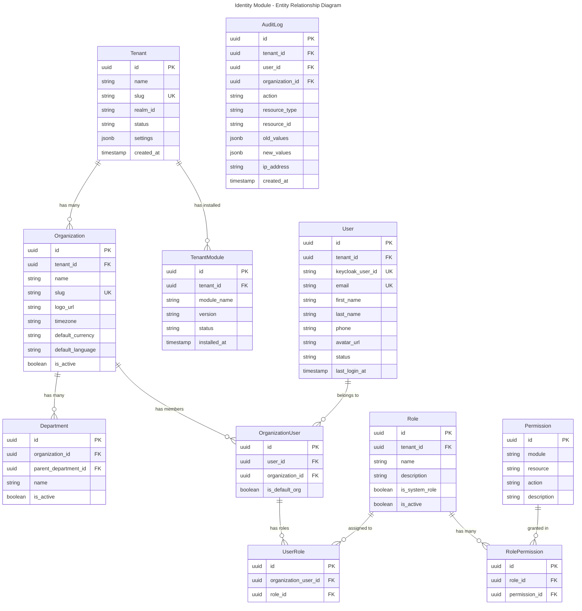
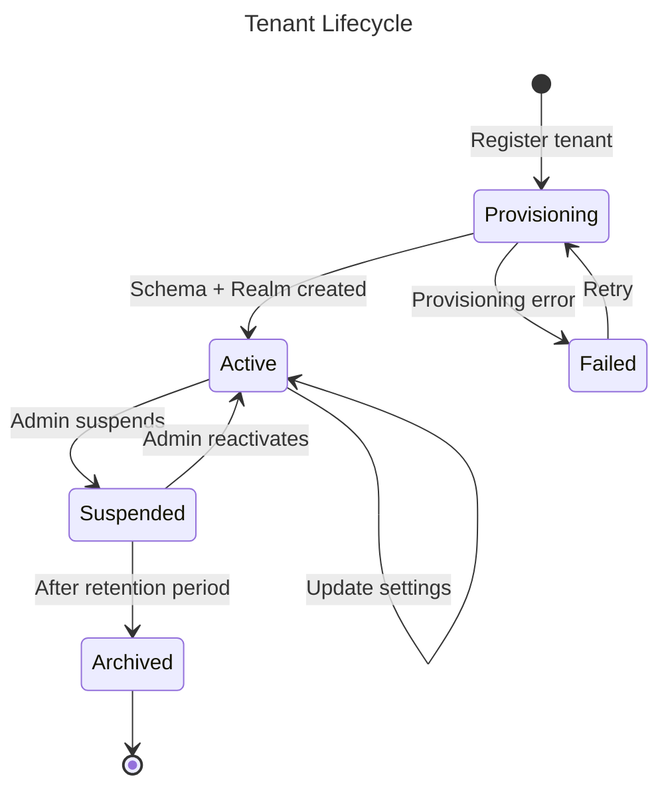
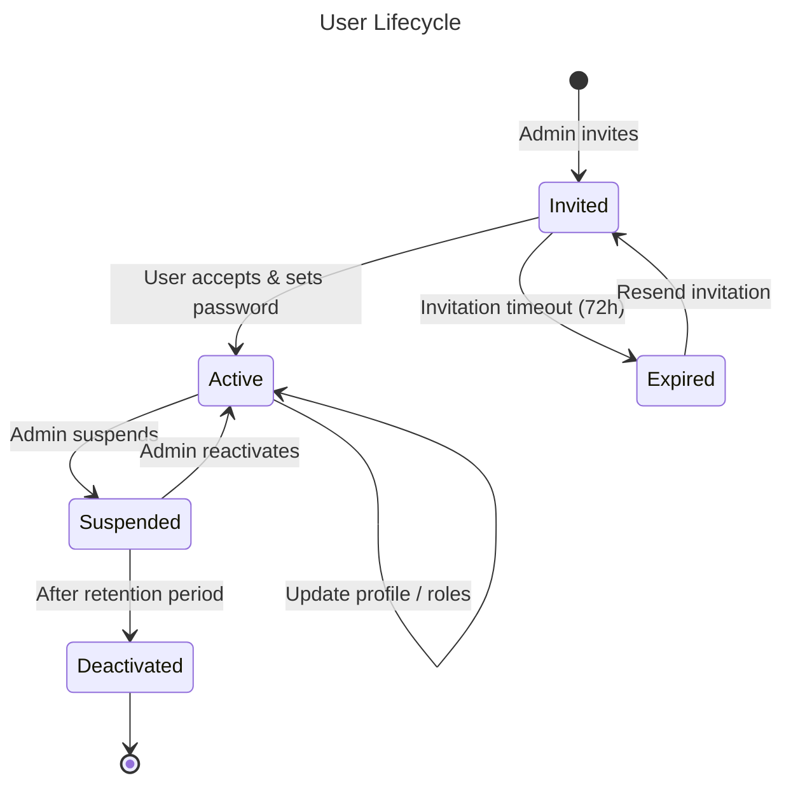

# Module: Identity & Access Management

## Overview
The Identity module is the **foundational module** of Nexora. It manages multi-tenancy, organizations, users, roles, and permissions. Every other module depends on it for authentication context, tenant resolution, and authorization checks. It integrates with Keycloak as the external identity provider and provides the internal permission/role engine.

## Domain Model

### Entities

### Value Objects

| Value Object | Description |
|-------------|-------------|
| `TenantId` | Strongly-typed tenant identifier |
| `OrganizationId` | Strongly-typed organization identifier |
| `UserId` | Strongly-typed user identifier |
| `Email` | Validated email address |
| `TenantSlug` | URL-safe tenant identifier (used in domain mapping) |
| `PermissionKey` | `{module}.{resource}.{action}` format string |

### Domain Events

| Event | Trigger | Consumers |
|-------|---------|-----------|
| `TenantCreated` | New tenant registered | Infrastructure (create PG schema, Keycloak realm) |
| `TenantSuspended` | Admin suspends tenant | All modules (disable access) |
| `OrganizationCreated` | New org within tenant | Contacts (create default address book), Finance (create default journal) |
| `UserCreated` | New user registered | Notifications (send welcome email), Contacts (link or create contact) |
| `UserDeactivated` | User account disabled | All modules (revoke sessions) |
| `RoleAssigned` | Role given to user | Audit log |
| `RoleRevoked` | Role removed from user | Audit log |
| `ModuleInstalled` | Module activated for tenant | Module (run initialization, seed data) |
| `ModuleUninstalled` | Module deactivated | Module (cleanup, archive data) |

### Entity Lifecycles

## Use Cases

### UC-IDN-001: Create Tenant
- **Actor**: Platform Admin
- **Preconditions**: Admin is authenticated with platform admin role
- **Flow**:
  1. Admin provides tenant name, slug, admin email
  2. System validates slug uniqueness
  3. System creates tenant record (status: Provisioning)
  4. System creates PostgreSQL schema for tenant
  5. System creates Keycloak realm for tenant
  6. System creates initial admin user in Keycloak
  7. System seeds default roles and permissions
  8. System installs default modules (Identity, Contacts)
  9. Tenant status → Active
  10. System sends welcome email to admin
- **Postconditions**: Tenant is active with schema, realm, and admin user
- **Business Rules**:
  - Slug must be unique, URL-safe, 3-50 characters
  - Admin email must be unique across platform
- **Exceptions**:
  - Schema creation fails → rollback, status → Failed, alert platform admin
  - Keycloak realm creation fails → rollback schema, status → Failed

### UC-IDN-002: Invite User
- **Actor**: Org Admin
- **Preconditions**: Actor has `admin.users.manage` permission for the organization
- **Flow**:
  1. Admin provides email, name, organization, roles
  2. System checks if user already exists in tenant
  3. If new: create user record (status: Invited), create Keycloak user, send invitation email
  4. If existing: add organization membership and roles, send notification
- **Postconditions**: User has pending invitation or new org membership
- **Business Rules**:
  - Maximum 1 invitation per email per 24 hours
  - Invitation expires after 72 hours
  - User can belong to multiple organizations with different roles

### UC-IDN-003: Resolve Tenant & Authorize Request
- **Actor**: System (middleware)
- **Preconditions**: Request has valid JWT
- **Flow**:
  1. Extract `tenant_id` from JWT claims
  2. Lookup tenant in cache (Redis) or DB
  3. Verify tenant is Active
  4. Set PostgreSQL `search_path` to tenant schema
  5. Extract `org_id` from request header (`X-Organization-Id`)
  6. Verify user has membership in requested organization
  7. Load user permissions for this organization (cached in Redis)
  8. Set current context (tenant, org, user, permissions)
- **Postconditions**: Request context is fully resolved, downstream code has access to tenant/org/user
- **Business Rules**:
  - Suspended tenants: return 403
  - No org membership: return 403
  - Missing org header: use user's default organization

### UC-IDN-004: Manage Roles & Permissions
- **Actor**: Tenant Admin
- **Preconditions**: Actor has `admin.roles.manage` permission
- **Flow**:
  1. Admin creates/edits role with name and permission set
  2. System validates permissions exist and are from installed modules
  3. System saves role
  4. If editing: invalidate permission cache for all users with this role
- **Business Rules**:
  - System roles (Platform Admin, Tenant Admin, Org Admin) cannot be deleted or have permissions removed
  - Custom roles can use wildcard permissions: `crm.*`, `crm.leads.*`
  - Permission changes take effect on next request (cache invalidation)

### UC-IDN-005: Switch Organization
- **Actor**: User (with multi-org access)
- **Preconditions**: User is authenticated
- **Flow**:
  1. User selects target organization from dropdown
  2. Frontend sets `X-Organization-Id` header on subsequent requests
  3. API resolves new org context
  4. UI refreshes with organization-specific data
- **Business Rules**:
  - User can only switch to organizations they are a member of
  - Permissions change based on target organization's roles

## API Endpoints

### Tenant Management (Platform Admin)
| Method | Path | Description | Auth |
|--------|------|-------------|------|
| POST | `/api/v1/identity/tenants` | Create tenant | `platform.tenants.create` |
| GET | `/api/v1/identity/tenants` | List tenants | `platform.tenants.read` |
| GET | `/api/v1/identity/tenants/{id}` | Get tenant details | `platform.tenants.read` |
| PUT | `/api/v1/identity/tenants/{id}` | Update tenant | `platform.tenants.update` |
| POST | `/api/v1/identity/tenants/{id}/suspend` | Suspend tenant | `platform.tenants.manage` |
| POST | `/api/v1/identity/tenants/{id}/activate` | Activate tenant | `platform.tenants.manage` |
| GET | `/api/v1/identity/tenants/{id}/modules` | List installed modules | `platform.tenants.read` |
| POST | `/api/v1/identity/tenants/{id}/modules` | Install module | `platform.modules.manage` |

### Organization Management
| Method | Path | Description | Auth |
|--------|------|-------------|------|
| POST | `/api/v1/identity/organizations` | Create organization | `admin.organizations.create` |
| GET | `/api/v1/identity/organizations` | List organizations | `admin.organizations.read` |
| GET | `/api/v1/identity/organizations/{id}` | Get organization | `admin.organizations.read` |
| PUT | `/api/v1/identity/organizations/{id}` | Update organization | `admin.organizations.update` |
| GET | `/api/v1/identity/organizations/{id}/members` | List members | `admin.users.read` |

### User Management
| Method | Path | Description | Auth |
|--------|------|-------------|------|
| POST | `/api/v1/identity/users/invite` | Invite user | `admin.users.manage` |
| GET | `/api/v1/identity/users` | List users | `admin.users.read` |
| GET | `/api/v1/identity/users/{id}` | Get user details | `admin.users.read` |
| PUT | `/api/v1/identity/users/{id}` | Update user | `admin.users.manage` |
| POST | `/api/v1/identity/users/{id}/suspend` | Suspend user | `admin.users.manage` |
| POST | `/api/v1/identity/users/{id}/activate` | Activate user | `admin.users.manage` |
| GET | `/api/v1/identity/users/me` | Get current user | Authenticated |
| PUT | `/api/v1/identity/users/me` | Update own profile | Authenticated |
| GET | `/api/v1/identity/users/me/organizations` | List my organizations | Authenticated |

### Role & Permission Management
| Method | Path | Description | Auth |
|--------|------|-------------|------|
| POST | `/api/v1/identity/roles` | Create role | `admin.roles.manage` |
| GET | `/api/v1/identity/roles` | List roles | `admin.roles.read` |
| PUT | `/api/v1/identity/roles/{id}` | Update role | `admin.roles.manage` |
| DELETE | `/api/v1/identity/roles/{id}` | Delete role | `admin.roles.manage` |
| GET | `/api/v1/identity/permissions` | List all permissions | `admin.roles.read` |
| POST | `/api/v1/identity/users/{id}/roles` | Assign role to user | `admin.users.manage` |
| DELETE | `/api/v1/identity/users/{id}/roles/{roleId}` | Revoke role | `admin.users.manage` |

### Audit Log
| Method | Path | Description | Auth |
|--------|------|-------------|------|
| GET | `/api/v1/identity/audit-logs` | Query audit logs | `admin.audit.read` |
| GET | `/api/v1/identity/audit-logs/export` | Export audit logs | `admin.audit.export` |

## Integration Points

### Events Produced
| Event | Topic | Description |
|-------|-------|-------------|
| `identity.tenant.created` | `nexora.identity.tenants` | New tenant provisioned |
| `identity.tenant.suspended` | `nexora.identity.tenants` | Tenant suspended |
| `identity.organization.created` | `nexora.identity.organizations` | New org created |
| `identity.user.created` | `nexora.identity.users` | New user registered |
| `identity.user.deactivated` | `nexora.identity.users` | User deactivated |
| `identity.role.changed` | `nexora.identity.roles` | Role permissions updated |
| `identity.module.installed` | `nexora.identity.modules` | Module installed for tenant |

### Events Consumed
| Event | Source | Action |
|-------|--------|--------|
| None | — | Identity is the root module, it doesn't consume events from other modules |

### Dependencies
- **Keycloak**: User authentication, realm management, token issuance
- **Redis**: Permission cache, tenant cache, session management
- **PostgreSQL**: Tenant registry (public schema), tenant data (tenant schemas)
- **Kafka**: Event publishing (via Dapr pub/sub)

## Non-Functional Requirements

| Requirement | Target |
|------------|--------|
| Tenant resolution latency | < 5ms (cached) |
| Permission check latency | < 2ms (cached) |
| Max tenants per instance | 5,000 |
| Max users per tenant | 50,000 |
| Max organizations per tenant | 100 |
| Audit log retention | 2 years minimum |
| Cache invalidation | < 1 second after change |
| Invitation email delivery | < 30 seconds |
