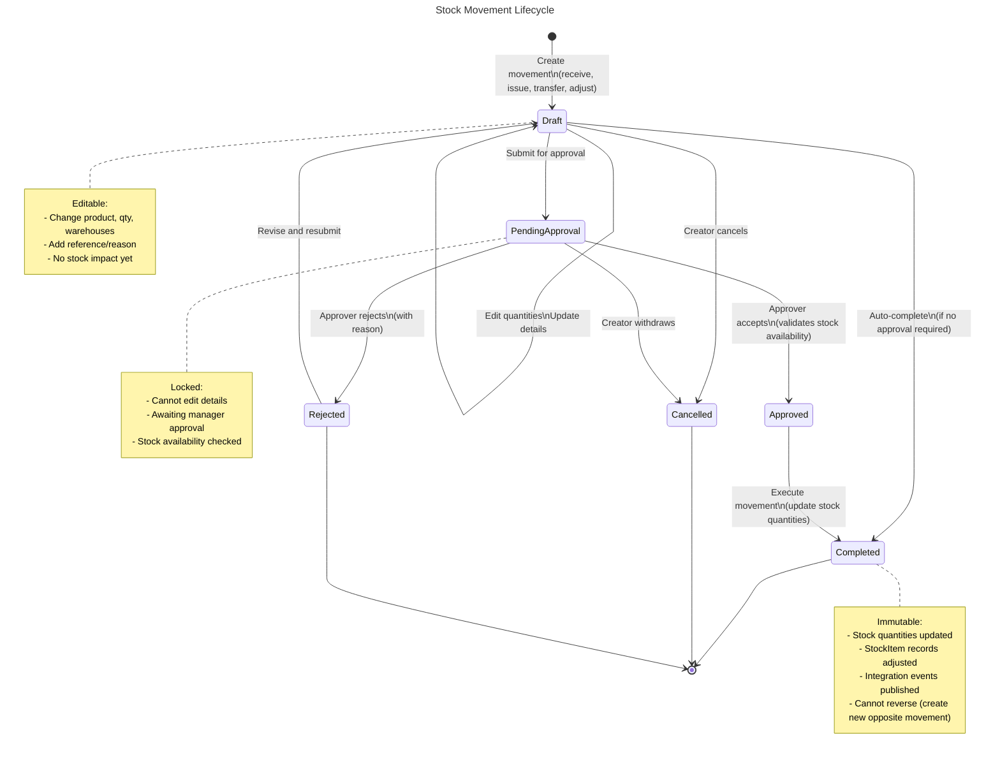
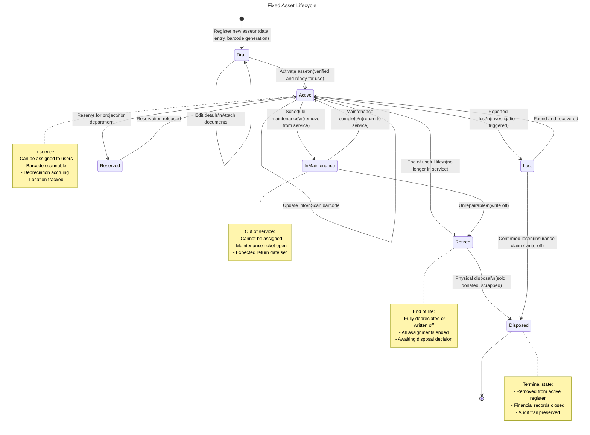
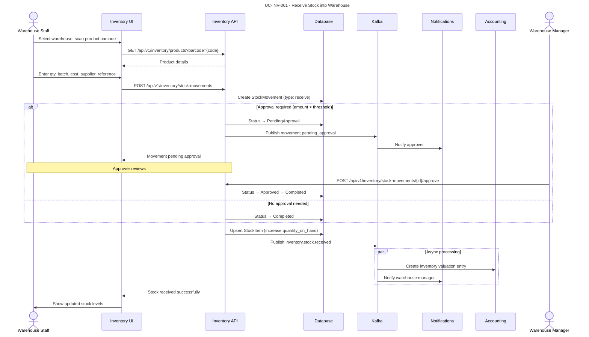
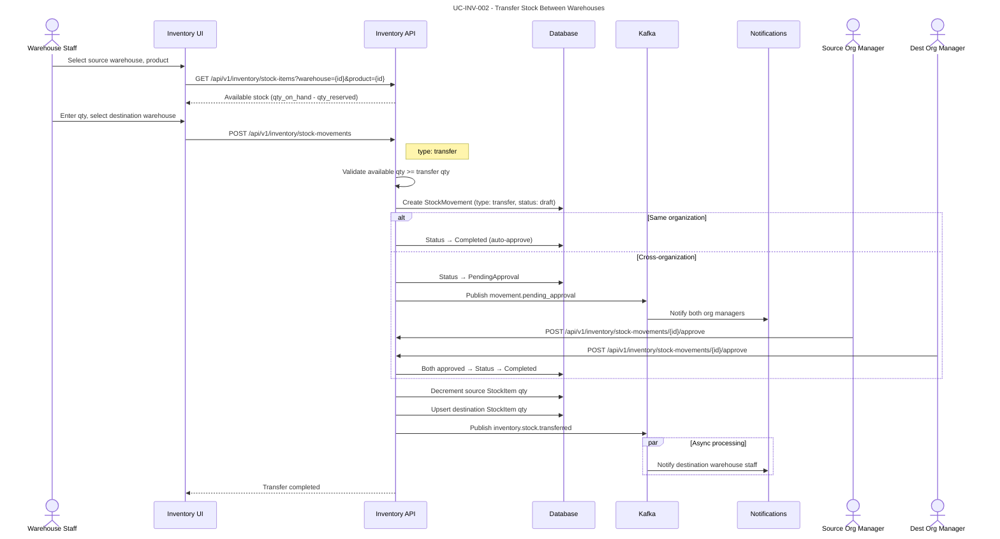
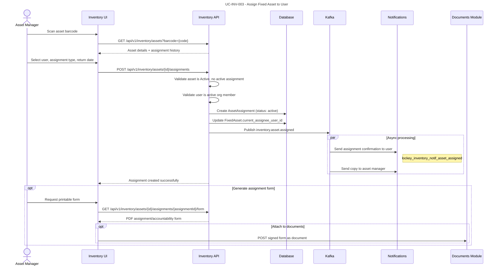
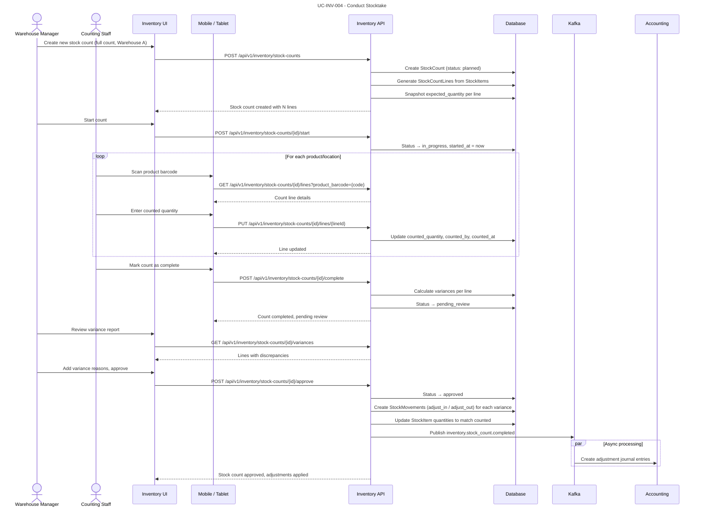
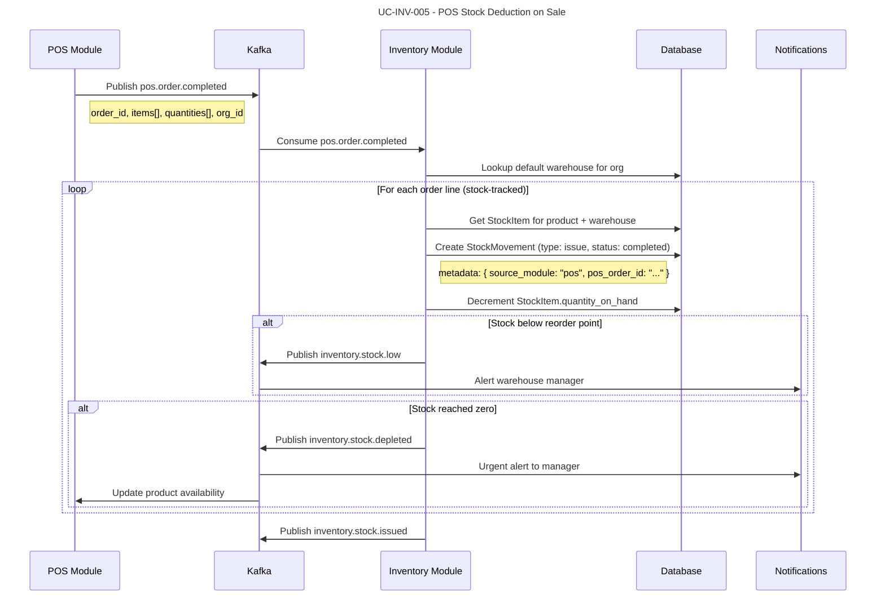
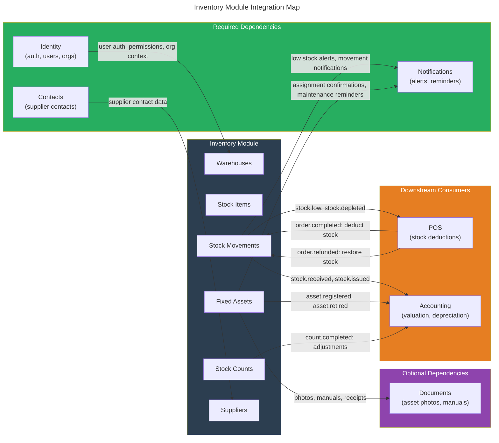

# Module: Inventory & Asset Management

## Overview

The Inventory & Asset Management module provides comprehensive warehouse management, stock control, and fixed asset tracking for multi-organization tenants. Each organization can maintain separate warehouses with distinct stock pools (e.g., Qurban livestock in one warehouse, school books in another), track stock movements between locations, manage fixed assets with barcode/QR scanning, and enforce accountability through asset assignments. The module integrates with POS for real-time stock deductions and with Accounting for asset depreciation and valuation.

### Module Metadata

| Property | Value |
|----------|-------|
| Module ID | `inventory` |
| Version | `1.0.0` |
| Table Prefix | `inventory_` |
| Dependencies | `identity`, `contacts`, `notifications` |
| Optional Dependencies | `documents` |
| Permissions Prefix | `inventory.{resource}.{action}` |

### Capabilities

- Warehouse and location (bin/shelf/zone) management per organization
- Product catalog with hierarchical categories and supplier tracking
- Stock item tracking with batch/serial number support
- Stock movements: receive, issue, transfer between warehouses, adjust, write-off
- Fixed asset registry with barcode/QR code generation and scanning
- Asset assignment and accountability (who has what, when, where)
- Asset lifecycle tracking: acquisition, deployment, maintenance, retirement, disposal
- Periodic stocktaking with count sheets and variance reconciliation
- Supplier management for procurement context
- Integration with POS for automatic stock deductions on sale
- Integration with Documents module for asset photos, manuals, and receipts
- Low-stock alerts and reorder point notifications
- Full audit trail on all stock and asset movements

---

## Domain Model

### Entities

```mermaid
---
title: Inventory Module - Entity Relationship Diagram
---
erDiagram
    Warehouse ||--o{ Location : "contains"
    Warehouse ||--o{ StockItem : "stores"
    Warehouse ||--o{ StockMovement : "source/destination"
    Warehouse ||--o{ StockCount : "counted at"
    Warehouse {
        uuid id PK
        uuid organization_id FK
        string name "Main Warehouse, School Store, Qurban Depot"
        string code UK "WH-001"
        string type "general, cold_storage, secure, outdoor"
        string address_line1
        string address_line2
        string city
        string country_code
        string postal_code
        float latitude "nullable"
        float longitude "nullable"
        boolean is_active
        boolean is_default
        uuid manager_user_id FK "nullable"
        jsonb settings "reorder_notifications, operating_hours"
        timestamp created_at
        timestamp updated_at
    }

    Location {
        uuid id PK
        uuid warehouse_id FK
        uuid parent_location_id FK "nullable, for hierarchy"
        string name "Aisle A, Shelf 3, Bin 12"
        string code UK "WH-001-A-03-12"
        string type "zone, aisle, shelf, bin, pallet"
        boolean is_active
        int sort_order
        timestamp created_at
    }

    ProductCategory ||--o{ ProductCategory : "parent/child"
    ProductCategory ||--o{ Product : "categorizes"
    ProductCategory {
        uuid id PK
        uuid organization_id FK
        uuid parent_category_id FK "nullable"
        string name "Livestock, Books, Electronics, Furniture"
        string slug UK
        string description "nullable"
        string icon "nullable"
        boolean is_active
        int sort_order
        timestamp created_at
        timestamp updated_at
    }

    Supplier ||--o{ Product : "supplies"
    Supplier ||--o{ StockMovement : "receives from"
    Supplier {
        uuid id PK
        uuid organization_id FK
        uuid contact_id FK "nullable, links to contacts module"
        string name
        string code UK "SUP-001"
        string email "nullable"
        string phone "nullable"
        string tax_id "nullable"
        string payment_terms "nullable: net_30, net_60, cod"
        string currency "default currency for this supplier"
        string status "active, inactive, blacklisted"
        decimal credit_limit "nullable"
        string notes "nullable"
        jsonb metadata
        timestamp created_at
        timestamp updated_at
    }

    Product ||--o{ StockItem : "stocked as"
    Product ||--o{ FixedAsset : "registered as"
    Product {
        uuid id PK
        uuid organization_id FK
        uuid category_id FK
        uuid default_supplier_id FK "nullable"
        string name
        string sku UK "INV-BK-0001"
        string barcode "nullable, EAN/UPC"
        string description "nullable"
        string unit "piece, kg, liter, box, pallet"
        string product_type "consumable, fixed_asset, service"
        decimal unit_cost "default purchase cost"
        string currency
        decimal weight "nullable, kg"
        string dimensions "nullable, LxWxH"
        string image_url "nullable"
        decimal reorder_point "nullable"
        decimal reorder_quantity "nullable"
        decimal minimum_stock "nullable"
        decimal maximum_stock "nullable"
        boolean is_active
        boolean is_serialized "track individual serial numbers"
        boolean is_batch_tracked "track by batch/lot"
        jsonb attributes "custom key-value attributes"
        timestamp created_at
        timestamp updated_at
    }

    StockItem ||--o{ StockMovement : "moved via"
    StockItem {
        uuid id PK
        uuid product_id FK
        uuid warehouse_id FK
        uuid location_id FK "nullable"
        string batch_number "nullable"
        string serial_number "nullable"
        decimal quantity_on_hand
        decimal quantity_reserved "reserved for pending orders"
        decimal quantity_available "on_hand - reserved, computed"
        string condition "new, good, damaged, expired"
        date expiry_date "nullable"
        decimal unit_cost "actual cost for this batch"
        string currency
        timestamp last_counted_at "nullable"
        timestamp created_at
        timestamp updated_at
    }

    StockMovement {
        uuid id PK
        uuid organization_id FK
        uuid product_id FK
        uuid stock_item_id FK "nullable"
        uuid source_warehouse_id FK "nullable"
        uuid destination_warehouse_id FK "nullable"
        uuid source_location_id FK "nullable"
        uuid destination_location_id FK "nullable"
        uuid supplier_id FK "nullable, for receives"
        uuid performed_by_user_id FK
        uuid approved_by_user_id FK "nullable"
        string movement_number UK "MOV-2026-00001"
        string type "receive, issue, transfer, adjust_in, adjust_out, write_off, return_to_supplier"
        string status "draft, pending_approval, approved, completed, cancelled, rejected"
        decimal quantity
        string unit
        decimal unit_cost "nullable"
        decimal total_cost "nullable"
        string currency "nullable"
        string reference "nullable, PO number, invoice, etc."
        string reason "nullable"
        string batch_number "nullable"
        string serial_number "nullable"
        jsonb metadata "source_module, pos_order_id, etc."
        timestamp requested_at
        timestamp approved_at "nullable"
        timestamp completed_at "nullable"
        timestamp created_at
    }

    StockCount ||--|{ StockCountLine : "contains"
    StockCount {
        uuid id PK
        uuid organization_id FK
        uuid warehouse_id FK
        uuid initiated_by_user_id FK
        uuid approved_by_user_id FK "nullable"
        string count_number UK "CNT-2026-00001"
        string type "full, partial, cycle, spot"
        string status "planned, in_progress, pending_review, approved, cancelled"
        date count_date
        string notes "nullable"
        int total_lines
        int counted_lines
        int variance_lines "lines with discrepancy"
        timestamp started_at "nullable"
        timestamp completed_at "nullable"
        timestamp approved_at "nullable"
        timestamp created_at
    }

    StockCountLine {
        uuid id PK
        uuid stock_count_id FK
        uuid product_id FK
        uuid location_id FK "nullable"
        string batch_number "nullable"
        string serial_number "nullable"
        decimal expected_quantity "system quantity at count time"
        decimal counted_quantity "nullable, actual count"
        decimal variance "counted - expected, computed"
        string variance_reason "nullable"
        string status "pending, counted, skipped"
        uuid counted_by_user_id FK "nullable"
        timestamp counted_at "nullable"
    }

    AssetCategory ||--o{ AssetCategory : "parent/child"
    AssetCategory ||--o{ FixedAsset : "classifies"
    AssetCategory {
        uuid id PK
        uuid organization_id FK
        uuid parent_category_id FK "nullable"
        string name "IT Equipment, Vehicles, Furniture, Buildings"
        string code UK "ACAT-IT"
        string depreciation_method "straight_line, declining_balance, none"
        int useful_life_months "nullable, default for category"
        decimal salvage_value_percentage "nullable, default"
        boolean is_active
        int sort_order
        timestamp created_at
        timestamp updated_at
    }

    FixedAsset ||--o{ AssetAssignment : "assigned via"
    FixedAsset {
        uuid id PK
        uuid organization_id FK
        uuid product_id FK "nullable, link to product catalog"
        uuid category_id FK
        uuid current_warehouse_id FK "nullable"
        uuid current_location_id FK "nullable"
        uuid supplier_id FK "nullable, purchased from"
        uuid current_assignee_user_id FK "nullable"
        string asset_number UK "AST-2026-00001"
        string name
        string description "nullable"
        string barcode "nullable, generated or scanned"
        string qr_code "nullable, generated"
        string serial_number "nullable"
        string model "nullable"
        string manufacturer "nullable"
        string status "draft, active, in_maintenance, reserved, retired, disposed, lost"
        string condition "new, good, fair, poor, non_functional"
        decimal acquisition_cost
        string currency
        date acquisition_date
        date warranty_expiry_date "nullable"
        string depreciation_method "straight_line, declining_balance, none"
        int useful_life_months
        decimal salvage_value
        decimal accumulated_depreciation "computed"
        decimal book_value "acquisition_cost - accumulated_depreciation, computed"
        date last_maintenance_date "nullable"
        date next_maintenance_date "nullable"
        string image_url "nullable"
        jsonb custom_attributes "brand, color, specs, etc."
        jsonb documents "array of document_ids from documents module"
        timestamp created_at
        timestamp updated_at
    }

    AssetAssignment {
        uuid id PK
        uuid asset_id FK
        uuid organization_id FK
        uuid assigned_to_user_id FK
        uuid assigned_by_user_id FK
        uuid returned_to_user_id FK "nullable"
        string status "active, returned, transferred, lost_reported"
        string assignment_type "permanent, temporary, project"
        string notes "nullable"
        date assigned_date
        date expected_return_date "nullable"
        date actual_return_date "nullable"
        string return_condition "nullable: good, damaged, non_functional"
        string return_notes "nullable"
        timestamp created_at
        timestamp updated_at
    }

    Location ||--o{ StockItem : "holds"
    Location ||--o{ FixedAsset : "stores"
    Product }o--|| ProductCategory : "belongs to"
    Product }o--o| Supplier : "supplied by"
    FixedAsset }o--|| AssetCategory : "classified by"
    StockCount }o--|| Warehouse : "counts"
    StockCountLine }o--|| Product : "counts product"
```



### Value Objects

| Value Object | Description |
|-------------|-------------|
| `WarehouseId` | Strongly-typed warehouse identifier |
| `LocationId` | Strongly-typed location identifier |
| `ProductId` | Strongly-typed product identifier |
| `ProductCategoryId` | Strongly-typed product category identifier |
| `StockItemId` | Strongly-typed stock item identifier |
| `StockMovementId` | Strongly-typed stock movement identifier |
| `StockCountId` | Strongly-typed stock count identifier |
| `StockCountLineId` | Strongly-typed stock count line identifier |
| `FixedAssetId` | Strongly-typed fixed asset identifier |
| `AssetAssignmentId` | Strongly-typed asset assignment identifier |
| `AssetCategoryId` | Strongly-typed asset category identifier |
| `SupplierId` | Strongly-typed supplier identifier |
| `Sku` | Validated SKU format with module prefix |
| `Barcode` | EAN-13/UPC-A validated barcode string |
| `MovementNumber` | Auto-generated unique movement reference (`MOV-{year}-{seq}`) |
| `AssetNumber` | Auto-generated unique asset reference (`AST-{year}-{seq}`) |
| `CountNumber` | Auto-generated unique count reference (`CNT-{year}-{seq}`) |
| `Money` | Amount + Currency (from SharedKernel) |
| `Quantity` | Positive decimal with unit context |
| `LocationCode` | Hierarchical location code (`WH-ZONE-AISLE-SHELF-BIN`) |
| `MovementType` | Enum: Receive, Issue, Transfer, AdjustIn, AdjustOut, WriteOff, ReturnToSupplier |
| `MovementStatus` | Enum: Draft, PendingApproval, Approved, Completed, Cancelled, Rejected |
| `AssetStatus` | Enum: Draft, Active, InMaintenance, Reserved, Retired, Disposed, Lost |
| `AssetCondition` | Enum: New, Good, Fair, Poor, NonFunctional |

### Domain Events

| Event | Trigger | Consumers |
|-------|---------|-----------|
| `StockReceived` | Goods received into warehouse | Notifications (alert warehouse manager), Accounting (update inventory valuation) |
| `StockIssued` | Goods issued from warehouse | Accounting (cost of goods), Notifications (if below reorder point) |
| `StockTransferred` | Stock moved between warehouses | Audit log, Accounting (inter-warehouse transfer) |
| `StockAdjusted` | Manual adjustment (in or out) | Accounting (adjustment entry), Audit log |
| `StockWrittenOff` | Stock written off as lost/damaged | Accounting (write-off entry), Notifications (alert manager) |
| `LowStockAlert` | Stock falls below reorder point | Notifications (alert procurement), POS (update availability) |
| `StockDepleted` | Stock reaches zero | POS (mark unavailable), Notifications (urgent alert) |
| `AssetRegistered` | New fixed asset created | Accounting (capitalize asset), Documents (attach receipt) |
| `AssetAssigned` | Asset assigned to user | Notifications (confirm to assignee), Audit log |
| `AssetReturned` | Asset returned from assignment | Notifications (confirm return), Audit log |
| `AssetRetired` | Asset end of life | Accounting (remove from books), Audit log |
| `AssetDisposed` | Asset physically disposed | Accounting (disposal entry), Audit log |
| `AssetMaintenanceScheduled` | Maintenance date approaching | Notifications (alert assignee and manager) |
| `StockCountCompleted` | Stocktake finished and approved | Accounting (adjustment entries for variances), Audit log |

---

## Entity Lifecycles

### StockMovement Lifecycle



### FixedAsset Lifecycle



---

## Use Cases

### UC-INV-001: Receive Stock into Warehouse

- **Actor**: Warehouse staff with `inventory.stock-movements.create` permission
- **Preconditions**: Warehouse is active, product exists in catalog
- **Flow**:
  1. Staff selects warehouse and scans/searches for product
  2. Staff enters received quantity, batch number (optional), unit cost
  3. Staff optionally selects supplier and enters reference (PO number, delivery note)
  4. Staff selects destination location within warehouse (optional)
  5. System creates StockMovement (type: receive, status: draft)
  6. If approval workflow enabled: status transitions to PendingApproval
  7. Approver reviews and approves the movement
  8. System updates StockItem quantities (creates new StockItem if first receipt for this product/warehouse/batch combination)
  9. System publishes `StockReceived` event
  10. If stock was below reorder point and is now above: clear low-stock alert
- **Postconditions**: Stock quantities updated, movement recorded, audit trail created
- **Business Rules**:
  - Receive movements require a destination warehouse
  - Serialized products: one serial number per quantity unit
  - Batch-tracked products: batch number required
  - Approval threshold configurable (e.g., movements above $1,000 require approval)
  - Unit cost defaults to product's `unit_cost` if not specified
  - Duplicate receipt detection via reference/PO number



### UC-INV-002: Transfer Stock Between Warehouses

- **Actor**: Warehouse staff with `inventory.stock-movements.create` and `inventory.stock-movements.transfer` permissions
- **Preconditions**: Source warehouse has sufficient available stock, destination warehouse is active
- **Flow**:
  1. Staff selects source warehouse and product
  2. System shows available quantity at source (on_hand minus reserved)
  3. Staff enters transfer quantity and selects destination warehouse
  4. Staff optionally specifies source and destination locations
  5. Staff adds reference/reason for transfer
  6. System validates available quantity >= transfer quantity
  7. System creates StockMovement (type: transfer, status: draft)
  8. If inter-organization transfer: requires additional approval from both org managers
  9. On approval/auto-complete: system decrements source StockItem, increments destination StockItem
  10. System publishes `StockTransferred` event
- **Postconditions**: Stock moved from source to destination, both warehouse stock levels updated
- **Business Rules**:
  - Cannot transfer more than available quantity (on_hand - reserved)
  - Transfer creates two implicit sub-movements: issue from source + receive at destination
  - If transferring serialized items: serial numbers must be selected individually
  - Batch-tracked items: batch number carries over to destination
  - Inter-organization transfers require approval from both organization managers
  - In-transit tracking: stock temporarily shows as "in transit" between approval and completion



### UC-INV-003: Assign Fixed Asset to User

- **Actor**: Asset manager with `inventory.assets.assign` permission
- **Preconditions**: Asset is in `Active` status, asset is not currently assigned or previous assignment returned
- **Flow**:
  1. Manager searches for asset by barcode scan, asset number, or name
  2. System displays asset details including current status, location, and assignment history
  3. Manager selects the user to assign the asset to
  4. Manager specifies assignment type (permanent, temporary, project) and expected return date (for temporary)
  5. System validates asset is available for assignment (Active status, no active assignment)
  6. System creates AssetAssignment (status: active)
  7. System updates FixedAsset `current_assignee_user_id`
  8. System publishes `AssetAssigned` event
  9. Notifications module sends confirmation to the assignee with asset details and accountability terms
  10. Optionally: generate and print assignment receipt/form for physical signature
- **Postconditions**: Asset assigned to user, accountability recorded, assignee notified
- **Business Rules**:
  - An asset can only have one active assignment at a time
  - Temporary assignments must have an expected return date
  - Overdue temporary assignments trigger reminder notifications (7 days, 3 days, 1 day before, and daily after due)
  - Assignment history is immutable and preserved for audit
  - Assets in `InMaintenance`, `Retired`, `Disposed`, or `Lost` status cannot be assigned
  - User must be an active member of the organization



### UC-INV-004: Conduct Stocktake (Physical Inventory Count)

- **Actor**: Warehouse staff with `inventory.stock-counts.create` permission, warehouse manager with `inventory.stock-counts.approve` permission
- **Preconditions**: Warehouse is active, no other stocktake in progress for the same warehouse
- **Flow**:
  1. Manager creates a new stock count (type: full, partial, cycle, or spot)
  2. System generates count lines from current StockItem records for the selected warehouse/locations
  3. System snapshots expected quantities at the time of count creation
  4. Staff open the count on their mobile device / tablet
  5. Staff scan products and enter counted quantities per location
  6. System records each count line with counted_by_user_id and timestamp
  7. Staff marks count as complete when all lines are counted
  8. System calculates variances (counted - expected) per line
  9. Manager reviews variance report, adds reasons for discrepancies
  10. Manager approves the stock count
  11. System generates adjustment movements for all variances (adjust_in or adjust_out)
  12. System publishes `StockCountCompleted` event
- **Postconditions**: Stock quantities reconciled to physical count, adjustment movements created, variance report available
- **Business Rules**:
  - Only one active stocktake per warehouse at a time
  - Expected quantities frozen at count creation time (concurrent movements do not affect the count)
  - Variance lines require a reason before the count can be approved
  - Spot counts can target specific products or locations (partial scope)
  - Cycle counts rotate through product categories on a configured schedule
  - Zero-variance counts still require manager approval for compliance
  - Count data is immutable after approval



### UC-INV-005: POS Stock Deduction on Sale

- **Actor**: System (triggered by POS module event)
- **Preconditions**: Product is linked between POS and Inventory modules, stock tracking enabled
- **Flow**:
  1. POS module publishes `pos.order.completed` event with order lines
  2. Inventory module consumes the event
  3. For each order line where the product is inventory-tracked:
     a. System identifies the default warehouse for the POS terminal's organization
     b. System checks available quantity
     c. System creates StockMovement (type: issue, status: completed, auto-approved)
     d. System decrements StockItem `quantity_on_hand`
  4. If stock falls below reorder point: publish `LowStockAlert`
  5. If stock reaches zero: publish `StockDepleted`
  6. System publishes `inventory.stock.issued` event
- **Postconditions**: Stock levels decremented, alerts raised if needed
- **Business Rules**:
  - POS deductions are auto-approved (no manual approval workflow)
  - Movement metadata includes `source_module: "pos"` and `pos_order_id` for traceability
  - If stock is already zero: movement still created (negative stock allowed but flagged) to avoid blocking sales
  - Negative stock triggers an urgent alert to warehouse manager
  - POS refunds (via `pos.order.refunded` event) create reverse movements (type: adjust_in)



---

## API Endpoints

### Warehouses

| Method | Path | Description | Auth |
|--------|------|-------------|------|
| POST | `/api/v1/inventory/warehouses` | Create warehouse | `inventory.warehouses.manage` |
| GET | `/api/v1/inventory/warehouses` | List warehouses | `inventory.warehouses.read` |
| GET | `/api/v1/inventory/warehouses/{id}` | Get warehouse details | `inventory.warehouses.read` |
| PUT | `/api/v1/inventory/warehouses/{id}` | Update warehouse | `inventory.warehouses.manage` |
| DELETE | `/api/v1/inventory/warehouses/{id}` | Deactivate warehouse | `inventory.warehouses.manage` |
| GET | `/api/v1/inventory/warehouses/{id}/stock-summary` | Get stock summary for warehouse | `inventory.warehouses.read` |

### Locations

| Method | Path | Description | Auth |
|--------|------|-------------|------|
| POST | `/api/v1/inventory/warehouses/{warehouseId}/locations` | Create location | `inventory.locations.manage` |
| GET | `/api/v1/inventory/warehouses/{warehouseId}/locations` | List locations in warehouse | `inventory.locations.read` |
| GET | `/api/v1/inventory/locations/{id}` | Get location details | `inventory.locations.read` |
| PUT | `/api/v1/inventory/locations/{id}` | Update location | `inventory.locations.manage` |
| DELETE | `/api/v1/inventory/locations/{id}` | Deactivate location | `inventory.locations.manage` |

### Products

| Method | Path | Description | Auth |
|--------|------|-------------|------|
| POST | `/api/v1/inventory/products` | Create product | `inventory.products.manage` |
| GET | `/api/v1/inventory/products` | List products (filterable by category, supplier, type) | `inventory.products.read` |
| GET | `/api/v1/inventory/products/{id}` | Get product details with stock levels | `inventory.products.read` |
| PUT | `/api/v1/inventory/products/{id}` | Update product | `inventory.products.manage` |
| DELETE | `/api/v1/inventory/products/{id}` | Deactivate product | `inventory.products.manage` |
| GET | `/api/v1/inventory/products/{id}/stock-levels` | Get stock levels across all warehouses | `inventory.products.read` |
| POST | `/api/v1/inventory/products/import` | Bulk import products (CSV) | `inventory.products.manage` |
| GET | `/api/v1/inventory/products/export` | Export products (CSV) | `inventory.products.read` |
| GET | `/api/v1/inventory/products/search` | Search products by barcode, SKU, or name | `inventory.products.read` |

### Product Categories

| Method | Path | Description | Auth |
|--------|------|-------------|------|
| POST | `/api/v1/inventory/product-categories` | Create category | `inventory.categories.manage` |
| GET | `/api/v1/inventory/product-categories` | List categories (tree structure) | `inventory.categories.read` |
| GET | `/api/v1/inventory/product-categories/{id}` | Get category details | `inventory.categories.read` |
| PUT | `/api/v1/inventory/product-categories/{id}` | Update category | `inventory.categories.manage` |
| DELETE | `/api/v1/inventory/product-categories/{id}` | Deactivate category | `inventory.categories.manage` |

### Stock Items

| Method | Path | Description | Auth |
|--------|------|-------------|------|
| GET | `/api/v1/inventory/stock-items` | List stock items (filterable by warehouse, product, condition) | `inventory.stock.read` |
| GET | `/api/v1/inventory/stock-items/{id}` | Get stock item details | `inventory.stock.read` |
| GET | `/api/v1/inventory/stock-items/low-stock` | List items below reorder point | `inventory.stock.read` |
| GET | `/api/v1/inventory/stock-items/expiring` | List items approaching expiry date | `inventory.stock.read` |

### Stock Movements

| Method | Path | Description | Auth |
|--------|------|-------------|------|
| POST | `/api/v1/inventory/stock-movements` | Create stock movement | `inventory.stock-movements.create` |
| GET | `/api/v1/inventory/stock-movements` | List movements (filterable by type, status, date range, warehouse) | `inventory.stock-movements.read` |
| GET | `/api/v1/inventory/stock-movements/{id}` | Get movement details | `inventory.stock-movements.read` |
| PUT | `/api/v1/inventory/stock-movements/{id}` | Update draft movement | `inventory.stock-movements.create` |
| POST | `/api/v1/inventory/stock-movements/{id}/submit` | Submit for approval | `inventory.stock-movements.create` |
| POST | `/api/v1/inventory/stock-movements/{id}/approve` | Approve movement | `inventory.stock-movements.approve` |
| POST | `/api/v1/inventory/stock-movements/{id}/reject` | Reject movement (with reason) | `inventory.stock-movements.approve` |
| POST | `/api/v1/inventory/stock-movements/{id}/cancel` | Cancel draft/pending movement | `inventory.stock-movements.create` |
| POST | `/api/v1/inventory/stock-movements/{id}/complete` | Complete approved movement | `inventory.stock-movements.create` |
| GET | `/api/v1/inventory/stock-movements/export` | Export movements (CSV) | `inventory.stock-movements.read` |

### Stock Counts (Stocktaking)

| Method | Path | Description | Auth |
|--------|------|-------------|------|
| POST | `/api/v1/inventory/stock-counts` | Create stock count | `inventory.stock-counts.create` |
| GET | `/api/v1/inventory/stock-counts` | List stock counts | `inventory.stock-counts.read` |
| GET | `/api/v1/inventory/stock-counts/{id}` | Get stock count details | `inventory.stock-counts.read` |
| POST | `/api/v1/inventory/stock-counts/{id}/start` | Start counting | `inventory.stock-counts.create` |
| GET | `/api/v1/inventory/stock-counts/{id}/lines` | List count lines | `inventory.stock-counts.read` |
| PUT | `/api/v1/inventory/stock-counts/{id}/lines/{lineId}` | Record counted quantity | `inventory.stock-counts.count` |
| POST | `/api/v1/inventory/stock-counts/{id}/complete` | Mark count as complete | `inventory.stock-counts.create` |
| GET | `/api/v1/inventory/stock-counts/{id}/variances` | Get variance report | `inventory.stock-counts.read` |
| POST | `/api/v1/inventory/stock-counts/{id}/approve` | Approve count and apply adjustments | `inventory.stock-counts.approve` |
| POST | `/api/v1/inventory/stock-counts/{id}/cancel` | Cancel stock count | `inventory.stock-counts.create` |
| GET | `/api/v1/inventory/stock-counts/{id}/export` | Export count results (PDF/CSV) | `inventory.stock-counts.read` |

### Fixed Assets

| Method | Path | Description | Auth |
|--------|------|-------------|------|
| POST | `/api/v1/inventory/assets` | Register new fixed asset | `inventory.assets.manage` |
| GET | `/api/v1/inventory/assets` | List assets (filterable by status, category, assignee, warehouse) | `inventory.assets.read` |
| GET | `/api/v1/inventory/assets/{id}` | Get asset details with assignment history | `inventory.assets.read` |
| PUT | `/api/v1/inventory/assets/{id}` | Update asset details | `inventory.assets.manage` |
| POST | `/api/v1/inventory/assets/{id}/activate` | Activate draft asset | `inventory.assets.manage` |
| POST | `/api/v1/inventory/assets/{id}/maintenance` | Send asset to maintenance | `inventory.assets.manage` |
| POST | `/api/v1/inventory/assets/{id}/return-from-maintenance` | Return from maintenance | `inventory.assets.manage` |
| POST | `/api/v1/inventory/assets/{id}/retire` | Retire asset | `inventory.assets.manage` |
| POST | `/api/v1/inventory/assets/{id}/dispose` | Dispose asset (with method: sold, donated, scrapped) | `inventory.assets.manage` |
| POST | `/api/v1/inventory/assets/{id}/report-lost` | Report asset as lost | `inventory.assets.manage` |
| POST | `/api/v1/inventory/assets/{id}/recover` | Recover lost asset | `inventory.assets.manage` |
| GET | `/api/v1/inventory/assets/{id}/depreciation` | Get depreciation schedule | `inventory.assets.read` |
| GET | `/api/v1/inventory/assets/search` | Search by barcode, QR, asset number, serial | `inventory.assets.read` |
| POST | `/api/v1/inventory/assets/import` | Bulk import assets (CSV) | `inventory.assets.manage` |
| GET | `/api/v1/inventory/assets/export` | Export asset register (CSV/PDF) | `inventory.assets.read` |
| GET | `/api/v1/inventory/assets/{id}/barcode` | Generate barcode/QR image for asset | `inventory.assets.read` |

### Asset Assignments

| Method | Path | Description | Auth |
|--------|------|-------------|------|
| POST | `/api/v1/inventory/assets/{assetId}/assignments` | Assign asset to user | `inventory.assets.assign` |
| GET | `/api/v1/inventory/assets/{assetId}/assignments` | List assignment history for asset | `inventory.assets.read` |
| GET | `/api/v1/inventory/assignments` | List all active assignments (filterable by user, department) | `inventory.assets.read` |
| POST | `/api/v1/inventory/assignments/{id}/return` | Return asset from assignment | `inventory.assets.assign` |
| POST | `/api/v1/inventory/assignments/{id}/transfer` | Transfer to another user | `inventory.assets.assign` |
| GET | `/api/v1/inventory/assignments/{id}/form` | Generate assignment form (PDF) | `inventory.assets.read` |
| GET | `/api/v1/inventory/assignments/overdue` | List overdue temporary assignments | `inventory.assets.read` |
| GET | `/api/v1/inventory/users/{userId}/assets` | List assets assigned to a user | `inventory.assets.read` |

### Asset Categories

| Method | Path | Description | Auth |
|--------|------|-------------|------|
| POST | `/api/v1/inventory/asset-categories` | Create asset category | `inventory.asset-categories.manage` |
| GET | `/api/v1/inventory/asset-categories` | List asset categories (tree structure) | `inventory.asset-categories.read` |
| GET | `/api/v1/inventory/asset-categories/{id}` | Get category details | `inventory.asset-categories.read` |
| PUT | `/api/v1/inventory/asset-categories/{id}` | Update category | `inventory.asset-categories.manage` |
| DELETE | `/api/v1/inventory/asset-categories/{id}` | Deactivate category | `inventory.asset-categories.manage` |

### Suppliers

| Method | Path | Description | Auth |
|--------|------|-------------|------|
| POST | `/api/v1/inventory/suppliers` | Create supplier | `inventory.suppliers.manage` |
| GET | `/api/v1/inventory/suppliers` | List suppliers | `inventory.suppliers.read` |
| GET | `/api/v1/inventory/suppliers/{id}` | Get supplier details | `inventory.suppliers.read` |
| PUT | `/api/v1/inventory/suppliers/{id}` | Update supplier | `inventory.suppliers.manage` |
| DELETE | `/api/v1/inventory/suppliers/{id}` | Deactivate supplier | `inventory.suppliers.manage` |
| GET | `/api/v1/inventory/suppliers/{id}/products` | List products from supplier | `inventory.suppliers.read` |
| GET | `/api/v1/inventory/suppliers/{id}/movements` | List stock movements from supplier | `inventory.suppliers.read` |

### Reports & Dashboard

| Method | Path | Description | Auth |
|--------|------|-------------|------|
| GET | `/api/v1/inventory/dashboard` | Inventory dashboard (stock value, alerts, recent movements) | `inventory.reports.read` |
| GET | `/api/v1/inventory/reports/stock-valuation` | Stock valuation report by warehouse | `inventory.reports.read` |
| GET | `/api/v1/inventory/reports/movement-summary` | Movement summary report (by type, date range) | `inventory.reports.read` |
| GET | `/api/v1/inventory/reports/asset-register` | Full fixed asset register report | `inventory.reports.read` |
| GET | `/api/v1/inventory/reports/asset-depreciation` | Depreciation report across all assets | `inventory.reports.read` |
| GET | `/api/v1/inventory/reports/asset-assignments` | Current assignment accountability report | `inventory.reports.read` |
| GET | `/api/v1/inventory/reports/low-stock` | Low stock / reorder report | `inventory.reports.read` |
| GET | `/api/v1/inventory/reports/expiring-stock` | Expiring stock report | `inventory.reports.read` |
| GET | `/api/v1/inventory/reports/stocktake-history` | Historical stocktake results | `inventory.reports.read` |

---

## Integration Points

### Events Published

| Event | Topic | Payload (Key Fields) | Description |
|-------|-------|---------------------|-------------|
| `inventory.stock.received` | `nexora.inventory.stock` | `movement_id`, `product_id`, `warehouse_id`, `quantity`, `unit_cost`, `supplier_id` | Stock received into warehouse |
| `inventory.stock.issued` | `nexora.inventory.stock` | `movement_id`, `product_id`, `warehouse_id`, `quantity`, `reason`, `metadata` | Stock issued from warehouse |
| `inventory.stock.transferred` | `nexora.inventory.stock` | `movement_id`, `product_id`, `source_warehouse_id`, `destination_warehouse_id`, `quantity` | Stock transferred between warehouses |
| `inventory.stock.adjusted` | `nexora.inventory.stock` | `movement_id`, `product_id`, `warehouse_id`, `quantity`, `adjustment_type`, `reason` | Manual stock adjustment |
| `inventory.stock.written_off` | `nexora.inventory.stock` | `movement_id`, `product_id`, `warehouse_id`, `quantity`, `reason`, `total_cost` | Stock written off |
| `inventory.stock.low` | `nexora.inventory.alerts` | `product_id`, `product_name`, `warehouse_id`, `current_quantity`, `reorder_point` | Stock below reorder point |
| `inventory.stock.depleted` | `nexora.inventory.alerts` | `product_id`, `product_name`, `warehouse_id` | Stock reached zero |
| `inventory.stock_count.completed` | `nexora.inventory.stock-counts` | `count_id`, `warehouse_id`, `total_lines`, `variance_lines`, `net_adjustment_value` | Stocktake completed and approved |
| `inventory.asset.registered` | `nexora.inventory.assets` | `asset_id`, `asset_number`, `category_id`, `acquisition_cost`, `currency` | New fixed asset registered |
| `inventory.asset.assigned` | `nexora.inventory.assets` | `asset_id`, `asset_number`, `assigned_to_user_id`, `assignment_type`, `expected_return_date` | Asset assigned to user |
| `inventory.asset.returned` | `nexora.inventory.assets` | `asset_id`, `assignment_id`, `returned_by_user_id`, `return_condition` | Asset returned from assignment |
| `inventory.asset.retired` | `nexora.inventory.assets` | `asset_id`, `asset_number`, `book_value`, `reason` | Asset retired from service |
| `inventory.asset.disposed` | `nexora.inventory.assets` | `asset_id`, `asset_number`, `disposal_method`, `disposal_value` | Asset physically disposed |
| `inventory.asset.lost` | `nexora.inventory.assets` | `asset_id`, `asset_number`, `last_known_assignee`, `book_value` | Asset reported lost |
| `inventory.asset.maintenance_due` | `nexora.inventory.assets` | `asset_id`, `asset_number`, `next_maintenance_date`, `assignee_user_id` | Maintenance date approaching |
| `inventory.movement.pending_approval` | `nexora.inventory.movements` | `movement_id`, `movement_type`, `requested_by`, `total_cost` | Movement awaiting approval |

### Events Consumed

| Event | Source Module | Action |
|-------|-------------|--------|
| `identity.organization.created` | Identity | Create default warehouse for the organization, seed default product/asset categories |
| `identity.user.deactivated` | Identity | Flag active asset assignments for review, notify asset manager |
| `contacts.contact.merged` | Contacts | Update `supplier.contact_id` references |
| `contacts.contact.archived` | Contacts | Mark linked supplier as inactive if sole contact |
| `pos.order.completed` | POS | Decrement stock for sold items (see UC-INV-005) |
| `pos.order.voided` | POS | Reverse stock deduction (create adjust_in movement) |
| `pos.order.refunded` | POS | Restore stock for refunded items (create adjust_in movement) |
| `documents.document.deleted` | Documents | Remove document reference from asset's `documents` array |

### Cross-Module Data Flow



---

## Database Schema

All tables are created in the tenant schema with the `inventory_` prefix.

| Table | Description |
|-------|-------------|
| `inventory_warehouses` | Warehouse/storage locations per organization |
| `inventory_locations` | Hierarchical locations within warehouses (zones, aisles, shelves, bins) |
| `inventory_product_categories` | Hierarchical product categories |
| `inventory_products` | Product catalog for stock and asset tracking |
| `inventory_suppliers` | Supplier registry with contact links |
| `inventory_stock_items` | Current stock records per product/warehouse/batch |
| `inventory_stock_movements` | All stock movement transactions |
| `inventory_stock_counts` | Stocktake header records |
| `inventory_stock_count_lines` | Individual count lines per stocktake |
| `inventory_asset_categories` | Hierarchical asset classification with depreciation defaults |
| `inventory_fixed_assets` | Fixed asset register |
| `inventory_asset_assignments` | Asset assignment and accountability records |

### Key Indexes

| Table | Index | Purpose |
|-------|-------|---------|
| `inventory_warehouses` | `ix_inventory_warehouses_org_id` | Filter warehouses by organization |
| `inventory_warehouses` | `ux_inventory_warehouses_code` | Unique warehouse code |
| `inventory_products` | `ux_inventory_products_sku` | Unique SKU lookup |
| `inventory_products` | `ix_inventory_products_barcode` | Barcode scanning lookup |
| `inventory_products` | `ix_inventory_products_category_id` | Category filtering |
| `inventory_products` | `ix_inventory_products_supplier_id` | Supplier product list |
| `inventory_stock_items` | `ix_inventory_stock_items_product_warehouse` | Stock lookup by product and warehouse |
| `inventory_stock_items` | `ix_inventory_stock_items_serial_number` | Serial number lookup |
| `inventory_stock_items` | `ix_inventory_stock_items_batch_number` | Batch lookup |
| `inventory_stock_items` | `ix_inventory_stock_items_expiry_date` | Expiry tracking |
| `inventory_stock_movements` | `ux_inventory_stock_movements_number` | Unique movement number |
| `inventory_stock_movements` | `ix_inventory_stock_movements_type_status` | Filter by type and status |
| `inventory_stock_movements` | `ix_inventory_stock_movements_product_id` | Movement history per product |
| `inventory_stock_movements` | `ix_inventory_stock_movements_warehouse_ids` | Source/destination warehouse lookup |
| `inventory_stock_movements` | `ix_inventory_stock_movements_created_at` | Chronological listing |
| `inventory_stock_counts` | `ux_inventory_stock_counts_number` | Unique count number |
| `inventory_stock_counts` | `ix_inventory_stock_counts_warehouse_status` | Active counts per warehouse |
| `inventory_stock_count_lines` | `ix_inventory_stock_count_lines_count_id` | Lines per count |
| `inventory_stock_count_lines` | `ix_inventory_stock_count_lines_product_id` | Count history per product |
| `inventory_fixed_assets` | `ux_inventory_fixed_assets_asset_number` | Unique asset number |
| `inventory_fixed_assets` | `ix_inventory_fixed_assets_barcode` | Barcode scanning |
| `inventory_fixed_assets` | `ix_inventory_fixed_assets_qr_code` | QR code scanning |
| `inventory_fixed_assets` | `ix_inventory_fixed_assets_status` | Filter by lifecycle status |
| `inventory_fixed_assets` | `ix_inventory_fixed_assets_category_id` | Category filtering |
| `inventory_fixed_assets` | `ix_inventory_fixed_assets_assignee` | Lookup by current assignee |
| `inventory_fixed_assets` | `ix_inventory_fixed_assets_warehouse_id` | Assets by warehouse |
| `inventory_asset_assignments` | `ix_inventory_asset_assignments_asset_id` | Assignment history per asset |
| `inventory_asset_assignments` | `ix_inventory_asset_assignments_user_id` | Assets per user |
| `inventory_asset_assignments` | `ix_inventory_asset_assignments_status` | Active assignments filter |
| `inventory_asset_assignments` | `ix_inventory_asset_assignments_return_date` | Overdue detection |
| `inventory_suppliers` | `ux_inventory_suppliers_code` | Unique supplier code |
| `inventory_suppliers` | `ix_inventory_suppliers_contact_id` | Contact module link |

---

## Permissions

| Permission | Description |
|-----------|-------------|
| `inventory.warehouses.read` | View warehouses and locations |
| `inventory.warehouses.manage` | Create, update, deactivate warehouses |
| `inventory.locations.read` | View locations within warehouses |
| `inventory.locations.manage` | Create, update, deactivate locations |
| `inventory.products.read` | View product catalog |
| `inventory.products.manage` | Create, update, deactivate, import products |
| `inventory.categories.read` | View product categories |
| `inventory.categories.manage` | Create, update, deactivate product categories |
| `inventory.stock.read` | View stock levels and stock items |
| `inventory.stock-movements.read` | View stock movement history |
| `inventory.stock-movements.create` | Create and submit stock movements |
| `inventory.stock-movements.approve` | Approve or reject stock movements |
| `inventory.stock-movements.transfer` | Create inter-warehouse transfers |
| `inventory.stock-counts.read` | View stock counts and variance reports |
| `inventory.stock-counts.create` | Create and conduct stock counts |
| `inventory.stock-counts.count` | Record counted quantities |
| `inventory.stock-counts.approve` | Approve stock counts and apply adjustments |
| `inventory.assets.read` | View fixed assets and assignment history |
| `inventory.assets.manage` | Register, update, lifecycle-manage assets |
| `inventory.assets.assign` | Assign and return assets |
| `inventory.asset-categories.read` | View asset categories |
| `inventory.asset-categories.manage` | Create, update, deactivate asset categories |
| `inventory.suppliers.read` | View suppliers |
| `inventory.suppliers.manage` | Create, update, deactivate suppliers |
| `inventory.reports.read` | View inventory reports and dashboards |

### Default Role Mappings

| Role | Permissions |
|------|------------|
| **Inventory Viewer** | `inventory.warehouses.read`, `inventory.locations.read`, `inventory.products.read`, `inventory.categories.read`, `inventory.stock.read`, `inventory.stock-movements.read`, `inventory.stock-counts.read`, `inventory.assets.read`, `inventory.asset-categories.read`, `inventory.suppliers.read` |
| **Warehouse Staff** | All Viewer permissions + `inventory.stock-movements.create`, `inventory.stock-counts.count`, `inventory.products.manage` |
| **Asset Custodian** | All Viewer permissions + `inventory.assets.assign`, `inventory.assets.manage` |
| **Inventory Manager** | All Staff + Custodian permissions + `inventory.warehouses.manage`, `inventory.locations.manage`, `inventory.categories.manage`, `inventory.stock-movements.approve`, `inventory.stock-movements.transfer`, `inventory.stock-counts.create`, `inventory.stock-counts.approve`, `inventory.asset-categories.manage`, `inventory.suppliers.manage`, `inventory.reports.read` |
| **Inventory Admin** | All permissions |

---

## Localization Keys

All user-facing messages returned from the Inventory module use `lockey_` format. The backend never returns translated strings.

### Validation Messages

| Key | Context |
|-----|---------|
| `lockey_inventory_validation_warehouse_name_required` | Warehouse name is required |
| `lockey_inventory_validation_warehouse_code_duplicate` | Warehouse code already exists |
| `lockey_inventory_validation_product_name_required` | Product name is required |
| `lockey_inventory_validation_sku_duplicate` | Product SKU already exists |
| `lockey_inventory_validation_sku_format_invalid` | SKU format is invalid |
| `lockey_inventory_validation_quantity_positive` | Quantity must be greater than zero |
| `lockey_inventory_validation_quantity_exceeds_available` | Transfer quantity exceeds available stock |
| `lockey_inventory_validation_unit_cost_positive` | Unit cost must be greater than or equal to zero |
| `lockey_inventory_validation_movement_warehouse_required` | Warehouse is required for this movement type |
| `lockey_inventory_validation_movement_both_warehouses_required` | Source and destination warehouses required for transfer |
| `lockey_inventory_validation_movement_same_warehouse` | Source and destination warehouses must be different |
| `lockey_inventory_validation_batch_number_required` | Batch number is required for batch-tracked products |
| `lockey_inventory_validation_serial_number_required` | Serial number is required for serialized products |
| `lockey_inventory_validation_serial_number_duplicate` | Serial number already exists |
| `lockey_inventory_validation_asset_name_required` | Asset name is required |
| `lockey_inventory_validation_asset_number_duplicate` | Asset number already exists |
| `lockey_inventory_validation_acquisition_cost_positive` | Acquisition cost must be greater than zero |
| `lockey_inventory_validation_acquisition_date_required` | Acquisition date is required |
| `lockey_inventory_validation_useful_life_positive` | Useful life must be greater than zero months |
| `lockey_inventory_validation_assignment_user_required` | Assignee user is required |
| `lockey_inventory_validation_return_date_required` | Expected return date is required for temporary assignments |
| `lockey_inventory_validation_return_date_future` | Expected return date must be in the future |
| `lockey_inventory_validation_count_warehouse_required` | Warehouse is required for stock count |
| `lockey_inventory_validation_counted_quantity_negative` | Counted quantity cannot be negative |
| `lockey_inventory_validation_variance_reason_required` | Variance reason is required for lines with discrepancies |
| `lockey_inventory_validation_supplier_name_required` | Supplier name is required |
| `lockey_inventory_validation_supplier_code_duplicate` | Supplier code already exists |
| `lockey_inventory_validation_reject_reason_required` | Rejection reason is required |

### Domain Exception Messages

| Key | Context |
|-----|---------|
| `lockey_inventory_error_warehouse_has_stock` | Cannot deactivate warehouse with existing stock |
| `lockey_inventory_error_warehouse_not_found` | Warehouse not found |
| `lockey_inventory_error_product_not_found` | Product not found |
| `lockey_inventory_error_stock_item_not_found` | Stock item not found |
| `lockey_inventory_error_movement_not_draft` | Cannot modify movement that is not in draft status |
| `lockey_inventory_error_movement_already_completed` | Movement has already been completed |
| `lockey_inventory_error_movement_already_cancelled` | Movement has already been cancelled |
| `lockey_inventory_error_insufficient_stock` | Insufficient stock for this operation |
| `lockey_inventory_error_negative_stock_created` | Operation resulted in negative stock (flagged for review) |
| `lockey_inventory_error_asset_not_active` | Asset is not in active status |
| `lockey_inventory_error_asset_already_assigned` | Asset already has an active assignment |
| `lockey_inventory_error_asset_not_assignable` | Asset cannot be assigned in its current status |
| `lockey_inventory_error_assignment_not_active` | Assignment is not active |
| `lockey_inventory_error_assignment_already_returned` | Asset has already been returned |
| `lockey_inventory_error_count_in_progress` | A stock count is already in progress for this warehouse |
| `lockey_inventory_error_count_not_in_progress` | Stock count is not in progress |
| `lockey_inventory_error_count_incomplete` | Not all lines have been counted |
| `lockey_inventory_error_count_already_approved` | Stock count has already been approved |
| `lockey_inventory_error_user_not_active_member` | User is not an active member of the organization |
| `lockey_inventory_error_category_has_products` | Cannot deactivate category with active products |
| `lockey_inventory_error_category_has_assets` | Cannot deactivate asset category with active assets |
| `lockey_inventory_error_supplier_has_movements` | Cannot deactivate supplier with pending movements |
| `lockey_inventory_error_location_has_stock` | Cannot deactivate location with existing stock |
| `lockey_inventory_error_barcode_not_found` | No product or asset found for this barcode |

### Success Messages

| Key | Context |
|-----|---------|
| `lockey_inventory_success_warehouse_created` | Warehouse created successfully |
| `lockey_inventory_success_warehouse_updated` | Warehouse updated successfully |
| `lockey_inventory_success_product_created` | Product created successfully |
| `lockey_inventory_success_product_updated` | Product updated successfully |
| `lockey_inventory_success_product_imported` | Products imported successfully |
| `lockey_inventory_success_stock_received` | Stock received successfully |
| `lockey_inventory_success_stock_issued` | Stock issued successfully |
| `lockey_inventory_success_stock_transferred` | Stock transferred successfully |
| `lockey_inventory_success_stock_adjusted` | Stock adjusted successfully |
| `lockey_inventory_success_movement_submitted` | Movement submitted for approval |
| `lockey_inventory_success_movement_approved` | Movement approved |
| `lockey_inventory_success_movement_rejected` | Movement rejected |
| `lockey_inventory_success_movement_cancelled` | Movement cancelled |
| `lockey_inventory_success_asset_registered` | Fixed asset registered successfully |
| `lockey_inventory_success_asset_activated` | Asset activated successfully |
| `lockey_inventory_success_asset_assigned` | Asset assigned successfully |
| `lockey_inventory_success_asset_returned` | Asset returned successfully |
| `lockey_inventory_success_asset_retired` | Asset retired successfully |
| `lockey_inventory_success_asset_disposed` | Asset disposed successfully |
| `lockey_inventory_success_asset_maintenance` | Asset sent to maintenance |
| `lockey_inventory_success_asset_recovered` | Lost asset recovered |
| `lockey_inventory_success_count_created` | Stock count created |
| `lockey_inventory_success_count_started` | Stock count started |
| `lockey_inventory_success_count_completed` | Stock count completed |
| `lockey_inventory_success_count_approved` | Stock count approved, adjustments applied |
| `lockey_inventory_success_supplier_created` | Supplier created successfully |
| `lockey_inventory_success_supplier_updated` | Supplier updated successfully |

### Notification Messages

| Key | Context |
|-----|---------|
| `lockey_inventory_notif_low_stock_alert` | Stock for {product} in {warehouse} is below reorder point |
| `lockey_inventory_notif_stock_depleted` | Stock for {product} in {warehouse} has reached zero |
| `lockey_inventory_notif_movement_pending_approval` | Stock movement {number} requires your approval |
| `lockey_inventory_notif_movement_approved` | Your stock movement {number} has been approved |
| `lockey_inventory_notif_movement_rejected` | Your stock movement {number} has been rejected |
| `lockey_inventory_notif_asset_assigned` | Asset {asset_number} has been assigned to you |
| `lockey_inventory_notif_asset_return_reminder` | Asset {asset_number} is due for return on {date} |
| `lockey_inventory_notif_asset_overdue` | Asset {asset_number} return is overdue |
| `lockey_inventory_notif_asset_maintenance_due` | Asset {asset_number} maintenance is scheduled for {date} |
| `lockey_inventory_notif_count_variance_review` | Stock count {number} has variances requiring your review |
| `lockey_inventory_notif_negative_stock_alert` | Negative stock detected for {product} in {warehouse} |

---

## Non-Functional Requirements

### Performance

| Requirement | Target | Rationale |
|------------|--------|-----------|
| Product search (barcode/SKU) | < 50ms | Barcode scanning must feel instant |
| Stock level query (single product) | < 100ms | Real-time availability checks |
| Stock level query (full warehouse) | < 500ms | Dashboard and reports |
| Stock movement creation | < 200ms | Warehouse staff workflow speed |
| Stock movement completion (with stock update) | < 500ms | Includes quantity recalculation |
| Asset barcode scan lookup | < 50ms | Field scanning must be instant |
| Asset assignment creation | < 300ms | Includes validation and event publishing |
| Stock count line recording | < 100ms | Mobile scanning during stocktake |
| Dashboard load | < 1s | Overview page with aggregated metrics |
| Report generation (stock valuation) | < 5s | Complex aggregation across warehouses |
| Depreciation calculation (full register) | < 10s | Monthly batch for all assets |
| Bulk product import (1,000 rows) | < 30s | Background job with progress tracking |
| Max products per tenant | 100,000 | Large multi-warehouse operations |
| Max stock items per tenant | 500,000 | Includes batch/serial variations |
| Max fixed assets per tenant | 50,000 | Enterprise asset fleet |
| Max stock movements per tenant | 5,000,000 | Historical transaction log |
| Max concurrent stocktakes | 10 | Different warehouses simultaneously |

### Reliability

| Requirement | Target |
|------------|--------|
| API uptime | 99.9% (module-level) |
| Stock quantity consistency | Zero drift between movements and stock items (ACID transactions) |
| POS deduction reliability | Eventual consistency within 5 seconds of POS order completion |
| Movement idempotency | Duplicate movement prevention via idempotency keys |
| Audit trail completeness | 100% of stock changes traceable to a movement record |
| Asset barcode uniqueness | Platform-wide unique barcode/QR generation |
| Stocktake data integrity | Expected quantities frozen at count creation time |

### Scalability

| Dimension | Target |
|-----------|--------|
| Stock movements per minute (single warehouse) | 100 |
| Stock movements per minute (platform-wide) | 5,000 |
| Concurrent barcode scans | 200 per tenant |
| Concurrent stocktake users (single count) | 20 |
| Warehouse count per organization | 50 |
| Locations per warehouse | 10,000 |
| Products per category | 10,000 |
| Assignment history per asset | Unlimited (append-only) |

### Security

| Requirement | Implementation |
|------------|----------------|
| Movement approval separation | Creator cannot approve their own movement |
| Warehouse access control | Organization-scoped, enforced by global query filters |
| Asset assignment audit | Immutable assignment records with full attribution |
| Barcode generation | Cryptographically unique, non-sequential barcode values |
| Stock adjustment authorization | Adjustments above threshold require manager approval |
| Data isolation | Multi-tenant schema isolation, organization-level row filtering |
| Sensitive asset tracking | Assets marked as "high-value" require additional approval for assignment/transfer |

---

## Configuration

### Module Settings (per Organization)

```json
{
  "inventory": {
    "currency": "TRY",
    "stock_movement_approval_enabled": true,
    "stock_movement_approval_threshold": 1000.00,
    "allow_negative_stock": false,
    "negative_stock_alert_enabled": true,
    "auto_create_default_warehouse": true,
    "barcode_format": "ean13",
    "qr_code_enabled": true,
    "serial_number_tracking_enabled": true,
    "batch_tracking_enabled": true,
    "movement_number_prefix": "MOV",
    "asset_number_prefix": "AST",
    "count_number_prefix": "CNT",
    "warehouse_code_prefix": "WH",
    "supplier_code_prefix": "SUP",
    "depreciation_calculation_frequency": "monthly",
    "asset_assignment_overdue_reminder_days": [7, 3, 1],
    "asset_maintenance_reminder_days": [30, 7, 1],
    "low_stock_alert_enabled": true,
    "reorder_notification_channel": "email",
    "stocktake_variance_threshold_percentage": 5.0,
    "stocktake_require_variance_reasons": true,
    "pos_integration_enabled": true,
    "pos_default_warehouse_id": null
  }
}
```

---

## Migration Plan

### Phase 1: Core Inventory (MVP)
- Warehouse and location management
- Product catalog with categories
- Stock items and basic stock movements (receive, issue, adjust)
- Stock level queries and low-stock alerts
- Basic dashboard and stock valuation report

### Phase 2: Transfers & Approvals
- Inter-warehouse transfers
- Movement approval workflow
- Supplier management
- Batch and serial number tracking
- Stock movement export and reporting

### Phase 3: Fixed Assets
- Asset categories with depreciation configuration
- Fixed asset registration with barcode/QR generation
- Asset lifecycle management (activate, maintain, retire, dispose)
- Asset assignment and accountability tracking
- Asset reports (register, depreciation schedule, assignment report)

### Phase 4: Stocktaking & POS Integration
- Stock count creation with auto-generated count sheets
- Mobile-friendly count recording with barcode scanning
- Variance calculation and approval workflow
- POS integration for automatic stock deductions
- POS refund/void reverse movements

### Phase 5: Advanced Features
- Cycle count scheduling and automation
- Expiry date tracking and alerts
- Inter-organization transfer workflows
- Asset maintenance scheduling and tracking
- Advanced reporting and analytics dashboard
- Document module integration for asset attachments
- Bulk asset import/export
