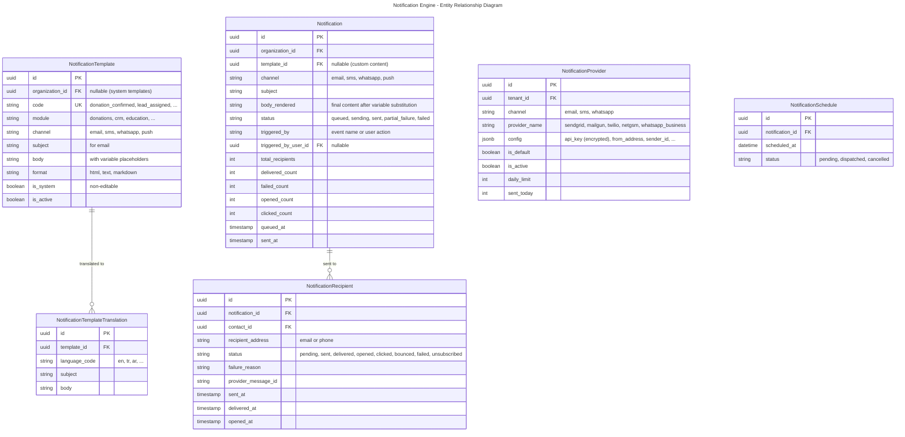
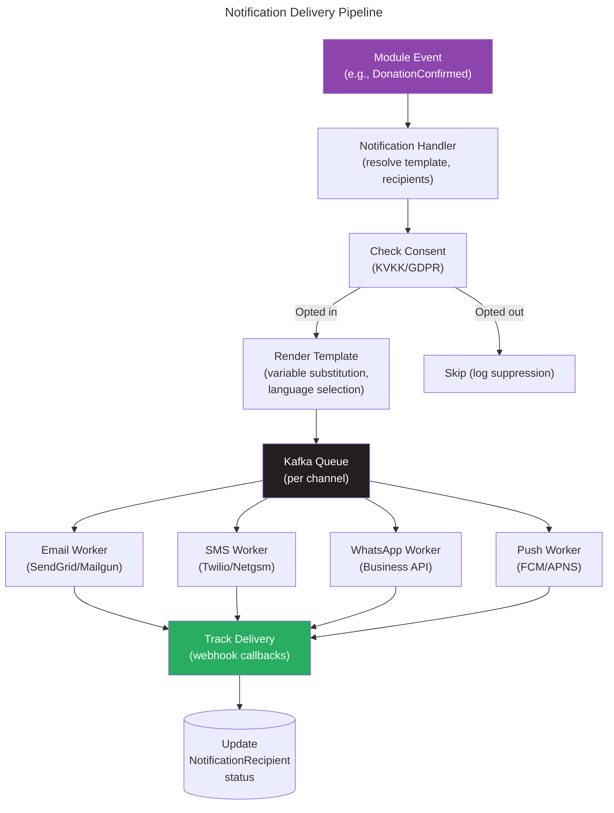

# Module: Notification Engine

## Overview
The Notification Engine is a **core platform module** that provides unified communication infrastructure for all other modules. It handles email, SMS, WhatsApp, and push notification delivery with template management, delivery tracking, bulk sending with throttling, and per-contact communication preferences/consent enforcement. No module sends notifications directly — they all publish events, and this module handles the delivery.

## Domain Model

### Entities

### Domain Events

| Event | Trigger | Consumers |
|-------|---------|-----------|
| `NotificationSent` | All recipients processed | Audit log |
| `NotificationDelivered` | Provider confirms delivery | Analytics |
| `NotificationOpened` | Recipient opens email | Campaign analytics (CRM) |
| `NotificationBounced` | Email bounced | Contacts (flag invalid email) |
| `NotificationFailed` | Delivery failed | Admin alert, retry queue |

### Delivery Flow

## Use Cases

### UC-NOT-001: Send Transactional Notification
- **Actor**: System (event-driven)
- **Flow**:
  1. Module publishes event (e.g., `donations.donation.confirmed`)
  2. Handler resolves notification template by event code + channel
  3. Handler resolves recipient(s) from event payload
  4. Check contact's communication preference for channel
  5. If opted in: render template with variables (donor name, amount, etc.)
  6. Select language based on contact preference
  7. Queue message for delivery
  8. Worker sends via configured provider
  9. Track delivery status via provider webhooks
- **Business Rules**:
  - Transactional notifications bypass marketing consent (e.g., receipts, password reset)
  - Marketing notifications require explicit consent
  - Rate limit: max 1 notification per contact per event per hour (dedup)

### UC-NOT-002: Bulk Notification (Marketing)
- **Actor**: CRM Campaign module
- **Flow**:
  1. CRM creates campaign with segment + template
  2. CRM sends `crm.campaign.dispatch` event with recipient list
  3. Notification engine validates consent for all recipients
  4. Filters out opted-out contacts
  5. Sends in batches with throttling (configurable rate)
  6. Tracks per-recipient delivery + opens + clicks
  7. Reports results back to CRM campaign analytics
- **Business Rules**:
  - Throttling: max N messages/minute (configurable per provider)
  - Unsubscribe link auto-appended to all marketing emails
  - Time-zone aware scheduling (send at 10am recipient's local time)

## API Endpoints

| Method | Path | Description | Auth |
|--------|------|-------------|------|
| POST | `/api/v1/notifications/send` | Send ad-hoc notification | `notifications.send` |
| GET | `/api/v1/notifications/notifications` | List sent notifications | `notifications.read` |
| GET | `/api/v1/notifications/notifications/{id}` | Get delivery details | `notifications.read` |
| GET | `/api/v1/notifications/templates` | List templates | `notifications.templates.read` |
| POST | `/api/v1/notifications/templates` | Create template | `notifications.templates.manage` |
| PUT | `/api/v1/notifications/templates/{id}` | Update template | `notifications.templates.manage` |
| GET | `/api/v1/notifications/providers` | List providers | `notifications.providers.read` |
| PUT | `/api/v1/notifications/providers/{id}` | Configure provider | `notifications.providers.manage` |
| POST | `/api/v1/notifications/webhooks/{provider}` | Provider delivery webhook | Provider signature |

## Integration Points

### Events Consumed (from all modules)
| Event | Source | Action |
|-------|--------|--------|
| `donations.donation.confirmed` | Donations | Send receipt + thank you |
| `donations.recurring.payment_failed` | Donations | Alert donor |
| `crm.lead.assigned` | CRM | Notify assignee |
| `crm.campaign.dispatch` | CRM | Bulk send campaign |
| `education.appointment.booked` | Education | Send confirmation + calendar invite |
| `education.enrollment.accepted` | Education | Send acceptance letter |
| `sponsorship.update.sent` | Sponsorship | Send update to sponsor |
| `sponsorship.installment.overdue` | Sponsorship | Send reminder |
| `identity.user.created` | Identity | Send welcome / invitation email |

### Events Produced
| Event | Topic |
|-------|-------|
| `notifications.notification.delivered` | `nexora.notifications` |
| `notifications.notification.bounced` | `nexora.notifications` |
| `notifications.notification.opened` | `nexora.notifications` |

## Non-Functional Requirements

| Requirement | Target |
|------------|--------|
| Transactional delivery | < 30 seconds |
| Bulk throughput | 1,000 messages/minute |
| Email open tracking | Pixel tracking (< 1ms response) |
| Provider failover | Auto-switch to backup provider on failure |
| Retry policy | 3 retries with exponential backoff |
| Template rendering | < 50ms |
