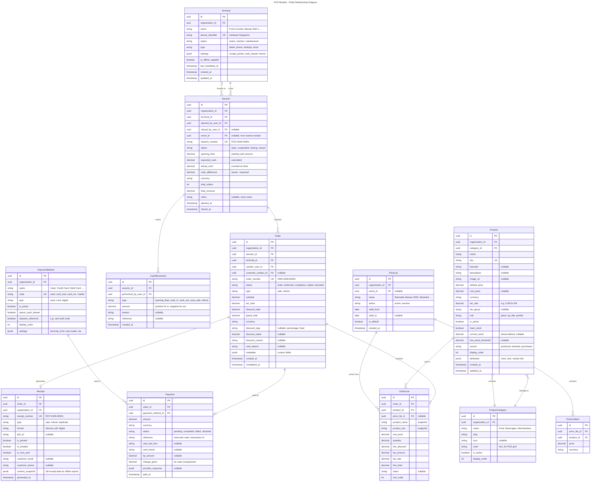
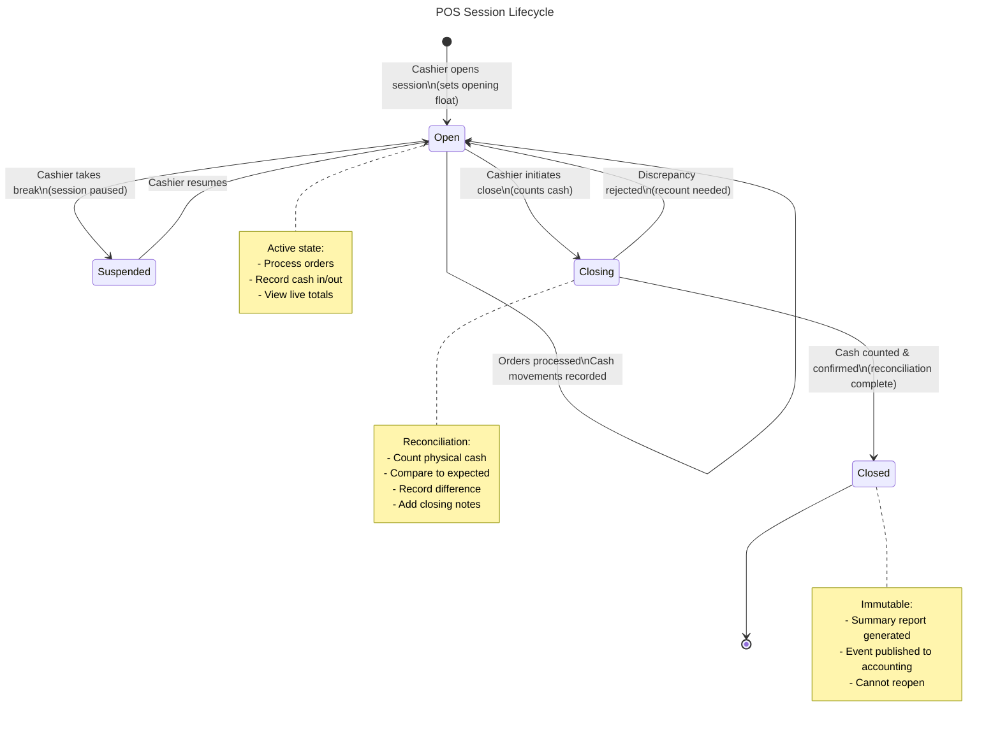
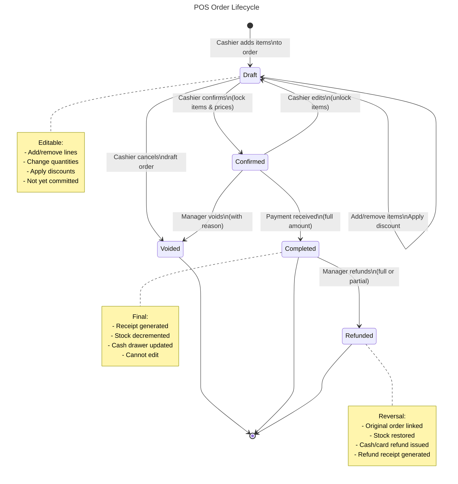
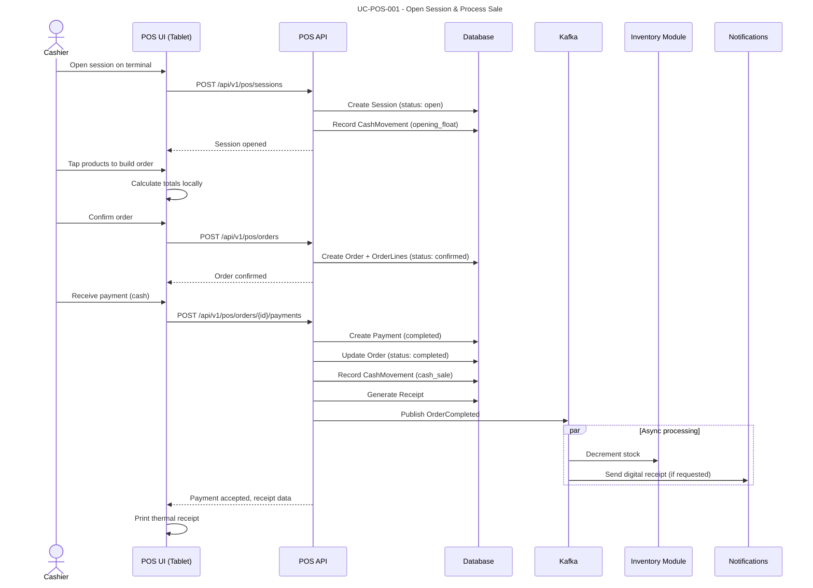
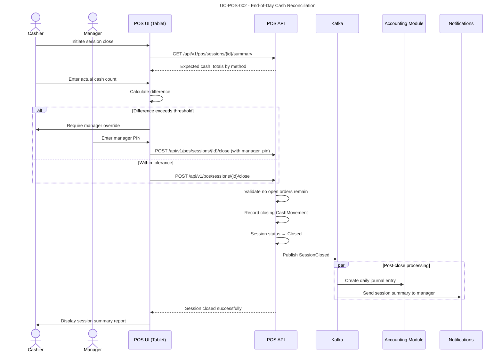
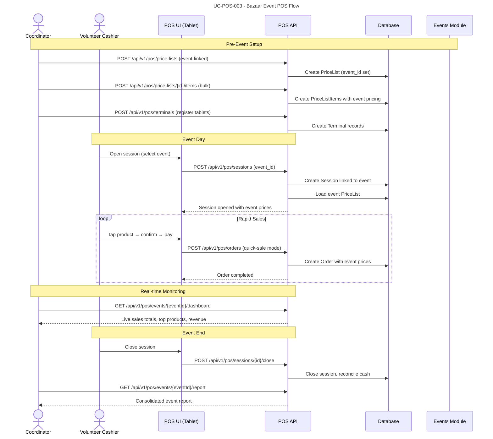
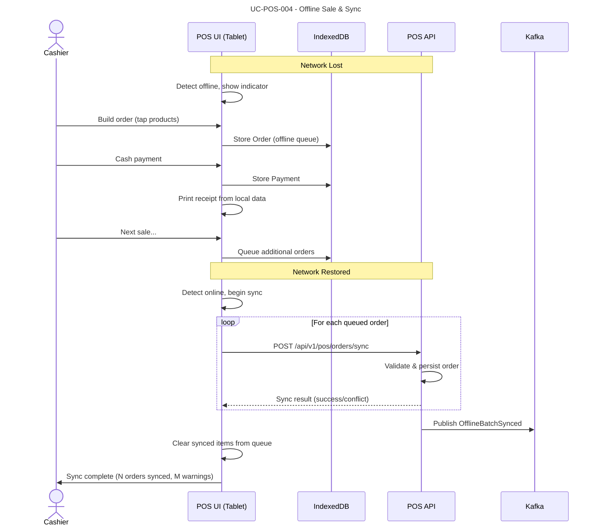
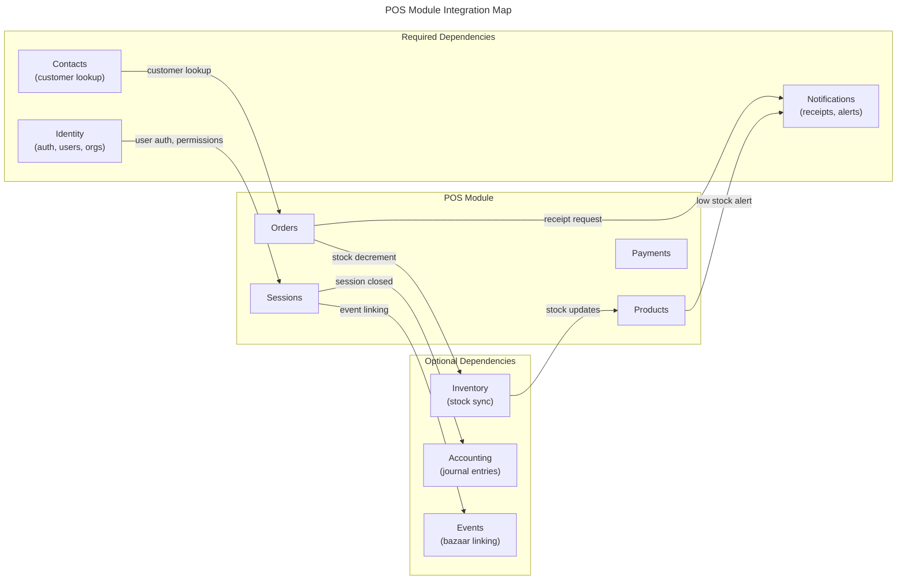

# Module: Point of Sale (POS)

## Overview

The Point of Sale module provides a fast, touch-optimized sales interface for in-person transactions at bazaars, fundraisers, cafeterias, and retail counters. It supports tablet and phone form factors, handles cash and card payments, generates receipts (printed and digital), and maintains event-specific POS sessions with full cash movement tracking. Designed for high-throughput scenarios such as food stalls at community events where speed and reliability — including offline capability — are critical.

### Module Metadata

| Property | Value |
|----------|-------|
| Module ID | `pos` |
| Version | `1.0.0` |
| Table Prefix | `pos_` |
| Dependencies | `identity`, `contacts`, `notifications` |
| Optional Dependencies | `inventory`, `accounting` |
| Permissions Prefix | `pos.{resource}.{action}` |

### Capabilities

- Touch-friendly fast sales screen optimized for tablets and phones
- Product catalog with categories, variants, and dynamic pricing
- Event-specific POS sessions (bazaars, fundraisers, Ramadan events)
- Cash and card payment processing with split-payment support
- Receipt generation (thermal printer, PDF, SMS/email)
- Cash drawer management (opening float, cash-in/out, end-of-day reconciliation)
- Offline-first architecture with automatic sync on reconnect
- Stock tracking for produced and donated items
- Price list management for event-specific or seasonal pricing
- Real-time sales dashboard per terminal and session

---

## Domain Model

### Entities



### Value Objects

| Value Object | Description |
|-------------|-------------|
| `TerminalId` | Strongly-typed terminal identifier |
| `SessionId` | Strongly-typed session identifier |
| `OrderId` | Strongly-typed order identifier |
| `ProductId` | Strongly-typed product identifier |
| `PaymentId` | Strongly-typed payment identifier |
| `ReceiptId` | Strongly-typed receipt identifier |
| `PriceListId` | Strongly-typed price list identifier |
| `Money` | Amount + Currency (from SharedKernel) |
| `OrderNumber` | Auto-generated unique order reference (`ORD-{year}-{seq}`) |
| `SessionNumber` | Auto-generated unique session reference (`POS-{year}-{seq}`) |
| `ReceiptNumber` | Sequential per organization per year (`RCP-{year}-{seq}`) |
| `Sku` | Validated product SKU format |
| `TaxRate` | Decimal rate with validation (0.00 - 1.00) |
| `Quantity` | Positive decimal with unit context |
| `OrderStatus` | Enum: Draft, Confirmed, Completed, Voided, Refunded |
| `SessionStatus` | Enum: Open, Suspended, Closing, Closed |

### Domain Events

| Event | Trigger | Consumers |
|-------|---------|-----------|
| `SessionOpened` | Cashier opens POS session | Dashboard (live session list) |
| `SessionClosed` | Cashier completes end-of-day | Accounting (daily journal entry), Notifications (summary to manager) |
| `SessionSuspended` | Cashier suspends session | Dashboard (update status) |
| `OrderCompleted` | Payment fully received | Inventory (decrement stock), Contacts (log purchase activity), Notifications (send digital receipt if requested) |
| `OrderVoided` | Manager voids order | Inventory (restore stock), Accounting (reversal entry) |
| `OrderRefunded` | Cashier processes refund | Inventory (restore stock), Accounting (refund entry), Contacts (log refund) |
| `ProductStockLow` | Stock falls below threshold | Notifications (alert manager), Inventory (sync request) |
| `CashMovementRecorded` | Any cash drawer activity | Session (recalculate expected cash) |
| `ReceiptGenerated` | Receipt created | Notifications (email/SMS if digital) |

---

## Entity Lifecycles

### Session Lifecycle



### Order Lifecycle



---

## Use Cases

### UC-POS-001: Open POS Session and Process Sale

- **Actor**: Cashier with `pos.sessions.open` and `pos.orders.create` permissions
- **Preconditions**: Terminal registered and active, cashier authenticated
- **Flow**:
  1. Cashier selects terminal and opens new session
  2. Cashier enters opening float (cash in drawer)
  3. System creates session, records opening float as CashMovement
  4. Cashier taps products on the touch grid to build order
  5. System calculates line totals, tax, and grand total in real-time
  6. Cashier confirms order (items and prices locked)
  7. Customer pays (cash or card)
  8. System records payment, marks order as Completed
  9. System generates receipt (thermal print and/or digital)
  10. System decrements product stock (if track_stock enabled)
  11. System publishes `OrderCompleted` event
- **Business Rules**:
  - Session must be in `Open` status to accept orders
  - Order grand total must be fully covered by payment(s)
  - Cash payment: system calculates change to give back
  - Card payment: requires reference (auth code) from card terminal
  - Split payments allowed (e.g., part cash, part card)
  - Products with `track_stock` cannot be sold if `current_stock <= 0`



### UC-POS-002: End-of-Day Session Close with Cash Reconciliation

- **Actor**: Cashier with `pos.sessions.close` permission
- **Preconditions**: Session is in `Open` status, all orders finalized
- **Flow**:
  1. Cashier initiates session close from POS screen
  2. System calculates expected cash (opening float + cash sales - cash refunds + cash-in - cash-out)
  3. Cashier counts physical cash in drawer and enters actual amount
  4. System calculates difference (actual - expected)
  5. If difference exceeds threshold (configurable, default 5.00): system flags for manager review
  6. Cashier adds closing notes (optional)
  7. Cashier confirms close
  8. System transitions session to `Closed`, records closing CashMovement
  9. System publishes `SessionClosed` event
  10. Accounting module creates daily journal entry
  11. Notifications module sends session summary to manager
- **Business Rules**:
  - Cannot close session with orders in `Draft` or `Confirmed` status (must complete or void)
  - Cash difference exceeding threshold requires manager PIN override
  - Closed sessions are immutable — no further modifications
  - Session summary includes: total orders, revenue by payment method, cash movements log



### UC-POS-003: Event-Specific Bazaar POS Session

- **Actor**: Event coordinator with `pos.sessions.open` permission, volunteer cashiers
- **Preconditions**: Event created in events module, products prepared and stocked
- **Flow**:
  1. Coordinator creates event-specific price list (e.g., "Ramadan Bazaar 2026")
  2. Coordinator assigns products with event pricing (may differ from default)
  3. Coordinator sets up terminals for the event (registers tablet devices)
  4. Day of event: volunteer cashiers open sessions linked to event
  5. System loads event price list automatically for linked sessions
  6. Volunteers process rapid sales using the touch-optimized grid
  7. During event: coordinator monitors real-time sales dashboard
  8. Event end: all sessions closed, consolidated event report generated
  9. System publishes event sales summary
- **Business Rules**:
  - Event-linked sessions use the event's price list (overrides default prices)
  - Multiple terminals can run concurrent sessions for the same event
  - Products sourced as "donated" have cost_price of zero (full revenue = margin)
  - Event report aggregates all sessions: total revenue, units sold per product, payment breakdown
  - Produced food items (e.g., borek, cay) tracked separately from merchandise



### UC-POS-004: Offline Sale with Sync on Reconnect

- **Actor**: Cashier on a tablet with intermittent connectivity
- **Preconditions**: Terminal is marked as `is_offline_capable`, product catalog synced locally
- **Flow**:
  1. Tablet detects network loss, switches to offline mode
  2. POS UI shows offline indicator but remains fully functional
  3. Cashier continues processing orders against local product catalog and prices
  4. Orders stored in local IndexedDB with offline queue status
  5. Payments accepted (cash only in offline mode; card optional if terminal supports offline auth)
  6. Receipts generated from local snapshot data and printed via local thermal printer
  7. Network restored: sync engine pushes queued orders to API in chronological order
  8. API validates and persists each order, detects conflicts (e.g., stock depleted)
  9. Conflict resolution: orders accepted but stock warnings raised post-sync
  10. System publishes `OfflineBatchSynced` event with sync summary
- **Business Rules**:
  - Offline mode supports cash payments by default; card support depends on terminal capability
  - Order numbers generated locally use a reserved offline range to prevent collisions
  - Offline product catalog refreshed on every session open (while online)
  - Maximum offline duration: 24 hours (configurable) before forced re-sync required
  - Stock validation is best-effort in offline mode; warnings issued post-sync, orders are never rejected



### UC-POS-005: Process Refund

- **Actor**: Manager with `pos.orders.refund` permission
- **Preconditions**: Original order exists and is in `Completed` status
- **Flow**:
  1. Manager looks up original order by order number or receipt number
  2. System displays original order details
  3. Manager selects full or partial refund (specific line items)
  4. Manager enters refund reason (required)
  5. System creates refund order (type: refund) linked to original
  6. System processes refund payment via original method (cash returned or card refund initiated)
  7. System generates refund receipt
  8. System restores stock for refunded items
  9. System publishes `OrderRefunded` event
- **Business Rules**:
  - Refunds require `pos.orders.refund` permission (typically manager-level)
  - Cash refunds deducted from session's expected cash
  - Card refunds: system records the refund; actual card refund processed externally
  - Partial refunds allowed at line-item granularity
  - Refund amount cannot exceed original order total
  - Refund reason is mandatory and audited

---

## API Endpoints

### Terminals

| Method | Path | Description | Auth |
|--------|------|-------------|------|
| POST | `/api/v1/pos/terminals` | Register new terminal | `pos.terminals.manage` |
| GET | `/api/v1/pos/terminals` | List terminals | `pos.terminals.read` |
| GET | `/api/v1/pos/terminals/{id}` | Get terminal details | `pos.terminals.read` |
| PUT | `/api/v1/pos/terminals/{id}` | Update terminal settings | `pos.terminals.manage` |
| DELETE | `/api/v1/pos/terminals/{id}` | Deactivate terminal | `pos.terminals.manage` |
| POST | `/api/v1/pos/terminals/{id}/heartbeat` | Terminal heartbeat (connectivity check) | `pos.terminals.operate` |

### Sessions

| Method | Path | Description | Auth |
|--------|------|-------------|------|
| POST | `/api/v1/pos/sessions` | Open new session | `pos.sessions.open` |
| GET | `/api/v1/pos/sessions` | List sessions (with filters) | `pos.sessions.read` |
| GET | `/api/v1/pos/sessions/{id}` | Get session details | `pos.sessions.read` |
| GET | `/api/v1/pos/sessions/{id}/summary` | Get session summary (totals, expected cash) | `pos.sessions.read` |
| POST | `/api/v1/pos/sessions/{id}/suspend` | Suspend session | `pos.sessions.open` |
| POST | `/api/v1/pos/sessions/{id}/resume` | Resume suspended session | `pos.sessions.open` |
| POST | `/api/v1/pos/sessions/{id}/close` | Close session (with cash count) | `pos.sessions.close` |

### Orders

| Method | Path | Description | Auth |
|--------|------|-------------|------|
| POST | `/api/v1/pos/orders` | Create new order | `pos.orders.create` |
| GET | `/api/v1/pos/orders` | List orders (with filters) | `pos.orders.read` |
| GET | `/api/v1/pos/orders/{id}` | Get order details | `pos.orders.read` |
| PUT | `/api/v1/pos/orders/{id}` | Update draft order (add/remove lines) | `pos.orders.create` |
| POST | `/api/v1/pos/orders/{id}/confirm` | Confirm order (lock items & prices) | `pos.orders.create` |
| POST | `/api/v1/pos/orders/{id}/void` | Void order (with reason) | `pos.orders.void` |
| POST | `/api/v1/pos/orders/{id}/refund` | Refund order (full or partial) | `pos.orders.refund` |
| POST | `/api/v1/pos/orders/{id}/discount` | Apply order-level discount | `pos.orders.discount` |
| POST | `/api/v1/pos/orders/sync` | Sync offline orders (batch) | `pos.orders.create` |
| POST | `/api/v1/pos/orders/quick-sale` | One-tap quick sale (create + confirm + pay) | `pos.orders.create` |

### Order Lines

| Method | Path | Description | Auth |
|--------|------|-------------|------|
| POST | `/api/v1/pos/orders/{orderId}/lines` | Add line item | `pos.orders.create` |
| PUT | `/api/v1/pos/orders/{orderId}/lines/{lineId}` | Update line (quantity, notes) | `pos.orders.create` |
| DELETE | `/api/v1/pos/orders/{orderId}/lines/{lineId}` | Remove line item | `pos.orders.create` |

### Payments

| Method | Path | Description | Auth |
|--------|------|-------------|------|
| POST | `/api/v1/pos/orders/{orderId}/payments` | Record payment | `pos.orders.create` |
| GET | `/api/v1/pos/orders/{orderId}/payments` | List payments for order | `pos.orders.read` |

### Products

| Method | Path | Description | Auth |
|--------|------|-------------|------|
| POST | `/api/v1/pos/products` | Create product | `pos.products.manage` |
| GET | `/api/v1/pos/products` | List products (with category filter) | `pos.products.read` |
| GET | `/api/v1/pos/products/{id}` | Get product details | `pos.products.read` |
| PUT | `/api/v1/pos/products/{id}` | Update product | `pos.products.manage` |
| DELETE | `/api/v1/pos/products/{id}` | Deactivate product | `pos.products.manage` |
| POST | `/api/v1/pos/products/import` | Bulk import products (CSV) | `pos.products.manage` |
| GET | `/api/v1/pos/products/catalog` | Get touch-grid catalog (optimized for POS UI) | `pos.products.read` |
| PUT | `/api/v1/pos/products/{id}/stock` | Adjust stock manually | `pos.products.stock` |

### Product Categories

| Method | Path | Description | Auth |
|--------|------|-------------|------|
| POST | `/api/v1/pos/categories` | Create category | `pos.categories.manage` |
| GET | `/api/v1/pos/categories` | List categories | `pos.categories.read` |
| PUT | `/api/v1/pos/categories/{id}` | Update category | `pos.categories.manage` |
| DELETE | `/api/v1/pos/categories/{id}` | Deactivate category | `pos.categories.manage` |

### Payment Methods

| Method | Path | Description | Auth |
|--------|------|-------------|------|
| POST | `/api/v1/pos/payment-methods` | Create payment method | `pos.payment-methods.manage` |
| GET | `/api/v1/pos/payment-methods` | List payment methods | `pos.payment-methods.read` |
| PUT | `/api/v1/pos/payment-methods/{id}` | Update payment method | `pos.payment-methods.manage` |

### Cash Movements

| Method | Path | Description | Auth |
|--------|------|-------------|------|
| POST | `/api/v1/pos/sessions/{sessionId}/cash-movements` | Record cash in/out | `pos.cash.manage` |
| GET | `/api/v1/pos/sessions/{sessionId}/cash-movements` | List cash movements for session | `pos.cash.read` |

### Receipts

| Method | Path | Description | Auth |
|--------|------|-------------|------|
| GET | `/api/v1/pos/receipts/{id}` | Get receipt details | `pos.receipts.read` |
| GET | `/api/v1/pos/receipts/{id}/pdf` | Download receipt PDF | `pos.receipts.read` |
| POST | `/api/v1/pos/receipts/{id}/reprint` | Reprint receipt | `pos.receipts.read` |
| POST | `/api/v1/pos/receipts/{id}/send` | Send receipt via email/SMS | `pos.receipts.send` |

### Price Lists

| Method | Path | Description | Auth |
|--------|------|-------------|------|
| POST | `/api/v1/pos/price-lists` | Create price list | `pos.price-lists.manage` |
| GET | `/api/v1/pos/price-lists` | List price lists | `pos.price-lists.read` |
| GET | `/api/v1/pos/price-lists/{id}` | Get price list with items | `pos.price-lists.read` |
| PUT | `/api/v1/pos/price-lists/{id}` | Update price list | `pos.price-lists.manage` |
| POST | `/api/v1/pos/price-lists/{id}/items` | Add/update items (bulk) | `pos.price-lists.manage` |
| DELETE | `/api/v1/pos/price-lists/{id}/items/{itemId}` | Remove item from price list | `pos.price-lists.manage` |

### Reports & Dashboard

| Method | Path | Description | Auth |
|--------|------|-------------|------|
| GET | `/api/v1/pos/reports/daily` | Daily sales report | `pos.reports.read` |
| GET | `/api/v1/pos/reports/products` | Product sales report (top sellers, revenue per product) | `pos.reports.read` |
| GET | `/api/v1/pos/reports/sessions` | Session summary report | `pos.reports.read` |
| GET | `/api/v1/pos/reports/cashiers` | Cashier performance report | `pos.reports.read` |
| GET | `/api/v1/pos/reports/payment-methods` | Revenue by payment method | `pos.reports.read` |
| GET | `/api/v1/pos/events/{eventId}/dashboard` | Live event sales dashboard | `pos.reports.read` |
| GET | `/api/v1/pos/events/{eventId}/report` | Consolidated event report | `pos.reports.read` |
| GET | `/api/v1/pos/dashboard` | Real-time POS dashboard (all terminals) | `pos.reports.read` |

---

## Integration Points

### Events Published

| Event | Topic | Payload (Key Fields) | Description |
|-------|-------|---------------------|-------------|
| `pos.session.opened` | `nexora.pos.sessions` | `session_id`, `terminal_id`, `opened_by`, `event_id` | Session started on terminal |
| `pos.session.closed` | `nexora.pos.sessions` | `session_id`, `total_orders`, `total_revenue`, `cash_difference`, `currency` | Session closed with summary |
| `pos.order.completed` | `nexora.pos.orders` | `order_id`, `session_id`, `items[]`, `grand_total`, `payment_method`, `currency` | Order fully paid and completed |
| `pos.order.voided` | `nexora.pos.orders` | `order_id`, `void_reason`, `voided_by` | Order voided by manager |
| `pos.order.refunded` | `nexora.pos.orders` | `order_id`, `original_order_id`, `refund_amount`, `refund_reason` | Refund processed |
| `pos.product.stock_low` | `nexora.pos.products` | `product_id`, `product_name`, `current_stock`, `threshold` | Stock below threshold |
| `pos.product.stock_depleted` | `nexora.pos.products` | `product_id`, `product_name` | Stock reached zero |
| `pos.offline.batch_synced` | `nexora.pos.sync` | `terminal_id`, `session_id`, `order_count`, `sync_warnings[]` | Offline orders synced |
| `pos.receipt.generated` | `nexora.pos.receipts` | `receipt_id`, `order_id`, `customer_email`, `customer_phone` | Receipt ready for delivery |

### Events Consumed

| Event | Source Module | Action |
|-------|-------------|--------|
| `identity.organization.created` | Identity | Seed default payment methods (Cash, Credit Card, Debit Card) and default product categories |
| `identity.user.deactivated` | Identity | Close any open sessions for deactivated user |
| `contacts.contact.merged` | Contacts | Update `customer_contact_id` references across orders |
| `inventory.stock.adjusted` | Inventory | Sync `current_stock` on POS products linked to inventory items |
| `inventory.stock.received` | Inventory | Update `current_stock` for received items |
| `events.event.created` | Events | Make event available for POS session linking |
| `events.event.cancelled` | Events | Close any open sessions linked to cancelled event |

### Cross-Module Data Flow



---

## Database Schema

All tables are created in the tenant schema with the `pos_` prefix.

| Table | Description |
|-------|-------------|
| `pos_terminals` | Registered POS devices |
| `pos_sessions` | Sales sessions with cash tracking |
| `pos_orders` | Sales and refund orders |
| `pos_order_lines` | Individual line items per order |
| `pos_products` | Product catalog for POS |
| `pos_product_categories` | Product category groupings |
| `pos_payment_methods` | Configured payment methods |
| `pos_payments` | Payment records per order |
| `pos_cash_movements` | Cash drawer movement log |
| `pos_receipts` | Generated receipts |
| `pos_price_lists` | Named price lists (default, event-specific) |
| `pos_price_list_items` | Product-price mappings per list |

### Key Indexes

| Table | Index | Purpose |
|-------|-------|---------|
| `pos_orders` | `ix_pos_orders_session_id` | Fast order lookup by session |
| `pos_orders` | `ix_pos_orders_order_number` | Unique order number lookup |
| `pos_orders` | `ix_pos_orders_status_created` | Filter by status and date |
| `pos_orders` | `ix_pos_orders_customer_contact_id` | Customer order history |
| `pos_sessions` | `ix_pos_sessions_terminal_status` | Active session per terminal |
| `pos_sessions` | `ix_pos_sessions_event_id` | Event-linked sessions |
| `pos_products` | `ix_pos_products_sku` | Unique SKU lookup |
| `pos_products` | `ix_pos_products_barcode` | Barcode scanning lookup |
| `pos_products` | `ix_pos_products_category_active` | Category grid display |
| `pos_payments` | `ix_pos_payments_order_id` | Payments per order |
| `pos_cash_movements` | `ix_pos_cash_movements_session_id` | Cash log per session |
| `pos_price_list_items` | `ix_pos_price_list_items_product` | Price lookup by product |

---

## Permissions

| Permission | Description |
|-----------|-------------|
| `pos.terminals.read` | View terminal list and status |
| `pos.terminals.manage` | Register, update, deactivate terminals |
| `pos.terminals.operate` | Send heartbeat, operate terminal |
| `pos.sessions.read` | View sessions and summaries |
| `pos.sessions.open` | Open and suspend/resume sessions |
| `pos.sessions.close` | Close sessions with cash reconciliation |
| `pos.orders.read` | View orders and order history |
| `pos.orders.create` | Create and modify orders, record payments |
| `pos.orders.void` | Void orders (manager) |
| `pos.orders.refund` | Process refunds (manager) |
| `pos.orders.discount` | Apply discounts to orders |
| `pos.products.read` | View product catalog |
| `pos.products.manage` | Create, update, deactivate products |
| `pos.products.stock` | Adjust stock levels manually |
| `pos.categories.read` | View product categories |
| `pos.categories.manage` | Create, update, deactivate categories |
| `pos.payment-methods.read` | View payment methods |
| `pos.payment-methods.manage` | Configure payment methods |
| `pos.cash.read` | View cash movements |
| `pos.cash.manage` | Record cash in/out |
| `pos.receipts.read` | View and reprint receipts |
| `pos.receipts.send` | Send receipts via email/SMS |
| `pos.price-lists.read` | View price lists |
| `pos.price-lists.manage` | Create and manage price lists |
| `pos.reports.read` | View reports and dashboards |

### Default Role Mappings

| Role | Permissions |
|------|------------|
| **POS Cashier** | `pos.sessions.open`, `pos.orders.create`, `pos.orders.read`, `pos.products.read`, `pos.categories.read`, `pos.payment-methods.read`, `pos.cash.manage`, `pos.cash.read`, `pos.receipts.read`, `pos.terminals.operate` |
| **POS Manager** | All cashier permissions + `pos.sessions.close`, `pos.orders.void`, `pos.orders.refund`, `pos.orders.discount`, `pos.products.manage`, `pos.products.stock`, `pos.categories.manage`, `pos.payment-methods.manage`, `pos.price-lists.manage`, `pos.terminals.manage`, `pos.receipts.send`, `pos.reports.read` |
| **POS Admin** | All permissions |

---

## Localization Keys

All user-facing messages returned from the POS module use `lockey_` format. The backend never returns translated strings.

### Validation Messages

| Key | Context |
|-----|---------|
| `lockey_pos_validation_order_empty` | Order must have at least one line item |
| `lockey_pos_validation_payment_insufficient` | Payment amount does not cover order total |
| `lockey_pos_validation_session_not_open` | Session is not in open status |
| `lockey_pos_validation_product_out_of_stock` | Product is out of stock |
| `lockey_pos_validation_quantity_invalid` | Quantity must be greater than zero |
| `lockey_pos_validation_price_invalid` | Price must be greater than or equal to zero |
| `lockey_pos_validation_refund_exceeds_total` | Refund amount exceeds original order total |
| `lockey_pos_validation_void_reason_required` | Void reason is required |
| `lockey_pos_validation_refund_reason_required` | Refund reason is required |
| `lockey_pos_validation_opening_float_required` | Opening float amount is required |
| `lockey_pos_validation_actual_cash_required` | Actual cash count is required to close session |
| `lockey_pos_validation_sku_duplicate` | Product SKU already exists |
| `lockey_pos_validation_terminal_name_required` | Terminal name is required |
| `lockey_pos_validation_session_has_open_orders` | Cannot close session with unfinalized orders |

### Domain Exception Messages

| Key | Context |
|-----|---------|
| `lockey_pos_error_session_already_open` | Terminal already has an open session |
| `lockey_pos_error_session_closed` | Cannot modify a closed session |
| `lockey_pos_error_order_not_draft` | Cannot modify order that is not in draft status |
| `lockey_pos_error_order_already_completed` | Order is already completed |
| `lockey_pos_error_order_already_voided` | Order has already been voided |
| `lockey_pos_error_payment_method_inactive` | Selected payment method is not active |
| `lockey_pos_error_terminal_inactive` | Terminal is inactive or in maintenance |
| `lockey_pos_error_cash_difference_threshold` | Cash difference exceeds threshold, manager override required |
| `lockey_pos_error_offline_sync_conflict` | Offline sync conflict detected |
| `lockey_pos_error_price_list_expired` | Selected price list has expired |

### Success Messages

| Key | Context |
|-----|---------|
| `lockey_pos_success_session_opened` | POS session opened successfully |
| `lockey_pos_success_session_closed` | POS session closed successfully |
| `lockey_pos_success_order_completed` | Order completed successfully |
| `lockey_pos_success_order_voided` | Order voided successfully |
| `lockey_pos_success_order_refunded` | Refund processed successfully |
| `lockey_pos_success_receipt_sent` | Receipt sent successfully |
| `lockey_pos_success_offline_synced` | Offline orders synced successfully |
| `lockey_pos_success_product_created` | Product created successfully |
| `lockey_pos_success_stock_adjusted` | Stock adjusted successfully |

---

## Non-Functional Requirements

### Performance

| Requirement | Target | Rationale |
|------------|--------|-----------|
| Order creation latency (API) | < 200ms | Touch UI must feel instant for rapid sales |
| Quick-sale endpoint (create + confirm + pay) | < 300ms | One-tap sale at busy bazaar stall |
| Product catalog load (touch grid) | < 150ms | Pre-fetched and cached on session open |
| Receipt generation | < 500ms | Thermal printer must not block next sale |
| Payment recording | < 200ms | Cash sale should complete immediately |
| Session summary calculation | < 500ms | Real-time totals during session |
| Session close (reconciliation) | < 2s | End-of-day should be fast |
| Dashboard refresh | < 1s | Real-time event monitoring |
| Offline sync (per order) | < 500ms | Batch sync should complete quickly |
| Max concurrent sessions per tenant | 50 | Supports large events with many stalls |
| Max orders per session | 10,000 | Full-day high-traffic event |
| Max products per tenant | 50,000 | Large product catalogs |

### Offline Capability

| Requirement | Specification |
|------------|---------------|
| Offline mode activation | Automatic on network loss detection (< 3s detection) |
| Local data storage | IndexedDB for orders, payments, receipts; Service Worker for app shell |
| Catalog sync | Full product catalog + active price list synced on session open |
| Offline order processing | Full order lifecycle supported (create, confirm, pay with cash) |
| Offline receipt generation | Receipts generated from local `content_snapshot`, printed via local thermal printer |
| Sync strategy | Chronological order replay on reconnect; idempotent API design prevents duplicates |
| Conflict resolution | Optimistic — orders always accepted; stock conflicts logged as warnings |
| Offline order number range | Terminal-specific reserved range (e.g., `OFF-{terminal}-{seq}`) to prevent collisions |
| Maximum offline duration | 24 hours (configurable per organization) |
| Offline data retention | 72 hours in local storage before purge |
| Sync status indicator | UI shows: synced count, pending count, failed count, last sync timestamp |

### Reliability

| Requirement | Target |
|------------|--------|
| API uptime | 99.9% (module-level) |
| Data durability | Zero order loss (offline queue persisted to IndexedDB) |
| Payment consistency | Exactly-once payment recording (idempotency keys) |
| Cash reconciliation accuracy | System-calculated expected cash always matches transaction log |
| Receipt regeneration | Any receipt can be regenerated from `content_snapshot` at any time |
| Audit trail | All void/refund/discount operations logged with user, timestamp, and reason |

### Scalability

| Dimension | Target |
|-----------|--------|
| Orders per minute (single terminal) | 30 (one every 2 seconds for quick-sale) |
| Orders per minute (per event, all terminals) | 300 |
| Concurrent active sessions (platform-wide) | 5,000 |
| Historical orders (per tenant) | 10,000,000 |
| Product search (autocomplete) | < 100ms for 50,000 products |

### Security

| Requirement | Implementation |
|------------|----------------|
| Manager override | PIN-based verification for void, refund, discount, and cash difference threshold |
| Cashier session isolation | Cashier can only access their own active session |
| Offline data encryption | IndexedDB encrypted at rest (Web Crypto API) |
| Payment data | No raw card data stored; only last four digits and brand |
| Audit log | Immutable append-only log for all financial operations |
| Receipt access | Receipts accessible only to session cashier, managers, and order customer |

---

## Configuration

### Module Settings (per Organization)

```json
{
  "pos": {
    "currency": "TRY",
    "tax_enabled": true,
    "default_tax_rate": 0.08,
    "cash_difference_threshold": 5.00,
    "offline_max_duration_hours": 24,
    "receipt_auto_print": true,
    "receipt_show_organization_logo": true,
    "receipt_footer_text": "lockey_pos_receipt_footer_default",
    "order_number_prefix": "ORD",
    "session_number_prefix": "POS",
    "receipt_number_prefix": "RCP",
    "quick_sale_enabled": true,
    "require_customer_for_orders": false,
    "allow_negative_stock_sales": false,
    "manager_pin_enabled": true,
    "barcode_scanning_enabled": true
  }
}
```

---

## Migration Plan

### Phase 1: Core POS (MVP)
- Terminal and session management
- Product catalog with categories
- Order creation with line items
- Cash payment support
- Thermal receipt printing
- Basic session close with cash count

### Phase 2: Extended Payments & Events
- Card payment support with external terminal integration
- Split payments
- Event-linked sessions and price lists
- Event dashboard and reporting
- Discount and void workflows

### Phase 3: Offline & Advanced
- Offline mode with IndexedDB queue
- Automatic sync engine
- Barcode scanning
- Inventory module integration
- Accounting module integration (journal entries)
- Advanced reporting (cashier performance, product analytics)

### Phase 4: Optimization
- Real-time WebSocket dashboard
- Predictive stock alerts
- Multi-currency support per event
- Customer loyalty integration
- Kitchen display system (KDS) for food orders
