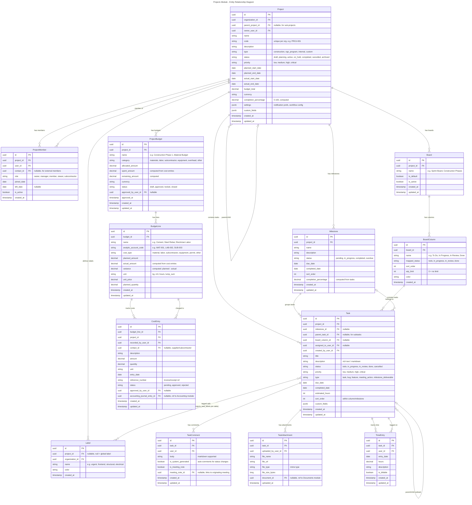
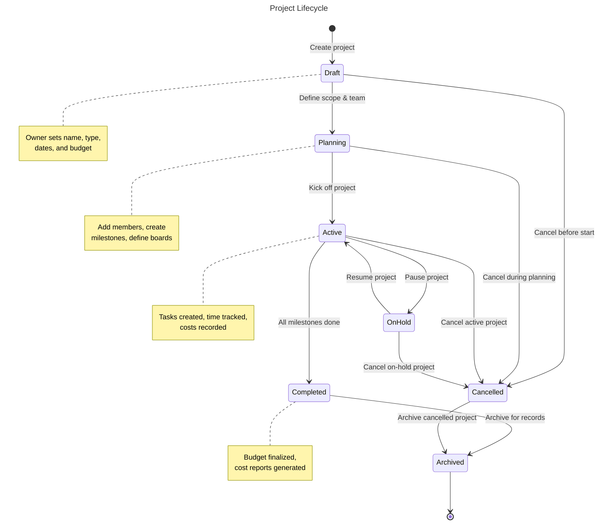
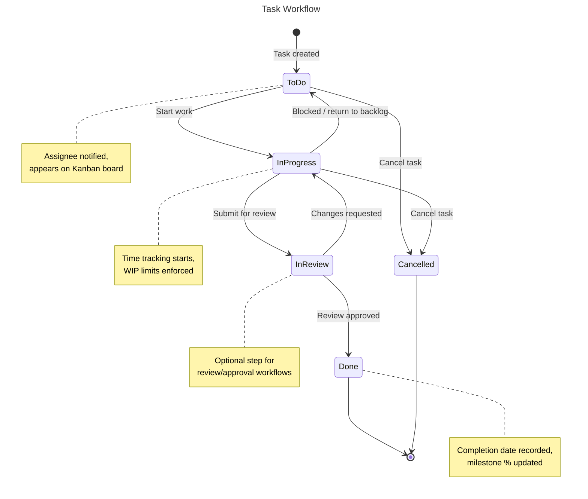
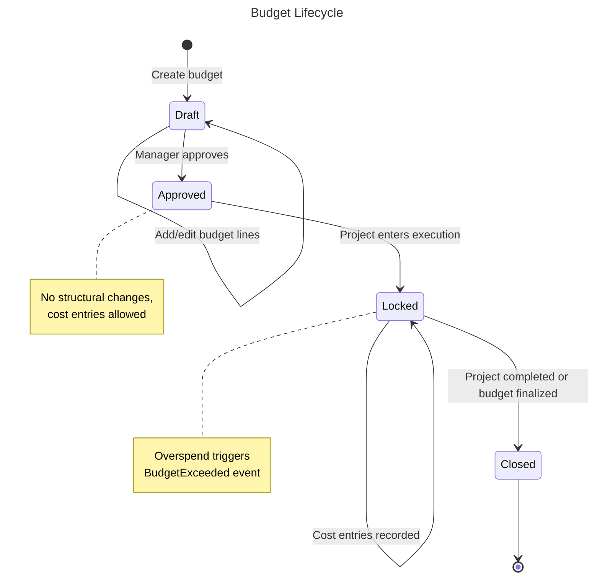
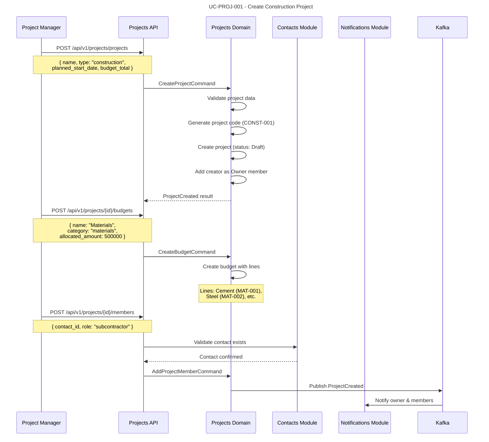
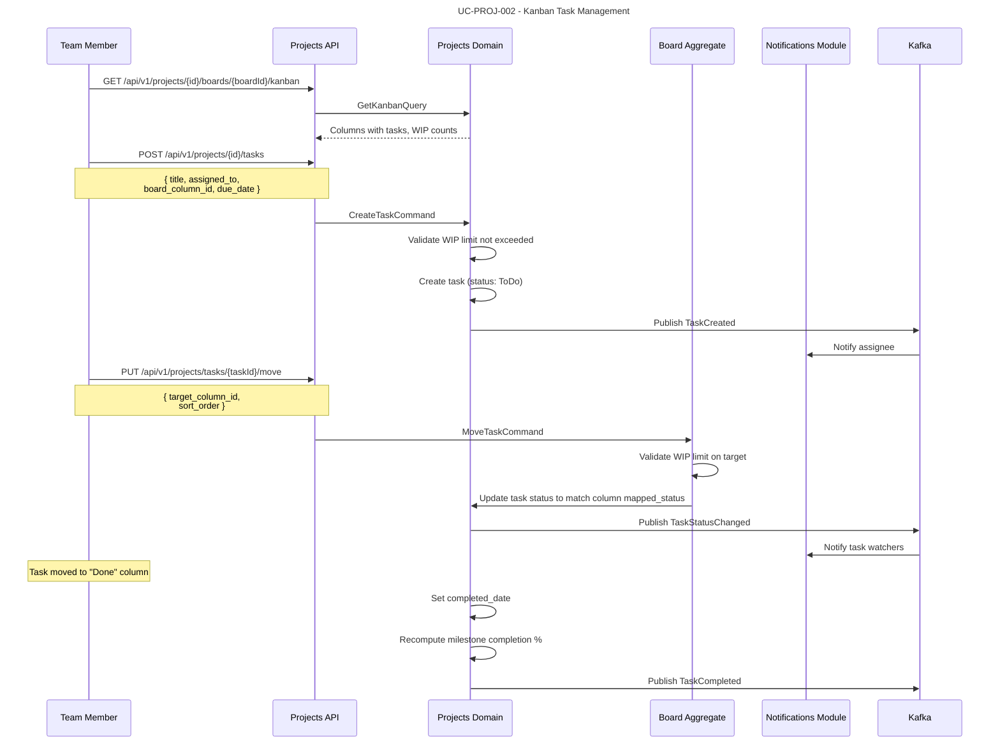
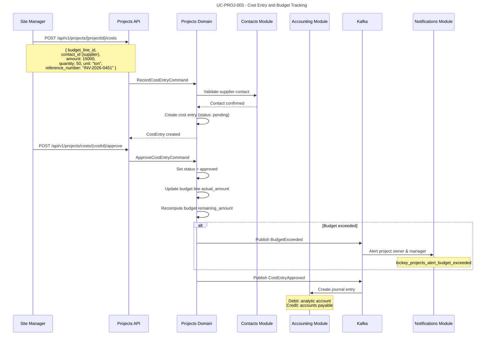
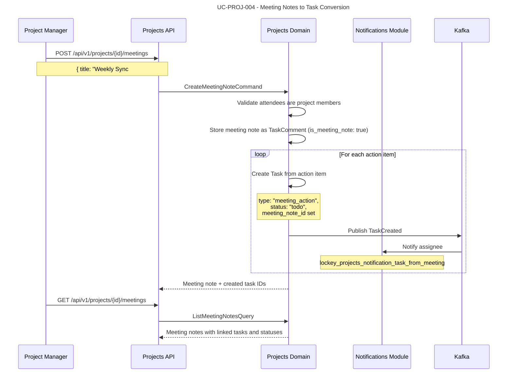
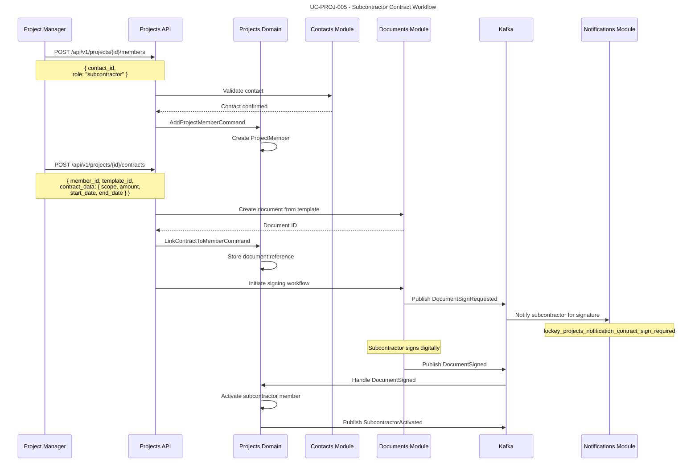

# Module: Projects (Project Management)

## Overview

The Projects module provides end-to-end project tracking, task management, milestone tracking, Kanban boards, cost center tracking, and team collaboration capabilities. It is designed for organizations managing construction projects (with analytic accounts for materials, labor, and subcontractors), NGO programs (Foundation, School initiatives), or internal operational initiatives.

The module supports hierarchical project structures with subtasks, configurable task workflows (To Do, In Progress, Done), deadline tracking with automated notifications, weekly meeting notes with decision-to-task conversion, and detailed cost center reporting per project. Integration with the Documents module enables subcontractor/worker contract management, while the Accounting module enables budget reconciliation and financial reporting.

### Module Identity

| Property | Value |
|----------|-------|
| Module Key | `projects` |
| Namespace | `Nexora.Modules.Projects` |
| Table Prefix | `projects_` |
| Version | `1.0.0` |
| Status | Specification |

### Dependencies

| Module | Type | Purpose |
|--------|------|---------|
| `identity` | Required | User authentication, RBAC permissions, organization/tenant resolution |
| `contacts` | Required | Contact references for subcontractors, workers, external stakeholders |
| `notifications` | Required | Deadline reminders, task assignments, milestone alerts |
| `documents` | Optional | Subcontractor/worker contract storage and e-signature workflows |
| `accounting` | Optional | Budget reconciliation, cost entry journaling, analytic account sync |

---

## Domain Model

### Entities



### Value Objects

| Value Object | Description |
|-------------|-------------|
| `ProjectId` | Strongly-typed project identifier |
| `MilestoneId` | Strongly-typed milestone identifier |
| `TaskId` | Strongly-typed task identifier |
| `TaskCommentId` | Strongly-typed comment identifier |
| `TaskAttachmentId` | Strongly-typed attachment identifier |
| `TimeEntryId` | Strongly-typed time entry identifier |
| `ProjectMemberId` | Strongly-typed project member identifier |
| `ProjectBudgetId` | Strongly-typed budget identifier |
| `BudgetLineId` | Strongly-typed budget line identifier |
| `CostEntryId` | Strongly-typed cost entry identifier |
| `BoardId` | Strongly-typed board identifier |
| `BoardColumnId` | Strongly-typed board column identifier |
| `LabelId` | Strongly-typed label identifier |
| `ProjectCode` | Validated project code (format: `[A-Z]{2,6}-[0-9]{3,6}`) |
| `AnalyticAccountCode` | Validated analytic code (format: `[A-Z]{3}-[0-9]{3}`) |
| `Money` | Amount + Currency (budget/cost values) |
| `ProjectStatus` | Enum: Draft, Planning, Active, OnHold, Completed, Cancelled, Archived |
| `TaskStatus` | Enum: ToDo, InProgress, InReview, Done, Cancelled |
| `Priority` | Enum: Low, Medium, High, Critical |
| `ProjectType` | Enum: Construction, NgoProgram, Internal, Custom |
| `MemberRole` | Enum: Owner, Manager, Member, Viewer, Subcontractor |
| `CostType` | Enum: Material, Labor, Subcontractor, Equipment, Permit, Other |
| `BudgetCategory` | Enum: Materials, Labor, Subcontractor, Equipment, Overhead, Other |

### Domain Events

| Event | Trigger | Consumers |
|-------|---------|-----------|
| `ProjectCreated` | New project created | Notifications (notify owner), Contacts (log activity) |
| `ProjectStatusChanged` | Project status transitions | Notifications (notify members), Accounting (if completed, close budgets) |
| `ProjectCompleted` | Project marked completed | Accounting (finalize cost entries), Notifications (notify stakeholders) |
| `MilestoneCompleted` | All milestone tasks done | Notifications (notify project manager) |
| `MilestoneOverdue` | Milestone past due date | Notifications (alert project owner and manager) |
| `TaskCreated` | New task created | Notifications (notify assignee if assigned) |
| `TaskAssigned` | Task assigned to user | Notifications (notify assignee) |
| `TaskStatusChanged` | Task moves through workflow | Notifications (notify watchers), Board (update column) |
| `TaskCompleted` | Task marked as Done | Milestone (recompute completion %), Notifications |
| `TaskOverdue` | Task past due date | Notifications (alert assignee and manager) |
| `CommentAdded` | Comment posted on task | Notifications (notify task watchers and assignee) |
| `TimeEntryLogged` | Time tracked on task | Accounting (if billable, create journal entry) |
| `BudgetApproved` | Budget approved by manager | Notifications (notify project members) |
| `BudgetExceeded` | Spending exceeds allocated budget | Notifications (alert owner, manager), Accounting (flag) |
| `CostEntryApproved` | Cost entry approved | Accounting (create journal entry if integrated) |
| `MeetingNoteCreated` | Meeting note with decisions logged | Tasks (auto-create tasks from action items) |

---

## Entity Lifecycles

### Project Lifecycle



### Task Workflow



### Budget Lifecycle



---

## Use Cases

### UC-PROJ-001: Create Construction Project with Budget Structure

- **Actor**: User with `projects.projects.create` permission
- **Preconditions**: Organization exists, user is authenticated
- **Flow**:



- **Business Rules**:
  - Project code is auto-generated per organization (prefix based on type: CONST-, NGO-, INT-)
  - Budget total is the sum of all budget allocations
  - At least one member (the creator) must exist with Owner role
  - Construction projects require at least one budget before transitioning to Planning

### UC-PROJ-002: Manage Tasks on Kanban Board

- **Actor**: User with `projects.tasks.write` permission
- **Preconditions**: Project is Active, Board exists with columns
- **Flow**:



- **Business Rules**:
  - Moving a task to a column with `mapped_status` automatically updates the task's `status`
  - WIP (Work In Progress) limits are enforced: moving a task to a full column is rejected with `lockey_projects_error_wip_limit_exceeded`
  - Completed tasks cannot be moved back unless explicitly reopened
  - Kanban view supports filtering by assignee, label, milestone, and priority
  - Default board is created automatically with columns: To Do, In Progress, In Review, Done

### UC-PROJ-003: Record Construction Costs and Track Budget

- **Actor**: User with `projects.costs.write` permission
- **Preconditions**: Project has approved budget with budget lines
- **Flow**:



- **Business Rules**:
  - Cost entries require approval before affecting budget calculations
  - Budget variance is continuously computed: `variance = planned_amount - actual_amount`
  - When `actual_amount > allocated_amount * 0.9` (90% threshold), a warning notification is sent
  - When `actual_amount > allocated_amount`, `BudgetExceeded` event is published
  - Each cost entry can optionally reference an accounting journal entry for reconciliation
  - Analytic account codes (e.g., MAT-001, LAB-002, SUB-003) enable cost center reporting
  - Cost entries can reference a supplier contact for traceability

### UC-PROJ-004: Weekly Meeting Notes with Action Item Conversion

- **Actor**: User with `projects.tasks.write` permission
- **Preconditions**: Project is Active, user is a project member
- **Flow**:



- **Business Rules**:
  - Meeting notes are stored as special `TaskComment` entries with `is_meeting_note = true`
  - Action items are automatically converted to tasks with `type = "meeting_action"`
  - Each generated task links back to the meeting note via `meeting_note_id`
  - Assignees of action items must be active project members
  - Meeting notes support markdown formatting for rich content
  - Historical meeting view shows all decisions and the status of resulting tasks

### UC-PROJ-005: Subcontractor Contract Management

- **Actor**: User with `projects.members.manage` permission
- **Preconditions**: Documents module is installed, contact exists in Contacts module
- **Flow**:



- **Business Rules**:
  - Subcontractor members require a signed contract before they can be assigned tasks (configurable)
  - Contract documents are managed via the Documents module (optional dependency)
  - If Documents module is not installed, contract management is manual (upload attachment only)
  - Subcontractor cost entries are linked to the member's contact record
  - Contract expiry triggers automated renewal notifications

---

## API Endpoints

### Projects

| Method | Path | Description | Permission |
|--------|------|-------------|------------|
| POST | `/api/v1/projects/projects` | Create project | `projects.projects.create` |
| GET | `/api/v1/projects/projects` | List/search projects (paginated) | `projects.projects.read` |
| GET | `/api/v1/projects/projects/{id}` | Get project detail with summary stats | `projects.projects.read` |
| PUT | `/api/v1/projects/projects/{id}` | Update project | `projects.projects.write` |
| POST | `/api/v1/projects/projects/{id}/status` | Change project status | `projects.projects.manage` |
| DELETE | `/api/v1/projects/projects/{id}` | Archive project (soft delete) | `projects.projects.delete` |
| GET | `/api/v1/projects/projects/{id}/dashboard` | Project dashboard (stats, charts) | `projects.projects.read` |
| GET | `/api/v1/projects/projects/{id}/timeline` | Gantt-style timeline view | `projects.projects.read` |

### Milestones

| Method | Path | Description | Permission |
|--------|------|-------------|------------|
| POST | `/api/v1/projects/projects/{id}/milestones` | Create milestone | `projects.milestones.create` |
| GET | `/api/v1/projects/projects/{id}/milestones` | List milestones for project | `projects.milestones.read` |
| GET | `/api/v1/projects/milestones/{id}` | Get milestone detail | `projects.milestones.read` |
| PUT | `/api/v1/projects/milestones/{id}` | Update milestone | `projects.milestones.write` |
| POST | `/api/v1/projects/milestones/{id}/complete` | Mark milestone complete | `projects.milestones.write` |
| DELETE | `/api/v1/projects/milestones/{id}` | Delete milestone | `projects.milestones.delete` |

### Tasks

| Method | Path | Description | Permission |
|--------|------|-------------|------------|
| POST | `/api/v1/projects/projects/{id}/tasks` | Create task | `projects.tasks.create` |
| GET | `/api/v1/projects/projects/{id}/tasks` | List tasks (filterable by status, assignee, milestone, label, priority) | `projects.tasks.read` |
| GET | `/api/v1/projects/tasks/{id}` | Get task detail with comments, attachments | `projects.tasks.read` |
| PUT | `/api/v1/projects/tasks/{id}` | Update task | `projects.tasks.write` |
| PUT | `/api/v1/projects/tasks/{id}/move` | Move task on board (change column/status) | `projects.tasks.write` |
| POST | `/api/v1/projects/tasks/{id}/assign` | Assign task to user | `projects.tasks.assign` |
| POST | `/api/v1/projects/tasks/{id}/labels` | Add labels to task | `projects.tasks.write` |
| DELETE | `/api/v1/projects/tasks/{id}/labels/{labelId}` | Remove label from task | `projects.tasks.write` |
| DELETE | `/api/v1/projects/tasks/{id}` | Delete task | `projects.tasks.delete` |
| GET | `/api/v1/projects/tasks/my` | Get tasks assigned to current user (cross-project) | `projects.tasks.read` |
| GET | `/api/v1/projects/tasks/overdue` | Get overdue tasks (cross-project) | `projects.tasks.read` |

### Task Comments

| Method | Path | Description | Permission |
|--------|------|-------------|------------|
| POST | `/api/v1/projects/tasks/{id}/comments` | Add comment to task | `projects.comments.create` |
| GET | `/api/v1/projects/tasks/{id}/comments` | List comments on task | `projects.comments.read` |
| PUT | `/api/v1/projects/comments/{id}` | Edit comment | `projects.comments.write` |
| DELETE | `/api/v1/projects/comments/{id}` | Delete comment | `projects.comments.delete` |

### Task Attachments

| Method | Path | Description | Permission |
|--------|------|-------------|------------|
| POST | `/api/v1/projects/tasks/{id}/attachments` | Upload attachment | `projects.attachments.create` |
| GET | `/api/v1/projects/tasks/{id}/attachments` | List attachments on task | `projects.attachments.read` |
| GET | `/api/v1/projects/attachments/{id}/download` | Download attachment | `projects.attachments.read` |
| DELETE | `/api/v1/projects/attachments/{id}` | Delete attachment | `projects.attachments.delete` |

### Time Entries

| Method | Path | Description | Permission |
|--------|------|-------------|------------|
| POST | `/api/v1/projects/tasks/{id}/time-entries` | Log time entry | `projects.time.create` |
| GET | `/api/v1/projects/tasks/{id}/time-entries` | List time entries for task | `projects.time.read` |
| GET | `/api/v1/projects/projects/{id}/time-entries` | List all time entries for project | `projects.time.read` |
| PUT | `/api/v1/projects/time-entries/{id}` | Update time entry | `projects.time.write` |
| DELETE | `/api/v1/projects/time-entries/{id}` | Delete time entry | `projects.time.delete` |
| GET | `/api/v1/projects/time-entries/my` | Get current user's time entries (cross-project) | `projects.time.read` |

### Project Members

| Method | Path | Description | Permission |
|--------|------|-------------|------------|
| POST | `/api/v1/projects/projects/{id}/members` | Add member to project | `projects.members.manage` |
| GET | `/api/v1/projects/projects/{id}/members` | List project members | `projects.members.read` |
| PUT | `/api/v1/projects/members/{id}` | Update member role | `projects.members.manage` |
| DELETE | `/api/v1/projects/members/{id}` | Remove member from project | `projects.members.manage` |

### Boards

| Method | Path | Description | Permission |
|--------|------|-------------|------------|
| POST | `/api/v1/projects/projects/{id}/boards` | Create board | `projects.boards.manage` |
| GET | `/api/v1/projects/projects/{id}/boards` | List boards for project | `projects.boards.read` |
| GET | `/api/v1/projects/boards/{id}/kanban` | Get Kanban view (columns with tasks) | `projects.boards.read` |
| PUT | `/api/v1/projects/boards/{id}` | Update board | `projects.boards.manage` |
| DELETE | `/api/v1/projects/boards/{id}` | Delete board | `projects.boards.manage` |
| POST | `/api/v1/projects/boards/{id}/columns` | Add column to board | `projects.boards.manage` |
| PUT | `/api/v1/projects/columns/{id}` | Update column (name, WIP limit, order) | `projects.boards.manage` |
| DELETE | `/api/v1/projects/columns/{id}` | Delete column | `projects.boards.manage` |

### Budgets & Costs

| Method | Path | Description | Permission |
|--------|------|-------------|------------|
| POST | `/api/v1/projects/projects/{id}/budgets` | Create budget | `projects.budgets.create` |
| GET | `/api/v1/projects/projects/{id}/budgets` | List budgets for project | `projects.budgets.read` |
| GET | `/api/v1/projects/budgets/{id}` | Get budget detail with lines | `projects.budgets.read` |
| PUT | `/api/v1/projects/budgets/{id}` | Update budget | `projects.budgets.write` |
| POST | `/api/v1/projects/budgets/{id}/approve` | Approve budget | `projects.budgets.approve` |
| POST | `/api/v1/projects/budgets/{id}/lines` | Add budget line | `projects.budgets.write` |
| PUT | `/api/v1/projects/budget-lines/{id}` | Update budget line | `projects.budgets.write` |
| DELETE | `/api/v1/projects/budget-lines/{id}` | Delete budget line | `projects.budgets.write` |
| POST | `/api/v1/projects/projects/{id}/costs` | Record cost entry | `projects.costs.create` |
| GET | `/api/v1/projects/projects/{id}/costs` | List cost entries for project | `projects.costs.read` |
| POST | `/api/v1/projects/costs/{id}/approve` | Approve cost entry | `projects.costs.approve` |
| POST | `/api/v1/projects/costs/{id}/reject` | Reject cost entry | `projects.costs.approve` |
| GET | `/api/v1/projects/projects/{id}/cost-report` | Cost center report by analytic account | `projects.costs.read` |

### Labels

| Method | Path | Description | Permission |
|--------|------|-------------|------------|
| POST | `/api/v1/projects/projects/{id}/labels` | Create label for project | `projects.labels.manage` |
| GET | `/api/v1/projects/projects/{id}/labels` | List labels for project | `projects.labels.read` |
| PUT | `/api/v1/projects/labels/{id}` | Update label | `projects.labels.manage` |
| DELETE | `/api/v1/projects/labels/{id}` | Delete label | `projects.labels.manage` |

### Meetings

| Method | Path | Description | Permission |
|--------|------|-------------|------------|
| POST | `/api/v1/projects/projects/{id}/meetings` | Create meeting note with action items | `projects.tasks.write` |
| GET | `/api/v1/projects/projects/{id}/meetings` | List meeting notes | `projects.tasks.read` |
| GET | `/api/v1/projects/meetings/{id}` | Get meeting note with linked tasks | `projects.tasks.read` |

### Contracts (requires Documents module)

| Method | Path | Description | Permission |
|--------|------|-------------|------------|
| POST | `/api/v1/projects/projects/{id}/contracts` | Create contract from template | `projects.contracts.manage` |
| GET | `/api/v1/projects/projects/{id}/contracts` | List contracts for project | `projects.contracts.read` |
| GET | `/api/v1/projects/contracts/{id}` | Get contract detail with signing status | `projects.contracts.read` |

---

## Integration Points

### Events Published

| Event | Topic | Payload |
|-------|-------|---------|
| `projects.project.created` | `nexora.projects.projects` | `{ project_id, organization_id, name, type, owner_user_id }` |
| `projects.project.status_changed` | `nexora.projects.projects` | `{ project_id, organization_id, old_status, new_status }` |
| `projects.project.completed` | `nexora.projects.projects` | `{ project_id, organization_id, actual_end_date, total_cost }` |
| `projects.task.created` | `nexora.projects.tasks` | `{ task_id, project_id, title, assigned_to_user_id, due_date }` |
| `projects.task.assigned` | `nexora.projects.tasks` | `{ task_id, project_id, assigned_to_user_id, assigned_by_user_id }` |
| `projects.task.status_changed` | `nexora.projects.tasks` | `{ task_id, project_id, old_status, new_status }` |
| `projects.task.completed` | `nexora.projects.tasks` | `{ task_id, project_id, milestone_id, completed_date }` |
| `projects.task.overdue` | `nexora.projects.tasks` | `{ task_id, project_id, assigned_to_user_id, due_date }` |
| `projects.milestone.completed` | `nexora.projects.milestones` | `{ milestone_id, project_id, completed_date }` |
| `projects.milestone.overdue` | `nexora.projects.milestones` | `{ milestone_id, project_id, due_date }` |
| `projects.comment.added` | `nexora.projects.tasks` | `{ comment_id, task_id, project_id, user_id }` |
| `projects.time_entry.logged` | `nexora.projects.time` | `{ time_entry_id, task_id, project_id, user_id, hours, is_billable }` |
| `projects.budget.approved` | `nexora.projects.budgets` | `{ budget_id, project_id, allocated_amount }` |
| `projects.budget.exceeded` | `nexora.projects.budgets` | `{ budget_id, project_id, budget_line_id, allocated, actual }` |
| `projects.cost_entry.approved` | `nexora.projects.costs` | `{ cost_entry_id, project_id, budget_line_id, amount, analytic_account_code }` |
| `projects.meeting_note.created` | `nexora.projects.meetings` | `{ meeting_id, project_id, action_item_count, created_task_ids }` |

### Events Consumed

| Event | Source Module | Action |
|-------|-------------- |--------|
| `identity.user.deactivated` | Identity | Unassign tasks from deactivated user, mark member as inactive |
| `identity.user.role_changed` | Identity | Revalidate project member permissions |
| `contacts.contact.updated` | Contacts | Update cached contact info on project members |
| `contacts.contact.merged` | Contacts | Update `contact_id` references on ProjectMember and CostEntry records |
| `contacts.contact.deleted` | Contacts | Mark external project members as inactive |
| `documents.document.signed` | Documents | Activate subcontractor member, mark contract as executed |
| `documents.document.expired` | Documents | Flag subcontractor contract expiry, notify project manager |
| `accounting.journal_entry.posted` | Accounting | Link journal entry ID to cost entry for reconciliation |

### Cross-Module Query Interfaces (SharedKernel)

| Interface | Provided By | Used For |
|-----------|-------------|----------|
| `ICurrentUser` | Identity | Get authenticated user ID, organization, permissions |
| `IContactLookup` | Contacts | Validate contact references for members and cost entries |
| `INotificationSender` | Notifications | Send deadline alerts, assignment notifications |
| `IDocumentService` | Documents | Create contracts from templates, check signing status |
| `IAnalyticAccountService` | Accounting | Validate analytic account codes, post cost journal entries |

---

## Database Schema

All tables reside in the tenant schema with the `projects_` prefix.

| Table Name | Description |
|------------|-------------|
| `projects_projects` | Core project records |
| `projects_milestones` | Milestone tracking |
| `projects_tasks` | Tasks and subtasks |
| `projects_task_comments` | Comments on tasks (including meeting notes) |
| `projects_task_attachments` | File attachments on tasks |
| `projects_task_labels` | Join table: Task-Label many-to-many |
| `projects_time_entries` | Time tracking entries |
| `projects_project_members` | Project team membership |
| `projects_project_budgets` | Budget allocations per project |
| `projects_budget_lines` | Line items within budgets (analytic accounts) |
| `projects_cost_entries` | Actual cost records |
| `projects_boards` | Kanban boards |
| `projects_board_columns` | Columns within boards |
| `projects_labels` | Label definitions |

### Key Indexes

| Table | Index | Purpose |
|-------|-------|---------|
| `projects_projects` | `ix_projects_org_status` on `(organization_id, status)` | List projects by org and status |
| `projects_projects` | `ix_projects_parent` on `(parent_project_id)` | Sub-project lookup |
| `projects_tasks` | `ix_tasks_project_status` on `(project_id, status)` | Filter tasks by project and status |
| `projects_tasks` | `ix_tasks_assigned` on `(assigned_to_user_id, status)` | My tasks queries |
| `projects_tasks` | `ix_tasks_milestone` on `(milestone_id)` | Tasks per milestone |
| `projects_tasks` | `ix_tasks_due_date` on `(due_date) WHERE status NOT IN ('done', 'cancelled')` | Overdue task detection |
| `projects_tasks` | `ix_tasks_board_column` on `(board_column_id, sort_order)` | Kanban column ordering |
| `projects_cost_entries` | `ix_costs_project_date` on `(project_id, entry_date)` | Cost reporting by date range |
| `projects_cost_entries` | `ix_costs_budget_line` on `(budget_line_id)` | Budget line aggregation |
| `projects_budget_lines` | `ix_budget_lines_analytic` on `(analytic_account_code)` | Cost center reporting |
| `projects_project_members` | `ix_members_project_active` on `(project_id, is_active)` | Active members lookup |
| `projects_time_entries` | `ix_time_user_date` on `(user_id, entry_date)` | Timesheet queries |

---

## Permissions

| Permission Key | Description |
|----------------|-------------|
| `projects.projects.create` | Create new projects |
| `projects.projects.read` | View projects and dashboards |
| `projects.projects.write` | Update project details |
| `projects.projects.manage` | Change project status, archive |
| `projects.projects.delete` | Archive/soft-delete projects |
| `projects.milestones.create` | Create milestones |
| `projects.milestones.read` | View milestones |
| `projects.milestones.write` | Update milestones |
| `projects.milestones.delete` | Delete milestones |
| `projects.tasks.create` | Create tasks |
| `projects.tasks.read` | View tasks |
| `projects.tasks.write` | Update tasks, move on board |
| `projects.tasks.assign` | Assign tasks to users |
| `projects.tasks.delete` | Delete tasks |
| `projects.comments.create` | Add comments |
| `projects.comments.read` | View comments |
| `projects.comments.write` | Edit own comments |
| `projects.comments.delete` | Delete comments |
| `projects.attachments.create` | Upload attachments |
| `projects.attachments.read` | View/download attachments |
| `projects.attachments.delete` | Delete attachments |
| `projects.time.create` | Log time entries |
| `projects.time.read` | View time entries |
| `projects.time.write` | Edit time entries |
| `projects.time.delete` | Delete time entries |
| `projects.members.read` | View project members |
| `projects.members.manage` | Add/remove/change role of members |
| `projects.boards.read` | View boards and Kanban |
| `projects.boards.manage` | Create/edit/delete boards and columns |
| `projects.budgets.create` | Create budgets |
| `projects.budgets.read` | View budgets and cost reports |
| `projects.budgets.write` | Edit budgets and budget lines |
| `projects.budgets.approve` | Approve budgets |
| `projects.costs.create` | Record cost entries |
| `projects.costs.read` | View cost entries and reports |
| `projects.costs.approve` | Approve/reject cost entries |
| `projects.labels.read` | View labels |
| `projects.labels.manage` | Create/edit/delete labels |
| `projects.contracts.read` | View contracts |
| `projects.contracts.manage` | Create/manage contracts |

---

## Localization Keys

All user-facing messages follow the `lockey_` format. Below are representative keys used throughout the module:

| Key | Context |
|-----|---------|
| `lockey_projects_create_success` | Project created successfully |
| `lockey_projects_update_success` | Project updated successfully |
| `lockey_projects_status_changed` | Project status changed |
| `lockey_projects_error_not_found` | Project not found |
| `lockey_projects_error_invalid_status_transition` | Invalid project status transition |
| `lockey_projects_error_wip_limit_exceeded` | Kanban WIP limit exceeded for target column |
| `lockey_projects_error_budget_not_approved` | Budget must be approved before recording costs |
| `lockey_projects_error_task_completed_immovable` | Completed tasks cannot be moved without reopening |
| `lockey_projects_error_member_not_active` | Project member is not active |
| `lockey_projects_error_duplicate_project_code` | Project code already exists in organization |
| `lockey_projects_alert_budget_exceeded` | Budget allocation has been exceeded |
| `lockey_projects_alert_budget_warning_90` | Budget has reached 90% of allocation |
| `lockey_projects_alert_milestone_overdue` | Milestone is past its due date |
| `lockey_projects_alert_task_overdue` | Task is past its due date |
| `lockey_projects_notification_task_assigned` | You have been assigned a task |
| `lockey_projects_notification_task_from_meeting` | A task was created for you from a meeting decision |
| `lockey_projects_notification_contract_sign_required` | Contract requires your digital signature |
| `lockey_projects_notification_comment_added` | A comment was added to your task |
| `lockey_projects_notification_milestone_completed` | Milestone has been completed |
| `lockey_projects_validation_name_required` | Project name is required |
| `lockey_projects_validation_due_date_past` | Due date cannot be in the past |
| `lockey_projects_validation_budget_amount_positive` | Budget amount must be positive |
| `lockey_projects_validation_hours_positive` | Hours must be greater than zero |
| `lockey_projects_validation_end_after_start` | End date must be after start date |
| `lockey_projects_label_status_draft` | Draft |
| `lockey_projects_label_status_planning` | Planning |
| `lockey_projects_label_status_active` | Active |
| `lockey_projects_label_status_on_hold` | On Hold |
| `lockey_projects_label_status_completed` | Completed |
| `lockey_projects_label_status_cancelled` | Cancelled |
| `lockey_projects_label_status_archived` | Archived |

---

## CQRS Command & Query Reference

### Commands

| Command | Handler | Description |
|---------|---------|-------------|
| `CreateProjectCommand` | `CreateProjectHandler` | Creates project, assigns owner, generates code |
| `UpdateProjectCommand` | `UpdateProjectHandler` | Updates project metadata |
| `ChangeProjectStatusCommand` | `ChangeProjectStatusHandler` | Validates and transitions project status |
| `CreateMilestoneCommand` | `CreateMilestoneHandler` | Creates milestone under project |
| `CompleteMilestoneCommand` | `CompleteMilestoneHandler` | Marks milestone as completed |
| `CreateTaskCommand` | `CreateTaskHandler` | Creates task, validates WIP, assigns column |
| `UpdateTaskCommand` | `UpdateTaskHandler` | Updates task fields |
| `MoveTaskCommand` | `MoveTaskHandler` | Moves task across board columns, updates status |
| `AssignTaskCommand` | `AssignTaskHandler` | Assigns task to project member |
| `AddCommentCommand` | `AddCommentHandler` | Adds comment to task |
| `UploadAttachmentCommand` | `UploadAttachmentHandler` | Stores attachment, links to task |
| `LogTimeEntryCommand` | `LogTimeEntryHandler` | Records time entry against task |
| `AddProjectMemberCommand` | `AddProjectMemberHandler` | Adds member with role validation |
| `CreateBudgetCommand` | `CreateBudgetHandler` | Creates budget with lines |
| `ApproveBudgetCommand` | `ApproveBudgetHandler` | Approves budget for cost tracking |
| `RecordCostEntryCommand` | `RecordCostEntryHandler` | Records cost, validates budget line |
| `ApproveCostEntryCommand` | `ApproveCostEntryHandler` | Approves cost entry, updates actuals, checks thresholds |
| `CreateMeetingNoteCommand` | `CreateMeetingNoteHandler` | Stores meeting note, creates tasks from action items |
| `CreateBoardCommand` | `CreateBoardHandler` | Creates board with default columns |
| `UpdateBoardColumnCommand` | `UpdateBoardColumnHandler` | Updates column name, WIP limit, order |
| `CreateLabelCommand` | `CreateLabelHandler` | Creates label for project |
| `AddLabelToTaskCommand` | `AddLabelToTaskHandler` | Tags task with label |
| `CreateContractCommand` | `CreateContractHandler` | Creates contract via Documents module |

### Queries

| Query | Handler | Description |
|-------|---------|-------------|
| `GetProjectByIdQuery` | `GetProjectByIdHandler` | Returns project with summary stats |
| `ListProjectsQuery` | `ListProjectsHandler` | Paginated, filterable project list |
| `GetProjectDashboardQuery` | `GetProjectDashboardHandler` | Aggregated project statistics |
| `GetProjectTimelineQuery` | `GetProjectTimelineHandler` | Gantt-style milestone/task timeline |
| `ListMilestonesQuery` | `ListMilestonesHandler` | Milestones for project with completion % |
| `GetKanbanQuery` | `GetKanbanHandler` | Board columns with ordered tasks |
| `GetTaskByIdQuery` | `GetTaskByIdHandler` | Task detail with comments, attachments, time entries |
| `ListTasksQuery` | `ListTasksHandler` | Filterable task list (status, assignee, milestone, label, priority) |
| `GetMyTasksQuery` | `GetMyTasksHandler` | Current user's tasks across projects |
| `GetOverdueTasksQuery` | `GetOverdueTasksHandler` | Tasks past due date across projects |
| `GetBudgetDetailQuery` | `GetBudgetDetailHandler` | Budget with lines, actuals, variance |
| `GetCostReportQuery` | `GetCostReportHandler` | Cost center report by analytic account |
| `ListTimeEntriesQuery` | `ListTimeEntriesHandler` | Time entries filterable by project, user, date range |
| `GetMyTimeEntriesQuery` | `GetMyTimeEntriesHandler` | Current user's time entries |
| `ListMeetingNotesQuery` | `ListMeetingNotesHandler` | Meeting notes with linked task statuses |
| `ListProjectMembersQuery` | `ListProjectMembersHandler` | Active members with roles |

---

## Non-Functional Requirements

| Requirement | Target | Notes |
|------------|--------|-------|
| Kanban board load | < 300ms | Columns with tasks, ordered, including labels and assignee info |
| Task list (paginated) | < 200ms | With filters applied (status, assignee, milestone, priority) |
| Project dashboard | < 500ms | Aggregated stats, chart data, recent activity |
| Cost center report | < 1s | Aggregation across all budget lines and cost entries |
| Task search (full-text) | < 300ms | PostgreSQL full-text search on title + description |
| Max projects per org | 10,000 | Soft limit, configurable per tenant |
| Max tasks per project | 50,000 | Includes subtasks |
| Max members per project | 500 | Including external subcontractors |
| Max board columns | 20 | Per board |
| Max budget lines per budget | 200 | Per budget |
| File attachment max size | 50 MB | Per file, stored in MinIO |
| Concurrent board users | 100 | Real-time updates via SignalR per project |
| Overdue check interval | Every 15 min | Background job scans for overdue tasks and milestones |
| Budget threshold check | On every cost entry approval | Synchronous check during approval |
| Data retention | Unlimited | Archived projects retained, queryable |
| Audit log | All mutations | Every create/update/delete logged with user, timestamp, old/new values |
| API rate limiting | 1000 req/min per user | Enforced at APISIX gateway |
| Multi-tenant isolation | Schema-per-tenant | EF Core global query filters for organization_id |

### Scalability Considerations

- **Kanban real-time sync**: SignalR hub per project board for live task movement updates across connected clients
- **Background jobs**: Hangfire-based recurring jobs for overdue detection, milestone completion recomputation, and budget threshold alerts
- **Caching**: Redis cache for project dashboard aggregations (TTL: 60s), board structure (TTL: 30s)
- **Bulk operations**: Batch task creation/update endpoints for meeting action items and import scenarios
- **Search**: PostgreSQL `tsvector` index on `projects_tasks(title, description)` for full-text search

---

## Module Registration

```csharp
public sealed class ProjectsModule : IModule
{
    public string Name => "projects";
    public string DisplayName => "lockey_projects_module_name";
    public string Description => "lockey_projects_module_description";
    public string Version => "1.0.0";

    public string[] Dependencies => ["identity", "contacts", "notifications"];
    public string[] OptionalDependencies => ["documents", "accounting"];

    public void ConfigureServices(IServiceCollection services, IConfiguration configuration)
    {
        // Register DbContext, repositories, MediatR handlers, validators, Mapster profiles
    }

    public void ConfigureEndpoints(IEndpointRouteBuilder endpoints)
    {
        // Map all /api/v1/projects/* minimal API endpoints
    }

    public void ConfigureEventHandlers(IEventBusBuilder builder)
    {
        // Subscribe to consumed integration events
    }
}
```
