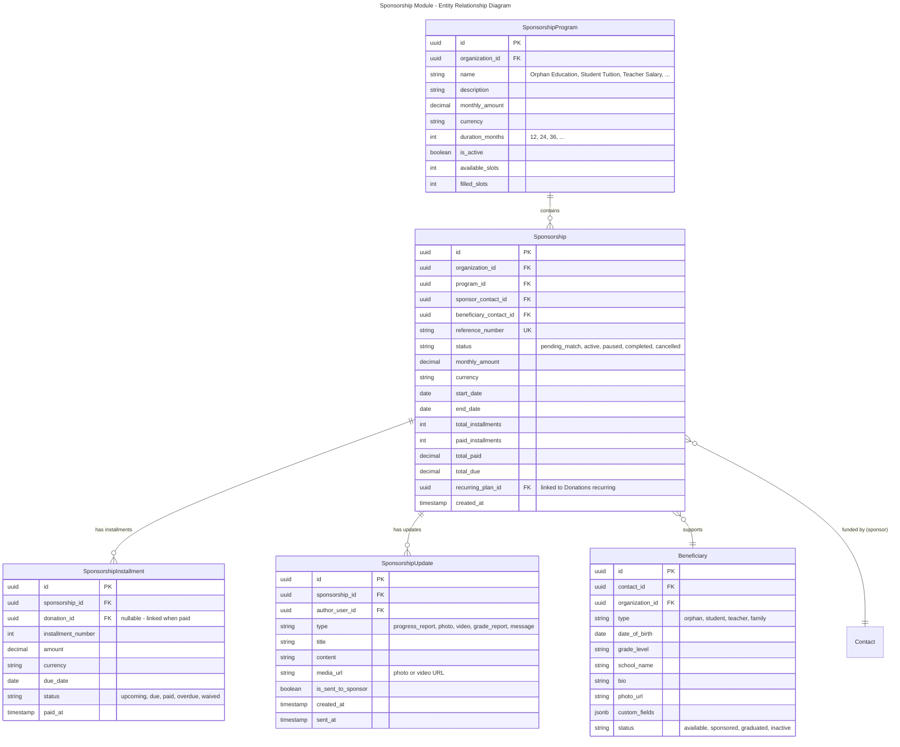
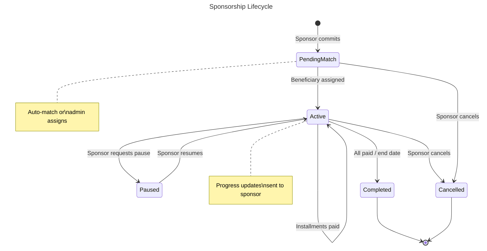
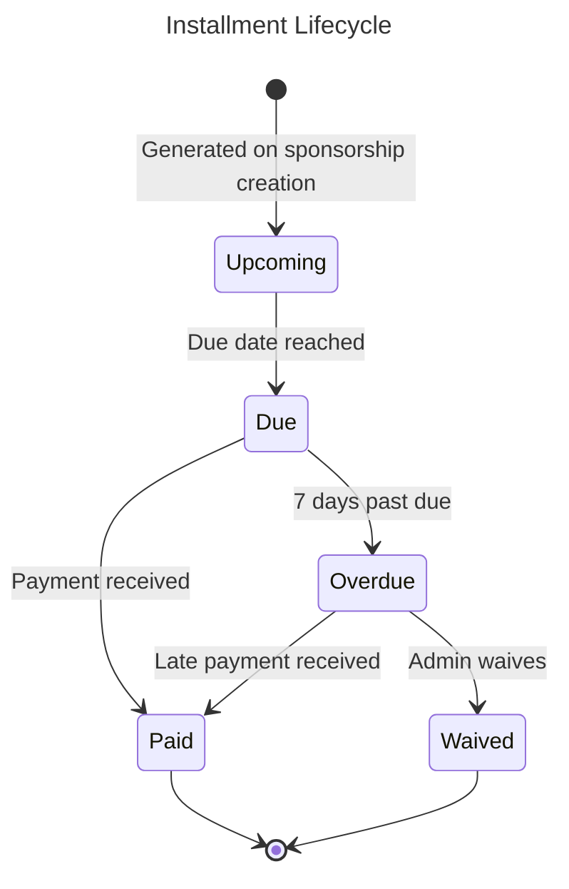
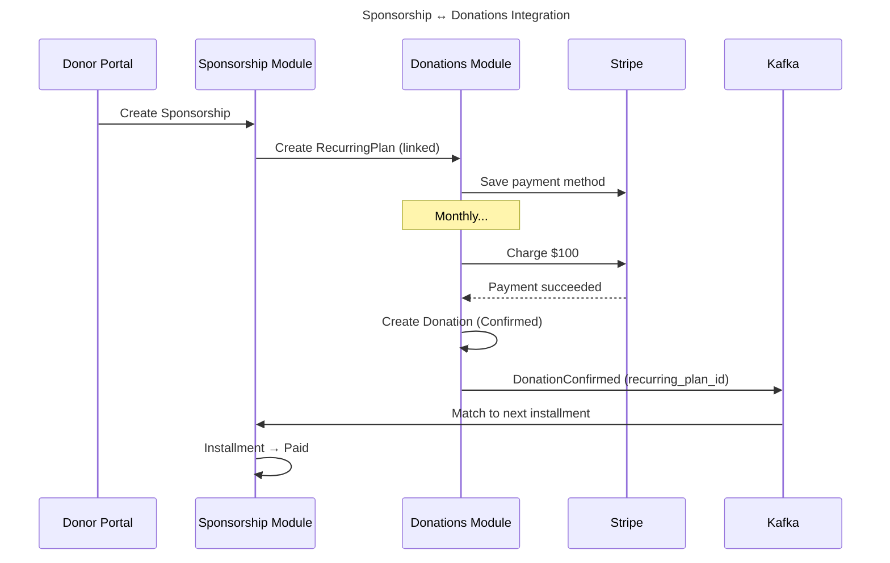

# Module: Sponsorship Management

## Overview
The Sponsorship module manages long-term, person-to-person financial commitments — such as sponsoring an orphan's education, a student's tuition, or a teacher's salary. Unlike general donations, sponsorships create a **linked relationship between sponsor (donor) and beneficiary** with installment tracking, progress updates, and personalized communication. The model is similar to Darusssafaka or child sponsorship NGOs (e.g., World Vision).

## Domain Model

### Entities

### Value Objects

| Value Object | Description |
|-------------|-------------|
| `SponsorshipId` | Strongly-typed sponsorship identifier |
| `ProgramId` | Strongly-typed program identifier |
| `InstallmentNumber` | Sequential installment counter |
| `SponsorshipStatus` | Enum: PendingMatch, Active, Paused, Completed, Cancelled |
| `InstallmentStatus` | Enum: Upcoming, Due, Paid, Overdue, Waived |

### Domain Events

| Event | Trigger | Consumers |
|-------|---------|-----------|
| `SponsorshipCreated` | New sponsorship started | Contacts (log activity, tag sponsor), Notifications (welcome) |
| `SponsorshipActivated` | Beneficiary matched | Notifications (send beneficiary info to sponsor) |
| `InstallmentPaid` | Donation linked to installment | Contacts (log activity), Reporting |
| `InstallmentOverdue` | Past due date, unpaid | Notifications (remind sponsor) |
| `SponsorshipCompleted` | All installments paid / end date | Contacts (log), Notifications (thank you + renewal offer) |
| `SponsorshipCancelled` | Sponsor or admin cancels | Contacts (update tags), Program (free slot) |
| `ProgressUpdateSent` | Update shared with sponsor | Notifications (email/SMS with update link) |

### Entity Lifecycles

## Use Cases

### UC-SPO-001: Create Sponsorship
- **Actor**: Donor (via portal) or Staff
- **Flow**:
  1. Sponsor selects program (e.g., "Orphan Education - $100/mo, 12 months")
  2. Sponsor optionally selects a specific beneficiary (or auto-match)
  3. System creates Sponsorship (status: PendingMatch or Active)
  4. System generates installment schedule (12 monthly installments)
  5. System links to Donations RecurringPlan for automatic monthly charging
  6. If auto-match: system assigns available beneficiary → status Active
  7. Sponsor receives welcome kit (beneficiary photo, bio, program details)
- **Business Rules**:
  - One beneficiary can have multiple sponsors (configurable per program)
  - Sponsor can choose beneficiary from available list or trust auto-assignment
  - Installment amounts and frequency come from program settings
  - Sponsorship creates a linked RecurringPlan in Donations module

### UC-SPO-002: Process Installment Payment
- **Actor**: System (via Donations recurring charge) or Sponsor (manual)
- **Flow**:
  1. Donations module processes recurring charge → creates Donation
  2. Sponsorship module listens for `donations.donation.confirmed`
  3. System matches donation to next due installment (by recurring_plan_id)
  4. Installment status → Paid, link donation_id
  5. Update sponsorship totals (paid_installments, total_paid)
  6. If all installments paid → Sponsorship status → Completed
- **Business Rules**:
  - Installments paid in order (no skip)
  - Partial payments not supported (full installment amount required)
  - Overpayment credited to next installment

### UC-SPO-003: Send Progress Update
- **Actor**: Staff with `sponsorship.updates.manage` permission
- **Flow**:
  1. Staff creates update (report, photo, video, grade report)
  2. Staff selects sponsorships (single or bulk)
  3. System links update to sponsorships
  4. System sends notification to sponsors (email with preview + link to portal)
  5. Sponsor views update in portal dashboard
- **Business Rules**:
  - Minimum 1 update per quarter per active sponsorship (tracked, admin alerted if missed)
  - Photos/videos stored in MinIO, served via CDN
  - Sponsors can view updates in portal

### UC-SPO-004: Sponsor Portal Dashboard
- **Actor**: Sponsor (authenticated portal user)
- **Flow**:
  1. Sponsor logs in to portal
  2. Dashboard shows: active sponsorships, beneficiary info, payment schedule
  3. Sponsor can: view/pay installments, watch videos, read updates, download receipts
  4. Sponsor can make ad-hoc payment (extra donation to beneficiary)

## API Endpoints

### Sponsorships
| Method | Path | Description | Auth |
|--------|------|-------------|------|
| POST | `/api/v1/sponsorship/sponsorships` | Create sponsorship | `sponsorship.sponsorships.create` |
| GET | `/api/v1/sponsorship/sponsorships` | List sponsorships | `sponsorship.sponsorships.read` |
| GET | `/api/v1/sponsorship/sponsorships/{id}` | Get detail | `sponsorship.sponsorships.read` |
| POST | `/api/v1/sponsorship/sponsorships/{id}/pause` | Pause | `sponsorship.sponsorships.manage` |
| POST | `/api/v1/sponsorship/sponsorships/{id}/resume` | Resume | `sponsorship.sponsorships.manage` |
| POST | `/api/v1/sponsorship/sponsorships/{id}/cancel` | Cancel | `sponsorship.sponsorships.manage` |
| GET | `/api/v1/sponsorship/sponsorships/{id}/installments` | List installments | `sponsorship.sponsorships.read` |

### Programs
| Method | Path | Description | Auth |
|--------|------|-------------|------|
| POST | `/api/v1/sponsorship/programs` | Create program | `sponsorship.programs.manage` |
| GET | `/api/v1/sponsorship/programs` | List programs | Public (for portal display) |
| PUT | `/api/v1/sponsorship/programs/{id}` | Update program | `sponsorship.programs.manage` |

### Beneficiaries
| Method | Path | Description | Auth |
|--------|------|-------------|------|
| POST | `/api/v1/sponsorship/beneficiaries` | Register beneficiary | `sponsorship.beneficiaries.manage` |
| GET | `/api/v1/sponsorship/beneficiaries` | List beneficiaries | `sponsorship.beneficiaries.read` |
| GET | `/api/v1/sponsorship/beneficiaries/{id}` | Get beneficiary | `sponsorship.beneficiaries.read` |
| PUT | `/api/v1/sponsorship/beneficiaries/{id}` | Update beneficiary | `sponsorship.beneficiaries.manage` |

### Updates
| Method | Path | Description | Auth |
|--------|------|-------------|------|
| POST | `/api/v1/sponsorship/updates` | Create update | `sponsorship.updates.manage` |
| POST | `/api/v1/sponsorship/updates/bulk-send` | Bulk send to sponsors | `sponsorship.updates.manage` |

### Portal
| Method | Path | Description | Auth |
|--------|------|-------------|------|
| GET | `/api/v1/sponsorship/portal/my-sponsorships` | My sponsorships | Portal auth |
| GET | `/api/v1/sponsorship/portal/my-sponsorships/{id}/updates` | Beneficiary updates | Portal auth |
| POST | `/api/v1/sponsorship/portal/my-sponsorships/{id}/pay` | Pay installment | Portal auth |

## Integration Points

### Events Produced
| Event | Topic |
|-------|-------|
| `sponsorship.sponsorship.created` | `nexora.sponsorship` |
| `sponsorship.sponsorship.activated` | `nexora.sponsorship` |
| `sponsorship.installment.paid` | `nexora.sponsorship` |
| `sponsorship.installment.overdue` | `nexora.sponsorship` |
| `sponsorship.sponsorship.completed` | `nexora.sponsorship` |
| `sponsorship.update.sent` | `nexora.sponsorship.updates` |

### Events Consumed
| Event | Source | Action |
|-------|--------|--------|
| `donations.donation.confirmed` | Donations | Match to installment, mark paid |
| `donations.recurring.cancelled` | Donations | Alert admin, potentially pause sponsorship |
| `contacts.contact.merged` | Contacts | Update sponsor/beneficiary contact references |

## Non-Functional Requirements

| Requirement | Target |
|------------|--------|
| Max sponsorships per tenant | 100,000 |
| Max beneficiaries per tenant | 50,000 |
| Installment matching latency | < 5 seconds after donation confirmed |
| Overdue check job | Daily at 00:00 UTC |
| Update delivery | < 1 minute after send action |
| Portal dashboard load | < 500ms |
