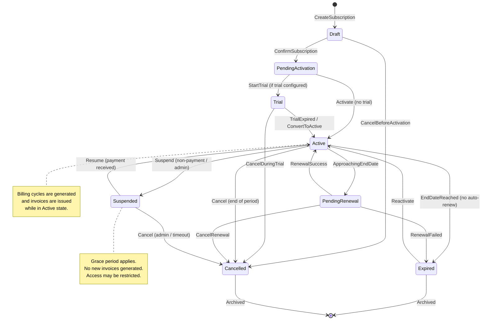
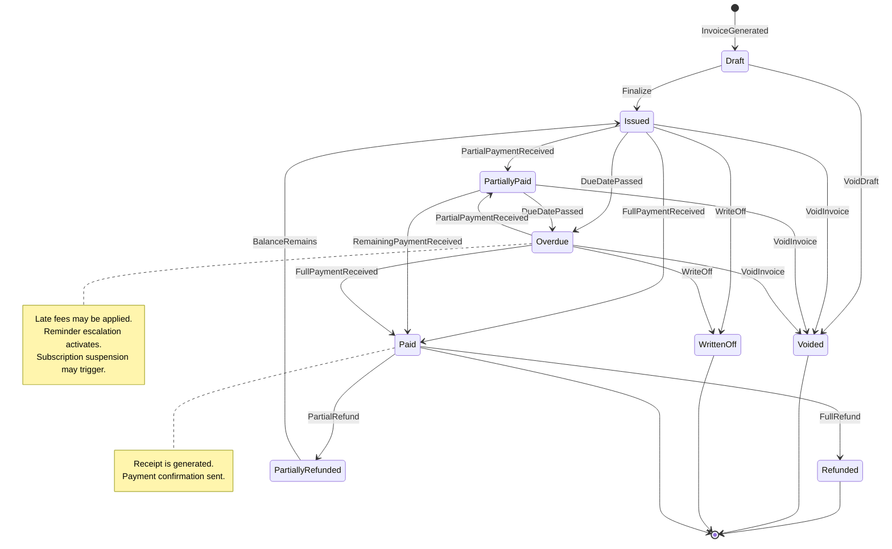
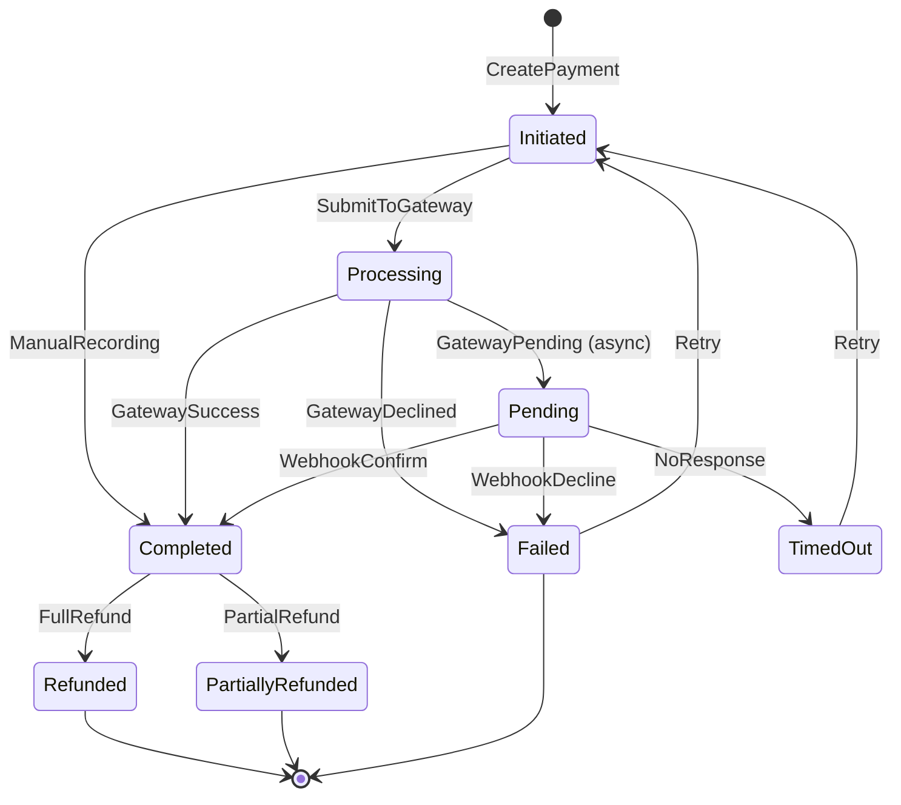
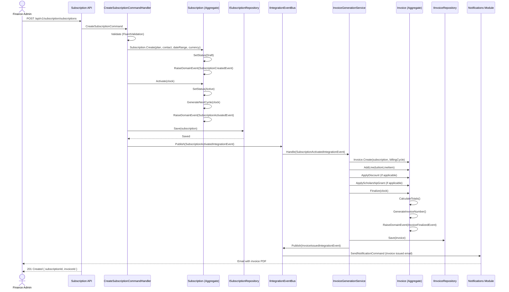
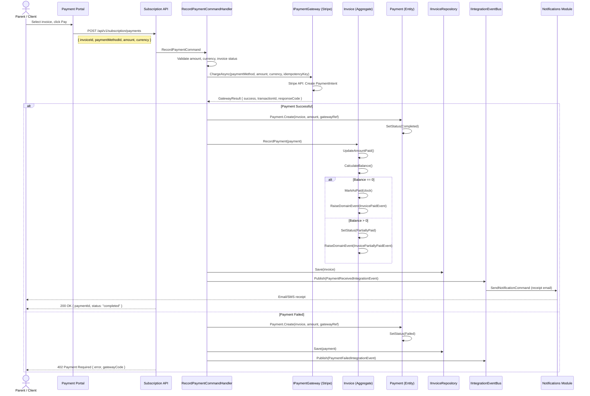
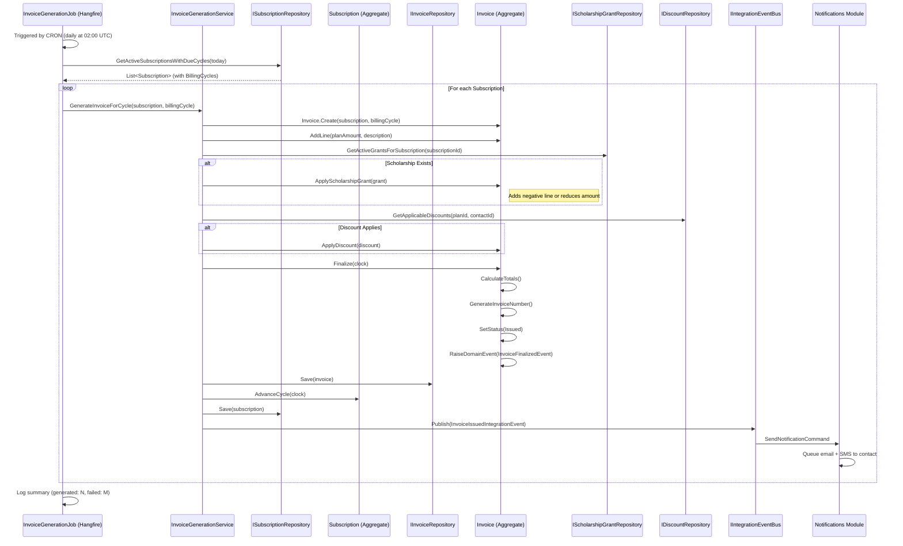
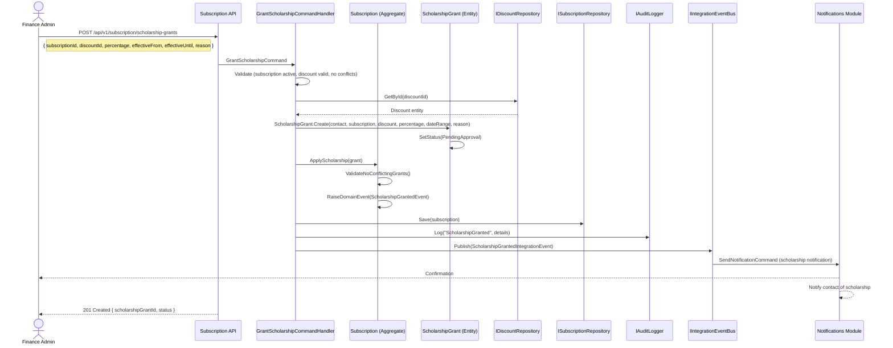
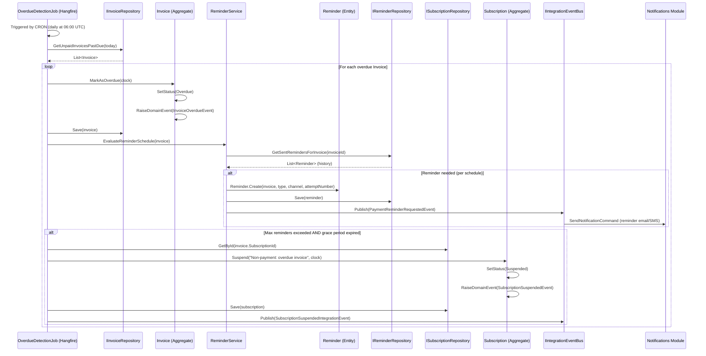

# Subscription & Billing Module Specification

**Module ID:** `subscription`
**Version:** 1.0.0
**Status:** Draft
**Last Updated:** 2026-03-19
**Owner:** Nexora Platform Team

---

## Table of Contents

1. [Module Overview](#1-module-overview)
2. [Architecture & Dependencies](#2-architecture--dependencies)
3. [Domain Model & ER Diagram](#3-domain-model--er-diagram)
4. [State Diagrams](#4-state-diagrams)
5. [Use Cases & Sequence Diagrams](#5-use-cases--sequence-diagrams)
6. [API Endpoints](#6-api-endpoints)
7. [Integration Events](#7-integration-events)
8. [Non-Functional Requirements](#8-non-functional-requirements)
9. [Localization Keys](#9-localization-keys)
10. [Appendix](#10-appendix)

---

## 1. Module Overview

### 1.1 Purpose

The Subscription & Billing module provides a complete recurring billing engine for the Nexora platform. It manages subscription plans, billing cycles, automatic invoice generation, payment tracking, discount/scholarship management, and payment gateway integrations. The module is designed to serve multiple organization types -- schools (tuition management), NGOs (donor/member billing), and service providers (SaaS-style subscriptions).

### 1.2 Core Capabilities

| Capability | Description |
|---|---|
| **Plan Management** | Define flexible subscription plans with configurable pricing tiers, billing frequencies (annual, semester, quarterly, monthly), and currency support. |
| **Subscription Lifecycle** | Full lifecycle management from creation through activation, suspension, cancellation, and renewal. |
| **Automatic Invoicing** | Schedule-driven invoice generation based on billing cycles with support for prorated amounts. |
| **Payment Tracking** | Record and reconcile payments from multiple sources including gateway callbacks, manual entry, and batch imports. |
| **Discount & Scholarship** | Percentage-based and fixed-amount discounts, scholarship grants tied to specific subscribers, with approval workflows. |
| **Payment Reminders** | Configurable reminder sequences via email and SMS at pre-due, due, and overdue intervals. |
| **Overdue Management** | Automatic overdue detection, escalation policies, late fee application, and reporting. |
| **Payment Portal** | Self-service portal for parents/clients to view invoices, make payments, and download receipts. |
| **Multi-Currency** | Full multi-currency support with configurable exchange rates and per-tenant base currency. |
| **Gateway Integration** | Pluggable payment gateway architecture with built-in support for Stripe and iyzico. |

### 1.3 Target Personas

| Persona | Interaction |
|---|---|
| **Finance Admin** | Manages plans, reviews invoices, reconciles payments, generates reports. |
| **Organization Admin** | Configures billing settings, discount policies, and reminder schedules. |
| **Parent / Client** | Views invoices, makes payments, downloads receipts via self-service portal. |
| **System (Automated)** | Generates invoices, sends reminders, processes gateway webhooks. |

---

## 2. Architecture & Dependencies

### 2.1 Clean Architecture Layers

```
Nexora.Modules.Subscription/
├── Domain/
│   ├── Entities/
│   ├── ValueObjects/
│   ├── Enumerations/
│   ├── Events/
│   ├── Exceptions/
│   └── Interfaces/
├── Application/
│   ├── Commands/
│   ├── Queries/
│   ├── EventHandlers/
│   ├── Validators/
│   ├── DTOs/
│   └── Interfaces/
├── Infrastructure/
│   ├── Persistence/
│   │   ├── Configurations/
│   │   ├── Repositories/
│   │   └── Migrations/
│   ├── PaymentGateways/
│   │   ├── Stripe/
│   │   └── Iyzico/
│   ├── BackgroundJobs/
│   └── Services/
└── Presentation/
    ├── Controllers/
    ├── Filters/
    └── Middleware/
```

### 2.2 Module Dependencies

```json
{
  "moduleId": "subscription",
  "dependencies": ["identity", "contacts", "notifications"],
  "optionalDependencies": ["reporting", "documents"]
}
```

| Dependency | Type | Purpose |
|---|---|---|
| `identity` | **Required** | Tenant resolution, user authentication, role/permission checks. Consumed via `ITenantContext`, `ICurrentUser` from SharedKernel. |
| `contacts` | **Required** | Subscriber resolution. Subscriptions are linked to contacts (students, parents, clients). Consumed via `IContactResolver` interface and `ContactCreated`/`ContactUpdated` integration events. |
| `notifications` | **Required** | Sending payment reminders, invoice notifications, and receipt confirmations. Publishes `SendNotificationCommand` integration events. |
| `reporting` | Optional | Provides data feeds for financial reports and dashboards. |
| `documents` | Optional | PDF generation for invoices and receipts. Falls back to built-in generator if unavailable. |

### 2.3 SharedKernel Interfaces Used

```csharp
// From Nexora.SharedKernel
ITenantContext          // Multi-tenant context resolution
ICurrentUser            // Authenticated user context
IDomainEventDispatcher  // In-process domain event dispatch
IIntegrationEventBus    // Cross-module async event bus
IAuditLogger            // Audit trail logging
IDateTimeProvider       // Testable date/time abstraction
```

### 2.4 CQRS Pattern

All operations follow the CQRS pattern via MediatR:

- **Commands** mutate state and return strongly-typed result objects.
- **Queries** read state and return DTOs; they never modify data.
- **Domain Events** are raised within aggregates and dispatched after persistence.
- **Integration Events** are published to the message bus for cross-module communication.

---

## 3. Domain Model & ER Diagram

### 3.1 Strongly-Typed IDs

All entities use strongly-typed identifiers to prevent primitive obsession:

```csharp
public readonly record struct PlanId(Guid Value);
public readonly record struct SubscriptionId(Guid Value);
public readonly record struct BillingCycleId(Guid Value);
public readonly record struct InvoiceId(Guid Value);
public readonly record struct InvoiceLineId(Guid Value);
public readonly record struct PaymentId(Guid Value);
public readonly record struct DiscountId(Guid Value);
public readonly record struct ScholarshipGrantId(Guid Value);
public readonly record struct PaymentMethodId(Guid Value);
public readonly record struct ReminderId(Guid Value);
```

### 3.2 Value Objects

```csharp
public record Money(decimal Amount, CurrencyCode Currency);
public record CurrencyCode(string Value);        // ISO 4217
public record BillingFrequency(FrequencyType Type, int IntervalMonths);
public record DateRange(DateOnly Start, DateOnly End);
public record GatewayReference(string GatewayName, string ExternalId);
public record ReminderSchedule(int DaysBeforeDue, int DaysAfterDue, int MaxAttempts);
```

### 3.3 Entity-Relationship Diagram

```mermaid
erDiagram
    subscription_plans {
        uuid id PK
        uuid tenant_id FK
        string name
        string description
        string plan_code
        enum billing_frequency
        int interval_months
        decimal base_amount
        string currency_code
        bool is_active
        bool auto_renew_default
        int grace_period_days
        int trial_period_days
        jsonb metadata
        timestamp created_at
        timestamp updated_at
        uuid created_by
    }

    subscription_subscriptions {
        uuid id PK
        uuid tenant_id FK
        uuid plan_id FK
        uuid contact_id FK
        uuid subscriber_user_id FK
        enum status
        date start_date
        date end_date
        date trial_end_date
        decimal override_amount
        string currency_code
        bool auto_renew
        date cancelled_at
        string cancellation_reason
        int current_cycle_number
        jsonb metadata
        timestamp created_at
        timestamp updated_at
    }

    subscription_billing_cycles {
        uuid id PK
        uuid tenant_id FK
        uuid subscription_id FK
        int cycle_number
        date period_start
        date period_end
        decimal amount_due
        string currency_code
        enum status
        date due_date
        date invoice_generation_date
        timestamp created_at
    }

    subscription_invoices {
        uuid id PK
        uuid tenant_id FK
        uuid subscription_id FK
        uuid billing_cycle_id FK
        uuid contact_id FK
        string invoice_number
        enum status
        date issue_date
        date due_date
        decimal subtotal
        decimal discount_total
        decimal tax_total
        decimal total_amount
        decimal amount_paid
        decimal balance_due
        string currency_code
        string notes
        date paid_at
        date voided_at
        string void_reason
        jsonb metadata
        timestamp created_at
        timestamp updated_at
    }

    subscription_invoice_lines {
        uuid id PK
        uuid tenant_id FK
        uuid invoice_id FK
        string description
        decimal quantity
        decimal unit_price
        decimal discount_amount
        decimal tax_amount
        decimal line_total
        string currency_code
        uuid discount_id FK
        uuid scholarship_grant_id FK
        int sort_order
        timestamp created_at
    }

    subscription_payments {
        uuid id PK
        uuid tenant_id FK
        uuid invoice_id FK
        uuid subscription_id FK
        uuid contact_id FK
        uuid payment_method_id FK
        decimal amount
        string currency_code
        enum status
        enum payment_source
        string gateway_name
        string gateway_transaction_id
        string gateway_response_code
        jsonb gateway_metadata
        date payment_date
        string reference_number
        string notes
        uuid recorded_by
        timestamp created_at
        timestamp updated_at
    }

    subscription_discounts {
        uuid id PK
        uuid tenant_id FK
        string name
        string discount_code
        enum discount_type
        decimal value
        decimal max_amount
        date valid_from
        date valid_until
        bool is_active
        bool is_stackable
        int max_uses
        int current_uses
        uuid applicable_plan_id FK
        jsonb eligibility_rules
        timestamp created_at
        timestamp updated_at
    }

    subscription_scholarship_grants {
        uuid id PK
        uuid tenant_id FK
        uuid contact_id FK
        uuid subscription_id FK
        uuid discount_id FK
        enum status
        decimal granted_amount
        decimal granted_percentage
        string currency_code
        date effective_from
        date effective_until
        string reason
        uuid approved_by
        date approved_at
        uuid revoked_by
        date revoked_at
        string revocation_reason
        jsonb metadata
        timestamp created_at
        timestamp updated_at
    }

    subscription_payment_methods {
        uuid id PK
        uuid tenant_id FK
        uuid contact_id FK
        enum method_type
        string label
        string gateway_name
        string gateway_customer_id
        string gateway_payment_method_id
        string masked_identifier
        bool is_default
        bool is_active
        date expires_at
        jsonb metadata
        timestamp created_at
        timestamp updated_at
    }

    subscription_reminders {
        uuid id PK
        uuid tenant_id FK
        uuid invoice_id FK
        uuid subscription_id FK
        uuid contact_id FK
        enum reminder_type
        enum channel
        enum status
        date scheduled_at
        date sent_at
        date failed_at
        string failure_reason
        int attempt_number
        string template_key
        jsonb template_data
        timestamp created_at
    }

    subscription_plans ||--o{ subscription_subscriptions : "defines"
    subscription_subscriptions ||--o{ subscription_billing_cycles : "generates"
    subscription_subscriptions ||--o{ subscription_invoices : "produces"
    subscription_billing_cycles ||--o| subscription_invoices : "triggers"
    subscription_invoices ||--o{ subscription_invoice_lines : "contains"
    subscription_invoices ||--o{ subscription_payments : "receives"
    subscription_invoices ||--o{ subscription_reminders : "triggers"
    subscription_discounts ||--o{ subscription_invoice_lines : "applied_to"
    subscription_scholarship_grants ||--o{ subscription_invoice_lines : "applied_to"
    subscription_subscriptions ||--o{ subscription_scholarship_grants : "benefits_from"
    subscription_payments }o--|| subscription_payment_methods : "uses"
    subscription_discounts }o--o| subscription_plans : "scoped_to"
```



### 3.4 Rich Domain Model (Key Behaviors)

```csharp
// Aggregate Root: Subscription
public class Subscription : AggregateRoot<SubscriptionId>
{
    public void Activate(IDateTimeProvider clock);
    public void Suspend(string reason, IDateTimeProvider clock);
    public void Resume(IDateTimeProvider clock);
    public void Cancel(string reason, bool immediate, IDateTimeProvider clock);
    public void Renew(DateRange newPeriod, IDateTimeProvider clock);
    public BillingCycle GenerateNextCycle(IDateTimeProvider clock);
    public void ApplyScholarship(ScholarshipGrant grant);
    public void RevokeScholarship(ScholarshipGrantId grantId, string reason, UserId revokedBy);
}

// Aggregate Root: Invoice
public class Invoice : AggregateRoot<InvoiceId>
{
    public void AddLine(InvoiceLine line);
    public void RemoveLine(InvoiceLineId lineId);
    public void ApplyDiscount(Discount discount);
    public void ApplyScholarshipGrant(ScholarshipGrant grant);
    public void Finalize(IDateTimeProvider clock);
    public void RecordPayment(Payment payment);
    public void MarkAsPaid(IDateTimeProvider clock);
    public void MarkAsOverdue(IDateTimeProvider clock);
    public void Void(string reason, UserId voidedBy, IDateTimeProvider clock);
    public void Refund(Money amount, string reason, IDateTimeProvider clock);
    public Money CalculateBalance();
}
```

---

## 4. State Diagrams

### 4.1 Subscription Lifecycle



### 4.2 Invoice Lifecycle



### 4.3 Payment Status



---

## 5. Use Cases & Sequence Diagrams

### 5.1 UC-01: Create Subscription and Generate First Invoice

**Actors:** Finance Admin
**Preconditions:** Plan exists and is active. Contact exists in the contacts module.
**Postconditions:** Subscription is active, first billing cycle is created, and an invoice is generated.



### 5.2 UC-02: Process Payment via Stripe Gateway

**Actors:** Parent / Client (via Payment Portal)
**Preconditions:** Invoice is in Issued or Overdue status. Client has a saved payment method.
**Postconditions:** Payment is recorded, invoice is marked as Paid, receipt is sent.



### 5.3 UC-03: Automatic Invoice Generation (Scheduled Job)

**Actors:** System (Background Job)
**Preconditions:** Active subscriptions with billing cycles approaching their invoice generation date.
**Postconditions:** Invoices are generated and issued for all due billing cycles.



### 5.4 UC-04: Apply Scholarship Grant to Subscription

**Actors:** Finance Admin
**Preconditions:** Contact and subscription exist. A discount of type Scholarship is configured.
**Postconditions:** Scholarship grant is recorded and will be applied to future invoices.



### 5.5 UC-05: Overdue Invoice Detection and Reminder Escalation

**Actors:** System (Background Job)
**Preconditions:** Invoices exist with due dates in the past and unpaid balances.
**Postconditions:** Invoices are marked as overdue, reminders are scheduled and sent, and subscriptions may be suspended.



---

## 6. API Endpoints

### 6.1 Plans

| Method | Endpoint | Description | Auth |
|---|---|---|---|
| `GET` | `/api/v1/subscription/plans` | List all plans (paginated, filterable) | `subscription.plans.read` |
| `GET` | `/api/v1/subscription/plans/{planId}` | Get plan by ID | `subscription.plans.read` |
| `POST` | `/api/v1/subscription/plans` | Create a new plan | `subscription.plans.write` |
| `PUT` | `/api/v1/subscription/plans/{planId}` | Update plan details | `subscription.plans.write` |
| `PATCH` | `/api/v1/subscription/plans/{planId}/activate` | Activate a plan | `subscription.plans.write` |
| `PATCH` | `/api/v1/subscription/plans/{planId}/deactivate` | Deactivate a plan | `subscription.plans.write` |
| `DELETE` | `/api/v1/subscription/plans/{planId}` | Soft-delete a plan (only if unused) | `subscription.plans.delete` |

### 6.2 Subscriptions

| Method | Endpoint | Description | Auth |
|---|---|---|---|
| `GET` | `/api/v1/subscription/subscriptions` | List subscriptions (paginated, filterable by status, plan, contact) | `subscription.subscriptions.read` |
| `GET` | `/api/v1/subscription/subscriptions/{subscriptionId}` | Get subscription details with cycles | `subscription.subscriptions.read` |
| `POST` | `/api/v1/subscription/subscriptions` | Create a new subscription | `subscription.subscriptions.write` |
| `PATCH` | `/api/v1/subscription/subscriptions/{subscriptionId}/activate` | Activate subscription | `subscription.subscriptions.write` |
| `PATCH` | `/api/v1/subscription/subscriptions/{subscriptionId}/suspend` | Suspend subscription | `subscription.subscriptions.write` |
| `PATCH` | `/api/v1/subscription/subscriptions/{subscriptionId}/resume` | Resume suspended subscription | `subscription.subscriptions.write` |
| `PATCH` | `/api/v1/subscription/subscriptions/{subscriptionId}/cancel` | Cancel subscription | `subscription.subscriptions.write` |
| `PATCH` | `/api/v1/subscription/subscriptions/{subscriptionId}/renew` | Renew subscription | `subscription.subscriptions.write` |
| `GET` | `/api/v1/subscription/subscriptions/{subscriptionId}/billing-cycles` | List billing cycles for subscription | `subscription.subscriptions.read` |
| `GET` | `/api/v1/subscription/subscriptions/by-contact/{contactId}` | Get subscriptions for a contact | `subscription.subscriptions.read` |

### 6.3 Invoices

| Method | Endpoint | Description | Auth |
|---|---|---|---|
| `GET` | `/api/v1/subscription/invoices` | List invoices (paginated, filterable by status, date range, contact) | `subscription.invoices.read` |
| `GET` | `/api/v1/subscription/invoices/{invoiceId}` | Get invoice with lines | `subscription.invoices.read` |
| `POST` | `/api/v1/subscription/invoices` | Create manual invoice (ad-hoc) | `subscription.invoices.write` |
| `POST` | `/api/v1/subscription/invoices/{invoiceId}/lines` | Add line item to draft invoice | `subscription.invoices.write` |
| `DELETE` | `/api/v1/subscription/invoices/{invoiceId}/lines/{lineId}` | Remove line from draft invoice | `subscription.invoices.write` |
| `PATCH` | `/api/v1/subscription/invoices/{invoiceId}/finalize` | Finalize and issue invoice | `subscription.invoices.write` |
| `PATCH` | `/api/v1/subscription/invoices/{invoiceId}/void` | Void an invoice | `subscription.invoices.write` |
| `PATCH` | `/api/v1/subscription/invoices/{invoiceId}/write-off` | Write off an invoice | `subscription.invoices.write` |
| `GET` | `/api/v1/subscription/invoices/{invoiceId}/pdf` | Download invoice as PDF | `subscription.invoices.read` |
| `GET` | `/api/v1/subscription/invoices/overdue` | List all overdue invoices | `subscription.invoices.read` |
| `GET` | `/api/v1/subscription/invoices/by-contact/{contactId}` | List invoices for a contact | `subscription.invoices.read` |

### 6.4 Payments

| Method | Endpoint | Description | Auth |
|---|---|---|---|
| `GET` | `/api/v1/subscription/payments` | List payments (paginated, filterable) | `subscription.payments.read` |
| `GET` | `/api/v1/subscription/payments/{paymentId}` | Get payment details | `subscription.payments.read` |
| `POST` | `/api/v1/subscription/payments` | Record a payment (manual or gateway) | `subscription.payments.write` |
| `POST` | `/api/v1/subscription/payments/{paymentId}/refund` | Initiate a refund | `subscription.payments.refund` |
| `GET` | `/api/v1/subscription/payments/by-invoice/{invoiceId}` | List payments for an invoice | `subscription.payments.read` |
| `GET` | `/api/v1/subscription/payments/by-contact/{contactId}` | List payments for a contact | `subscription.payments.read` |

### 6.5 Payment Methods

| Method | Endpoint | Description | Auth |
|---|---|---|---|
| `GET` | `/api/v1/subscription/payment-methods` | List payment methods for current user / contact | `subscription.payment-methods.read` |
| `GET` | `/api/v1/subscription/payment-methods/{methodId}` | Get payment method details | `subscription.payment-methods.read` |
| `POST` | `/api/v1/subscription/payment-methods` | Register a new payment method (via gateway tokenization) | `subscription.payment-methods.write` |
| `PATCH` | `/api/v1/subscription/payment-methods/{methodId}/set-default` | Set as default payment method | `subscription.payment-methods.write` |
| `DELETE` | `/api/v1/subscription/payment-methods/{methodId}` | Remove a payment method | `subscription.payment-methods.write` |

### 6.6 Discounts

| Method | Endpoint | Description | Auth |
|---|---|---|---|
| `GET` | `/api/v1/subscription/discounts` | List all discounts | `subscription.discounts.read` |
| `GET` | `/api/v1/subscription/discounts/{discountId}` | Get discount details | `subscription.discounts.read` |
| `POST` | `/api/v1/subscription/discounts` | Create a discount | `subscription.discounts.write` |
| `PUT` | `/api/v1/subscription/discounts/{discountId}` | Update a discount | `subscription.discounts.write` |
| `PATCH` | `/api/v1/subscription/discounts/{discountId}/activate` | Activate discount | `subscription.discounts.write` |
| `PATCH` | `/api/v1/subscription/discounts/{discountId}/deactivate` | Deactivate discount | `subscription.discounts.write` |

### 6.7 Scholarship Grants

| Method | Endpoint | Description | Auth |
|---|---|---|---|
| `GET` | `/api/v1/subscription/scholarship-grants` | List scholarship grants (filterable) | `subscription.scholarships.read` |
| `GET` | `/api/v1/subscription/scholarship-grants/{grantId}` | Get grant details | `subscription.scholarships.read` |
| `POST` | `/api/v1/subscription/scholarship-grants` | Create a scholarship grant | `subscription.scholarships.write` |
| `PATCH` | `/api/v1/subscription/scholarship-grants/{grantId}/approve` | Approve a grant | `subscription.scholarships.approve` |
| `PATCH` | `/api/v1/subscription/scholarship-grants/{grantId}/revoke` | Revoke a grant | `subscription.scholarships.write` |
| `GET` | `/api/v1/subscription/scholarship-grants/by-contact/{contactId}` | Grants for a contact | `subscription.scholarships.read` |

### 6.8 Reminders

| Method | Endpoint | Description | Auth |
|---|---|---|---|
| `GET` | `/api/v1/subscription/reminders` | List reminders (filterable by status, type) | `subscription.reminders.read` |
| `GET` | `/api/v1/subscription/reminders/by-invoice/{invoiceId}` | List reminders for an invoice | `subscription.reminders.read` |
| `POST` | `/api/v1/subscription/reminders/send-manual` | Trigger a manual reminder | `subscription.reminders.write` |

### 6.9 Webhooks (Gateway Callbacks)

| Method | Endpoint | Description | Auth |
|---|---|---|---|
| `POST` | `/api/v1/subscription/webhooks/stripe` | Stripe webhook endpoint | HMAC signature verification |
| `POST` | `/api/v1/subscription/webhooks/iyzico` | iyzico webhook endpoint | HMAC signature verification |

### 6.10 Portal (Self-Service)

| Method | Endpoint | Description | Auth |
|---|---|---|---|
| `GET` | `/api/v1/subscription/portal/my-subscriptions` | Current user's subscriptions | Authenticated user |
| `GET` | `/api/v1/subscription/portal/my-invoices` | Current user's invoices | Authenticated user |
| `GET` | `/api/v1/subscription/portal/my-invoices/{invoiceId}` | Invoice detail for current user | Authenticated user |
| `POST` | `/api/v1/subscription/portal/my-invoices/{invoiceId}/pay` | Initiate payment for an invoice | Authenticated user |
| `GET` | `/api/v1/subscription/portal/my-payments` | Current user's payment history | Authenticated user |
| `GET` | `/api/v1/subscription/portal/my-payment-methods` | Current user's payment methods | Authenticated user |

### 6.11 Reports

| Method | Endpoint | Description | Auth |
|---|---|---|---|
| `GET` | `/api/v1/subscription/reports/revenue` | Revenue report (by period, plan, currency) | `subscription.reports.read` |
| `GET` | `/api/v1/subscription/reports/overdue` | Overdue summary report | `subscription.reports.read` |
| `GET` | `/api/v1/subscription/reports/collections` | Collections report | `subscription.reports.read` |
| `GET` | `/api/v1/subscription/reports/churn` | Subscription churn analysis | `subscription.reports.read` |
| `GET` | `/api/v1/subscription/reports/scholarship-utilization` | Scholarship utilization report | `subscription.reports.read` |

### 6.12 Common Query Parameters

All list endpoints support:

| Parameter | Type | Description |
|---|---|---|
| `page` | `int` | Page number (default: 1) |
| `pageSize` | `int` | Items per page (default: 20, max: 100) |
| `sortBy` | `string` | Field to sort by |
| `sortDirection` | `asc\|desc` | Sort direction |
| `search` | `string` | Full-text search |
| `tenantId` | `Guid` | Implicit from auth context (never passed manually) |

---

## 7. Integration Events

### 7.1 Published Events (Outbound)

These events are published by the Subscription module to the integration event bus for consumption by other modules.

| Event | Payload | Consumers | Description |
|---|---|---|---|
| `SubscriptionCreatedIntegrationEvent` | `{ SubscriptionId, TenantId, PlanId, ContactId, Status, StartDate, Currency }` | reporting | A new subscription was created. |
| `SubscriptionActivatedIntegrationEvent` | `{ SubscriptionId, TenantId, ContactId, PlanId, StartDate, EndDate }` | contacts, reporting | Subscription became active. |
| `SubscriptionSuspendedIntegrationEvent` | `{ SubscriptionId, TenantId, ContactId, Reason, SuspendedAt }` | contacts, notifications, reporting | Subscription was suspended (may restrict access). |
| `SubscriptionCancelledIntegrationEvent` | `{ SubscriptionId, TenantId, ContactId, Reason, CancelledAt, Immediate }` | contacts, notifications, reporting | Subscription was cancelled. |
| `SubscriptionRenewedIntegrationEvent` | `{ SubscriptionId, TenantId, ContactId, NewStartDate, NewEndDate }` | contacts, reporting | Subscription was renewed for a new period. |
| `InvoiceIssuedIntegrationEvent` | `{ InvoiceId, TenantId, ContactId, InvoiceNumber, TotalAmount, Currency, DueDate }` | notifications, reporting | An invoice was finalized and issued. |
| `InvoiceOverdueIntegrationEvent` | `{ InvoiceId, TenantId, ContactId, InvoiceNumber, BalanceDue, Currency, DueDate, DaysOverdue }` | notifications, reporting | An invoice passed its due date without full payment. |
| `InvoicePaidIntegrationEvent` | `{ InvoiceId, TenantId, ContactId, InvoiceNumber, AmountPaid, Currency, PaidAt }` | contacts, notifications, reporting | An invoice was fully paid. |
| `InvoiceVoidedIntegrationEvent` | `{ InvoiceId, TenantId, InvoiceNumber, Reason, VoidedAt }` | reporting | An invoice was voided. |
| `PaymentReceivedIntegrationEvent` | `{ PaymentId, TenantId, InvoiceId, ContactId, Amount, Currency, PaymentSource, GatewayName }` | reporting | A payment was successfully received and recorded. |
| `PaymentFailedIntegrationEvent` | `{ PaymentId, TenantId, InvoiceId, ContactId, Amount, Currency, FailureReason, GatewayName }` | notifications, reporting | A payment attempt failed. |
| `PaymentRefundedIntegrationEvent` | `{ PaymentId, TenantId, InvoiceId, RefundAmount, Currency, Reason }` | reporting | A payment was refunded (full or partial). |
| `PaymentReminderRequestedEvent` | `{ ReminderId, TenantId, ContactId, InvoiceId, Channel, TemplateKey, TemplateData }` | notifications | A payment reminder needs to be sent. |
| `ScholarshipGrantedIntegrationEvent` | `{ GrantId, TenantId, ContactId, SubscriptionId, Percentage, Amount, EffectiveFrom }` | contacts, reporting | A scholarship was granted to a subscriber. |
| `ScholarshipRevokedIntegrationEvent` | `{ GrantId, TenantId, ContactId, SubscriptionId, Reason, RevokedAt }` | contacts, reporting | A scholarship was revoked. |

### 7.2 Consumed Events (Inbound)

These events are consumed from other modules.

| Event | Source Module | Handler | Action |
|---|---|---|---|
| `ContactCreatedIntegrationEvent` | contacts | `ContactCreatedHandler` | Cache contact reference for invoice generation. No local copy of full contact data -- resolved via `IContactResolver` when needed. |
| `ContactUpdatedIntegrationEvent` | contacts | `ContactUpdatedHandler` | Invalidate cached contact name/email used in invoice display. |
| `ContactDeletedIntegrationEvent` | contacts | `ContactDeletedHandler` | Soft-deactivate related subscriptions; prevent orphaned billing. Raises `SubscriptionCancelledIntegrationEvent` for each affected subscription. |
| `TenantSettingsUpdatedIntegrationEvent` | identity | `TenantSettingsHandler` | Update cached tenant billing settings (base currency, tax config, reminder schedule defaults). |
| `UserDeactivatedIntegrationEvent` | identity | `UserDeactivatedHandler` | If the user is a subscriber, flag their subscriptions for review. |
| `NotificationDeliveredIntegrationEvent` | notifications | `NotificationDeliveredHandler` | Update `Reminder.Status` to `Sent` and record `sent_at` timestamp. |
| `NotificationFailedIntegrationEvent` | notifications | `NotificationFailedHandler` | Update `Reminder.Status` to `Failed`, record failure reason, and schedule retry if within max attempts. |

### 7.3 Event Bus Configuration

```csharp
// Module registration in Startup
services.AddIntegrationEventHandler<ContactCreatedIntegrationEvent, ContactCreatedHandler>();
services.AddIntegrationEventHandler<ContactUpdatedIntegrationEvent, ContactUpdatedHandler>();
services.AddIntegrationEventHandler<ContactDeletedIntegrationEvent, ContactDeletedHandler>();
services.AddIntegrationEventHandler<TenantSettingsUpdatedIntegrationEvent, TenantSettingsHandler>();
services.AddIntegrationEventHandler<UserDeactivatedIntegrationEvent, UserDeactivatedHandler>();
services.AddIntegrationEventHandler<NotificationDeliveredIntegrationEvent, NotificationDeliveredHandler>();
services.AddIntegrationEventHandler<NotificationFailedIntegrationEvent, NotificationFailedHandler>();
```

---

## 8. Non-Functional Requirements

### 8.1 Performance

| Metric | Target | Measurement |
|---|---|---|
| API response time (p95) | < 200ms for queries, < 500ms for commands | Application Performance Monitoring (APM) |
| Invoice generation throughput | >= 1,000 invoices/minute (batch job) | Job execution logs |
| Payment processing latency | < 3 seconds end-to-end (including gateway) | Gateway round-trip + processing |
| Database query performance | No query > 100ms without explicit approval | Query analyzer / slow query log |
| Portal page load time | < 1.5 seconds (including API calls) | Front-end performance monitoring |

### 8.2 Scalability

- The module must support **10,000+ active subscriptions per tenant** without performance degradation.
- Invoice batch generation must handle **50,000+ invoices per run** across all tenants.
- Payment webhook processing must handle **100 concurrent webhook calls** without data loss.
- All list endpoints must use cursor-based or offset pagination with a maximum page size of 100.
- Background jobs must be idempotent and safe for concurrent execution across multiple instances.

### 8.3 Reliability & Availability

| Requirement | Target |
|---|---|
| Uptime SLA | 99.9% (module-level) |
| Payment processing | At-least-once delivery with idempotency keys |
| Invoice generation | Exactly-once semantics via idempotency checks on (subscription_id, cycle_number) |
| Data loss prevention | All financial transactions are append-only; no hard deletes on payments or invoices |
| Webhook processing | Retry with exponential backoff (max 5 retries over 24 hours) |
| Circuit breaker | Payment gateway calls use Polly circuit breaker (5 failures in 60s triggers open state) |

### 8.4 Security

| Area | Requirement |
|---|---|
| **Authentication** | All endpoints require valid JWT from the identity module. Portal endpoints use scoped tokens. |
| **Authorization** | Permission-based access control. Each endpoint maps to a specific permission (see API section). |
| **Tenant Isolation** | All queries are automatically filtered by `tenant_id` via EF Core global query filters. No cross-tenant data access is possible. |
| **PCI Compliance** | No raw card data is stored. All card data is tokenized via payment gateways. Only masked identifiers (e.g., `**** 4242`) are persisted. |
| **Encryption** | Gateway API keys and secrets are stored encrypted at rest using the platform's secret management (Azure Key Vault / AWS Secrets Manager). |
| **Audit Trail** | All financial operations (create/update subscription, issue/void invoice, record payment, grant scholarship) are logged via `IAuditLogger` with before/after state, acting user, and timestamp. |
| **Rate Limiting** | Webhook endpoints: 100 req/min per gateway. Portal payment endpoints: 10 req/min per user. |
| **Input Validation** | All commands validated via FluentValidation. Monetary amounts validated for precision (max 2 decimal places for most currencies, 0 for JPY/KRW). |

### 8.5 Data Integrity

- All monetary calculations use `decimal` with explicit rounding (Banker's rounding / `MidpointRounding.ToEven`).
- Invoice totals are recalculated from lines on every mutation; cached totals are never trusted.
- Payments and invoices are immutable once finalized (append-only corrections via credit notes or refunds).
- Database constraints enforce referential integrity; application-level validations provide user-friendly errors.
- Unique constraint on `(tenant_id, invoice_number)` to prevent duplicate invoice numbers.
- Unique constraint on `(subscription_id, cycle_number)` to prevent duplicate billing cycles.

### 8.6 Observability

| Area | Implementation |
|---|---|
| **Structured Logging** | All operations log with `SubscriptionId`, `InvoiceId`, `PaymentId`, `TenantId` as structured properties using Serilog. |
| **Metrics** | Prometheus counters/histograms: `subscription_invoices_generated_total`, `subscription_payments_processed_total`, `subscription_payments_failed_total`, `subscription_gateway_latency_seconds`. |
| **Health Checks** | `/health/subscription` endpoint checks: database connectivity, gateway API reachability, background job scheduler status. |
| **Distributed Tracing** | OpenTelemetry traces for all API calls, gateway interactions, and background jobs. Correlation IDs propagated across module boundaries. |
| **Alerting** | Alerts on: payment failure rate > 10% in 5 minutes, invoice generation job failure, gateway circuit breaker open, webhook processing backlog > 1,000. |

### 8.7 Multi-Tenancy

- Every database table includes a `tenant_id` column with a non-nullable foreign key.
- EF Core global query filters automatically apply `tenant_id` filtering to all queries.
- Tenant-specific configuration (base currency, tax rates, reminder schedules, gateway credentials) stored in `subscription_tenant_settings`.
- Cross-tenant queries are only available via platform-level admin endpoints (not exposed in this module).

### 8.8 Testability

| Test Type | Coverage Target | Notes |
|---|---|---|
| Unit Tests (Domain) | >= 95% | All aggregate behaviors, state transitions, calculations. |
| Unit Tests (Application) | >= 90% | Command/query handlers, validators, event handlers. |
| Integration Tests | >= 80% | Repository operations, gateway interactions (using test/sandbox modes). |
| End-to-End Tests | Key scenarios | Subscription lifecycle, payment flow, invoice generation. |

### 8.9 Deployment & Migration

- Database migrations use EF Core Migrations with a `subscription_` table prefix.
- All migrations are forward-only in production; rollback scripts provided separately.
- Feature flags via the platform's feature management system for gradual rollout of new billing features.
- Zero-downtime deployment: background jobs use leader election to prevent duplicate execution during rolling deploys.

---

## 9. Localization Keys

All user-facing strings use the `lockey_` format. Below is a representative set:

| Key | Default (en) | Context |
|---|---|---|
| `lockey_subscription_plan_created` | Subscription plan created successfully. | Toast / notification |
| `lockey_subscription_activated` | Your subscription has been activated. | Email / portal |
| `lockey_subscription_suspended` | Your subscription has been suspended due to {reason}. | Email / portal |
| `lockey_subscription_cancelled` | Your subscription has been cancelled. | Email / portal |
| `lockey_subscription_renewed` | Your subscription has been renewed until {endDate}. | Email / portal |
| `lockey_invoice_issued` | Invoice {invoiceNumber} has been issued for {amount}. | Email / portal |
| `lockey_invoice_overdue` | Invoice {invoiceNumber} is overdue. Please pay {balanceDue} by {newDeadline}. | Email / SMS |
| `lockey_invoice_paid` | Payment received for invoice {invoiceNumber}. Thank you! | Email / portal |
| `lockey_invoice_voided` | Invoice {invoiceNumber} has been voided. | Email / portal |
| `lockey_payment_received` | Payment of {amount} received successfully. | Portal / receipt |
| `lockey_payment_failed` | Payment could not be processed. Please try again or use a different method. | Portal |
| `lockey_payment_refunded` | A refund of {amount} has been processed for invoice {invoiceNumber}. | Email / portal |
| `lockey_reminder_payment_due` | Reminder: Invoice {invoiceNumber} for {amount} is due on {dueDate}. | Email / SMS |
| `lockey_reminder_payment_overdue` | Urgent: Invoice {invoiceNumber} is {daysOverdue} days overdue. Balance: {balanceDue}. | Email / SMS |
| `lockey_scholarship_granted` | A scholarship of {percentage}% has been applied to your subscription. | Email / portal |
| `lockey_scholarship_revoked` | The scholarship on your subscription has been revoked. Reason: {reason}. | Email / portal |
| `lockey_discount_applied` | Discount "{discountName}" applied: -{discountAmount}. | Invoice line |
| `lockey_validation_amount_positive` | Amount must be a positive value. | Validation error |
| `lockey_validation_currency_invalid` | Invalid currency code: {currencyCode}. | Validation error |
| `lockey_validation_date_range_invalid` | Start date must be before end date. | Validation error |
| `lockey_validation_plan_not_found` | Subscription plan not found. | Validation error |
| `lockey_validation_subscription_not_active` | Subscription is not in an active state. | Validation error |
| `lockey_validation_invoice_already_finalized` | This invoice has already been finalized and cannot be modified. | Validation error |
| `lockey_validation_payment_exceeds_balance` | Payment amount exceeds the invoice balance. | Validation error |
| `lockey_portal_no_invoices` | You have no invoices at this time. | Portal empty state |
| `lockey_portal_no_subscriptions` | You have no active subscriptions. | Portal empty state |
| `lockey_report_revenue_title` | Revenue Report | Report header |
| `lockey_report_overdue_title` | Overdue Invoices Report | Report header |

---

## 10. Appendix

### 10.1 Enumerations

```csharp
public enum SubscriptionStatus
{
    Draft,
    PendingActivation,
    Trial,
    Active,
    PendingRenewal,
    Suspended,
    Cancelled,
    Expired
}

public enum InvoiceStatus
{
    Draft,
    Issued,
    PartiallyPaid,
    Paid,
    Overdue,
    Voided,
    WrittenOff,
    Refunded,
    PartiallyRefunded
}

public enum PaymentStatus
{
    Initiated,
    Processing,
    Pending,
    Completed,
    Failed,
    TimedOut,
    Refunded,
    PartiallyRefunded
}

public enum PaymentSource
{
    Gateway,
    ManualEntry,
    BankTransfer,
    Cash,
    Check,
    BatchImport
}

public enum BillingFrequencyType
{
    Monthly,
    Quarterly,
    Semester,
    Annual,
    Custom
}

public enum DiscountType
{
    Percentage,
    FixedAmount
}

public enum ScholarshipGrantStatus
{
    PendingApproval,
    Approved,
    Active,
    Expired,
    Revoked
}

public enum ReminderType
{
    PreDue,
    DueDate,
    Overdue,
    Final
}

public enum ReminderChannel
{
    Email,
    Sms,
    Both
}

public enum ReminderStatus
{
    Scheduled,
    Sent,
    Failed,
    Cancelled
}

public enum PaymentMethodType
{
    CreditCard,
    DebitCard,
    BankAccount,
    DigitalWallet,
    DirectDebit
}
```

### 10.2 Configuration (appsettings section)

```json
{
  "Modules": {
    "Subscription": {
      "InvoiceNumberFormat": "INV-{TenantCode}-{Year}-{Sequence:00000}",
      "DefaultGracePeriodDays": 7,
      "DefaultReminderSchedule": {
        "DaysBeforeDue": [7, 3, 1],
        "DaysAfterDue": [1, 3, 7, 14, 30],
        "MaxAttempts": 8
      },
      "OverdueDetectionCron": "0 6 * * *",
      "InvoiceGenerationCron": "0 2 * * *",
      "SupportedCurrencies": ["USD", "EUR", "TRY", "GBP"],
      "Gateways": {
        "Stripe": {
          "Enabled": true,
          "WebhookSecretKey": "{{vault:stripe-webhook-secret}}",
          "ApiKeyReference": "{{vault:stripe-api-key}}"
        },
        "Iyzico": {
          "Enabled": true,
          "BaseUrl": "https://api.iyzipay.com",
          "ApiKeyReference": "{{vault:iyzico-api-key}}",
          "SecretKeyReference": "{{vault:iyzico-secret-key}}"
        }
      },
      "LateFee": {
        "Enabled": false,
        "Type": "Percentage",
        "Value": 2.0,
        "GraceDaysBeforeApplied": 15
      }
    }
  }
}
```

### 10.3 Database Table Prefix Convention

All tables in this module use the `subscription_` prefix:

| Table Name | Entity |
|---|---|
| `subscription_plans` | Plan |
| `subscription_subscriptions` | Subscription |
| `subscription_billing_cycles` | BillingCycle |
| `subscription_invoices` | Invoice |
| `subscription_invoice_lines` | InvoiceLine |
| `subscription_payments` | Payment |
| `subscription_discounts` | Discount |
| `subscription_scholarship_grants` | ScholarshipGrant |
| `subscription_payment_methods` | PaymentMethod |
| `subscription_reminders` | Reminder |
| `subscription_tenant_settings` | TenantBillingSettings |

### 10.4 Payment Gateway Interface

```csharp
public interface IPaymentGateway
{
    string GatewayName { get; }

    Task<GatewayChargeResult> ChargeAsync(
        ChargeRequest request,
        CancellationToken cancellationToken);

    Task<GatewayRefundResult> RefundAsync(
        RefundRequest request,
        CancellationToken cancellationToken);

    Task<GatewayCustomerResult> CreateCustomerAsync(
        CreateCustomerRequest request,
        CancellationToken cancellationToken);

    Task<GatewayPaymentMethodResult> TokenizePaymentMethodAsync(
        TokenizeRequest request,
        CancellationToken cancellationToken);

    Task<WebhookValidationResult> ValidateWebhookAsync(
        string payload,
        string signature,
        CancellationToken cancellationToken);
}
```

### 10.5 Key Design Decisions

| Decision | Rationale |
|---|---|
| **Subscription is the primary aggregate root** for billing, not Contact. | Contacts may have multiple subscriptions. Billing logic is anchored to the subscription lifecycle. |
| **Invoice is a separate aggregate root** (not a child of Subscription). | Invoices have their own complex lifecycle (partial payments, refunds, voiding) and need independent consistency boundaries. |
| **Scholarships are modeled as grants linked to discounts.** | Separating the discount definition from the per-contact grant allows reuse of discount rules and independent approval workflows. |
| **No direct database joins to other modules.** | Cross-module data is resolved via integration events and SharedKernel interfaces (`IContactResolver`). This maintains module autonomy. |
| **Append-only for financial records.** | Invoices and payments are never hard-deleted or overwritten. Corrections are made via void/credit note/refund operations for audit compliance. |
| **Gateway abstraction via `IPaymentGateway` interface.** | Enables adding new gateways (PayPal, bank integrations) without modifying core billing logic. Each gateway is a pluggable infrastructure implementation. |

---

*This specification is a living document. Changes must be reviewed and approved by the module owner and platform architect before implementation.*
