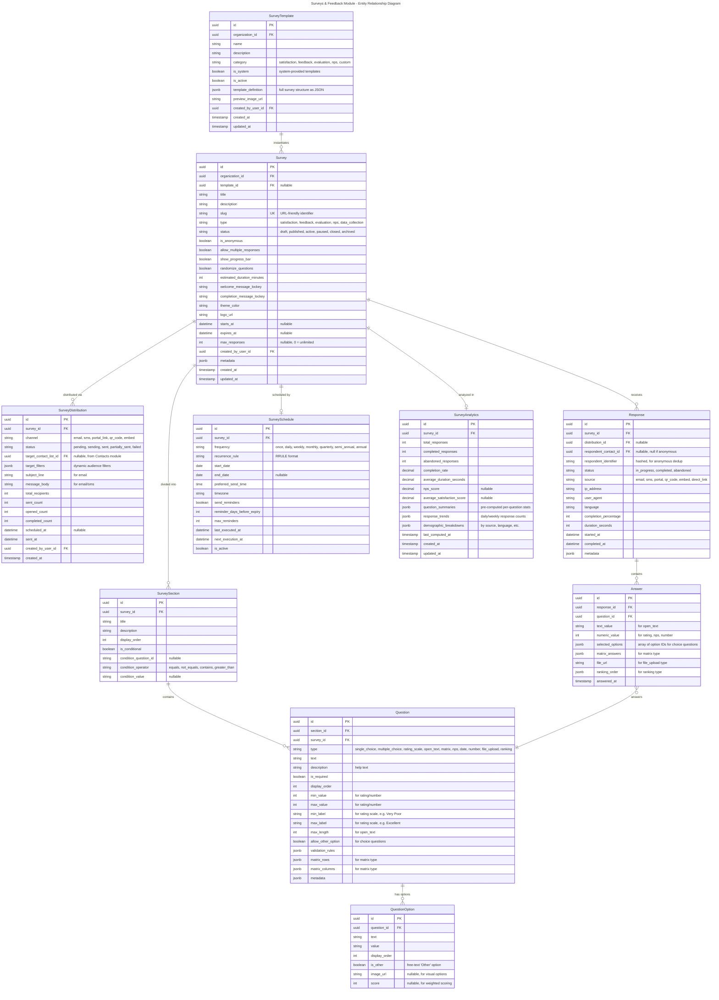
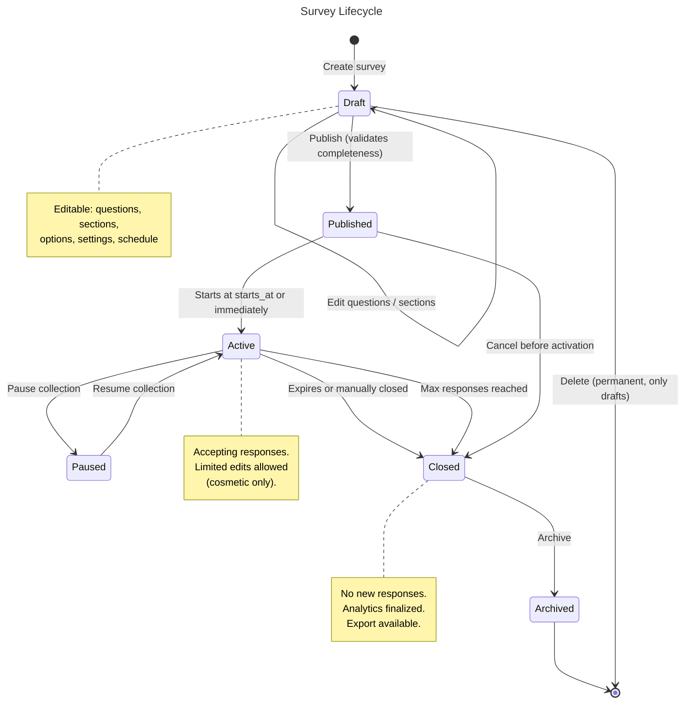
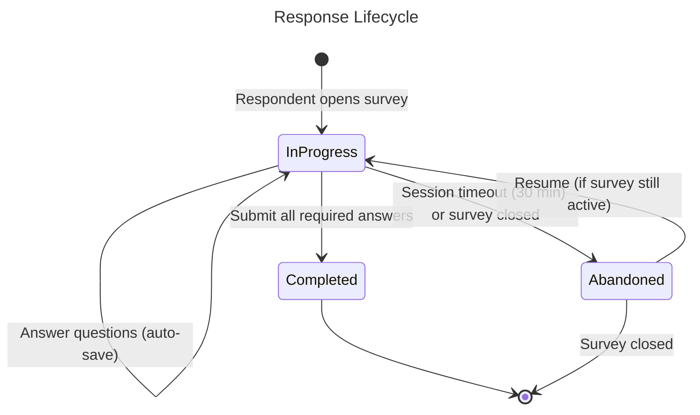
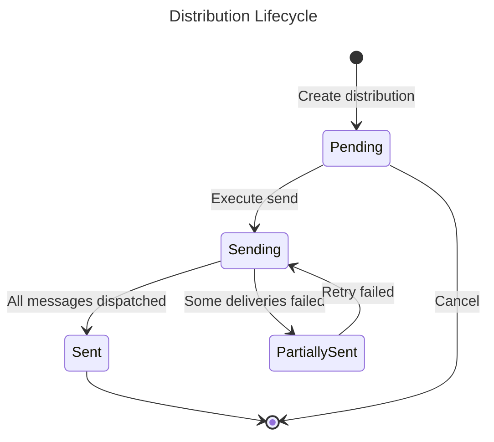
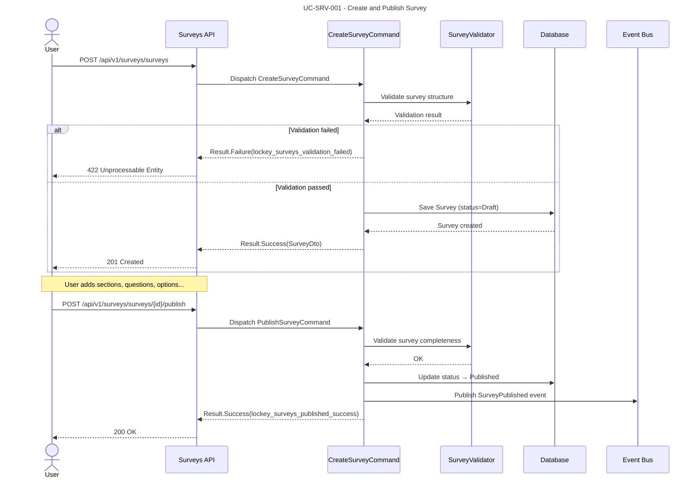
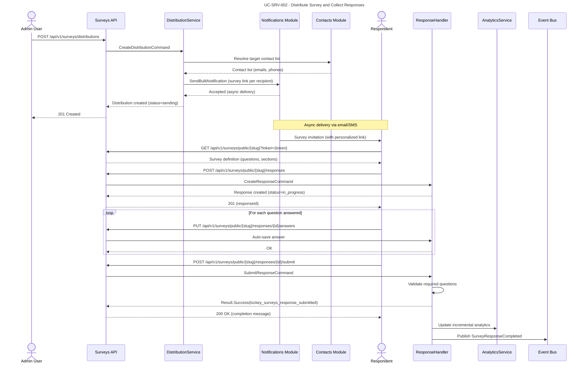
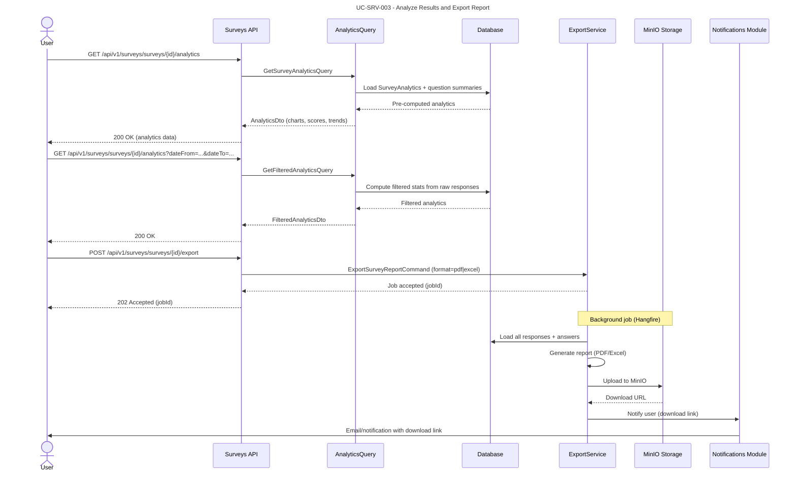
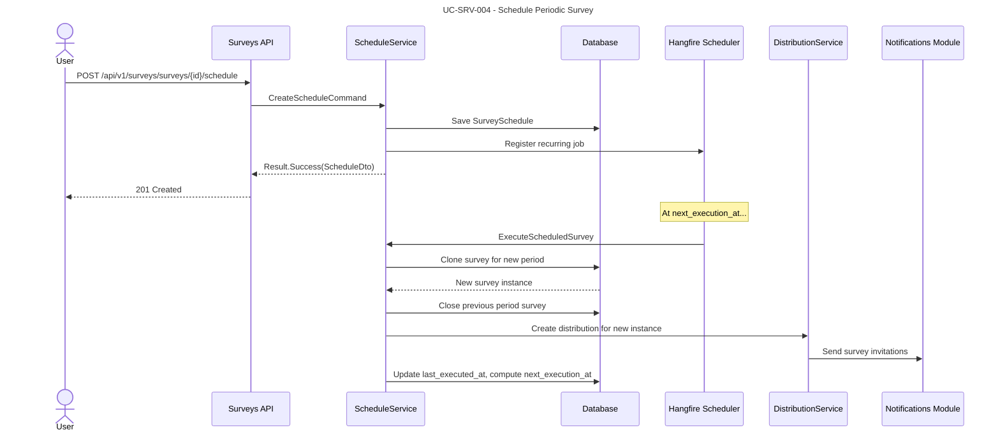

# Module: Surveys & Feedback

## Overview
The Surveys & Feedback module provides a full-lifecycle **survey management system** for creating, distributing, collecting, analyzing, and reporting on surveys and feedback forms. It supports satisfaction surveys (parent, student, staff), evaluation questionnaires, NPS tracking, and general-purpose data collection. Surveys can be anonymous or identified, scheduled for periodic distribution, and analyzed through built-in graphical reporting with export capabilities.

### Module Metadata

| Property | Value |
|----------|-------|
| Module ID | `surveys` |
| Table Prefix | `surveys_` |
| Version | 1.0.0 |
| Dependencies | `identity`, `contacts`, `notifications` |
| Permissions Prefix | `surveys.{resource}.{action}` |

### Dependencies

| Module | Relationship | Purpose |
|--------|-------------|---------|
| **Identity** | Required | User authentication, RBAC, tenant/organization context |
| **Contacts** | Required | Respondent resolution for identified surveys, distribution target lists |
| **Notifications** | Required | Survey distribution via email, SMS, push; reminders and completion alerts |

---

## Domain Model

### Entities

### Value Objects

| Value Object | Description |
|-------------|-------------|
| `SurveyId` | Strongly-typed survey identifier |
| `SurveySectionId` | Strongly-typed section identifier |
| `QuestionId` | Strongly-typed question identifier |
| `QuestionOptionId` | Strongly-typed option identifier |
| `ResponseId` | Strongly-typed response identifier |
| `AnswerId` | Strongly-typed answer identifier |
| `DistributionId` | Strongly-typed distribution identifier |
| `TemplateId` | Strongly-typed template identifier |
| `ScheduleId` | Strongly-typed schedule identifier |
| `AnalyticsId` | Strongly-typed analytics identifier |
| `SurveySlug` | URL-safe survey slug with validation |
| `QuestionType` | Enumeration of supported question types |
| `SurveyStatus` | Enumeration of survey lifecycle states |
| `DistributionChannel` | Enumeration of distribution channels |
| `NpsScore` | NPS value (0-10) with category (Promoter/Passive/Detractor) |
| `RatingValue` | Bounded numeric rating with min/max validation |
| `CompletionPercentage` | 0-100 bounded percentage |

---

## Entity Lifecycles

### Survey Lifecycle

### Response Lifecycle

### Distribution Lifecycle

---

## Use Cases

### UC-SRV-001: Create and Publish a Survey

- **Actor**: User with `surveys.surveys.create` permission
- **Preconditions**: User is in an active organization context
- **Flow**:
  1. User selects "Create Survey" (from blank or from template)
  2. If from template: system loads `SurveyTemplate.template_definition` and hydrates survey structure
  3. User defines survey metadata: title, description, type, anonymous flag, start/end dates
  4. User adds sections and questions with options
  5. User configures settings: progress bar, randomization, estimated duration
  6. System validates completeness (at least one question, all required fields present)
  7. User publishes the survey
  8. System transitions status from `Draft` to `Published`
  9. System publishes `SurveyPublished` event
- **Business Rules**:
  - Survey must have at least one section with at least one question
  - NPS questions enforce 0-10 scale automatically
  - Matrix questions require at least one row and one column
  - Survey slug must be unique within the organization
  - Published surveys cannot have structural changes (new/removed questions); only cosmetic edits allowed

### UC-SRV-002: Distribute Survey and Collect Responses

- **Actor**: User with `surveys.distributions.create` permission
- **Preconditions**: Survey is in `Published` or `Active` status
- **Flow**:
  1. User selects distribution channel (email, SMS, portal link, QR code, embed)
  2. For email/SMS: user selects target audience (contact list or dynamic filters from Contacts module)
  3. User customizes message body with survey link placeholder
  4. System creates `SurveyDistribution` record
  5. System dispatches to Notifications module for delivery
  6. Respondent receives link and opens survey
  7. System creates `Response` with status `in_progress`
  8. Respondent answers questions (auto-saved per question)
  9. Respondent submits; system validates required questions, transitions to `completed`
  10. System publishes `SurveyResponseCompleted` event
  11. System incrementally updates `SurveyAnalytics`
- **Business Rules**:
  - Portal link and QR code generate a unique URL with the survey slug
  - Anonymous surveys hash IP + user-agent for deduplication (if `allow_multiple_responses` is false)
  - Identified surveys link `respondent_contact_id` via token in the distribution link
  - Auto-save does not require all fields; submit does
  - Expired surveys return `lockey_surveys_expired` and reject new responses

### UC-SRV-003: Analyze Results and Export Report

- **Actor**: User with `surveys.analytics.read` permission
- **Preconditions**: Survey has at least one completed response
- **Flow**:
  1. User navigates to survey analytics dashboard
  2. System loads pre-computed `SurveyAnalytics` and per-question summaries
  3. System renders graphical charts: bar charts for choice questions, gauges for NPS, histograms for ratings, word clouds for open text
  4. User applies filters: date range, distribution channel, respondent demographics
  5. System re-computes filtered analytics on-the-fly
  6. User requests export (PDF or Excel)
  7. System generates report via background job
  8. System publishes `SurveyReportGenerated` event
  9. Notifications module delivers download link to user
- **Business Rules**:
  - Analytics are pre-computed every 15 minutes and on-demand for filters
  - NPS score = % Promoters (9-10) minus % Detractors (0-6)
  - Open text responses are included verbatim in exports (not summarized)
  - PDF reports include all charts rendered server-side
  - Excel exports include raw response data and summary sheets
  - Anonymous survey exports never include PII, even for admins

### UC-SRV-004: Schedule Periodic Survey

- **Actor**: User with `surveys.schedules.manage` permission
- **Preconditions**: Survey is in `Published` status
- **Flow**:
  1. User configures schedule: frequency, start/end date, preferred send time, timezone
  2. User enables reminders: days before expiry, max reminder count
  3. User selects target audience (reusable contact filters)
  4. System creates `SurveySchedule` record
  5. System scheduler (Hangfire recurring job) triggers at `next_execution_at`
  6. On trigger: system clones the survey (new period), creates distribution, sends invitations
  7. System updates `last_executed_at` and computes `next_execution_at`
- **Business Rules**:
  - Each schedule execution creates a new survey instance with a period suffix (e.g., "Parent Satisfaction Q1 2026")
  - Previous period survey is auto-closed when new period begins
  - Reminders are sent via Notifications module at configured intervals
  - Schedule respects the organization's timezone for send times
  - End date is optional; schedule runs indefinitely until manually deactivated

---

## API Endpoints

### Surveys

| Method | Path | Description | Permission |
|--------|------|-------------|------------|
| POST | `/api/v1/surveys/surveys` | Create new survey | `surveys.surveys.create` |
| GET | `/api/v1/surveys/surveys` | List surveys (paginated, filterable) | `surveys.surveys.read` |
| GET | `/api/v1/surveys/surveys/{id}` | Get survey with sections & questions | `surveys.surveys.read` |
| PUT | `/api/v1/surveys/surveys/{id}` | Update survey metadata | `surveys.surveys.update` |
| DELETE | `/api/v1/surveys/surveys/{id}` | Delete draft survey | `surveys.surveys.delete` |
| POST | `/api/v1/surveys/surveys/{id}/publish` | Publish survey | `surveys.surveys.publish` |
| POST | `/api/v1/surveys/surveys/{id}/activate` | Activate published survey | `surveys.surveys.publish` |
| POST | `/api/v1/surveys/surveys/{id}/pause` | Pause active survey | `surveys.surveys.publish` |
| POST | `/api/v1/surveys/surveys/{id}/resume` | Resume paused survey | `surveys.surveys.publish` |
| POST | `/api/v1/surveys/surveys/{id}/close` | Close survey | `surveys.surveys.publish` |
| POST | `/api/v1/surveys/surveys/{id}/archive` | Archive closed survey | `surveys.surveys.delete` |
| POST | `/api/v1/surveys/surveys/{id}/duplicate` | Clone survey as new draft | `surveys.surveys.create` |

### Sections

| Method | Path | Description | Permission |
|--------|------|-------------|------------|
| POST | `/api/v1/surveys/surveys/{surveyId}/sections` | Add section | `surveys.surveys.update` |
| GET | `/api/v1/surveys/surveys/{surveyId}/sections` | List sections | `surveys.surveys.read` |
| PUT | `/api/v1/surveys/surveys/{surveyId}/sections/{id}` | Update section | `surveys.surveys.update` |
| DELETE | `/api/v1/surveys/surveys/{surveyId}/sections/{id}` | Remove section | `surveys.surveys.update` |
| PUT | `/api/v1/surveys/surveys/{surveyId}/sections/reorder` | Reorder sections | `surveys.surveys.update` |

### Questions

| Method | Path | Description | Permission |
|--------|------|-------------|------------|
| POST | `/api/v1/surveys/sections/{sectionId}/questions` | Add question | `surveys.surveys.update` |
| GET | `/api/v1/surveys/sections/{sectionId}/questions` | List questions in section | `surveys.surveys.read` |
| PUT | `/api/v1/surveys/questions/{id}` | Update question | `surveys.surveys.update` |
| DELETE | `/api/v1/surveys/questions/{id}` | Remove question | `surveys.surveys.update` |
| PUT | `/api/v1/surveys/sections/{sectionId}/questions/reorder` | Reorder questions | `surveys.surveys.update` |

### Question Options

| Method | Path | Description | Permission |
|--------|------|-------------|------------|
| POST | `/api/v1/surveys/questions/{questionId}/options` | Add option | `surveys.surveys.update` |
| PUT | `/api/v1/surveys/questions/{questionId}/options/{id}` | Update option | `surveys.surveys.update` |
| DELETE | `/api/v1/surveys/questions/{questionId}/options/{id}` | Remove option | `surveys.surveys.update` |
| PUT | `/api/v1/surveys/questions/{questionId}/options/reorder` | Reorder options | `surveys.surveys.update` |

### Distributions

| Method | Path | Description | Permission |
|--------|------|-------------|------------|
| POST | `/api/v1/surveys/distributions` | Create distribution | `surveys.distributions.create` |
| GET | `/api/v1/surveys/surveys/{surveyId}/distributions` | List distributions for survey | `surveys.distributions.read` |
| GET | `/api/v1/surveys/distributions/{id}` | Get distribution details | `surveys.distributions.read` |
| POST | `/api/v1/surveys/distributions/{id}/retry` | Retry failed deliveries | `surveys.distributions.create` |
| DELETE | `/api/v1/surveys/distributions/{id}` | Cancel pending distribution | `surveys.distributions.delete` |

### Public Respondent Endpoints (No Auth Required)

| Method | Path | Description | Notes |
|--------|------|-------------|-------|
| GET | `/api/v1/surveys/public/{slug}` | Get survey for respondent | Token-validated or open |
| POST | `/api/v1/surveys/public/{slug}/responses` | Start a response | Creates in_progress response |
| PUT | `/api/v1/surveys/public/{slug}/responses/{id}/answers` | Save answers (auto-save) | Partial save allowed |
| POST | `/api/v1/surveys/public/{slug}/responses/{id}/submit` | Submit completed response | Validates required fields |
| GET | `/api/v1/surveys/public/{slug}/responses/{id}` | Resume in-progress response | Token-validated |

### Responses (Admin)

| Method | Path | Description | Permission |
|--------|------|-------------|------------|
| GET | `/api/v1/surveys/surveys/{surveyId}/responses` | List responses (paginated) | `surveys.responses.read` |
| GET | `/api/v1/surveys/responses/{id}` | Get single response with answers | `surveys.responses.read` |
| DELETE | `/api/v1/surveys/responses/{id}` | Delete response (GDPR) | `surveys.responses.delete` |
| GET | `/api/v1/surveys/surveys/{surveyId}/responses/export` | Export raw responses (CSV) | `surveys.responses.export` |

### Templates

| Method | Path | Description | Permission |
|--------|------|-------------|------------|
| POST | `/api/v1/surveys/templates` | Create template from survey | `surveys.templates.create` |
| GET | `/api/v1/surveys/templates` | List templates | `surveys.templates.read` |
| GET | `/api/v1/surveys/templates/{id}` | Get template details | `surveys.templates.read` |
| PUT | `/api/v1/surveys/templates/{id}` | Update template | `surveys.templates.update` |
| DELETE | `/api/v1/surveys/templates/{id}` | Delete template | `surveys.templates.delete` |
| POST | `/api/v1/surveys/templates/{id}/instantiate` | Create survey from template | `surveys.surveys.create` |

### Schedules

| Method | Path | Description | Permission |
|--------|------|-------------|------------|
| POST | `/api/v1/surveys/surveys/{surveyId}/schedule` | Create schedule | `surveys.schedules.manage` |
| GET | `/api/v1/surveys/surveys/{surveyId}/schedule` | Get schedule | `surveys.schedules.read` |
| PUT | `/api/v1/surveys/schedules/{id}` | Update schedule | `surveys.schedules.manage` |
| DELETE | `/api/v1/surveys/schedules/{id}` | Delete schedule | `surveys.schedules.manage` |
| POST | `/api/v1/surveys/schedules/{id}/activate` | Activate schedule | `surveys.schedules.manage` |
| POST | `/api/v1/surveys/schedules/{id}/deactivate` | Deactivate schedule | `surveys.schedules.manage` |

### Analytics & Reporting

| Method | Path | Description | Permission |
|--------|------|-------------|------------|
| GET | `/api/v1/surveys/surveys/{surveyId}/analytics` | Get survey analytics | `surveys.analytics.read` |
| GET | `/api/v1/surveys/surveys/{surveyId}/analytics/questions/{questionId}` | Get per-question analytics | `surveys.analytics.read` |
| GET | `/api/v1/surveys/surveys/{surveyId}/analytics/trends` | Get response trends over time | `surveys.analytics.read` |
| GET | `/api/v1/surveys/surveys/{surveyId}/analytics/nps` | Get NPS breakdown | `surveys.analytics.read` |
| POST | `/api/v1/surveys/surveys/{surveyId}/analytics/recompute` | Force analytics recomputation | `surveys.analytics.manage` |
| POST | `/api/v1/surveys/surveys/{surveyId}/export` | Export report (PDF/Excel) | `surveys.analytics.export` |
| GET | `/api/v1/surveys/exports/{jobId}` | Check export job status | `surveys.analytics.export` |
| GET | `/api/v1/surveys/exports/{jobId}/download` | Download exported report | `surveys.analytics.export` |

---

## Integration Events

### Events Published

| Event | Topic | Payload | Trigger |
|-------|-------|---------|---------|
| `surveys.survey.published` | `nexora.surveys` | `{ surveyId, organizationId, title, type, startsAt, expiresAt }` | Survey transitions to Published |
| `surveys.survey.activated` | `nexora.surveys` | `{ surveyId, organizationId }` | Survey transitions to Active |
| `surveys.survey.closed` | `nexora.surveys` | `{ surveyId, organizationId, totalResponses, completionRate }` | Survey transitions to Closed |
| `surveys.response.completed` | `nexora.surveys.responses` | `{ responseId, surveyId, respondentContactId, completedAt, npsScore? }` | Respondent submits a response |
| `surveys.response.abandoned` | `nexora.surveys.responses` | `{ responseId, surveyId, completionPercentage }` | Response times out |
| `surveys.distribution.completed` | `nexora.surveys.distributions` | `{ distributionId, surveyId, channel, sentCount, failedCount }` | Distribution finishes sending |
| `surveys.report.generated` | `nexora.surveys.reports` | `{ surveyId, exportJobId, format, downloadUrl, requestedByUserId }` | Export report is ready |
| `surveys.schedule.executed` | `nexora.surveys.schedules` | `{ scheduleId, surveyId, newSurveyId, period }` | Scheduled survey execution fires |
| `surveys.nps.alert` | `nexora.surveys.alerts` | `{ surveyId, organizationId, npsScore, previousScore, trend }` | NPS drops below configurable threshold |

### Events Consumed

| Event | Source Module | Action |
|-------|-------------|--------|
| `identity.user.deactivated` | Identity | Cancel any pending distributions created by user; reassign ownership |
| `identity.organization.settings.updated` | Identity | Update timezone for active schedules |
| `contacts.contact.merged` | Contacts | Update `respondent_contact_id` references (old contact -> merged target) |
| `contacts.contact.archived` | Contacts | Mark related identified responses for anonymization review |
| `contacts.consent.changed` | Contacts | If survey-related consent revoked, exclude contact from future distributions |
| `notifications.delivery.status` | Notifications | Update `SurveyDistribution` sent/failed counts based on delivery receipts |

---

## Domain Events (Internal)

| Event | Trigger | Consumers (within module) |
|-------|---------|--------------------------|
| `SurveyCreated` | New survey saved | Audit log |
| `SurveyPublished` | Status -> Published | Distribution eligibility check, Integration event publisher |
| `SurveyClosed` | Status -> Closed | Analytics finalization, Schedule (close previous period) |
| `QuestionAdded` | Question added to survey | Estimated duration recalculation |
| `QuestionRemoved` | Question removed | Estimated duration recalculation |
| `ResponseStarted` | New response created | Real-time response counter |
| `ResponseCompleted` | Response submitted | Incremental analytics update, Integration event publisher |
| `ResponseAbandoned` | Session timeout | Analytics update |
| `DistributionSent` | All messages dispatched | Distribution status update |
| `ScheduleTriggered` | Cron job fires | Survey cloning, distribution creation |

---

## Permissions

| Permission | Description |
|-----------|-------------|
| `surveys.surveys.create` | Create new surveys |
| `surveys.surveys.read` | View surveys and their structure |
| `surveys.surveys.update` | Edit survey content and settings |
| `surveys.surveys.delete` | Delete draft surveys, archive closed surveys |
| `surveys.surveys.publish` | Publish, activate, pause, resume, close surveys |
| `surveys.distributions.create` | Create and send distributions |
| `surveys.distributions.read` | View distribution status and metrics |
| `surveys.distributions.delete` | Cancel pending distributions |
| `surveys.responses.read` | View individual responses |
| `surveys.responses.delete` | Delete responses (GDPR compliance) |
| `surveys.responses.export` | Export raw response data |
| `surveys.templates.create` | Create survey templates |
| `surveys.templates.read` | View available templates |
| `surveys.templates.update` | Edit templates |
| `surveys.templates.delete` | Delete templates |
| `surveys.schedules.read` | View schedules |
| `surveys.schedules.manage` | Create, update, activate, deactivate schedules |
| `surveys.analytics.read` | View analytics dashboards |
| `surveys.analytics.manage` | Force recomputation of analytics |
| `surveys.analytics.export` | Export reports (PDF, Excel) |

---

## Database Tables

All tables reside in the tenant schema with the `surveys_` prefix:

| Table | Description |
|-------|-------------|
| `surveys_surveys` | Core survey definitions |
| `surveys_survey_sections` | Survey sections for grouping questions |
| `surveys_questions` | Question definitions |
| `surveys_question_options` | Answer options for choice-type questions |
| `surveys_survey_distributions` | Distribution records per channel |
| `surveys_responses` | Respondent response sessions |
| `surveys_answers` | Individual question answers within a response |
| `surveys_survey_templates` | Reusable survey templates |
| `surveys_survey_schedules` | Periodic scheduling configuration |
| `surveys_survey_analytics` | Pre-computed analytics snapshots |

### Key Indexes

| Table | Index | Purpose |
|-------|-------|---------|
| `surveys_surveys` | `ix_surveys_org_status` on `(organization_id, status)` | List surveys by org and status |
| `surveys_surveys` | `ux_surveys_org_slug` on `(organization_id, slug)` UNIQUE | Slug uniqueness per org |
| `surveys_questions` | `ix_questions_section_order` on `(section_id, display_order)` | Ordered question retrieval |
| `surveys_responses` | `ix_responses_survey_status` on `(survey_id, status)` | Response counting and filtering |
| `surveys_responses` | `ix_responses_respondent` on `(respondent_contact_id)` | Lookup by respondent |
| `surveys_responses` | `ix_responses_completed_at` on `(survey_id, completed_at)` | Time-based analytics queries |
| `surveys_answers` | `ix_answers_response` on `(response_id)` | Load all answers for a response |
| `surveys_answers` | `ix_answers_question` on `(question_id)` | Per-question aggregation |
| `surveys_survey_distributions` | `ix_distributions_survey` on `(survey_id, status)` | Distribution listing |
| `surveys_survey_schedules` | `ix_schedules_next_exec` on `(is_active, next_execution_at)` | Scheduler polling |

---

## Non-Functional Requirements

| Requirement | Target | Notes |
|------------|--------|-------|
| Survey load time (public) | < 300ms | Survey definition cached in Redis after first load |
| Response submission latency | < 500ms | Synchronous validation + async analytics |
| Auto-save latency | < 200ms | Fire-and-forget with idempotency |
| Analytics dashboard load | < 1s | Pre-computed, served from `surveys_survey_analytics` |
| Filtered analytics computation | < 3s | On-the-fly aggregation with query optimization |
| Distribution throughput | 10,000 emails/minute | Batched via Notifications module |
| Concurrent respondents per survey | 5,000+ | Stateless response handling, no session locks |
| Max questions per survey | 500 | Validated at creation time |
| Max responses per survey | 1,000,000 | Partitioned by `completed_at` for large datasets |
| Report generation (PDF) | < 30s for 10,000 responses | Background job, server-side chart rendering |
| Report generation (Excel) | < 60s for 100,000 responses | Streaming write, no full in-memory load |
| Data retention | Configurable per tenant | Default: 5 years, then anonymize |
| Availability | 99.9% uptime | Public survey endpoints are critical path |
| KVKK/GDPR compliance | Full | Anonymous survey data is non-identifiable by design; identified responses support deletion/anonymization |
| Multi-language surveys | Supported | Question text stored per locale in `jsonb metadata` |
| Accessibility | WCAG 2.1 AA | Public survey forms must be screen-reader compatible |
| Rate limiting (public endpoints) | 60 requests/min per IP | Prevents abuse on unauthenticated endpoints |
| File upload (file_upload questions) | Max 10MB per file, 50MB per response | Stored in MinIO, virus-scanned |

---

## CQRS Command & Query Catalog

### Commands

| Command | Handler | Description |
|---------|---------|-------------|
| `CreateSurveyCommand` | `CreateSurveyCommandHandler` | Creates a new survey in Draft status |
| `UpdateSurveyCommand` | `UpdateSurveyCommandHandler` | Updates survey metadata |
| `PublishSurveyCommand` | `PublishSurveyCommandHandler` | Validates and transitions to Published |
| `ActivateSurveyCommand` | `ActivateSurveyCommandHandler` | Transitions Published -> Active |
| `PauseSurveyCommand` | `PauseSurveyCommandHandler` | Transitions Active -> Paused |
| `ResumeSurveyCommand` | `ResumeSurveyCommandHandler` | Transitions Paused -> Active |
| `CloseSurveyCommand` | `CloseSurveyCommandHandler` | Transitions Active/Published -> Closed |
| `ArchiveSurveyCommand` | `ArchiveSurveyCommandHandler` | Transitions Closed -> Archived |
| `DuplicateSurveyCommand` | `DuplicateSurveyCommandHandler` | Deep-clones a survey as new Draft |
| `DeleteSurveyCommand` | `DeleteSurveyCommandHandler` | Permanently deletes a Draft survey |
| `AddSectionCommand` | `AddSectionCommandHandler` | Adds a section to a survey |
| `UpdateSectionCommand` | `UpdateSectionCommandHandler` | Updates section metadata |
| `ReorderSectionsCommand` | `ReorderSectionsCommandHandler` | Updates display_order for sections |
| `RemoveSectionCommand` | `RemoveSectionCommandHandler` | Removes a section and its questions |
| `AddQuestionCommand` | `AddQuestionCommandHandler` | Adds a question to a section |
| `UpdateQuestionCommand` | `UpdateQuestionCommandHandler` | Updates question properties |
| `ReorderQuestionsCommand` | `ReorderQuestionsCommandHandler` | Updates display_order for questions |
| `RemoveQuestionCommand` | `RemoveQuestionCommandHandler` | Removes a question and its options |
| `AddQuestionOptionCommand` | `AddQuestionOptionCommandHandler` | Adds an option to a choice question |
| `UpdateQuestionOptionCommand` | `UpdateQuestionOptionCommandHandler` | Updates an option |
| `RemoveQuestionOptionCommand` | `RemoveQuestionOptionCommandHandler` | Removes an option |
| `ReorderOptionsCommand` | `ReorderOptionsCommandHandler` | Updates display_order for options |
| `CreateDistributionCommand` | `CreateDistributionCommandHandler` | Creates and initiates a distribution |
| `RetryDistributionCommand` | `RetryDistributionCommandHandler` | Retries failed deliveries |
| `CancelDistributionCommand` | `CancelDistributionCommandHandler` | Cancels a pending distribution |
| `CreateResponseCommand` | `CreateResponseCommandHandler` | Starts a new response session |
| `SaveAnswersCommand` | `SaveAnswersCommandHandler` | Auto-saves answers (partial) |
| `SubmitResponseCommand` | `SubmitResponseCommandHandler` | Validates and finalizes a response |
| `DeleteResponseCommand` | `DeleteResponseCommandHandler` | GDPR: deletes a response |
| `CreateTemplateCommand` | `CreateTemplateCommandHandler` | Creates a template from a survey |
| `UpdateTemplateCommand` | `UpdateTemplateCommandHandler` | Updates template metadata |
| `DeleteTemplateCommand` | `DeleteTemplateCommandHandler` | Deletes a template |
| `InstantiateTemplateCommand` | `InstantiateTemplateCommandHandler` | Creates a survey from a template |
| `CreateScheduleCommand` | `CreateScheduleCommandHandler` | Sets up periodic scheduling |
| `UpdateScheduleCommand` | `UpdateScheduleCommandHandler` | Updates schedule configuration |
| `ActivateScheduleCommand` | `ActivateScheduleCommandHandler` | Activates a schedule |
| `DeactivateScheduleCommand` | `DeactivateScheduleCommandHandler` | Deactivates a schedule |
| `DeleteScheduleCommand` | `DeleteScheduleCommandHandler` | Removes a schedule |
| `ExecuteScheduledSurveyCommand` | `ExecuteScheduledSurveyCommandHandler` | Triggered by scheduler; clones and distributes |
| `RecomputeAnalyticsCommand` | `RecomputeAnalyticsCommandHandler` | Forces full analytics recomputation |
| `ExportSurveyReportCommand` | `ExportSurveyReportCommandHandler` | Initiates PDF/Excel export job |

### Queries

| Query | Handler | Description |
|-------|---------|-------------|
| `GetSurveyByIdQuery` | `GetSurveyByIdQueryHandler` | Full survey with sections, questions, options |
| `ListSurveysQuery` | `ListSurveysQueryHandler` | Paginated survey list with filters (status, type, date range) |
| `GetSurveyBySlugQuery` | `GetSurveyBySlugQueryHandler` | Public survey retrieval by slug |
| `ListSectionsQuery` | `ListSectionsQueryHandler` | Sections for a survey |
| `ListQuestionsQuery` | `ListQuestionsQueryHandler` | Questions for a section |
| `ListResponsesQuery` | `ListResponsesQueryHandler` | Paginated responses for a survey |
| `GetResponseByIdQuery` | `GetResponseByIdQueryHandler` | Single response with all answers |
| `GetResponseForResumptionQuery` | `GetResponseForResumptionQueryHandler` | Load in-progress response for continuation |
| `ListDistributionsQuery` | `ListDistributionsQueryHandler` | Distributions for a survey |
| `GetDistributionByIdQuery` | `GetDistributionByIdQueryHandler` | Distribution details with delivery stats |
| `ListTemplatesQuery` | `ListTemplatesQueryHandler` | Available templates (system + organization) |
| `GetTemplateByIdQuery` | `GetTemplateByIdQueryHandler` | Template details with preview |
| `GetSurveyAnalyticsQuery` | `GetSurveyAnalyticsQueryHandler` | Pre-computed analytics for dashboard |
| `GetFilteredAnalyticsQuery` | `GetFilteredAnalyticsQueryHandler` | On-the-fly filtered analytics |
| `GetQuestionAnalyticsQuery` | `GetQuestionAnalyticsQueryHandler` | Per-question breakdown |
| `GetNpsBreakdownQuery` | `GetNpsBreakdownQueryHandler` | NPS analysis (promoters, passives, detractors) |
| `GetResponseTrendsQuery` | `GetResponseTrendsQueryHandler` | Response count trends over time |
| `GetScheduleQuery` | `GetScheduleQueryHandler` | Schedule details for a survey |
| `GetExportStatusQuery` | `GetExportStatusQueryHandler` | Export job status and download URL |
| `ExportRawResponsesQuery` | `ExportRawResponsesQueryHandler` | CSV stream of raw response data |

---

## Validation Rules

| Entity | Rule | Localization Key |
|--------|------|-----------------|
| Survey | Title is required, max 200 chars | `lockey_surveys_validation_title_required` |
| Survey | Slug must be URL-safe, max 100 chars | `lockey_surveys_validation_slug_invalid` |
| Survey | At least one section with one question to publish | `lockey_surveys_validation_min_questions` |
| Survey | `expires_at` must be after `starts_at` | `lockey_surveys_validation_date_range_invalid` |
| Question | Text is required, max 1000 chars | `lockey_surveys_validation_question_text_required` |
| Question | Choice questions must have at least 2 options | `lockey_surveys_validation_min_options` |
| Question | NPS type enforces min=0, max=10 | `lockey_surveys_validation_nps_scale` |
| Question | Matrix must have at least 1 row and 1 column | `lockey_surveys_validation_matrix_incomplete` |
| Question | Rating scale min must be less than max | `lockey_surveys_validation_rating_range` |
| QuestionOption | Text is required, max 500 chars | `lockey_surveys_validation_option_text_required` |
| Response | All required questions must be answered to submit | `lockey_surveys_validation_required_unanswered` |
| Response | Survey must be Active to accept responses | `lockey_surveys_validation_survey_not_active` |
| Response | Multiple responses not allowed (when disabled) | `lockey_surveys_validation_already_responded` |
| Distribution | Channel is required | `lockey_surveys_validation_channel_required` |
| Distribution | Email distribution requires subject and body | `lockey_surveys_validation_email_fields_required` |
| Distribution | Target audience required for email/SMS | `lockey_surveys_validation_audience_required` |
| Schedule | Frequency is required | `lockey_surveys_validation_frequency_required` |
| Schedule | Start date cannot be in the past | `lockey_surveys_validation_start_date_past` |
| Template | Name is required, max 200 chars | `lockey_surveys_validation_template_name_required` |

---

## Error Codes

| Code | Localization Key | HTTP Status | Description |
|------|-----------------|-------------|-------------|
| `SURVEY_NOT_FOUND` | `lockey_surveys_error_not_found` | 404 | Survey does not exist or not accessible |
| `SURVEY_NOT_DRAFT` | `lockey_surveys_error_not_draft` | 409 | Operation requires Draft status |
| `SURVEY_NOT_ACTIVE` | `lockey_surveys_error_not_active` | 409 | Survey is not accepting responses |
| `SURVEY_EXPIRED` | `lockey_surveys_error_expired` | 410 | Survey has expired |
| `SURVEY_MAX_RESPONSES` | `lockey_surveys_error_max_responses` | 409 | Maximum response count reached |
| `SURVEY_STRUCTURAL_EDIT` | `lockey_surveys_error_structural_edit` | 409 | Cannot modify structure of published/active survey |
| `RESPONSE_ALREADY_SUBMITTED` | `lockey_surveys_error_already_submitted` | 409 | Response already submitted |
| `RESPONSE_DUPLICATE` | `lockey_surveys_error_duplicate_response` | 409 | Respondent already completed this survey |
| `DISTRIBUTION_NO_RECIPIENTS` | `lockey_surveys_error_no_recipients` | 422 | Target audience resolved to zero contacts |
| `TEMPLATE_NOT_FOUND` | `lockey_surveys_error_template_not_found` | 404 | Template does not exist |
| `SCHEDULE_CONFLICT` | `lockey_surveys_error_schedule_conflict` | 409 | Survey already has an active schedule |
| `EXPORT_IN_PROGRESS` | `lockey_surveys_error_export_in_progress` | 409 | An export is already running for this survey |
| `INVALID_QUESTION_TYPE` | `lockey_surveys_error_invalid_question_type` | 422 | Unsupported question type |
| `FILE_TOO_LARGE` | `lockey_surveys_error_file_too_large` | 413 | Uploaded file exceeds size limit |

---

## Security Considerations

- **Public endpoints** (`/api/v1/surveys/public/*`) do not require authentication but are rate-limited (60 req/min per IP) and protected against CSRF
- **Anonymous surveys** never store `respondent_contact_id`; deduplication uses hashed `IP + user-agent + survey_id` salted per tenant
- **Identified survey tokens** are signed JWTs with `respondent_contact_id` and `survey_id` claims; single-use for submission
- **Response data encryption**: PII fields in identified responses are encrypted at rest using tenant-specific keys (HashiCorp Vault)
- **KVKK/GDPR**: responses can be individually deleted; anonymous data is non-identifiable by design
- **XSS prevention**: all open-text answers are sanitized on storage and escaped on rendering
- **SQL injection**: all queries go through EF Core parameterized queries; no raw SQL in analytics
- **Input validation**: all payloads validated via FluentValidation before reaching domain logic
