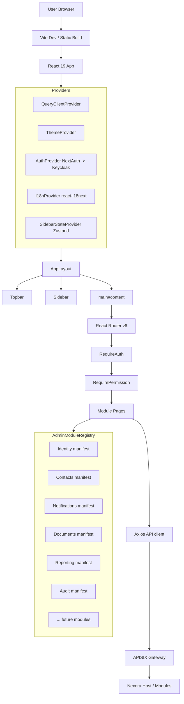
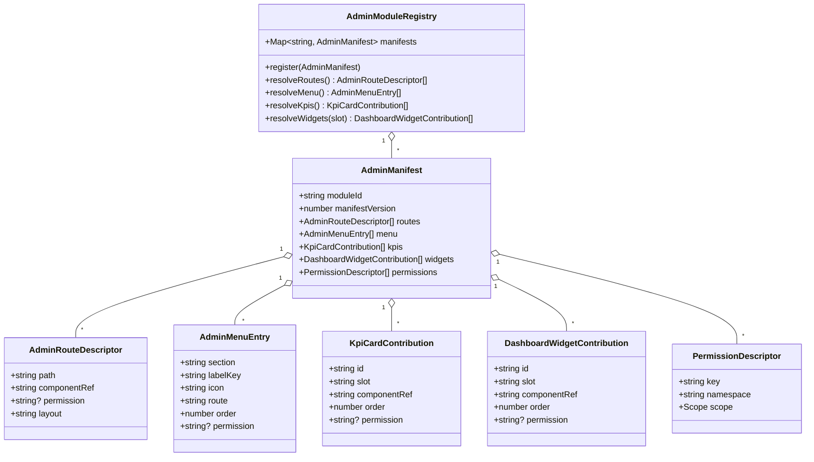
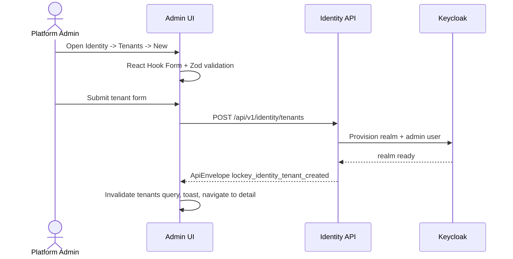

# Admin Dashboard

**Tier:** 1 — Platform Core

**Status:** In Review — shipped in Phase 1, documented 2026-04-22

## Scope

The Admin Dashboard (`nexora-admin`) is the tenant-facing web UI for platform
administrators. It ships in Phase 1 as a React 19 + Vite application styled with
Tailwind 4 + shadcn/ui. It is the single host shell that aggregates every
installed module's admin contributions (routes, menu entries, KPI cards,
widgets) via the runtime manifest contract defined in
[ADR-0017](../../../decisions/0017-portal-extension-architecture.md). It is the
sibling of the Portal Framework: they share a contribution contract but differ
in audience, layout, and rendering strategy.

Covered:

- Tenant-admin web UI: React 19 + Vite + Tailwind 4 + shadcn/ui.
- State: TanStack Query v5 (server) + Zustand (auth, theme, sidebar).
- Forms: React Hook Form + Zod validation.
- i18n: `react-i18next`, per-module namespaces under `locales/{en,tr}/`.
- NextAuth → Keycloak session bridge; silent refresh; APISIX-fronted API.
- Permission-gated routes, menus, actions; meta-permissions owned here.
- Module-contributed admin UI via manifest (layout=admin); lazy chunks.
- Mandatory tab-based detail pages per
  [ADR-0007](../../../decisions/0007-tab-based-layout.md).
- Shared component inventory: `DataTable`, `SearchInput`, `EmptyState`,
  `LoadingSkeleton`, `TabContentSkeleton`, `ConfirmDialog`, `FormField`.
- `useUnsavedChangesGuard` on every edit form.
- Accessibility: ARIA roles on tabs, skip-to-content link, visible focus rings,
  WCAG 2.1 AA contrast.
- Responsive layout: mobile-first grid, collapsible sidebar.

## Out of scope

- Tenant public portal (`nexora-portal`, Next.js 16) — sibling: Portal
  Framework.
- Platform operator UI (Nexora Management Portal / NMP) — separate tier-1 module.
- Backend REST/gRPC endpoints — each functional module owns its own API.
- Mobile applications — Phase 3+.

## Dependencies

- Identity module (session, tenants, users, roles, permissions, installed
  modules endpoint).
- Portal Framework manifest contract (ADR-0017) — same schema, `layout=admin`.
- Notifications, Contacts, Documents, Reporting, Audit (Phase 1 consumers).
- APISIX gateway for all backend calls.

## Architecture overview



## Shipped module surfaces (Phase 1)

| Module | Key surfaces |
|--------|--------------|
| Identity | Tenants, Users, Roles & Permissions, Organizations, Modules Install |
| Contacts | Contacts list & detail (tabs: Overview / Activities / Addresses / Notes / Custom Fields), Tags, Duplicates, Import/Export, Consent, GDPR tooling |
| Notifications | Templates + translations, Providers, Schedule, Test send |
| Documents | Folders, Documents (tabs: Overview / Versions / Access / Signatures), Signature requests, Templates |
| Reporting | Query editor, Saved reports, Dashboards |
| Audit | Audit log viewer with date-range / user / action / resource filters |

All future Tier-2+ modules (CRM, Subscription, Donations, etc.) surface in the
admin the same way: through a `layout: admin` manifest section loaded at boot.

## UX/UI standards alignment

This module is the primary consumer of
[`docs/standards/ux-ui.md`](../../../standards/ux-ui.md). Mandatory rules:

- **Custom underline tab layout** on every detail page — native `<button>`
  elements with `border-b-2 border-primary` for the active tab. Not shadcn
  `Tabs`, not Radix. Reference: `ContactDetailPage`, `DocumentDetailPage`.
- **Max 5 tabs** per detail page. Small sections (Tags, Custom Fields)
  consolidate into Overview.
- **Tab state via `useState`** only — never URL params. Tab switch resets
  scroll position.
- **`TabContentSkeleton`** while a tab's data loads; `LoadingSkeleton` on
  page-level waits.
- **`EmptyState`** component for empty lists — never inline placeholder text.
- **`useUnsavedChangesGuard(isDirty)`** on every edit form; triggers
  `ConfirmDialog` on navigation.
- **`SearchInput`** on every list page; filters use **shadcn `Select`** (never
  native `<select>`); URL-bound search / filter / pagination.
- **Responsive grid**: `grid-cols-1 sm:grid-cols-2` (never bare
  `grid-cols-2`).
- **FormField** wrapper for all fields (label + `*` + hint + error).
- **Status badges** follow the platform palette: green=active, gray=inactive,
  red=error, yellow=pending.
- Skip-to-content link, ARIA roles on tablist, visible focus rings.

## Module manifest consumption

Admin reuses the Portal Framework contract (ADR-0017) unchanged. At boot it
calls:

```
GET /api/v1/portal/manifests?layout=admin
```

The backend assembles the tenant's install-set, drops routes/menu/widgets the
user lacks permission for, and applies the license gate. The host merges the
response into the in-memory `AdminModuleRegistry` and lazy-loads the
corresponding ESM chunks on first route/widget activation.

Admin-specific manifest slots:

| Slot | Purpose |
|------|---------|
| `dashboard.kpi` | Top-strip KPI cards on the admin home. |
| `dashboard.widgets` | Body widgets (charts, tables) on the admin home. |
| `topbar.actions` | Icon-button actions in the global topbar. |
| `sidebar.extra` | Extra grouped entries beneath the core nav. |

Manifests targeting `layout: portal` are ignored by the admin host.

## Entity-relationship — in-memory registry



## Use cases

### UC-AD-001 — Platform admin creates a new tenant



### UC-AD-002 — Tenant admin installs the CRM module

1. Admin opens Identity → Modules Install, selects CRM.
2. `POST /api/v1/identity/modules/crm/install` runs server-side license and
   dependency checks.
3. On success the UI invalidates the installed-modules query and refetches
   `/api/v1/portal/manifests?layout=admin`.
4. `AdminModuleRegistry` re-merges; CRM routes, menu entries, KPIs, and
   widgets appear without a page reload.

### UC-AD-003 — Edit form guards unsaved changes

- User edits a contact, form `isDirty === true`.
- User clicks a sidebar link. `useUnsavedChangesGuard` intercepts via
  React Router blocker.
- `ConfirmDialog` prompts Leave / Stay. Leave discards, Stay cancels
  navigation.

### UC-AD-004 — Permission change propagates on next token refresh

- Admin removes `contacts.write` from a role.
- Affected user's access token refreshes via NextAuth silent refresh.
- `usePermissions()` re-reads claims; menu entries and action buttons gated
  by `contacts.write` disappear; in-flight mutations fail closed at the
  backend.

### UC-AD-005 — Audit log search with filters and CSV export

- Admin opens Audit, sets a date range, user, and action filter.
- URL params drive the query; DataTable paginates server-side.
- "Export CSV" streams results through the audit export endpoint and the
  browser saves the file. Export itself is logged as an audit event.

## Non-functional requirements

| Attribute | Target |
|-----------|--------|
| Initial shell bundle | <= 200 KB gzipped (excluding lazy module chunks) |
| p95 Time-to-Interactive | <= 2.5 s on a tenant-admin home page |
| Lighthouse accessibility | >= 90 |
| WCAG | 2.1 AA |
| Keyboard navigation | All interactive elements reachable and operable |
| Test baseline (2026-04-22) | **358 admin tests across 47 suites** (Vitest + RTL) |
| Linter | `npm run lint` must pass pre-commit |

## API endpoints consumed

The Admin Dashboard owns **no** endpoints. It consumes every backend module's
admin endpoints (Identity, Contacts, Notifications, Documents, Reporting,
Audit, and any installed Tier-2+ module).

The only implicit contract owned by the host shell is the manifest-assembly
endpoint:

```
GET /api/v1/portal/manifests?layout=admin
Response: ApiEnvelope<AdminManifest[]>
```

> **Note:** The manifest endpoint `GET /api/v1/portal/manifests` is owned by the
> **Portal Framework** module (`Nexora.Modules.PortalFramework.Api`). Admin Dashboard
> consumes it as a dependency; it does not expose or duplicate this endpoint.

See [ADR-0017](../../../decisions/0017-portal-extension-architecture.md) for
the full schema. The contract is identical across both host shells; only the `layout`
query parameter differs.

## Events produced / consumed

None directly. The admin is a pure API consumer; all cross-module events are
produced and handled by backend modules.

## Permissions

The dashboard itself declares only meta-settings permissions used by the
host's own Settings area (theme, branding, admin preferences). All other
permissions are declared by the functional modules that own their data.

| Permission | Scope | Description |
|------------|-------|-------------|
| `admin.settings.read` | tenant | Read tenant-scoped admin meta-settings. |
| `admin.settings.manage` | tenant | Create / update / delete admin meta-settings. |
| `admin.theme.manage` | tenant | Manage theme and brand configuration. |

## Standards Additions

The orchestrator will consolidate these rows into the platform-wide standards
registry.

### Permissions

| Permission | Scope | Owner | Notes |
|------------|-------|-------|-------|
| `admin.settings.read` | tenant | Admin Dashboard | Read admin host settings. |
| `admin.settings.manage` | tenant | Admin Dashboard | Mutate admin host settings. |
| `admin.theme.manage` | tenant | Admin Dashboard | Theme and brand configuration. |

### Audit

| Action | Requirement | Notes |
|--------|-------------|-------|
| Settings update (`admin.settings.*`) | **MUST** | Record actor, before/after, correlation id. |
| Theme / brand change (`admin.theme.*`) | **MUST** | Record actor, before/after values. |
| Per-user preference edit (non-tenant-scope) | **MAY** | Optional; no compliance driver. |

---

Status: In Review — 2026-04-22
