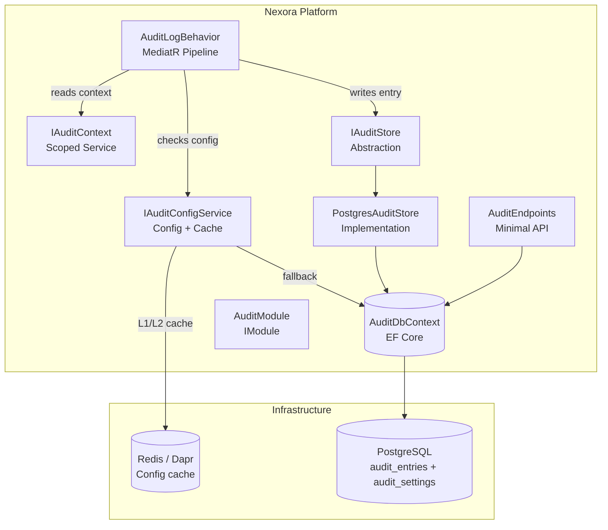
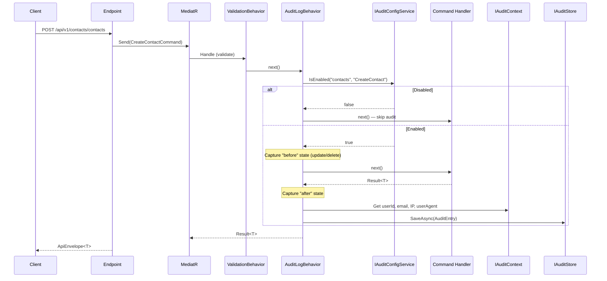
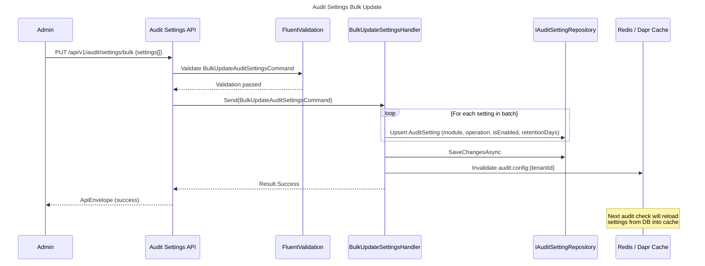
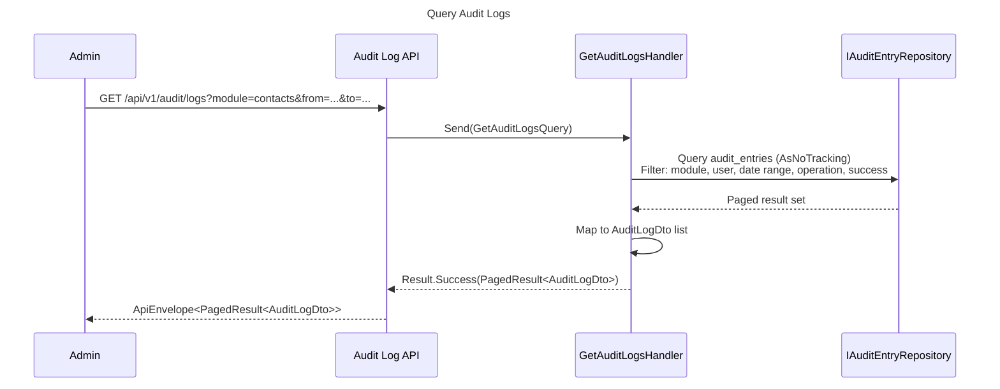
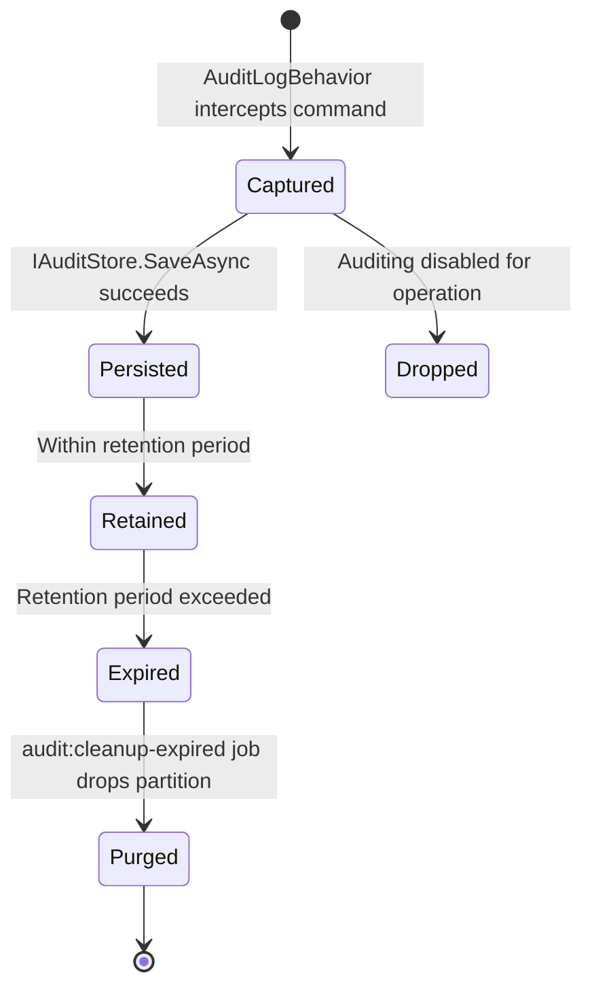
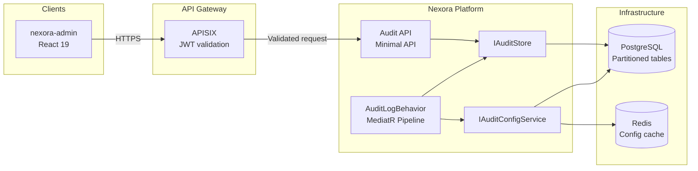
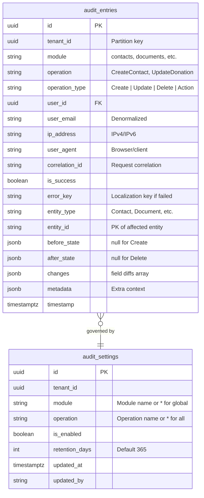
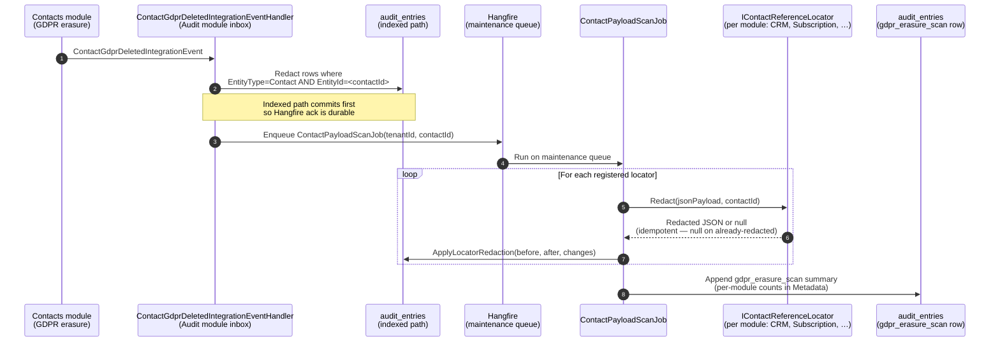

# Audit Log Module — Technical Specification

**Tier:** 1 — Platform Core

> **Status**: Implemented (2026-03-29)
> **Module Name**: `audit`
> **Tier**: Core/Platform (always installed)
> **Dependencies**: `identity`

## 1. Overview

Comprehensive, configurable audit logging system for all Nexora modules. Captures who did what, when, from where, and whether it succeeded — with full before/after entity change tracking.

### Goals

- Standalone top-level module (not nested under Identity)
- Configurable per module and per operation (toggle on/off)
- Role-based settings access (`audit.settings.manage`)
- Rich audit entries: user, IP, user agent, correlation ID, entity changes, success/failure
- PostgreSQL JSONB storage with table partitioning for retention management

## 2. Architecture

### 2.1 C4 Component Diagram



### 2.2 Audit Capture Flow



### 2.3 Audit Settings Bulk Update Flow



### 2.4 Query Audit Logs Flow



### 2.5 Pipeline Position

```text
ValidationBehavior → LoggingBehavior → AuditLogBehavior → Handler
```

Audit runs after validation (no point auditing invalid requests) and after logging (observability first).

### 2.6 Audit Entry Lifecycle (State Diagram)



### 2.7 Integration Diagram (System Boundaries)



## 3. Data Model

### 3.1 Entity Relationship Diagram



### 3.2 Changes JSONB Structure

```json
[
  { "field": "Email", "old": "john@old.com", "new": "john@new.com" },
  { "field": "Status", "old": "Active", "new": "Suspended" }
]
```

### 3.3 Settings Resolution Order

1. **Operation level**: `module=contacts, operation=CreateContact` — most specific
2. **Module level**: `module=contacts, operation=*` — all operations in module
3. **Global default**: `module=*, operation=*` — platform-wide

If no setting exists → auditing is **enabled by default** (secure by default).

## 4. Storage Decision

**PostgreSQL JSONB with table partitioning** (monthly by `timestamp`).

| Criteria | Decision |
|----------|----------|
| Infrastructure overhead | Zero — already running PostgreSQL 17 |
| Multi-tenancy | Schema-per-tenant (existing pattern) |
| Schema flexibility | JSONB columns for before/after/changes/metadata |
| Query patterns | SQL + GIN indexes on JSONB |
| Retention | Declarative range partitioning — drop old partitions O(1) |
| Escape hatch | `IAuditStore` abstraction allows swapping to Elasticsearch later |

## 5. Module Structure

```text
src/Modules/Nexora.Modules.Audit/
├── Domain/
│   ├── Entities/
│   │   ├── AuditEntry.cs
│   │   └── AuditSetting.cs
│   └── ValueObjects/
│       ├── AuditIds.cs
│       └── OperationType.cs
├── Application/
│   ├── Commands/
│   │   └── UpdateAuditSettingCommand.cs
│   ├── Queries/
│   │   ├── GetAuditLogsQuery.cs
│   │   ├── GetAuditLogDetailQuery.cs
│   │   ├── GetAuditSettingsQuery.cs
│   │   └── ExportAuditLogsQuery.cs
│   ├── DTOs/
│   │   ├── AuditLogDto.cs
│   │   ├── AuditLogDetailDto.cs
│   │   └── AuditSettingDto.cs
│   └── Services/
│       └── AuditConfigService.cs
├── Infrastructure/
│   ├── AuditDbContext.cs
│   ├── Configurations/
│   │   ├── AuditEntryConfiguration.cs
│   │   └── AuditSettingConfiguration.cs
│   └── Stores/
│       └── PostgresAuditStore.cs
├── Api/
│   ├── AuditLogEndpoints.cs
│   └── AuditSettingsEndpoints.cs
└── AuditModule.cs
```

## 6. SharedKernel Contracts

### IAuditStore

```csharp
public interface IAuditStore
{
    Task SaveAsync(AuditEntry entry, CancellationToken ct = default);
    Task SaveBatchAsync(IReadOnlyList<AuditEntry> entries, CancellationToken ct = default);
}
```

### IAuditContext

Scoped service populated from `IHttpContextAccessor`:
- `UserId` — from `ITenantContextAccessor`
- `UserEmail` — from JWT `email` claim
- `IpAddress` — from `X-Forwarded-For` or `RemoteIpAddress`
- `UserAgent` — from request header
- `CorrelationId` — from correlation header

### IAuditConfigService

```csharp
public interface IAuditConfigService
{
    Task<bool> IsEnabledAsync(string module, string operation, CancellationToken ct = default);
    Task<IReadOnlyList<AuditSettingDto>> GetSettingsAsync(CancellationToken ct = default);
    Task UpdateSettingAsync(string module, string operation, bool isEnabled, int? retentionDays, CancellationToken ct = default);
}
```

### IAuditable (Optional marker)

Commands implementing this can override auto-detected module/operation names:

```csharp
public interface IAuditable
{
    string AuditModule { get; }
    string AuditOperation { get; }
    string? AuditEntityType { get; }
}
```

## 7. API Endpoints

| Method | Path | Permission | Description |
|--------|------|------------|-------------|
| `GET` | `/api/v1/audit/logs` | `audit.logs.read` | List logs (filters: module, user, date range, operation, success/failure) |
| `GET` | `/api/v1/audit/logs/{id}` | `audit.logs.read` | Single entry with full before/after diff |
| `GET` | `/api/v1/audit/logs/export` | `audit.logs.export` | CSV export (planned) |
| `GET` | `/api/v1/audit/settings` | `audit.settings.read` | List audit settings |
| `PUT` | `/api/v1/audit/settings` | `audit.settings.manage` | Update setting |
| `PUT` | `/api/v1/audit/settings/bulk` | `audit.settings.manage` | Bulk update settings |
| `GET` | `/api/v1/audit/settings/operations` | `audit.settings.read` | List auditable operations |

## 8. Permission Model

| Permission | Description |
|------------|-------------|
| `audit.logs.read` | View audit log entries |
| `audit.logs.export` | Export logs to CSV |
| `audit.settings.read` | View audit settings |
| `audit.settings.manage` | Enable/disable auditing, set retention (admin only) |

## 9. Frontend Module

```text
nexora-admin/src/modules/audit/
├── manifest.ts
├── pages/
│   ├── AuditLogListPage.tsx
│   ├── AuditLogDetailPage.tsx
│   └── AuditSettingsPage.tsx
├── hooks/
│   ├── useAuditLogs.ts
│   ├── useAuditLogDetail.ts
│   ├── useAuditSettings.ts
│   └── useUpdateAuditSetting.ts
├── components/
│   ├── AuditLogTable.tsx
│   ├── AuditLogFilters.tsx
│   ├── EntityDiffViewer.tsx
│   └── AuditSettingsGrid.tsx
└── types/audit.ts
```

Top-level sidebar section with `FileSearch` icon. Not nested under Identity.

## 10. Key Design Decisions

| Decision | Rationale |
|----------|-----------|
| Standalone module | Clean module boundary, independent versioning |
| Async write (background channel) | Never block or fail the business operation |
| Enabled by default | Secure by default — admins can disable specific operations |
| No circular dependency | `AuditLogBehavior` in Infrastructure uses SharedKernel interfaces |
| Sensitive field masking | `[AuditMask]` attribute excludes passwords/tokens from snapshots |
| PostgreSQL over NoSQL | Zero infra overhead, existing team expertise, JSONB is flexible enough |

## 11. Before/After Capture Strategy

| Operation | Before State | After State | Changes |
|-----------|-------------|-------------|---------|
| Create | `null` | Entity from result | All fields as "added" |
| Update | Loaded pre-handler via ChangeTracker `OriginalValues` | `CurrentValues` post-handler | Field-level diff |
| Delete | Loaded pre-handler | `null` | All fields as "removed" |

Depth limit: 5 levels (nested object traversal). Navigation properties excluded. Max payload: 64 KB — payloads exceeding this limit are truncated and suffixed with `"...[TRUNCATED]"`.

## 11.1 `[AuditMask]` Attribute and Default-Masked Fields

The `[AuditMask]` attribute (applied on properties of command / entity types) instructs the `AuditMaskingInterceptor` to replace the annotated field's value with `"***MASKED***"` in any captured `before_state`, `after_state`, or `changes` payload.

**Default-masked fields (always masked regardless of attribute):**

The `AuditMaskingInterceptor` masks these field name patterns in ANY audited payload, even without an explicit `[AuditMask]` attribute:
- `password`, `passwordHash`, `pwd`
- `token`, `accessToken`, `refreshToken`, `apiKey`, `secret`
- `ssn`, `socialSecurityNumber`, `nationalId`, `tcKimlikNo`
- `creditCard`, `cardNumber`, `cvv`, `cvc`, `pan`
- `iban` (masked to last 4 digits)
- Fields annotated with `[PII]` attribute (from `Nexora.SharedKernel.DataClassification`)

Masking replaces the value with `"***MASKED***"` in the audit log. The mask list is configurable via `audit.masking.additional_patterns` tenant config (regex patterns, additive only — cannot unmask the defaults above).

**Depth and size limits (shared with §11):** nested-object traversal depth = 5 levels; max payload size = 64 KB, truncated with `"...[TRUNCATED]"` suffix.

### 11.2 Cross-module PII payload scan (T-010, ADR-0026)

> Heading numbering note: the previous `### 11.1 Cross-module PII payload scan` collided with the existing `## 11.1 [AuditMask] Attribute and Default-Masked Fields` section above. Renumbered to `11.2`.

The `EntityType = "Contact" AND EntityId = <contactId>` indexed path catches the common case but misses contact references **embedded in other modules' audit JSON payloads** (e.g. CRM `Lead.assignedTo`). T-010 closes this Article 17 gap with a per-module locator pattern:

- Each module that stores contact PII inside audit `BeforeState` / `AfterState` / `Changes` JSON columns registers an `IContactReferenceLocator` (DI singleton).
- The locator's `Redact(jsonPayload, contactId)` returns either redacted JSON or `null` (no match in that payload).
- `ContactPayloadScanJob` (Hangfire `maintenance` queue) is enqueued by the `ContactGdprDeletedIntegrationEventHandler` after the indexed-path redaction commits. The job iterates every registered locator and applies its redaction rules in-place to that module's audit rows.
- An `audit / gdpr_erasure_scan` summary entry is appended at the end of each sweep with per-module counts in `Metadata`.
- Idempotent: re-running on already-redacted payloads is a no-op (locators return `null` once their target paths are clean).

Module-coverage gate: `tests/Nexora.Architecture.Tests/ContactReferenceLocatorCoverageTests.cs` asserts that any module emitting a `ContactId`-bearing integration event also ships an `IContactReferenceLocator`. Modules whose events carry only IDs (no PII strings) are explicitly exempted with a documented rationale.

The 10M-row performance benchmark for the scan is deferred to Phase 2 Milestone C per the T-010 reclassification.



## 12. Retention and Partitioning

- **Table partitioning**: Monthly range partitions on `timestamp`
- **Partition creation**: `audit:create-partition` Hangfire job (monthly)
- **Cleanup**: `audit:cleanup-expired` Hangfire job (weekly) — drops old partitions
- **Default retention**: 365 days (configurable per module)

## 13. Migration from Identity Audit Logs

1. Phase 1: One-time migration job copies `identity_audit_logs` → `audit_entries` with `module=identity`
2. Phase 2: Remove audit-logs route from Identity sidebar
3. Phase 3: Drop `identity_audit_logs` table

## 14. Implementation Phases

### Phase 1: Core (Sprint 1-2)

- SharedKernel contracts (`IAuditStore`, `IAuditContext`, `IAuditConfigService`)
- `AuditLogBehavior` MediatR pipeline
- `HttpAuditContext` scoped service
- Audit module: entities, DbContext, migrations, PostgresAuditStore
- API endpoints: logs CRUD, settings CRUD
- Permission registration

### Phase 2: UI (Sprint 3)

- Frontend module: manifest, pages, hooks, components
- `EntityDiffViewer` before/after component
- `AuditSettingsPage` toggle grid
- Translation keys (en + tr)
- Identity audit cleanup

### Phase 3: Advanced (Sprint 4+)

- Table partitioning + cleanup jobs
- CSV/Excel export
- Kafka integration event for external consumers
- Optional Elasticsearch sink
- Anomaly detection (unusual patterns)
