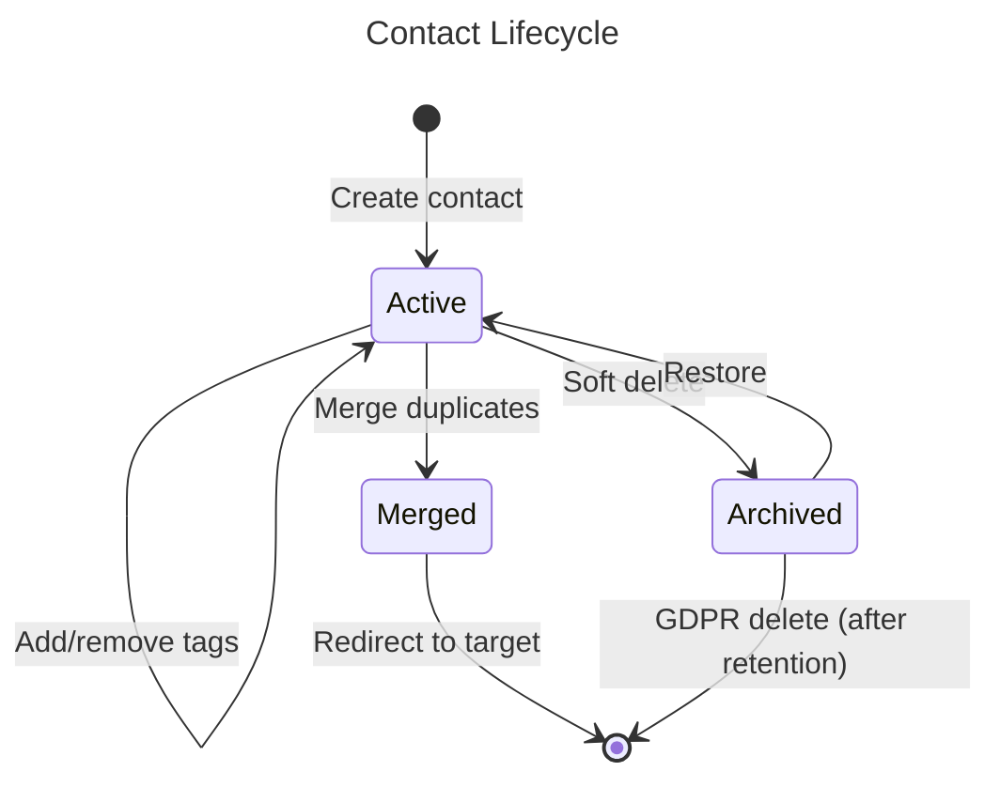
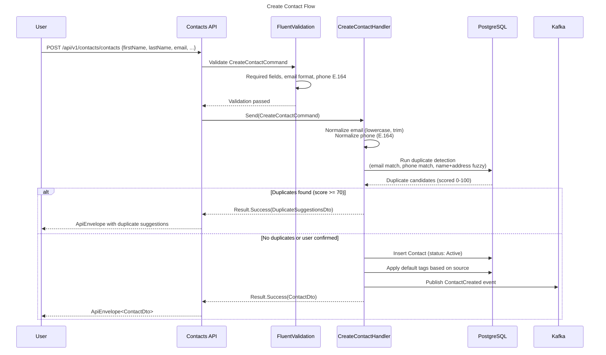
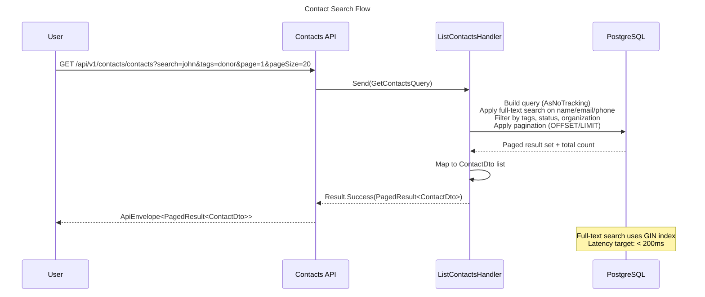
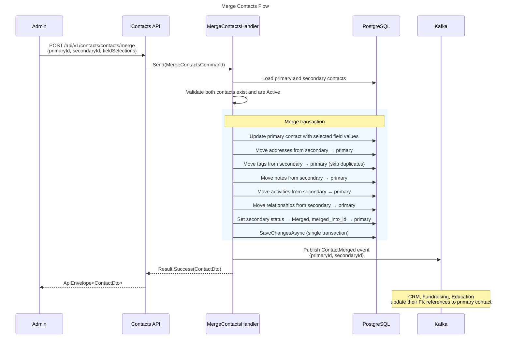
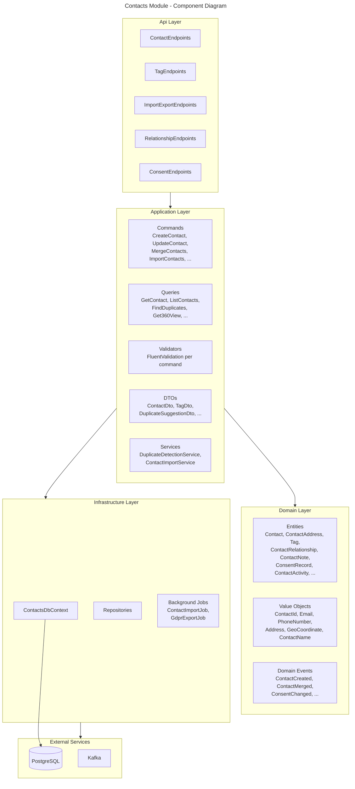
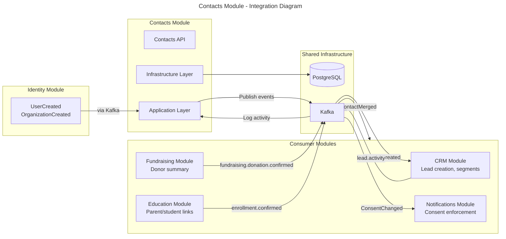
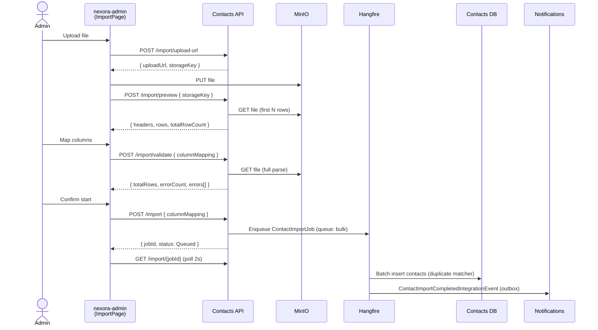
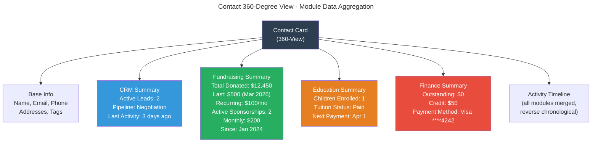

# Module: Contact Management

**Tier:** 1 — Platform Core

> **Status**: Implemented
> **Version**: 1.0.0
> **Module Name**: `contacts`
> **Tier**: Core/Platform (always installed)
> **Dependencies**: `identity`

## Overview
The Contact module provides a **unified contact registry** shared across all Nexora modules. A single person can be a customer, employee, partner, and vendor simultaneously — represented as one contact record with multiple type tags. This is the foundation for the 360-degree view: when you open a contact card, you see all interactions across CRM, Finance, Subscription, and every other installed module. Vertical-specific attributes (donor status, beneficiary type, student/parent linkage) are **not** part of the core entity — see [Contact Extensions](#contact-extensions) and [ADR-0020](../../../decisions/0020-contact-extensions-by-vertical-modules.md).

## Domain Model

### Entities

```mermaid
---
title: Contact Module - Entity Relationship Diagram
---
erDiagram
    Contact ||--o{ ContactAddress : "has many"
    Contact ||--o{ ContactTag : "tagged with"
    Contact ||--o{ ContactRelationship : "related to"
    Contact ||--o{ CommunicationPreference : "prefers"
    Contact ||--o{ ContactNote : "has notes"
    Contact ||--o{ ContactCustomField : "has custom fields"
    Contact ||--o{ ConsentRecord : "has consents"
    Contact ||--o{ ContactActivity : "has activities"

    Contact {
        uuid id PK
        uuid organization_id FK
        string type "individual | organization"
        string title "Mr, Mrs, Dr..."
        string first_name
        string last_name
        string display_name "computed"
        string company_name "if type=organization"
        string email
        string phone
        string mobile
        string website
        string tax_id
        string language
        string currency
        string source "web_form, import, manual, api"
        string status "active, archived, merged"
        uuid merged_into_id FK "if merged"
        jsonb metadata
        timestamp created_at
        timestamp updated_at
    }

    ContactAddress {
        uuid id PK
        uuid contact_id FK
        string type "home, work, billing, shipping"
        string street1
        string street2
        string city
        string state
        string postal_code
        string country_code
        boolean is_primary
        float latitude
        float longitude
    }

    Tag ||--o{ ContactTag : "applied to"
    Tag {
        uuid id PK
        uuid tenant_id FK
        string name UK
        string color
        string category "customer, employee, partner, vendor, prospect, other"
    }

    ContactTag {
        uuid id PK
        uuid contact_id FK
        uuid tag_id FK
        uuid organization_id FK "which org tagged this"
    }

    ContactRelationship {
        uuid id PK
        uuid contact_id FK
        uuid related_contact_id FK
        string relationship_type "parent_of, spouse_of, employee_of, ..."
    }

    CommunicationPreference {
        uuid id PK
        uuid contact_id FK
        string channel "email, sms, whatsapp, phone, mail"
        boolean opted_in
        timestamp opted_in_at
        timestamp opted_out_at
        string opt_in_source "web_form, verbal, written"
    }

    ContactNote {
        uuid id PK
        uuid contact_id FK
        uuid author_user_id FK
        uuid organization_id FK
        string content
        boolean is_pinned
        timestamp created_at
    }

    CustomFieldDefinition ||--o{ ContactCustomField : "defines"
    CustomFieldDefinition {
        uuid id PK
        uuid tenant_id FK
        string field_name
        string field_type "text, number, date, select, multiselect, boolean"
        jsonb options "for select types"
        boolean is_required
        int display_order
    }

    ContactCustomField {
        uuid id PK
        uuid contact_id FK
        uuid field_definition_id FK
        string value
    }

    ConsentRecord {
        uuid id PK
        uuid contact_id FK
        string consent_type "email_marketing, sms_marketing, data_processing"
        boolean granted
        string source "web_form, verbal, written"
        string ip_address
        timestamp granted_at
        timestamp revoked_at
    }

    ContactActivity {
        uuid id PK
        uuid contact_id FK
        uuid organization_id FK
        string module_source "crm, fundraising, education, ..."
        string activity_type "email_sent, call, meeting, donation, enrollment, ..."
        string summary
        jsonb details
        timestamp occurred_at
    }
```



### Value Objects

| Value Object | Description |
|-------------|-------------|
| `ContactId` | Strongly-typed contact identifier |
| `Email` | Validated email with normalization (lowercase, trim) |
| `PhoneNumber` | E.164 formatted phone number |
| `Address` | Composite: street, city, state, postal, country |
| `GeoCoordinate` | Latitude/longitude pair |
| `ContactName` | First + Last + Display name logic |
| `TagId` | Strongly-typed tag identifier |

### Domain Events

| Event | Trigger | Consumers |
|-------|---------|-----------|
| `ContactCreated` | New contact added | CRM (auto-create lead if source=web), Notifications (welcome) |
| `ContactUpdated` | Contact info changed | Search index refresh, Audit log |
| `ContactMerged` | Duplicate resolved | All modules (update foreign keys), Audit log |
| `ContactArchived` | Soft delete | CRM (close related leads), Audit log |
| `ContactTagAdded` | Tag applied | CRM (segment update), Reporting |
| `ContactTagRemoved` | Tag removed | CRM (segment update), Reporting |
| `ConsentChanged` | Opt-in/out | Notifications (update suppression list) |
| `ContactActivityLogged` | Activity from any module | 360-view refresh |

### Entity Lifecycle



### Sequence Diagrams







### Component Diagram



### Integration Diagram



## Use Cases

### UC-CON-001: Create Contact
- **Actor**: User with `contacts.contacts.write` permission, or system (web form, import)
- **Preconditions**: User is in an active organization context
- **Flow**:
  1. Validate required fields (at minimum: first_name + last_name or company_name)
  2. Normalize email (lowercase, trim) and phone (E.164)
  3. Run duplicate detection (email match, phone match, name+address fuzzy match)
  4. If potential duplicates found: return suggestions, let user confirm or merge
  5. If confirmed new: create contact record with `organization_id`
  6. Apply default tags based on source (e.g., web form → "Lead")
  7. Publish `ContactCreated` event
- **Business Rules**:
  - Email uniqueness is **soft** (warn, not block) — same person can have different emails
  - Contacts are visible across organizations within tenant (360-view)
  - Organization-scoped tags determine which org "owns" the relationship
  - Phone numbers stored in E.164 format

### UC-CON-002: 360-Degree View
- **Actor**: User with `contacts.contacts.read` permission
- **Example (B2B SaaS)**: Opening a contact card surfaces the **active subscription**, the **last invoice status**, any **open support tickets**, the **CRM pipeline stage**, and the **last CRM activity** — all aggregated from the installed modules without the Contacts module knowing their internals.
- **Flow**:
  1. Load contact base data
  2. Aggregate activities from all modules (via `ContactActivity` table)
  3. Load related contacts (organizational hierarchy, employer, etc.)
  4. Load tags across all organizations user has access to
  5. Load module-specific summaries (only from installed modules):
     - CRM: active leads, pipeline stage, last activity
     - Subscription: active subscription, plan, renewal date
     - Finance: last invoice status, outstanding balance
     - Support (if installed): open tickets count
     - Vertical modules (via `contact_extensions`, e.g. Fundraising donor summary, Education enrollment): contributed as optional panels
  6. Return unified view
- **Business Rules**:
  - User only sees activities from organizations they have access to
  - Module summaries only show for installed modules
  - Activities sorted reverse-chronologically

### UC-CON-003: Merge Duplicates
- **Actor**: User with `contacts.contacts.admin` permission
- **Preconditions**: At least 2 contacts identified as duplicates
- **Flow**:
  1. User selects primary (surviving) contact and secondary (to be merged)
  2. System shows field-by-field comparison
  3. User selects which values to keep for conflicting fields
  4. System updates primary contact with selected values
  5. System moves all relationships from secondary to primary:
     - Addresses, tags, notes, activities
     - CRM leads, fundraising records, etc. (via integration events)
  6. Secondary contact status → Merged, `merged_into_id` = primary
  7. Publish `ContactMerged` event (other modules update their FK references)
- **Business Rules**:
  - Merge is irreversible (but audited)
  - All historical data preserved on primary contact
  - Secondary contact kept for redirect purposes (not deleted)

### UC-CON-004: Import Contacts (CSV/Excel) — 3-step wizard

Implemented as a three-step wizard (T-002, Phase 1.5.6) replacing the legacy
fixed-column CSV upload. Admin flows through Upload → Mapping → Validate → Confirm.

- **Actor**: User with `contacts.contacts.write` permission
- **Business Rules**:
  - Required fields (email) validated per row at the Validate step
  - Duplicates detected via the shared `IContactDuplicateMatcher` service during
    the Confirm/Import phase (not at Validate)
  - Import is atomic per batch (all or nothing per 100-row chunk)
  - Hangfire job runs on the `bulk` queue; job descriptor `contacts:bulk-import`
  - Completion emits `ContactImportCompletedIntegrationEvent` via outbox



**Validation error keys** returned by `POST /import/validate`:

| Key | Meaning |
|---|---|
| `lockey_contacts_import_validation_email_required` | Required email column missing |
| `lockey_contacts_import_validation_email_invalid` | Email does not match standard format |
| `lockey_contacts_import_validation_phone_invalid` | Phone does not match expected shape |
| `lockey_contacts_import_validation_unknown_source_column` | Mapping references a header not in the file |

**Endpoints:**

| Method | Path | Purpose | Auth |
|---|---|---|---|
| POST | `/api/v1/contacts/contacts/import/upload-url` | Presigned upload URL | `contacts.contacts.write` |
| POST | `/api/v1/contacts/contacts/import/preview` | Parse first 5 rows | `contacts.contacts.write` |
| POST | `/api/v1/contacts/contacts/import/validate` | Pre-flight validation with mapping | `contacts.contacts.write` |
| POST | `/api/v1/contacts/contacts/import` | Confirm + enqueue Hangfire job | `contacts.contacts.write` |
| GET | `/api/v1/contacts/contacts/import/{jobId}` | Job status polling | `contacts.contacts.read` |

**`ImportJob.ColumnMappingJson`** (nullable) persists the source → target mapping so
the background job can re-apply it idempotently on retry.

### UC-CON-005: KVKK/GDPR Data Export & Deletion
- **Actor**: Contact (via portal) or Admin
- **Flow**:
  1. Request data export: system compiles all contact data across modules into JSON/CSV
  2. Request deletion: behavior depends on tenant config `gdpr.hard_delete.enabled`
     (see §GDPR Hard Delete below)
  3. Audit log records the compliance action via append-only `GdprErasureAudit`
- **Business Rules**:
  - Data export delivered within 30 days (regulatory requirement)
  - Deletion has two modes (per ADR-0008): anonymize (default) or hard-delete
  - Financial records retained per tax law (anonymized but amounts preserved)
  - EU-region tenants: `gdpr.hard_delete.enabled` must be `true` from 2026-09-30

### GDPR Hard Delete (Article 17)

Per ADR-0008, the module supports two deletion modes, selected per tenant via the
`gdpr.hard_delete.enabled` tenant config (default `false`).

**Mode: anonymize (default)** — Existing behavior: PII fields on `Contact` are overwritten
with `[REDACTED]`, consents revoked, child PII rows removed, contact soft-deleted.
Completes synchronously within the request.

**Mode: hard_delete** — `POST /contacts/{id}/gdpr/delete` enqueues the Hangfire job
`contacts:gdpr-hard-delete` (queue `critical`). The job, within a single transaction:

1. Executes `ExecuteDeleteAsync` in FK-safe order on eight child types:
   `ContactAddress`, `ContactNote`, `ContactCustomField`, `ContactTag`,
   `ContactRelationship`, `CommunicationPreference`, `ContactActivity`, then `Contact`.
2. Anonymizes `ConsentRecord` rows (NOT deleted — Article 17(3)(e) retention for legal
   evidence): `IpAddress → null`, `Source → "REDACTED"`.
3. Appends a `GdprErasureAudit` record with `Mode="hard_deleted"`, `ChildCountsJson`.
4. Emits `ContactGdprDeletedIntegrationEvent` via outbox with `Mode="hard_deleted"`,
   `DeletedAtUtc`, `ErasedByUserId`.

**Cross-module consumers** (inbox pattern per ADR-0011):

| Module | Behavior on event |
|---|---|
| Documents | `Document.LinkedEntityId` nullified where `LinkedEntityType="Contact"` and matches. `SignatureRecipient` PII (Name/Email → `[REDACTED]`, IpAddress → `null`); signature blob + timestamps retained. |
| Notifications | `NotificationRecipient.RecipientAddress → [REDACTED]`; parent `Notification.BodyRendered → [REDACTED]`; template_key + delivery status retained. |
| Audit | `AuditEntry` rows matching `EntityType=Contact` and `EntityId=<contactId>` get `BeforeState`/`AfterState`/`Changes` replaced with `{"_redacted":true,"_reason":"gdpr_erasure",...}`; operational trace preserved. One new entry appended: `action=gdpr_erasure`. |
| Identity (future) | `User.ContactId → null` when T-001 ships. Currently no-op. |

**Admin UI** (nexora-admin): Contact detail page exposes a destructive "GDPR Erasure"
button gated by `contacts.contacts.admin`. Dialog requires a reason (10–500 chars) and
the contact's display name to be typed for confirmation.

**Locale keys:** `lockey_contacts_gdpr_erasure_enqueued`, `lockey_contacts_gdpr_erasure_completed`,
`lockey_contacts_gdpr_erasure_failed`, `lockey_contacts_gdpr_erasure_already_processed`,
`lockey_contacts_error_invalid_user_context` (en + tr).

**`childCountsJson` schema.** Both anonymize and hard-delete paths write the SAME 8-key
schema for forensic consistency:

```json
{
  "addresses": <int>,
  "notes": <int>,
  "customFields": <int>,
  "tags": <int>,
  "relationships": <int>,
  "communicationPreferences": <int>,
  "activities": <int>,
  "consentsAnonymized": <int>
}
```

Values represent rows affected (removed in hard-delete; removed-or-preserved in
anonymize per entity type — anonymize preserves tags/relationships/comm-prefs/
activities so those keys carry `0`).

**Debounce.** A 60-second idempotency window prevents duplicate submissions: if a
`GdprErasureAudit` row exists for the same `ContactId` within the last 60s, the
handler returns `lockey_contacts_gdpr_erasure_already_processed` (HTTP 200) without
re-executing. This covers both double-click from a single operator and racing
operators across tabs.

**Audit trail inclusion in GDPR export.** `GdprErasureAudit` records are **not**
included in the `RequestGdprExportCommand` response. Rationale: the audit log is the
data controller's operational record of compliance actions; per GDPR Article 15
guidance for data controller records (vs. processor records), these are not subject
to the data subject's right of access. If regulators request a controller audit
trail, it is exported separately via a platform admin endpoint (not subject-facing).

**Explicit permission gate.** `POST /contacts/{id}/gdpr/delete` enforces
`contacts.contacts.admin` via `.RequireAuthorization(policy => policy.RequireClaim(...))`
— defense-in-depth beyond the module's default permission pipeline.

**Known limitations (tracked as follow-up tasks):**

- **Cross-module audit payload PII scan** — the Audit inbox handler only redacts
  entries matched by `EntityType=Contact AND EntityId=<id>`. Audit entries in other
  modules whose JSON payloads mention the contact by name/email are not scrubbed.
  Follow-up: **T-010**.
- **`Notification.BodyRendered` placeholder** — the scrub writes `[REDACTED]`
  instead of `null` because the column is currently non-nullable. Schema migration
  is follow-up: **T-017**.
- **User↔Contact unlink handler** — Identity module will add an inbox consumer to
  set `User.ContactId = null` once T-001 ships. Currently no-op.

## API Endpoints

> **Permission naming**: Permissions follow platform convention `{module}.{resource}.{read|write|delete|admin}` — `write` covers both create and update. `delete` stays distinct, and `admin` is used for destructive/overriding operations such as merge or GDPR anonymize.

### Contact CRUD
| Method | Path | Description | Auth |
|--------|------|-------------|------|
| POST | `/api/v1/contacts/contacts` | Create contact | `contacts.contacts.write` |
| GET | `/api/v1/contacts/contacts` | List/search contacts | `contacts.contacts.read` |
| GET | `/api/v1/contacts/contacts/{id}` | Get contact (360-view) | `contacts.contacts.read` |
| PUT | `/api/v1/contacts/contacts/{id}` | Update contact | `contacts.contacts.write` |
| DELETE | `/api/v1/contacts/contacts/{id}` | Archive contact (returns 200 OK with ApiEnvelope) | `contacts.contacts.delete` |
| POST | `/api/v1/contacts/contacts/{id}/restore` | Restore archived | `contacts.contacts.delete` |

### Duplicate & Merge
| Method | Path | Description | Auth |
|--------|------|-------------|------|
| GET | `/api/v1/contacts/contacts/{id}/duplicates` | Find duplicates | `contacts.contacts.read` |
| POST | `/api/v1/contacts/contacts/merge` | Merge contacts | `contacts.contacts.admin` |

### Tags
| Method | Path | Description | Auth |
|--------|------|-------------|------|
| GET | `/api/v1/contacts/tags` | List tags | `contacts.tag.read` |
| POST | `/api/v1/contacts/tags` | Create tag | `contacts.tag.write` |
| PUT | `/api/v1/contacts/tags/{id}` | Update tag | `contacts.tag.write` |
| DELETE | `/api/v1/contacts/tags/{id}` | Delete tag (returns 200 OK with ApiEnvelope) | `contacts.tag.delete` |
| POST | `/api/v1/contacts/contacts/{id}/tags` | Add tags to contact | `contacts.contacts.write` |
| DELETE | `/api/v1/contacts/contacts/{id}/tags/{tagId}` | Remove tag (returns 200 OK with ApiEnvelope) | `contacts.contacts.write` |

### Import/Export
| Method | Path | Description | Auth |
|--------|------|-------------|------|
| POST | `/api/v1/contacts/contacts/import/upload-url` | Generate presigned upload URL | `contacts.contacts.write` |
| POST | `/api/v1/contacts/contacts/import/preview` | Parse first 5 rows for wizard preview | `contacts.contacts.write` |
| POST | `/api/v1/contacts/contacts/import/validate` | Pre-flight validation with mapping | `contacts.contacts.write` |
| POST | `/api/v1/contacts/contacts/import` | Confirm + enqueue import | `contacts.contacts.write` |
| GET | `/api/v1/contacts/contacts/import/{jobId}` | Poll import status | `contacts.contacts.read` |
| POST | `/api/v1/contacts/contacts/export` | Request export | `contacts.contacts.read` |

### Relationships
| Method | Path | Description | Auth |
|--------|------|-------------|------|
| GET | `/api/v1/contacts/contacts/{id}/relationships` | List relationships | `contacts.contacts.read` |
| POST | `/api/v1/contacts/contacts/{id}/relationships` | Add relationship | `contacts.contacts.write` |
| DELETE | `/api/v1/contacts/relationships/{id}` | Remove relationship (returns 200 OK with ApiEnvelope) | `contacts.contacts.write` |

### Consent & Compliance
| Method | Path | Description | Auth |
|--------|------|-------------|------|
| GET | `/api/v1/contacts/contacts/{id}/consents` | List consents | `contacts.consent.read` |
| POST | `/api/v1/contacts/contacts/{id}/consents` | Record consent | `contacts.consent.write` |
| POST | `/api/v1/contacts/contacts/{id}/gdpr-export` | GDPR data export | `contacts.contacts.admin` |
| POST | `/api/v1/contacts/contacts/{id}/gdpr/delete` | GDPR erasure (mode gated by tenant config `gdpr.hard_delete.enabled`) | `contacts.contacts.admin` |

## Integration Points

### Events Produced
| Event | Topic | Description |
|-------|-------|-------------|
| `contacts.contact.created` | `nexora.contacts` | New contact created |
| `contacts.contact.updated` | `nexora.contacts` | Contact info changed |
| `contacts.contact.merged` | `nexora.contacts` | Contacts merged (includes old→new ID mapping) |
| `contacts.contact.archived` | `nexora.contacts` | Contact archived |
| `contacts.consent.changed` | `nexora.contacts.consents` | Opt-in/out change |

### Events Consumed
| Event | Source | Action |
|-------|--------|--------|
| `identity.user.created` | Identity | Auto-create or link contact for internal users |
| `identity.organization.created` | Identity | Initialize default tag categories |
| `crm.lead.activity` | CRM | Log activity on contact timeline |
| `fundraising.donation.confirmed` | Fundraising | Log activity, update donor summary |
| `education.enrollment.confirmed` | Education | Log activity, update parent/student link |
| `fundraising.sponsorship.created` | Fundraising | Log activity on contact timeline |

### 360-View Module Integration



## Data Model Notes

### Duplicate Detection Algorithm
1. **Exact match**: email or phone
2. **Fuzzy match**: Levenshtein distance on (first_name + last_name) < 2
3. **Address match**: Same postal code + similar street name
4. Scored 0-100, threshold for auto-suggestion: 70+

### Cross-Organization Visibility
- Contact base data is tenant-wide (visible across all orgs)
- Tags are org-scoped (IKF's "Major Donor" vs Academy's "VIP Parent")
- Notes are org-scoped (only visible to the org that created them)
- Activities are org-scoped but aggregated in 360-view for users with multi-org access

> **`organization_id` scoping note:** Contact records are scoped at the **tenant level** (not organization level). The `organization_id` field on a Contact is an association (which org this contact belongs to), not a data isolation boundary. Tenant-wide access means any org within the tenant can see all contacts subject to permission checks; org-level filtering is applied at the query layer when the user has org-scoped permissions.

## Contact Extensions

The core `Contact` entity is **domain-neutral** — it contains no NGO, education, healthcare, or other vertical-specific fields. Historically-proposed columns like `is_donor`, `parent_of`, and `beneficiary_type` are **removed from the core entity** and are now contributed by Tier-3 vertical modules through an extension mechanism.

### Mechanism: `contact_extensions` side table

```
contact_extensions {
    id             uuid PK
    contact_id     uuid FK → contacts_contact.id
    module_id      text        -- e.g. "fundraising", "education", "healthcare"
    payload        jsonb       -- module-defined shape
    created_at     timestamp
    updated_at     timestamp
    UNIQUE (contact_id, module_id)
}
```

**Why a side table (not a JSONB column on `Contact`):**

- **Tier isolation** — each vertical module owns and migrates its own rows; the core Contacts module never needs to know payload shapes. A Tier-1 module cannot be forced to evolve when Tier-3 schemas change.
- **Install/uninstall cleanliness** — uninstalling a vertical edition drops the corresponding `module_id` rows without touching the `Contact` table.
- **Indexing & auditing** — each module may index its own payload and record its own audit events on its own rows.
- **Avoids the "god-JSONB" anti-pattern** where every module fights for keys inside a single column on the core entity.

### Rules

- Tier-1 and Tier-2 modules MUST NOT write to `contact_extensions`. Only Tier-3 (vertical editions) and Tier-4 (extensions) contribute.
- The core 360-view aggregates extension rows generically: it renders a labelled panel per module ID, and the vertical module supplies a read-side DTO mapper through a SharedKernel interface.
- Extension rows are soft-deleted with the parent contact (`IsDeleted` cascades via domain event); full GDPR erasure also anonymizes the `payload`.

See [ADR-0020 — Contact Extensions by Vertical Modules](../../../decisions/0020-contact-extensions-by-vertical-modules.md).

## Non-Functional Requirements

| Requirement | Target |
|------------|--------|
| Contact search latency | < 200ms (full-text search) |
| 360-view load time | < 500ms |
| Import throughput | 1,000 contacts/minute |
| Duplicate detection | < 100ms per contact |
| Max contacts per tenant | 1,000,000 |
| GDPR export generation | < 5 minutes |

---

_Updated 2026-04-22 — Prompt 2 Agent E — In Review_
