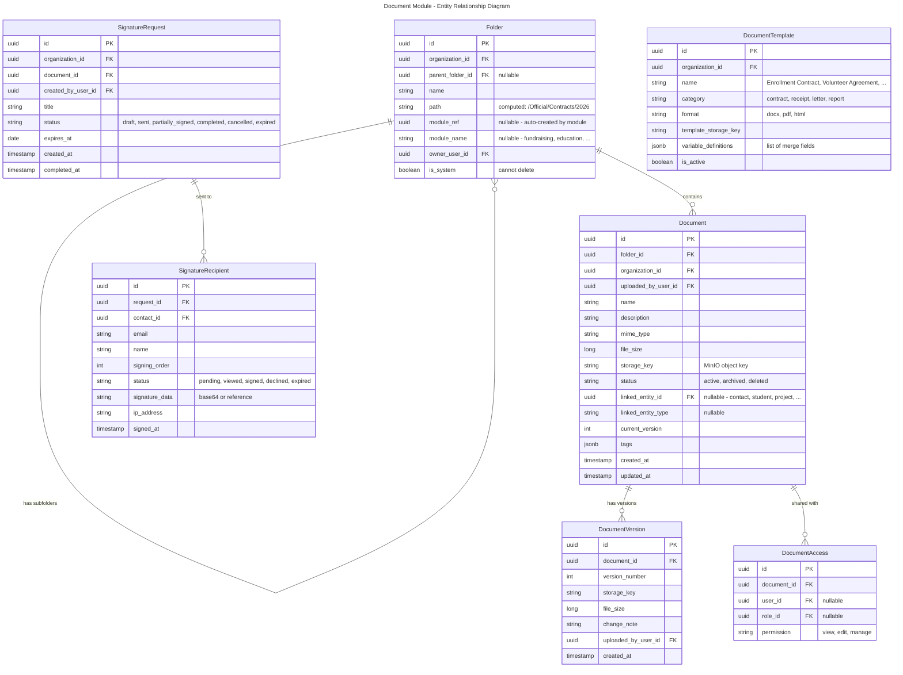
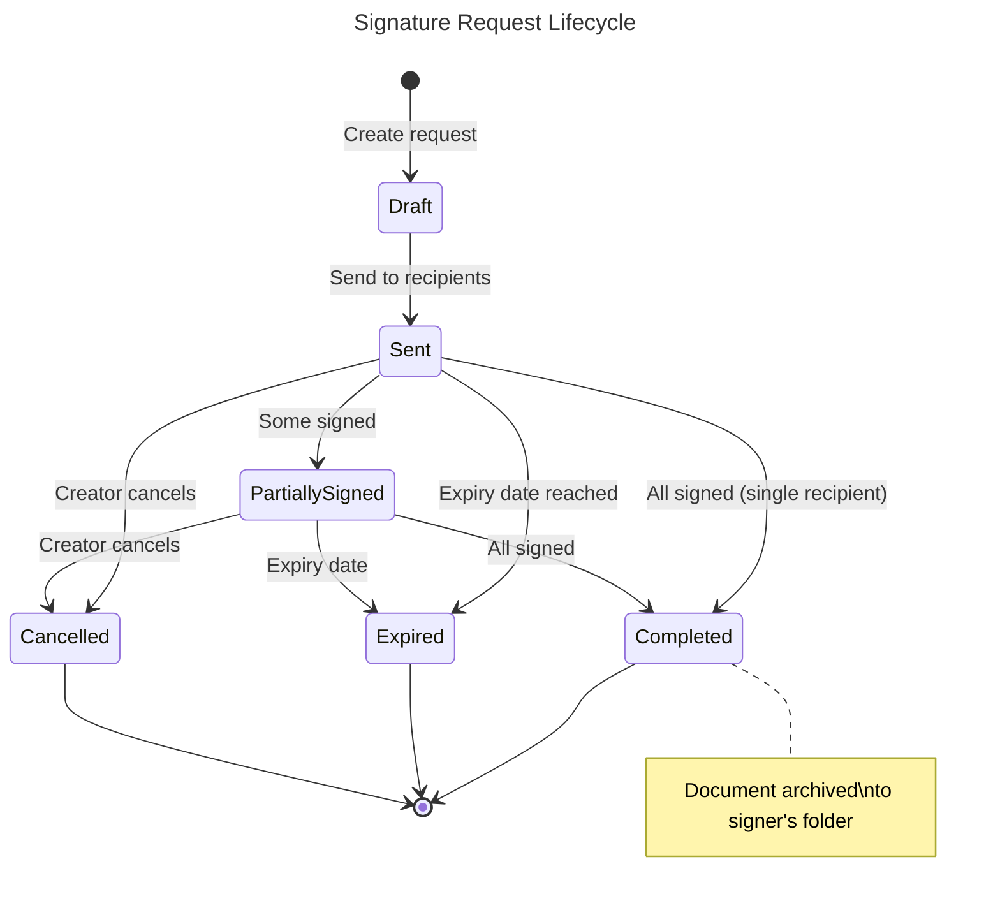
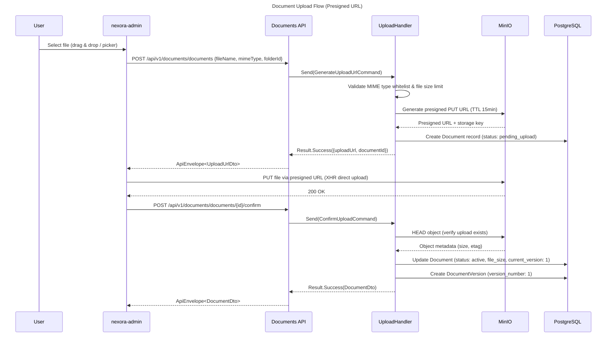
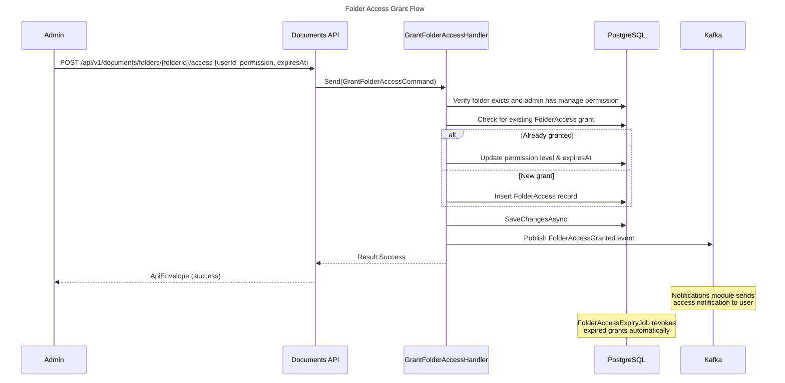
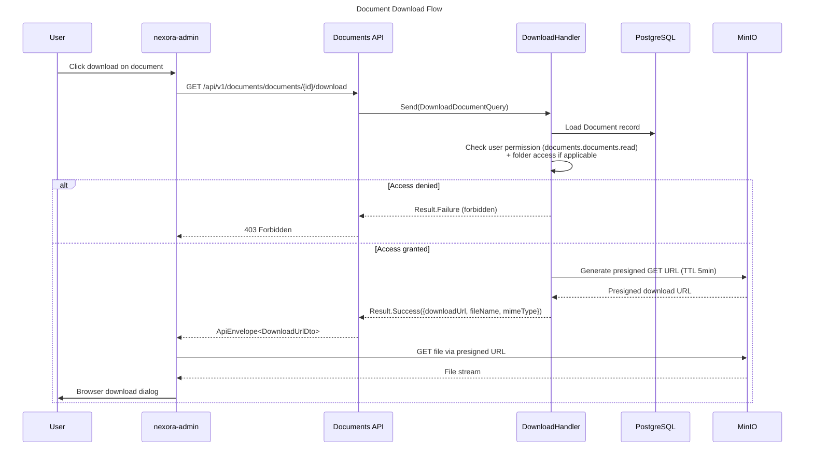
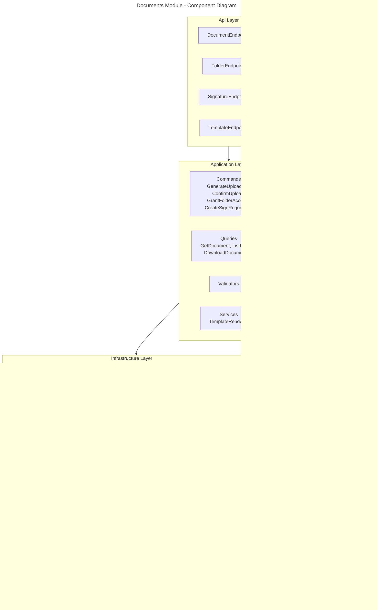
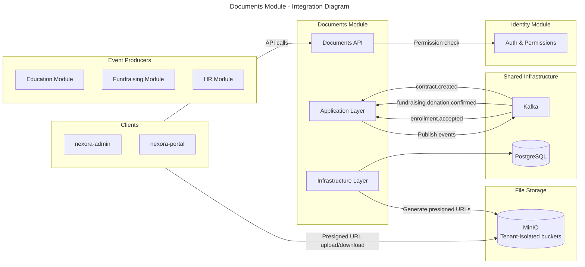

# Module: Document Management

**Tier:** 1 — Platform Core

> **Status**: Implemented
> **Module Name**: `documents`
> **Tier**: Core/Platform (always installed)
> **Dependencies**: `identity`

## Overview
The Document module provides centralized file storage, organization, digital signatures, and document templates across all Nexora modules. It handles contract signing (enrollment agreements, vendor contracts), receipt archival, official document scanning, and a knowledge base for institutional memory. Files are stored in MinIO (S3-compatible) with tenant-isolated buckets.

## Domain Model

### Entities

### Entity Lifecycles

### Sequence Diagrams

### Component Diagram

### Integration Diagram

## Use Cases

### UC-DOC-001: Upload & Organize Document
- **Actor**: User with `documents.documents.upload` permission
- **Flow**:
  1. User uploads file (drag & drop or file picker)
  2. System stores in MinIO: `{tenant}/{org}/{folder_path}/{uuid}_{filename}`
  3. System creates Document record with metadata
  4. Optionally link to entity (contact, student, project)
  5. Document appears in folder and on linked entity's document tab
- **Business Rules**:
  - Max file size: 100MB (configurable, enforced server-side)
  - Allowed types: MIME type whitelist (configurable per organization)
  - Path traversal guard on file names
  - Virus scanning on upload (ClamAV integration)
  - Version control: re-upload with same name creates new version, old versions retained

### UC-DOC-002: Digital Signature (e-Sign)
- **Actor**: User with `documents.signatures.create` permission
- **Flow**:
  1. User uploads or selects document for signing
  2. User defines recipients (contacts) and signing order
  3. System sends email to first recipient with secure signing link
  4. Recipient views document, draws/types signature, submits
  5. Next recipient in order receives email (if sequential signing)
  6. When all signed: status → Completed
  7. Signed document with audit trail archived to folder
  8. All parties receive final signed copy via email
- **Business Rules**:
  - Signatures legally binding (timestamp, IP, identity verification)
  - Expiry: configurable (default 7 days)
  - Signing order: sequential or parallel
  - Reminder emails: auto-send every 2 days if unsigned

### UC-DOC-003: Generate Document from Template
- **Actor**: User or system (automated)
- **Flow**:
  1. Select template (e.g., "Enrollment Contract")
  2. Provide variables (see declarative variable table below)
  3. System renders document (HTML → PDF or DOCX merge)
  4. Document saved to target folder
  5. Optionally sent for signature
- **Template Variables** (declarative, per template definition):

  | Variable | Type | Example |
  |----------|------|---------|
  | `student.name` | string | "Ada Lovelace" |
  | `tuition` | `Money` | `{ amount: 12500, currency: "USD" }` |
  | `deposit` | `Money` | `{ amount: 1000, currency: "USD" }` |
  | `enrollment.date` | date | 2026-09-01 |

  > Monetary fields MUST be typed as `Money` (SharedKernel.Money — see ADR-0021). Do NOT split into separate `amount` + `currency` template variables; bind the whole `Money` value object and format via locale-aware renderer.

- **Business Rules**:
  - Templates support merge fields: `{{student.name}}`, `{{tuition}}` (renders formatted `Money`), `{{tuition.amount}}` and `{{tuition.currency}}` available as sub-accessors for display-only formatting
  - PDF rendering via wkhtmltopdf or Puppeteer
  - Auto-generation triggered by events (e.g., enrollment accepted → generate contract)

## API Endpoints

| Method | Path | Description | Auth |
|--------|------|-------------|------|
| POST | `/api/v1/documents/documents` | Upload document | `documents.documents.upload` |
| GET | `/api/v1/documents/documents` | List/search documents | `documents.documents.read` |
| GET | `/api/v1/documents/documents/{id}` | Get metadata | `documents.documents.read` |
| GET | `/api/v1/documents/documents/{id}/download` | Download file | `documents.documents.read` |
| DELETE | `/api/v1/documents/documents/{id}` | Archive (returns 200 OK with ApiEnvelope) | `documents.documents.delete` |
| GET | `/api/v1/documents/folders` | List folders | `documents.folders.read` |
| POST | `/api/v1/documents/folders` | Create folder | `documents.folders.manage` |
| POST | `/api/v1/documents/signatures` | Create sign request | `documents.signatures.create` |
| GET | `/api/v1/documents/signatures/{id}` | Get sign status | `documents.signatures.read` |
| POST | `/api/v1/documents/signatures/{id}/sign` | Sign document | Recipient token |
| POST | `/api/v1/documents/templates/{id}/render` | Render template | `documents.templates.use` |
| GET | `/api/v1/documents/templates` | List templates | `documents.templates.read` |
| POST | `/api/v1/documents/templates` | Create template | `documents.templates.manage` |

## Integration Points

### Events Produced
| Event | Topic |
|-------|-------|
| `documents.document.uploaded` | `nexora.documents` |
| `documents.document.signed` | `nexora.documents.signatures` |
| `documents.signature.completed` | `nexora.documents.signatures` |

### Events Consumed
| Event | Source | Action |
|-------|--------|--------|
| `education.enrollment.accepted` | Education | Auto-generate enrollment contract, send for signature |
| `fundraising.donation.confirmed` | Fundraising | Archive receipt PDF to donor's folder |
| `hr.contract.created` | HR | Generate employment contract template |

## Recent Enhancements (Implemented)

### Folder Access Control
- `FolderAccess` entity with temporal permissions (`ExpiresAt` nullable timestamp)
- `GrantFolderAccessCommand` / `RevokeFolderAccessCommand` for managing per-user/role folder permissions
- `GetFolderAccessQuery` to list active grants for a folder
- `FolderAccessExpiryJob` — Hangfire background job that revokes expired folder access grants automatically

### Upload UX
- `FileDropZone` frontend component (drag & drop upload area)
- 3-phase presigned URL upload flow: `GenerateUploadUrl` → client uploads to MinIO → `ConfirmUpload`
- Duplicate detection: uploading a file with the same name to the same folder automatically creates a new version instead of a duplicate document

### Document Preview
- Inline preview dialog: PDF rendered via iframe, images via `` tag, other types show a download fallback

### Template Editors
- `VariableDefinitionsEditor` component — define merge field names and types for document templates
- `VariableEditor` component — fill in variable values when rendering a template

### Upload Security
- MIME type whitelist validation (only allowed content types accepted)
- 100 MB maximum file size enforcement
- Path traversal guard on storage key generation (sanitized file names)

## Non-Functional Requirements

| Requirement | Target |
|------------|--------|
| Upload throughput | 100MB/s |
| Max file size | 100MB (configurable) |
| Storage per tenant | Unlimited (billed) |
| Signature page load | < 2 seconds |
| PDF generation | < 10 seconds |
| Max document versions | 100 per document |
