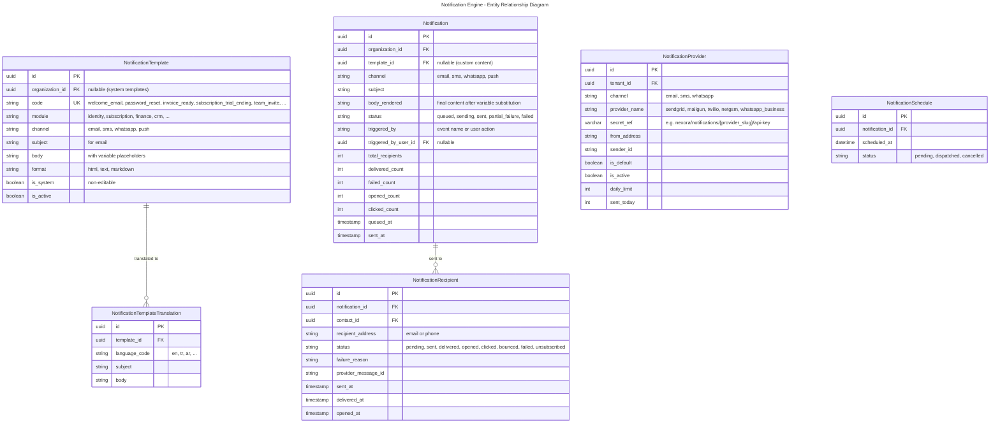
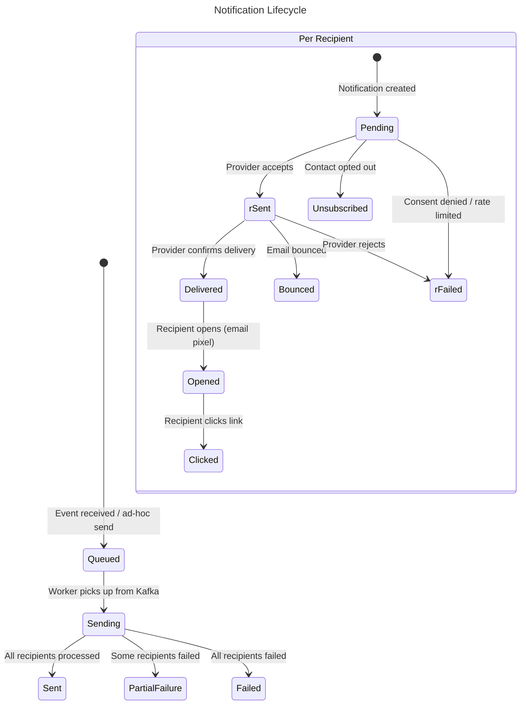
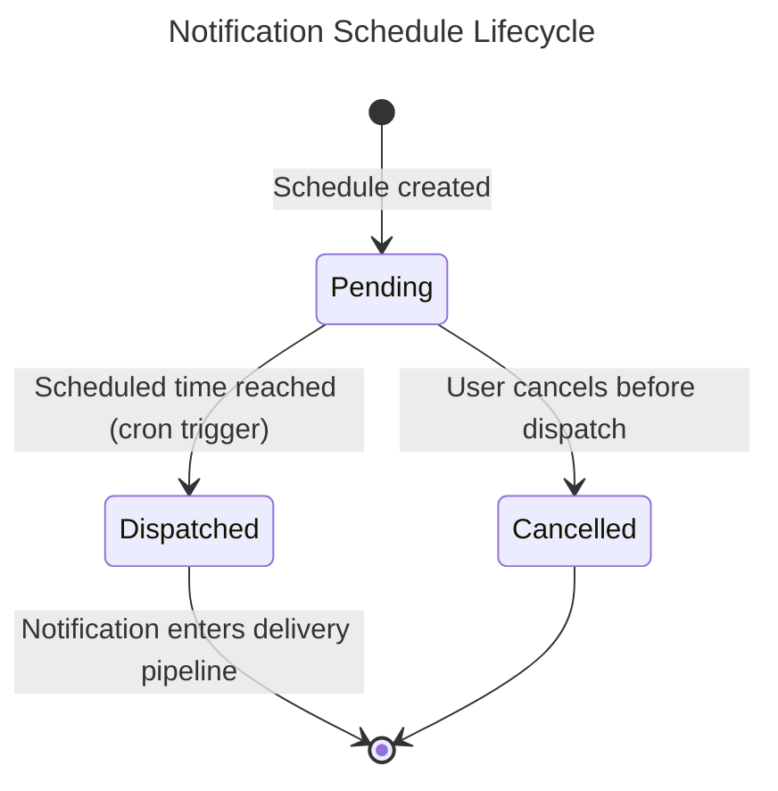
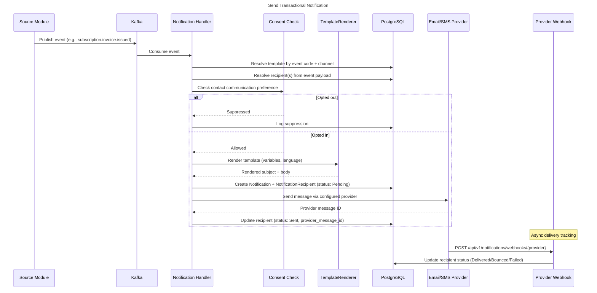
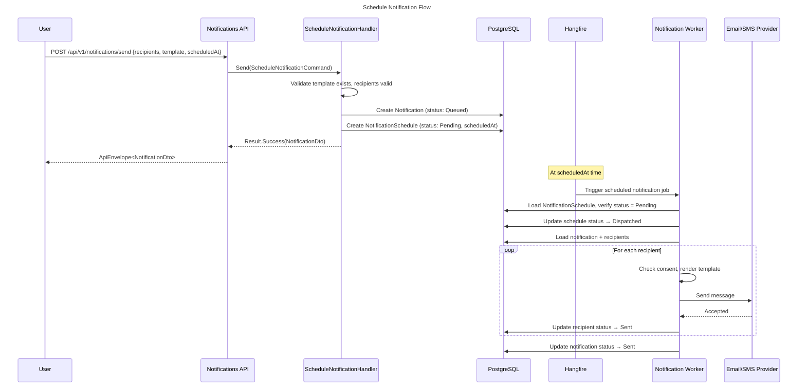
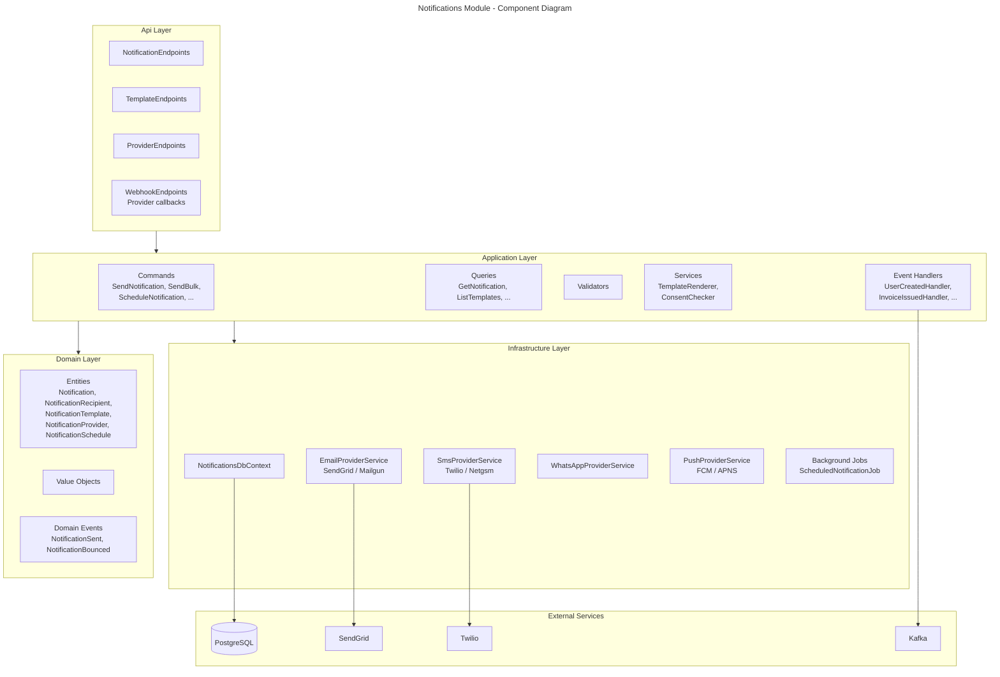
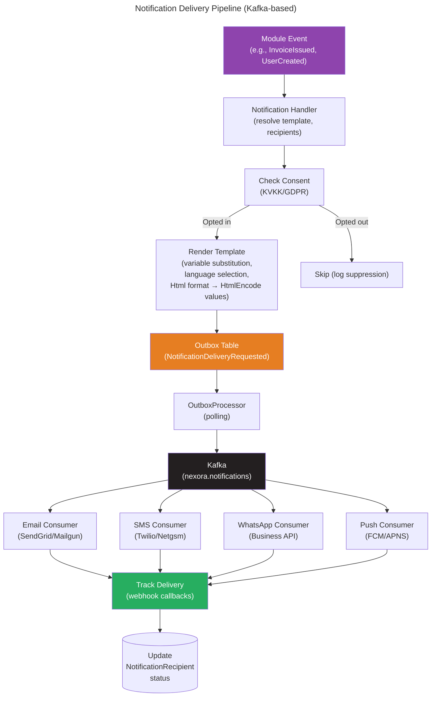

# Module: Notification Engine

**Tier:** 1 — Platform Core

> **Status**: Implemented
> **Module Name**: `notifications`
> **Tier**: Core/Platform (always installed)
> **Dependencies**: `identity`, `contacts`

## Overview
The Notification Engine is a **core platform module** that provides unified communication infrastructure for all other modules. It handles email, SMS, WhatsApp, and push notification delivery with template management, delivery tracking, bulk sending with throttling, and per-contact communication preferences/consent enforcement. No module sends notifications directly — they all publish events, and this module handles the delivery.

## Domain Model

### Entities



> **Security — Provider Credentials**: Provider credentials are never persisted in the application database. Only the secret-store reference key is stored in `secret_ref` (e.g. `nexora/notifications/sendgrid/api-key`); the live value is resolved at send time via `ISecretProvider.GetSecretAsync(provider.SecretRef, ct)` — Dapr secret store backed (HashiCorp Vault in production). The `ProviderConfig` record therefore holds a `SecretRef` string, not the actual API key or any base64-encoded form of it.

**PII retention — `body_rendered`:** The `body_rendered` column contains the fully-resolved notification payload (including recipient name, invoice total, donor amount, etc.) and is classified as PII.

- **Hot retention:** 30 days (for delivery troubleshooting + user-visible "notification history" in portal).
- **Cold storage:** after 30 days, `body_rendered` is set to NULL; only `template_key`, `rendered_variables_hash` (SHA-256 of the input variables), and delivery status are retained for audit (indefinite).
- **GDPR erasure:** on tenant/user deletion request, all `Notification` rows for that recipient are hard-deleted (not soft-deleted) — ADR-0008 GDPR path.
- **Tenant config key:** `notifications.retention.body_rendered_days` (default: 30, range: 7–90).
- Recurring job: `notifications:purge-rendered-bodies` runs daily at 03:00 UTC per tenant.

### Domain Events

| Event | Trigger | Consumers |
|-------|---------|-----------|
| `NotificationSent` | All recipients processed | Audit log |
| `NotificationDelivered` | Provider confirms delivery | Analytics |
| `NotificationOpened` | Recipient opens email | Campaign analytics (CRM) |
| `NotificationBounced` | Email bounced | Contacts (flag invalid email) |
| `NotificationFailed` | Delivery failed | Admin alert, retry queue |

### Entity Lifecycles





### Sequence Diagrams





### Component Diagram



### Integration Diagram

```mermaid
---
title: Notifications Module - Integration Diagram
---
flowchart LR
    subgraph ProducerModules["All Modules (Event Producers)"]
        Identity[Identity<br/>user.created,<br/>password.reset_requested,<br/>invitation.sent]
        Finance[Finance<br/>invoice.issued,<br/>payment.failed]
        Subscription[Subscription<br/>trial.ending_soon,<br/>renewal.upcoming]
        CRM[CRM<br/>lead.assigned,<br/>campaign.dispatch]
        Vertical[Vertical Editions (Tier 3)<br/>register their own templates]
    end

    subgraph Kafka["Kafka Event Bus"]
        Topics[Event Topics]
    end

    subgraph Notifications["Notifications Module"]
        Handlers[Event Handlers]
        Engine[Delivery Engine<br/>Consent + Render + Route]
        Providers[Provider Adapters]
        Webhooks[Webhook Receivers]
    end

    subgraph ExternalProviders["External Providers"]
        SendGrid[SendGrid / Mailgun]
        Twilio[Twilio / Netgsm]
        WhatsApp[WhatsApp Business]
        FCM[FCM / APNS]
    end

    subgraph Contacts["Contacts Module"]
        Prefs[Communication Preferences<br/>& Consent Records]
    end

    ProducerModules -->|Events| Topics
    Topics --> Handlers
    Handlers --> Engine
    Engine -->|Check consent| Prefs
    Engine --> Providers
    Providers --> ExternalProviders
    ExternalProviders -->|Delivery status| Webhooks
    Webhooks -->|Update status| Notifications
```

### Delivery Flow

Email and SMS delivery is **Kafka-based** via `NotificationDeliveryRequestedIntegrationEvent`, replacing the previous per-notification Hangfire job approach. When a notification is created, a `NotificationDeliveryRequested` domain event is raised, and its handler enqueues an integration event to the **Outbox**. The `OutboxProcessor` publishes it to Kafka, and the delivery consumer processes the actual send.



## Template Rendering

`TemplateRenderer` performs variable substitution on notification templates. Encoding behavior depends on the template's `Format` field (`TemplateFormat` enum: `Html`, `Text`, `Markdown`):

- **Html**: Variable values are encoded via `WebUtility.HtmlEncode` before substitution to prevent XSS in rendered HTML content.
- **Text / Markdown**: Variable values are inserted as-is without encoding.
- **Subject lines**: Never encoded regardless of template format. CR/LF characters are stripped from rendered subjects to prevent email header injection.

`RenderInlineSubject` is used for ad-hoc (non-template) subject lines: it performs variable substitution without HTML encoding and strips CR/LF characters. All three send commands (`SendNotification`, `SendBulkNotification`, `ScheduleNotification`) use `RenderInlineSubject` when a custom subject is provided instead of a template.

## Use Cases

### UC-NOT-001: Send Transactional Notification
- **Actor**: System (event-driven)
- **Flow**:
  1. Module publishes event (e.g., `subscription.invoice.issued`, `identity.user.created`)
  2. Handler resolves notification template by event code + channel
  3. Handler resolves recipient(s) from event payload
  4. Check contact's communication preference for channel
  5. If opted in: render template with variables (recipient name, invoice number, amount, etc.)
  6. Select language based on contact preference
  7. Queue message for delivery
  8. Worker sends via configured provider
  9. Track delivery status via provider webhooks
- **Business Rules**:
  - Transactional notifications bypass marketing consent (e.g., invoices, password reset, team invites)
  - Marketing notifications require explicit consent
  - Rate limit: max 1 notification per contact per event per hour (dedup)

### UC-NOT-002: Bulk Notification (Marketing)
- **Actor**: CRM Campaign module
- **Flow**:
  1. CRM creates campaign with segment + template
  2. CRM sends `crm.campaign.dispatch` event with recipient list
  3. Notification engine validates consent for all recipients
  4. Filters out opted-out contacts
  5. Sends in batches with throttling (configurable rate)
  6. Tracks per-recipient delivery + opens + clicks
  7. Reports results back to CRM campaign analytics
- **Business Rules**:
  - Throttling: max N messages/minute (configurable per provider)
  - Unsubscribe link auto-appended to all marketing emails
  - Time-zone aware scheduling (send at 10am recipient's local time)

## API Endpoints

| Method | Path | Description | Auth |
|--------|------|-------------|------|
| POST | `/api/v1/notifications/send` | Send ad-hoc notification | `notifications.send` |
| GET | `/api/v1/notifications/notifications` | List sent notifications | `notifications.read` |
| GET | `/api/v1/notifications/notifications/{id}` | Get delivery details | `notifications.read` |
| GET | `/api/v1/notifications/templates` | List templates | `notifications.templates.read` |
| POST | `/api/v1/notifications/templates` | Create template | `notifications.templates.manage` |
| PUT | `/api/v1/notifications/templates/{id}` | Update template | `notifications.templates.manage` |
| GET | `/api/v1/notifications/providers` | List providers | `notifications.providers.read` |
| PUT | `/api/v1/notifications/providers/{id}` | Configure provider | `notifications.providers.manage` |
| POST | `/api/v1/notifications/webhooks/{provider}` | Provider delivery webhook | Provider signature |

## Integration Points

### Events Consumed (from all modules)

Tier-1 templates shipped with the platform are domain-neutral SaaS templates:

| Template code | Triggered by | Channel | Purpose |
|---------------|--------------|---------|---------|
| `welcome_email` | `identity.user.created` | email | Welcome + getting-started |
| `password_reset` | `identity.password.reset_requested` | email | Self-service password reset link |
| `invoice_ready` | `subscription.invoice.issued` | email | Invoice available + PDF link |
| `subscription_trial_ending` | `subscription.trial.ending_soon` | email | Trial ending in N days, upgrade prompt |
| `team_invite` | `identity.invitation.sent` | email | Invite to join tenant/organization |

Tier-2 / Tier-3 modules register their own templates at startup (e.g. CRM `lead_assigned`, Fundraising `donation_receipt`, Education `enrollment_accepted`) — these are not shipped by the Notifications core.

> **Event naming convention.** Template-routing keys here use `{module}.{entity}.{action}` (lowercase dot). This is the notifications-side alias; the underlying Kafka event type names in each module's spec are PascalCase (e.g. `subscription.invoice.issued` → Subscription module emits `InvoiceIssued` on topic `nexora.subscription`). Notifications resolves the mapping at registration time.

| Event | Source | Action |
|-------|--------|--------|
| `identity.user.created` | Identity | Send welcome email |
| `identity.password.reset_requested` | Identity | Send password reset link |
| `identity.invitation.sent` | Identity | Send team invite |
| `subscription.invoice.issued` | Subscription (Tier 2) | Send invoice-ready email |
| `subscription.trial.ending_soon` | Subscription (Tier 2) | Send trial-ending reminder |
| `crm.lead.assigned` | CRM (Tier 2) | Notify assignee |
| `crm.campaign.dispatch` | CRM (Tier 2) | Bulk send campaign |

### Events Produced
| Event | Topic |
|-------|-------|
| `notifications.notification.delivered` | `nexora.notifications` |
| `notifications.notification.bounced` | `nexora.notifications` |
| `notifications.notification.opened` | `nexora.notifications` |
| `notifications.delivery.requested` (`NotificationDeliveryRequestedIntegrationEvent`) | `nexora.notifications` |

## Non-Functional Requirements

| Requirement | Target |
|------------|--------|
| Transactional delivery | < 30 seconds |
| Bulk throughput | 1,000 messages/minute |
| Email open tracking | Pixel tracking (< 1ms response) |
| Provider failover | Auto-switch to backup provider on failure |
| Retry policy | 3 retries with exponential backoff |
| Template rendering | < 50ms |

---

_Updated 2026-04-22 — Prompt 2 Agent E — In Review_
