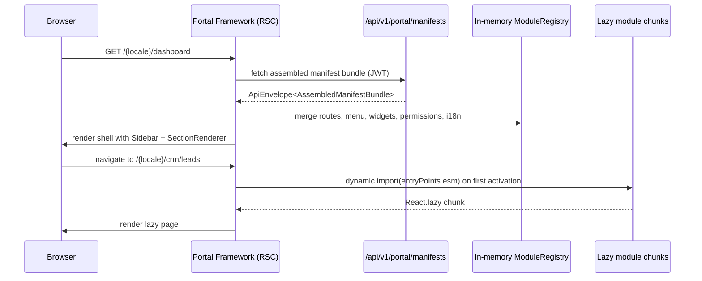
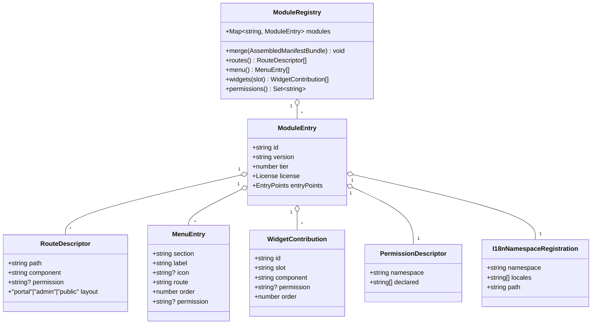

# Portal Framework

**Tier:** 1 — Platform Core

> **Status:** In Review — shipped in Phase 1.5, documented 2026-04-22
> **Version:** 1.5.0
> **Module Name:** `portal-framework`
> **Host Package:** `src/Clients/nexora-portal` (Next.js 16)
> **Dependencies:** Identity (session, permissions, tenant/organization context)

## Scope

The Portal Framework is the authenticated, tenant-facing web shell that hosts UI
contributed by other Nexora modules. Concretely it delivers:

- **Next.js 16 App Router** shell with server and client components.
- **Authentication** via NextAuth.js v5 + Keycloak OIDC (httpOnly cookie session,
  JWT access + refresh with silent rotation).
- **Locale-routed navigation** via `next-intl`: `/{locale}/...` with `en` and `tr`
  shipped; additional locales are additive (see [localization.md](../../../standards/localization.md)).
- **Module manifest registry** per [ADR-0017](../../../decisions/0017-portal-extension-architecture.md):
  routes, menu items, widget slot contributions, permissions, and i18n namespaces
  are merged into an in-memory registry at boot and lazy-loaded on first use.
- **Tenant branding** through `BrandingProvider` (CSS custom properties) and a
  `TenantLogo` component guarded by `isSafeUrl`.
- **Multi-currency display** via `formatMoney` (wraps `Intl.NumberFormat` with
  tenant default currency + per-call override).
- **RTL-ready layout** using logical CSS properties (`ms/me/start/end`) so future
  locales (e.g. Arabic) flip without per-component branches.
- **Data layer**: TanStack Query (server state) + Zustand (minimal client state)
  + Axios API client that unwraps `ApiEnvelope<T>`, propagates `Accept-Language`,
  and redirects on 401.
- **Slot aggregation** via `SectionRenderer` (`dashboard.main`, `dashboard.sidebar`,
  `home.hero`, extension slots TBD).
- **Guards**: `<RequireAuth>` and `<RequirePermission>` compose around routes and
  widgets; `useModules()` exposes the installed-module set.
- **Observability**: error boundary surfaces chunk-load and render failures with a
  `CorrelationId` link.
- **Test coverage**: 47 unit/integration tests across auth, manifest merge,
  permission guards, branding, and i18n routing.

## Out of scope

- **Tenant-admin functionality** — owned by `nexora-admin` (React 19 dashboard).
- **Server-side module implementation** — each backend module ships its own API
  surface and `module.manifest.yaml`; the Portal Framework only consumes the
  assembled manifest bundle.
- **Payment provider UIs** (Stripe/Iyzico flows) — owned by Donations / Subscription.
- **Marketplace installation UX** — deferred to the Nexora Management Portal (NMP)
  track.
- **Backend permission enforcement** — the portal hides UI; the backend always
  re-authorizes.

## Dependencies

| Dependency | Purpose |
|------------|---------|
| Identity | Session, JWT refresh, tenant_id / organization_id claims, permission set |
| APISIX gateway | Upstream routing and JWT validation for all API calls |
| Keycloak | OIDC authorization code flow (realm-per-tenant) |
| `GET /api/v1/portal/manifests` | Tenant-specific assembled manifest bundle (Phase 2 Milestone A; today the portal falls back to build-time imports) |

## Architecture overview

```mermaid
flowchart LR
  B[Browser]
  subgraph Next[Next.js 16 App Router]
    MW[middleware.ts<br/>getToken + locale redirect]
    L[Layout: Providers<br/>BrandingProvider, QueryClient, IntlProvider]
    RSC[RSC / CSR routes]
    SR[SectionRenderer slots]
  end
  subgraph Auth[NextAuth v5]
    NA[/api/auth/*]
    JWT[JWT + refresh rotation<br/>httpOnly cookie]
  end
  AX[Axios client<br/>ApiEnvelope unwrap<br/>Accept-Language<br/>401 redirect]
  GW[APISIX gateway]
  API[Backend modules]
  KC[Keycloak OIDC]

  B --> MW
  MW -->|token.error=RefreshAccessTokenError| NA
  MW --> L
  L --> RSC
  RSC --> SR
  NA --> KC
  NA --> JWT
  RSC --> AX
  AX --> GW
  GW --> API
```

Request life-cycle highlights:

- `middleware.ts` runs `getToken()`; if the token is missing or
  `token.error === 'RefreshAccessTokenError'`, it redirects to `/{locale}/login`
  preserving `callbackUrl`.
- `next-intl` middleware handles locale detection (`Accept-Language`,
  cookie, path prefix) and rewrites URLs to `/{locale}/...`.
- The Axios interceptor unwraps `ApiEnvelope<T>` into `T`, surfaces
  `lockey_` message keys to `useApiError`, and triggers a logout on 401.

## Manifest consumption

The portal implements the consumer side of
[ADR-0017 Portal Extension Architecture](../../../decisions/0017-portal-extension-architecture.md)
and [`architecture/portal-extensions.md`](../../../architecture/portal-extensions.md).

Boot sequence:



Until the `/api/v1/portal/manifests` endpoint ships in Phase 2 Milestone A, the
portal uses a **build-time fallback**: each module under
`nexora-portal/src/modules/{module}/manifest.ts` exports a typed `ModuleManifest`
that is composed at bundle time. The runtime registry API is identical, so the
switch-over is data-source-only.

## Extension surfaces

How modules contribute to the shell:

| Surface | Mechanism | Aggregator in the portal |
|---------|-----------|--------------------------|
| **Routes** | `routes[]` entries — React Server or Client Components; `layout: portal` | Next.js App Router + `React.lazy` |
| **Menu items** | `menu[]` — grouped by `section`, ordered by `order`, hidden when `permission` is absent | `<Sidebar>` component |
| **Widgets** | `widgets[]` — keyed by `slot` (`dashboard.main`, `dashboard.sidebar`, `home.hero`, plus extension-declared slots); sorted by `order` | `<SectionRenderer slot="..."/>` |
| **Permissions** | `permissions.declared[]` — merged into the set backing `usePermissions()` and `<RequirePermission>` | `usePermissions()` |
| **i18n namespaces** | `i18n.namespace` + `locales/{lang}.json` per module | `next-intl` dynamic namespace registration |
| **Branding hooks** | `BrandingProvider` exposes CSS vars (`--color-primary`, `--radius-md`, ...); `TenantLogo` consumes a validated URL | `BrandingProvider`, `TenantLogo` |

**Slot registry (v1):**

| Slot ID | Host location | Notes |
|---------|---------------|-------|
| `dashboard.main` | `/{locale}/dashboard` main column | Primary KPI / summary widgets |
| `dashboard.sidebar` | `/{locale}/dashboard` right rail | Compact widgets, recent activity |
| `home.hero` | `/{locale}` landing | Single hero block; first widget wins |
| `profile.sections` | `/{locale}/profile` | Extra profile tabs (e.g. Contacts "My profile") |

Unknown slots are logged and ignored; host/module version skew is surfaced in
dev only.

## Cross-module integration

| Module | Integration point |
|--------|-------------------|
| **Identity** | Source of session, JWT claims (`tenant_id`, `organization_id`), and the permission set bound to `usePermissions()`. Keycloak realm-per-tenant. |
| **Contacts** | "My profile" and "My contacts" routes mount into the portal only when the tenant has Contacts installed; permission-gated by `contacts.contact.view` on self. |
| **Notifications** | Provides a toast channel (consumed globally) and an optional inbox widget contributed to `dashboard.sidebar`. |
| **Any Tier-2/3 module** | Contributes routes, menu, widgets, permissions, and i18n via its manifest — no host changes required. |
| **Admin (nexora-admin)** | Separate host; the two frontends do not share runtime state. They share the same manifest schema. |

## Domain model — runtime registry shape

The Portal Framework owns **no database entities**. The authoritative in-memory
shape of the runtime registry is:



Field semantics follow the manifest v1 schema in
[ADR-0017](../../../decisions/0017-portal-extension-architecture.md) §`module.manifest.yaml schema (v1)`.

## Use cases

### UC-PF-001 — First login, locale detection, dashboard assembly
A user completes OIDC login. `next-intl` resolves the locale from
`Accept-Language` ("tr-TR" → `tr`, else `en`). The portal fetches the assembled
manifest bundle; `<Sidebar>` renders only menu items for installed modules the
user has permission on; `<SectionRenderer slot="dashboard.main">` renders widgets
contributed by those modules. No chunks for uninstalled modules are downloaded.

### UC-PF-002 — Partial permission visibility
A sales rep holds only `crm.lead.view`. They see CRM leads routes and the
pipeline-summary widget, but `crm.lead.create` buttons and the CRM admin
menu item are hidden. Other modules remain fully functional for their
permissions. Backend re-authorizes; client-side gating is UX-only.

### UC-PF-003 — Live branding update
Tenant admin changes logo URL and primary color in `nexora-admin`. Portal users
on the next client render (e.g., navigation to another route) pick up the new
`BrandingProvider` values over the branding query; no full page reload required.
`TenantLogo` rejects URLs that fail `isSafeUrl` and falls back to the default
wordmark. `isSafeUrl(url)` criteria: URL must use `https:` protocol; hostname must be
on the tenant's configured allowlist (`portal.iframe_allowlist` tenant config key);
relative URLs (`/path`) are always safe; `javascript:` and `data:` schemes are always
rejected.

### UC-PF-004 — Expired refresh token
The refresh grant fails at Keycloak. NextAuth sets
`token.error = 'RefreshAccessTokenError'`. `middleware.ts` detects this on the
next request and redirects to `/{locale}/login?callbackUrl={path}`, preserving
the user's locale. After re-auth, the user lands back on the original URL.

### UC-PF-005 — Module installed after the user logged in
Tenant admin installs the Subscription module. The user's next page navigation
triggers a fresh manifest fetch (SWR-style revalidation keyed by
`licenseHash + moduleVersionHash`); the new routes, menu items, and widgets
register lazily. Chunk fetch uses the module's `entryPoints.esm` path; Tier-4
modules verify SRI.

### UC-PF-006 — RTL locale rollout
A future Arabic locale ships with `dir="rtl"` at the `<html>` level. Because all
framework components use logical properties (`ms-*`, `me-*`, `start-*`, `end-*`)
and `rtl:` utilities for asymmetric cases, the layout flips correctly without
per-component branches. New modules inherit the behavior automatically.

## Non-functional requirements

| Dimension | Target |
|-----------|--------|
| Initial JS payload (shell only) | ≤ 150 KB gzipped |
| p95 Time-to-Interactive (cold, 4G) | ≤ 2.0 s |
| Module chunk budget (per module first-load) | ≤ 100 KB gzipped |
| Lighthouse — Accessibility | ≥ 90 |
| Accessibility conformance | WCAG 2.1 AA |
| Locale coverage | `en` + `tr` required; framework must not break on missing module keys (fallback to `en` with warning) |
| Browser support | Evergreen Chromium, Firefox, Safari (latest 2 majors); no IE11 |
| Error isolation | One failing module chunk MUST NOT brick the host — the error boundary renders a recoverable panel |

## API surface

The Portal Framework **owns zero outbound API endpoints**. It consumes endpoints
owned by other modules through the APISIX gateway. The one implicit endpoint it
depends on is:

| Method | Path | Owner | Status |
|--------|------|-------|--------|
| `GET` | `/api/v1/portal/manifests` | Portal Framework (backend) | Phase 2 Milestone A — stub today returns build-time imports |

Response shape: `ApiEnvelope<AssembledManifestBundle>` as specified in
[`portal-extensions.md`](../../../architecture/portal-extensions.md) §3.

## Events produced / consumed

None. The portal is a UI host; integration events are a backend concern (see
[`MODULE_SYSTEM.md`](../../../architecture/MODULE_SYSTEM.md)). Future work may add
telemetry spans (`portal.chunk.load`, `portal.manifest.merge`) — scoped to
observability, not domain events.

## Permissions

The Portal Framework declares **no feature permissions**; it only enforces
permissions declared by other modules via the manifest. It does declare a small
set of **meta-permissions** for shell-level administration (UI that lives inside
the portal for the tenant admin persona):

| Permission | Purpose |
|------------|---------|
| `portal.branding.view` | Read branding config (logo, primary color, radius) |
| `portal.branding.manage` | Create/update/delete branding config |
| `portal.settings.view` | Read portal-scoped settings (enabled locales, default landing, slot configuration) |
| `portal.settings.manage` | Mutate portal-scoped settings |

Backend permission enforcement: backend modules re-authorize every request. The
portal's `<RequirePermission>` is UX-only (hide controls the user cannot use).

## Standards Additions

> The orchestrator will merge the rows below into the canonical
> [`standards/permissions.md`](../../../standards/permissions.md) and
> [`standards/audit-coverage.md`](../../../standards/audit-coverage.md).
> They are module-scoped and SHOULD NOT be edited in place in those files.

### Permission matrix additions (§5 of `permissions.md`)

Scope: **Tenant**. Format: `{module}.{resource}.{action}` — three tokens, lowercase.

| Permission | Description | Platform Admin | Tenant Admin | Tenant User | Portal User |
|------------|-------------|:--------------:|:------------:|:-----------:|:-----------:|
| `portal.branding.view` | View tenant branding configuration | — | ✓ | ✓ | ✓ |
| `portal.branding.manage` | Create/update/delete tenant branding (logo, colors, radius) | — | ✓ | — | — |
| `portal.settings.view` | View portal-scoped settings (enabled locales, slot config) | — | ✓ | ✓ | — |
| `portal.settings.manage` | Mutate portal-scoped settings | — | ✓ | — | — |

Platform permissions (`nmp.*`) — none from this module.

### Audit coverage additions (§3 baseline matrix row + §4 operation notes)

Module row (replaces the placeholder `Portal Framework` row in
[`audit-coverage.md`](../../../standards/audit-coverage.md) §3):

| Module | create | update | delete | read-sensitive | security-event |
|--------|:------:|:------:|:------:|:-------------:|:--------------:|
| **Portal Framework** | MUST (`portal.branding.created`, `portal.settings.created`) | MUST (`portal.branding.updated`, `portal.settings.updated`) | MUST (`portal.branding.deleted`, `portal.settings.deleted`) | MAY | MUST (portal-user identity linkage change; public endpoint exposure toggle) |

Explicit audit events emitted:

| Event key | Class | Classification | Rationale |
|-----------|-------|----------------|-----------|
| `portal.branding.created` | `create` | MUST | Tenant-wide visible change |
| `portal.branding.updated` | `update` | MUST | Tenant-wide visible change; brand impersonation risk |
| `portal.branding.deleted` | `delete` | MUST | Reverts tenant to defaults; must be reconstructable |
| `portal.settings.created` | `create` | MUST | Slot / locale config affects every user |
| `portal.settings.updated` | `update` | MUST | Changes shell behavior globally |
| `portal.settings.deleted` | `delete` | MUST | Reverts to defaults; must be reconstructable |
| `portal.branding.viewed` / `portal.settings.viewed` | `read` | MAY | Low-sensitivity reads; opt-in per tenant |

## References

- [ADR-0017 Portal Extension Architecture](../../../decisions/0017-portal-extension-architecture.md)
- [Portal Extensions — long-form](../../../architecture/portal-extensions.md)
- [Module System](../../../architecture/MODULE_SYSTEM.md)
- [Permissions Standard](../../../standards/permissions.md)
- [Audit Coverage Standard](../../../standards/audit-coverage.md)
- [Localization Standard](../../../standards/localization.md)
- [UX/UI Standard](../../../standards/ux-ui.md)
- [Documentation Style](../../../standards/documentation-style.md)
- [Identity SPEC](../identity/SPEC.md) — session, permissions, tenant context
- [Contacts SPEC](../contacts/SPEC.md) — "My profile" contributions into the portal

## Open items

- TODO(maintainer): publish `docs/standards/schemas/module.manifest.v1.json`
  (Phase 2 Agent B) and link from this spec.
- TODO(maintainer): ship `GET /api/v1/portal/manifests` backend endpoint in
  Phase 2 Milestone A and retire the build-time fallback path.
- TODO(maintainer): formalize the slot registry (`dashboard.*`, `home.hero`,
  `profile.sections`) in a host-side `slots.ts` export and reference it here.
- TODO(maintainer): add a third shipped locale to exercise the RTL path end-to-end
  before claiming Arabic readiness.

---

Status: In Review — 2026-04-22
