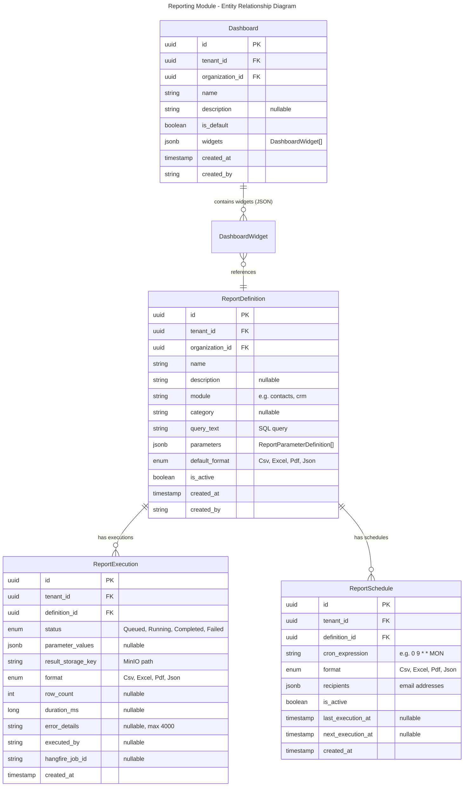
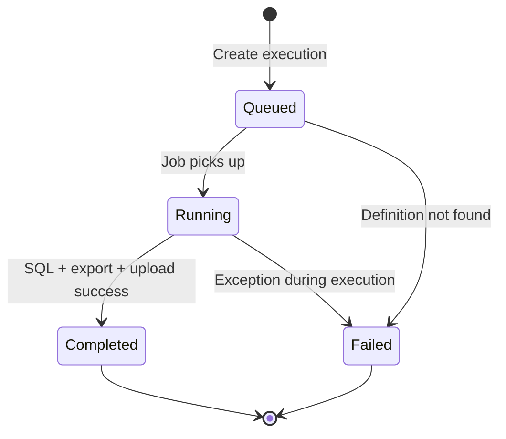
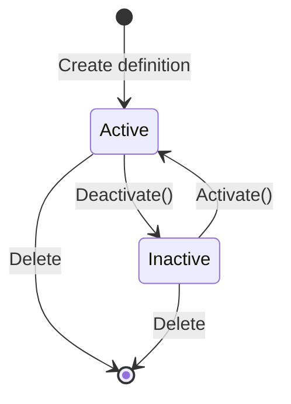
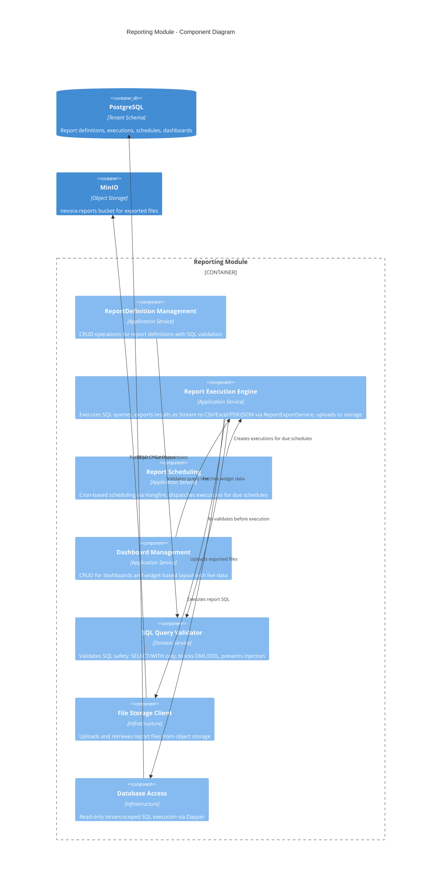
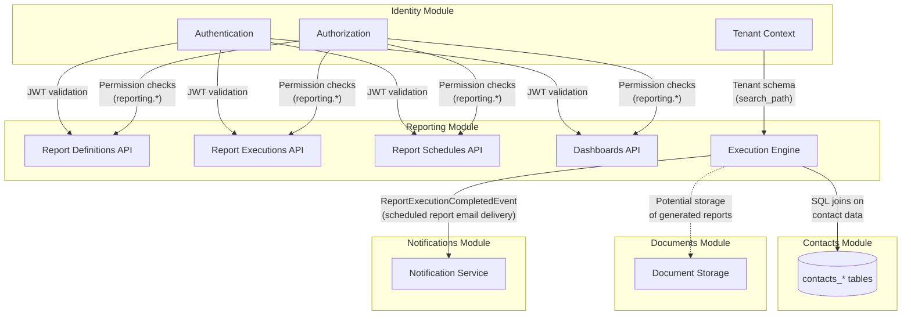
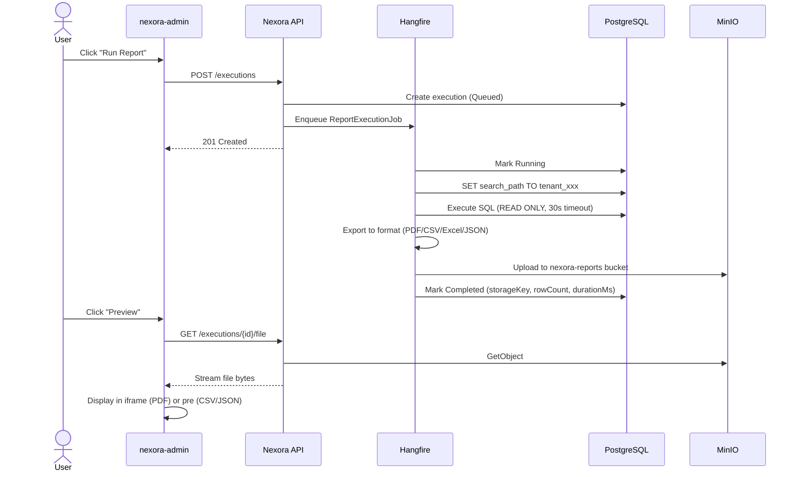
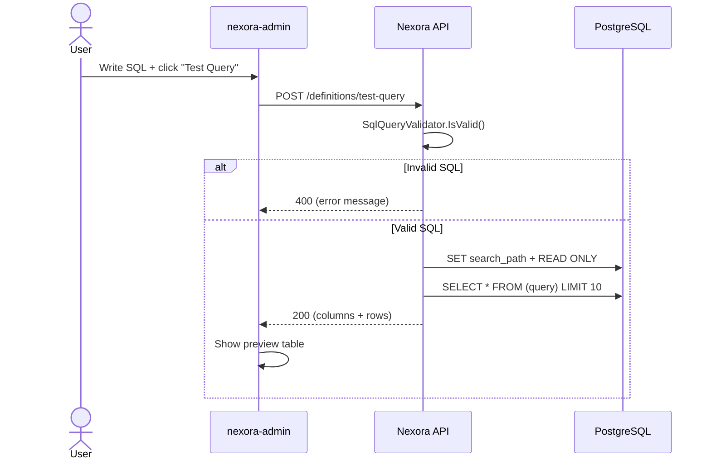
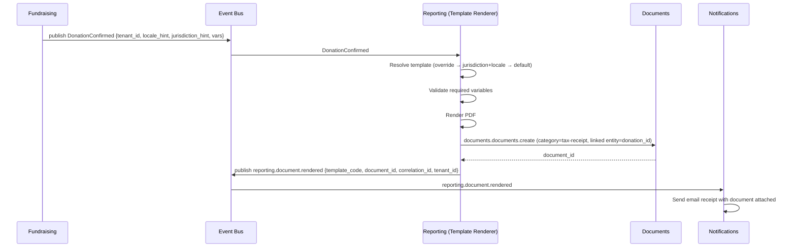

# Module: Reporting Engine

> Updated 2026-04-22 — added Tax Receipt & Financial Document Templates section.

**Tier:** 1 — Platform Core

> **Status**: Implemented
> **Module Name**: `reporting`
> **Version**: `1.0.0`
> **Tier**: Core/Platform (always installed)
> **Dependencies**: `identity` (required)
> **Optional Dependencies**: `contacts`, `notifications`, `documents` (for cross-module SQL joins and scheduled email delivery)

## Overview
The Reporting module provides SQL-based report definitions, on-demand and scheduled execution, multi-format export (CSV, Excel, PDF, JSON), and dashboard analytics across all Nexora modules. Reports execute within the tenant's PostgreSQL schema using read-only transactions, with results stored in MinIO. It supports parameterized queries, cron-based scheduling, and a widget-based dashboard builder.

## Domain Model

### Entities

### Value Objects

| Type | Description |
|------|-------------|
| `ReportDefinitionId` | Strongly-typed GUID for report definitions |
| `ReportExecutionId` | Strongly-typed GUID for executions |
| `ReportScheduleId` | Strongly-typed GUID for schedules |
| `DashboardId` | Strongly-typed GUID for dashboards |
| `ReportParameterDefinition` | Parameter spec: name, type (String/Number/Date/Boolean/Money), required, defaultValue. `Money` parameters bind to `SharedKernel.Money` (amount + ISO currency) — see ADR-0021; never split into separate `amount` + `currency` parameters |
| `DashboardWidget` | Widget spec: id, type, title, reportDefinitionId, chartType, position (x,y), size (w,h), config |

### Enums

| Enum | Values |
|------|--------|
| `ReportStatus` | `Queued`, `Running`, `Completed`, `Failed` |
| `ReportFormat` | `Csv`, `Excel`, `Pdf`, `Json` |
| `WidgetType` | `Chart`, `Kpi`, `Table` |
| `ChartType` | `Bar`, `Line`, `Pie`, `Area` |

### Domain Events

| Event | Trigger |
|-------|---------|
| `ReportExecutionCompletedEvent` | Execution marked as Completed |
| `ReportScheduleCreatedEvent` | New schedule created |

## State Diagrams

### Report Execution Lifecycle

### Report Definition Lifecycle

## Architecture Diagrams

### C4 Component Diagram

### Integration Diagram

## API Endpoints

All endpoints require authorization. Responses wrapped in `ApiEnvelope<T>`.

### Report Definitions (`/api/v1/reporting/definitions`)

| Method | Path | Description |
|--------|------|-------------|
| `GET` | `/` | List definitions (paginated, filterable by module, category, search) |
| `GET` | `/{id}` | Get single definition |
| `POST` | `/` | Create definition (SQL validated by SqlQueryValidator) |
| `PUT` | `/{id}` | Update definition (SQL validated) |
| `DELETE` | `/{id}` | Delete definition (returns 200 OK with ApiEnvelope) |
| `POST` | `/test-query` | Test SQL with LIMIT 10, return preview results |

### Report Executions (`/api/v1/reporting/executions`)

| Method | Path | Description |
|--------|------|-------------|
| `GET` | `/` | List executions (filterable by definitionId, status) |
| `GET` | `/{id}` | Get single execution |
| `POST` | `/` | Queue new execution (creates Hangfire job) |
| `GET` | `/{id}/download` | Get presigned download URL (1h expiry) |
| `GET` | `/{id}/file` | Stream file directly through API (PDF, CSV, etc.) |

### Report Schedules (`/api/v1/reporting/schedules`)

| Method | Path | Description |
|--------|------|-------------|
| `GET` | `/` | List schedules (filterable by definitionId) |
| `POST` | `/` | Create schedule |
| `PUT` | `/{id}` | Update schedule (cron, format, recipients) |
| `DELETE` | `/{id}` | Delete schedule (returns 200 OK with ApiEnvelope) |

### Dashboards (`/api/v1/reporting/dashboards`)

| Method | Path | Description |
|--------|------|-------------|
| `GET` | `/` | List dashboards |
| `GET` | `/{id}` | Get single dashboard |
| `POST` | `/` | Create dashboard |
| `PUT` | `/{id}` | Update dashboard (name, widgets, isDefault) |
| `DELETE` | `/{id}` | Delete dashboard (returns 200 OK with ApiEnvelope) |
| `GET` | `/{dashboardId}/widgets/{widgetId}/data` | Execute widget's SQL and return data |

## Sequence Diagrams

### Report Execution Flow

### Test Query Flow

## SQL Security

Report queries are validated and sandboxed at multiple levels:

1. **SqlQueryValidator** (create, update, and execution time):
   - Query must start with `SELECT` or `WITH`
   - Forbidden keywords blocked: `INSERT`, `UPDATE`, `DELETE`, `DROP`, `ALTER`, `CREATE`, `TRUNCATE`, `EXEC`, `EXECUTE`, `GRANT`, `REVOKE`, `MERGE`, `CALL`, `COPY`
   - Semicolons disallowed (prevents statement chaining)
   - Word boundary regex matching (avoids false positives in column names)

2. **Execution sandbox**:
   - `SET TRANSACTION READ ONLY` enforced at database level
   - `SET search_path TO 'tenant_{id}'` for tenant isolation
   - 30-second query timeout
   - Dapper parameterized queries (prevents SQL injection in parameters)

## Background Jobs

| Job | Schedule | Queue | Description |
|-----|----------|-------|-------------|
| `ReportExecutionJob` | On-demand (Hangfire enqueue) | `default` | Executes SQL, exports, uploads to MinIO |
| `ScheduledReportDispatcherJob` | Every 15 minutes | `default` | Finds due schedules using Cronos for cron expression parsing, creates executions |

## Storage

- **Bucket**: `nexora-reports` (shared across tenants)
- **Key pattern**: `reports/{tenantId}/{executionId}.{extension}`
- **Bucket creation**: On-demand via `EnsureBucketExistsAsync`
- **Download**: API-proxied file streaming (`/file` endpoint) or presigned URL (`/download` endpoint)
- **Public endpoint**: Configurable `PublicEndpoint` in `MinioStorageOptions` for browser-accessible presigned URLs

## Frontend Components

### Pages

| Page | Route | Description |
|------|-------|-------------|
| `ReportListPage` | `/reporting/reports` | List definitions, create dialog with SQL editor |
| `ReportDetailPage` | `/reporting/reports/:id` | View definition, execution history, edit/delete, preview/download |
| `ReportScheduleListPage` | `/reporting/schedules` | List and manage schedules |
| `DashboardListPage` | `/reporting/dashboards` | List dashboards |
| `DashboardViewPage` | `/reporting/dashboards/:id` | View dashboard with widgets |

### Key Components

| Component | Description |
|-----------|-------------|
| `SqlEditor` | CodeMirror editor with PostgreSQL syntax highlighting |
| `SqlTestResult` | Table rendering test query results (columns + rows) |
| `ReportStatusBadge` | Color-coded status badge (Queued/Running/Completed/Failed) |
| `ReportParameterForm` | Dynamic form for report parameters |
| `ChartWidget` | Recharts-based chart (Bar, Line, Area, Pie) |
| `KpiWidget` | Single-value KPI display |
| `TableWidget` | Data table for dashboard |
| `DashboardGrid` | Positioned widget grid layout |

### Hooks

| Hook | Description |
|------|-------------|
| `useReportDefinitions` | List definitions with pagination/filters |
| `useReportDefinition` | Get single definition |
| `useCreateReportDefinition` | Create mutation |
| `useUpdateReportDefinition` | Update mutation |
| `useDeleteReportDefinition` | Delete mutation |
| `useTestReportQuery` | Test SQL query mutation |
| `useReportExecutions` | List executions |
| `useExecuteReport` | Queue execution mutation |
| `useReportFile` | Download file as blob |

## Tax Receipt & Financial Document Templates

### Purpose

Reporting hosts locale-aware receipt and financial-document templates that other modules
invoke. This keeps document layout concerns out of domain modules and lets templates be
revised without touching business logic.

### Supported Template Categories (Tier-1 Baseline)

| Template code | Description | Trigger |
|---------------|-------------|---------|
| `donation_receipt_tr` | Turkish bağış makbuzu (Vakıflar Genel Müdürlüğü / Diyanet compatible layout) | `Fundraising.DonationConfirmed` |
| `donation_receipt_us` | US 501(c)(3) tax-deductible donation receipt | `Fundraising.DonationConfirmed` (selected by tenant default currency + jurisdiction) |
| `annual_donor_statement_tr` | Turkish year-end aggregate donor statement | Scheduled job (not event-triggered) |
| `annual_donor_statement_us` | US year-end aggregate donor statement | Scheduled job (not event-triggered) |
| `invoice_tr` | Turkish subscription invoice PDF | `Subscription.InvoiceIssued` |
| `invoice_us` | US subscription invoice PDF | `Subscription.InvoiceIssued` |

> e-Fatura compatibility is a `TODO(maintainer)` — current scope is the human-readable
> PDF, not the GIB XML envelope.

### Template Selection Rule

Fundraising/Subscription publishes an event carrying `tenant_id`, `locale_hint`, and
`jurisdiction_hint`. Reporting resolves the template as follows:

1. Explicit template override in tenant settings wins.
2. Otherwise the `(jurisdiction, locale)` pair matches a shipped template.
3. Otherwise fallback to `donation_receipt_default` (English, neutral layout).

### Template Variables Contract

Each template declares its required variables (e.g. donor name, donor tax id, `amount`,
category, campaign, `receipt_number`). The caller module supplies these in the event
payload or a follow-up query; Reporting validates and rejects with
`report.template.variable_missing` if any required variable is absent.

**Monetary variables — ADR-0021 compliance.** Monetary template variables MUST be typed
as `SharedKernel.Money` (amount + ISO 4217 currency code) — never as separate `amount`
(decimal) + `currency` (string) fields. Templates reference a single `{{amount}}` token
(or `{{total}}`, `{{subtotal}}`, etc. depending on template) which the renderer formats
as a localized, currency-symbolled string using the tenant's locale and the `Money`
value object's own ISO currency. For example, `Money(250.00, "TRY")` rendered under
`tr-TR` emits `250,00 ₺`; under `en-US` with `Money(250.00, "USD")` it emits `$250.00`.
Callers MUST NOT pass `{{currency}}` as a separate token — the renderer derives the
symbol/code from the `Money` instance.

Non-monetary decimals (percentages, counts, ratios, tax rates) remain plain `decimal`
and are not affected by this rule.

### Rendered Output Storage

Rendered PDFs are persisted via the Documents module (`documents.documents.create`) under
a system folder keyed by `category=tax-receipt` and linked back to the originating entity
(donation id, invoice id). Reporting returns the `document_id` to the caller; the caller
links it in its own record. See [Documents SPEC](../documents/SPEC.md) for the template
rendering interop surface.

### i18n

Templates use `lockey_reporting_receipt_*` keys for UI labels; jurisdiction boilerplate
(tax deductibility notice, legal entity footer) lives in the template body itself (not
`lockey_` — jurisdiction-bound, not UI-label). See
[Localization Standards](../../../standards/localization.md).

### Cross-Module Events

| Direction | Event | Effect |
|-----------|-------|--------|
| Consumed | `Fundraising.DonationConfirmed` | Triggers `donation_receipt_{locale}` rendering |
| Consumed | `Subscription.InvoiceIssued` | Triggers `invoice_{locale}` rendering |
| Produced | `reporting.document.rendered` | Carries `template_code`, `document_id`, `correlation_id`, `tenant_id` |

See [Fundraising SPEC §5](../../tier-3a-ngo/fundraising/SPEC.md) for the donor-facing
contract.

### Receipt Rendering Sequence

### TODO(maintainer)

- e-Fatura XML envelope path (GIB requirement for TR corporate invoices above the
  statutory threshold).
- Additional locales (AR / FR) — scheduled for Phase 3+ based on tenant demand.
- Legal review sign-off workflow on template body changes.

## Permissions

| Permission | Description |
|------------|-------------|
| `reporting.definition.read` | View report definitions |
| `reporting.definition.manage` | Create, update, delete definitions |
| `reporting.execution.read` | View report executions |
| `reporting.execution.run` | Execute reports |
| `reporting.schedule.manage` | Manage report schedules |
| `reporting.dashboard.read` | View dashboards |
| `reporting.dashboard.manage` | Create, update, delete dashboards |

## Export Formats

`ReportExportService` returns a `Stream` for all formats (not `byte[]`), enabling efficient streaming to storage and HTTP responses without buffering entire files in memory.

| Format | Library | Content-Type |
|--------|---------|-------------|
| CSV | CsvHelper | `text/csv` |
| Excel | ClosedXML | `application/vnd.openxmlformats-officedocument.spreadsheetml.sheet` |
| PDF | QuestPDF | `application/pdf` |
| JSON | System.Text.Json | `application/json` |

## Localization

65 translation keys across `en` and `tr` locales covering:
- Navigation, labels, status badges
- Validation messages
- Toast notifications
- Error messages (invalid query, execution failures)
- Action buttons (execute, download, preview, edit, delete, test query)
