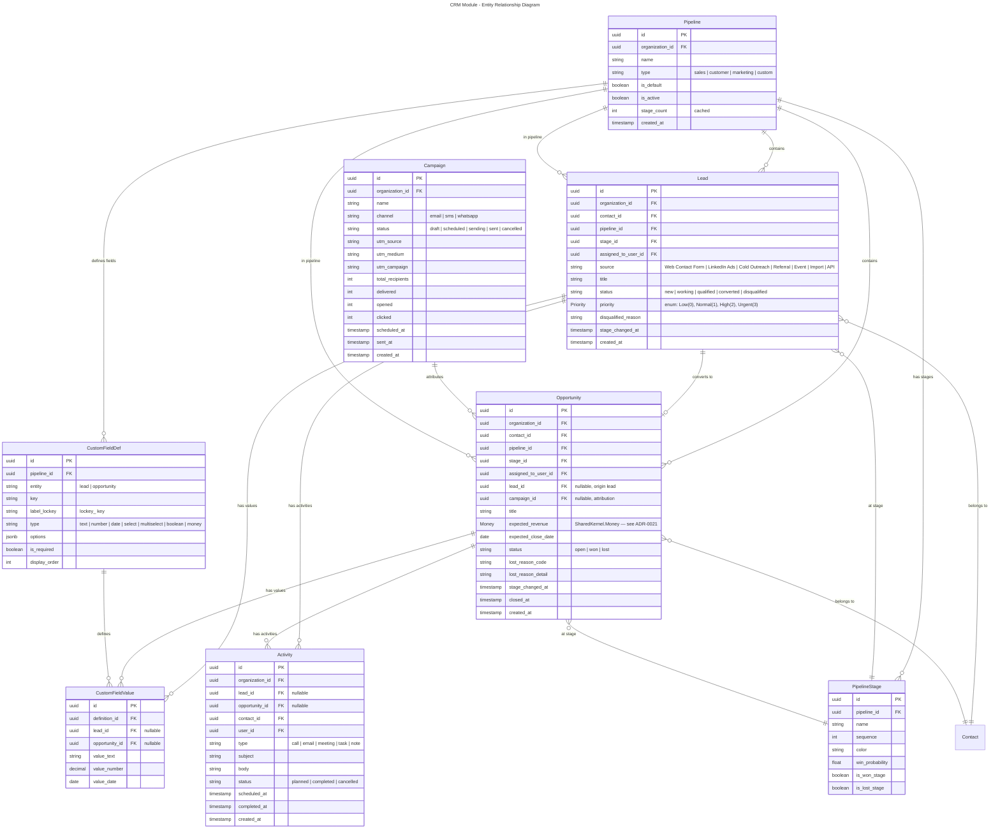
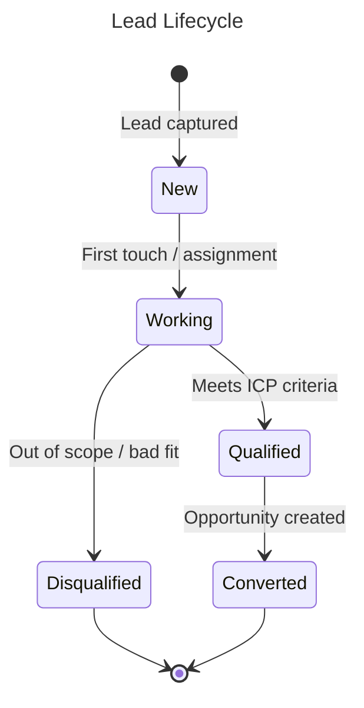
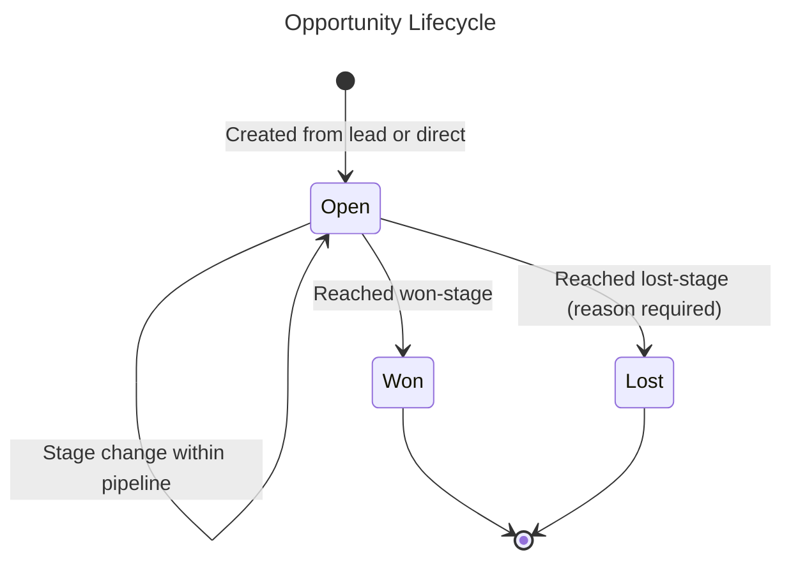
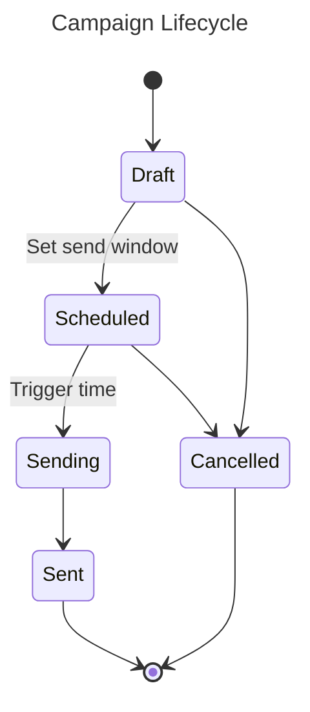
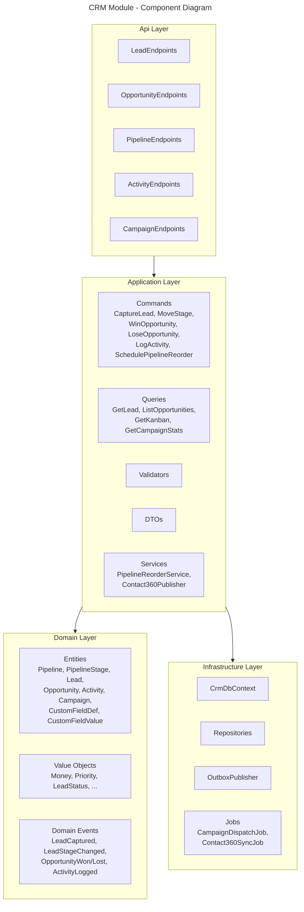
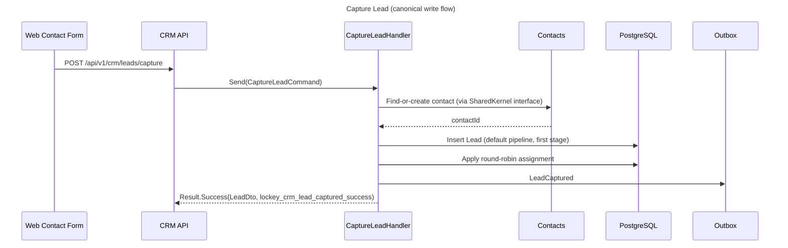
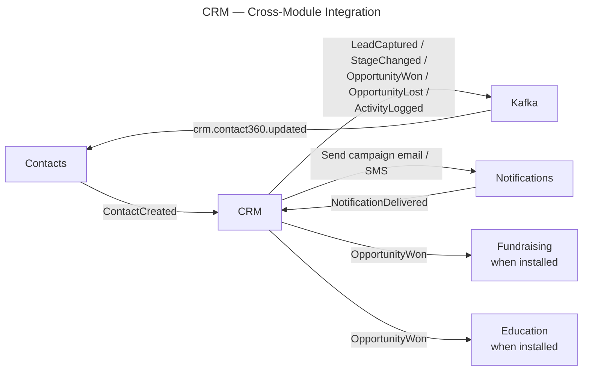

# Module: CRM (Customer Relationship Management)

**Tier:** 2 — Enterprise Edition
**Module ID:** `crm`
**Scope:** Generic B2B/SaaS lead, opportunity, pipeline, activity, and marketing-campaign management for enterprise tenants. Domain-neutral — no vertical (NGO, education, healthcare) vocabulary.
**Out of scope:** Vertical sub-pipelines such as donor acquisition (owned by Tier-3a Fundraising) and student enrollment (owned by Tier-3b Education). Advanced workflow automation engine (deferred to Phase 2.5). Quote-to-cash and invoicing (owned by Tier-2 Finance / Subscription).
**Dependencies:** `identity` (Tier 1), `contacts` (Tier 1), `notifications` (Tier 1), `audit` (Tier 1), `documents` (Tier 1, optional attachments), `SharedKernel.Money` (see [multi-currency.md](../../../standards/multi-currency.md)).

## Overview

The CRM module manages the full lifecycle of **leads**, **opportunities**, and **customer relationships** for generic B2B/SaaS tenants. It covers lead capture from multiple sources (web contact form, marketing ads, imports, manual entry, API), configurable per-organization **pipelines** with user-editable **stages**, activity tracking (calls / emails / meetings / tasks), marketing campaigns over the Notifications module, and per-pipeline **custom fields**. Contact identity is owned by the Tier-1 Contacts module; CRM publishes a lightweight 360-view summary back to Contacts via an event-driven cache (see §Integration Points).

Vertical sub-pipelines live in their own editions: Fundraising (Tier 3a) adds donor-acquisition pipelines, Education (Tier 3b) adds student-enrollment pipelines. Both consume CRM events when installed.

## Domain Model

### Entities

### Value Objects

| Value Object | Description |
|--------------|-------------|
| `LeadId`, `OpportunityId`, `PipelineId`, `StageId`, `CampaignId`, `ActivityId` | Strongly-typed identifiers (per CODING_STANDARDS). |
| `Money` | Amount + ISO currency, from `Nexora.SharedKernel.Money` (see [multi-currency.md](../../../standards/multi-currency.md)). Used for `Opportunity.expected_revenue`. |
| `Priority` | Enum: Low(0), Normal(1), High(2), Urgent(3). |
| `LeadStatus` | Enum: New, Working, Qualified, Converted, Disqualified. |
| `OpportunityStatus` | Enum: Open, Won, Lost. |
| `ActivityType` | Enum: Call, Email, Meeting, Task, Note. |
| `PipelineType` | Enum: **Sales, Customer, Marketing, Custom**. |
| `LeadSource` | Closed-ish string set: `Web Contact Form`, `LinkedIn Ads`, `Cold Outreach`, `Referral`, `Event`, `Import`, `API`, plus tenant-defined. |

### Domain Events

See §Integration Points for topic names. Entity lifecycles below.

### Entity Lifecycles

### Component Diagram

### Write / Read Sequence

## Use Cases

All examples are **B2B/SaaS**.

### UC-CRM-001: Capture Lead from Web Contact Form → Qualify → Create Opportunity
- **Actor:** Web Contact Form (anonymous) then SDR with `crm.leads.write`.
- **Flow:**
  1. Marketing site posts to `/api/v1/crm/leads/capture` with UTM params; lead lands in default **sales** pipeline, stage `New`.
  2. Round-robin assigns to an SDR; `Notifications.NotificationDelivered` confirms the assignment email arrived.
  3. SDR works the lead through `Working` → `Qualified`; on qualification, creates an `Opportunity` with expected ARR and close date.
- **Rules:** duplicate lead (same contact + pipeline within 30 days) updates existing; UTMs retained for campaign attribution.

### UC-CRM-002: Pipeline Stage Reorder by RevOps Admin
- **Actor:** RevOps admin with `crm.pipelines.manage`.
- **Flow:** Admin reorders stages in the `sales` pipeline via drag-and-drop; handler validates no lost/won stage is moved into a non-terminal position; publishes `PipelineStageReordered` (internal) and invalidates Kanban cache.
- **Rules:** Reorder is atomic; in-flight opportunities retain their current stage; probability recomputed on next view.

### UC-CRM-003: Win / Loss with Reason Code
- **Actor:** Account Executive with `crm.opportunities.write`.
- **Flow:** AE drags opportunity to a won- or lost-stage; on loss, system requires a reason code from tenant-defined list (`Price`, `No Budget`, `Competitor`, `No Decision`, `Other`); emits `OpportunityWon` or `OpportunityLost` with amount + currency.
- **Rules:** Won amount requires currency; can't close an opportunity already closed; reopen requires `crm.opportunities.manage`.

### UC-CRM-004: Marketing Campaign Attribution to Pipeline
- **Actor:** Marketer with `crm.campaigns.manage`.
- **Flow:** Create a `LinkedIn Ads` campaign, launch via Notifications Engine, track delivered / opened / clicked. Leads captured with matching UTM params are auto-linked to the campaign; opportunities created from those leads inherit `campaign_id` for ROI reporting.
- **Rules:** Consent enforced upstream by Notifications; a campaign cannot be edited once `Sending`.

### UC-CRM-005: SDR Activity Logging on a Cold Outreach Sequence
- **Actor:** SDR with `crm.activities.write`.
- **Flow:** SDR logs a `call` (or `email`) activity against a lead sourced from `Cold Outreach`; activity surfaces on the lead, on the linked contact's Contacts 360-view (event-driven), and in the SDR's activity report.
- **Rules:** Scheduled (future) and logged (past) activities both allowed; overdue planned activities trigger a reminder notification.

## Pipelines

- **CRUD:** Each organization owns its pipelines. `crm.pipelines.manage` creates / renames / archives a pipeline. A pipeline is `active` or archived; archived pipelines are read-only and hidden from Kanban pickers.
- **Types:** `sales` (revenue funnel), `customer` (post-sale success / renewal), `marketing` (MQL nurture), `custom` (tenant-defined). `enrollment` and donor-acquisition are **not** part of CRM — they ship with their vertical editions.
- **Stages:** Add / rename / remove / **reorder** stages. Each stage has a sequence, color, and probability. Exactly one won-stage and one lost-stage must be flagged per pipeline; removing a stage with in-flight opportunities requires a migration target stage.
- **Per-pipeline custom fields:** `CustomFieldDef` rows are scoped to a pipeline and to either `lead` or `opportunity`; values live in `CustomFieldValue`. Field labels use `lockey_` keys (see [localization.md](../../../standards/localization.md)).
- **Workflow automation (v1, manual):** A stage transition MAY trigger a single side-effect: send a templated email via Notifications or create a follow-up task (`Activity` of type `task`). Rules are stored as simple `{stage_from, stage_to, action}` rows and executed inline by the stage-change handler.
- **Advanced workflow engine (deferred):** Multi-step branching automations, time-based triggers, and approval chains are **Phase 2.5**. TODO(maintainer): open an ADR when Phase 2.5 kicks off.

## Contacts 360-View Integration

CRM contributes a lightweight summary to the Contacts 360-view per the Contacts spec §360-View Module Integration. The contract:

| Field | Value |
|-------|-------|
| `active_lead_count` | Count of leads for this contact with status in `{New, Working, Qualified}`. |
| `top_open_opportunity` | Highest-value open opportunity for the contact: `{id, title, amount, currency, stage}`. |
| `last_crm_activity` | Most recent completed activity: `{type, occurred_at}`. |

**SLA — event-driven, not synchronous.** CRM does **NOT** expose a synchronous query that Contacts calls at 360-view render time. Instead:

1. On every `LeadCaptured`, `LeadStageChanged`, `OpportunityWon`, `OpportunityLost`, or `ActivityLogged`, CRM writes a row to its **Outbox**.
2. The CRM outbox publisher emits a dedicated `crm.contact360.updated` integration event carrying `{contact_id, summary}`.
3. Contacts' 360-cache consumer upserts the summary in its own `contacts_module_summary` cache table keyed by `(contact_id, module='crm')`.
4. The Contact 360-view handler reads its local cache only — **no cross-module direct query**.

Eventual-consistency window target: ≤ 5 seconds p95. Stale reads are acceptable; each cached summary row carries `updated_at` so the UI can render "as of" when needed. Conforms to ADR-014 (distributed consistency patterns) Tier-2 rules.

## API Endpoints

Endpoint categories (no OpenAPI in this doc; see generated reference).

### Leads — `/api/v1/crm/leads`
| Method | Path | Permission |
|--------|------|------------|
| POST | `/api/v1/crm/leads` | `crm.leads.write` |
| POST | `/api/v1/crm/leads/capture` | Public (rate-limited) |
| GET | `/api/v1/crm/leads` | `crm.leads.read` |
| GET | `/api/v1/crm/leads/{id}` | `crm.leads.read` |
| PUT | `/api/v1/crm/leads/{id}` | `crm.leads.write` |
| POST | `/api/v1/crm/leads/{id}/stage` | `crm.leads.write` |
| POST | `/api/v1/crm/leads/{id}/assign` | `crm.leads.write` |
| POST | `/api/v1/crm/leads/{id}/qualify` | `crm.leads.write` |
| POST | `/api/v1/crm/leads/{id}/disqualify` | `crm.leads.write` |
| POST | `/api/v1/crm/leads/{id}/convert` | `crm.opportunities.write` |
| DELETE | `/api/v1/crm/leads/{id}` | `crm.leads.write` |

### Opportunities — under `/api/v1/crm/leads` umbrella as sibling resource
| Method | Path | Permission |
|--------|------|------------|
| POST | `/api/v1/crm/opportunities` | `crm.opportunities.write` |
| GET | `/api/v1/crm/opportunities` | `crm.opportunities.read` |
| GET | `/api/v1/crm/opportunities/{id}` | `crm.opportunities.read` |
| PUT | `/api/v1/crm/opportunities/{id}` | `crm.opportunities.write` |
| POST | `/api/v1/crm/opportunities/{id}/stage` | `crm.opportunities.write` |
| POST | `/api/v1/crm/opportunities/{id}/win` | `crm.opportunities.write` |
| POST | `/api/v1/crm/opportunities/{id}/lose` | `crm.opportunities.write` |

### Pipelines — `/api/v1/crm/pipelines`
| Method | Path | Permission |
|--------|------|------------|
| GET | `/api/v1/crm/pipelines` | `crm.pipelines.read` |
| POST | `/api/v1/crm/pipelines` | `crm.pipelines.manage` |
| PUT | `/api/v1/crm/pipelines/{id}` | `crm.pipelines.manage` |
| POST | `/api/v1/crm/pipelines/{id}/stages` | `crm.pipelines.manage` |
| PUT | `/api/v1/crm/pipelines/{id}/stages/{stageId}` | `crm.pipelines.manage` |
| POST | `/api/v1/crm/pipelines/{id}/stages/reorder` | `crm.pipelines.manage` |
| DELETE | `/api/v1/crm/pipelines/{id}/stages/{stageId}` | `crm.pipelines.manage` |
| GET | `/api/v1/crm/pipelines/{id}/kanban` | `crm.leads.read` |
| GET | `/api/v1/crm/pipelines/{id}/custom-fields` | `crm.pipelines.read` |
| POST | `/api/v1/crm/pipelines/{id}/custom-fields` | `crm.pipelines.manage` |

### Activities — `/api/v1/crm/activities`
| Method | Path | Permission |
|--------|------|------------|
| POST | `/api/v1/crm/activities` | `crm.activities.write` |
| GET | `/api/v1/crm/activities` | `crm.activities.read` |
| PUT | `/api/v1/crm/activities/{id}` | `crm.activities.write` |
| POST | `/api/v1/crm/activities/{id}/complete` | `crm.activities.write` |

### Campaigns — `/api/v1/crm/campaigns`
| Method | Path | Permission |
|--------|------|------------|
| POST | `/api/v1/crm/campaigns` | `crm.campaigns.manage` |
| GET | `/api/v1/crm/campaigns` | `crm.campaigns.read` |
| GET | `/api/v1/crm/campaigns/{id}` | `crm.campaigns.read` |
| PUT | `/api/v1/crm/campaigns/{id}` | `crm.campaigns.manage` |
| POST | `/api/v1/crm/campaigns/{id}/schedule` | `crm.campaigns.manage` |
| POST | `/api/v1/crm/campaigns/{id}/cancel` | `crm.campaigns.manage` |
| GET | `/api/v1/crm/campaigns/{id}/analytics` | `crm.campaigns.read` |

All user-facing messages follow [localization.md](../../../standards/localization.md) — handlers return `lockey_crm_*` keys via `LocalizedMessage.Of(...)`.

## Integration Points

### Events Produced

| Event | Topic | Payload summary |
|-------|-------|-----------------|
| `LeadCaptured` | `nexora.crm.leads` | `{leadId, contactId, organizationId, pipelineId, source, utm}` |
| `LeadStageChanged` | `nexora.crm.leads` | `{leadId, fromStageId, toStageId, actorId}` |
| `OpportunityWon` | `nexora.crm.opportunities` | `{opportunityId, contactId, amount, currency, campaignId?}` |
| `OpportunityLost` | `nexora.crm.opportunities` | `{opportunityId, contactId, reasonCode, reasonDetail}` |
| `ActivityLogged` | `nexora.crm.activities` | `{activityId, contactId, leadId?, opportunityId?, type, occurredAt}` |
| `crm.contact360.updated` | `nexora.crm.contact360` | `{contact_id, summary_json, updated_at}` — emitted on any CRM aggregate mutation involving a contact (lead create/update, opportunity stage change, activity log); consumed by Contacts (360-view cache refresh) |

Additionally CRM emits the internal `crm.contact360.updated` event consumed by Contacts (see §Contacts 360-View Integration).

### Events Consumed

| Event | Source | Action |
|-------|--------|--------|
| `Contacts.ContactCreated` | Contacts | If contact source matches a pipeline's `auto-lead` rule, create a lead in the default pipeline. |
| `Notifications.NotificationDelivered` | Notifications | Update campaign delivery counters; mark the related email activity as `completed`. |

### Cross-Module Integration

## Permission Matrix

Scope: Tenant

| Resource \ Action | read | write | manage |
|-------------------|:----:|:-----:|:------:|
| `leads` | ✓ | ✓ | – |
| `opportunities` | ✓ | ✓ | ✓ |
| `pipelines` | ✓ | – | ✓ |
| `activities` | ✓ | ✓ | – |
| `campaigns` | ✓ | – | ✓ |

Full list of permissions declared at module startup — see [permissions.md](../../../standards/permissions.md) §CRM.

## Audit Coverage

See [audit-coverage.md](../../../standards/audit-coverage.md) §CRM. Summary: create / update / delete on `lead`, `opportunity`, `pipeline`, `campaign` are **MUST** audit; bulk exports are **SHOULD**; high-volume read endpoints (Kanban, list) are **MAY**.

## Non-Functional Requirements

| Requirement | Target |
|-------------|--------|
| Kanban board load | < 300 ms p95 |
| Lead / opportunity search | < 200 ms p95 |
| Campaign dispatch throughput | 1,000 messages / minute (delegated to Notifications) |
| Contacts 360 summary freshness | ≤ 5 s p95 from source event |
| Max leads per org | 500,000 |
| Max pipelines per org | 20 |
| Activity log retention | Unlimited (per audit retention policy) |

## Portal Extension Manifest

CRM ships a `module.manifest.yaml` per [ADR-017](../../../decisions/0017-portal-extension-architecture.md) declaring routes (`/crm/leads`, `/crm/opportunities`, `/crm/pipelines`, `/crm/campaigns`), menu contributions, dashboard widgets (`crm.pipeline-summary`), the `crm` permissions namespace, and the `crm` i18n namespace (`en`, `tr` at minimum). `license.requires: enterprise`.

## Open Items / TODOs

- TODO(maintainer): ADR for Phase 2.5 advanced workflow engine scope (multi-step automations, time triggers, approvals).
- **Blocked by Phase 2 CRM kickoff:** `Contact360Publisher` contract (outbox table name, `crm.contact360.updated` event payload schema, Kafka topic name) to be finalized jointly with Contacts module at CRM implementation start. Contacts spec §360-View Integration defines the consumer shape; CRM spec §338 defines the producer flow. Final alignment (field names, versioning, retry policy) pending implementation sprint.
- TODO(maintainer): define closed-set lost-reason codes at tenant level vs. platform level — currently assumed tenant-configurable.

---

Status: In Review — Prompt 2 Agent A, 2026-04-22
