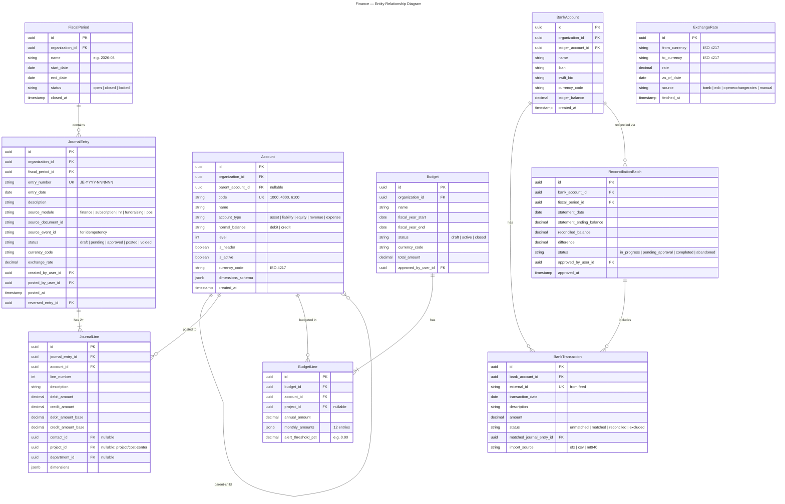
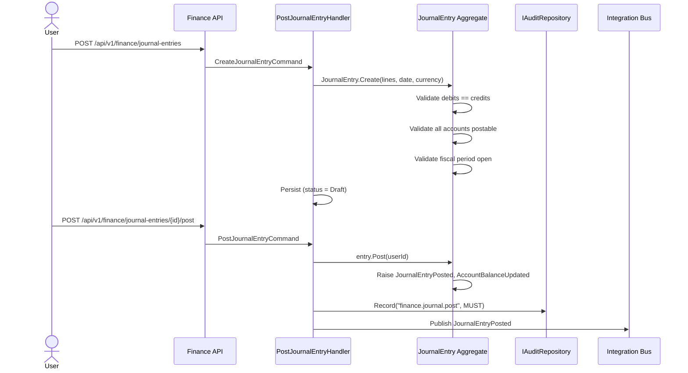
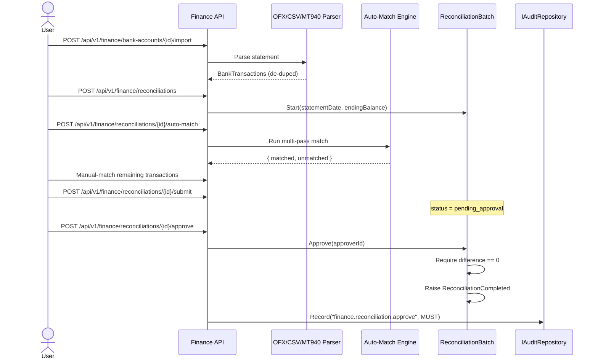
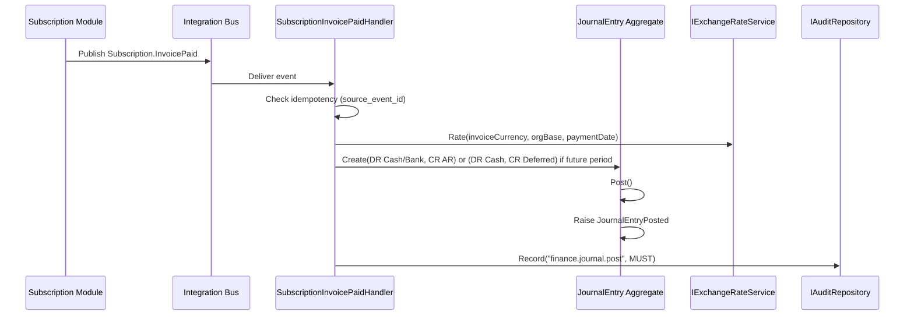
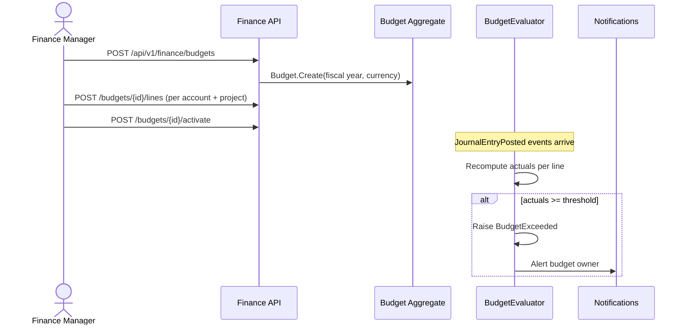
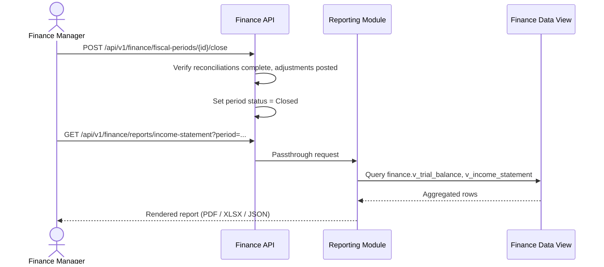
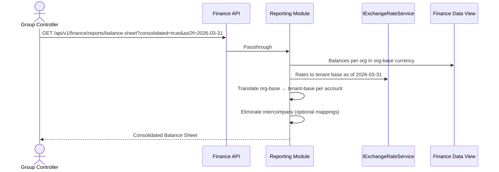

# Finance

**Tier:** 2 — Enterprise Core
**Module ID:** `finance`
**Status:** In Review — Prompt 2 Agent C, 2026-04-22

> Revision history: renamed from "Accounting" on 2026-04-22. NGO-specific ledgers
> (Zakat, donor-restricted funds) moved to Fundraising (Tier 3a). This spec is the
> generic, B2B-first general ledger for Nexora.

## Scope

Finance is the **organization-isolated general ledger and financial operations
backbone** of Nexora. It owns:

- Double-entry **general ledger (GL)** with enforced debit/credit balance.
- **Journal entries** (manual and system-sourced) with approval and posting workflow.
- **Chart of Accounts (COA)** — hierarchical, per organization.
- **Bank reconciliation** — statement import (OFX/CSV/MT940), auto-match, manual
  approval, completion.
- **Budget tracking** — fiscal-year aligned budgets with variance and overage alerts.
- **Expense management** — employee/vendor expense capture, approval chain, GL
  posting.
- **Tax reporting** — VAT/KDV-style rate registry, period tax summaries; detailed
  tax filing is delegated to the Reporting module.
- **Payroll integration** — consumes `HR.PayrollProcessed` to post the employee
  payroll journal (HR module, Phase 2.5).
- **Multi-currency conversion** — daily exchange-rate snapshots per
  [standards/multi-currency.md](../../../standards/multi-currency.md).
- **Project-based cost allocation** — dimensions on journal lines for cost centers
  and projects (replaces the previous donor-fund allocation pattern).
- **Subscription revenue recognition** — posts revenue journals in response to
  `Subscription.InvoicePaid`.

## Out of scope

- Donor-restricted fund accounting, Zakat ledger, grant-specific restricted funds
  → **Fundraising** (Tier 3a).
- Invoice generation, billing cycles, dunning, payment-gateway integration
  → **Subscription & Billing** (Tier 2).
- Tuition schedules, scholarship grants → **Subscription** (subscriber billing) and
  **Education** (Tier 3b) jointly.
- Point-of-sale transactions and COGS origination → **POS** (Phase 4); Finance only
  consumes `POS.SaleCompleted`.
- Payroll calculation, gross-to-net, statutory withholdings → **HR** (Phase 2.5);
  Finance only posts the resulting payroll journal.
- Pre-built report rendering, templating, scheduling → **Reporting** module;
  Finance publishes the data surface, Reporting renders.

## Dependencies

| Module | Relationship | Purpose |
|--------|--------------|---------|
| `identity` | **Required** | Tenant/org context, user resolution, RBAC enforcement. |
| `contacts` | **Required** | Vendor/payee resolution on journal lines and expenses, contact 360-view. |
| `audit` | **Required** | All journal posting, COA mutation, and reconciliation approval events are written through `IAuditRepository` per [ADR-009](../../../decisions/0009-audit-repository-pattern.md). |
| `reporting` | **Required** | Renders trial balance, income statement, balance sheet, cash flow templates against Finance's published data view. |
| `subscription` | Integration | Consumes `Subscription.InvoicePaid`, `Subscription.RefundIssued` to post AR/Revenue and refund journals. |
| `hr` | Integration (Phase 2.5) | Consumes `HR.PayrollProcessed` to post the employee payroll journal. |
| `fundraising` | Integration (Phase 3a) | Consumes `Fundraising.DonationConfirmed` — posts Bank/Cash ↔ Contributions Revenue; restricted-fund allocation stays inside Fundraising. |
| `pos` | Integration (Phase 4) | Consumes `POS.SaleCompleted` to post Cash/Revenue and COGS/Inventory. |
| `notifications` | Optional | Budget overage, reconciliation completion, approval-chain notifications. |
| `documents` | Optional | Expense receipt storage (MinIO). |

Tier classification per
[ADR-0016 Module Tier Classification](../../../decisions/0016-module-tier-classification.md):
Finance is **Tier 2 — Enterprise Core**, required for every B2B tenant.

Cross-module write interactions follow the distributed consistency patterns
defined in
[ADR-0014 Distributed Consistency Patterns](../../../decisions/0014-distributed-consistency-patterns.md)
— specifically the **integration-event + idempotent-apply** pattern; Finance
deduplicates inbound events on `(sourceModule, sourceEventId)`.

---

## Multi-Currency

Finance conforms to [standards/multi-currency.md](../../../standards/multi-currency.md):

- **Money** is the shared-kernel value object; Finance does **not** define its own.
- Base currency set: **TRY**, **USD**, **EUR** (JPY, GBP admissible when a tenant
  activates them). Each tenant elects a **tenant default currency**; each organization
  may override with its own base currency.
- **Exchange-rate providers**:
  - **TCMB** (Türkiye Cumhuriyet Merkez Bankası) for TRY pairs.
  - **ECB** for EUR pairs.
  - **OpenExchangeRates** for everything else.
  - Provider is swappable per tenant via `ITenantConfiguration` key
    `finance:exchange-rate-provider`.
- **Daily batch update** — a recurring `NexoraJob` named `finance:exchange-rates:daily-snapshot`
  on queue `maintenance` runs at 06:00 UTC, fetches rates from the configured
  provider(s), and writes a row per `(from, to, date)` to
  `finance_exchange_rates` in the tenant schema. Downstream queries read the
  snapshot, never the provider.
- Journal lines persist both **transaction currency** amounts and
  **organization-base-currency** amounts; consolidation additionally converts to
  **tenant base currency** at the reporting date's rate.
- Missing-rate scenarios fail explicitly with `lockey_finance_exchange_rate_unavailable`.
  Historical postings use the `AsOf` rate of the entry date — never today's rate.

**Type split clarification:**

- `Nexora.SharedKernel.ExchangeRate` — immutable value object: `ExchangeRate(string FromCurrency, string ToCurrency, decimal Rate, DateOnly AsOf)`. Used as a method parameter / return type by `IExchangeRateService`. Defined in ADR-0021.
- `Nexora.Modules.Finance.Domain.ExchangeRateRecord` — persistence entity in `finance_exchange_rates` table with audit columns (`ImportedFromSource`, `ImportedAt`, `ImportedByUserId`). Has an implicit cast to `SharedKernel.ExchangeRate` for consumption.
- Other modules (Subscription, Fundraising, etc.) only ever see the SharedKernel VO via `IExchangeRateService`; they never reference `ExchangeRateRecord` directly.

---

## Subscription Integration

Finance is the downstream GL for the Subscription module. On every
`Subscription.InvoicePaid` integration event, Finance **auto-posts a GL journal
entry**. On `Subscription.RefundIssued`, Finance posts the reversing entry.

### Subscription Revenue Recognition

**Account mapping** (default; COA codes configurable per organization):

| Subscription State | Debit | Credit | Trigger |
|--------------------|-------|--------|---------|
| Invoice issued (future service) | `1200 Accounts Receivable` | `2400 Deferred Revenue` | `Subscription.InvoiceIssued` (optional consumer; default off for simple tenants) |
| Invoice paid (service in period) | `1000 Cash / Bank` | `1200 Accounts Receivable` | `Subscription.InvoicePaid` |
| Revenue earned (period close) | `2400 Deferred Revenue` | `4000 Subscription Revenue` | Month-end recognition job |
| Refund issued | `4000 Subscription Revenue` | `1000 Cash / Bank` | `Subscription.RefundIssued` |

- **Deferred treatment** — when the paid period extends past the current fiscal
  period (e.g. annual plan paid upfront), the posting credits `Deferred Revenue`
  and a monthly recognition job (`finance:subscription:recognize-revenue`,
  queue `default`, runs on the 1st at 02:00 UTC per tenant) releases the
  ratable portion into `Subscription Revenue`.
- **Recognized treatment** — when the paid period is wholly within the current
  period (monthly plan paid in-month), the posting credits `Subscription Revenue`
  directly.
- **Idempotency** — every posted entry carries `source_module = "subscription"`
  and `source_document_id = <InvoiceId>`; handler rejects duplicate events on
  `(source_module, source_event_id)`.
- **Multi-currency** — the journal is posted in the invoice currency and
  translated to the organization base currency at the payment-date rate.

---

## Domain Model

### Entity Relationship Diagram

### Domain Events

| Event | Trigger |
|-------|---------|
| `JournalEntryPosted` | Journal entry transitions to Posted. |
| `AccountBalanceUpdated` | GL account running balance recomputed after post/void. |
| `BudgetExceeded` | Posted actuals cross a budget line's `alert_threshold_pct` or 100%. |
| `ReconciliationCompleted` | Reconciliation batch approved and finalized. |

---

## Use Cases

### UC-FIN-001 — Manual Journal Entry

**Actor**: User with `finance.journal.post`.
**Preconditions**: Open fiscal period, COA configured.

**Rules**: debits == credits; min 2 lines; no posting to header or inactive
accounts; immutable once posted (corrections via reversing entry).

---

### UC-FIN-002 — Bank Reconciliation (Auto-Match + Manual Approve)

**Actor**: User with `finance.bank.reconcile`.

---

### UC-FIN-003 — Auto-GL from Subscription Invoice

**Actor**: System (integration-event handler).

---

### UC-FIN-004 — Budget Allocation + Overage Alert

**Actor**: Finance Manager with `finance.budgets.manage`.

---

### UC-FIN-005 — Month-End Financials

**Actor**: Finance Manager with `finance.reports.read`.

---

### UC-FIN-006 — Multi-Currency Consolidation

**Actor**: Group Controller with `finance.reports.read` and consolidated scope.

---

## API Endpoints

All endpoints live under `/api/v1/finance/`. Each maps to a permission below.

| Category | Base Path | Notes |
|----------|-----------|-------|
| Accounts (COA) | `/api/v1/finance/accounts` | CRUD + tree traversal + balance. |
| Journal entries | `/api/v1/finance/journal-entries` | Create / submit / approve / post / void. |
| Budgets | `/api/v1/finance/budgets` | CRUD + lines + activate/close + variance. |
| Bank accounts | `/api/v1/finance/bank-accounts` | CRUD + statement import + transactions. |
| Reconciliations | `/api/v1/finance/reconciliations` | Start / auto-match / match / submit / approve / complete. |
| Reports | `/api/v1/finance/reports` | **Passthrough to Reporting**; Finance exposes a data view and the Reporting module renders templates (trial balance, income statement, balance sheet, cash flow, general ledger, consolidated). |

### Pre-built Reports (Reporting Integration)

Finance publishes a **read-optimized data view** (SQL views + materialized
aggregates in the tenant schema, prefixed `finance_v_`). The Reporting module owns
template rendering, scheduling, exports (PDF/XLSX/CSV), and delivery.

| Report | Finance Data View | Reporting Template |
|--------|-------------------|--------------------|
| Trial Balance | `finance_v_trial_balance` | `reporting.templates.finance.trial-balance` |
| Income Statement (P&L) | `finance_v_income_statement` | `reporting.templates.finance.income-statement` |
| Balance Sheet | `finance_v_balance_sheet` | `reporting.templates.finance.balance-sheet` |
| Cash Flow Statement | `finance_v_cash_flow` | `reporting.templates.finance.cash-flow` |

Integration surface:

- Finance **does not render**. `GET /api/v1/finance/reports/{name}` internally
  forwards to `/api/v1/reporting/run` with the template key and parameters
  (organization IDs, period, currency, consolidated flag).
- Report execution goes through Reporting's permission check
  (`finance.reports.read`) and Reporting's audit entry; Finance also records a
  `read-sensitive` audit row when the report contains PII-joined data (e.g.
  payee-level drilldown).

---

## Integration Events

### Events Produced

| Event | Topic | Payload (summary) |
|-------|-------|-------------------|
| `JournalEntryPosted` | `nexora.finance.journal` | `{ entryId, organizationId, entryNumber, entryDate, sourceModule, sourceDocumentId, totalBase, currency }` |
| `AccountBalanceUpdated` | `nexora.finance.accounts` | `{ accountId, organizationId, newBalance, currency, asOf }` |
| `BudgetExceeded` | `nexora.finance.budgets` | `{ budgetId, budgetLineId, accountId, thresholdPct, utilizedPct, amountOver }` |
| `ReconciliationCompleted` | `nexora.finance.reconciliation` | `{ reconciliationId, bankAccountId, statementDate, reconciledBalance }` |

### Events Consumed

| Event | Source | Phase | Action |
|-------|--------|-------|--------|
| `Subscription.InvoicePaid` | `subscription` | 2 | Post AR → Cash or Cash → Deferred Revenue journal (see Subscription Revenue Recognition). |
| `Subscription.RefundIssued` | `subscription` | 2 | Post Revenue → Cash reversing journal. |
| `HR.PayrollProcessed` | `hr` | 2.5 | Post the employee payroll journal (DR Salary Expense / CR Bank + statutory liability splits). |
| `POS.SaleCompleted` | `pos` | 4 | Post DR Cash/Bank — CR Sales Revenue; DR COGS — CR Inventory. |
| `Fundraising.DonationConfirmed` | `fundraising` | 3a | **If** `payload.is_restricted_fund == false`: Finance auto-posts DR Bank — CR Contributions Revenue. **If** `is_restricted_fund == true`: Finance **skips** auto-post; Fundraising itself posts the restricted-fund journal via `POST /api/v1/finance/journal-entries` using the restricted-fund account declared in the donation category. Finance never infers restriction classification; Fundraising owns it (ADR-0016, Tier-3 vertical). |
| `identity.organization.created` | `identity` | — | Seed default COA, default fiscal year, base currency set. |
| `contacts.contact.merged` | `contacts` | — | Rewrite `contact_id` references on journal lines and expenses. |

All inbound handlers are idempotent on `(source_module, source_event_id)` per
[ADR-0014](../../../decisions/0014-distributed-consistency-patterns.md).

---

## Permissions

All permissions follow `finance.{resource}.{action}`. See the module-scoped rows
appended to [standards/permissions.md](../../../standards/permissions.md).

| Permission | Purpose |
|------------|---------|
| `finance.accounts.read` | View COA and account balances. |
| `finance.accounts.manage` | Create / update / deactivate accounts. |
| `finance.journal.read` | View journal entries and lines. |
| `finance.journal.post` | Create, approve, post, void journal entries. |
| `finance.budgets.read` | View budgets and variance. |
| `finance.budgets.manage` | Create, activate, close budgets and lines. |
| `finance.bank.read` | View bank accounts and transactions. |
| `finance.bank.reconcile` | Import statements, match, approve reconciliations. |
| `finance.reports.read` | Run Finance-sourced reports via the Reporting module. |

## Audit Coverage

Per [standards/audit-coverage.md](../../../standards/audit-coverage.md) and
[ADR-0009](../../../decisions/0009-audit-repository-pattern.md):

- **MUST** audit — every journal posting (`finance.journal.post`), every COA
  mutation (create / update / deactivate on `finance.accounts.manage`), every
  reconciliation approval (`finance.bank.reconcile` — approve action).
- **MUST** audit (security-event class) — fiscal-period close / reopen / lock.
- **MAY** audit — report reads (the Reporting module owns the primary audit row;
  Finance emits a `read-sensitive` row only when the data view returns PII-joined
  rows such as payee drilldowns).

Module-scoped audit rows are appended to
[standards/audit-coverage.md](../../../standards/audit-coverage.md).

---

## Non-Functional Requirements

| Requirement | Target |
|-------------|--------|
| Journal post latency (p95) | < 200 ms |
| Auto-match throughput | >= 1,000 transactions / 5 s |
| Report data-view query (single org) | < 2 s |
| Consolidation query (10 orgs) | < 10 s |
| Double-entry integrity | 100% — DB constraint + domain invariant |
| Financial audit retention | 7 years minimum |
| Multi-currency precision | 6 decimal places on rate, `numeric(19,4)` storage |
| Exchange-rate snapshot freshness | Daily, 06:00 UTC |

---

Status: In Review — Prompt 2 Agent C, 2026-04-22
